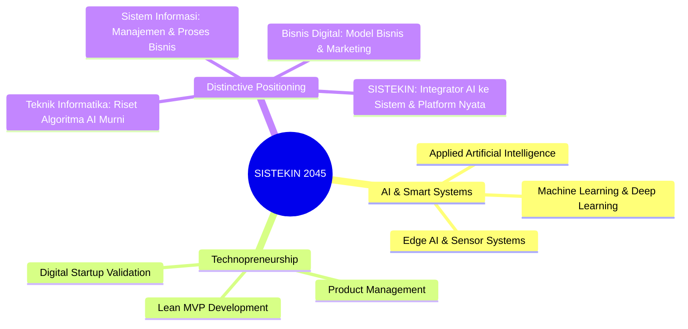
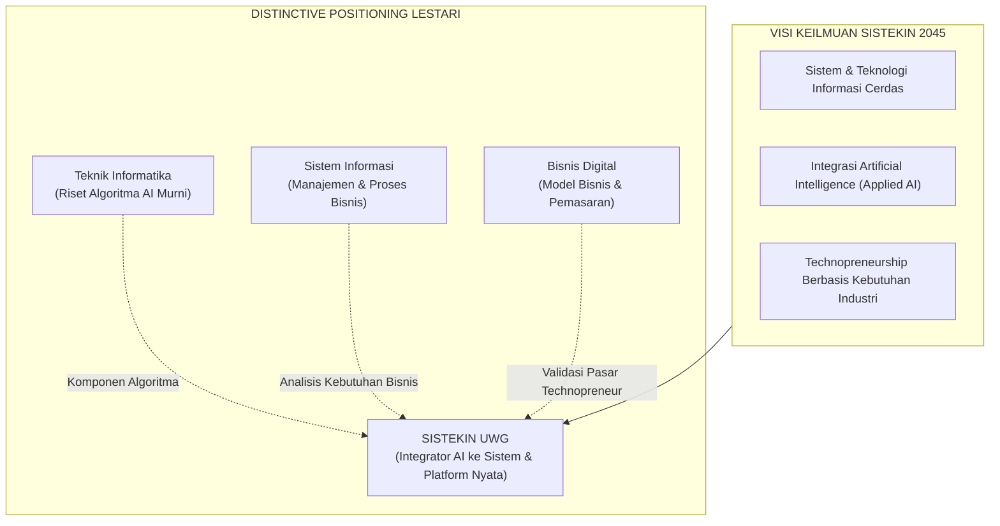

# 001 — ANALISIS VMTS DAN POSITIONING STRATEGIS
## Program Studi Sistem dan Teknologi Informasi (S1) — Fakultas Sains dan Teknologi Informasi (FSTI) Universitas Widyagama Malang

**Dokumen Revisi Definitif Kurikulum 2026**  
**Standar Rujukan:** Standar LAM INFOKOM Kriteria 1 (VMTS), Panduan Kurikulum OBE APTIKOM v2.0 (IS2020 & IT2017), ACM/IEEE Computing Curricula 2020.

---

### PETA PIKIRAN (MINDMAP) VMTS 2045 & POSITIONING PRODI

---

## 1. VISI, MISI, TUJUAN, DAN STRATEGI (VMTS)

### 1.1 Visi Keilmuan Program Studi SISTEKIN (Tahun 2045)
> **"Menjadi Program Studi Sistem dan Teknologi Informasi yang bermutu, mandiri, bermartabat, dan berwawasan global, serta unggul dalam pengembangan sistem dan teknologi informasi cerdas terintegrasi kecerdasan artifisial, serta technopreneurship berbasis kebutuhan masyarakat dan industri pada tahun 2045."**

### 1.2 Misi Program Studi SISTEKIN
1. **Pendidikan Berstandar OBE:** Menyelenggarakan pendidikan sarjana yang berkualitas internasional di bidang sistem dan teknologi informasi dengan fokus pada integrasi sistem cerdas (*AI & Smart Systems*) dan kewirausahaan teknologi (*Technopreneurship*).
2. **Penelitian Terapan Transformatif:** Mengembangkan riset inovatif dan solutif yang mengintegrasikan kecerdasan artifisial, infrastruktur komputasi awan, ketahanan siber, dan rekayasa platform digital untuk memecahkan permasalahan nyata di masyarakat dan industri.
3. **Pengabdian kepada Masyarakat (PkM) Tepat Guna:** Menerapkan hasil rekayasa teknologi dan sistem informasi cerdas untuk memberdayakan UMKM, institusi lokal, dan masyarakat guna mendukung transformasi digital nasional.
4. **Ekosistem Technopreneurship & Tata Kelola:** Membangun kemitraan strategis dengan industri global, komunitas open-source, dan ekosistem startup guna menumbuhkan budaya inovasi mandiri dan tata kelola program studi yang kredibel (Good University Governance).

### 1.3 Tujuan Strategis (Goals)
1. Menghasilkan lulusan yang menguasai kompetensi terintegrasi antara sistem informasi, infrastruktur teknologi informasi, dan rekayasa AI aplikatif dengan daya saing global.
2. Menghasilkan produk riset terapan dan publikasi ilmiah bereputasi yang berorientasi pada pemecahan masalah industri dan masyarakat cerdas (*Smart Society*).
3. Melahirkan inovator dan wirausahawan digital (*tech founders*) yang mampu menciptakan lapangan kerja mandiri melalui produk berbasis sistem cerdas.
4. Membangun jejaring kolaborasi tri-dharma dengan industri nasional dan internasional serta asosiasi profesi (APTIKOM, IEEE, ACM).

---

## 2. DISTINCTIVE POSITIONING (KEKHASAN DAN KEUNGGULAN STRATEGIS)

Program Studi Sistem dan Teknologi Informasi (SISTEKIN) FSTI Universitas Widyagama Malang memiliki posisi pembeda (*unique positioning*) yang tegas dibandingkan program studi serumpun lainnya di bidang *computing*:

| Program Studi | Fokus Utama Keilmuan & Peran Kompetensi |
|---|---|
| **Teknik Informatika / Ilmu Komputer** | Teori komputasi, algoritma fundamental murni, arsitektur internal perangkat keras, serta riset model matematika kecerdasan buatan. |
| **SISTEKIN (Sistem & Teknologi Informasi)** | **PEREKAYASA & PENGINTEGRASI SISTEM CERDAS NYATA (AI Integrator):** Mengintegrasikan model AI, infrastruktur cloud & IoT, keamanan siber, dan platform digital ke dalam proses bisnis dan organisasi dengan semangat kemandirian Technopreneurship. |
| **Bisnis Digital / Manajemen** | Strategi pemasaran digital, model finansial, operasional bisnis, dan manajemen e-commerce (tanpa fokus pada rekayasa kode/infra). |

### Karakteristik "AI & Smart Systems Integrator":
* Lulusan SISTEKIN bukan hanya menjadi *consumer* perangkat lunak, tetapi **pembangun solusi (*solution builder*)** yang menghubungkan model Machine Learning / Deep Learning dengan arsitektur komputasi awan, sensor IoT, antarmuka pengguna interaktif, dan tata kelola keamanan informasi yang tangguh.
* Setiap lulusan dibekali fondasi *technopreneurship* terstruktur melalui ekosistem Capstone Project dan inkubasi inovasi sejak semester awal.

---

## 3. ENVIRONMENTAL SCANNING & ANALISIS SWOT (LAM INFOKOM KRITERIA 1)

| STRENGTHS (Kekuatan Internal) | WEAKNESSES (Kelemahan Internal) |
|---|---|
| 1. Kurikulum modern berbasis OBE terkini (APTIKOM v2.0, IS2020, IT2017). 2. Visi keilmuan yang sangat fokus dan relevan: AI Integration & Technopreneurship. 3. Paket SKS terstruktur (146 SKS / 55 MK) dengan 3 peminatan seimbang. 4. Adanya pilar Capstone & opsi Tugas Akhir non-skripsi. | 1. Status program studi baru yang belum memiliki rekam jejak alumni (*tracer study*). 2. Kebutuhan peningkatan kapasitas dosen dalam sertifikasi industri bertaraf global. 3. Fasilitas laboratorium spesialisasi cerdas yang sedang dalam proses akselerasi. |
| **OPPORTUNITIES (Peluang Eksternal)** | **THREATS (Ancaman Eksternal)** |
| 1. Lonjakan kebutuhan industri terhadap Data/AI Engineer & Cloud Architect. 2. Kebijakan Permendikbudristek 53/2023 yang memberi fleksibilitas MBKM & TA. 3. Kemitraan strategis Malang Raya sebagai kota pendidikan & hub digital. | 1. Kecepatan disrupsi teknologi AI generatif yang dapat mengusir kurikulum usang. 2. Persaingan ketat dengan prodi TI/SI konvensional dari PTN/PTS mapan. 3. Standar kompetensi industri yang menuntut penguasaan sertifikasi internasional. |

### Strategi Transformasi Matriks SWOT:
* **Strategi S-O (Maxi-Maxi):** Mengkapitalisasi visi *AI Integrator* dan kurikulum fleksibel 146 SKS untuk menarik talenta mahasiswa dan menjalin kemitraan MBKM dengan industri teknologi nasional.
* **Strategi W-O (Mini-Maxi):** Memanfaatkan kemitraan industri global (Google, AWS, Microsoft, Oracle Academy) untuk sertifikasi dosen dan mahasiswa guna menutup kelemahan usia prodi.
* **Strategi S-T (Maxi-Mini):** Memastikan ekosistem *PjBL (Project-based Learning)* dan *Capstone Project* menghasilkan portofolio nyata yang melampaui kemampuan lulusan konvensional di pasar kerja.
* **Strategi W-T (Mini-Mini):** Menetapkan sistem penjaminan mutu PPEPP yang ketat sejak tahun pertama agar setiap luaran mata kuliah terukur secara objektif sesuai standar akreditasi LAM INFOKOM.

---

## 4. KESIMPULAN DAN ARAH DOKUMEN REVISI

Analisis VMTS dan posisi strategis ini menjadi landasan formal bagi:
1. **Formulasi 3 PEO Berbasis Peran** (*Professional, Technopreneur, Lifelong Learner*).
2. **Formulasi 4 Profil Lulusan (PL)** yang terintegrasi penuh dengan 3 Peminatan dan Ekosistem Capstone.
3. **Penyelarasan 14 CPL Formal** sesuai Body of Knowledge APTIKOM IS2020 & IT2017.

---
*Disahkan sebagai Dokumen Resmi 001 — Kurikulum OBE Revisi SISTEKIN 2026.*  
**Tim Pengembang Kurikulum FSTI Universitas Widyagama Malang**
