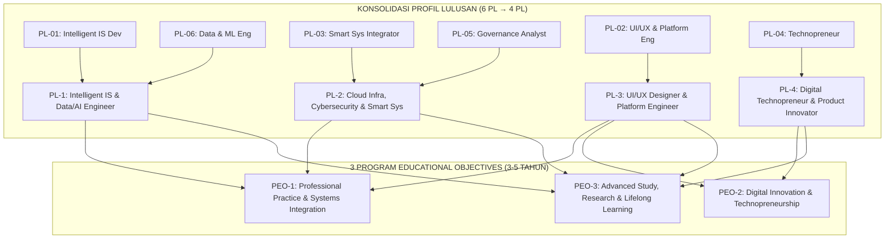

# 002 — FORMULASI 3 PROGRAM EDUCATIONAL OBJECTIVES (PEO) DAN 4 PROFIL LULUSAN (PL)
## Program Studi Sistem dan Teknologi Informasi (S1) — Fakultas Sains dan Teknologi Informasi (FSTI) Universitas Widyagama Malang

**Dokumen Revisi Definitif Kurikulum 2026**  
**Standar Rujukan:** Standar LAM INFOKOM Kriteria 1 & 9, Panduan Kurikulum OBE APTIKOM v2.0 (IS2020 & IT2017), Standar Akreditasi Internasional IABEE (Kriteria 1), ACM/IEEE CC2020.

---

### VISUALISASI ARSITEKTUR: PELEBURAN PROFIL & 3 PEO



---

## 1. SEJARAH, ANALISIS, DAN ALASAN PENYATUAN PROFIL LULUSAN (DARI 6 PL MENJADI 4 PL)

### 1.1 Latar Belakang Model 6 Profil Lulusan (Draf Awal Kurikulum 2025/2026)
Pada fase perancangan awal kurikulum SISTEKIN (Dokumen 008 pada arsip historis `KURIKULUM2026_ZCODE`), dirumuskan 6 Profil Lulusan (`PL-01` s.d. `PL-06`):
1. `PL-01`: *Intelligent Information System Developer*
2. `PL-02`: *UI/UX Designer & Digital Platform Engineer*
3. `PL-03`: *Smart System & Technology Integrator*
4. `PL-04`: *Technopreneur*
5. `PL-05`: *Digital System & Technology Governance Analyst*
6. `PL-06`: *Data Analyst & Machine Learning Engineer*

Model 6 PL tersebut merupakan hasil dekonstruksi granular awal untuk memetakan seluruh kemungkinan peran okupasi di industri teknologi informasi.

---

### 1.2 Analisis Kritis Kelemahan Model 6 PL (Audit Asesor LAM INFOKOM & IABEE)
Berdasarkan audit kelayakan implementasi kurikulum OBE, ditemukan 4 kelemahan fundamental pada model 6 PL:

1. **Risiko Fragmentasi Data Tracer Study (*Small Sample Bias*):**
   * Sesuai Standar LAM INFOKOM Kriteria 9 (Luaran dan Capaian Tridharma), ketercapaian Profil Lulusan dan PEO wajib dievaluasi melalui *Tracer Study*.
   * Dengan 6 PL, pada angkatan-angkatan awal (jumlah mahasiswa $\pm 30-50$ per tahun), jumlah lulusan yang mengisi tiap profil akan sangat sedikit ($3-5$ orang per profil). Hal ini menimbulkan bias statistik yang tinggi dan menyulitkan evaluasi berkala mutu lulusan (PPEPP).
2. **Tumpang Tindih Peran (*Role Overlapping*) di Industri Nyata:**
   * Di industri modern, peran *Data/ML Engineer* (`PL-06`) dan *Intelligent IS Developer* (`PL-01`) berada dalam satu kontinum rekayasa perangkat lunak cerdas. Memisahkannya ke dalam profil sarjana terpisah menciptakan ambiguitas kurikulum.
   * Peran *Governance Analyst* (`PL-05`) sangat erat berkaitan dengan arsitektur infrastruktur, cloud, dan ketahanan siber (`PL-03`). Pemisahan tersebut membuat profil tata kelola terkesan teoritis tanpa penguasaan infrastruktur teknis.
3. **Rekomendasi Standar Kurikulum APTIKOM & IABEE:**
   * Panduan Kurikulum OBE APTIKOM v2.0 dan IABEE merekomendasikan sebuah program studi sarjana strata satu (S1) menetapkan **3 hingga 5 Profil Lulusan inti** (*sweet spot* 4 PL) agar profil lulusan memiliki fokus yang tajam, kredibel, dan mudah dikenali oleh *employers* (pengguna lulusan).
4. **Penyelarasan Struktural 1:1 terhadap 3 Peminatan + 1 Pilar Kewirausahaan:**
   * Kurikulum SISTEKIN memiliki 3 Peminatan Spesialisasi (@ 18 SKS / 6 MK) dan 1 Pilar Capstone Technopreneurship. Model 4 PL menciptakan simetri sempurna: **3 PL berbasis Peminatan Teknis + 1 PL berbasis Kewirausahaan Mandiri**.

---

### 1.3 Matriks Migrasi dan Rekonsiliasi (Peleburan 6 PL → 4 PL)

Proses penyatuan profil ini dilakukan **tanpa menghilangkan satu pun kompetensi/bahan kajian**, melainkan mengkonsolidasikannya menjadi lebih kokoh dan selaras dengan kebutuhan industri terkini:

```
┌──────────────────────────────────────────────────────────────────────────────────────────────────┐
│                   MATRIKS REKONSILIASI & PELEBURAN PROFIL LULUSAN SISTEKIN                       │
├────────┬─────────────────────────┬────────┬─────────────────────────┬────────────────────────────┤
│ Kode   │ Profil Lama (6 PL)      │ Kode   │ Profil Baru (4 PL)      │ Rasionalisasi Integrasi    │
├────────┼─────────────────────────┼────────┼─────────────────────────┼────────────────────────────┤
│ PL-01  │ Intelligent IS Dev      │ PL-1   │ Intelligent Information │ Menggabungkan rekayasa     │
│ PL-06  │ Data Analyst & ML Eng   │        │ Systems & Data/AI       │ perangkat lunak cerdas dan │
│        │                         │        │ Engineer                │ pipeline data/MLOps.       │
├────────┼─────────────────────────┼────────┼─────────────────────────┼────────────────────────────┤
│ PL-03  │ Smart System Integrator │ PL-2   │ Cloud Infrastructure,   │ Mengintegrasikan infrastruk│
│ PL-05  │ Governance Analyst      │        │ Cybersecurity & Smart   │ tur cloud, IoT, keamanan   │
│        │                         │        │ Systems Integrator      │ siber, dan tata kelola TI. │
├────────┼─────────────────────────┼────────┼─────────────────────────┼────────────────────────────┤
│ PL-02  │ UI/UX & Platform Eng    │ PL-3   │ UI/UX Designer &        │ Mempertahankan keunggulan  │
│        │                         │        │ Digital Platform        │ rekayasa frontend, UI/UX,  │
│        │                         │        │ Engineer                │ dan arsitektur platform.   │
├────────┼─────────────────────────┼────────┼─────────────────────────┼────────────────────────────┤
│ PL-04  │ Technopreneur           │ PL-4   │ Digital Technopreneur & │ Mempertegas peran founder, │
│        │                         │        │ IT Product Innovator    │ product owner, dan agile   │
│        │                         │        │                         │ startup innovator.         │
└────────┴─────────────────────────┴────────┴─────────────────────────┴────────────────────────────┘
```

---

## 2. FORMULASI DEFINITIF 4 PROFIL LULUSAN (PL) SISTEKIN 2026

```
┌──────────────────────────────────────────────────────────────────────────────────────────────────┐
│                             4 PROFIL LULUSAN SISTEKIN (KKNI LEVEL 6)                             │
├──────┬───────────────────────────────────────────┬───────────────────┬───────────────────────────┤
│ Kode │ Profil Lulusan                            │ Basis Peminatan   │ CPL Khusus Utama          │
├──────┼───────────────────────────────────────────┼───────────────────┼───────────────────────────┤
│ PL-1 │ Intelligent Information Systems & Data/AI │ P1: Integrated    │ • KK1 (AI & ML System)    │
│      │ Engineer                                  │     Smart Systems │ • KK2 (Data & MLOps)      │
├──────┼───────────────────────────────────────────┼───────────────────┼───────────────────────────┤
│ PL-2 │ Cloud Infrastructure, Cybersecurity &     │ P2: Cloud Infra & │ • KK3 (Cloud, IoT, Cyber) │
│      │ Smart Systems Integrator                  │     Cybersecurity │ • KK4 (IT Governance)     │
├──────┼───────────────────────────────────────────┼───────────────────┼───────────────────────────┤
│ PL-3 │ UI/UX Designer & Digital Platform         │ P3: Digital Plat- │ • KK5 (UI/UX & Platform)  │
│      │ Engineer                                  │     form Eng.     │ • P4  (Software & Web/Mob)│
├──────┼───────────────────────────────────────────┼───────────────────┼───────────────────────────┤
│ PL-4 │ Digital Technopreneur & IT Product        │ Lintas Peminatan /│ • KK6 (Techno & Agile)    │
│      │ Innovator                                 │ Capstone Ecosystem│ • S1, KU1, KU2, KU3       │
└──────┴───────────────────────────────────────────┴───────────────────┴───────────────────────────┘
```

### Rincian Deskripsi dan Capaian Tiap Profil:

#### 1. PL-1: Intelligent Information Systems & Data/AI Engineer
* **Deskripsi:** Sarjana yang memiliki kemampuan menganalisis kebutuhan organisasi, merancang arsitektur sistem informasi cerdas terintegrasi, merekayasa pipeline data skala besar (*Data Engineering*), mengembangkan model pembelajaran mesin (*Machine Learning/Deep Learning*), serta menerapkan operasionalisasi model (*MLOps*) ke dalam aplikasi enterprise nyata.
* **Peran/Profesi Industri:** *AI Software Developer, Data Engineer, Machine Learning Engineer, Business Intelligence Specialist, Intelligent System Analyst.*

#### 2. PL-2: Cloud Infrastructure, Cybersecurity & Smart Systems Integrator
* **Deskripsi:** Sarjana yang memiliki kemampuan merancang, mengimplementasikan, dan mengelola infrastruktur komputasi awan (*Cloud Native/DevOps*), mengintegrasikan perangkat IoT dan sistem cerdas (*Smart City/Smart Campus*), mengamankan aset informasi melalui pertahanan siber (*Cybersecurity & Vulnerability Assessment*), serta menegakkan tata kelola dan audit TI (*COBIT/ITIL/ISO 27001*).
* **Peran/Profesi Industri:** *Cloud Architect/DevOps Engineer, Cybersecurity Analyst, Smart Systems/IoT Integrator, IT Infrastructure Engineer, IT Governance & Audit Specialist.*

#### 3. PL-3: UI/UX Designer & Digital Platform Engineer
* **Deskripsi:** Sarjana yang memiliki kemampuan merancang arsitektur interaksi dan pengalaman pengguna berbasis riset (*UI/UX Design*), merekayasa antarmuka modern (*Web & Mobile Frontend*), membangun arsitektur layanan mikro (*Microservices*), serta mengintegrasikan platform digital terdistribusi skala besar untuk transformasi proses bisnis.
* **Peran/Profesi Industri:** *UI/UX Designer, Frontend/Fullstack Platform Engineer, Mobile Application Engineer, Digital Experience Specialist, Solution Architect.*

#### 4. PL-4: Digital Technopreneur & IT Product Innovator
* **Deskripsi:** Sarjana yang memiliki jiwa kewirausahaan teknologi, kemampuan mengidentifikasi celah pasar (*Market Validation*), merancang model bisnis inovatif (*Lean Startup*), membangun produk minimum yang layak (*MVP*), mengelola proyek TI menggunakan kerangka kerja *Agile/Scrum*, serta mendirikan dan memimpin usaha rintisan (*tech startup*) berbasis sistem cerdas.
* **Peran/Profesi Industri:** *Tech Startup Founder, IT Product Manager, Agile Project Manager, Digital Transformation Consultant, Technology Business Specialist.*

---

## 3. FORMULASI 3 PROGRAM EDUCATIONAL OBJECTIVES (PEO)

Program Educational Objectives (PEO) menggambarkan pencapaian karier dan profesional yang diharapkan diraih oleh alumni SISTEKIN **3 hingga 5 tahun setelah kelulusan**:

```
┌─────────────────────────────────────────────────────────────────────────────────────────────────┐
│                        3 PROGRAM EDUCATIONAL OBJECTIVES (PEO) SISTEKIN                          │
├──────────┬──────────────────────────────────────────────────────────────────────────────────────┤
│ Kode PEO │ Nomenklatur & Pernyataan Formal Objektif Pendidikan (3–5 Tahun Pasca Kelulusan)      │
├──────────┼──────────────────────────────────────────────────────────────────────────────────────┤
│ PEO-1    │ PEO-1 — Professional Practice and Systems Integration                                │
│          │ "Dalam 3–5 tahun setelah lulus, alumni mampu berkarier secara profesional dalam      │
│          │ menganalisis, merancang, mengembangkan, mengintegrasikan, mengamankan, atau          │
│          │ mengelola sistem dan teknologi informasi cerdas sesuai kebutuhan organisasi,         │
│          │ industri, dan masyarakat."                                                           │
├──────────┼──────────────────────────────────────────────────────────────────────────────────────┤
│ PEO-2    │ PEO-2 — Digital Innovation and Technopreneurship                                     │
│          │ "Dalam 3–5 tahun setelah lulus, alumni mampu menghasilkan inovasi, produk, layanan,  │
│          │ perbaikan proses, atau usaha digital yang relevan, etis, berkelanjutan, dan          │
│          │ memberikan nilai tambah bagi pengguna, organisasi, industri, atau masyarakat."       │
├──────────┼──────────────────────────────────────────────────────────────────────────────────────┤
│ PEO-3    │ PEO-3 — Advanced Study, Research, and Lifelong Learning                              │
│          │ "Dalam 3–5 tahun setelah lulus, alumni mampu mengembangkan kompetensi melalui studi  │
│          │ lanjut (S2/S3), penelitian terapan, sertifikasi profesional, komunitas keilmuan,     │
│          │ atau pembelajaran sepanjang hayat serta menunjukkan kepemimpinan sesuai konteksnya." │
└──────────┴──────────────────────────────────────────────────────────────────────────────────────┘
```

### 3.1 Atribut Kepemimpinan (*Leadership*) Lintas-PEO
Dalam kerangka PEO SISTEKIN, **kepemimpinan (*leadership*) bukan merupakan PEO terpisah**, melainkan kompetensi esensial yang melekat pada seluruh jalur PEO:
* Pada **PEO-1 (Praktik Profesional):** Memimpin tim teknis, memandu arsitektur proyek, atau memimpin inisiatif transformasi digital.
* Pada **PEO-2 (Technopreneurship):** Memimpin perintisan startup, memvalidasi visi produk, dan memimpin tim lintas fungsi.
* Pada **PEO-3 (Akademisi/Riset):** Memimpin kelompok kajian riset, laboratorium, publikasi ilmiah, atau menginisiasi proyek riset kolaboratif.

---

## 4. MATRIKS KETERLACAKAN STRATEGIS: VMTS ↔ 3 PEO ↔ 4 PL ↔ 14 CPL

```
┌─────────────────────────────────────────────────────────────────────────────────────────────────┐
│                        MATRIKS KETERLACAKAN STRATEGIS KURIKULUM OBE                             │
├─────────────────────┬──────────┬───────────────────┬────────────────────────────────────────────┤
│ Pilar Utama VMTS    │ Target   │ Profil Lulusan    │ Pasangan CPL Pendukung Utama               │
│ (Visi 2045)         │ PEO      │ Terkait (PL)      │ (14 CPL Terstandar)                        │
├─────────────────────┼──────────┼───────────────────┼────────────────────────────────────────────┤
│ AI & Smart Systems  │ PEO-1    │ PL-1 & PL-2       │ • P1, P2 (Fondasi Matematika & Sistem)     │
│ Integration         │ PEO-3    │                   │ • KK1 (Pengembangan AI & Smart Systems)    │
│                     │          │                   │ • KK2 (Rekayasa Data & MLOps)              │
│                     │          │                   │ • KK3 (Cloud, IoT & Keamanan Informasi)    │
│                     │          │                   │ • KK4 (Tata Kelola & Audit TI)             │
├─────────────────────┼──────────┼───────────────────┼────────────────────────────────────────────┤
│ Modern Platform &   │ PEO-1    │ PL-3              │ • P4 (Rekayasa Perangkat Lunak, Web & Mob) │
│ Digital Experience  │ PEO-2    │                   │ • KK5 (UI/UX Design & Platform Engine)     │
│                     │          │                   │ • KU1, KU2 (Pemikiran Logis & Kerja Tim)   │
├─────────────────────┼──────────┼───────────────────┼────────────────────────────────────────────┤
│ Technopreneurship   │ PEO-2    │ PL-4              │ • S1 (Etika, Nilai Luhur, Integritas)      │
│ & Kemandirian       │ PEO-3    │ (Lintas Profil)   │ • KU3 (Kemampuan Komunikasi & Presentasi)  │
│                     │          │                   │ • P3 (Manajemen Proyek TI & Inovasi)       │
│                     │          │                   │ • KK6 (Technopreneurship & Agile Startup)  │
└─────────────────────┴──────────┴───────────────────┴────────────────────────────────────────────┘
```

---

## 5. RENCANA PENGUKURAN DAN EVALUASI PEO (PEO MEASUREMENT PLAN — PPEPP)

Sebagai program studi baru yang sedang bertumbuh, SISTEKIN menerapkan evaluasi PEO secara bertahap dan terencana:

```
┌──────────────────────────────────────────────────────────────────────────────────────────────────┐
│                            SIKLUS EVALUASI PEO BERBASIS PPEPP                                    │
├───────────────────┬──────────────────────┬───────────────────────────────────────────────────────┤
│ Periode / Tahap   │ Fokus Evaluasi       │ Instrumen & Sumber Data                               │
├───────────────────┼──────────────────────┼───────────────────────────────────────────────────────┤
│ Setiap Semester   │ Capaian CPL & CPMK   │ Asesmen MK, Rubrik Penilaian, Portofolio Mahasiswa    │
├───────────────────┼──────────────────────┼───────────────────────────────────────────────────────┤
│ Setiap Tahun      │ Relevansi Kurikulum  │ FGD Industri, Advisory Board, Masukan Dosen/Mitra     │
├───────────────────┼──────────────────────┼───────────────────────────────────────────────────────┤
│ Saat Kelulusan    │ Kesiapan Kerja (Day1)│ Exit Survey, Capaian Portofolio SKPI, Sertifikasi     │
├───────────────────┼──────────────────────┼───────────────────────────────────────────────────────┤
│ 1 Tahun Pasca-Lulus│ Transisi Karier Awal │ Tracer Study Awal (Waktu Tunggu, Gaji Pertama)        │
├───────────────────┼──────────────────────┼───────────────────────────────────────────────────────┤
│ 3–5 Tahun Pasca-  │ Ketercapaian PEO     │ Tracer Study PEO, Employer Survey (Survei Kepuasan    │
│ Lulus             │ Definitif            │ Pengguna Lulusan), Portofolio Usaha/Publikasi Alumni  │
└───────────────────┴──────────────────────┴───────────────────────────────────────────────────────┘
```

---
*Disahkan sebagai Dokumen Resmi 002 — Kurikulum OBE Revisi SISTEKIN 2026.*  
**Tim Pengembang Kurikulum FSTI Universitas Widyagama Malang**
