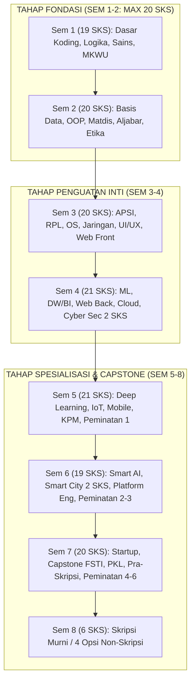

# 005 — STRUKTUR KURIKULUM 8 SEMESTER DAN PEMINATAN
## Program Studi Sistem dan Teknologi Informasi (S1) — Fakultas Sains dan Teknologi Informasi (FSTI) Universitas Widyagama Malang

**Dokumen Revisi Definitif Kurikulum 2026**  
**Standar Rujukan:** Permendikbudristek No. 53 Tahun 2023, Panduan Kurikulum OBE APTIKOM v2.0 (IS2020 & IT2017), Standar IABEE & LAM INFOKOM.

---

### VISUALISASI STRUKTUR 8 SEMESTER & ALUR PRASYARAT

### ALUR PERJALANAN AKADEMIK MAHASISWA (JOURNEY)

| Tahun 1 (Sem 1–2) | Tahun 2 (Sem 3–4) | Tahun 3 (Sem 5–6) | Tahun 4 (Sem 7) | Tahun 4 (Sem 8) |
|---|---|---|---|---|
| **Fondasi Sains & Pemrograman** | **Rekayasa Core Sistem & Cloud** | **Spesialisasi Peminatan & AI** | **Capstone Project & PKL Industri** | **Skripsi Murni / 4 Opsi Non-Skripsi** |

---

## 1. REKAPITULASI DAN DISTRIBUSI BEBAN STUDI

Kurikulum Program Studi Sistem dan Teknologi Informasi (S1) menetapkan paket wajib kelulusan mahasiswa sebesar **146 SKS** yang terdistribusi ke dalam **55 Mata Kuliah**:

### REKAPITULASI KOMPOSISI KURIKULUM 2026

| Komponen Mata Kuliah | Jumlah MK | Total SKS | Persentase Beban |
|---|:---:|:---:|:---:|
| Mata Kuliah Wajib Umum (MKWU) | 8 MK | 13 SKS | 8,9% |
| Mata Kuliah Wajib Fakultas (FSTI) | 13 MK | 36 SKS | 24,7% |
| Mata Kuliah Inti Program Studi (Core STI) | 28 MK | 79 SKS | 54,1% |
| Mata Kuliah Pilihan Peminatan (Elektif) | 6 MK | 18 SKS | 12,3% |
| **TOTAL PAKET DITEMPUH MAHASISWA** | **55 MK** | **146 SKS** | **100,0%** |
| *Portofolio MK Ditawarkan (SIAKAD)* | *67 MK* | *182 SKS* | *18 MK Elektif* |

> [!IMPORTANT]
> **Kepatuhan Regulasi Nasional & Akreditasi:**
> 1. **Beban Kelulusan:** 146 SKS (Memenuhi dan melampaui syarat minimal 144 SKS Permendikbudristek No. 53/2023).
> 2. **Batas Semester 1 & 2:** Semester 1 (19 SKS) dan Semester 2 (20 SKS) $\le 20\text{ SKS}$ (Pasal 18 Permendikbudristek No. 53/2023).
> 3. **Proporsi Praktikum:** 20 Mata Kuliah (63 SKS / 43,2%) dilengkapi laboratorium praktikum hands-on.

---

## 2. SEBARAN 8 SEMESTER KURIKULUM SISTEKIN (55 MK / 146 SKS)

### SEBARAN 8 SEMESTER KURIKULUM SISTEKIN

| Semester | Fokus Pembelajaran | Jml MK | Jml SKS | Karakteristik Kurikulum |
|:---:|---|:---:|:---:|---|
| **Sem 1** | Fondasi Sains & MKWU | 8 MK | 19 SKS | Sains, Algoritma Dasar, Logika, Agama |
| **Sem 2** | Data, Matdis & Etika | 8 MK | 20 SKS | Struktur Data, Basis Data, Matdis, Etika |
| **Sem 3** | RPL, UI/UX & Infra | 7 MK | 20 SKS | APSI, RPL, Web Front, Jarkom, OS, Cerdas |
| **Sem 4** | AI/ML, NLP, Cloud & Keamanan | 8 MK | 21 SKS | ML, NLP/IR, DW/BI, Web Back, Cloud, Probstat |
| **Sem 5** | Deep Learning & IoT | 7 MK | 21 SKS | Deep Learning, IoT, Mobile, KPM, Peminatan 1 |
| **Sem 6** | AI Integrasi & Platform | 7 MK | 19 SKS | Smart AI, Smart City, Platform, Metopel |
| **Sem 7** | Capstone, PKL & Sempro | 7 MK | 20 SKS | Startup, Capstone FSTI, PKL, Pra-Skripsi |
| **Sem 8** | Skripsi Mandiri | 1 MK | 6 SKS | Skripsi Murni / 4 Opsi Non-Skripsi |
| **TOTAL** | **Paket Lulus Tepat Waktu** | **55 MK** | **146 SKS** | **Standar Sarjana S1 Komputasi** |

---

## 3. STRUKTUR DETAIL MATA KULIAH PER SEMESTER

### SEMESTER 1 (19 SKS) — Fondasi Sains, Algoritma, Arsitektur STI & MKWU
| No | Kode MK | Nama Mata Kuliah | SKS | Tipe | Kategori | Prasyarat |
|:---:|:---:|---|:---:|:---:|:---:|---|
| 1 | `FST-101` | Dasar Teknologi Digital | 2 | Teori | FSTI | — |
| 2 | `FST-102` | Algoritma dan Pemrograman | 3 | +P | FSTI | — |
| 3 | `STI-101` | Pengantar Sistem dan Teknologi Informasi | 2 | Teori | Core STI | — |
| 4 | `STI-102` | Kalkulus | 3 | Teori | Core STI | — |
| 5 | `STI-103` | Arsitektur dan Organisasi Sistem Teknologi Informasi | 3 | Teori | Core STI | — |
| 6 | `MKU-101` | Agama I | 2 | Teori | MKWU | — |
| 7 | `MKU-102` | Pancasila | 2 | Teori | MKWU | — |
| 8 | `MKU-103` | Bahasa Indonesia | 2 | Teori | MKWU | — |
| **SUBTOTAL** | — | **Total SKS Semester 1 (8 MK)** | **19** | — | — | **Kumulatif: 19 SKS** |

---

### SEMESTER 2 (20 SKS) — Fondasi Data, Matdis & Logika, Aljabar & Etika
| No | Kode MK | Nama Mata Kuliah | SKS | Tipe | Kategori | Prasyarat |
|:---:|:---:|---|:---:|:---:|:---:|---|
| 9 | `STI-201` | Matematika Diskrit dan Logika | 3 | Teori | Core STI | `STI-103` |
| 10 | `STI-202` | Aljabar Linear dan Matriks | 3 | Teori | Core STI | `STI-102` |
| 11 | `FST-203` | Struktur Data dan Algoritma | 3 | +P | FSTI | `FST-102` |
| 12 | `FST-204` | Pengantar Kecerdasan Artifisial & Data | 2 | Teori | FSTI | `FST-101` |
| 13 | `FST-205` | Basic English for IT | 2 | Teori | FSTI | — |
| 14 | `FST-206` | Etika Profesi & Hukum Digital | 2 | Teori | FSTI | — |
| 15 | `FST-207` | Sistem Basis Data | 3 | +P | FSTI | `FST-102` |
| 16 | `MKU-204` | Kewirausahaan I | 2 | Teori | MKWU | — |
| **SUBTOTAL** | — | **Total SKS Semester 2 (8 MK)** | **20** | — | — | **Kumulatif: 39 SKS** |

---

### SEMESTER 3 (20 SKS) — Penguatan Core RPL, OS & Jaringan Komputer
| No | Kode MK | Nama Mata Kuliah | SKS | Tipe | Kategori | Prasyarat |
|:---:|:---:|---|:---:|:---:|:---:|---|
| 17 | `STI-301` | Analisis dan Perancangan Sistem Informasi | 3 | Teori | Core STI | `STI-104`, `FST-207` |
| 18 | `STI-302` | Kecerdasan Buatan (Artificial Intelligence) | 3 | +P | Core STI | `STI-201`, `STI-202` |
| 19 | `STI-303` | Desain Pengalaman Pengguna (UI/UX Design) | 3 | +P | Core STI | `STI-104` |
| 20 | `STI-304` | Rekayasa Perangkat Lunak | 3 | Teori | Core STI | `STI-202` |
| 21 | `STI-305` | Sistem Operasi | 3 | Teori | Core STI | `STI-201` |
| 22 | `STI-306` | Pemrograman Web Front-End | 2 | +P | Core STI | `STI-202` |
| 23 | `STI-307` | Jaringan Komputer | 3 | +P | Core STI | `STI-104` |
| **SUBTOTAL** | — | **Total SKS Semester 3 (7 MK)** | **20** | — | — | **Kumulatif: 59 SKS** |

---

### SEMESTER 4 (21 SKS) — Penguatan Core AI/ML, NLP, DW & Cloud
| No | Kode MK | Nama Mata Kuliah | SKS | Tipe | Kategori | Prasyarat |
|:---:|:---:|---|:---:|:---:|:---:|---|
| 24 | `STI-401` | Machine Learning | 3 | +P | Core STI | `STI-202`, `STI-302` |
| 25 | `STI-403` | Pengantar NLP & Information Retrieval | 2 | +P | Core STI | `STI-302` |
| 26 | `STI-402` | Data Warehouse & Business Intelligence | 3 | +P | Core STI | `FST-207` |
| 27 | `STI-407` | Web Back End Development | 3 | +P | Core STI | `FST-207`, `STI-306` |
| 28 | `STI-404` | Komputasi Awan (Cloud Computing) | 3 | Teori | Core STI | `STI-307`, `STI-305` |
| 29 | `STI-405` | Dasar Keamanan Informasi | 2 | Teori | Core STI | `STI-307` |
| 30 | `FST-408` | Probabilitas dan Statistika | 3 | Teori | FSTI | `STI-102` |
| 31 | `MKU-405` | Kewarganegaraan | 2 | Teori | MKWU | — |
| 31.B | `MKU-406` | Agama II | 0 | Teori | MKWU | — (Kebijakan UWG, Sem 4) |
| **SUBTOTAL** | — | **Total SKS Semester 4 (8 MK + 1 MK 0 SKS)** | **21** | — | — | **Kumulatif: 80 SKS** |

---

### SEMESTER 5 (21 SKS) — Tahap Spesialisasi Deep Learning, IoT & Peminatan 1
| No | Kode MK | Nama Mata Kuliah | SKS | Tipe | Kategori | Prasyarat |
|:---:|:---:|---|:---:|:---:|:---:|---|
| 32 | `STI-501` | Deep Learning & Neural Networks | 3 | +P | Core STI | `STI-401` |
| 33 | `STI-503` | Data Mining & Visualisasi Data | 3 | +P | Core STI | `STI-401`, `STI-402` |
| 34 | `STI-504` | Internet of Things (IoT) | 3 | +P | Core STI | `STI-307`, `STI-305` |
| 35 | `STI-505` | Pemrograman Aplikasi Mobile | 3 | +P | Core STI | `STI-306`, `STI-407` |
| 36 | `STI-506` | Manajemen Proyek TI | 3 | Teori | Core STI | `STI-301`, `STI-304` |
| 37 | `MKU-507` | Kuliah Pengabdian Kepada Masyarakat (KPM) | 3 | Praktik | MKWU | $\ge 80\text{ SKS}$ |
| 38 | `STA/B/C` | **MK Pilihan Peminatan 1** | 3 | Elektif | Peminatan | Prasyarat Peminatan |
| 38.B | `MKU-508` | Kewirausahaan II | 0 | Teori | MKWU | — (Kebijakan UWG, Sem 5) |
| **SUBTOTAL** | — | **Total SKS Semester 5 (7 MK + 1 MK 0 SKS)** | **21** | — | — | **Kumulatif: 101 SKS** |

---

### SEMESTER 6 (19 SKS) — Tahap Spesialisasi MBKM & Platform Engineering
| No | Kode MK | Nama Mata Kuliah | SKS | Tipe | Kategori | Prasyarat |
|:---:|:---:|---|:---:|:---:|:---:|---|
| 39 | `STI-601` | Integrasi Layanan Cerdas Berbasis AI | 3 | +P | Core STI | `STI-501`, `STI-407` |
| 40 | `STI-602` | Smart City & Pemerintahan Digital | 2 | Teori | Core STI | `STI-504` |
| 41 | `STI-603` | Keamanan Informasi Lanjut | 3 | Teori | Core STI | `STI-405` |
| 42 | `STI-604` | Digital Platform Engineering | 3 | +P | Core STI | `STI-407` |
| 43 | `FST-611` | Metodologi Penelitian | 2 | Teori | FSTI | $\ge 76\text{ SKS}$ |
| 44 | `STA/B/C` | **MK Pilihan Peminatan 2** | 3 | Elektif | Peminatan | Prasyarat Peminatan |
| 45 | `STA/B/C` | **MK Pilihan Peminatan 3** | 3 | Elektif | Peminatan | Prasyarat Peminatan |
| **SUBTOTAL** | — | **Total SKS Semester 6 (7 MK)** | **19** | — | — | **Kumulatif: 120 SKS** |

---

### SEMESTER 7 (20 SKS) — Tahap Integrasi Capstone, PKL & Pra-Skripsi
| No | Kode MK | Nama Mata Kuliah | SKS | Tipe | Kategori | Prasyarat |
|:---:|:---:|---|:---:|:---:|:---:|---|
| 46 | `STI-701` | Inovasi Teknologi dan Startup Digital | 3 | +P | Core STI | `STI-604`, `MKU-204` |
| 47 | `FST-610` | Capstone Project FSTI | 3 | Proyek | FSTI | `STI-506`, $\ge 100\text{ SKS}$ |
| 48 | `FST-612` | Praktik Kerja Lapangan (PKL) | 3 | Magang | FSTI | $\ge 100\text{ SKS}$ |
| 49 | `FST-613` | Pra-Skripsi / Seminar Proposal | 2 | Seminar | FSTI | `FST-611`, $\ge 100\text{ SKS}$ |
| 50 | `STA/B/C` | **MK Pilihan Peminatan 4** | 3 | Elektif | Peminatan | Prasyarat Peminatan |
| 51 | `STA/B/C` | **MK Pilihan Peminatan 5** | 3 | Elektif | Peminatan | Prasyarat Peminatan |
| 52 | `STA/B/C` | **MK Pilihan Peminatan 6** | 3 | Elektif | Peminatan | Prasyarat Peminatan |
| **SUBTOTAL** | — | **Total SKS Semester 7 (7 MK)** | **20** | — | — | **Kumulatif: 140 SKS** |

---

### SEMESTER 8 (6 SKS) — Tahap Penyelesaian Skripsi / Non-Skripsi
| No | Kode MK | Nama Mata Kuliah | SKS | Tipe | Kategori | Prasyarat |
|:---:|:---:|---|:---:|:---:|:---:|---|
| 53 | `FST-714` | Skripsi / Tugas Akhir | 6 | Mandiri | FSTI | `FST-613`, $\ge 120\text{ SKS}$ |
| **SUBTOTAL** | — | **Total SKS Semester 8 (1 MK)** | **6** | — | — | **Kumulatif: 146 SKS** |

---

### 3.1 REKAPITULASI & MATRIKS KALKULASI SKS AKUMULATIF SEMESTER 1 – 8

| Semester | Jumlah MK | Beban SKS | SKS Kumulatif | Persentase | Tahapan Akademik & Karakteristik |
|:---:|:---:|:---:|:---:|:---:|---|
| **Sem 1** | 8 MK | 19 SKS | 19 SKS | 13,0% | Tahap Fondasi Sains, Algoritma & Logika |
| **Sem 2** | 8 MK | 20 SKS | 39 SKS | 13,7% | Tahap Fondasi Data, Matdis & OOP |
| **Sem 3** | 7 MK | 20 SKS | 59 SKS | 13,7% | Tahap Penguatan Core RPL, OS & Jaringan |
| **Sem 4** | 8 MK | 21 SKS | 80 SKS | 14,4% | Tahap Penguatan Core AI/ML, NLP & Cloud |
| **Sem 5** | 7 MK | 21 SKS | 101 SKS | 14,4% | Tahap Spesialisasi Deep Learning & IoT |
| **Sem 6** | 7 MK | 19 SKS | 120 SKS | 13,0% | Tahap Spesialisasi MBKM & Platform Eng |
| **Sem 7** | 7 MK | 20 SKS | 140 SKS | 13,7% | Tahap Integrasi Capstone, PKL & Sempro |
| **Sem 8** | 1 MK | 6 SKS | 146 SKS | 4,1% | Tahap Penyelesaian Skripsi / Non-Skripsi |
| **TOTAL** | **55 MK** | **146 SKS** | **146 SKS** | **100,0%** | **Paket Lulus Tepat Waktu (4 Tahun)** |

---

## 4. SKEMA 3 PEMINATAN SPESIALISASI (@ 18 SKS / 6 MK)

Mahasiswa memilih 1 paket peminatan penuh (ditempuh 1 MK di Sem 5, 2 MK di Sem 6, dan 3 MK di Sem 7):

### 3 PEMINATAN SPESIALISASI KEAHLIAN SISTEKIN

| Peminatan | Basis Profil (PL) | Mata Kuliah Pilihan (@ 3 SKS) |
|---|---|---|
| **P1: Integrated Smart Systems** *(Flagship)* | **PL-1:** Intelligent IS & Data/AI Engineer | 1. `STA-01` Decision Support Systems (+P, Sem 5) 2. `STA-02` Computational Methods & Numerics (+P, Sem 6) 3. `STA-03` Intelligent Agent Systems (+P, Sem 6) 4. `STA-04` MLOps and AI Pipeline (+P, Sem 7) 5. `STA-05` Conversational AI & Assistant (+P, Sem 7) 6. `STA-06` Smart Surveillance & IoT Analytics (+P, Sem 7) |
| **P2: Cloud Infrastructure & Cybersecurity** *(Volume)* | **PL-2:** Cloud, Cyber & Smart Systems Integrator | 1. `STB-01` Network Security & Digital Forensics (+P, Sem 5) 2. `STB-02` Cloud Architecture & DevOps (+P, Sem 6) 3. `STB-03` Cybersecurity Risk Management (Teori, Sem 6) 4. `STB-04` IT Governance & Compliance COBIT 2019 (Teori, Sem 7) 5. `STB-05` IT Service Management ITIL 4 (Teori, Sem 7) 6. `STB-06` Enterprise Architecture TOGAF (Teori, Sem 7) |
| **P3: Digital Platform Engineering** *(Niche & Techno)* | **PL-3:** UI/UX Designer & Platform Engineer | 1. `STC-01` UX Research & Design (+P, Sem 5) 2. `STC-02` Rekayasa & Otomasi Proses Bisnis (+P, Sem 6) 3. `STC-03` Rekayasa Aplikasi Industri Vertikal (+P, Sem 6) 4. `STC-04` Immersive Media & XR Development (+P, Sem 7) 5. `STC-05` SaaS Architecture & Multi-Tenancy (+P, Sem 7) 6. `STC-06` Digital Product Management (Teori, Sem 7) |

---
*Disahkan sebagai Dokumen Resmi 005 — Kurikulum OBE Revisi SISTEKIN 2026.*  
**Tim Pengembang Kurikulum FSTI Universitas Widyagama Malang**
