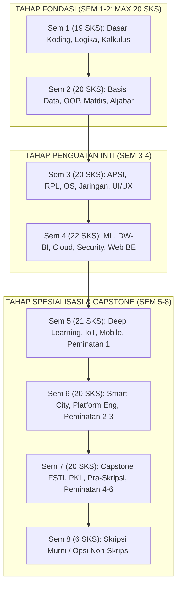

# 005 — STRUKTUR KURIKULUM 8 SEMESTER DAN PEMINATAN
## Program Studi Sistem dan Teknologi Informasi (S1) — Fakultas Sains dan Teknologi Informasi (FSTI) Universitas Widyagama Malang

**Dokumen Revisi Definitif Kurikulum 2026**  
**Standar Rujukan:** Permendikbudristek No. 53 Tahun 2023, Panduan Kurikulum OBE APTIKOM v2.0 (IS2020 & IT2017), Standar IABEE & LAM INFOKOM.

---

### VISUALISASI STRUKTUR 8 SEMESTER & ALUR PRASYARAT



```
┌──────────────────────────────────────────────────────────────────────────────────────────────────�
│                           ALUR PERJALANAN AKADEMIK MAHASISWA (JOURNEY)                           │
├─────────────────┬─────────────────┬─────────────────┬─────────────────┬──────────────────────────┤
│ Tahun 1 (Sem 1-2)│ Tahun 2 (Sem 3-4)│ Tahun 3 (Sem 5-6)│ Tahun 4 (Sem 7) │ Tahun 4 (Sem 8)          │
├─────────────────┼─────────────────┼─────────────────┼─────────────────┼──────────────────────────┤
│ Fondasi Sains & │ Rekayasa Core   │ Spesialisasi    │ Capstone Project│ Skripsi Murni /          │
│ Pemrograman     │ Sistem & Cloud  │ Peminatan & AI  │ & PKL Industri  │ 4 Opsi Non-Skripsi       │
└─────────────────┴─────────────────┴─────────────────┴─────────────────┴──────────────────────────┘
```

---

## 1. REKAPITULASI DAN DISTRIBUSI BEBAN STUDI

Kurikulum Program Studi Sistem dan Teknologi Informasi (S1) menetapkan paket wajib kelulusan mahasiswa sebesar **146 SKS** yang terdistribusi ke dalam **55 Mata Kuliah**:

```
┌──────────────────────────────────────────────────────────────────────────────────────────────────�
│                             REKAPITULASI KOMPOSISI KURIKULUM 2026                                │
├───────────────────────────────────────────┬──────────────┬───────────────┬───────────────────────┤
│ Komponen Mata Kuliah                      │ Jumlah MK    │ Total SKS     │ Persentase Beban      │
├───────────────────────────────────────────┼──────────────┼───────────────┼───────────────────────┤
│ Mata Kuliah Wajib Umum (MKWU)             │ 8 MK         │ 13 SKS        │ 8,9%                  │
│ Mata Kuliah Wajib Fakultas (FSTI)         │ 14 MK        │ 38 SKS        │ 26,0%                 │
│ Mata Kuliah Inti Program Studi (Core STI) │ 27 MK        │ 77 SKS        │ 52,7%                 │
│ Mata Kuliah Pilihan Peminatan (Elektif)   │ 6 MK         │ 18 SKS        │ 12,3%                 │
├───────────────────────────────────────────┼──────────────┼───────────────┼───────────────────────┤
│ TOTAL PAKET DITEMPUH MAHASISWA            │ 55 MK        │ 146 SKS       │ 100,0%                │
├───────────────────────────────────────────┼──────────────┼───────────────┼───────────────────────┤
│ Portofolio MK Ditawarkan (SIAKAD)         │ 67 MK        │ 182 SKS       │ 18 MK Elektif         │
└───────────────────────────────────────────┴──────────────┴───────────────┴───────────────────────┘
```

> [!IMPORTANT]
> **Kepatuhan Regulasi Nasional & Akreditasi:**
> 1. **Beban Kelulusan:** 146 SKS (Memenuhi dan melampaui syarat minimal 144 SKS Permendikbudristek 53/2023).
> 2. **Batas Semester 1 & 2:** Semester 1 (19 SKS) dan Semester 2 (20 SKS) $\le 20\text{ SKS}$ (Pasal 18 Permendikbudristek 53/2023).
> 3. **Proporsi Praktikum:** 20 Mata Kuliah (63 SKS / 43,2%) dilengkapi laboratorium praktikum hands-on.

---

## 2. STRUKTUR KURIKULUM 8 SEMESTER (55 MK / 146 SKS)

```
┌──────────────────────────────────────────────────────────────────────────────────────────────────�
│                               SEBARAN 8 SEMESTER KURIKULUM SISTEKIN                              │
├──────────┬──────────────────────┬─────────┬──────────┬───────────────────────────────────────────┤
│ Semester │ Fokus Pembelajaran   │ Jml MK  │ Jml SKS  │ Karakteristik Kurikulum                   │
├──────────┼──────────────────────┼─────────┼──────────┼───────────────────────────────────────────┤
│ Sem 1    │ Fondasi Sains & MKWU │ 8 MK    │ 19 SKS   │ Sains, Algoritma Dasar, Logika, Agama     │
│ Sem 2    │ Data, Mat & Etika    │ 8 MK    │ 20 SKS   │ Struktur Data, Basis Data, Matdis, Etika  │
│ Sem 3    │ RPL, UI/UX & Infra   │ 7 MK    │ 20 SKS   │ APSI, RPL, Web Front, Jarkom, OS, Cerdas  │
│ Sem 4    │ AI/ML, Cloud & Sec   │ 8 MK    │ 21 SKS   │ Machine Learning, DW/BI, Web Back, Cloud  │
│ Sem 5    │ Deep Learning & IoT  │ 7 MK    │ 21 SKS   │ Deep Learning, IoT, Mobile, KPM, P1-1     │
│ Sem 6    │ AI Integrasi & Plat. │ 7 MK    │ 19 SKS   │ Smart AI, Smart City, Platform, Metopel   │
│ Sem 7    │ Capstone, PKL & Sem. │ 7 MK    │ 20 SKS   │ Startup, Capstone FSTI, PKL, Pra-Skripsi  │
│ Sem 8    │ Skripsi Mandiri      │ 1 MK    │ 6 SKS   ### SEMESTER 4 (21 SKS)
| No | Kode MK | Nama Mata Kuliah | SKS | Tipe | Kategori | Prasyarat |
|:---:|:---:|---|:---:|:---:|:---:|---|
| 24 | `STI-401` | Machine Learning | 3 | +P | Core STI | `STI-202`, `STI-302` |
| 25 | `STI-402` | Data Warehouse & Business Intelligence | 3 | +P | Core STI | `FST-207` |
| 26 | `STI-407` | Web Back End Development | 3 | +P | Core STI | `FST-207`, `STI-306` |
| 27 | `STI-404` | Komputasi Awan (Cloud Computing) | 3 | Teori | Core STI | `STI-307`, `STI-305` |
| 28 | `STI-405` | Dasar Keamanan Informasi | 2 | Teori | Core STI | `STI-307` |
| 29 | `FST-408` | Probabilitas dan Statistika | 3 | Teori | FSTI | `STI-102` |
| 30 | `FST-409` | Manajemen Sains & Riset Operasi | 2 | Teori | FSTI | `STI-202` |
| 31 | `MKU-201` | Pendidikan Kewarganegaraan (KWN) | 2 | Teori | MKWU | — |
| **SUBTOTAL** | — | **Total SKS Semester 4 (8 MK)** | **21** | — | — | **Kumulatif: 80 SKS** |

### SEMESTER 5 (21 SKS)
| No | Kode MK | Nama Mata Kuliah | SKS | Tipe | Kategori | Prasyarat |
|:---:|:---:|---|:---:|:---:|:---:|---|
| 32 | `STI-501` | Deep Learning & Neural Networks | 3 | +P | Core STI | `STI-401` |
| 33 | `STI-503` | Data Mining & Visualisasi Data | 3 | +P | Core STI | `STI-401`, `STI-402` |
| 34 | `STI-504` | Internet of Things (IoT) | 3 | +P | Core STI | `STI-307`, `STI-305` |
| 35 | `STI-505` | Pemrograman Aplikasi Mobile | 3 | +P | Core STI | `STI-306`, `STI-407` |
| 36 | `STI-506` | Manajemen Proyek TI | 3 | Teori | Core STI | `STI-301`, `STI-304` |
| 37 | `MKU-203` | KPM (Kuliah Pengabdian Masyarakat) | 3 | Praktik | MKWU | $\ge 80\text{ SKS}$ |
| 38 | `STA/B/C` | **MK Pilihan Peminatan 1** | 3 | Elektif | Peminatan | Prasyarat Peminatan |
| 38.B | `MKU-402` | Kewirausahaan II | 0 | Teori | MKWU | — (Kebijakan UWG, Sem 5) |
| **SUBTOTAL** | — | **Total SKS Semester 5 (7 MK + 1 MK 0 SKS)** | **21** | — | — | **Kumulatif: 101 SKS** |

### SEMESTER 6 (19 SKS)
| No | Kode MK | Nama Mata Kuliah | SKS | Tipe | Kategori | Prasyarat |
|:---:|:---:|---|:---:|:---:|:---:|---|
| 39 | `STI-601` | Integrasi Layanan Cerdas Berbasis AI | 3 | +P | Core STI | `STI-501`, `STI-407` |
| 40 | `STI-602` | Smart City & Pemerintahan Digital | 2 | Teori | Core STI | `STI-504` |
| 41 | `STI-603` | Keamanan Informasi Lanjut | 3 | Teori | Core STI | `STI-405` |
| 42 | `STI-604` | Digital Platform Engineering | 3 | +P | Core STI | `STI-407` |
| 43 | `FST-611` | Metodologi Penelitian | 2 | Teori | FSTI | $\ge 76\text{ SKS}$ |
| 44 | `STA/B/C` | **MK Pilihan Peminatan 2** | 3 | Elektif | Peminatan | Prasyarat Peminatan |
| 45 | `STA/B/C` | **MK Pilihan Peminatan 3** | 3 | Elektif | Peminatan | Prasyarat Peminatan |
| **SUBTOTAL** | — | **Total SKS Semester 6 (7 MK)** | **19** | — | — | **Kumulatif: 120 SKS** |

### SEMESTER 7 (20 SKS)
| No | Kode MK | Nama Mata Kuliah | SKS | Tipe | Kategori | Prasyarat |
|:---:|:---:|---|:---:|:---:|:---:|---|
| 46 | `STI-701` | Inovasi Teknologi dan Startup Digital | 3 | +P | Core STI | `STI-604`, `MKU-202` |
| 47 | `FST-610` | Capstone Project FSTI | 3 | Proyek | FSTI | `STI-506`, $\ge 100\text{ SKS}$ |
| 48 | `FST-612` | Praktik Kerja Lapangan (PKL) | 3 | Magang | FSTI | $\ge 100\text{ SKS}$ |
| 49 | `FST-613` | Pra-Skripsi / Seminar Proposal | 2 | Seminar | FSTI | `FST-611`, $\ge 100\text{ SKS}$ |
| 50 | `STA/B/C` | **MK Pilihan Peminatan 4** | 3 | Elektif | Peminatan | Prasyarat Peminatan |
| 51 | `STA/B/C` | **MK Pilihan Peminatan 5** | 3 | Elektif | Peminatan | Prasyarat Peminatan |
| 52 | `STA/B/C` | **MK Pilihan Peminatan 6** | 3 | Elektif | Peminatan | Prasyarat Peminatan |
| **SUBTOTAL** | — | **Total SKS Semester 7 (7 MK)** | **20** | — | — | **Kumulatif: 140 SKS** |

### SEMESTER 8 (6 SKS)
| No | Kode MK | Nama Mata Kuliah | SKS | Tipe | Kategori | Prasyarat |
|:---:|:---:|---|:---:|:---:|:---:|---|
| 53 | `FST-714` | Skripsi / Tugas Akhir | 6 | Mandiri | FSTI | `FST-613`, $\ge 120\text{ SKS}$ |
| **SUBTOTAL** | — | **Total SKS Semester 8 (1 MK)** | **6** | — | — | **Kumulatif: 146 SKS** |

---

### 3.1 REKAPITULASI & MATRIKS KALKULASI SKS AKUMULATIF SEMESTER 1 – 8

```
┌──────────┬───────────┬──────────────┬────────────────┬───────────┬──────────────────────────────────────────�
│ Semester │ Jumlah MK │ Beban SKS    │ SKS Kumulatif  │ Persentase│ Tahapan Akademik & Karakteristik         │
├──────────┼───────────┼──────────────┼────────────────┼───────────┼──────────────────────────────────────────┤
│ Sem 1    │ 8 MK      │ 19 SKS       │ 19 SKS         │ 13,0%     │ Tahap Fondasi Sains, Algoritma & Logika  │
│ Sem 2    │ 8 MK      │ 20 SKS       │ 39 SKS         │ 13,7%     │ Tahap Fondasi Data, Matdis & OOP         │
│ Sem 3    │ 7 MK      │ 20 SKS       │ 59 SKS         │ 13,7%     │ Tahap Penguatan Core RPL, OS & Jaringan  │
│ Sem 4    │ 8 MK      │ 21 SKS       │ 80 SKS         │ 14,4%     │ Tahap Penguatan Core AI/ML, DW & Cloud   │
│ Sem 5    │ 7 MK      │ 21 SKS       │ 101 SKS        │ 14,4%     │ Tahap Spesialisasi Deep Learning & IoT   │
│ Sem 6    │ 7 MK      │ 19 SKS       │ 120 SKS        │ 13,0%     │ Tahap Spesialisasi MBKM & Platform Eng   │
│ Sem 7    │ 7 MK      │ 20 SKS       │ 140 SKS        │ 13,7%     │ Tahap Integrasi Capstone, PKL & Sempro   │
│ Sem 8    │ 1 MK      │ 6 SKS        │ 146 SKS        │ 4,1%      │ Tahap Penyelesaian Skripsi / Non-Skripsi │
├──────────┼───────────┼──────────────┼────────────────┼───────────┼──────────────────────────────────────────┤
│ TOTAL    │ 55 MK     │ 146 SKS      │ 146 SKS        │ 100,0%    │ Paket Lulus Tepat Waktu (4 Tahun)        │
└──────────┴───────────┴──────────────┴────────────────┴───────────┴──────────────────────────────────────────┘
```”‚ 20 SKS       │ 140 SKS        │ 13,7%     │ Tahap Integrasi Capstone, PKL & Sempro   │
│ Sem 8    │ 1 MK      │ 6 SKS        │ 146 SKS        │ 4,1%      │ Tahap Penyelesaian Skripsi / Non-Skripsi │
├──────────┼───────────┼──────────────┼────────────────┼───────────┼──────────────────────────────────────────┤
│ TOTAL    │ 55 MK     │ 146 SKS      │ 146 SKS        │ 100,0%    │ Paket Lulus Tepat Waktu (4 Tahun)        │
└──────────┴───────────┴──────────────┴────────────────┴───────────┴──────────────────────────────────────────┘
```dologi Penelitian | 2 | Teori | FSTI | $\ge 76\text{ SKS}$ |
| 44 | `STA/B/C` | **MK Pilihan Peminatan 2** | 3 | Elektif | Peminatan | Prasyarat Peminatan |
| 45 | `STA/B/C` | **MK Pilihan Peminatan 3** | 3 | Elektif | Peminatan | Prasyarat Peminatan |
| **SUBTOTAL** | — | **Total SKS Semester 6 (7 MK)** | **19** | — | — | **Kumulatif: 120 SKS** |

### SEMESTER 7 (20 SKS)
| No | Kode MK | Nama Mata Kuliah | SKS | Tipe | Kategori | Prasyarat |
|:---:|:---:|---|:---:|:---:|:---:|---|
| 46 | `STI-701` | Inovasi Teknologi dan Startup Digital | 3 | +P | Core STI | `STI-604`, `MKU-202` |
| 47 | `FST-610` | Capstone Project FSTI | 3 | Proyek | FSTI | `STI-506`, $\ge 100\text{ SKS}$ |
| 48 | `FST-612` | Praktik Kerja Lapangan (PKL) | 3 | Magang | FSTI | $\ge 100\text{ SKS}$ |
| 49 | `FST-613` | Pra-Skripsi / Seminar Proposal | 2 | Seminar | FSTI | `FST-611`, $\ge 100\text{ SKS}$ |
| 50 | `STA/B/C` | **MK Pilihan Peminatan 4** | 3 | Elektif | Peminatan | Prasyarat Peminatan |
| 51 | `STA/B/C` | **MK Pilihan Peminatan 5** | 3 | Elektif | Peminatan | Prasyarat Peminatan |
| 52 | `STA/B/C` | **MK Pilihan Peminatan 6** | 3 | Elektif | Peminatan | Prasyarat Peminatan |
| **SUBTOTAL** | — | **Total SKS Semester 7 (7 MK)** | **20** | — | — | **Kumulatif: 141 SKS** |

### SEMESTER 8 (6 SKS)
| No | Kode MK | Nama Mata Kuliah | SKS | Tipe | Kategori | Prasyarat |
|:---:|:---:|---|:---:|:---:|:---:|---|
| 53 | `FST-714` | Skripsi / Tugas Akhir | 6 | Mandiri | FSTI | `FST-613`, $\ge 120\text{ SKS}$ |
| **SUBTOTAL** | — | **Total SKS Semester 8 (1 MK)** | **6** | — | — | **Kumulatif: 147 SKS** |

---

### 3.1 REKAPITULASI & MATRIKS KALKULASI SKS AKUMULATIF SEMESTER 1 – 8

```
┌──────────┬───────────┬──────────────┬────────────────┬───────────┬──────────────────────────────────────────�
│ Semester │ Jumlah MK │ Beban SKS    │ SKS Kumulatif  │ Persentase│ Tahapan Akademik & Karakteristik         │
├──────────┼───────────┼──────────────┼────────────────┼───────────┼──────────────────────────────────────────┤
│ Sem 1    │ 8 MK      │ 19 SKS       │ 19 SKS         │ 12,9%     │ Tahap Fondasi Sains, Algoritma & Logika  │
│ Sem 2    │ 8 MK      │ 20 SKS       │ 39 SKS         │ 13,6%     │ Tahap Fondasi Data, Matdis & OOP         │
│ Sem 3    │ 7 MK      │ 20 SKS       │ 59 SKS         │ 13,6%     │ Tahap Penguatan Core RPL, OS & Jaringan  │
│ Sem 4    │ 8 MK      │ 21 SKS       │ 80 SKS         │ 14,3%     │ Tahap Penguatan Core AI/ML, DW & Cloud   │
│ Sem 5    │ 7 MK      │ 21 SKS       │ 101 SKS        │ 14,3%     │ Tahap Spesialisasi Deep Learning & IoT   │
│ Sem 6    │ 7 MK      │ 20 SKS       │ 121 SKS        │ 13,6%     │ Tahap Spesialisasi MBKM & Platform Eng   │
│ Sem 7    │ 7 MK      │ 20 SKS       │ 141 SKS        │ 13,6%     │ Tahap Integrasi Capstone, PKL & Sempro   │
│ Sem 8    │ 1 MK      │ 6 SKS        │ 147 SKS        │ 4,1%      │ Tahap Penyelesaian Skripsi / Non-Skripsi │
├──────────┼───────────┼──────────────┼────────────────┼───────────┼──────────────────────────────────────────┤
│ TOTAL    │ 55 MK     │ 147 SKS      │ 147 SKS        │ 100,0%    │ Paket Lulus Tepat Waktu (4 Tahun)        │
└──────────┴───────────┴──────────────┴────────────────┴───────────┴──────────────────────────────────────────┘
```

---

## 4. SKEMA 3 PEMINATAN SPESIALISASI (@ 18 SKS / 6 MK)

Mahasiswa memilih 1 paket peminatan penuh (ditempuh 1 MK di Sem 5, 2 MK di Sem 6, dan 3 MK di Sem 7):

```
┌──────────────────────────────────────────────────────────────────────────────────────────────────�
│                            3 PEMINATAN SPESIALISASI KEAHLIAN SISTEKIN                            │
├──────────────────────┬──────────────────────┬────────────────────────────────────────────────────┤
│ Peminatan            │ Basis Profil (PL)    │ Mata Kuliah Pilihan (@ 3 SKS)                      │
├──────────────────────┼──────────────────────┼────────────────────────────────────────────────────┤
│ P1: Integrated Smart │ PL-1: Intelligent IS │ 1. STA-01 Decision Support Systems (+P, Sem 5)     │
│     Systems          │       & Data/AI Eng  │ 2. STA-02 Computational Methods & Numerics(+P, S6) │
│     (Flagship)       │                      │ 3. STA-03 Intelligent Agent Systems (+P, Sem 6)    │
│                      │                      │ 4. STA-04 MLOps and AI Pipeline (+P, Sem 7)        │
│                      │                      │ 5. STA-05 Conversational AI & Assistant (+P, Sem 7)│
│                      │                      │ 6. STA-06 Smart Surveillance & IoT Analytics (+P,S7│
├──────────────────────┼──────────────────────┼────────────────────────────────────────────────────┤
│ P2: Cloud Infra &    │ PL-2: Cloud, Cyber & │ 1. STB-01 Network Security & Digital Forensics(+P,5│
│     Cybersecurity    │       Smart Sys Int. │ 2. STB-02 Cloud Architecture & DevOps (+P, Sem 6)  │
│     (Volume)         │                      │ 3. STB-03 Cybersecurity Risk Management (Teori, S6)│
│                      │                      │ 4. STB-04 IT Governance & Compliance COBIT2019(T,S7│
│                      │                      │ 5. STB-05 IT Service Management ITIL 4 (Teori, S7) │
│                      │                      │ 6. STB-06 Enterprise Architecture TOGAF (Teori, S7)│
├──────────────────────┼──────────────────────┼────────────────────────────────────────────────────┤
│ P3: Digital Platform │ PL-3: UI/UX Designer │ 1. STC-01 UX Research & Design (+P, Sem 5)         │
│     Engineering      │       & Platform Eng │ 2. STC-02 Rekayasa & Otomasi Proses Bisnis (+P, S6)│
│     (Niche & Techno) │                      │ 3. STC-03 Rekayasa Aplikasi Industri Vertikal(+P,S6│
│                      │                      │ 4. STC-04 Immersive Media & XR Development (+P, S7)│
│                      │                      │ 5. STC-05 SaaS Architecture & Multi-Tenancy (+P,S7)│
│                      │                      │ 6. STC-06 Digital Product Management (Teori, Sem 7)│
└──────────────────────┴──────────────────────┴────────────────────────────────────────────────────┘
```

---
*Disahkan sebagai Dokumen Resmi 005 — Kurikulum OBE Revisi SISTEKIN 2026.*  
**Tim Pengembang Kurikulum FSTI Universitas Widyagama Malang**
