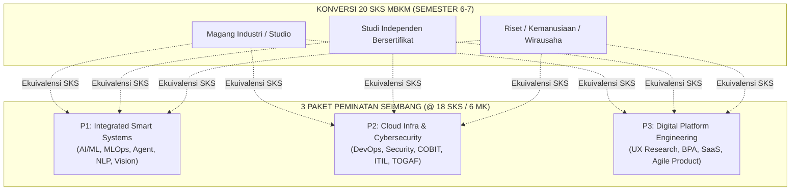

# 006 — DISTRIBUSI DAN PANDUAN MATA KULIAH PEMINATAN & MBKM
## Program Studi Sistem dan Teknologi Informasi (S1) — Fakultas Sains dan Teknologi Informasi (FSTI) Universitas Widyagama Malang

**Dokumen Revisi Definitif Kurikulum 2026**  
**Standar Rujukan:** Permendikbudristek No. 53 Tahun 2023, Panduan Kurikulum OBE APTIKOM v2.0, Panduan Merdeka Belajar Kampus Merdeka (MBKM).

---

### VISUALISASI 3 PEMINATAN & JALUR MBKM 20 SKS



---

## 1. PANDUAN UMUM PEMILIHAN PEMINATAN (18 SKS / 6 MK)

Program Studi Sistem dan Teknologi Informasi menyediakan **3 Peminatan Keahlian Terstruktur** yang masing-masing berbobot **6 Mata Kuliah (18 SKS)**:
* Mahasiswa menentukan pilihan peminatan pada akhir Semester 4 setelah lulus mata kuliah fondasi dasar.
* Penempuhan mata kuliah peminatan didistribusikan secara bertahap:
  * **Semester 5:** 1 Mata Kuliah Peminatan (3 SKS)
  * **Semester 6:** 2 Mata Kuliah Peminatan (6 SKS)
  * **Semester 7:** 3 Mata Kuliah Peminatan (9 SKS)

---

## 2. RINCIAN SILABUS & DESKRIPSI 18 MATA KULIAH PEMINATAN

### 2.1 Peminatan 1: Integrated Smart Systems (Kecerdasan Artifisial Terintegrasi)
Basis Profil: **PL-1 (Intelligent Information Systems & Data/AI Engineer)**

1. **`STA-01` Sistem Pendukung Keputusan Cerdas (3 SKS — Semester 5, +P)**  
   * **CPL:** KK1 | **Prasyarat:** `STI-202`, `STI-302`
   * **Deskripsi:** Konsep multi-criteria decision making (MCDM), metode AHP, TOPSIS, PROMETHEE, integrasi Fuzzy Logic, serta pembangunan dashboard DSS berbasis web.
2. **`STA-02` Metode Komputasi Numerik Terapan (3 SKS — Semester 6, +P)**  
   * **CPL:** KK2 | **Prasyarat:** `STI-102`, `STI-202`
   * **Deskripsi:** Solusi persamaan non-linear, interpolasi, optimasi numerik gradient descent, integrasi numerik untuk pemodelan algoritma AI dan simulasi sistem.
3. **`STA-03` Sistem Agen Cerdas & Multi-Agent (3 SKS — Semester 6, +P)**  
   * **CPL:** KK1 | **Prasyarat:** `STI-401`
   * **Deskripsi:** Arsitektur autonomous agent, multi-agent communication protocols (FIPA-ACL), Reinforcement Learning (Q-learning, PPO), dan implementasi swarm intelligence.
4. **`STA-04` MLOps & AI Pipeline Engineering (3 SKS — Semester 7, +P)**  
   * **CPL:** KK2 | **Prasyarat:** `STI-501`
   * **Deskripsi:** Siklus hidup operasionalisasi machine learning (MLOps), automated data validation, tracking eksperimen (MLflow, Weights & Biases), model registry, CI/CD pipeline deployment model AI.
5. **`STA-05` Conversational AI & Intelligent Assistant (3 SKS — Semester 7, +P)**  
   * **CPL:** KK1 | **Prasyarat:** `STI-501`
   * **Deskripsi:** Large Language Models (LLM), fine-tuning teknik LoRA/QLoRA, Retrieval-Augmented Generation (RAG), framework LangChain & LlamaIndex, serta perancangan asisten cerdas enterprise.
6. **`STA-06` Smart Surveillance & Edge AI Analytics (3 SKS — Semester 7, +P)**  
   * **CPL:** KK1, KK3 | **Prasyarat:** `STI-501`, `STI-504`
   * **Deskripsi:** Computer vision real-time (YOLO, OpenCV), optimasi inferensi model untuk perangkat Edge (TensorRT, Edge TPU, Jetson Nano), streaming video analytics untuk smart campus dan industri.

---

### 2.2 Peminatan 2: Cloud Infrastructure & Cybersecurity (Infrastruktur Awan & Keamanan Siber)
Basis Profil: **PL-2 (Cloud Infrastructure, Cybersecurity & Smart Systems Integrator)**

1. **`STB-01` Network Security and Digital Forensics (3 SKS — Semester 5, +P)**  
   * **CPL:** P3, KK3, KK4 | **Prasyarat:** `STI-307`, `STI-405`
   * **Deskripsi:** Network packet analysis (Wireshark, Zeek), intrusion detection/prevention systems (Snort/Suricata), rantai bukti forensik digital, analisis artefak disk/memori (Autopsy, Volatility).
2. **`STB-02` Cloud Architecture & DevOps (3 SKS — Semester 6, +P)**  
   * **CPL:** P3, KK3 | **Prasyarat:** `STI-404`
   * **Deskripsi:** Container orchestration dengan Kubernetes, Infrastructure as Code (Terraform / Ansible), CI/CD automation pipeline, dan arsitektur cloud native berskala enterprise.
3. **`STB-03` Cybersecurity Risk Management (3 SKS — Semester 6, Teori)**  
   * **CPL:** KK3, KK4 | **Prasyarat:** `STI-405`
   * **Deskripsi:** Penilaian risiko keamanan siber menggunakan standar ISO/IEC 27005 dan NIST CSF, penyusunan Business Continuity Plan (BCP), dan Disaster Recovery Plan (DRP).
4. **`STB-04` IT Governance & Compliance (COBIT 2019) (3 SKS — Semester 7, Teori)**  
   * **CPL:** KK4 | **Prasyarat:** `STI-405`
   * **Deskripsi:** Kerangka kerja COBIT 2019 (Domain EDM, APO, BAI, DSS, MEA), pengukuran kapabilitas proses (Capability Level), audit tata kelola TI, dan kepatuhan regulasi UU PDP.
5. **`STB-05` IT Service Management (ITIL 4) (3 SKS — Semester 7, Teori)**  
   * **CPL:** P3, KK3 | **Prasyarat:** `STI-404`
   * **Deskripsi:** Kerangka kerja ITIL 4 Service Value System (SVS), perancangan Service Catalog, pengelolaan Service Level Agreement (SLA), Incident, Problem, dan Change Management.
6. **`STB-06` Enterprise Architecture (TOGAF) (3 SKS — Semester 7, Teori)**  
   * **CPL:** P3, KK4 | **Prasyarat:** `STI-301`
   * **Deskripsi:** Perancangan cetak biru enterprise architecture menggunakan TOGAF ADM (Business, Data, Application, Technology Architecture) dan pemodelan standar ArchiMate.

---

### 2.3 Peminatan 3: Digital Platform Engineering (Rekayasa Platform & Produk Digital)
Basis Profil: **PL-3 (UI/UX Designer & Digital Platform Engineer)**

1. **`STC-01` User Experience Research & Design (3 SKS — Semester 5, +P)**  
   * **CPL:** KK5 | **Prasyarat:** `STI-303`
   * **Deskripsi:** Riset pengguna kuantitatif & kualitatif, usability testing, eye-tracking simulation, pembangunan enterprise design system tokens (Figma, Storybook), micro-interactions.
2. **`STC-02` Rekayasa & Otomasi Proses Bisnis (BPA) (3 SKS — Semester 6, +P)**  
   * **CPL:** KK5, KK6 | **Prasyarat:** `STI-301`
   * **Deskripsi:** Pemodelan proses bisnis BPMN 2.0, Process Mining untuk analisis log transaksi, workflow orchestration engine (Camunda/Temporal), dan Robotic Process Automation (RPA).
3. **`STC-03` Rekayasa Aplikasi Industri Vertikal (FinTech & EdTech) (3 SKS — Semester 6, +P)**  
   * **CPL:** KK5 | **Prasyarat:** `STI-407`, `STI-505`
   * **Deskripsi:** Domain-Driven Design (DDD) untuk solusi vertikal: FinTech (Payment Gateway, Core Banking API, Ledger) dan EdTech (LMS Architecture, SCORM/xAPI interoperability).
4. **`STC-04` Immersive Media & XR Development (3 SKS — Semester 7, +P)**  
   * **CPL:** KK5 | **Prasyarat:** `STI-303`, `STI-306`
   * **Deskripsi:** WebXR, pemodelan 3D interaktif (Three.js), Augmented Reality (AR) mobile development, interaksi spasial, dan antarmuka komputasi spasial imersif.
5. **`STC-05` SaaS Architecture & Multi-Tenancy (3 SKS — Semester 7, +P)**  
   * **CPL:** KK5, KK6 | **Prasyarat:** `STI-604`
   * **Deskripsi:** Arsitektur SaaS multi-tenant (Database-per-tenant vs Shared-schema), subscription billing engine (Stripe API), micro-frontends, dan distributed caching.
6. **`STC-06` Digital Product Management & Agile Practices (3 SKS — Semester 7, Teori)**  
   * **CPL:** KK6 | **Prasyarat:** `STI-506`, `MKU-202`
   * **Deskripsi:** Product lifecycle, Product Roadmap & OKRs, backlog prioritization (RICE, Kano, MoSCoW), A/B testing, product-led growth (PLG), dan fasilitasi ritual Agile/Scrum.

---

## 3. PANDUAN IMPLEMENTASI MBKM (MERDEKA BELAJAR KAMPUS MERDEKA)

Kurikulum SISTEKIN 2026 menyediakan fleksibilitas penempuhan hingga **20 SKS MBKM per semester** pada **Semester 6 dan/atau Semester 7**:

```
┌──────────────────────────────────────────────────────────────────────────────────────────────────┐
│                               SKEMA EKUIVALENSI MBKM 20 SKS                                      │
├───────────────────────┬──────────┬───────────────────────────────┬───────────────────────────────┤
│ Jalur MBKM            │ Semester │ Paket MK yang Dikonversi      │ Total SKS Dikonversi          │
├───────────────────────┼──────────┼───────────────────────────────┼───────────────────────────────┤
│ Magang Industri       │ Sem 6    │ • MK Pilihan Peminatan 2 (3)  │ **20 SKS**                    │
│ Bersertifikat (MSIB)  │          │ • MK Pilihan Peminatan 3 (3)  │                               │
│                       │          │ • STI-601 Integrasi AI (3)    │                               │
│                       │          │ • STI-604 Platform Eng (3)    │                               │
│                       │          │ • STI-602 Smart City (3)      │                               │
│                       │          │ • STI-603 Keamanan Lanjut (3) │                               │
│                       │          │ • FST-611 Metopel (2)         │                               │
├───────────────────────┼──────────┼───────────────────────────────┼───────────────────────────────┤
│ Magang Industri /     │ Sem 7    │ • MK Pilihan Peminatan 4 (3)  │ **20 SKS**                    │
│ Studi Independen /    │          │ • MK Pilihan Peminatan 5 (3)  │                               │
│ Wirausaha Merdeka     │          │ • MK Pilihan Peminatan 6 (3)  │                               │
│                       │          │ • STI-701 Startup Digital (3) │                               │
│                       │          │ • FST-610 Capstone FSTI (3)   │                               │
│                       │          │ • FST-612 PKL Industri (3)    │                               │
│                       │          │ • FST-613 Pra-Skripsi (2)     │                               │
└───────────────────────┴──────────┴───────────────────────────────┴───────────────────────────────┘
```

---
*Disahkan sebagai Dokumen Resmi 006 — Kurikulum OBE Revisi SISTEKIN 2026.*  
**Tim Pengembang Kurikulum FSTI Universitas Widyagama Malang**
