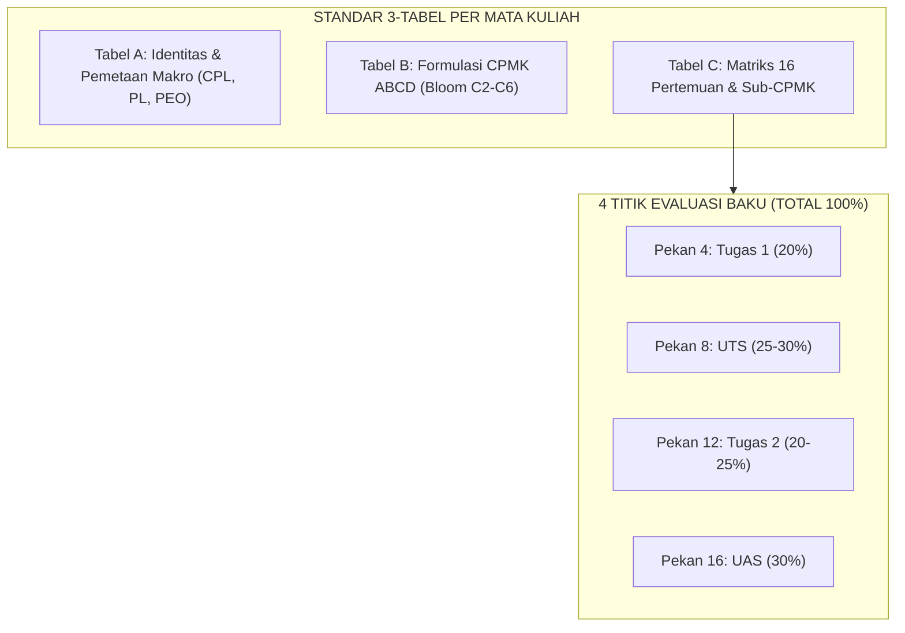

# 007 — FORMULASI CPMK DAN SUB-CPMK PORTFOLIO LENGKAP (67 MATA KULIAH)
## Format Standar Tabel Dokumen Kurikulum KPT-OBE (Skema 4x Asesmen Terstruktur)

> **Program Studi:** S1 Sistem dan Teknologi Informasi (SISTEKIN)  
> **Fakultas:** Sains dan Teknologi Informasi (FSTI) — Universitas Widyagama Malang  
> **Status Dokumen:** Master Portofolio 67 Mata Kuliah (182 SKS Portofolio / 146 SKS Paket Kelulusan)  
> **Skema Asesmen Standar OBE:** Tepat 4x Titik Evaluasi Terstruktur: **Tugas 1 (20%), UTS (25-30%), Tugas 2 (20-25%), dan UAS (30%)** (Total = 100%).  
> **Standar Rujukan:** Panduan KPT APTIKOM v2.0 (2024), Permendikbudristek No. 53/2023, ACM/IEEE CC2020, SN-Dikti  

---

### VISUALISASI STRUKTUR 3-TABEL & SKEMA 4x ASESMEN

---

## 1. PANDUAN STRUKTUR 3 TABEL STANDAR PER MATA KULIAH

Setiap mata kuliah dalam dokumen ini disusun secara modular dan terstruktur dalam **3 Tabel Standar** yang siap diurai (*parsed*) oleh Agentic AI untuk otomasi Rencana Pembelajaran Semester (RPS), instrumen asesmen OBE, dan penyusunan Naskah Buku Kurikulum KPT:
1. **Tabel A (Identitas & Pemetaan Makro):** Kode, Nama (ID/EN), SKS, Tipe, Jam Pembelajaran, Semester, Rumpun Ilmu, Prasyarat, CPL, PL, dan PEO.
2. **Tabel B (Formulasi CPMK ABCD & Bloom):** Rumusan eksplisit *Audience* (Mahasiswa), *Behavior* (Kata Kerja Operasional), *Condition* (Kondisi/Tools/Metode), *Degree* (Standar Kualitas), Level Bloom (C2 s.d. C6), serta pemetaan CPL.
3. **Tabel C (Matriks 16 Pertemuan):** Rincian Sub-CPMK tiap pekan dengan skema **4 Titik Asesmen Baku**:
   * **Pekan 4:** **Tugas 1** (Formatif Terstruktur / Kuis / Proyek Awal) — **Bobot: 20%**
   * **Pekan 8:** **UTS** (Evaluasi Tengah Semester / Progres 50%) — **Bobot: 25% (Praktikum) / 30% (Teori)**
   * **Pekan 12:** **Tugas 2** (Formatif Lanjut / Studi Kasus / Integrasi) — **Bobot: 20% (Teori) / 25% (Praktikum)**
   * **Pekan 16:** **UAS** (Evaluasi Akhir Semester / Demo Day & Portofolio) — **Bobot: 30%**
   * *Pekan lainnya difokuskan pada aktivitas pembelajaran aktif / formatif non-graded.*

---

## 2. REKAPITULASI DISTRIBUSI PORTOFOLIO MATA KULIAH

| Rumpun / Kategori | Jumlah MK | Bobot SKS | Distribusi Semester | Keterangan |
|---|:---:|:---:|:---:|---|
| **Mata Kuliah Wajib Umum (MKWU)** | 8 MK | 13 SKS | Sem 1, 2, 4, 5 | S1, KU1, KU2, KU3 |
| **Mata Kuliah Dasar Fakultas (FSTI)** | 14 MK | 38 SKS | Sem 1, 2, 4, 6, 7, 8 | Fondasi Matematika, Sains, Capstone, PKL, Skripsi |
| **Mata Kuliah Inti Program Studi (STI)** | 27 MK | 77 SKS | Sem 1, 2, 3, 4, 5, 6, 7 | Core IS/IT BoK (Komputasi, Cloud, AI, Security) |
| **Mata Kuliah Peminatan 1 (Smart Systems)** | 6 MK | 18 SKS Ditawarkan | Sem 5 (1 MK), Sem 6 (2 MK), Sem 7 (3 MK) | Pilihan Jalur P1 (Ambil 6 MK / 18 SKS) |
| **Mata Kuliah Peminatan 2 (Cloud & Cyber)** | 6 MK | 18 SKS Ditawarkan | Sem 5 (1 MK), Sem 6 (2 MK), Sem 7 (3 MK) | Pilihan Jalur P2 (Ambil 6 MK / 18 SKS) |
| **Mata Kuliah Peminatan 3 (Platform Eng)** | 6 MK | 18 SKS Ditawarkan | Sem 5 (1 MK), Sem 6 (2 MK), Sem 7 (3 MK) | Pilihan Jalur P3 (Ambil 6 MK / 18 SKS) |
| **TOTAL PORTOFOLIO DITAWARKAN** | **67 MK** | **182 SKS** | **8 Semester** | **Paket Ditempuh: 55 MK / 146 SKS** |

---

## 3. FORMULASI DETAIL 3 TABEL UNTUK SELURUH 67 MATA KULIAH

### 1. FST-101 — Dasar Teknologi Digital (Fundamentals of Digital Technology)

#### Tabel 1.A: Identitas & Pemetaan Makro Mata Kuliah
| Atribut Kurikulum | Spesifikasi & Rujukan OBE |
|---|---|
| **Kode & Nama Mata Kuliah** | **FST-101 — Dasar Teknologi Digital** (*Fundamentals of Digital Technology*) |
| **Bobot SKS / Tipe** | **2 SKS** / Tipe: **Teori** (100m Kuliah + 120m Mandiri) |
| **Semester / Rumpun MK** | **Semester 1** / Komputasi & Arsitektur Sistem (FSTI) |
| **Prasyarat Akademik** | Tidak Ada |
| **CPL yang Dibebankan** | `P2` (Arsitektur Sistem), `KU1` (Problem Solving Logika) |
| **Profil Lulusan (PL)** | `PL-1`, `PL-2`, `PL-3` |
| **Target PEO** | `PEO-1` (Professional Practice) |

#### Tabel 1.B: Formulasi CPMK (Format ABCD & Level Bloom)
| Kode CPMK | Rumusan Capaian Pembelajaran Mata Kuliah (Format ABCD Eksplisit) | Level Bloom | CPL Didukung |
|---|---|:---:|:---:|
| **CPMK-1** | Mahasiswa (*A*) mampu **menjelaskan** konsep representasi data biner, heksadesimal, aljabar boolean, dan arsitektur Von Neumann (*B*) melalui studi literatur komputasi (*C*) secara tepat dan komprehensif (*D*). | **C2** | `P2` |
| **CPMK-2** | Mahasiswa (*A*) mampu **menganalisis** fungsi gerbang logika dasar, tabel kebenaran, dan penyederhanaan Karnaugh Map (*B*) pada rangkaian logika kombinasional (*C*) dengan efisiensi gerbang minimum (*D*). | **C4** | `KU1` |
| **CPMK-3** | Mahasiswa (*A*) mampu **mengevaluasi** interaksi antara CPU, hierarki memori, register, dan bus I/O (*B*) dalam simulasi siklus instruksi komputasi (*C*) sesuai standar arsitektur komputer modern (*D*). | **C5** | `P2` |

#### Tabel 1.C: Matriks Rencana Pembelajaran 16 Pertemuan (Sub-CPMK, Materi, Metode, Asesmen)
| Mg | Sub-CPMK & Kemampuan Akhir | Pokok Bahasan (Bahan Kajian) | Bentuk & Metode Pembelajaran | Bentuk Asesmen & Bobot (%) |
|:--:|---|---|---|---|
| 1 | Mampu menjelaskan evolusi komputasi dan etika digital (C2) | Pengantar teknologi digital, sistem biner, dan etika akademik | Kuliah & Diskusi Interaktif (100m) | Aktivitas Formatif (Non-Graded) |
| 2 | Mampu mengonversi sistem bilangan desimal, biner, oktal, heksa (C3) | Konversi sistem bilangan dan operasi aritmatika biner | Case-Based Learning & Latihan (100m) | Aktivitas Formatif (Non-Graded) |
| 3 | Mampu memetakan fungsi gerbang logika dasar dan tabel kebenaran (C3) | Gerbang AND, OR, NOT, NAND, NOR, XOR, XNOR | Ceramah & Praktik Logika (100m) | Aktivitas Formatif (Non-Graded) |
| **4** | **Mampu menyederhanakan fungsi logika dengan Aljabar Boolean (C3)** | **Hukum Aljabar Boolean dan teorema De Morgan** | **Problem-Solving Class (100m)** | **Tugas 1: Kuis & Problem Solving (Bobot: 20%)** |
| 5 | Mampu meminimasi fungsi logika dengan Karnaugh Map 2-4 variabel (C4) | K-Map 2, 3, dan 4 variabel, Grouping SOP & POS | Case Method Class (100m) | Aktivitas Formatif (Non-Graded) |
| 6 | Mampu menganalisis rangkaian Half Adder dan Full Adder (C4) | Rangkaian Adder, Subtractor, dan BCD Adder | Diskusi & Analisis Desain (100m) | Aktivitas Formatif (Non-Graded) |
| 7 | Mampu menganalisis Decoder, Encoder, Multiplexer, Demux (C4) | Perancangan MSI: Decoder, MUX, dan DEMUX | Problem-Based Learning (100m) | Aktivitas Formatif (Non-Graded) |
| **8** | **EVALUASI TENGAH SEMESTER (UTS)** | **Ujian Teori & Logika Rangkaian Digital Kombinasional** | **Ujian Tertulis Terjadwal (100m)** | **UTS: Ujian Tertulis Terjadwal (Bobot: 30%)** |
| 9 | Mampu menguraikan prinsip kerja Latch dan Flip-Flop (C2) | Rangkaian Sekuensial: SR, D, JK, dan T Flip-Flop | Kuliah Teori & Demo (100m) | Aktivitas Formatif (Non-Graded) |
| 10 | Mampu merancang Counter dan Register geser (C4) | Asynchronous/Synchronous Counter, Shift Register | Case-Based Learning (100m) | Aktivitas Formatif (Non-Graded) |
| 11 | Mampu menguraikan siklus Fetch-Decode-Execute CPU (C2) | Arsitektur Von Neumann, ALU, Control Unit, Register | Kuliah & Animasi Simulasi (100m) | Aktivitas Formatif (Non-Graded) |
| **12** | **Mampu mengevaluasi hierarki memori RAM, ROM, Cache (C5)** | **Memori Semikonduktor, SRAM, DRAM, Flash Storage** | **Diskusi Panel Kasus (100m)** | **Tugas 2: Studi Kasus / Paper Analisis (Bobot: 20%)** |
| 13 | Mampu menganalisis antarmuka I/O dan sistem Bus (C4) | Bus Data, Bus Alamat, Bus Kontrol, Interupsi, DMA | Problem-Solving (100m) | Aktivitas Formatif (Non-Graded) |
| 14 | Mampu membandingkan arsitektur SoC, RISC-V, dan IoT Chip (C4) | Arsitektur Sistem Modern: System-on-Chip (SoC) | Case-Based Learning (100m) | Aktivitas Formatif (Non-Graded) |
| 15 | Mampu menyintesis solusi arsitektur digital komprehensif (C5) | Review Komprehensif dan Studi Kasus Terpadu | Presentasi Kelompok (100m) | Aktivitas Formatif (Non-Graded) |
| **16** | **EVALUASI AKHIR SEMESTER (UAS)** | **Ujian Komprehensif Arsitektur & Teknologi Digital** | **Ujian Tertulis Akhir (100m)** | **UAS: Ujian Akhir Komprehensif (Bobot: 30%)** |

---

### 2. FST-102 — Algoritma dan Pemrograman (Algorithms and Programming)

#### Tabel 2.A: Identitas & Pemetaan Makro Mata Kuliah
| Atribut Kurikulum | Spesifikasi & Rujukan OBE |
|---|---|
| **Kode & Nama Mata Kuliah** | **FST-102 — Algoritma dan Pemrograman** (*Algorithms and Programming*) |
| **Bobot SKS / Tipe** | **3 SKS** / Tipe: **+P** (100m Teori + 170m Lab + 180m Mandiri) |
| **Semester / Rumpun MK** | **Semester 1** / Rekayasa Perangkat Lunak & Platform (FSTI) |
| **Prasyarat Akademik** | Tidak Ada |
| **CPL yang Dibebankan** | `KU1` (Problem Solving Komputasional), `P4` (Rekayasa Perangkat Lunak) |
| **Profil Lulusan (PL)** | `PL-1`, `PL-3`, `PL-4` |
| **Target PEO** | `PEO-1` (Professional Practice), `PEO-3` (Lifelong Learning) |

#### Tabel 2.B: Formulasi CPMK (Format ABCD & Level Bloom)
| Kode CPMK | Rumusan Capaian Pembelajaran Mata Kuliah (Format ABCD Eksplisit) | Level Bloom | CPL Didukung |
|---|---|:---:|:---:|
| **CPMK-1** | Mahasiswa (*A*) mampu **mengonstruksi** alur logika algoritma pemecahan masalah (*B*) menggunakan flowchart dan pseudocode standar (*C*) dengan kebenaran logika 100% (*D*). | **C3** | `KU1` |
| **CPMK-2** | Mahasiswa (*A*) mampu **mengimplementasikan** struktur kontrol percabangan, perulangan, dan modularisasi fungsi (*B*) dalam kode program Python/C++ (*C*) sesuai standar clean code (*D*). | **C3** | `P4` |
| **CPMK-3** | Mahasiswa (*A*) mampu **mendiagnosis dan memvalidasi** kesalahan logika serta manajemen memori array dan pointer (*B*) pada kasus pemrosesan dataset (*C*) melalui teknik debugging sistematis (*D*). | **C4** | `KU1, P4` |
| **CPMK-4** | Mahasiswa (*A*) mampu **merancang dan membangun** aplikasi konsol modular berbasis studi kasus nyata (*B*) secara terstruktur (*C*) dengan penanganan eksepsi dan berkas yang andal (*D*). | **C6** | `KU1, P4` |

#### Tabel 2.C: Matriks Rencana Pembelajaran 16 Pertemuan (Sub-CPMK, Materi, Metode, Asesmen)
| Mg | Sub-CPMK & Kemampuan Akhir | Pokok Bahasan (Bahan Kajian) | Bentuk & Metode Pembelajaran | Bentuk Asesmen & Bobot (%) |
|:--:|---|---|---|---|
| 1 | Mampu merumuskan computational thinking, flowchart & pseudocode (C3) | Pengenalan Algoritma, Flowchart, dan Setup Lingkungan IDE | Kuliah (100m) + Lab Hands-on (170m) | Praktikum Formatif (Non-Graded) |
| 2 | Mampu menerapkan variabel, tipe data primitif, konstanta, operator (C3) | Tipe Data, I/O Standar, dan Operator Komputasi | Kuliah (100m) + Lab Hands-on (170m) | Praktikum Formatif (Non-Graded) |
| 3 | Mampu mengimplementasikan percabangan IF, IF-ELSE, Nested-IF (C3) | Struktur Logika Percabangan Kompleks | Case Method + Lab Coding (270m) | Praktikum Formatif (Non-Graded) |
| **4** | **Mampu mengimplementasikan SWITCH-CASE dan menu navigasi (C3)** | **Seleksi Jamak dan Struktur Menu Aplikasi** | **Case Method + Lab Coding (270m)** | **Tugas 1: Milestone Proyek 1 / Modul Lab (Bobot: 20%)** |
| 5 | Mampu mengonstruksi perulangan FOR dan kalkulasi deret (C3) | Struktur Looping FOR dan Nested Loop | Kuliah + Lab Hands-on (270m) | Praktikum Formatif (Non-Graded) |
| 6 | Mampu mengimplementasikan perulangan WHILE dan DO-WHILE (C3) | Looping Kondisional dan Sentinel Value | Case Method + Lab Coding (270m) | Praktikum Formatif (Non-Graded) |
| 7 | Mampu merancang fungsi modular, parameter value & reference (C3) | Pemrograman Modular: User Defined Functions | Kuliah + Lab Hands-on (270m) | Praktikum Formatif (Non-Graded) |
| **8** | **EVALUASI TENGAH SEMESTER (UTS)** | **Ujian Koding Terjadwal & Evaluasi Proyek Tahap Awal (Milestone 1)** | **Live Coding Lab Test (170m)** | **UTS: Evaluasi Proyek Awal 50% / Ujian Praktik (Bobot: 25%)** |
| 9 | Mampu menguraikan fungsi rekursi dan base case (C4) | Rekursi Matematika dan Algoritma Divide-Conquer | Kuliah + Lab Hands-on (270m) | Praktikum Formatif (Non-Graded) |
| 10 | Mampu memanipulasi Array 1D: traversal, insert, search (C3) | Struktur Array 1 Dimensi & Algoritma Linier | Kuliah + Lab Hands-on (270m) | Praktikum Formatif (Non-Graded) |
| 11 | Mampu memanipulasi Array 2D (Matriks) dan operasi tabel (C4) | Array Multi-Dimensi dan Pemrosesan Matriks | Case Method + Lab Coding (270m) | Praktikum Formatif (Non-Graded) |
| **12** | **Mampu mengolah data String dan memori Pointer dasar (C4)** | **Operasi String, Pointer, dan Alokasi Memori** | **Kuliah + Lab Hands-on (270m)** | **Tugas 2: Milestone Proyek 2 / Integrasi Sistem (Bobot: 25%)** |
| 13 | Mampu mengonstruksi Struct dan Array of Struct (C4) | Tipe Data Bentukan (Struct/Record) | Case Method + Lab Coding (270m) | Praktikum Formatif (Non-Graded) |
| 14 | Mampu mengimplementasikan I/O file teks dan CSV (C4) | Operasi Berkas: Read, Write, Append File | Kuliah + Lab Hands-on (270m) | Praktikum Formatif (Non-Graded) |
| 15 | Mampu mengintegrasikan aplikasi konsol modular berbasis tim (C6) | Integrasi Proyek Aplikasi Tim & Peer Review | PjBL Studio (270m) | Praktikum Formatif (Non-Graded) |
| **16** | **EVALUASI AKHIR SEMESTER (UAS)** | **Sidang Demonstrasi Produk Aplikasi & Ujian Koding Komprehensif** | **Demo Day & Defense (170m)** | **UAS: Evaluasi Proyek Akhir / Demo Day & Portofolio (Bobot: 30%)** |

---

### 3. STI-101 — Pengantar Sistem & Teknologi Informasi (Introduction to IS & IT)

#### Tabel 3.A: Identitas & Pemetaan Makro Mata Kuliah
| Atribut Kurikulum | Spesifikasi & Rujukan OBE |
|---|---|
| **Kode & Nama Mata Kuliah** | **STI-101 — Pengantar Sistem & Teknologi Informasi** (*Introduction to IS & IT*) |
| **Bobot SKS / Tipe** | **2 SKS** / Tipe: **Teori** (100m Kuliah + 120m Mandiri) |
| **Semester / Rumpun MK** | **Semester 1** / Sistem Informasi & Tata Kelola (Core STI) |
| **Prasyarat Akademik** | Tidak Ada |
| **CPL yang Dibebankan** | `P2` (Konsep Sistem Informasi & Transformasi Digital) |
| **Profil Lulusan (PL)** | Seluruh Profil Lulusan (`PL-1` s.d. `PL-4`) |
| **Target PEO** | `PEO-1` (Professional Practice), `PEO-2` (Technopreneurship) |

#### Tabel 3.B: Formulasi CPMK (Format ABCD & Level Bloom)
| Kode CPMK | Rumusan Capaian Pembelajaran Mata Kuliah (Format ABCD Eksplisit) | Level Bloom | CPL Didukung |
|---|---|:---:|:---:|
| **CPMK-1** | Mahasiswa (*A*) mampu **menguraikan** komponen pembentuk sistem informasi, siklus data-ke-informasi, dan perannya dalam organisasi (*B*) melalui studi kasus bisnis (*C*) secara komprehensif (*D*). | **C2** | `P2` |
| **CPMK-2** | Mahasiswa (*A*) mampu **membandingkan** jenis-jenis sistem informasi enterprise (TPS, MIS, DSS, ERP, CRM, SCM) (*B*) pada ekosistem industri modern (*C*) dengan analisis komparasi yang valid (*D*). | **C4** | `P2` |
| **CPMK-3** | Mahasiswa (*A*) mampu **merumuskan** usulan solusi transformasi digital berbasis AI, Cloud, dan IoT (*B*) terhadap permasalahan proses bisnis konvensional (*C*) secara etis dan layak bisnis (*D*). | **C5** | `P2` |

#### Tabel 3.C: Matriks Rencana Pembelajaran 16 Pertemuan (Sub-CPMK, Materi, Metode, Asesmen)
| Mg | Sub-CPMK & Kemampuan Akhir | Pokok Bahasan (Bahan Kajian) | Bentuk & Metode Pembelajaran | Bentuk Asesmen & Bobot (%) |
|:--:|---|---|---|---|
| 1 | Mampu menguraikan hakikat data, informasi, knowledge, dan SI (C2) | Konsep Dasar SI, Data-to-Knowledge Hierarchy | Kuliah & Diskusi (100m) | Aktivitas Formatif (Non-Graded) |
| 2 | Mampu mengidentifikasi 6 komponen utama sistem informasi (C2) | Komponen SI: Hardware, Software, Data, Network, People, Process | Ceramah Interaktif (100m) | Aktivitas Formatif (Non-Graded) |
| 3 | Mampu menganalisis sistem operasional TPS dan MIS (C4) | Transaction Processing Systems & Management Information Systems | Case Method Class (100m) | Aktivitas Formatif (Non-Graded) |
| **4** | **Mampu menganalisis integrasi Enterprise Resource Planning (ERP) (C4)** | **Sistem Enterprise: ERP, Modul Bisnis, dan Arsitektur** | **Case-Based Learning (100m)** | **Tugas 1: Kuis & Problem Solving (Bobot: 20%)** |
| 5 | Mampu menganalisis sistem relasi pelanggan CRM dan SCM (C4) | Customer Relationship Management & Supply Chain Management | Case Method Class (100m) | Aktivitas Formatif (Non-Graded) |
| 6 | Mampu menguraikan Decision Support Systems (DSS) dan Executive IS (C2) | Sistem Pendukung Keputusan & Executive Dashboard | Ceramah & Demo (100m) | Aktivitas Formatif (Non-Graded) |
| 7 | Mampu menganalisis model bisnis digital (E-Commerce B2B/B2C) (C4) | E-Commerce, Fintech, dan Model Monetisasi Digital | Case-Based Learning (100m) | Aktivitas Formatif (Non-Graded) |
| **8** | **EVALUASI TENGAH SEMESTER (UTS)** | **Ujian Analisis Taksonomi Sistem Informasi Enterprise** | **Ujian Tertulis Terjadwal (100m)** | **UTS: Ujian Tertulis Terjadwal (Bobot: 30%)** |
| 9 | Mampu mengidentifikasi arsitektur Cloud Computing dan Virtualisasi (C2) | Komputasi Awan: IaaS, PaaS, SaaS, dan Transformasi TI | Ceramah & Diskusi (100m) | Aktivitas Formatif (Non-Graded) |
| 10 | Mampu menguraikan peran AI dan Machine Learning pada bisnis (C2) | AI & Machine Learning: Otomasi Cerdas dan Analitik | Ceramah & Video Case (100m) | Aktivitas Formatif (Non-Graded) |
| 11 | Mampu menguraikan peran IoT dan Smart Systems (C2) | Internet of Things, Sensor Networks, dan Smart Campus | Diskusi Interaktif (100m) | Aktivitas Formatif (Non-Graded) |
| **12** | **Mampu mengidentifikasi ancaman keamanan siber dan privasi (C2)** | **Cybersecurity, CIA Triad, dan Regulasi PDP** | **Case-Based Class (100m)** | **Tugas 2: Studi Kasus / Paper Analisis (Bobot: 20%)** |
| 13 | Mampu menguraikan kerangka kerja tata kelola TI organisasi (C2) | Tata Kelola TI (IT Governance) & Standar COBIT pengantar | Ceramah & Diskusi (100m) | Aktivitas Formatif (Non-Graded) |
| 14 | Mampu merancang usulan transformasi digital proses bisnis (C5) | Metodologi Perancangan Solusi Transformasi Digital | Project-Based Workshop (100m) | Aktivitas Formatif (Non-Graded) |
| 15 | Mampu mempresentasikan ide inovasi sistem informasi kelompok (C5) | Pameran Gagasan Solusi Sistem Informasi Cerdas | Presentasi Tim (100m) | Aktivitas Formatif (Non-Graded) |
| **16** | **EVALUASI AKHIR SEMESTER (UAS)** | **Evaluasi Naskah Studi Kelayakan Solusi Transformasi Digital** | **Ujian Kasus Komprehensif (100m)** | **UAS: Ujian Akhir Komprehensif (Bobot: 30%)** |

---

### 4. STI-102 — Kalkulus (Calculus)

#### Tabel 4.A: Identitas & Pemetaan Makro Mata Kuliah
| Atribut Kurikulum | Spesifikasi & Rujukan OBE |
|---|---|
| **Kode & Nama Mata Kuliah** | **STI-102 — Kalkulus** (*Calculus*) |
| **Bobot SKS / Tipe** | **3 SKS** / Tipe: **Teori** (150m Kuliah + 180m Mandiri) |
| **Semester / Rumpun MK** | **Semester 1** / Matematika & Sains Komputasi (Core STI) |
| **Prasyarat Akademik** | Tidak Ada |
| **CPL yang Dibebankan** | `P1` (Matematika Sains Komputasi & Fondasi AI) |
| **Profil Lulusan (PL)** | `PL-1`, `PL-2` |
| **Target PEO** | `PEO-1` (Professional Practice), `PEO-3` (Research) |

#### Tabel 4.B: Formulasi CPMK (Format ABCD & Level Bloom)
| Kode CPMK | Rumusan Capaian Pembelajaran Mata Kuliah (Format ABCD Eksplisit) | Level Bloom | CPL Didukung |
|---|---|:---:|:---:|
| **CPMK-1** | Mahasiswa (*A*) mampu **menghitung** limit fungsi aljabar/transenden dan memeriksa kontinuitas (*B*) menggunakan kaidah kalkulus baku (*C*) secara teliti dan benar (*D*). | **C3** | `P1` |
| **CPMK-2** | Mahasiswa (*A*) mampu **menerapkan** konsep turunan fungsi multivariat dan gradien (*B*) pada permasalahan laju perubahan dan optimasi ekstremum (*C*) dengan prosedur matematis standar (*D*). | **C3** | `P1` |
| **CPMK-3** | Mahasiswa (*A*) mampu **menganalisis** permasalahan integral tentu dan tak tentu (*B*) menggunakan teknik substitusi dan integrasi parsial (*C*) untuk pemodelan fungsi komputasi (*D*). | **C4** | `P1` |
| **CPMK-4** | Mahasiswa (*A*) mampu **merumuskan** aplikasi kalkulus diferensial-integral (*B*) pada algoritma optimasi penurunan gradien (Gradient Descent) dan luasan data (*C*) secara matematis (*D*). | **C4** | `P1` |

#### Tabel 4.C: Matriks Rencana Pembelajaran 16 Pertemuan (Sub-CPMK, Materi, Metode, Asesmen)
| Mg | Sub-CPMK & Kemampuan Akhir | Pokok Bahasan (Bahan Kajian) | Bentuk & Metode Pembelajaran | Bentuk Asesmen & Bobot (%) |
|:--:|---|---|---|---|
| 1 | Mampu menyelesaikan pertidaksamaan dan nilai mutlak (C3) | Sistem Bilangan Riil, Pertidaksamaan, dan Nilai Mutlak | Kuliah & Latihan (150m) | Aktivitas Formatif (Non-Graded) |
| 2 | Mampu menghitung limit fungsi aljabar dan limit tak-hingga (C3) | Konsep Limit Fungsi, Teorema Limit, dan Asimtot | Kuliah & Problem Solving (150m) | Aktivitas Formatif (Non-Graded) |
| 3 | Mampu menganalisis kontinuitas dan diskontinuitas fungsi (C4) | Kontinuitas Fungsi pada Titik dan Selang | Problem-Based Learning (150m) | Aktivitas Formatif (Non-Graded) |
| **4** | **Mampu menghitung turunan dengan definisi limit & aturan dasar (C3)** | **Konsep Turunan, Aturan Pangkat, Hasil Kali & Bagi** | **Kuliah & Latihan Soal (150m)** | **Tugas 1: Kuis & Problem Solving (Bobot: 20%)** |
| 5 | Mampu menerapkan aturan rantai (Chain Rule) & turunan implisit (C3) | Aturan Rantai dan Diferensiasi Implisit | Problem-Solving Class (150m) | Aktivitas Formatif (Non-Graded) |
| 6 | Mampu menentukan titik ekstrem lokal, global, dan uji turunan (C4) | Nilai Ekstrem, Kecekungan, Uji Turunan 1 & 2 | Case-Based Learning (150m) | Aktivitas Formatif (Non-Graded) |
| 7 | Mampu menyelesaikan problem optimasi biaya/laba industri (C4) | Aplikasi Turunan pada Problem Optimasi Nyata | Problem-Solving Workshop (150m) | Aktivitas Formatif (Non-Graded) |
| **8** | **EVALUASI TENGAH SEMESTER (UTS)** | **Ujian Tertulis Analitik Limit, Turunan, & Optimasi Ekstremum** | **Ujian Tertulis Terjadwal (150m)** | **UTS: Ujian Tertulis Terjadwal (Bobot: 30%)** |
| 9 | Mampu menurunkan fungsi transenden (eksponen & logaritma) (C3) | Turunan Fungsi Eksponensial, Logaritma, dan Trigonometri | Kuliah & Latihan (150m) | Aktivitas Formatif (Non-Graded) |
| 10 | Mampu menghitung turunan parsial fungsi 2 variabel (C3) | Fungsi Multivariat dan Turunan Parsial Dasar | Kuliah & Visualisasi 3D (150m) | Aktivitas Formatif (Non-Graded) |
| 11 | Mampu menghitung vektor gradien dan arah penurunan fungsi (C4) | Vektor Gradien, Bidang Singgung, Gradient Descent Math | Case-Based Learning (150m) | Aktivitas Formatif (Non-Graded) |
| **12** | **Mampu menyelesaikan integral tak tentu dengan substitusi (C3)** | **Konsep Antiturunan dan Teknik Integrasi Substitusi** | **Kuliah & Latihan Soal (150m)** | **Tugas 2: Studi Kasus / Paper Analisis (Bobot: 20%)** |
| 13 | Mampu menyelesaikan integrasi parsial dan pecahan parsial (C3) | Teknik Integrasi Parsial dan Dekomposisi Pecahan | Problem-Solving Class (150m) | Aktivitas Formatif (Non-Graded) |
| 14 | Mampu menghitung integral tentu via Teorema Dasar Kalkulus (C3) | Integral Tentu, Sifat-Sifat Integral, dan Teorema Dasar | Kuliah & Latihan (150m) | Aktivitas Formatif (Non-Graded) |
| 15 | Mampu menghitung luas daerah dan volume benda putar (C4) | Aplikasi Integral: Luas Kurva dan Pemodelan Fungsi | Problem-Based Learning (150m) | Aktivitas Formatif (Non-Graded) |
| **16** | **EVALUASI AKHIR SEMESTER (UAS)** | **Ujian Komprehensif Kalkulus Multivariat & Integral Terapan** | **Ujian Tertulis Akhir (150m)** | **UAS: Ujian Akhir Komprehensif (Bobot: 30%)** |

---

### 5. STI-103 — Arsitektur dan Organisasi Sistem Teknologi Informasi (Architecture and Organization of Information Technology Systems)

#### Tabel 5.A: Identitas & Pemetaan Makro Mata Kuliah
| Atribut Kurikulum | Spesifikasi & Rujukan OBE |
|---|---|
| **Kode & Nama Mata Kuliah** | **STI-103 — Arsitektur dan Organisasi Sistem Teknologi Informasi** (*Architecture and Organization of Information Technology Systems*) |
| **Bobot SKS / Tipe** | **3 SKS** / Tipe: **Teori** (150m Kuliah + 180m Mandiri) |
| **Semester / Rumpun MK** | **Semester 1** / Infrastruktur, Sistem & Komputasi Awan (Core STI) |
| **Prasyarat Akademik** | Tidak Ada (Fondasi Sistem Tingkat Pertama) |
| **CPL yang Dibebankan** | `P1` (Representasi Data Biner & Logika), `P3` (Arsitektur Perangkat Keras, Virtualisasi & Infrastruktur TI), `KU1` (Pemikiran Logis Rekayasa Sistem) |
| **Profil Lulusan (PL)** | `PL-1` (Intelligent IS & AI Engineer), `PL-2` (Cloud Infrastructure & Cybersecurity Integrator) |
| **Target PEO** | `PEO-1` (Professional Practice & Systems Integration), `PEO-3` (Research & Lifelong Learning) |

#### Tabel 5.B: Formulasi CPMK (Format ABCD & Level Bloom)
| Kode CPMK | Rumusan Capaian Pembelajaran Mata Kuliah (Format ABCD Eksplisit) | Level Bloom | CPL Didukung |
|---|---|:---:|:---:|
| **CPMK-1** | Mahasiswa (*A*) mampu **menerapkan** representasi data biner, heksadesimal, floating point IEEE 754, dan siklus eksekusi instruksi Von Neumann (*B*) pada arsitektur prosesor (*C*) secara tepat dan akurat (*D*). | **C3** | `P1, P3` |
| **CPMK-2** | Mahasiswa (*A*) mampu **menganalisis** rancangan rangkaian logika kombinasional dan sekuensial (*B*) menggunakan gerbang logika biner dan flip-flop (*C*) sebagai dasar operasi Arithmetic Logic Unit (ALU) (*D*). | **C4** | `P1, KU1` |
| **CPMK-3** | Mahasiswa (*A*) mampu **membandingkan** karakteristik arsitektur prosesor CISC (x86_64) vs RISC (ARM64 / RISC-V), hirarki memori cache L1/L2/L3, dan akselerator komputasi GPU/NPU (*B*) dalam skenario beban kerja komputasi nyata (*C*) secara kritis (*D*). | **C4** | `P3, KU1` |
| **CPMK-4** | Mahasiswa (*A*) mampu **mengevaluasi** mekanisme bus sistem, interupsi I/O, abstraksi virtualisasi hardware (Hypervisor), dan organisasi server data center (*B*) untuk mendukung infrastruktur cloud modern (*C*) secara komprehensif (*D*). | **C5** | `P3, KU1` |

#### Tabel 5.C: Matriks Rencana Pembelajaran 16 Pertemuan (Sub-CPMK, Materi, Metode, Asesmen)
| Mg | Sub-CPMK & Kemampuan Akhir | Pokok Bahasan (Bahan Kajian) | Bentuk & Metode Pembelajaran | Bentuk Asesmen & Bobot (%) |
|:--:|---|---|---|---|
| 1 | Mampu menguraikan model Von Neumann dan evolusi arsitektur komputer (C2) | Arsitektur Komputer Modern, Model Von Neumann, dan Komponen Utama | Kuliah & Diskusi (150m) | Aktivitas Formatif (Non-Graded) |
| 2 | Mampu mengonversi bilangan biner, oktal, heksadesimal, dan komplemen dua (C3) | Representasi Data Komputasi: Integer Biner, Two's Complement | Problem-Solving Class (150m) | Aktivitas Formatif (Non-Graded) |
| 3 | Mampu menghitung representasi floating point standar IEEE 754 (C3) | Format Floating Point IEEE 754 (Single & Double Precision) | Case-Based Learning (150m) | Aktivitas Formatif (Non-Graded) |
| **4** | **Mampu merancang rangkaian logika kombinasional ALU dasar (C4)** | **Gerbang Logika, Half/Full Adder, Multiplexer, dan Decoder** | **Problem-Based (150m)** | **Tugas 1: Kuis & Problem Solving Logika Biner (Bobot: 20%)** |
| 5 | Mampu menganalisis rangkaian sekuensial, flip-flop, dan register (C4) | Rangkaian Sekuensial: RS, D, JK Flip-Flop, Register, Counter | Kuliah & Latihan (150m) | Aktivitas Formatif (Non-Graded) |
| 6 | Mampu menguraikan struktur internal CPU (ALU, Control Unit, Register Set) (C2) | Organisasi Prosesor: Datapath, Control Unit, dan Register Bank | Problem-Solving Class (150m) | Aktivitas Formatif (Non-Graded) |
| 7 | Mampu menganalisis siklus instruksi Fetch-Decode-Execute dan Addressing Modes (C4) | Siklus Instruksi Mesin, Mode Pengalamatan, dan Format Instruksi | Case Method Workshop (150m) | Aktivitas Formatif (Non-Graded) |
| **8** | **EVALUASI TENGAH SEMESTER (UTS)** | **Ujian Tertulis Representasi Biner, Logika Digital, & Datapath CPU** | **Ujian Tertulis Terjadwal (150m)** | **UTS: Ujian Tertulis Terjadwal (Bobot: 30%)** |
| 9 | Mampu membedakan arsitektur instruksi CISC (x86) vs RISC (ARM64 / RISC-V) (C4) | Arsitektur Set Instruksi: CISC vs RISC, Karakteristik ARM64 & RISC-V | Kuliah Interaktif (150m) | Aktivitas Formatif (Non-Graded) |
| 10 | Mampu menganalisis prinsip kerja Pipelining instruksi dan hazard (C4) | Instruksi Pipelining, Data Hazard, Control Hazard, Branch Prediction | Problem-Solving Class (150m) | Aktivitas Formatif (Non-Graded) |
| 11 | Mampu mengevaluasi hirarki memori, prinsip lokalitas, dan Cache L1/L2/L3 (C4) | Hirarki Memori: Cache Mapping (Direct, Associative), Hit/Miss Ratio | Case-Based Learning (150m) | Aktivitas Formatif (Non-Graded) |
| **12** | **Mampu menganalisis arsitektur akselerator paralel GPU & NPU untuk AI (C4)** | **Komputasi Paralel: Perbedaan CPU Multicore vs GPU Tensor Cores vs NPU** | **Kuliah & Analisis Kasus (150m)** | **Tugas 2: Studi Kasus Arsitektur Hardware AI & Server (Bobot: 20%)** |
| 13 | Mampu menganalisis memori utama (RAM DDR4/DDR5) dan Virtual Memory (C4) | Memori Utama, Paging, Page Table, dan Memory Management Unit (MMU) | Problem-Solving (150m) | Aktivitas Formatif (Non-Graded) |
| 14 | Mampu menguraikan sistem I/O, Bus standar (PCIe, NVMe), dan Interrupt Handling (C3) | Subistem I/O: Programmed I/O, Interrupt-Driven I/O, Direct Memory Access (DMA) | Case Method Class (150m) | Aktivitas Formatif (Non-Graded) |
| 15 | Mampu mengevaluasi virtualisasi hardware (Intel VT-x) & arsitektur server data center (C5) | Virtualisasi Perangkat Keras, Hypervisor Type 1/2, Arsitektur Server Cloud | Demo & Studi Kasus (150m) | Aktivitas Formatif (Non-Graded) |
| **16** | **EVALUASI AKHIR SEMESTER (UAS)** | **Ujian Komprehensif Arsitektur Prosesor, Cache, GPU AI, & Virtualisasi** | **Ujian Tertulis Akhir (150m)** | **UAS: Ujian Akhir Komprehensif (Bobot: 30%)** |

---

### 6. MKU-101 — Agama I (Religious Education I)

#### Tabel 6.A: Identitas & Pemetaan Makro Mata Kuliah
| Atribut Kurikulum | Spesifikasi & Rujukan OBE |
|---|---|
| **Kode & Nama Mata Kuliah** | **MKU-101 — Agama I** (*Religious Education I*) |
| **Bobot SKS / Tipe** | **2 SKS** / Tipe: **Teori** (100m Kuliah + 120m Mandiri) |
| **Semester / Rumpun MK** | **Semester 1** / Mata Kuliah Wajib Umum (MKWU) |
| **Prasyarat Akademik** | Tidak Ada |
| **CPL yang Dibebankan** | `S1` (Sikap, Spiritualitas, Moralitas & Integritas) |
| **Profil Lulusan (PL)** | Seluruh Profil Lulusan (`PL-1` s.d. `PL-4`) |
| **Target PEO** | Seluruh Jalur PEO (`PEO-1` s.d. `PEO-3`) |

#### Tabel 6.B: Formulasi CPMK (Format ABCD & Level Bloom)
| Kode CPMK | Rumusan Capaian Pembelajaran Mata Kuliah (Format ABCD Eksplisit) | Level Bloom | CPL Didukung |
|---|---|:---:|:---:|
| **CPMK-1** | Mahasiswa (*A*) mampu **menginternalisasi** nilai-nilai keimanan, ketakwaan, dan moralitas keagamaan (*B*) dalam kehidupan bermasyarakat yang majemuk (*C*) dengan sikap toleransi dan moderasi (*D*). | **A3** | `S1` |
| **CPMK-2** | Mahasiswa (*A*) mampu **menerapkan** etika kejujuran akademik, anti-plagiasi, dan tanggung jawab sosial (*B*) pada aktivitas rekayasa teknologi digital (*C*) berlandaskan ajaran agama (*D*). | **A3, C3** | `S1` |

#### Tabel 6.C: Matriks Rencana Pembelajaran 16 Pertemuan (Sub-CPMK, Materi, Metode, Asesmen)
| Mg | Sub-CPMK & Kemampuan Akhir | Pokok Bahasan (Bahan Kajian) | Bentuk & Metode Pembelajaran | Bentuk Asesmen & Bobot (%) |
|:--:|---|---|---|---|
| 1 | Mampu menguraikan hakikat manusia dan konsep Ketuhanan (A2) | Konsep Ketuhanan dan Hakikat Keberagamaan Manusia | Kuliah & Dialog Reflektif (100m) | Aktivitas Formatif (Non-Graded) |
| 2 | Mampu menganalisis martabat manusia dan tanggung jawab moral (A3) | Martabat Kemanusiaan dan Tanggung Jawab Moralitas | Diskusi Kelompok (100m) | Aktivitas Formatif (Non-Graded) |
| 3 | Mampu mempraktikkan hukum dan etika dalam kehidupan sosial (A3) | Hukum, Moral, dan Ketaatan Beragama | Ceramah & Studi Kasus (100m) | Aktivitas Formatif (Non-Graded) |
| **4** | **Mampu menunjukkan sikap toleransi dan moderasi beragama (A3)** | **Kerukunan Antar-Umat Beragama dan Moderasi** | **Diskusi Panel Tematik (100m)** | **Tugas 1: Kuis & Problem Solving (Bobot: 20%)** |
| 5 | Mampu menginternalisasi etika kejujuran akademik & anti-plagiasi (A3) | Integritas Akademik dan Penolakan Plagiarisme | Case-Based Learning (100m) | Aktivitas Formatif (Non-Graded) |
| 6 | Mampu menumbuhkan kepedulian sosial terhadap kaum marginal (A3) | Tanggung Jawab Sosial dan Filantropi Keagamaan | Problem-Solving Class (100m) | Aktivitas Formatif (Non-Graded) |
| 7 | Mampu membangun etos kerja profesional berbasis nilai agama (A3) | Etos Kerja, Amanah, dan Profesionalisme | Kuliah Interaktif (100m) | Aktivitas Formatif (Non-Graded) |
| **8** | **EVALUASI TENGAH SEMESTER (UTS)** | **Evaluasi Pemahaman Teologis & Internalisasi Nilai Moralitas** | **Ujian Esai Tertulis (100m)** | **UTS: Ujian Tertulis Terjadwal (Bobot: 30%)** |
| 9 | Mampu menganalisis pandangan agama terhadap IPTEK (C4, A3) | IPTEK dalam Perspektif Agama: Tanggung Jawab Saintis | Diskusi & Telaah Kasus (100m) | Aktivitas Formatif (Non-Graded) |
| 10 | Mampu merumuskan etika bermedia sosial dan pencegahan fitnah siber (A3) | Etika Digital: Pencegahan Hoax dan Cyberbullying | Case Method Class (100m) | Aktivitas Formatif (Non-Graded) |
| 11 | Mampu menguraikan prinsip keadilan ekonomi dalam agama (A2) | Keadilan Ekonomi dan Etika Bisnis Keagamaan | Ceramah & Diskusi (100m) | Aktivitas Formatif (Non-Graded) |
| **12** | **Mampu menganalisis kepemimpinan yang berintegritas dan melayani (A3)** | **Kepemimpinan Amanah dan Good Governance** | **Case-Based Learning (100m)** | **Tugas 2: Studi Kasus / Paper Analisis (Bobot: 20%)** |
| 13 | Mampu menginternalisasi kearifan ekologis dalam menjaga alam (A3) | Perlindungan Lingkungan Hidup dalam Perspektif Agama | Diskusi Lapangan/Studi Kasus (100m) | Aktivitas Formatif (Non-Graded) |
| 14 | Mampu merefleksikan spiritualitas di era disrupsi kecerdasan buatan (A3) | Spiritualitas Menghadapi Disrupsi AI & Transhumanisme | Kuliah Reflektif (100m) | Aktivitas Formatif (Non-Graded) |
| 15 | Mampu menyajikan studi kasus etika profesi keagamaan di industri (A3) | Presentasi Studi Kasus Dilema Moral Dunia Kerja | Presentasi Kelompok (100m) | Aktivitas Formatif (Non-Graded) |
| **16** | **EVALUASI AKHIR SEMESTER (UAS)** | **Penilaian Portofolio Aksi Sosial & Esai Refleksi Etika Profesi** | **Penilaian Portofolio Akhir** | **UAS: Ujian Akhir Komprehensif (Bobot: 30%)** |

---

### 7. MKU-102 — Pancasila (Pancasila Education)

#### Tabel 7.A: Identitas & Pemetaan Makro Mata Kuliah
| Atribut Kurikulum | Spesifikasi & Rujukan OBE |
|---|---|
| **Kode & Nama Mata Kuliah** | **MKU-102 — Pancasila** (*Pancasila Education*) |
| **Bobot SKS / Tipe** | **2 SKS** / Tipe: **Teori** (100m Kuliah + 120m Mandiri) |
| **Semester / Rumpun MK** | **Semester 1** / Mata Kuliah Wajib Umum (MKWU) |
| **Prasyarat Akademik** | Tidak Ada |
| **CPL yang Dibebankan** | `S1` (Sikap Kebangsaan, Etika Publik & Nilai Ideologi) |
| **Profil Lulusan (PL)** | Seluruh Profil Lulusan (`PL-1` s.d. `PL-4`) |
| **Target PEO** | Seluruh Jalur PEO (`PEO-1` s.d. `PEO-3`) |

#### Tabel 7.B: Formulasi CPMK (Format ABCD & Level Bloom)
| Kode CPMK | Rumusan Capaian Pembelajaran Mata Kuliah (Format ABCD Eksplisit) | Level Bloom | CPL Didukung |
|---|---|:---:|:---:|
| **CPMK-1** | Mahasiswa (*A*) mampu **menganalisis** kedudukan Pancasila sebagai dasar negara, ideologi bangsa, dan sistem filsafat (*B*) dalam dinamika sejarah Indonesia (*C*) secara kritis dan objektif (*D*). | **C4** | `S1` |
| **CPMK-2** | Mahasiswa (*A*) mampu **mengimplementasikan** nilai-nilai Pancasila sebagai etika publik dan dasar nilai pengembangan IPTEK digital (*B*) pada pemecahan kasus kebangsaan (*C*) dengan komitmen kebangsaan utuh (*D*). | **C3, A3** | `S1` |

#### Tabel 7.C: Matriks Rencana Pembelajaran 16 Pertemuan (Sub-CPMK, Materi, Metode, Asesmen)
| Mg | Sub-CPMK & Kemampuan Akhir | Pokok Bahasan (Bahan Kajian) | Bentuk & Metode Pembelajaran | Bentuk Asesmen & Bobot (%) |
|:--:|---|---|---|---|
| 1 | Mampu menguraikan urgensi Pancasila di perguruan tinggi (C2) | Pengantar Pancasila dan Landasan Yuridis | Kuliah & Diskusi (100m) | Aktivitas Formatif (Non-Graded) |
| 2 | Mampu menganalisis Pancasila dalam arus sejarah bangsa Indonesia (C4) | Periode Pengusulan, Perumusan, & Pengesahan Pancasila | Ceramah & Analisis Dokumen (100m) | Aktivitas Formatif (Non-Graded) |
| 3 | Mampu menganalisis Pancasila sebagai Dasar Negara RI (C4) | Pancasila sebagai Dasar Negara dan Sumber Segala Hukum | Case-Based Learning (100m) | Aktivitas Formatif (Non-Graded) |
| **4** | **Mampu membandingkan Pancasila dengan ideologi besar dunia (C4)** | **Pancasila sebagai Ideologi Terbuka vs Liberalisme/Sosialisme** | **Diskusi Panel (100m)** | **Tugas 1: Kuis & Problem Solving (Bobot: 20%)** |
| 5 | Mampu menguraikan Pancasila sebagai sistem filsafat (C2) | Landasan Ontologis, Epistemologis, & Aksiologis Pancasila | Ceramah Filsafat (100m) | Aktivitas Formatif (Non-Graded) |
| 6 | Mampu menganalisis Pancasila sebagai sistem etika publik (C4) | Etika Pancasila dalam Kehidupan Berbangsa & Penegakan Moral | Case Method Class (100m) | Aktivitas Formatif (Non-Graded) |
| 7 | Mampu menganalisis Pancasila sebagai dasar pengembangan IPTEK (C4) | Nilai Pancasila dalam Etika Riset & Teknologi Komputasi | Diskusi Tematik (100m) | Aktivitas Formatif (Non-Graded) |
| **8** | **EVALUASI TENGAH SEMESTER (UTS)** | **Ujian Analisis Nilai Ideologi & Sejarah Konstitusional** | **Ujian Tertulis Terjadwal (100m)** | **UTS: Ujian Tertulis Terjadwal (Bobot: 30%)** |
| 9 | Mampu mengimplementasikan Sila 1 dalam toleransi berbangsa (A3) | Sila 1: Kebebasan Beragama dan Kerukunan Nasional | Ceramah & Dialog (100m) | Aktivitas Formatif (Non-Graded) |
| 10 | Mampu mengimplementasikan Sila 2 dalam perlindungan HAM siber (A3) | Sila 2: Kemanusiaan yang Adil dan Anti-Kekerasan Digital | Case Method Class (100m) | Aktivitas Formatif (Non-Graded) |
| 11 | Mampu mengimplementasikan Sila 3 dalam persatuan di era sosmed (A3) | Sila 3: Menjaga Persatuan NKRI di Tengah Polarisasi | Diskusi Kelompok (100m) | Aktivitas Formatif (Non-Graded) |
| **12** | **Mampu mengimplementasikan Sila 4 dalam musyawarah mufakat (A3)** | **Sila 4: Demokrasi Permusyawaratan & Kebebasan Berpendapat** | **Case-Based Class (100m)** | **Tugas 2: Studi Kasus / Paper Analisis (Bobot: 20%)** |
| 13 | Mampu mengimplementasikan Sila 5 dalam keadilan akses digital (A3) | Sila 5: Keadilan Sosial dan Solusi Kesenjangan Digital | Diskusi Kasus Nyata (100m) | Aktivitas Formatif (Non-Graded) |
| 14 | Mampu menganalisis kasus korupsi dan solusi berbasis Pancasila (C4) | Budaya Integritas dan Pencegahan Korupsi di Indonesia | Problem-Based Learning (100m) | Aktivitas Formatif (Non-Graded) |
| 15 | Mampu memamerkan proyek aksi sosial kebangsaan mahasiswa (C6, A3) | Pameran Proyek Aksi Kebangsaan Berbasis Komunitas | Expo Proyek Mahasiswa (100m) | Aktivitas Formatif (Non-Graded) |
| **16** | **EVALUASI AKHIR SEMESTER (UAS)** | **Penilaian Laporan Akhir Proyek Aksi Kebangsaan & Esai Refleksi** | **Evaluasi Portofolio Proyek** | **UAS: Ujian Akhir Komprehensif (Bobot: 30%)** |

---

### 8. MKU-103 — Bahasa Indonesia (Indonesian Language)

#### Tabel 8.A: Identitas & Pemetaan Makro Mata Kuliah
| Atribut Kurikulum | Spesifikasi & Rujukan OBE |
|---|---|
| **Kode & Nama Mata Kuliah** | **MKU-103 — Bahasa Indonesia** (*Indonesian Language*) |
| **Bobot SKS / Tipe** | **2 SKS** / Tipe: **Teori** (100m Kuliah + 120m Mandiri) |
| **Semester / Rumpun MK** | **Semester 1** / Mata Kuliah Wajib Umum (MKWU) |
| **Prasyarat Akademik** | Tidak Ada |
| **CPL yang Dibebankan** | `KU2` (Komunikasi Ilmiah Efektif & Naskah Teknis) |
| **Profil Lulusan (PL)** | Seluruh Profil Lulusan (`PL-1` s.d. `PL-4`) |
| **Target PEO** | Seluruh Jalur PEO (`PEO-1` s.d. `PEO-3`) |

#### Tabel 8.B: Formulasi CPMK (Format ABCD & Level Bloom)
| Kode CPMK | Rumusan Capaian Pembelajaran Mata Kuliah (Format ABCD Eksplisit) | Level Bloom | CPL Didukung |
|---|---|:---:|:---:|
| **CPMK-1** | Mahasiswa (*A*) mampu **menerapkan** kaidah Ejaan Bahasa Indonesia (EYD V), tata istilah bidang IT, dan struktur kalimat efektif (*B*) pada teks teknis (*C*) dengan tata bahasa yang baku (*D*). | **C3** | `KU2` |
| **CPMK-2** | Mahasiswa (*A*) mampu **menyusun** paragraf kohesif dan sintesis rujukan literatur bebas plagiarisme (*B*) menggunakan aplikasi manajemen referensi (Mendeley/Zotero) (*C*) secara etis dan presisi (*D*). | **C4** | `KU2` |
| **CPMK-3** | Mahasiswa (*A*) mampu **merancang dan menulis** artikel ilmiah serta proposal teknis sistem informasi (*B*) dengan sistematika IMRAD standar (*C*) yang siap dipublikasikan (*D*). | **C6** | `KU2` |

#### Tabel 8.C: Matriks Rencana Pembelajaran 16 Pertemuan (Sub-CPMK, Materi, Metode, Asesmen)
| Mg | Sub-CPMK & Kemampuan Akhir | Pokok Bahasan (Bahan Kajian) | Bentuk & Metode Pembelajaran | Bentuk Asesmen & Bobot (%) |
|:--:|---|---|---|---|
| 1 | Mampu menguraikan kedudukan dan fungsi Bahasa Indonesia (C2) | Bahasa Indonesia sebagai Bahasa Persatuan & Iptek | Kuliah & Diskusi (100m) | Aktivitas Formatif (Non-Graded) |
| 2 | Mampu menerapkan aturan huruf dan kata sesuai EYD Edisi V (C3) | Kaidah EYD V: Penulisan Huruf Kapital, Miring, dan Kata | Ceramah & Latihan Ejaan (100m) | Aktivitas Formatif (Non-Graded) |
| 3 | Mampu menerapkan tanda baca dan penyerapan istilah IT asing (C3) | Tanda Baca dan Kaidah Penyerapan Istilah Teknologi | Problem-Solving Class (100m) | Aktivitas Formatif (Non-Graded) |
| **4** | **Mampu memilih diksi yang tepat dan membedakan laras bahasa (C3)** | **Diksi (Pilihan Kata) dan Laras Bahasa Ilmiah** | **Case-Based Learning (100m)** | **Tugas 1: Kuis & Problem Solving (Bobot: 20%)** |
| 5 | Mampu menyusun kalimat efektif dalam konteks penulisan ilmiah (C3) | Struktur Kalimat Efektif: Keparalelan & Kehematan | Latihan Menulis Kalimat (100m) | Aktivitas Formatif (Non-Graded) |
| 6 | Mampu mengembangkan paragraf dengan kohesi dan koherensi (C4) | Pengembangan Paragraf: Deduktif, Induktif, & Transisi | Problem-Based Writing (100m) | Aktivitas Formatif (Non-Graded) |
| 7 | Mampu membaca kritis dan membuat sintesis artikel jurnal (C4) | Teknik Membaca Kritis dan Ringkasan Artikel Ilmiah | Workshop Analisis Paper (100m) | Aktivitas Formatif (Non-Graded) |
| **8** | **EVALUASI TENGAH SEMESTER (UTS)** | **Ujian Kaidah Tata Bahasa Ilmiah, Diksi, & Parafrasa Teks** | **Ujian Tertulis Terjadwal (100m)** | **UTS: Ujian Tertulis Terjadwal (Bobot: 30%)** |
| 9 | Mampu melakukan parafrasa dan pencegahan plagiarisme (C3) | Teknik Parafrasa, Sitasi Ilmiah, & Uji Similarity Turnitin | Case Method Writing (100m) | Aktivitas Formatif (Non-Graded) |
| 10 | Mampu mengoperasikan software Mendeley/Zotero untuk sitasi (C3) | Manajemen Sitasi Otomatis via Mendeley/Zotero | Lab Praktik Komputasi (100m) | Aktivitas Formatif (Non-Graded) |
| 11 | Mampu menulis bagian Judul, Abstrak, dan Pendahuluan artikel (C6) | Sistematika Artikel Ilmiah IMRAD: Intro & Abstract | Workshop Penulisan (100m) | Aktivitas Formatif (Non-Graded) |
| **12** | **Mampu menyajikan metode riset dan visualisasi data hasil (C6)** | **Penulisan Metodologi dan Penyajian Data Tabel/Grafik** | **Workshop Penulisan (100m)** | **Tugas 2: Studi Kasus / Paper Analisis (Bobot: 20%)** |
| 13 | Mampu menulis bagian Pembahasan (Discussion) dan Kesimpulan (C6) | Penulisan Pembahasan Kritis, Kesimpulan, dan Saran | Workshop Penulisan (100m) | Aktivitas Formatif (Non-Graded) |
| 14 | Mampu menyusun resume eksekutif dan proposal teknis IT (C6) | Penulisan Executive Summary dan Proposal Bisnis Digital | Case-Based Writing (100m) | Aktivitas Formatif (Non-Graded) |
| 15 | Mampu mempresentasikan gagasan ilmiah dengan etika formal (C5) | Teknik Presentasi Lisan Ilmiah & Desain Slide Efektif | Simulasi Presentasi (100m) | Aktivitas Formatif (Non-Graded) |
| **16** | **EVALUASI AKHIR SEMESTER (UAS)** | **Penilaian Portofolio Naskah Artikel Ilmiah Lengkap Terstandar** | **Evaluasi Portofolio Naskah** | **UAS: Ujian Akhir Komprehensif (Bobot: 30%)** |

---

### 9. STI-204 — Matematika Diskrit dan Logika (Discrete Mathematics and Logic)

#### Tabel 9.A: Identitas & Pemetaan Makro Mata Kuliah
| Atribut Kurikulum | Spesifikasi & Rujukan OBE |
|---|---|
| **Kode & Nama Mata Kuliah** | **STI-204 — Matematika Diskrit dan Logika** (*Discrete Mathematics and Logic*) |
| **Bobot SKS / Tipe** | **3 SKS** / Tipe: **Teori** (150m Kuliah + 180m Mandiri) |
| **Semester / Rumpun MK** | **Semester 2** / Matematika & Sains Komputasi (Core STI) |
| **Prasyarat Akademik** | `STI-103` Arsitektur dan Organisasi Sistem Teknologi Informasi |
| **CPL yang Dibebankan** | `P1` (Fondasi Struktur Diskrit, Logika Komputasi & Graf), `KU1` (Penalaran Formal Kritis) |
| **Profil Lulusan (PL)** | `PL-1`, `PL-2` |
| **Target PEO** | `PEO-1` (Professional Practice), `PEO-3` (Research & Lifelong Learning) |

#### Tabel 9.B: Formulasi CPMK (Format ABCD & Level Bloom)
| Kode CPMK | Rumusan Capaian Pembelajaran Mata Kuliah (Format ABCD Eksplisit) | Level Bloom | CPL Didukung |
|---|---|:---:|:---:|
| **CPMK-1** | Mahasiswa (*A*) mampu **membuktikan** validitas argumen inferensi logika proposisi/predikat dan kebenaran algoritma (*B*) menggunakan tabel kebenaran, hukum aljabar logika, dan metode induksi matematika (*C*) secara runtut dan valid (*D*). | **C3** | `P1, KU1` |
| **CPMK-2** | Mahasiswa (*A*) mampu **menerapkan** konsep relasi ekuivalensi, himpunan terurut parsial (Poset), aljabar Boolean, dan kombinatorika (*B*) pada pemodelan struktur data dan logika query basis data (*C*) secara tepat (*D*). | **C3** | `P1` |
| **CPMK-3** | Mahasiswa (*A*) mampu **menganalisis** struktur Graf dan Pohon (Tree) (*B*) menggunakan matriks representasi (Adjacency Matrix) dan algoritma penelusuran lintasan (*C*) untuk optimasi jaringan data/komputer (*D*). | **C4** | `P1, KU1` |
| **CPMK-4** | Mahasiswa (*A*) mampu **mengonstruksi** model otomata berhingga (Finite State Automata / FSA: DFA dan NFA) (*B*) untuk pengenalan pola bahasa formal dan transisi status sistem komputasi (*C*) secara akurat (*D*). | **C4** | `P1` |

#### Tabel 9.C: Matriks Rencana Pembelajaran 16 Pertemuan (Sub-CPMK, Materi, Metode, Asesmen)
| Mg | Sub-CPMK & Kemampuan Akhir | Pokok Bahasan (Bahan Kajian) | Bentuk & Metode Pembelajaran | Bentuk Asesmen & Bobot (%) |
|:--:|---|---|---|---|
| 1 | Mampu memformulasikan logika proposisi, tabel kebenaran, dan ekuivalensi (C3) | Logika Proposisional, Tabel Kebenaran, Tautologi, Hukum Logika | Kuliah & Latihan (150m) | Aktivitas Formatif (Non-Graded) |
| 2 | Mampu menganalisis logika predikat, kuantor universal & eksistensial (C4) | Logika Predikat Orde Pertama (FOL) dan Kuantor Logika | Problem-Solving Class (150m) | Aktivitas Formatif (Non-Graded) |
| 3 | Mampu membuktikan validitas argumen via Modus Ponens/Tollens & Resolusi (C4) | Aturan Inferensi Formal dan Prinsip Resolusi Logika | Case-Based Learning (150m) | Aktivitas Formatif (Non-Graded) |
| **4** | **Mampu membuktikan teorema dengan Induksi Matematika Biasa & Kuat (C3)** | **Induksi Matematika dan Verifikasi Kebenaran Algoritma** | **Problem-Based (150m)** | **Tugas 1: Kuis & Problem Solving Logika/Induksi (Bobot: 20%)** |
| 5 | Mampu mengoperasikan aljabar himpunan, relasi biner, dan fungsi (C3) | Teori Himpunan, Relasi Ekuivalensi, Partisi, dan Sifat Fungsi | Problem-Solving Class (150m) | Aktivitas Formatif (Non-Graded) |
| 6 | Mampu menghitung permutasi, kombinasi, dan kaidah pencacahan (C3) | Kombinatorika Dasar: Kaidah Penjumlahan, Perkalian, Pigeonhole | Case-Based Learning (150m) | Aktivitas Formatif (Non-Graded) |
| 7 | Mampu menyelesaikan relasi rekurensi linier homogen (C3) | Relasi Rekurensi dan Metode Akar Karakteristik | Problem-Solving Workshop (150m) | Aktivitas Formatif (Non-Graded) |
| **8** | **EVALUASI TENGAH SEMESTER (UTS)** | **Ujian Tertulis Logika Formal, Induksi, Relasi, & Kombinatorika** | **Ujian Tertulis Terjadwal (150m)** | **UTS: Ujian Tertulis Terjadwal (Bobot: 30%)** |
| 9 | Mampu mengidentifikasi terminologi graf, derajat simpul, graf isomorfik (C2) | Pengantar Teori Graf, Graf Sederhana, Graf Bipartit | Kuliah & Visualisasi (150m) | Aktivitas Formatif (Non-Graded) |
| 10 | Mampu merepresentasikan graf via Adjacency Matrix & Adjacency List (C3) | Representasi Graf dalam Memori Komputer & Algoritma Traversal | Problem-Solving Class (150m) | Aktivitas Formatif (Non-Graded) |
| 11 | Mampu menganalisis Lintasan Euler dan Sirkuit Hamilton (C4) | Lintasan/Sirkuit Euler & Hamilton pada Topologi Jaringan | Case-Based Learning (150m) | Aktivitas Formatif (Non-Graded) |
| **12** | **Mampu menerapkan Algoritma Dijkstra dan Floyd-Warshall (C4)** | **Algoritma Lintasan Terpendek (Shortest Path)** | **Problem-Based Class (150m)** | **Tugas 2: Studi Kasus Pemodelan Graf Jaringan (Bobot: 20%)** |
| 13 | Mampu menganalisis Pohon Merentang Minimum Kruskal & Prim (C4) | Teori Pohon (Tree) & Minimum Spanning Tree (MST) | Case Method Workshop (150m) | Aktivitas Formatif (Non-Graded) |
| 14 | Mampu menerapkan Pewarnaan Graf (Graph Coloring) pada penjadwalan (C4) | Pewarnaan Graf, Bilangan Kromatik, dan Alokasi Register/Jadwal | Problem-Solving Class (150m) | Aktivitas Formatif (Non-Graded) |
| 15 | Mampu merancang Deterministic & Nondeterministic Finite Automata (C4) | Bahasa Formal, Gramatika, DFA dan NFA Pengantar | Demo & Problem Solving (150m) | Aktivitas Formatif (Non-Graded) |
| **16** | **EVALUASI AKHIR SEMESTER (UAS)** | **Ujian Komprehensif Teori Graf, Pohon MST, & Finite Automata** | **Ujian Tertulis Akhir (150m)** | **UAS: Ujian Akhir Komprehensif (Bobot: 30%)** |

---

### 10. STI-205 — Aljabar Linear dan Matriks (Linear Algebra and Matrices)

#### Tabel 10.A: Identitas & Pemetaan Makro Mata Kuliah
| Atribut Kurikulum | Spesifikasi & Rujukan OBE |
|---|---|
| **Kode & Nama Mata Kuliah** | **STI-205 — Aljabar Linear dan Matriks** (*Linear Algebra and Matrices*) |
| **Bobot SKS / Tipe** | **3 SKS** / Tipe: **Teori** (150m Kuliah + 180m Mandiri) |
| **Semester / Rumpun MK** | **Semester 2** / Matematika & Sains Komputasi (Core STI) |
| **Prasyarat Akademik** | `STI-102` Kalkulus |
| **CPL yang Dibebankan** | `P1` (Aljabar Linear, Ruang Vektor & Dekomposisi Matriks) |
| **Profil Lulusan (PL)** | `PL-1`, `PL-2` |
| **Target PEO** | `PEO-1` (Professional Practice), `PEO-3` (Research) |

#### Tabel 10.B: Formulasi CPMK (Format ABCD & Level Bloom)
| Kode CPMK | Rumusan Capaian Pembelajaran Mata Kuliah (Format ABCD Eksplisit) | Level Bloom | CPL Didukung |
|---|---|:---:|:---:|
| **CPMK-1** | Mahasiswa (*A*) mampu **menyelesaikan** Sistem Persamaan Linear (SPL) (*B*) menggunakan eliminasi Gauss-Jordan dan matriks invers (*C*) secara tepat (*D*). | **C3** | `P1` |
| **CPMK-2** | Mahasiswa (*A*) mampu **menganalisis** struktur ruang vektor, kombinasi linier, kebebasan linier, basis, dan dimensi (*B*) pada ruang $\mathbb{R}^n$ (*C*) dengan kaidah aljabar formal (*D*). | **C4** | `P1` |
| **CPMK-3** | Mahasiswa (*A*) mampu **menghitung** nilai eigen (Eigenvalues), vektor eigen (Eigenvectors), dan diagonalisasi matriks (*B*) pada matriks transformasi linier (*C*) secara presisi (*D*). | **C3** | `P1` |
| **CPMK-4** | Mahasiswa (*A*) mampu **merumuskan** dekomposisi matriks SVD (Singular Value Decomposition) dan reduksi dimensi PCA (*B*) menggunakan pustaka Python NumPy (*C*) untuk pemrosesan data AI (*D*). | **C4** | `P1` |

#### Tabel 10.C: Matriks Rencana Pembelajaran 16 Pertemuan (Sub-CPMK, Materi, Metode, Asesmen)
| Mg | Sub-CPMK & Kemampuan Akhir | Pokok Bahasan (Bahan Kajian) | Bentuk & Metode Pembelajaran | Bentuk Asesmen & Bobot (%) |
|:--:|---|---|---|---|
| 1 | Mampu melakukan operasi aljabar vektor pada ruang R^n (C3) | Vektor dalam R^n, Dot Product, Norm Vektor | Kuliah & Latihan (150m) | Aktivitas Formatif (Non-Graded) |
| 2 | Mampu melakukan operasi aljabar matriks dan transpose (C3) | Matriks, Operasi Matriks, dan Sifat-Sifat Matriks | Ceramah & Problem Solving (150m) | Aktivitas Formatif (Non-Graded) |
| 3 | Mampu memodelkan SPL dan melakukan Operasi Baris Elementer (C3) | Sistem Persamaan Linear (SPL) dan Matriks Augmented | Kuliah & Latihan Soal (150m) | Aktivitas Formatif (Non-Graded) |
| **4** | **Mampu menyelesaikan SPL dengan Eliminasi Gauss & Gauss-Jordan (C3)** | **Eliminasi Gauss dan Eliminasi Gauss-Jordan** | **Problem-Solving Class (150m)** | **Tugas 1: Kuis & Problem Solving (Bobot: 20%)** |
| 5 | Mampu menghitung determinan matriks via ekspansi kofaktor (C3) | Determinan Matriks, Sifat Determinan, Aturan Cramer | Kuliah & Latihan (150m) | Aktivitas Formatif (Non-Graded) |
| 6 | Mampu menghitung matriks balikan (invers) via adjoint & OBE (C3) | Matriks Invers dan Syarat Invertibilitas | Problem-Solving Class (150m) | Aktivitas Formatif (Non-Graded) |
| 7 | Mampu menganalisis ruang vektor riil dan subruang (C4) | Ruang Vektor Riil, Subruang, dan Rentang (Span) | Case-Based Learning (150m) | Aktivitas Formatif (Non-Graded) |
| **8** | **EVALUASI TENGAH SEMESTER (UTS)** | **Ujian Tertulis Matriks, SPL, Eliminasi Gauss-Jordan, & Determinan** | **Ujian Tertulis Terjadwal (150m)** | **UTS: Ujian Tertulis Terjadwal (Bobot: 30%)** |
| 9 | Mampu menguji kebebasan linier (Linear Independence) vektor (C4) | Kebebasan Linier dan Ketergantungan Linier Vektor | Problem-Solving Class (150m) | Aktivitas Formatif (Non-Graded) |
| 10 | Mampu menentukan basis dan dimensi ruang vektor (C4) | Basis Ruang Vektor, Dimensi, Ruang Baris & Kolom | Case-Based Learning (150m) | Aktivitas Formatif (Non-Graded) |
| 11 | Mampu menerapkan proses ortogonalisasi Gram-Schmidt (C3) | Ruang Hasilkali Dalam, Ortogonalitas, & Gram-Schmidt | Problem-Solving Workshop (150m) | Aktivitas Formatif (Non-Graded) |
| **12** | **Mampu menganalisis matriks transformasi linier dan kernel (C4)** | **Transformasi Linier: Matriks Representasi, Kernel, Range** | **Kuliah & Latihan (150m)** | **Tugas 2: Studi Kasus / Paper Analisis (Bobot: 20%)** |
| 13 | Mampu menghitung nilai eigen dan vektor eigen matriks (C3) | Polinomial Karakteristik, Eigenvalues & Eigenvectors | Problem-Solving Class (150m) | Aktivitas Formatif (Non-Graded) |
| 14 | Mampu melakukan diagonalisasi matriks bujursangkar (C4) | Diagonalisasi Matriks dan Matriks Simetris | Case-Based Learning (150m) | Aktivitas Formatif (Non-Graded) |
| 15 | Mampu menerapkan SVD dan reduksi dimensi PCA via Python (C4) | Singular Value Decomposition (SVD) & PCA via NumPy | Demo & Lab Komputasi (150m) | Aktivitas Formatif (Non-Graded) |
| **16** | **EVALUASI AKHIR SEMESTER (UAS)** | **Ujian Komprehensif Ruang Vektor, Eigenvalue, Diagonalisasi, SVD** | **Ujian Tertulis Akhir (150m)** | **UAS: Ujian Akhir Komprehensif (Bobot: 30%)** |

---

### 11. FST-203 — Struktur Data dan Algoritma (Data Structures & Algorithms)

#### Tabel 11.A: Identitas & Pemetaan Makro Mata Kuliah
| Atribut Kurikulum | Spesifikasi & Rujukan OBE |
|---|---|
| **Kode & Nama Mata Kuliah** | **FST-203 — Struktur Data dan Algoritma** (*Data Structures & Algorithms*) |
| **Bobot SKS / Tipe** | **3 SKS** / Tipe: **+P** (100m Teori + 170m Lab + 180m Mandiri) |
| **Semester / Rumpun MK** | **Semester 2** / Rekayasa Perangkat Lunak & Platform (FSTI) |
| **Prasyarat Akademik** | `FST-102` Algoritma dan Pemrograman |
| **CPL yang Dibebankan** | `P4` (Efisiensi Struktur Memori & Kompleksitas Algoritma) |
| **Profil Lulusan (PL)** | `PL-1`, `PL-3` |
| **Target PEO** | `PEO-1` (Professional Practice), `PEO-3` (Lifelong Learning) |

#### Tabel 11.B: Formulasi CPMK (Format ABCD & Level Bloom)
| Kode CPMK | Rumusan Capaian Pembelajaran Mata Kuliah (Format ABCD Eksplisit) | Level Bloom | CPL Didukung |
|---|---|:---:|:---:|
| **CPMK-1** | Mahasiswa (*A*) mampu **menganalisis** efisiensi kompleksitas waktu dan ruang algoritma (*B*) menggunakan notasi asimptotik Big-O (*C*) secara matematis (*D*). | **C4** | `P4` |
| **CPMK-2** | Mahasiswa (*A*) mampu **mengimplementasikan** struktur data linier (Linked List, Stack, Queue) (*B*) dalam bahasa C++/Python (*C*) dengan manajemen alokasi pointer memori yang bebas memory leak (*D*). | **C3** | `P4` |
| **CPMK-3** | Mahasiswa (*A*) mampu **mengimplementasikan** struktur data non-linier (Binary Search Tree, AVL Tree, Heap) (*B*) untuk operasi pencarian dan pengurutan data efisien (*C*) sesuai kaidah pohon biner (*D*). | **C4** | `P4` |
| **CPMK-4** | Mahasiswa (*A*) mampu **merancang dan menguji** algoritma hashing dan penelusuran graf (BFS, DFS, Dijkstra) (*B*) pada studi kasus pemrosesan data nyata (*C*) secara optimal (*D*). | **C6** | `P4` |

#### Tabel 11.C: Matriks Rencana Pembelajaran 16 Pertemuan (Sub-CPMK, Materi, Metode, Asesmen)
| Mg | Sub-CPMK & Kemampuan Akhir | Pokok Bahasan (Bahan Kajian) | Bentuk & Metode Pembelajaran | Bentuk Asesmen & Bobot (%) |
|:--:|---|---|---|---|
| 1 | Mampu menganalisis kompleksitas asimptotik Big-O, Big-Omega, Big-Theta (C4) | Analisis Kompleksitas Algoritma & Notasi Big-O | Kuliah (100m) + Lab Coding (170m) | Praktikum Formatif (Non-Graded) |
| 2 | Mampu mengelola alokasi memori dinamis dan pointer C++/Python (C3) | Manajemen Memori Dinamis & Pointer Lanjut | Kuliah + Lab Hands-on (270m) | Praktikum Formatif (Non-Graded) |
| 3 | Mampu mengimplementasikan Singly Linked List: insert, delete, traverse (C3) | Struktur Data Singly Linked List | Case Method + Lab Coding (270m) | Praktikum Formatif (Non-Graded) |
| **4** | **Mampu mengimplementasikan Doubly & Circular Linked List (C3)** | **Doubly Linked List & Circular Linked List** | **Case Method + Lab Coding (270m)** | **Tugas 1: Milestone Proyek 1 / Modul Lab (Bobot: 20%)** |
| 5 | Mampu mengimplementasikan Stack dan konversi infix-to-postfix (C3) | Struktur Data Stack (Tumpukan) & Evaluasi Ekspresi | Kuliah + Lab Hands-on (270m) | Praktikum Formatif (Non-Graded) |
| 6 | Mampu mengimplementasikan Queue linier, sirkular, dan Priority Queue (C3) | Struktur Data Queue (Antrean) & Deque | Kuliah + Lab Hands-on (270m) | Praktikum Formatif (Non-Graded) |
| 7 | Mampu mengimplementasikan Binary Tree dan teknik traversal (C4) | Binary Tree: Pre-order, In-order, Post-order Traversal | Case Method + Lab Coding (270m) | Praktikum Formatif (Non-Graded) |
| **8** | **EVALUASI TENGAH SEMESTER (UTS)** | **Ujian Koding Terjadwal Struktur Data Linier (Linked List, Stack, Queue)** | **Live Coding Lab Test (170m)** | **UTS: Evaluasi Proyek Awal 50% / Ujian Praktik (Bobot: 25%)** |
| 9 | Mampu mengimplementasikan Binary Search Tree (BST) insert/search/delete (C4) | Binary Search Tree (BST) Operations | Kuliah + Lab Hands-on (270m) | Praktikum Formatif (Non-Graded) |
| 10 | Mampu menganalisis penyeimbangan pohon AVL Tree via rotasi (C4) | Balanced Tree: AVL Tree Rotasi Kiri & Kanan | Case Method + Lab Coding (270m) | Praktikum Formatif (Non-Graded) |
| 11 | Mampu mengimplementasikan Min-Heap, Max-Heap, dan Heap Sort (C4) | Heap Data Structure & Priority Queue Implementation | Kuliah + Lab Hands-on (270m) | Praktikum Formatif (Non-Graded) |
| **12** | **Mampu merancang Hash Table dan resolusi tabrakan chaining/probing (C4)** | **Hash Table: Fungsi Hash, Chaining, Open Addressing** | **Case Method + Lab Coding (270m)** | **Tugas 2: Milestone Proyek 2 / Integrasi Sistem (Bobot: 25%)** |
| 13 | Mampu menganalisis algoritma Quick Sort dan Merge Sort (C4) | Advanced Sorting: Quick Sort & Merge Sort Analysis | Kuliah + Lab Hands-on (270m) | Praktikum Formatif (Non-Graded) |
| 14 | Mampu mengimplementasikan Graf, BFS (Breadth-First), DFS (Depth-First) (C4) | Representasi Graf & Algoritma Traversal BFS/DFS | Case Method + Lab Coding (270m) | Praktikum Formatif (Non-Graded) |
| 15 | Mampu membangun aplikasi terpadu berbasis struktur data efisien (C6) | Integrasi Proyek Algoritma Terapan & Benchmarking | PjBL Studio (270m) | Praktikum Formatif (Non-Graded) |
| **16** | **EVALUASI AKHIR SEMESTER (UAS)** | **Sidang Demonstrasi Produk Algoritma & Ujian Koding Komprehensif** | **Demo Day & Defense (170m)** | **UAS: Evaluasi Proyek Akhir / Demo Day & Portofolio (Bobot: 30%)** |

---

### 12. FST-204 — Organisasi dan Arsitektur Komputer (Computer Org & Arch)

#### Tabel 12.A: Identitas & Pemetaan Makro Mata Kuliah
| Atribut Kurikulum | Spesifikasi & Rujukan OBE |
|---|---|
| **Kode & Nama Mata Kuliah** | **FST-204 — Organisasi dan Arsitektur Komputer** (*Computer Org & Arch*) |
| **Bobot SKS / Tipe** | **2 SKS** / Tipe: **Teori** (100m Kuliah + 120m Mandiri) |
| **Semester / Rumpun MK** | **Semester 2** / Komputasi & Arsitektur Sistem (FSTI) |
| **Prasyarat Akademik** | `FST-101` Dasar Teknologi Digital |
| **CPL yang Dibebankan** | `P3` (Arsitektur Perangkat Keras, CPU Pipelining & Cache Memori) |
| **Profil Lulusan (PL)** | `PL-2` (Cloud Infrastructure & Cybersecurity) |
| **Target PEO** | `PEO-1` (Professional Practice) |

#### Tabel 12.B: Formulasi CPMK (Format ABCD & Level Bloom)
| Kode CPMK | Rumusan Capaian Pembelajaran Mata Kuliah (Format ABCD Eksplisit) | Level Bloom | CPL Didukung |
|---|---|:---:|:---:|
| **CPMK-1** | Mahasiswa (*A*) mampu **membandingkan** arsitektur set instruksi RISC vs CISC dan mode pengalamatan (*B*) pada processor modern (*C*) secara terstruktur (*D*). | **C4** | `P3` |
| **CPMK-2** | Mahasiswa (*A*) mampu **menganalisis** alur eksekusi pipelining CPU dan mitigasi Hazard (Data, Structural, Branch) (*B*) dalam peningkatan throughput komputasi (*C*) secara presisi (*D*). | **C4** | `P3` |
| **CPMK-3** | Mahasiswa (*A*) mampu **mengevaluasi** performa hierarki cache memory (Direct Mapped vs Set-Associative) dan konfigurasi RAID storage (*B*) pada server data center (*C*) dengan analisis metrik hit/miss ratio (*D*). | **C5** | `P3` |

#### Tabel 12.C: Matriks Rencana Pembelajaran 16 Pertemuan (Sub-CPMK, Materi, Metode, Asesmen)
| Mg | Sub-CPMK & Kemampuan Akhir | Pokok Bahasan (Bahan Kajian) | Bentuk & Metode Pembelajaran | Bentuk Asesmen & Bobot (%) |
|:--:|---|---|---|---|
| 1 | Mampu menguraikan evolusi arsitektur komputer Von Neumann & Harvard (C2) | Evolusi Arsitektur Komputer & Hukum Moore | Kuliah & Diskusi (100m) | Aktivitas Formatif (Non-Graded) |
| 2 | Mampu menganalisis format instruksi dan mode pengalamatan ISA (C4) | Instruction Set Architecture (ISA): Format & Addressing | Ceramah & Latihan (100m) | Aktivitas Formatif (Non-Graded) |
| 3 | Mampu membandingkan arsitektur prosesor RISC (ARM) vs CISC (x86) (C4) | Komparasi Arsitektur RISC vs CISC | Case Method Class (100m) | Aktivitas Formatif (Non-Graded) |
| **4** | **Mampu menguraikan organisasi internal CPU, ALU, dan Data Path (C2)** | **Struktur Internal CPU: Control Unit & Register File** | **Ceramah & Diagram (100m)** | **Tugas 1: Kuis & Problem Solving (Bobot: 20%)** |
| 5 | Mampu menganalisis eksekusi instruksi 5-tahap Pipelining CPU (C4) | Konsep 5-Stage CPU Pipelining & Throughput | Case-Based Learning (100m) | Aktivitas Formatif (Non-Graded) |
| 6 | Mampu menganalisis penanganan Data, Structural & Branch Hazard (C4) | Pipelining Hazards & Solusi Forwarding / Branch Prediction | Problem-Solving Class (100m) | Aktivitas Formatif (Non-Graded) |
| 7 | Mampu menghitung representasi floating point standar IEEE 754 (C3) | Aritmatika Komputer: Integer & IEEE 754 Floating Point | Problem-Solving (100m) | Aktivitas Formatif (Non-Graded) |
| **8** | **EVALUASI TENGAH SEMESTER (UTS)** | **Ujian Analisis Set Instruksi ISA, Pipelining CPU, & Hazard** | **Ujian Tertulis Terjadwal (100m)** | **UTS: Ujian Tertulis Terjadwal (Bobot: 30%)** |
| 9 | Mampu menganalisis prinsip lokalitas referensi memori (C4) | Hierarki Memori & Prinsip Temporal/Spatial Locality | Kuliah & Diskusi (100m) | Aktivitas Formatif (Non-Graded) |
| 10 | Mampu mengevaluasi teknik pemetaan Cache Direct, Fully, Set-Associative (C5) | Cache Memory Mapping & Hit/Miss Ratio Analysis | Case Method Class (100m) | Aktivitas Formatif (Non-Graded) |
| 11 | Mampu menganalisis kebijakan penulisan cache & algoritma LRU/FIFO (C4) | Cache Replacement Policies (LRU, FIFO) & Write Policy | Problem-Solving (100m) | Aktivitas Formatif (Non-Graded) |
| **12** | **Mampu menguraikan teknologi memori utama DRAM, SRAM, DDR5 (C2)** | **Memori Utama: Karakteristik DRAM, SDRAM, DDR** | **Ceramah Interaktif (100m)** | **Tugas 2: Studi Kasus / Paper Analisis (Bobot: 20%)** |
| 13 | Mampu menganalisis mekanisme I/O: Programmed, Interrupt, DMA (C4) | Modul I/O: Interrupt-Driven I/O & Direct Memory Access | Case-Based Learning (100m) | Aktivitas Formatif (Non-Graded) |
| 14 | Mampu mengevaluasi konfigurasi penyimpanan sekunder RAID 0,1,5,10 (C5) | Arsitektur Storage: HDD, NVMe SSD, dan RAID Array | Case Method Workshop (100m) | Aktivitas Formatif (Non-Graded) |
| 15 | Mampu menguraikan arsitektur multi-core dan GPU komputasi paralel (C2) | Komputasi Paralel: SIMD, GPU Architecture, Multiprocessor | Ceramah & Diskusi (100m) | Aktivitas Formatif (Non-Graded) |
| **16** | **EVALUASI AKHIR SEMESTER (UAS)** | **Ujian Komprehensif Arsitektur CPU, Cache, I/O, & Storage RAID** | **Ujian Tertulis Akhir (100m)** | **UAS: Ujian Akhir Komprehensif (Bobot: 30%)** |

---

### 13. FST-205 — Pemrograman Lanjut (Advanced Object-Oriented Programming)

#### Tabel 13.A: Identitas & Pemetaan Makro Mata Kuliah
| Atribut Kurikulum | Spesifikasi & Rujukan OBE |
|---|---|
| **Kode & Nama Mata Kuliah** | **FST-205 — Pemrograman Lanjut** (*Advanced Object-Oriented Programming*) |
| **Bobot SKS / Tipe** | **2 SKS** / Tipe: **+P** (50m Teori + 170m Lab + 120m Mandiri) |
| **Semester / Rumpun MK** | **Semester 2** / Rekayasa Perangkat Lunak & Platform (FSTI) |
| **Prasyarat Akademik** | `FST-102` Algoritma dan Pemrograman |
| **CPL yang Dibebankan** | `P4` (Pemrograman Berorientasi Objek & Prinsip SOLID) |
| **Profil Lulusan (PL)** | `PL-1`, `PL-3` |
| **Target PEO** | `PEO-1` (Professional Practice) |

#### Tabel 13.B: Formulasi CPMK (Format ABCD & Level Bloom)
| Kode CPMK | Rumusan Capaian Pembelajaran Mata Kuliah (Format ABCD Eksplisit) | Level Bloom | CPL Didukung |
|---|---|:---:|:---:|
| **CPMK-1** | Mahasiswa (*A*) mampu **menerapkan** pilar OOP (Enkapsulasi, Pewarisan, Polimorfisme, Abstraksi) (*B*) dalam bahasa Java/C#/Python (*C*) secara terstruktur (*D*). | **C3** | `P4` |
| **CPMK-2** | Mahasiswa (*A*) mampu **merancang** hierarki kelas menggunakan Interface dan Abstract Class (*B*) untuk mendefinisikan kontrak sistem (*C*) sesuai prinsip rekayasa perangkat lunak (*D*). | **C4** | `P4` |
| **CPMK-3** | Mahasiswa (*A*) mampu **menerapkan** prinsip desain SOLID dan Pola Desain (GoF Design Patterns) (*B*) pada struktur kode aplikasi (*C*) untuk memastikan skalabilitas dan kemudahan pemeliharaan (*D*). | **C5** | `P4` |
| **CPMK-4** | Mahasiswa (*A*) mampu **membangun** aplikasi modular berbasis OOP (*B*) dengan penanganan eksepsi, serialisasi data JSON, dan GUI desktop/web (*C*) secara mandiri (*D*). | **C6** | `P4` |

#### Tabel 13.C: Matriks Rencana Pembelajaran 16 Pertemuan (Sub-CPMK, Materi, Metode, Asesmen)
| Mg | Sub-CPMK & Kemampuan Akhir | Pokok Bahasan (Bahan Kajian) | Bentuk & Metode Pembelajaran | Bentuk Asesmen & Bobot (%) |
|:--:|---|---|---|---|
| 1 | Mampu membedakan paradigma prosedural vs OOP (C2) | Paradigma Object-Oriented Programming (OOP) | Kuliah (50m) + Lab Hands-on (170m) | Praktikum Formatif (Non-Graded) |
| 2 | Mampu membuat Class, Object, Instance Variable, Constructor (C3) | Deklarasi Kelas, Objek, Konstruktor, dan Keyword this | Kuliah + Lab Hands-on (220m) | Praktikum Formatif (Non-Graded) |
| 3 | Mampu menerapkan Enkapsulasi data dan Access Modifiers (C3) | Enkapsulasi: Private, Public, Protected, Getter-Setter | Case Method + Lab Coding (220m) | Praktikum Formatif (Non-Graded) |
| **4** | **Mampu mengimplementasikan Pewarisan (Inheritance) hierarki kelas (C3)** | **Pewarisan: Subclass, Superclass, Keyword extends & super** | **Case Method + Lab Coding (220m)** | **Tugas 1: Milestone Proyek 1 / Modul Lab (Bobot: 20%)** |
| 5 | Mampu menerapkan Polimorfisme Overloading & Overriding (C3) | Polimorfisme: Method Overloading vs Method Overriding | Kuliah + Lab Hands-on (220m) | Praktikum Formatif (Non-Graded) |
| 6 | Mampu merancang Abstract Class dan Interface kontrak sistem (C4) | Abstraksi: Abstract Class, Interface, Multiple Interface | Case Method + Lab Coding (220m) | Praktikum Formatif (Non-Graded) |
| 7 | Mampu menangani Exception Handling Try-Catch-Finally (C3) | Robustness: Exception Handling & Custom Exceptions | Kuliah + Lab Hands-on (220m) | Praktikum Formatif (Non-Graded) |
| **8** | **EVALUASI TENGAH SEMESTER (UTS)** | **Ujian Koding Terjadwal Paradigma OOP & Abstraksi Sistem** | **Live Coding Lab Test (170m)** | **UTS: Evaluasi Proyek Awal 50% / Ujian Praktik (Bobot: 25%)** |
| 9 | Mampu mengoperasikan Generic Collections (List, Map, Set) (C3) | Java/C# Collections Framework & Generic Types | Kuliah + Lab Hands-on (220m) | Praktikum Formatif (Non-Graded) |
| 10 | Mampu mengimplementasikan serialisasi objek ke JSON/XML (C4) | File I/O Stream dan Serialisasi Data JSON/XML | Case Method + Lab Coding (220m) | Praktikum Formatif (Non-Graded) |
| 11 | Mampu menganalisis Prinsip SOLID: SRP, OCP, LSP (C4) | SOLID Principles: Single Responsibility, Open-Closed, Liskov | Case Method Workshop (220m) | Praktikum Formatif (Non-Graded) |
| **12** | **Mampu menganalisis Prinsip SOLID: ISP, DIP (C4)** | **SOLID Principles: Interface Segregation, Dependency Inversion** | **Case Method Workshop (220m)** | **Tugas 2: Milestone Proyek 2 / Integrasi Sistem (Bobot: 25%)** |
| 13 | Mampu menerapkan Creational Design Patterns: Singleton & Factory (C4) | GoF Design Patterns: Singleton Pattern & Factory Method | Kuliah + Lab Hands-on (220m) | Praktikum Formatif (Non-Graded) |
| 14 | Mampu menerapkan Behavioral Pattern: Observer & Strategy (C4) | GoF Design Patterns: Observer Pattern & Strategy Pattern | Case Method + Lab Coding (220m) | Praktikum Formatif (Non-Graded) |
| 15 | Mampu mengintegrasikan aplikasi OOP modular berbantuan GUI (C6) | Integrasi Proyek OOP Tim & Code Refactoring | PjBL Studio (220m) | Praktikum Formatif (Non-Graded) |
| **16** | **EVALUASI AKHIR SEMESTER (UAS)** | **Sidang Demonstrasi Produk Aplikasi OOP & Ujian Koding Terpadu** | **Demo Day & Defense (170m)** | **UAS: Evaluasi Proyek Akhir / Demo Day & Portofolio (Bobot: 30%)** |

---

### 14. FST-206 — Etika Profesi & Hukum Digital (Professional Ethics & Cyber Law)

#### Tabel 14.A: Identitas & Pemetaan Makro Mata Kuliah
| Atribut Kurikulum | Spesifikasi & Rujukan OBE |
|---|---|
| **Kode & Nama Mata Kuliah** | **FST-206 — Etika Profesi & Hukum Digital** (*Professional Ethics & Cyber Law*) |
| **Bobot SKS / Tipe** | **2 SKS** / Tipe: **Teori** (100m Kuliah + 120m Mandiri) |
| **Semester / Rumpun MK** | **Semester 2** / Tata Kelola & Etika Komputasi (FSTI) |
| **Prasyarat Akademik** | Tidak Ada |
| **CPL yang Dibebankan** | `S1` (Etika Profesi), `KU3` (Kepatuhan Hukum Siber & Regulasi PDP) |
| **Profil Lulusan (PL)** | Seluruh Profil Lulusan (`PL-1` s.d. `PL-4`) |
| **Target PEO** | `PEO-1` (Professional Practice), `PEO-2` (Technopreneurship) |

#### Tabel 14.B: Formulasi CPMK (Format ABCD & Level Bloom)
| Kode CPMK | Rumusan Capaian Pembelajaran Mata Kuliah (Format ABCD Eksplisit) | Level Bloom | CPL Didukung |
|---|---|:---:|:---:|
| **CPMK-1** | Mahasiswa (*A*) mampu **mengevaluasi** dilema moral dan pelanggaran etika rekayasa komputasi (*B*) berdasarkan Kode Etik ACM/IEEE dan sertifikasi profesi (*C*) secara kritis dan berintegritas (*D*). | **C5** | `S1` |
| **CPMK-2** | Mahasiswa (*A*) mampu **menganalisis** aspek perlindungan Hak Kekayaan Intelektual (Hak Cipta Software, Paten, Merek) dan lisensi open source vs proprietary (*B*) pada produk perangkat lunak (*C*) secara tepat (*D*). | **C4** | `KU3` |
| **CPMK-3** | Mahasiswa (*A*) mampu **menganalisis** kepatuhan hukum siber (UU ITE, UU PDP No. 27/2022, GDPR) dan pertanggungjawaban etis kecerdasan buatan (*B*) pada implementasi sistem digital (*C*) secara legal dan sah (*D*). | **C4** | `KU3` |

#### Tabel 14.C: Matriks Rencana Pembelajaran 16 Pertemuan (Sub-CPMK, Materi, Metode, Asesmen)
| Mg | Sub-CPMK & Kemampuan Akhir | Pokok Bahasan (Bahan Kajian) | Bentuk & Metode Pembelajaran | Bentuk Asesmen & Bobot (%) |
|:--:|---|---|---|---|
| 1 | Mampu menguraikan hakikat etika, moralitas, hukum profesi IT (C2) | Pengantar Etika Komputasi & Standar Profesionalisme | Kuliah & Diskusi (100m) | Aktivitas Formatif (Non-Graded) |
| 2 | Mampu mengevaluasi Kode Etik Internasional ACM dan IEEE (C5) | Kode Etik ACM & IEEE: Prinsip Perilaku Profesional | Case Method Class (100m) | Aktivitas Formatif (Non-Graded) |
| 3 | Mampu menganalisis tanggung jawab profesional & sertifikasi IT (C4) | Standar Kompetensi Kerja (SKKNI) & Sertifikasi Profesi | Ceramah & Diskusi (100m) | Aktivitas Formatif (Non-Graded) |
| **4** | **Mampu menganalisis Hak Cipta Perangkat Lunak & Paten Algoritma (C4)** | **Hak Kekayaan Intelektual (HKI): Copyright & Paten IT** | **Case-Based Learning (100m)** | **Tugas 1: Kuis & Problem Solving (Bobot: 20%)** |
| 5 | Mampu membandingkan lisensi OSS (MIT, GPL, Apache) vs Proprietary (C4) | Lisensi Software: Open Source vs Closed Source | Case Method Class (100m) | Aktivitas Formatif (Non-Graded) |
| 6 | Mampu menganalisis tindak pidana siber dalam kerangka UU ITE (C4) | Aspek Hukum Siber: Regulasi UU ITE Indonesia | Case-Based Learning (100m) | Aktivitas Formatif (Non-Graded) |
| 7 | Mampu menganalisis kejahatan siber (Hacking, Forgery, Defacement) (C4) | Cybercrime: Tipologi Kejahatan Siber & Bukti Elektronik | Diskusi Panel Kasus (100m) | Aktivitas Formatif (Non-Graded) |
| **8** | **EVALUASI TENGAH SEMESTER (UTS)** | **Ujian Analisis Dilema Etika Profesi, HKI, & Regulasi UU ITE** | **Ujian Tertulis Terjadwal (100m)** | **UTS: Ujian Tertulis Terjadwal (Bobot: 30%)** |
| 9 | Mampu menganalisis prinsip Perlindungan Data Pribadi UU PDP (C4) | Regulasi UU Perlindungan Data Pribadi (UU PDP No. 27/2022) | Case-Based Learning (100m) | Aktivitas Formatif (Non-Graded) |
| 10 | Mampu membandingkan kepatuhan UU PDP dengan GDPR Uni Eropa (C4) | Komparasi Regulasi Privasi Data: UU PDP vs GDPR | Case Method Class (100m) | Aktivitas Formatif (Non-Graded) |
| 11 | Mampu mengevaluasi bias algoritma dan akuntabilitas etika AI (C5) | Etika Kecerdasan Buatan: Bias, Fairness, Transparansi AI | Diskusi Panel Tematik (100m) | Aktivitas Formatif (Non-Graded) |
| **12** | **Mampu menganalisis regulasi transaksi & kontrak elektronik (C4)** | **Legalitas E-Commerce, Smart Contracts, & Tanda Tangan Digital** | **Ceramah & Diskusi (100m)** | **Tugas 2: Studi Kasus / Paper Analisis (Bobot: 20%)** |
| 13 | Mampu menganalisis tanggung jawab sosial & Green Computing (C4) | Green Computing, E-Waste Management, & Aksesibilitas | Case-Based Class (100m) | Aktivitas Formatif (Non-Graded) |
| 14 | Mampu merancang dokumen kebijakan privasi dan terms of service (C5) | Penyusunan Privacy Policy & Terms of Service (ToS) | Workshop Dokumen (100m) | Aktivitas Formatif (Non-Graded) |
| 15 | Mampu mempresentasikan telaah kasus pelanggaran etika/hukum siber (C5) | Presentasi Sidang Semu (Moot Court) Kasus Siber | Simulasi Sidang Semu (100m) | Aktivitas Formatif (Non-Graded) |
| **16** | **EVALUASI AKHIR SEMESTER (UAS)** | **Evaluasi Komprehensif Studi Kasus Kepatuhan Hukum & Etika Digital** | **Ujian Kasus Akhir (100m)** | **UAS: Ujian Akhir Komprehensif (Bobot: 30%)** |

---

### 15. FST-207 — Sistem Basis Data (Database Systems)

#### Tabel 15.A: Identitas & Pemetaan Makro Mata Kuliah
| Atribut Kurikulum | Spesifikasi & Rujukan OBE |
|---|---|
| **Kode & Nama Mata Kuliah** | **FST-207 — Sistem Basis Data** (*Database Systems*) |
| **Bobot SKS / Tipe** | **3 SKS** / Tipe: **+P** (100m Teori + 170m Lab + 180m Mandiri) |
| **Semester / Rumpun MK** | **Semester 2** / Manajemen Data & Informasi (FSTI) |
| **Prasyarat Akademik** | Tidak Ada |
| **CPL yang Dibebankan** | `P2` (Arsitektur Data Relasional & Transaksi), `P4` (Pemrograman Kueri SQL) |
| **Profil Lulusan (PL)** | `PL-1`, `PL-3` |
| **Target PEO** | `PEO-1` (Professional Practice) |

#### Tabel 15.B: Formulasi CPMK (Format ABCD & Level Bloom)
| Kode CPMK | Rumusan Capaian Pembelajaran Mata Kuliah (Format ABCD Eksplisit) | Level Bloom | CPL Didukung |
|---|---|:---:|:---:|
| **CPMK-1** | Mahasiswa (*A*) mampu **merancang** skema konseptual Entity-Relationship Diagram (ERD & EERD) (*B*) dari deskripsi proses bisnis nyata (*C*) dengan kardinalitas yang benar (*D*). | **C4** | `P2` |
| **CPMK-2** | Mahasiswa (*A*) mampu **menormalisasi** skema tabel relasional (*B*) dari bentuk unnormalized hingga 3NF/BCNF (*C*) bebas anomali insersi, update, dan delesi (*D*). | **C4** | `P2` |
| **CPMK-3** | Mahasiswa (*A*) mampu **mengimplementasikan** kueri SQL kompleks (DDL, DML, Subquery, Multi-Table JOIN, Window Functions) (*B*) di RDBMS PostgreSQL/MySQL (*C*) secara optimal (*D*). | **C3** | `P4` |
| **CPMK-4** | Mahasiswa (*A*) mampu **membangun** basis data transaksional terpadu (*B*) dengan Stored Procedures, Functions, Triggers, Indexing, dan jaminan properti ACID (*C*) untuk aplikasi skala enterprise (*D*). | **C6** | `P2, P4` |

#### Tabel 15.C: Matriks Rencana Pembelajaran 16 Pertemuan (Sub-CPMK, Materi, Metode, Asesmen)
| Mg | Sub-CPMK & Kemampuan Akhir | Pokok Bahasan (Bahan Kajian) | Bentuk & Metode Pembelajaran | Bentuk Asesmen & Bobot (%) |
|:--:|---|---|---|---|
| 1 | Mampu menguraikan arsitektur 3-level ANSI/SPARC dan DBMS (C2) | Pengantar Basis Data, DBMS, dan Independensi Data | Kuliah (100m) + Lab Setup (170m) | Praktikum Formatif (Non-Graded) |
| 2 | Mampu merancang Entity Relationship Diagram (ERD) konseptual (C4) | Pemodelan Data Konseptual: ERD & Atribut Entitas | Case Method + Lab ERD (270m) | Praktikum Formatif (Non-Graded) |
| 3 | Mampu merancang Enhanced ERD (Spesialisasi & Generalisasi) (C4) | Enhanced ERD (EERD): Supertype, Subtype, Kardinalitas | Case Method + Lab ERD (270m) | Praktikum Formatif (Non-Graded) |
| **4** | **Mampu memetakan ERD ke skema relasional tabel dan Foreign Keys (C3)** | **Pemetaan ERD ke Skema Relasional & Constraint** | **Kuliah + Lab Hands-on (270m)** | **Tugas 1: Milestone Proyek 1 / Modul Lab (Bobot: 20%)** |
| 5 | Mampu menganalisis anomali tabel dan dependensi fungsional (C4) | Teori Dependensi Fungsional & Anomali Relasi | Case-Based Learning (270m) | Praktikum Formatif (Non-Graded) |
| 6 | Mampu menormalisasi relasi tabel ke bentuk 1NF, 2NF, dan 3NF (C4) | Normalisasi Basis Data: 1NF, 2NF, dan 3NF | Problem-Solving Class (270m) | Praktikum Formatif (Non-Graded) |
| 7 | Mampu menormalisasi ke bentuk Boyce-Codd Normal Form (BCNF) (C4) | Normalisasi Lanjut: BCNF & Lossless Decomposition | Case Method Workshop (270m) | Praktikum Formatif (Non-Graded) |
| **8** | **EVALUASI TENGAH SEMESTER (UTS)** | **Ujian Perancangan ERD/EERD & Normalisasi Relasi 3NF/BCNF** | **Ujian Tertulis & Desain (170m)** | **UTS: Evaluasi Proyek Awal 50% / Ujian Praktik (Bobot: 25%)** |
| 9 | Mampu menulis kueri DDL: CREATE, ALTER, DROP, Constraints (C3) | SQL Data Definition Language (DDL) & Integritas Data | Kuliah + Lab Hands-on (270m) | Praktikum Formatif (Non-Graded) |
| 10 | Mampu menulis kueri DML: INSERT, UPDATE, DELETE, SELECT (C3) | SQL Data Manipulation Language (DML) & Filtering | Kuliah + Lab Hands-on (270m) | Praktikum Formatif (Non-Graded) |
| 11 | Mampu menulis kueri relasi: INNER, LEFT, RIGHT, FULL OUTER JOIN (C3) | Multi-Table JOIN & Operasi Himpunan (UNION/INTERSECT) | Case Method + Lab Coding (270m) | Praktikum Formatif (Non-Graded) |
| **12** | **Mampu menulis Subquery bersarang dan kueri agregasi GROUP BY (C4)** | **Nested Subqueries, Correlated Subquery, HAVING Clause** | **Case Method + Lab Coding (270m)** | **Tugas 2: Milestone Proyek 2 / Integrasi Sistem (Bobot: 25%)** |
| 13 | Mampu merancang Views, Stored Procedures, dan Functions (C4) | Programmable SQL: Stored Procedures & User Functions | Kuliah + Lab Hands-on (270m) | Praktikum Formatif (Non-Graded) |
| 14 | Mampu merancang Triggers otomatis dan memahami ACID Transaksi (C4) | Database Triggers, Transaksi ACID, Concurrency Lock | Case Method + Lab Coding (270m) | Praktikum Formatif (Non-Graded) |
| 15 | Mampu menerapkan Indexing B-Tree dan pengantar NoSQL MongoDB (C4) | Kueri Optimasi Indexing & Pengantar Document NoSQL | PjBL Studio (270m) | Praktikum Formatif (Non-Graded) |
| **16** | **EVALUASI AKHIR SEMESTER (UAS)** | **Sidang Demonstrasi Sistem Basis Data Terpadu & Ujian SQL Lab** | **Demo Day & Defense (170m)** | **UAS: Evaluasi Proyek Akhir / Demo Day & Portofolio (Bobot: 30%)** |

---

### 16. MKU-204 — Kewirausahaan I (Entrepreneurship I)

#### Tabel 16.A: Identitas & Pemetaan Makro Mata Kuliah
| Atribut Kurikulum | Spesifikasi & Rujukan OBE |
|---|---|
| **Kode & Nama Mata Kuliah** | **MKU-204 — Kewirausahaan I** (*Entrepreneurship I*) |
| **Bobot SKS / Tipe** | **2 SKS** / Tipe: **Teori** (100m Kuliah + 120m Mandiri) |
| **Semester / Rumpun MK** | **Semester 2** / Technopreneurship & Inovasi Bisnis (MKWU) |
| **Prasyarat Akademik** | Tidak Ada |
| **CPL yang Dibebankan** | `KK6` (Perancangan Ide Bisnis & Validasi Model Bisnis Digital) |
| **Profil Lulusan (PL)** | `PL-4` (Digital Technopreneur) |
| **Target PEO** | `PEO-2` (Technopreneurship) |

#### Tabel 16.B: Formulasi CPMK (Format ABCD & Level Bloom)
| Kode CPMK | Rumusan Capaian Pembelajaran Mata Kuliah (Format ABCD Eksplisit) | Level Bloom | CPL Didukung |
|---|---|:---:|:---:|
| **CPMK-1** | Mahasiswa (*A*) mampu **mengidentifikasi** peluang bisnis digital dan merumuskan proposisi nilai (*B*) menggunakan metodologi Design Thinking (*C*) secara kreatif dan solutif (*D*). | **C3** | `KK6` |
| **CPMK-2** | Mahasiswa (*A*) mampu **merancang dan memvalidasi** 9 blok Business Model Canvas (BMC) (*B*) berdasarkan analisis riset pasar (*C*) dengan kelayakan komersial yang terukur (*D*). | **C4** | `KK6` |
| **CPMK-3** | Mahasiswa (*A*) mampu **menyusun** proposal rencana bisnis (Business Plan) rintisan (*B*) dengan analisis kelayakan finansial dasar (Break-Even Point) (*C*) secara komprehensif (*D*). | **C6** | `KK6` |

#### Tabel 16.C: Matriks Rencana Pembelajaran 16 Pertemuan (Sub-CPMK, Materi, Metode, Asesmen)
| Mg | Sub-CPMK & Kemampuan Akhir | Pokok Bahasan (Bahan Kajian) | Bentuk & Metode Pembelajaran | Bentuk Asesmen & Bobot (%) |
|:--:|---|---|---|---|
| 1 | Mampu menguraikan mindset wirausaha mandiri & technopreneurship (C2) | Hakikat Kewirausahaan & Karakter Wirausaha Tangguh | Kuliah & Diskusi (100m) | Aktivitas Formatif (Non-Graded) |
| 2 | Mampu mengidentifikasi problem konsumen & peluang bisnis digital (C3) | Identifikasi Peluang Bisnis di Era Transformasi Digital | Case-Based Learning (100m) | Aktivitas Formatif (Non-Graded) |
| 3 | Mampu menerapkan Design Thinking: Empathize, Define, Ideate (C3) | Design Thinking for Business Innovation | Workshop Ideasi (100m) | Aktivitas Formatif (Non-Graded) |
| **4** | **Mampu merancang Customer Segments & Value Proposition BMC (C4)** | **Business Model Canvas (BMC): Segmen & Nilai Produk** | **Case Method Class (100m)** | **Tugas 1: Kuis & Problem Solving (Bobot: 20%)** |
| 5 | Mampu merancang Channels, Relationships, & Revenue Streams (C4) | BMC: Saluran Distribusi & Model Pendapatan Bisnis | Case Method Class (100m) | Aktivitas Formatif (Non-Graded) |
| 6 | Mampu merancang Key Resources, Activities, & Cost Structure (C4) | BMC: Sumber Daya Kunci, Kemitraan, & Struktur Biaya | Case Method Class (100m) | Aktivitas Formatif (Non-Graded) |
| 7 | Mampu melakukan riset pasar kuantitatif dan analisis kompetitor (C4) | Riset Pasar, Analisis Kompetitor, & Analisis SWOT | Problem-Solving Class (100m) | Aktivitas Formatif (Non-Graded) |
| **8** | **EVALUASI TENGAH SEMESTER (UTS)** | **Presentasi Validasi Proposal Ide Bisnis & 9 Blok Model BMC** | **Presentasi Pitching UTS (100m)** | **UTS: Ujian Tertulis Terjadwal (Bobot: 30%)** |
| 9 | Mampu merumuskan strategi penetapan harga produk (Pricing) (C3) | Perancangan Produk/Layanan & Strategi Penetapan Harga | Kuliah & Latihan (100m) | Aktivitas Formatif (Non-Graded) |
| 10 | Mampu merancang strategi pemasaran digital via media sosial & SEO (C3) | Digital Marketing Strategy: Content, Ads, Social Media | Workshop Marketing (100m) | Aktivitas Formatif (Non-Graded) |
| 11 | Mampu menghitung estimasi modal kerja, arus kas, dan BEP (C3) | Perencanaan Finansial Usaha: Biaya Tetap/Variabel & BEP | Problem-Solving Class (100m) | Aktivitas Formatif (Non-Graded) |
| **12** | **Mampu mengidentifikasi legalitas usaha mikro, NIB, dan HKI merek (C2)** | **Aspek Hukum & Legalitas Usaha: NIB, Perizinan, Merek** | **Ceramah Interaktif (100m)** | **Tugas 2: Studi Kasus / Paper Analisis (Bobot: 20%)** |
| 13 | Mampu merancang manajemen operasional dan suplai usaha (C3) | Manajemen Operasional & Rantai Pasok Usaha Rintisan | Case-Based Learning (100m) | Aktivitas Formatif (Non-Graded) |
| 14 | Mampu menyusun Executive Summary dan materi pitch deck bisnis (C6) | Teknik Pitching Bisnis & Penyusunan Dokumen Eksekutif | Workshop Pitch Deck (100m) | Aktivitas Formatif (Non-Graded) |
| 15 | Mampu menyajikan simulasi pameran rencana bisnis mahasiswa (C5) | Business Plan Exhibition & Peer Investor Review | Simulasi Expo Bisnis (100m) | Aktivitas Formatif (Non-Graded) |
| **16** | **EVALUASI AKHIR SEMESTER (UAS)** | **Penilaian Dokumen Lengkap Rencana Bisnis (Business Plan Final)** | **Evaluasi Naskah Bisnis** | **UAS: Ujian Akhir Komprehensif (Bobot: 30%)** |

---

### 17. STI-306 — Analisis & Perancangan Sistem Informasi (Systems Analysis and Design)

#### Tabel 17.A: Identitas & Pemetaan Makro Mata Kuliah
| Atribut Kurikulum | Spesifikasi & Rujukan OBE |
|---|---|
| **Kode & Nama Mata Kuliah** | **STI-306 — Analisis & Perancangan Sistem Informasi** (*Systems Analysis and Design*) |
| **Bobot SKS / Tipe** | **3 SKS** / Tipe: **Teori** (150m Kuliah + 180m Mandiri) |
| **Semester / Rumpun MK** | **Semester 3** / Sistem Informasi & Tata Kelola (Core STI) |
| **Prasyarat Akademik** | `STI-101` Pengantar Sistem & TI |
| **CPL yang Dibebankan** | `P2` (Pemodelan Proses Bisnis & Data), `KU1` (Problem Solving Analitik) |
| **Profil Lulusan (PL)** | `PL-1`, `PL-3` |
| **Target PEO** | `PEO-1` (Professional Practice) |

#### Tabel 17.B: Formulasi CPMK (Format ABCD & Level Bloom)
| Kode CPMK | Rumusan Capaian Pembelajaran Mata Kuliah (Format ABCD Eksplisit) | Level Bloom | CPL Didukung |
|---|---|:---:|:---:|
| **CPMK-1** | Mahasiswa (*A*) mampu **mengelisitasi** kebutuhan fungsional dan non-fungsional perangkat lunak (*B*) dari pemangku kepentingan industri (*C*) dalam bentuk dokumen spesifikasi kebutuhan SRS IEEE 830 (*D*). | **C4** | `KU1` |
| **CPMK-2** | Mahasiswa (*A*) mampu **memodelkan** alur proses bisnis organisasi (*B*) menggunakan standar notasi BPMN 2.0 (*C*) dengan analisis efisiensi proses As-Is vs To-Be (*D*). | **C4** | `P2` |
| **CPMK-3** | Mahasiswa (*A*) mampu **merancang** pemodelan berorientasi objek (Use Case, Activity, Class, Sequence, State Machine) (*B*) menggunakan Unified Modeling Language (UML 2.5) (*C*) secara konsisten (*D*). | **C4** | `P2` |
| **CPMK-4** | Mahasiswa (*A*) mampu **menyusun** dokumen arsitektur dan desain perangkat lunak komprehensif (SDD) (*B*) untuk persiapan implementasi teknis (*C*) secara profesional (*D*). | **C5** | `P2` |

#### Tabel 17.C: Matriks Rencana Pembelajaran 16 Pertemuan (Sub-CPMK, Materi, Metode, Asesmen)
| Mg | Sub-CPMK & Kemampuan Akhir | Pokok Bahasan (Bahan Kajian) | Bentuk & Metode Pembelajaran | Bentuk Asesmen & Bobot (%) |
|:--:|---|---|---|---|
| 1 | Mampu menguraikan siklus hidup pengembangan sistem SDLC (C2) | Pengantar SDLC, Peran System Analyst, Metodologi Waterfall/Agile | Kuliah & Diskusi (150m) | Aktivitas Formatif (Non-Graded) |
| 2 | Mampu menerapkan teknik elisitasi kebutuhan sistem (C3) | Elisitasi Kebutuhan: Wawancara, Kuesioner, Observasi, JAD | Case-Based Learning (150m) | Aktivitas Formatif (Non-Graded) |
| 3 | Mampu menyusun dokumen kebutuhan Software Requirement Spec (C4) | Penyusunan SRS Berstandar IEEE 830 | Workshop Dokumen (150m) | Aktivitas Formatif (Non-Graded) |
| **4** | **Mampu memodelkan proses bisnis dengan BPMN 2.0 (C4)** | **BPMN 2.0: Pool, Lane, Task, Gateway, Event Sub-processes** | **Problem-Solving Class (150m)** | **Tugas 1: Kuis & Problem Solving (Bobot: 20%)** |
| 5 | Mampu menganalisis perbaikan proses bisnis As-Is ke To-Be (C4) | Business Process Reengineering & Analisis Gap Proses | Case Method Workshop (150m) | Aktivitas Formatif (Non-Graded) |
| 6 | Mampu merancang Use Case Diagram dan skenario naratif (C4) | Use Case Diagram, Actor Hierarchy, & Detailed Description | Case-Based Learning (150m) | Aktivitas Formatif (Non-Graded) |
| 7 | Mampu merancang Activity Diagram untuk use case kompleks (C4) | Activity Diagram: Fork, Join, Swimlane, Exception Flow | Problem-Solving Class (150m) | Aktivitas Formatif (Non-Graded) |
| **8** | **EVALUASI TENGAH SEMESTER (UTS)** | **Ujian Analisis Kebutuhan SRS, Pemodelan BPMN & Use Case** | **Ujian Tertulis Terjadwal (150m)** | **UTS: Ujian Tertulis Terjadwal (Bobot: 30%)** |
| 9 | Mampu merancang pemodelan statis Class Diagram sistem (C4) | Class Diagram: Atribut, Operasi, Visibility, Relasi Asosiasi | Case Method Class (150m) | Aktivitas Formatif (Non-Graded) |
| 10 | Mampu merancang Sequence Diagram interaksi objek dinamis (C4) | Sequence Diagram: Lifeline, Synchronous/Async Message, Alt Loop | Problem-Solving Workshop (150m) | Aktivitas Formatif (Non-Graded) |
| 11 | Mampu merancang Communication & State Machine Diagram (C4) | State Machine Diagram: State, Transition, Event Guard | Case-Based Learning (150m) | Aktivitas Formatif (Non-Graded) |
| **12** | **Mampu merancang arsitektur Package & Deployment Diagram (C4)** | **Arsitektur Sistem: Package Diagram & Deployment Diagram** | **Ceramah & Latihan (150m)** | **Tugas 2: Studi Kasus / Paper Analisis (Bobot: 20%)** |
| 13 | Mampu merancang dialog antarmuka pengguna & screen flow (C4) | Perancangan UI Wireframe & Dialog Navigation Diagram | Case Method Class (150m) | Aktivitas Formatif (Non-Graded) |
| 14 | Mampu merancang arsitektur basis data & API contract (C5) | Database Schema Mapping & REST API Interface Specification | Workshop Desain (150m) | Aktivitas Formatif (Non-Graded) |
| 15 | Mampu menyajikan dokumen Software Design Document (SDD) (C5) | Review Komprehensif SDD & Simulasi Presentasi Stakeholder | Presentasi Tim (150m) | Aktivitas Formatif (Non-Graded) |
| **16** | **EVALUASI AKHIR SEMESTER (UAS)** | **Sidang Presentasi Dokumen Desain Sistem (SDD) & Review Kritis** | **Sidang Dokumen SDD (150m)** | **UAS: Ujian Akhir Komprehensif (Bobot: 30%)** |

---

### 18. STI-307 — Sistem Cerdas (Intelligent Systems)

#### Tabel 18.A: Identitas & Pemetaan Makro Mata Kuliah
| Atribut Kurikulum | Spesifikasi & Rujukan OBE |
|---|---|
| **Kode & Nama Mata Kuliah** | **STI-307 — Sistem Cerdas** (*Intelligent Systems*) |
| **Bobot SKS / Tipe** | **2 SKS** / Tipe: **Teori** (100m Kuliah + 120m Mandiri) |
| **Semester / Rumpun MK** | **Semester 3** / Sistem Cerdas & Sains Data (Core STI) |
| **Prasyarat Akademik** | `STI-204` Matematika Diskrit dan Logika, `FST-204` Pengantar AI & Data |
| **CPL yang Dibebankan** | `P2` (Representasi Pengetahuan & Penalaran AI), `KK1` (Sistem Cerdas Bisnis) |
| **Profil Lulusan (PL)** | `PL-1` (Intelligent IS Dev) |
| **Target PEO** | `PEO-1` (Professional Practice), `PEO-3` (Research) |

#### Tabel 18.B: Formulasi CPMK (Format ABCD & Level Bloom)
| Kode CPMK | Rumusan Capaian Pembelajaran Mata Kuliah (Format ABCD Eksplisit) | Level Bloom | CPL Didukung |
|---|---|:---:|:---:|
| **CPMK-1** | Mahasiswa (*A*) mampu **menerapkan** algoritma pencarian heuristic (A*, Greedy Best-First, Minimax) (*B*) pada permasalahan optimasi ruang status (*C*) dengan kompleksitas ruang/waktu terukur (*D*). | **C3** | `P2` |
| **CPMK-2** | Mahasiswa (*A*) mampu **merancang** sistem pakar (*Expert System*) dengan metode penalaran Forward Chaining dan Backward Chaining (*B*) berbasis basis aturan (*C*) secara logis dan konsisten (*D*). | **C4** | `P2, KK1` |
| **CPMK-3** | Mahasiswa (*A*) mampu **mengimplementasikan** sistem inferensi logika fuzzy (Mamdani dan Sugeno) (*B*) untuk pengambilan keputusan dalam kondisi ketidakpastian (*C*) menggunakan Python Scikit-Fuzzy (*D*). | **C4** | `KK1` |

#### Tabel 18.C: Matriks Rencana Pembelajaran 16 Pertemuan (Sub-CPMK, Materi, Metode, Asesmen)
| Mg | Sub-CPMK & Kemampuan Akhir | Pokok Bahasan (Bahan Kajian) | Bentuk & Metode Pembelajaran | Bentuk Asesmen & Bobot (%) |
|:--:|---|---|---|---|
| 1 | Mampu menguraikan definisi AI, agen cerdas, dan lingkungan PEAS (C2) | Pengantar Sistem Cerdas, Karakteristik Agen Otonom, PEAS | Kuliah & Diskusi (100m) | Aktivitas Formatif (Non-Graded) |
| 2 | Mampu menganalisis algoritma pencarian tanpa informasi (C4) | Uninformed Search: Breadth-First, Depth-First, Uniform-Cost | Problem-Solving Class (100m) | Aktivitas Formatif (Non-Graded) |
| 3 | Mampu menerapkan Heuristic Search: Greedy & Algoritma A* (C3) | Informed Search: Heuristic Function, Greedy Best-First, A* Search | Problem-Solving Workshop (100m) | Aktivitas Formatif (Non-Graded) |
| **4** | **Mampu menganalisis Game Playing & Minimax dengan Alpha-Beta (C4)** | **Adversarial Search: Minimax Algorithm & Alpha-Beta Pruning** | **Case-Based Learning (100m)** | **Tugas 1: Kuis & Problem Solving (Bobot: 20%)** |
| 5 | Mampu menyusun representasi pengetahuan Rule-Based (C3) | Knowledge Representation: Semantic Networks, Frames, Rule Base | Ceramah & Latihan (100m) | Aktivitas Formatif (Non-Graded) |
| 6 | Mampu menerapkan Forward Chaining dan Backward Chaining (C4) | Inference Engine: Forward vs Backward Chaining Analysis | Case Method Class (100m) | Aktivitas Formatif (Non-Graded) |
| 7 | Mampu menghitung ketidakpastian via Certainty Factor (CF) (C3) | Uncertainty Reasoning: Teori Certainty Factor pada Pakar | Problem-Solving Class (100m) | Aktivitas Formatif (Non-Graded) |
| **8** | **EVALUASI TENGAH SEMESTER (UTS)** | **Ujian Algoritma Pencarian Heuristik, Sistem Pakar, & Certainty Factor** | **Ujian Tertulis Terjadwal (100m)** | **UTS: Ujian Tertulis Terjadwal (Bobot: 30%)** |
| 9 | Mampu membedakan himpunan tegas (Crisp) vs himpunan kabur (Fuzzy) (C2) | Pengantar Logika Fuzzy: Fungsi Keanggotaan & Operasi Fuzzy | Kuliah & Latihan (100m) | Aktivitas Formatif (Non-Graded) |
| 10 | Mampu merancang fungsi keanggotaan kurva fuzzy (C3) | Fuzzifikasi: Kurva Segitiga, Trapesium, dan Gaussian | Problem-Solving Class (100m) | Aktivitas Formatif (Non-Graded) |
| 11 | Mampu menyusun mesin inferensi fuzzy metode Mamdani (C4) | Fuzzy Inference System: Metode Mamdani (Max-Min Composition) | Case-Based Learning (100m) | Aktivitas Formatif (Non-Graded) |
| **12** | **Mampu menyusun mesin inferensi fuzzy metode Sugeno (C4)** | **Fuzzy Inference System: Metode Sugeno & Defuzzifikasi (Centroid)** | **Problem-Solving Workshop (100m)** | **Tugas 2: Studi Kasus / Paper Analisis (Bobot: 20%)** |
| 13 | Mampu mengimplementasikan simulasi Fuzzy via Python Scikit-Fuzzy (C4) | Praktikum Komputasi Fuzzy Menggunakan Scikit-Fuzzy Python | Demo & Lab Coding (100m) | Aktivitas Formatif (Non-Graded) |
| 14 | Mampu menguraikan pengantar Jaringan Syaraf Tiruan dasar (C2) | Pengantar Artificial Neural Network: Perceptron & Delta Rule | Ceramah Interaktif (100m) | Aktivitas Formatif (Non-Graded) |
| 15 | Mampu mengintegrasikan sistem cerdas hibrid pada kasus nyata (C5) | Studi Kasus Terpadu Sistem Cerdas & Evaluasi Solusi | Presentasi Kelompok (100m) | Aktivitas Formatif (Non-Graded) |
| **16** | **EVALUASI AKHIR SEMESTER (UAS)** | **Ujian Komprehensif Sistem Inferensi Fuzzy & Rekayasa Sistem Cerdas** | **Ujian Tertulis Akhir (100m)** | **UAS: Ujian Akhir Komprehensif (Bobot: 30%)** |

---

### 19. STI-308 — UI/UX Design & Prototyping (UI/UX Design & Prototyping)

#### Tabel 19.A: Identitas & Pemetaan Makro Mata Kuliah
| Atribut Kurikulum | Spesifikasi & Rujukan OBE |
|---|---|
| **Kode & Nama Mata Kuliah** | **STI-308 — UI/UX Design & Prototyping** (*UI/UX Design & Prototyping*) |
| **Bobot SKS / Tipe** | **3 SKS** / Tipe: **+P** (100m Teori + 170m Lab + 180m Mandiri) |
| **Semester / Rumpun MK** | **Semester 3** / Interaksi Manusia Komputer & Platform (Core STI) |
| **Prasyarat Akademik** | Tidak Ada |
| **CPL yang Dibebankan** | `KK5` (Perancangan Antarmuka Pengguna & Pengalaman Pengguna Digital) |
| **Profil Lulusan (PL)** | `PL-3` (UI/UX Designer & Platform Engineer) |
| **Target PEO** | `PEO-1` (Professional Practice), `PEO-2` (Technopreneurship) |

#### Tabel 19.B: Formulasi CPMK (Format ABCD & Level Bloom)
| Kode CPMK | Rumusan Capaian Pembelajaran Mata Kuliah (Format ABCD Eksplisit) | Level Bloom | CPL Didukung |
|---|---|:---:|:---:|
| **CPMK-1** | Mahasiswa (*A*) mampu **melakukan** riset pengguna (*User Research*) melalui wawancara, observasi, dan persona (*B*) menggunakan metodologi Design Thinking (*C*) dengan empati mendalam (*D*). | **C4** | `KK5` |
| **CPMK-2** | Mahasiswa (*A*) mampu **merancang** arsitektur informasi, alur pengguna (*User Flow*), dan *Wireframe* (*B*) pada aplikasi web/mobile (*C*) secara terstruktur (*D*). | **C4** | `KK5` |
| **CPMK-3** | Mahasiswa (*A*) mampu **membangun** purwarupa interaktif *High-Fidelity* dan *Design System* (*B*) menggunakan perangkat lunak Figma (*C*) dengan kepatuhan standar aksesibilitas WCAG (*D*). | **C6** | `KK5` |
| **CPMK-4** | Mahasiswa (*A*) mampu **mengevaluasi** kegunaan antarmuka (*Usability Testing*) (*B*) menggunakan System Usability Scale (SUS) dan Heuristic Evaluation (*C*) dengan analisis kuantitatif/kualitatif (*D*). | **C5** | `KK5` |

#### Tabel 19.C: Matriks Rencana Pembelajaran 16 Pertemuan (Sub-CPMK, Materi, Metode, Asesmen)
| Mg | Sub-CPMK & Kemampuan Akhir | Pokok Bahasan (Bahan Kajian) | Bentuk & Metode Pembelajaran | Bentuk Asesmen & Bobot (%) |
|:--:|---|---|---|---|
| 1 | Mampu menguraikan prinsip dasar HCI dan metodologi Design Thinking (C2) | Pengantar UI/UX, HCI, dan 5 Tahap Design Thinking | Kuliah (100m) + Lab Setup Figma (170m) | Praktikum Formatif (Non-Graded) |
| 2 | Mampu menyusun User Persona, Empathy Map, dan Customer Journey (C4) | Fase Empathize & Define: User Persona & Journey Mapping | Case Method + Lab Figma (270m) | Praktikum Formatif (Non-Graded) |
| 3 | Mampu merumuskan Information Architecture dan Sitemap aplikasi (C4) | Information Architecture, Card Sorting, dan Sitemap | Problem-Solving Workshop (270m) | Praktikum Formatif (Non-Graded) |
| **4** | **Mampu membuat sketsa Wireframe Low-Fidelity dan alur navigasi (C4)** | **Wireframing: Low-Fi Sketching & User Flow Mapping** | **Case Method + Lab Coding (270m)** | **Tugas 1: Milestone Proyek 1 / Modul Lab (Bobot: 20%)** |
| 5 | Mampu menerapkan prinsip tipografi, warna, dan Grid System 8pt (C3) | Prinsip Desain Visual: Teori Warna, Tipografi, Grid 8pt | Kuliah + Lab Hands-on (270m) | Praktikum Formatif (Non-Graded) |
| 6 | Mampu mengoperasikan Figma Auto-Layout dan Responsive Layout (C3) | Figma Masterclass: Frames, Constraints, & Auto-Layout | Workshop Figma Hands-on (270m) | Praktikum Formatif (Non-Graded) |
| 7 | Mampu merancang Komponen dan Varian UI yang dapat digunakan ulang (C4) | Component-Driven Design: Variants & Component Sets | Case Method + Lab Figma (270m) | Praktikum Formatif (Non-Graded) |
| **8** | **EVALUASI TENGAH SEMESTER (UTS)** | **Presentasi Validasi Riset Pengguna, User Flow, & Low-Fi Wireframe** | **Presentasi Proyek Desain (170m)** | **UTS: Evaluasi Proyek Awal 50% / Ujian Praktik (Bobot: 25%)** |
| 9 | Mampu membangun Enterprise Design System & Design Tokens di Figma (C6) | Design System: Color Tokens, Typography, UI Library | PjBL Studio Hands-on (270m) | Praktikum Formatif (Non-Graded) |
| 10 | Mampu merancang animasi interaktif High-Fidelity & Smart Animate (C6) | Interactive Prototyping: Micro-interactions & Smart Animate | Lab Prototyping (270m) | Praktikum Formatif (Non-Graded) |
| 11 | Mampu menguji aksesibilitas desain berstandar WCAG 2.1 Level AA (C5) | Web Accessibility: Kontras Warna, Focus State, Standar WCAG | Case-Based Workshop (270m) | Praktikum Formatif (Non-Graded) |
| **12** | **Mampu menyusun instrumen Usability Testing Plan & Task Scenarios (C4)** | **Metodologi Usability Testing: Skenario Tugas & Moderator Guide** | **Problem-Solving Class (270m)** | **Tugas 2: Milestone Proyek 2 / Integrasi Sistem (Bobot: 25%)** |
| 13 | Mampu mengeksekusi uji kebergunaan dan menghitung skor SUS (C5) | Eksekusi Usability Testing & Analisis System Usability Scale (SUS) | Lab Testing Session (270m) | Praktikum Formatif (Non-Graded) |
| 14 | Mampu melakukan audit desain via 10 Heuristik Usability Nielsen (C5) | Heuristic Evaluation: Identifikasi Pelanggaran 10 Heuristik | Case Method Class (270m) | Praktikum Formatif (Non-Graded) |
| 15 | Mampu menyusun portofolio studi kasus UI/UX berstandar industri (C6) | Penyusunan UI/UX Case Study Portofolio di Behance/Medium | PjBL Studio (270m) | Praktikum Formatif (Non-Graded) |
| **16** | **EVALUASI AKHIR SEMESTER (UAS)** | **Pameran & Sidang Portofolio Purwarupa High-Fi serta Laporan Uji SUS** | **Demo Day & Defense (170m)** | **UAS: Evaluasi Proyek Akhir / Demo Day & Portofolio (Bobot: 30%)** |

---

### 20. STI-309 — Rekayasa Perangkat Lunak (Software Engineering)

#### Tabel 20.A: Identitas & Pemetaan Makro Mata Kuliah
| Atribut Kurikulum | Spesifikasi & Rujukan OBE |
|---|---|
| **Kode & Nama Mata Kuliah** | **STI-309 — Rekayasa Perangkat Lunak** (*Software Engineering*) |
| **Bobot SKS / Tipe** | **3 SKS** / Tipe: **Teori** (150m Kuliah + 180m Mandiri) |
| **Semester / Rumpun MK** | **Semester 3** / Rekayasa Perangkat Lunak & Platform (Core STI) |
| **Prasyarat Akademik** | `FST-205` Pemrograman Lanjut |
| **CPL yang Dibebankan** | `P4` (Arsitektur Perangkat Lunak), `KK5` (Jaminan Kualitas & Pengujian Software) |
| **Profil Lulusan (PL)** | `PL-1`, `PL-3` |
| **Target PEO** | `PEO-1` (Professional Practice) |

#### Tabel 20.B: Formulasi CPMK (Format ABCD & Level Bloom)
| Kode CPMK | Rumusan Capaian Pembelajaran Mata Kuliah (Format ABCD Eksplisit) | Level Bloom | CPL Didukung |
|---|---|:---:|:---:|
| **CPMK-1** | Mahasiswa (*A*) mampu **memilih** model proses pengembangan perangkat lunak (Waterfall, V-Model, Scrum, Kanban) (*B*) yang sesuai dengan karakteristik proyek industri (*C*) secara terjustifikasi (*D*). | **C4** | `P4` |
| **CPMK-2** | Mahasiswa (*A*) mampu **menerapkan** arsitektur perangkat lunak modular dan prinsip SOLID (*B*) pada perancangan subsistem software (*C*) dengan *coupling* rendah dan *cohesion* tinggi (*D*). | **C3** | `P4` |
| **CPMK-3** | Mahasiswa (*A*) mampu **merancang** skenario pengujian perangkat lunak White-Box (Basis Path, Cyclomatic Complexity) dan Black-Box (BVA, Equivalence Partitioning) (*B*) berdasarkan spesifikasi sistem (*C*) secara komprehensif (*D*). | **C4** | `KK5` |
| **CPMK-4** | Mahasiswa (*A*) mampu **mengevaluasi** kualitas perangkat lunak (*B*) berdasarkan standar ISO/IEC 25010 dan metrik pengujian otomatis (*C*) secara objektif (*D*). | **C5** | `KK5` |

#### Tabel 20.C: Matriks Rencana Pembelajaran 16 Pertemuan (Sub-CPMK, Materi, Metode, Asesmen)
| Mg | Sub-CPMK & Kemampuan Akhir | Pokok Bahasan (Bahan Kajian) | Bentuk & Metode Pembelajaran | Bentuk Asesmen & Bobot (%) |
|:--:|---|---|---|---|
| 1 | Mampu menguraikan krisis software dan standar IEEE SWEBOK (C2) | Pengantar Rekayasa Perangkat Lunak, Evolusi Kualitas Software | Kuliah & Diskusi (150m) | Aktivitas Formatif (Non-Graded) |
| 2 | Mampu membandingkan model proses Waterfall, Spiral, dan V-Model (C4) | Model Proses Tradisional: Waterfall, Incremental, V-Model | Ceramah & Analisis Kasus (150m) | Aktivitas Formatif (Non-Graded) |
| 3 | Mampu menganalisis metodologi Agile, Framework Scrum, dan Kanban (C4) | Model Proses Adaptif: Agile Manifesto, Scrum Sprint, Kanban | Case Method Class (150m) | Aktivitas Formatif (Non-Graded) |
| **4** | **Mampu menganalisis pola arsitektur Layered, Client-Server, Event-Driven (C4)** | **Arsitektur Perangkat Lunak: Monolitik, Layered, Pipe-Filter** | **Problem-Solving Class (150m)** | **Tugas 1: Kuis & Problem Solving (Bobot: 20%)** |
| 5 | Mampu menerapkan prinsip SOLID pada desain kode perangkat lunak (C3) | Refactoring Kode & Kepatuhan 5 Prinsip Desain SOLID | Case-Based Workshop (150m) | Aktivitas Formatif (Non-Graded) |
| 6 | Mampu menganalisis Code Smells dan teknik refactoring sistematis (C4) | Mendeteksi Code Smells: Long Method, Large Class, Duplikasi | Problem-Based Learning (150m) | Aktivitas Formatif (Non-Graded) |
| 7 | Mampu menerapkan pola desain GoF (Creational, Structural, Behavioral) (C3) | Design Patterns dalam Arsitektur Software Skala Besar | Case Method Class (150m) | Aktivitas Formatif (Non-Graded) |
| **8** | **EVALUASI TENGAH SEMESTER (UTS)** | **Ujian Analisis Model Proses, Arsitektur Software, & Prinsip SOLID** | **Ujian Tertulis Terjadwal (150m)** | **UTS: Ujian Tertulis Terjadwal (Bobot: 30%)** |
| 9 | Mampu menguraikan 8 karakteristik kualitas standar ISO/IEC 25010 (C2) | Software Quality Assurance (SQA) & Standar ISO/IEC 25010 | Kuliah & Diskusi (150m) | Aktivitas Formatif (Non-Graded) |
| 10 | Mampu menghitung Cyclomatic Complexity & Basis Path Testing (C4) | White-Box Testing: Flow Graph, Cyclomatic Complexity, Coverage | Problem-Solving Class (150m) | Aktivitas Formatif (Non-Graded) |
| 11 | Mampu merancang uji Black-Box via Equivalence Partitioning & BVA (C4) | Black-Box Testing: Equivalence Partitioning & Boundary Value Analysis | Case-Based Learning (150m) | Aktivitas Formatif (Non-Graded) |
| **12** | **Mampu menerapkan strategi Unit Testing dan Test-Driven Dev (TDD) (C3)** | **Otomasi Pengujian: Unit Testing, TDD, Mocking Framework** | **Workshop Koding (150m)** | **Tugas 2: Studi Kasus / Paper Analisis (Bobot: 20%)** |
| 13 | Mampu merancang pengujian integrasi dan System Stress Testing (C4) | Integration Testing, Regression Testing, Stress/Load Testing | Problem-Solving (150m) | Aktivitas Formatif (Non-Graded) |
| 14 | Mampu menguraikan manajemen konfigurasi perangkat lunak (SCM) & Git (C2) | Software Configuration Management: Git Branching & CI/CD Konsep | Ceramah & Demo (150m) | Aktivitas Formatif (Non-Graded) |
| 15 | Mampu menyusun Test Plan dan laporan audit kualitas software tim (C5) | Penyusunan Dokumen SQA Plan & Test Execution Report | Presentasi Kelompok (150m) | Aktivitas Formatif (Non-Graded) |
| **16** | **EVALUASI AKHIR SEMESTER (UAS)** | **Ujian Komprehensif Desain Arsitektur, Pengujian White/Black Box, SQA** | **Ujian Tertulis Akhir (150m)** | **UAS: Ujian Akhir Komprehensif (Bobot: 30%)** |

---

### 21. STI-310 — Sistem Operasi (Operating Systems)

#### Tabel 21.A: Identitas & Pemetaan Makro Mata Kuliah
| Atribut Kurikulum | Spesifikasi & Rujukan OBE |
|---|---|
| **Kode & Nama Mata Kuliah** | **STI-310 — Sistem Operasi** (*Operating Systems*) |
| **Bobot SKS / Tipe** | **3 SKS** / Tipe: **Teori** (150m Kuliah + 180m Mandiri) |
| **Semester / Rumpun MK** | **Semester 3** / Sistem Komputer & Infrastruktur (Core STI) |
| **Prasyarat Akademik** | `FST-204` Organisasi & Arsitektur Komputer |
| **CPL yang Dibebankan** | `P3` (Kernel OS, Konkurensi & Manajemen Memori), `KK3` (Infrastruktur Sistem) |
| **Profil Lulusan (PL)** | `PL-2` (Cloud & Cyber Specialist) |
| **Target PEO** | `PEO-1` (Professional Practice) |

#### Tabel 21.B: Formulasi CPMK (Format ABCD & Level Bloom)
| Kode CPMK | Rumusan Capaian Pembelajaran Mata Kuliah (Format ABCD Eksplisit) | Level Bloom | CPL Didukung |
|---|---|:---:|:---:|
| **CPMK-1** | Mahasiswa (*A*) mampu **menganalisis** siklus hidup proses, mekanisme thread, dan algoritma penjadwalan CPU (*B*) pada sistem multi-tasking (*C*) dengan perhitungan rata-rata waktu tunggu (*D*). | **C4** | `P3` |
| **CPMK-2** | Mahasiswa (*A*) mampu **menyelesaikan** permasalahan sinkronisasi proses (Race Condition, Deadlock) (*B*) menggunakan Semaphore, Mutex, dan Algoritma Banker (*C*) secara matematis (*D*). | **C3** | `P3, KK3` |
| **CPMK-3** | Mahasiswa (*A*) mampu **mengevaluasi** kinerja manajemen memori virtual (Paging, Segmentasi, Page Replacement) dan alokasi sistem berkas (*B*) pada arsitektur sistem operasi modern (*C*) dengan analisis page fault minimum (*D*). | **C5** | `P3` |

#### Tabel 21.C: Matriks Rencana Pembelajaran 16 Pertemuan (Sub-CPMK, Materi, Metode, Asesmen)
| Mg | Sub-CPMK & Kemampuan Akhir | Pokok Bahasan (Bahan Kajian) | Bentuk & Metode Pembelajaran | Bentuk Asesmen & Bobot (%) |
|:--:|---|---|---|---|
| 1 | Mampu menguraikan struktur kernel monolitik vs microkernel (C2) | Pengantar Sistem Operasi, Arsitektur Kernel, System Calls | Kuliah & Diskusi (150m) | Aktivitas Formatif (Non-Graded) |
| 2 | Mampu menganalisis siklus status proses dan Process Control Block (C4) | Manajemen Proses: PCB, Context Switching, Forking Proses | Ceramah & Diagram (150m) | Aktivitas Formatif (Non-Graded) |
| 3 | Mampu membandingkan model multithreading User vs Kernel thread (C4) | Thread & Konkurensi: Model Multithreading, Thread Pools | Case-Based Learning (150m) | Aktivitas Formatif (Non-Graded) |
| **4** | **Mampu menghitung rata-rata waktu tunggu algoritma FCFS dan SJF (C3)** | **Penjadwalan CPU: Kriteria Penjadwalan, Algoritma FCFS & SJF** | **Problem-Solving Class (150m)** | **Tugas 1: Kuis & Problem Solving (Bobot: 20%)** |
| 5 | Mampu menghitung penjadwalan Priority & Round Robin (C3) | Penjadwalan CPU: Round Robin, Time Quantum, Multilevel Queue | Problem-Solving Class (150m) | Aktivitas Formatif (Non-Graded) |
| 6 | Mampu menganalisis Critical Section Problem dan Race Condition (C4) | Sinkronisasi Proses: Race Condition & Kriteria Critical Section | Case Method Class (150m) | Aktivitas Formatif (Non-Graded) |
| 7 | Mampu menerapkan Semaphore dan Mutex Lock pada kasus produsen-konsumen (C3) | Mekanisme Sinkronisasi: Mutex, Semaphore, Bounded-Buffer | Problem-Solving Workshop (150m) | Aktivitas Formatif (Non-Graded) |
| **8** | **EVALUASI TENGAH SEMESTER (UTS)** | **Ujian Manajemen Proses, Penjadwalan CPU, & Sinkronisasi Konkurensi** | **Ujian Tertulis Terjadwal (150m)** | **UTS: Ujian Tertulis Terjadwal (Bobot: 30%)** |
| 9 | Mampu menganalisis 4 kondisi penyebab Deadlock & graf alokasi (C4) | Deadlock: 4 Syarat Coffman & Resource Allocation Graph | Kuliah & Latihan (150m) | Aktivitas Formatif (Non-Graded) |
| 10 | Mampu menerapkan Algoritma Banker untuk pencegahan deadlock (C3) | Penghindaran Deadlock: Algoritma Banker (Safe State) | Problem-Solving Class (150m) | Aktivitas Formatif (Non-Graded) |
| 11 | Mampu menganalisis alokasi memori kontigu, fragmentasi, dan Paging (C4) | Manajemen Memori Utama: Paging, Tabel Halaman, TLB Cache | Case-Based Learning (150m) | Aktivitas Formatif (Non-Graded) |
| **12** | **Mampu menghitung Page Fault pada algoritma FIFO, LRU, Optimal (C3)** | **Memori Virtual: Demand Paging & Algoritma Page Replacement** | **Problem-Solving Class (150m)** | **Tugas 2: Studi Kasus / Paper Analisis (Bobot: 20%)** |
| 13 | Mampu menganalisis struktur File System, direktori, dan Inode (C4) | Sistem Berkas: Konsep Berkas, Direktori, Inode, Alokasi Blok | Ceramah & Latihan (150m) | Aktivitas Formatif (Non-Graded) |
| 14 | Mampu menghitung performa Disk Scheduling (SSTF, SCAN, C-SCAN) (C3) | Manajemen Secondary Storage: Algoritma Disk Scheduling | Problem-Solving Class (150m) | Aktivitas Formatif (Non-Graded) |
| 15 | Mampu mengoperasikan perintah administrasi Linux & Bash Scripting (C3) | Administrasi Sistem Operasi Linux: Permissions & Shell Script | Demo & Lab Simulasi (150m) | Aktivitas Formatif (Non-Graded) |
| **16** | **EVALUASI AKHIR SEMESTER (UAS)** | **Ujian Komprehensif Deadlock, Memori Virtual, File System, & Disk I/O** | **Ujian Tertulis Akhir (150m)** | **UAS: Ujian Akhir Komprehensif (Bobot: 30%)** |

---

### 22. STI-311 — Web Front End Development (Web Front End Development)

#### Tabel 22.A: Identitas & Pemetaan Makro Mata Kuliah
| Atribut Kurikulum | Spesifikasi & Rujukan OBE |
|---|---|
| **Kode & Nama Mata Kuliah** | **STI-311 — Web Front End Development** (*Web Front End Development*) |
| **Bobot SKS / Tipe** | **3 SKS** / Tipe: **+P** (100m Teori + 170m Lab + 180m Mandiri) |
| **Semester / Rumpun MK** | **Semester 3** / Rekayasa Perangkat Lunak & Platform (Core STI) |
| **Prasyarat Akademik** | `FST-102` Algoritma dan Pemrograman |
| **CPL yang Dibebankan** | `P4` (Pemrograman Web Modern), `KK5` (Single Page Application / SPA) |
| **Profil Lulusan (PL)** | `PL-3` (UI/UX Designer & Platform Engineer) |
| **Target PEO** | `PEO-1` (Professional Practice), `PEO-2` (Technopreneurship) |

#### Tabel 22.B: Formulasi CPMK (Format ABCD & Level Bloom)
| Kode CPMK | Rumusan Capaian Pembelajaran Mata Kuliah (Format ABCD Eksplisit) | Level Bloom | CPL Didukung |
|---|---|:---:|:---:|
| **CPMK-1** | Mahasiswa (*A*) mampu **membangun** struktur halaman web responsif multi-device (*B*) menggunakan HTML5 Semantik, CSS3 Flexbox/Grid, dan Variabel CSS (*C*) dengan tampilan estetik (*D*). | **C3** | `P4` |
| **CPMK-2** | Mahasiswa (*A*) mampu **mengimplementasikan** logika interaktivitas client-side (*B*) menggunakan JavaScript Modern (ES6+, DOM Manipulation, Async/Await, Fetch API) (*C*) secara modular (*D*). | **C3** | `P4` |
| **CPMK-3** | Mahasiswa (*A*) mampu **membangun** aplikasi Single Page Application (SPA) berbasis komponen (*B*) menggunakan framework React.js (Hooks, Context API, React Router) (*C*) dengan arsitektur state terpusat (*D*). | **C6** | `KK5` |
| **CPMK-4** | Mahasiswa (*A*) mampu **mengintegrasikan** aplikasi front-end dengan RESTful API eksternal (*B*) serta **mengoptimalkan** performa loading (*C*) dengan skor Google Lighthouse $\ge 85$ (*D*). | **C5** | `KK5` |

#### Tabel 22.C: Matriks Rencana Pembelajaran 16 Pertemuan (Sub-CPMK, Materi, Metode, Asesmen)
| Mg | Sub-CPMK & Kemampuan Akhir | Pokok Bahasan (Bahan Kajian) | Bentuk & Metode Pembelajaran | Bentuk Asesmen & Bobot (%) |
|:--:|---|---|---|---|
| 1 | Mampu menguraikan arsitektur web client-server dan Semantic HTML5 (C2) | Pengantar Web Frontend, Protokol HTTP, DOM, Semantic HTML5 | Kuliah (100m) + Lab Setup (170m) | Praktikum Formatif (Non-Graded) |
| 2 | Mampu merancang layout responsif via CSS Flexbox dan Media Queries (C3) | CSS3 Modern: Box Model, Flexbox, Media Queries, CSS Tokens | Case Method + Lab Coding (270m) | Praktikum Formatif (Non-Graded) |
| 3 | Mampu merancang grid kompleks multi-layar dengan CSS Grid System (C3) | Advanced Layout: CSS Grid System & Responsive Dashboard Layout | Case Method + Lab Coding (270m) | Praktikum Formatif (Non-Graded) |
| **4** | **Mampu menerapkan sintaks ES6+: Arrow Functions, Destructuring, Modules (C3)** | **JavaScript Modern: ES6+ Features, Scope, Closure, Modules** | **Kuliah + Lab Hands-on (270m)** | **Tugas 1: Milestone Proyek 1 / Modul Lab (Bobot: 20%)** |
| 5 | Mampu memanipulasi DOM secara dinamis dan menangani event interaktif (C3) | DOM Manipulation, Event Handling, Form Validation Client-Side | Case Method + Lab Coding (270m) | Praktikum Formatif (Non-Graded) |
| 6 | Mampu menangani operasi asinkron via Promises dan Async/Await (C3) | Asynchronous JavaScript: Promises, Async/Await, Fetch API | Kuliah + Lab Hands-on (270m) | Praktikum Formatif (Non-Graded) |
| 7 | Mampu merancang komponen antarmuka modular dalam React.js (C3) | Pengantar React.js: JSX, Virtual DOM, Functional Components, Props | Case Method + Lab Coding (270m) | Praktikum Formatif (Non-Graded) |
| **8** | **EVALUASI TENGAH SEMESTER (UTS)** | **Ujian Koding Terjadwal Responsive Layout CSS Grid & JavaScript ES6+** | **Live Coding Lab Test (170m)** | **UTS: Evaluasi Proyek Awal 50% / Ujian Praktik (Bobot: 25%)** |
| 9 | Mampu mengelola state lokal komponen via React Hook useState & useEffect (C3) | React Hooks Fundamental: useState, useEffect, useRef | Kuliah + Lab Hands-on (270m) | Praktikum Formatif (Non-Graded) |
| 10 | Mampu mengelola state global lintas komponen via Context API (C4) | Global State Management: Context API & Custom Hooks | Case Method + Lab Coding (270m) | Praktikum Formatif (Non-Graded) |
| 11 | Mampu mengonfigurasi navigasi Single Page Application via React Router (C3) | Client-Side Routing: React Router v6, Dynamic & Protected Routes | Kuliah + Lab Hands-on (270m) | Praktikum Formatif (Non-Graded) |
| **12** | **Mampu mengonsumsi REST API backend, menangani loading & error state (C4)** | **REST API Integration: Axios, Loading Skeletons, Error Boundary** | **Case Method + Lab Coding (270m)** | **Tugas 2: Milestone Proyek 2 / Integrasi Sistem (Bobot: 25%)** |
| 13 | Mampu mengelola form kompleks menggunakan React Hook Form & Zod (C4) | Form Management: React Hook Form & Validasi Skema Zod | Kuliah + Lab Hands-on (270m) | Praktikum Formatif (Non-Graded) |
| 14 | Mampu mengoptimalkan performa web SPA dan audit Google Lighthouse (C5) | Web Performance Optimization: Code Splitting, Lazy Loading, Lighthouse | Case Method Workshop (270m) | Praktikum Formatif (Non-Graded) |
| 15 | Mampu mendeploy aplikasi SPA ke platform cloud Vercel/Netlify (C4) | Production Build & Cloud Deployment (Vercel/Netlify/GitHub Actions) | PjBL Studio (270m) | Praktikum Formatif (Non-Graded) |
| **16** | **EVALUASI AKHIR SEMESTER (UAS)** | **Sidang Demonstrasi Produk Aplikasi Web Single Page Application (SPA)** | **Demo Day & Defense (170m)** | **UAS: Evaluasi Proyek Akhir / Demo Day & Portofolio (Bobot: 30%)** |

---

### 23. STI-312 — Jaringan Komputer (Computer Networks)

#### Tabel 23.A: Identitas & Pemetaan Makro Mata Kuliah
| Atribut Kurikulum | Spesifikasi & Rujukan OBE |
|---|---|
| **Kode & Nama Mata Kuliah** | **STI-312 — Jaringan Komputer** (*Computer Networks*) |
| **Bobot SKS / Tipe** | **3 SKS** / Tipe: **+P** (100m Teori + 170m Lab + 180m Mandiri) |
| **Semester / Rumpun MK** | **Semester 3** / Sistem Komputer & Infrastruktur (Core STI) |
| **Prasyarat Akademik** | `FST-101` Dasar Teknologi Digital |
| **CPL yang Dibebankan** | `P3` (Protokol Jaringan TCP/IP & Subnetting), `KK3` (Konfigurasi Switch/Router Enterprise) |
| **Profil Lulusan (PL)** | `PL-2` (Cloud & Cyber Specialist) |
| **Target PEO** | `PEO-1` (Professional Practice) |

#### Tabel 23.B: Formulasi CPMK (Format ABCD & Level Bloom)
| Kode CPMK | Rumusan Capaian Pembelajaran Mata Kuliah (Format ABCD Eksplisit) | Level Bloom | CPL Didukung |
|---|---|:---:|:---:|
| **CPMK-1** | Mahasiswa (*A*) mampu **merancang** skema pengalamatan jaringan IPv4 (*B*) menggunakan teknik Variable Length Subnet Mask (VLSM) dan CIDR (*C*) dengan efisiensi alokasi IP optimal (*D*). | **C4** | `P3` |
| **CPMK-2** | Mahasiswa (*A*) mampu **mengonfigurasi** perangkat Switch dan Router (*B*) untuk implementasi VLAN, Trunking, dan Inter-VLAN Routing (*C*) menggunakan Cisco Packet Tracer (*D*). | **C3** | `KK3` |
| **CPMK-3** | Mahasiswa (*A*) mampu **mengimplementasikan** protokol routing dinamis OSPF (*B*) pada topologi jaringan multi-router (*C*) dengan tabel routing konvergen (*D*). | **C3** | `KK3` |
| **CPMK-4** | Mahasiswa (*A*) mampu **menganalisis** lalu lintas protokol lapisan aplikasi (HTTP, DNS, DHCP) dan keamanan Access Control List (ACL) (*B*) menggunakan Wireshark (*C*) secara kritis (*D*). | **C4** | `P3, KK3` |

#### Tabel 23.C: Matriks Rencana Pembelajaran 16 Pertemuan (Sub-CPMK, Materi, Metode, Asesmen)
| Mg | Sub-CPMK & Kemampuan Akhir | Pokok Bahasan (Bahan Kajian) | Bentuk & Metode Pembelajaran | Bentuk Asesmen & Bobot (%) |
|:--:|---|---|---|---|
| 1 | Mampu membandingkan model referensi OSI 7-Layer vs TCP/IP 4-Layer (C2) | Pengantar Jaringan Komputer, Topologi Jaringan, Model OSI & TCP/IP | Kuliah (100m) + Lab Packet Tracer (170m) | Praktikum Formatif (Non-Graded) |
| 2 | Mampu menguraikan media transmisi fisik, framing, dan MAC Addressing (C2) | Lapisan Fisik & Data Link: Kabel UTP, Fiber Optic, MAC Address | Kuliah + Lab Hands-on (270m) | Praktikum Formatif (Non-Graded) |
| 3 | Mampu menghitung pengalamatan IPv4 kelas dan Subnet Mask standar (C3) | Pengalamatan IPv4: Kelas A/B/C, Network ID, Broadcast ID, Host ID | Problem-Solving Class (270m) | Praktikum Formatif (Non-Graded) |
| **4** | **Mampu merancang subnetting tingkat lanjut menggunakan VLSM dan CIDR (C4)** | **Advanced Subnetting: Variable Length Subnet Mask (VLSM) Design** | **Case Method + Lab Coding (270m)** | **Tugas 1: Milestone Proyek 1 / Modul Lab (Bobot: 20%)** |
| 5 | Mampu mengonfigurasi dasar perangkat Switch Cisco via CLI (C3) | Konfigurasi Dasar Switch: Hostname, Password, SSH, Banner | Kuliah + Lab Hands-on (270m) | Praktikum Formatif (Non-Graded) |
| 6 | Mampu mengonfigurasi Virtual LAN (VLAN) dan Trunking 802.1Q (C3) | VLAN Segmentation: Access Port, Trunking Protocol (802.1Q) | Case Method + Lab Simulation (270m) | Praktikum Formatif (Non-Graded) |
| 7 | Mampu mengonfigurasi Inter-VLAN Routing via Router-on-a-Stick (C3) | Inter-VLAN Routing: Sub-interfaces pada Router Cisco | Case Method + Lab Simulation (270m) | Praktikum Formatif (Non-Graded) |
| **8** | **EVALUASI TENGAH SEMESTER (UTS)** | **Ujian Praktikum Terjadwal Desain VLSM, Konfigurasi Switch VLAN & Trunking** | **Live Packet Tracer Test (170m)** | **UTS: Evaluasi Proyek Awal 50% / Ujian Praktik (Bobot: 25%)** |
| 9 | Mampu mengonfigurasi Static Routing dan Default Route pada Router (C3) | Lapisan Jaringan: Konsep Routing Statis & Gateway of Last Resort | Kuliah + Lab Hands-on (270m) | Praktikum Formatif (Non-Graded) |
| 10 | Mampu mengonfigurasi protokol routing dinamis OSPF Single Area (C3) | Dynamic Routing: Open Shortest Path First (OSPF) Single Area | Case Method + Lab Simulation (270m) | Praktikum Formatif (Non-Graded) |
| 11 | Mampu mengonfigurasi layanan DHCP Server dan DNS Server (C3) | Layanan Jaringan: Dynamic Host Configuration Protocol (DHCP) & DNS | Kuliah + Lab Hands-on (270m) | Praktikum Formatif (Non-Graded) |
| **12** | **Mampu mengonfigurasi Network Address Translation (NAT Statis/PAT) (C3)** | **Network Address Translation: Static NAT, Dynamic NAT, Overload/PAT** | **Case Method + Lab Simulation (270m)** | **Tugas 2: Milestone Proyek 2 / Integrasi Sistem (Bobot: 25%)** |
| 13 | Mampu menganalisis paket transport TCP/UDP menggunakan Wireshark (C4) | Lapisan Transport: Analisis TCP 3-Way Handshake vs UDP via Wireshark | Lab Packet Analysis (270m) | Praktikum Formatif (Non-Graded) |
| 14 | Mampu mengonfigurasi Standard & Extended Access Control Lists (ACL) (C4) | Keamanan Jaringan Dasar: Packet Filtering via Cisco ACL | Case Method + Lab Simulation (270m) | Praktikum Formatif (Non-Graded) |
| 15 | Mampu mendesain topologi jaringan enterprise terpadu & IPv6 (C4) | Perancangan Infrastruktur Enterprise & Pengantar Pengalamatan IPv6 | PjBL Studio (270m) | Praktikum Formatif (Non-Graded) |
| **16** | **EVALUASI AKHIR SEMESTER (UAS)** | **Sidang Ujian Praktikum Hands-on Troubleshooting Jaringan Enterprise Terpadu** | **Demo Day & Defense (170m)** | **UAS: Evaluasi Proyek Akhir / Demo Day & Portofolio (Bobot: 30%)** |

---

### 24. STI-413 — Machine Learning (Machine Learning)

#### Tabel 24.A: Identitas & Pemetaan Makro Mata Kuliah
| Atribut Kurikulum | Spesifikasi & Rujukan OBE |
|---|---|
| **Kode & Nama Mata Kuliah** | **STI-413 — Machine Learning** (*Machine Learning*) |
| **Bobot SKS / Tipe** | **3 SKS** / Tipe: **+P** (100m Teori + 170m Lab + 180m Mandiri) |
| **Semester / Rumpun MK** | **Semester 4** / Sistem Cerdas & Sains Data (Core STI) |
| **Prasyarat Akademik** | `FST-207` Sistem Basis Data & `FST-408` Probabilitas |
| **CPL yang Dibebankan** | `P2` (Arsitektur Data & Model AI), `KK1` (Pelatihan & Evaluasi Model ML), `KK2` (Rekayasa Fitur) |
| **Profil Lulusan (PL)** | `PL-1` (Intelligent IS Dev / ML Engineer) |
| **Target PEO** | `PEO-1` (Professional Practice), `PEO-3` (Research) |

#### Tabel 24.B: Formulasi CPMK (Format ABCD & Level Bloom)
| Kode CPMK | Rumusan Capaian Pembelajaran Mata Kuliah (Format ABCD Eksplisit) | Level Bloom | CPL Didukung |
|---|---|:---:|:---:|
| **CPMK-1** | Mahasiswa (*A*) mampu **menerapkan** alur kerja rekayasa data Machine Learning (EDA, Imputation, Encoding, Scaling) (*B*) menggunakan Python dan scikit-learn (*C*) bebas data leakage (*D*). | **C3** | `KK2` |
| **CPMK-2** | Mahasiswa (*A*) mampu **mengonstruksi dan melatih** model pembelajaran terbimbing (Linear Regression, Logistic Regression, Decision Tree, Random Forest, SVM) (*B*) pada dataset tabular (*C*) dengan parameter optimal (*D*). | **C5** | `KK1` |
| **CPMK-3** | Mahasiswa (*A*) mampu **mengonstruksi** model pembelajaran tak-terbimbing (K-Means, Hierarchical, PCA) (*B*) untuk segmentasi data dan reduksi dimensi (*C*) dengan validasi siluet yang valid (*D*). | **C5** | `P2, KK1` |
| **CPMK-4** | Mahasiswa (*A*) mampu **mengevaluasi** performa model (Confusion Matrix, F1-Score, ROC-AUC) (*B*) serta **membangun** purwarupa inferensi terintegrasi (*C*) secara andal (*D*). | **C5, C6** | `KK1` |

#### Tabel 24.C: Matriks Rencana Pembelajaran 16 Pertemuan (Sub-CPMK, Materi, Metode, Asesmen)
| Mg | Sub-CPMK & Kemampuan Akhir | Pokok Bahasan (Bahan Kajian) | Bentuk & Metode Pembelajaran | Bentuk Asesmen & Bobot (%) |
|:--:|---|---|---|---|
| 1 | Mampu menguraikan taksonomi ML, alur kerja CRISP-DM, dan setup conda (C2) | Paradigma ML (Supervised, Unsupervised, RL) & Python Setup | Kuliah (100m) + Lab Hands-on (170m) | Praktikum Formatif (Non-Graded) |
| 2 | Mampu memuat dataset, eksplorasi EDA, dan penanganan missing values (C3) | Pandas DataFrame manipulation & Handling Missing Values | Case Method + Lab Coding (270m) | Praktikum Formatif (Non-Graded) |
| 3 | Mampu merekayasa fitur via One-Hot Encoding, Scaler & Pipeline (C3) | Feature Engineering, Scaling, scikit-learn Pipeline | Case Method + Lab Coding (270m) | Praktikum Formatif (Non-Graded) |
| **4** | **Mampu memodelkan Regresi Linier Berganda dan menghitung MSE/R2 (C4)** | **Ordinary Least Squares (OLS) & Polynomial Regression** | **Kuliah + Lab Hands-on (270m)** | **Tugas 1: Milestone Proyek 1 / Modul Lab (Bobot: 20%)** |
| 5 | Mampu memodelkan Regresi Logistik dan evaluasi Decision Boundary (C4) | Logistic Function, Binary/Multiclass Classification | Case Method + Lab Coding (270m) | Praktikum Formatif (Non-Graded) |
| 6 | Mampu merancang pohon keputusan dan ansambel Random Forest (C5) | Decision Tree (Gini/Entropy) & Random Forest Ensemble | Case Method + Lab Coding (270m) | Praktikum Formatif (Non-Graded) |
| 7 | Mampu menerapkan Support Vector Machine (SVM) dan kernel trick (C4) | Support Vector Machines (SVM): Linear & RBF Kernel | Kuliah + Lab Hands-on (270m) | Praktikum Formatif (Non-Graded) |
| **8** | **EVALUASI TENGAH SEMESTER (UTS)** | **Ujian Koding Terjadwal Pemodelan Supervised Learning & Preprocessing** | **Live Coding Lab Test (170m)** | **UTS: Evaluasi Proyek Awal 50% / Ujian Praktik (Bobot: 25%)** |
| 9 | Mampu menganalisis Confusion Matrix, F1-Score, Precision-Recall, ROC-AUC (C5) | Evaluasi Metrik Klasifikasi pada Imbalanced Dataset | Case Method Class (270m) | Praktikum Formatif (Non-Graded) |
| 10 | Mampu melakukan k-fold Cross-Validation dan Hyperparameter Tuning (C5) | Stratified k-fold CV, GridSearchCV, RandomizedSearchCV | Kuliah + Lab Hands-on (270m) | Praktikum Formatif (Non-Graded) |
| 11 | Mampu mengelompokkan data dengan K-Means dan uji Elbow/Silhouette (C4) | Unsupervised Learning: K-Means Clustering & Profiling | Case Method + Lab Coding (270m) | Praktikum Formatif (Non-Graded) |
| **12** | **Mampu mereduksi dimensi data menggunakan PCA retensi variansi >=90% (C5)** | **Principal Component Analysis (PCA) & Visualisasi 2D/3D** | **Kuliah + Lab Hands-on (270m)** | **Tugas 2: Milestone Proyek 2 / Integrasi Sistem (Bobot: 25%)** |
| 13 | Mampu melakukan serialisasi model (Joblib) & API inferensi FastAPI (C6) | Model Deployment: Serialisasi Joblib & FastAPI Serving | Case Method + Lab Coding (270m) | Praktikum Formatif (Non-Graded) |
| 14 | Mampu merancang arsitektur proyek ML tim end-to-end (C6) | End-to-End ML Pipeline Architecture & Git Collaboration | PjBL Studio (270m) | Praktikum Formatif (Non-Graded) |
| 15 | Mampu mendemonstrasikan purwarupa sistem prediksi prediktif live (C6) | Live Model Inference Testing & IEEE Technical Report | PjBL Studio (270m) | Praktikum Formatif (Non-Graded) |
| **16** | **EVALUASI AKHIR SEMESTER (UAS)** | **Sidang Demonstrasi Produk Aplikasi Machine Learning & Ujian Portofolio** | **Demo Day & Defense (170m)** | **UAS: Evaluasi Proyek Akhir / Demo Day & Portofolio (Bobot: 30%)** |

---

### 25. STI-415 — Data Warehouse & Business Intelligence (Data Warehouse & Business Intelligence)

#### Tabel 25.A: Identitas & Pemetaan Makro Mata Kuliah
| Atribut Kurikulum | Spesifikasi & Rujukan OBE |
|---|---|
| **Kode & Nama Mata Kuliah** | **STI-415 — Data Warehouse & Business Intelligence** (*Data Warehouse & Business Intelligence*) |
| **Bobot SKS / Tipe** | **3 SKS** / Tipe: **+P** (100m Teori + 170m Lab + 180m Mandiri) |
| **Semester / Rumpun MK** | **Semester 4** / Manajemen Data & Informasi (Core STI) |
| **Prasyarat Akademik** | `FST-207` Sistem Basis Data |
| **CPL yang Dibebankan** | `P2` (Pemodelan Dimensi & Arsitektur DWH), `KK2` (Pipeline ETL & Dashboard BI) |
| **Profil Lulusan (PL)** | `PL-1` (Intelligent IS Dev / Data Analyst) |
| **Target PEO** | `PEO-1` (Professional Practice) |

#### Tabel 25.B: Formulasi CPMK (Format ABCD & Level Bloom)
| Kode CPMK | Rumusan Capaian Pembelajaran Mata Kuliah (Format ABCD Eksplisit) | Level Bloom | CPL Didukung |
|---|---|:---:|:---:|
| **CPMK-1** | Mahasiswa (*A*) mampu **merancang** skema multidimensi Data Warehouse (Star Schema, Snowflake Schema) (*B*) berdasarkan proses bisnis organisasi (*C*) dengan penanganan Slowly Changing Dimensions (SCD) yang tepat (*D*). | **C4** | `P2` |
| **CPMK-2** | Mahasiswa (*A*) mampu **membangun** pipeline Extract-Transform-Load (ETL) otomatis (*B*) menggunakan software integrasi data (Pentaho/Airflow) (*C*) dengan data cleaning yang valid (*D*). | **C6** | `KK2` |
| **CPMK-3** | Mahasiswa (*A*) mampu **mengimplementasikan** operasi kubus data OLAP dan kueri analitik tingkat lanjut (*B*) menggunakan SQL Window Functions (*C*) secara optimal (*D*). | **C3** | `P2` |
| **CPMK-4** | Mahasiswa (*A*) mampu **membangun** dashboard Business Intelligence eksekutif interaktif (*B*) menggunakan Power BI / Tableau (*C*) dengan visualisasi KPI yang komunikatif (*D*). | **C6** | `KK2` |

#### Tabel 25.C: Matriks Rencana Pembelajaran 16 Pertemuan (Sub-CPMK, Materi, Metode, Asesmen)
| Mg | Sub-CPMK & Kemampuan Akhir | Pokok Bahasan (Bahan Kajian) | Bentuk & Metode Pembelajaran | Bentuk Asesmen & Bobot (%) |
|:--:|---|---|---|---|
| 1 | Mampu menguraikan arsitektur Data Warehouse dan evolusi OLTP vs OLAP (C2) | Pengantar Data Warehouse, Perbedaan Karakteristik OLTP vs OLAP | Kuliah (100m) + Lab Setup (170m) | Praktikum Formatif (Non-Graded) |
| 2 | Mampu menganalisis arsitektur DWH: Data Staging, Data Mart, ODS (C4) | Arsitektur Data Warehouse Enterprise & Metadata Repository | Ceramah & Diskusi (270m) | Praktikum Formatif (Non-Graded) |
| 3 | Mampu merancang Tabel Fakta (*Fact Table*) dan Tabel Dimensi (C4) | Dimensional Modeling: Granularitas Fakta & Atribut Dimensi | Case Method + Lab Desain (270m) | Praktikum Formatif (Non-Graded) |
| **4** | **Mampu merancang Star Schema dan Snowflake Schema (C4)** | **Perancangan Skema Bintang (Star) & Kepingan Salju (Snowflake)** | **Case Method + Lab Desain (270m)** | **Tugas 1: Milestone Proyek 1 / Modul Lab (Bobot: 20%)** |
| 5 | Mampu menerapkan Slowly Changing Dimensions (SCD Type 1, 2, 3) (C3) | Manajemen Riwayat Data: SCD Type 1, Type 2, dan Type 3 | Kuliah + Lab Hands-on (270m) | Praktikum Formatif (Non-Graded) |
| 6 | Mampu menguraikan konsep pipeline ETL dan data profiling (C2) | Arsitektur Proses ETL (Extract, Transform, Load) & Data Hygiene | Ceramah & Latihan (270m) | Praktikum Formatif (Non-Graded) |
| 7 | Mampu membangun alur kerja ETL via Pentaho Data Integration / Airflow (C6) | Implementasi Pipeline ETL Menggunakan Alat Bantu Integrasi | Case Method + Lab ETL (270m) | Praktikum Formatif (Non-Graded) |
| **8** | **EVALUASI TENGAH SEMESTER (UTS)** | **Ujian Perancangan Skema Multidimensi DWH & Pipeline ETL** | **Ujian Tertulis & Lab (170m)** | **UTS: Evaluasi Proyek Awal 50% / Ujian Praktik (Bobot: 25%)** |
| 9 | Mampu melakukan operasi OLAP: Roll-Up, Drill-Down, Slice, Dice, Pivot (C3) | Multidimensional Data Cube & Operasi Navigasi OLAP | Kuliah + Lab Hands-on (270m) | Praktikum Formatif (Non-Graded) |
| 10 | Mampu menulis kueri SQL Analitik: Window Functions, CUBE, ROLLUP (C4) | Advanced Analytical SQL: OVER(), PARTITION BY, RANK() | Case Method + Lab Coding (270m) | Praktikum Formatif (Non-Graded) |
| 11 | Mampu menguraikan konsep Business Intelligence dan Key Performance Indicators (C2) | Pengantar BI, Perumusan Metrik KPI Strategis Korporasi | Ceramah & Diskusi (270m) | Praktikum Formatif (Non-Graded) |
| **12** | **Mampu membangun model data di Power BI/Tableau dan relasi tabel (C3)** | **Power BI / Tableau: Koneksi Sumber Data DWH & Relasi** | **Kuliah + Lab BI (270m)** | **Tugas 2: Milestone Proyek 2 / Integrasi Sistem (Bobot: 25%)** |
| 13 | Mampu menulis formula kalkulasi ukuran bisnis (DAX / Calculated Fields) (C4) | Business Measure Modeling: Formulasi DAX & Time Intelligence | Case Method + Lab BI (270m) | Praktikum Formatif (Non-Graded) |
| 14 | Mampu merancang antarmuka dashboard eksekutif interaktif (C6) | Desain Visualisasi Data: Interactive Filters, Drill-Through Cards | Case Method + Lab BI (270m) | Praktikum Formatif (Non-Graded) |
| 15 | Mampu mempublikasikan dashboard cloud dan jadwal otomatis refresh data (C4) | BI Deployment: Cloud Sharing, Row-Level Security, Auto-Refresh | PjBL Studio (270m) | Praktikum Formatif (Non-Graded) |
| **16** | **EVALUASI AKHIR SEMESTER (UAS)** | **Sidang Demonstrasi Dashboard Eksekutif BI & Laporan Analisis Data** | **Demo Day & Defense (170m)** | **UAS: Evaluasi Proyek Akhir / Demo Day & Portofolio (Bobot: 30%)** |

---

### 26. STI-416 — Web Back End Development (Web Back End Development)

#### Tabel 26.A: Identitas & Pemetaan Makro Mata Kuliah
| Atribut Kurikulum | Spesifikasi & Rujukan OBE |
|---|---|
| **Kode & Nama Mata Kuliah** | **STI-416 — Web Back End Development** (*Web Back End Development*) |
| **Bobot SKS / Tipe** | **3 SKS** / Tipe: **+P** (100m Teori + 170m Lab + 180m Mandiri) |
| **Semester / Rumpun MK** | **Semester 4** / Rekayasa Perangkat Lunak & Platform (Core STI) |
| **Prasyarat Akademik** | `STI-311` Web Front End Development |
| **CPL yang Dibebankan** | `P4` (Arsitektur RESTful API & Keamanan Server), `KK5` (Backend Engineering & ORM) |
| **Profil Lulusan (PL)** | `PL-3` (UI/UX & Platform Engineer) |
| **Target PEO** | `PEO-1` (Professional Practice), `PEO-2` (Technopreneurship) |

#### Tabel 26.B: Formulasi CPMK (Format ABCD & Level Bloom)
| Kode CPMK | Rumusan Capaian Pembelajaran Mata Kuliah (Format ABCD Eksplisit) | Level Bloom | CPL Didukung |
|---|---|:---:|:---:|
| **CPMK-1** | Mahasiswa (*A*) mampu **membangun** RESTful API modular (*B*) menggunakan Node.js/Express atau Python FastAPI (*C*) dengan penanganan rute, middleware, dan sanitasi input yang aman (*D*). | **C3** | `P4` |
| **CPMK-2** | Mahasiswa (*A*) mampu **mengintegrasikan** backend API dengan database relasional/NoSQL (*B*) menggunakan Object-Relational Mapping (ORM/ODM) (*C*) dengan operasi CRUD transaksional (*D*). | **C3** | `KK5` |
| **CPMK-3** | Mahasiswa (*A*) mampu **mengimplementasikan** sistem autentikasi dan otorisasi (*B*) berbasis JSON Web Token (JWT) dan Role-Based Access Control (RBAC) (*C*) dengan enkripsi password Bcrypt (*D*). | **C4** | `P4, KK5` |
| **CPMK-4** | Mahasiswa (*A*) mampu **mendokumentasikan** API menggunakan Swagger/OpenAPI serta **mendeploy** backend (*B*) ke server cloud dengan kontainer Docker (*C*) secara andal (*D*). | **C6** | `KK5` |

#### Tabel 26.C: Matriks Rencana Pembelajaran 16 Pertemuan (Sub-CPMK, Materi, Metode, Asesmen)
| Mg | Sub-CPMK & Kemampuan Akhir | Pokok Bahasan (Bahan Kajian) | Bentuk & Metode Pembelajaran | Bentuk Asesmen & Bobot (%) |
|:--:|---|---|---|---|
| 1 | Mampu menguraikan arsitektur Backend, HTTP Request-Response, dan setup runtime (C2) | Pengantar Web Backend, Node.js/FastAPI Environment, NPM/PIP | Kuliah (100m) + Lab Setup (170m) | Praktikum Formatif (Non-Graded) |
| 2 | Mampu merancang routing RESTful API dan HTTP Verbs (GET, POST, PUT, DELETE) (C3) | RESTful API Architecture: Routing, Controllers, Response Format | Case Method + Lab Coding (270m) | Praktikum Formatif (Non-Graded) |
| 3 | Mampu mengimplementasikan Middleware kustom: Logging, CORS, Body Parser (C3) | Middleware Pipeline, Error Handling Terpusat, CORS Config | Kuliah + Lab Hands-on (270m) | Praktikum Formatif (Non-Graded) |
| **4** | **Mampu menerapkan validasi skema data masukan menggunakan Zod/Pydantic (C4)** | **Input Validation & Data Sanitization via Zod/Pydantic** | **Case Method + Lab Coding (270m)** | **Tugas 1: Milestone Proyek 1 / Modul Lab (Bobot: 20%)** |
| 5 | Mampu mengonfigurasi koneksi database menggunakan ORM (Prisma/SQLAlchemy) (C3) | Object-Relational Mapping (ORM): Schema Definition & Migrations | Kuliah + Lab Hands-on (270m) | Praktikum Formatif (Non-Graded) |
| 6 | Mampu mengimplementasikan operasi CRUD data relasional One-to-Many via ORM (C3) | Relational CRUD Operations: One-to-Many & Many-to-Many Relations | Case Method + Lab Coding (270m) | Praktikum Formatif (Non-Graded) |
| 7 | Mampu mengimplementasikan fitur Pagination, Filtering, Sorting, dan Search (C4) | Advanced Query API: Offset/Cursor Pagination, Multi-Filter Query | Case Method + Lab Coding (270m) | Praktikum Formatif (Non-Graded) |
| **8** | **EVALUASI TENGAH SEMESTER (UTS)** | **Ujian Koding Terjadwal RESTful API CRUD Terpadu Berbantuan ORM** | **Live Coding Lab Test (170m)** | **UTS: Evaluasi Proyek Awal 50% / Ujian Praktik (Bobot: 25%)** |
| 9 | Mampu mengimplementasikan hashing password Bcrypt dan registrasi user (C3) | Keamanan Autentikasi: Password Hashing, Salting, Bcrypt | Kuliah + Lab Hands-on (270m) | Praktikum Formatif (Non-Graded) |
| 10 | Mampu mengimplementasikan autentikasi stateless via JSON Web Token (JWT) (C4) | JWT Authentication: Token Generation, Verification, Refresh Tokens | Case Method + Lab Coding (270m) | Praktikum Formatif (Non-Graded) |
| 11 | Mampu mengonfigurasi otorisasi Role-Based Access Control (RBAC) middleware (C4) | Role-Based Access Control (RBAC) & Route Protection Guard | Case Method + Lab Coding (270m) | Praktikum Formatif (Non-Graded) |
| **12** | **Mampu menangani upload berkas media dan integrasi Cloud Storage S3 (C4)** | **File Handling: Multipart Upload, AWS S3 / Cloudinary SDK** | **Kuliah + Lab Hands-on (270m)** | **Tugas 2: Milestone Proyek 2 / Integrasi Sistem (Bobot: 25%)** |
| 13 | Mampu membuat dokumentasi interaktif menggunakan Swagger UI & OpenAPI (C4) | API Documentation: Swagger UI, OpenAPI Spec 3.0, Postman Collection | Workshop Dokumentasi (270m) | Praktikum Formatif (Non-Graded) |
| 14 | Mampu mengimplementasikan caching respons API menggunakan Redis (C4) | Performance Caching: Redis In-Memory Caching Strategy | Case Method + Lab Coding (270m) | Praktikum Formatif (Non-Graded) |
| 15 | Mampu membuat Dockerfile backend dan deployment cloud server (C6) | Dockerization Backend & Deployment ke Server Linux VPS | PjBL Studio (270m) | Praktikum Formatif (Non-Graded) |
| **16** | **EVALUASI AKHIR SEMESTER (UAS)** | **Sidang Demonstrasi Produk Backend RESTful API Enterprise & Pengujian Beban** | **Demo Day & Defense (170m)** | **UAS: Evaluasi Proyek Akhir / Demo Day & Portofolio (Bobot: 30%)** |

---

### 27. STI-417 — Komputasi Awan (Cloud Computing) (Cloud Computing)

#### Tabel 27.A: Identitas & Pemetaan Makro Mata Kuliah
| Atribut Kurikulum | Spesifikasi & Rujukan OBE |
|---|---|
| **Kode & Nama Mata Kuliah** | **STI-417 — Komputasi Awan (Cloud Computing)** (*Cloud Computing*) |
| **Bobot SKS / Tipe** | **3 SKS** / Tipe: **Teori** (150m Kuliah + 180m Mandiri) |
| **Semester / Rumpun MK** | **Semester 4** / Sistem Komputer & Infrastruktur (Core STI) |
| **Prasyarat Akademik** | `STI-310` Sistem Operasi & `STI-312` Jaringan Komputer |
| **CPL yang Dibebankan** | `P3` (Arsitektur Cloud & Virtualisasi), `KK3` (Orkestrasi Kontainer & Skalabilitas) |
| **Profil Lulusan (PL)** | `PL-2` (Cloud & Cyber Specialist) |
| **Target PEO** | `PEO-1` (Professional Practice) |

#### Tabel 27.B: Formulasi CPMK (Format ABCD & Level Bloom)
| Kode CPMK | Rumusan Capaian Pembelajaran Mata Kuliah (Format ABCD Eksplisit) | Level Bloom | CPL Didukung |
|---|---|:---:|:---:|
| **CPMK-1** | Mahasiswa (*A*) mampu **membandingkan** model layanan cloud (IaaS, PaaS, SaaS, FaaS) dan model deployment (*B*) pada penyedia cloud publik (AWS/GCP/Azure) (*C*) secara kritis (*D*). | **C4** | `P3` |
| **CPMK-2** | Mahasiswa (*A*) mampu **merancang dan mengemas** aplikasi ke dalam kontainer (*B*) menggunakan Dockerfile dan Docker Compose (*C*) dengan *layer caching* yang efisien (*D*). | **C4** | `P3, KK3` |
| **CPMK-3** | Mahasiswa (*A*) mampu **mengonfigurasi** arsitektur jaringan Virtual Private Cloud (VPC), Subnetting, Security Group, dan IAM (*B*) pada infrastruktur cloud (*C*) dengan standar keamanan ketat (*D*). | **C3** | `KK3` |
| **CPMK-4** | Mahasiswa (*A*) mampu **mengevaluasi** arsitektur sistem cloud berskala besar (*B*) dengan Load Balancing, Auto-Scaling, dan toleransi bencana (*High Availability*) (*C*) secara terstruktur (*D*). | **C5** | `P3, KK3` |

#### Tabel 27.C: Matriks Rencana Pembelajaran 16 Pertemuan (Sub-CPMK, Materi, Metode, Asesmen)
| Mg | Sub-CPMK & Kemampuan Akhir | Pokok Bahasan (Bahan Kajian) | Bentuk & Metode Pembelajaran | Bentuk Asesmen & Bobot (%) |
|:--:|---|---|---|---|
| 1 | Mampu menguraikan 5 karakteristik esensial NIST dan model layanan cloud (C2) | Pengantar Cloud Computing, Karakteristik NIST, IaaS, PaaS, SaaS | Kuliah & Diskusi (150m) | Aktivitas Formatif (Non-Graded) |
| 2 | Mampu membandingkan model deployment Public, Private, Hybrid, Community Cloud (C4) | Model Deployment Komputasi Awan & Pola Adopsi Industri | Ceramah & Studi Kasus (150m) | Aktivitas Formatif (Non-Graded) |
| 3 | Mampu menganalisis teknologi Hypervisor Type-1 vs Type-2 dan VM (C4) | Virtualisasi: Hypervisor Bare-Metal vs Hosted, VM Architecture | Case-Based Learning (150m) | Aktivitas Formatif (Non-Graded) |
| **4** | **Mampu membedakan arsitektur Virtual Machine vs Kontainerisasi (C4)** | **Pengantar Kontainerisasi: Docker Engine vs Hypervisor** | **Ceramah & Demo (150m)** | **Tugas 1: Kuis & Problem Solving (Bobot: 20%)** |
| 5 | Mampu membuat Dockerfile multi-stage build dan memanipulasi image (C4) | Docker Fundamentals: Dockerfile, Image Layers, Container Lifecycle | Problem-Solving Class (150m) | Aktivitas Formatif (Non-Graded) |
| 6 | Mampu mengorkestrasi multi-kontainer menggunakan Docker Compose (C3) | Docker Compose: Multi-Container Apps, Networks, Volumes | Case Method Workshop (150m) | Aktivitas Formatif (Non-Graded) |
| 7 | Mampu merancang Virtual Private Cloud (VPC) dan Public/Private Subnets (C4) | Cloud Networking: VPC, Subnetting, Internet Gateway, Route Tables | Case-Based Learning (150m) | Aktivitas Formatif (Non-Graded) |
| **8** | **EVALUASI TENGAH SEMESTER (UTS)** | **Ujian Arsitektur Cloud IaaS/PaaS, Kontainerisasi Docker, & Jaringan VPC** | **Ujian Tertulis Terjadwal (150m)** | **UTS: Ujian Tertulis Terjadwal (Bobot: 30%)** |
| 9 | Mampu mengonfigurasi Security Groups, Network ACL, dan IAM Policies (C3) | Keamanan Cloud: Identity & Access Management (IAM), Least Privilege | Problem-Solving Class (150m) | Aktivitas Formatif (Non-Graded) |
| 10 | Mampu menganalisis layanan Compute VM (EC2/Compute Engine) & Serverless (C4) | Cloud Compute: Virtual Servers vs Function-as-a-Service (FaaS) | Case Method Class (150m) | Aktivitas Formatif (Non-Graded) |
| 11 | Mampu mengonfigurasi Object Storage S3 dan Database Managed Service (C3) | Cloud Storage: S3 Buckets, Block Storage EBS, RDS Databases | Ceramah & Demo (150m) | Aktivitas Formatif (Non-Graded) |
| **12** | **Mampu menganalisis Elastic Load Balancer (ELB) dan Auto Scaling Groups (C4)** | **Skalabilitas Cloud: Horizontal Scaling, ELB, Auto Scaling Policies** | **Case-Based Learning (150m)** | **Tugas 2: Studi Kasus / Paper Analisis (Bobot: 20%)** |
| 13 | Mampu menguraikan arsitektur dasar Kubernetes (K8s Master & Worker) (C2) | Pengantar Kubernetes: Pods, ReplicaSet, Deployments, Services | Ceramah Interaktif (150m) | Aktivitas Formatif (Non-Graded) |
| 14 | Mampu merancang arsitektur High Availability & Disaster Recovery (DRP) (C5) | Cloud Well-Architected Framework: Reliability & Disaster Recovery | Problem-Based Learning (150m) | Aktivitas Formatif (Non-Graded) |
| 15 | Mampu menghitung estimasi biaya komputasi awan via Cloud Cost Calculator (C4) | Cloud Economics & FinOps: TCO, ROI, Biaya Layanan Cloud | Presentasi Kelompok (150m) | Aktivitas Formatif (Non-Graded) |
| **16** | **EVALUASI AKHIR SEMESTER (UAS)** | **Ujian Komprehensif Desain Arsitektur Cloud Native & Solusi Skalabilitas** | **Ujian Tertulis Akhir (150m)** | **UAS: Ujian Akhir Komprehensif (Bobot: 30%)** |

---

### 28. STI-418 — Dasar Keamanan Informasi (Fundamentals of Information Security)

#### Tabel 28.A: Identitas & Pemetaan Makro Mata Kuliah
| Atribut Kurikulum | Spesifikasi & Rujukan OBE |
|---|---|
| **Kode & Nama Mata Kuliah** | **STI-418 — Dasar Keamanan Informasi** (*Fundamentals of Information Security*) |
| **Bobot SKS / Tipe** | **2 SKS** / Tipe: **Teori** (100m Kuliah + 120m Mandiri) |
| **Semester / Rumpun MK** | **Semester 4** / Sistem Komputer & Infrastruktur (Core STI) |
| **Prasyarat Akademik** | `STI-312` Jaringan Komputer |
| **CPL yang Dibebankan** | `P3` (Prinsip Keamanan CIA & Kriptografi), `KK3` (Mitigasi Kerentanan Sistem) |
| **Profil Lulusan (PL)** | `PL-2` (Cloud Infrastructure & Cybersecurity) |
| **Target PEO** | `PEO-1` (Professional Practice) |

#### Tabel 28.B: Formulasi CPMK (Format ABCD & Level Bloom)
| Kode CPMK | Rumusan Capaian Pembelajaran Mata Kuliah (Format ABCD Eksplisit) | Level Bloom | CPL Didukung |
|---|---|:---:|:---:|
| **CPMK-1** | Mahasiswa (*A*) mampu **menerapkan** algoritma kriptografi simetris (AES), asimetris (RSA), fungsi hash (SHA-256), dan digital signature (*B*) pada proteksi data (*C*) secara matematis (*D*). | **C3** | `P3` |
| **CPMK-2** | Mahasiswa (*A*) mampu **menganalisis** kerentanan aplikasi web dan sistem (*B*) berdasarkan metodologi OWASP Top 10 (*C*) menggunakan alat bantu pemindai kerentanan (*D*). | **C4** | `KK3` |
| **CPMK-3** | Mahasiswa (*A*) mampu **mengevaluasi** insiden keamanan siber (*B*) menggunakan kerangka kerja NIST Cybersecurity Framework dan ISO/IEC 27001 (*C*) dengan rencana mitigasi yang tepat (*D*). | **C5** | `P3, KK3` |

#### Tabel 28.C: Matriks Rencana Pembelajaran 16 Pertemuan (Sub-CPMK, Materi, Metode, Asesmen)
| Mg | Sub-CPMK & Kemampuan Akhir | Pokok Bahasan (Bahan Kajian) | Bentuk & Metode Pembelajaran | Bentuk Asesmen & Bobot (%) |
|:--:|---|---|---|---|
| 1 | Mampu menguraikan prinsip CIA Triad, Non-Repudiation, dan Threat Model (C2) | Pengantar Keamanan Informasi, CIA Triad, Vektor Serangan Siber | Kuliah & Diskusi (100m) | Aktivitas Formatif (Non-Graded) |
| 2 | Mampu membedakan kriptografi klasik subtitusi/transposisi vs modern (C2) | Sejarah Kriptografi, Cipher Substitusi, Stream vs Block Cipher | Ceramah & Latihan (100m) | Aktivitas Formatif (Non-Graded) |
| 3 | Mampu menerapkan enkripsi simetris Advanced Encryption Standard (AES) (C3) | Kriptografi Simetris: Struktur AES, Mode Operasi (CBC, GCM) | Problem-Solving Class (100m) | Aktivitas Formatif (Non-Graded) |
| **4** | **Mampu menerapkan kriptografi asimetris RSA dan pertukaran kunci Diffie-Hellman (C3)** | **Kriptografi Asimetris: Algoritma RSA, Modular Arithmetic, Diffie-Hellman** | **Problem-Solving Class (100m)** | **Tugas 1: Kuis & Problem Solving (Bobot: 20%)** |
| 5 | Mampu menganalisis fungsi Hash kriptografis SHA-256 dan integritas data (C4) | Fungsi Hash Satu Arah, Tabrakan Hash (Collision), HMAC | Case-Based Learning (100m) | Aktivitas Formatif (Non-Graded) |
| 6 | Mampu menguraikan Public Key Infrastructure (PKI) dan sertifikat SSL/TLS (C2) | Infrastruktur Kunci Publik (PKI), Sertifikat Digital X.509, HTTPS | Ceramah & Demo (100m) | Aktivitas Formatif (Non-Graded) |
| 7 | Mampu menganalisis mekanisme autentikasi MFA dan biometrik (C4) | Autentikasi: Entropi Password, Multi-Factor Authentication (MFA) | Case Method Class (100m) | Aktivitas Formatif (Non-Graded) |
| **8** | **EVALUASI TENGAH SEMESTER (UTS)** | **Ujian Tertulis Kriptografi Simetris/Asimetris, Hash, & Infrastruktur PKI** | **Ujian Tertulis Terjadwal (100m)** | **UTS: Ujian Tertulis Terjadwal (Bobot: 30%)** |
| 9 | Mampu menganalisis kerentanan SQL Injection dan mitigasi parameterized query (C4) | OWASP Top 10: SQL Injection Vulnerability & Defense | Case Method Workshop (100m) | Aktivitas Formatif (Non-Graded) |
| 10 | Mampu menganalisis kerentanan Cross-Site Scripting (XSS) dan CSRF (C4) | OWASP Top 10: XSS (Stored/Reflected/DOM), CSRF Tokens | Case-Based Learning (100m) | Aktivitas Formatif (Non-Graded) |
| 11 | Mampu memindai port dan kerentanan jaringan via Nmap & OpenVAS (C3) | Vulnerability Scanning: Teknik Port Scanning Nmap & Audit OpenVAS | Demo & Lab Scanning (100m) | Aktivitas Formatif (Non-Graded) |
| **12** | **Mampu menganalisis serangan Social Engineering dan taktik Phishing (C4)** | **Rekayasa Sosial: Phishing, Spear-Phishing, Pretexting, Awareness** | **Case Method Class (100m)** | **Tugas 2: Studi Kasus / Paper Analisis (Bobot: 20%)** |
| 13 | Mampu menguraikan taksonomi malware: Virus, Ransomware, Trojan, Rootkit (C2) | Malware Analysis Dasar: Anatomi Ransomware & Deteksi Perilaku | Ceramah Interaktif (100m) | Aktivitas Formatif (Non-Graded) |
| 14 | Mampu menganalisis standar tata kelola keamanan ISO/IEC 27001 (C4) | Tata Kelola Keamanan: Pengantar ISO/IEC 27001 & Klausul ISMS | Diskusi Standar (100m) | Aktivitas Formatif (Non-Graded) |
| 15 | Mampu merancang rencana tanggap insiden siber via NIST CSF (C5) | Manajemen Insiden Siber: Siklus NIST (Identify to Recover) | Problem-Based Class (100m) | Aktivitas Formatif (Non-Graded) |
| **16** | **EVALUASI AKHIR SEMESTER (UAS)** | **Ujian Komprehensif Analisis Kerentanan OWASP, Mitigasi, & Respons Insiden** | **Ujian Kasus Akhir (100m)** | **UAS: Ujian Akhir Komprehensif (Bobot: 30%)** |

---

### 29. FST-408 — Probabilitas dan Statistika (Probability and Statistics)

#### Tabel 29.A: Identitas & Pemetaan Makro Mata Kuliah
| Atribut Kurikulum | Spesifikasi & Rujukan OBE |
|---|---|
| **Kode & Nama Mata Kuliah** | **FST-408 — Probabilitas dan Statistika** (*Probability and Statistics*) |
| **Bobot SKS / Tipe** | **3 SKS** / Tipe: **Teori** (150m Kuliah + 180m Mandiri) |
| **Semester / Rumpun MK** | **Semester 4** / Matematika & Sains Komputasi (FSTI) |
| **Prasyarat Akademik** | `STI-102` Kalkulus |
| **CPL yang Dibebankan** | `P1` (Teori Peluang, Variabel Acak, Distribusi & Uji Hipotesis) |
| **Profil Lulusan (PL)** | `PL-1` (Intelligent IS Dev / Data Scientist), `PL-2` |
| **Target PEO** | `PEO-1` (Professional Practice), `PEO-3` (Research) |

#### Tabel 29.B: Formulasi CPMK (Format ABCD & Level Bloom)
| Kode CPMK | Rumusan Capaian Pembelajaran Mata Kuliah (Format ABCD Eksplisit) | Level Bloom | CPL Didukung |
|---|---|:---:|:---:|
| **CPMK-1** | Mahasiswa (*A*) mampu **menghitung** peluang kejadian bersyarat dan mengaplikasikan Teorema Bayes (*B*) pada pemodelan ketidakpastian data (*C*) secara matematis (*D*). | **C3** | `P1` |
| **CPMK-2** | Mahasiswa (*A*) mampu **menganalisis** karakteristik variabel acak diskrit (Binomial, Poisson) dan kontinu (Normal, Eksponensial) (*B*) dalam simulasi data komputasi (*C*) secara tepat (*D*). | **C4** | `P1` |
| **CPMK-3** | Mahasiswa (*A*) mampu **merumuskan dan menguji** hipotesis statistik (Z-test, t-test, Chi-Square, ANOVA) (*B*) pada sampel dataset empiris (*C*) menggunakan Python SciPy (*D*). | **C4** | `P1` |
| **CPMK-4** | Mahasiswa (*A*) mampu **membangun** model regresi linier sederhana/berganda dan korelasi Pearson (*B*) untuk analisis hubungan antar-variabel data (*C*) secara valid (*D*). | **C5** | `P1` |

#### Tabel 29.C: Matriks Rencana Pembelajaran 16 Pertemuan (Sub-CPMK, Materi, Metode, Asesmen)
| Mg | Sub-CPMK & Kemampuan Akhir | Pokok Bahasan (Bahan Kajian) | Bentuk & Metode Pembelajaran | Bentuk Asesmen & Bobot (%) |
|:--:|---|---|---|---|
| 1 | Mampu menghitung ukuran pemusatan dan penyebaran data deskriptif (C3) | Statistika Deskriptif: Mean, Median, Modus, Varians, Standar Deviasi | Kuliah & Latihan (150m) | Aktivitas Formatif (Non-Graded) |
| 2 | Mampu menghitung peluang dasar, ruang sampel, dan komplemen kejadian (C3) | Teori Peluang Dasar: Aksioma Peluang, Kejadian Saling Lepas | Problem-Solving Class (150m) | Aktivitas Formatif (Non-Graded) |
| 3 | Mampu menerapkan Peluang Bersyarat dan Teorema Bayes (C3) | Peluang Bersyarat, Hukum Peluang Total, dan Teorema Bayes | Problem-Solving Workshop (150m) | Aktivitas Formatif (Non-Graded) |
| **4** | **Mampu menganalisis variabel acak diskrit dan fungsi massa peluang (C4)** | **Variabel Acak Diskrit: Nilai Harapan (*Expected Value*) & Varians** | **Kuliah & Latihan (150m)** | **Tugas 1: Kuis & Problem Solving (Bobot: 20%)** |
| 5 | Mampu menghitung distribusi peluang Binomial dan Poisson (C3) | Distribusi Diskrit Khusus: Distribusi Binomial & Distribusi Poisson | Problem-Solving Class (150m) | Aktivitas Formatif (Non-Graded) |
| 6 | Mampu menghitung distribusi Normal Baku via kurva Z-Score (C3) | Variabel Acak Kontinu: Distribusi Normal Baku & Tabel Z | Problem-Solving Class (150m) | Aktivitas Formatif (Non-Graded) |
| 7 | Mampu menganalisis Teorema Limit Terpusat (Central Limit Theorem) (C4) | Distribusi Sampling & Teorema Limit Terpusat (CLT) | Case-Based Learning (150m) | Aktivitas Formatif (Non-Graded) |
| **8** | **EVALUASI TENGAH SEMESTER (UTS)** | **Ujian Tertulis Teori Peluang, Teorema Bayes, & Distribusi Normal** | **Ujian Tertulis Terjadwal (150m)** | **UTS: Ujian Tertulis Terjadwal (Bobot: 30%)** |
| 9 | Mampu menghitung estimasi titik dan selang kepercayaan (CI) (C3) | Estimasi Parameter: Confidence Interval Rata-Rata & Proporsi | Kuliah & Latihan (150m) | Aktivitas Formatif (Non-Graded) |
| 10 | Mampu merumuskan pengujian hipotesis nol H0 vs H1 dan error tipe I/II (C4) | Konsep Uji Hipotesis: Taraf Signifikansi, P-Value, Rejection Region | Problem-Solving Class (150m) | Aktivitas Formatif (Non-Graded) |
| 11 | Mampu mengeksekusi uji beda rata-rata Z-test dan One-Sample t-test (C3) | Uji Hipotesis Satu Sampel: Z-Test vs Student's t-Test | Problem-Solving Workshop (150m) | Aktivitas Formatif (Non-Graded) |
| **12** | **Mampu mengeksekusi Two-Sample t-test independen & berpasangan (C4)** | **Uji Hipotesis Dua Sampel: Independent vs Paired Samples t-Test** | **Case-Based Learning (150m)** | **Tugas 2: Studi Kasus / Paper Analisis (Bobot: 20%)** |
| 13 | Mampu mengeksekusi Uji Chi-Square untuk uji independensi kategorik (C4) | Statistik Non-Parametrik: Uji Chi-Square Goodness-of-Fit & Tabel Kontingensi | Problem-Solving Class (150m) | Aktivitas Formatif (Non-Graded) |
| 14 | Mampu mengeksekusi Analisis Varians Satu Arah (One-Way ANOVA) (C4) | Analisis Varians: One-Way ANOVA & Post-Hoc Tukey HSD Test | Case Method Workshop (150m) | Aktivitas Formatif (Non-Graded) |
| 15 | Mampu memodelkan Regresi Linier dan Korelasi via Python SciPy (C5) | Analisis Korelasi Pearson/Spearman & Regresi Linier via Python | Lab Komputasi Statistik (150m) | Aktivitas Formatif (Non-Graded) |
| **16** | **EVALUASI AKHIR SEMESTER (UAS)** | **Ujian Komprehensif Uji Hipotesis Parametrik, ANOVA, & Pemodelan Regresi** | **Ujian Tertulis Akhir (150m)** | **UAS: Ujian Akhir Komprehensif (Bobot: 30%)** |

---

### 30. STI-414 — Pengantar NLP & Information Retrieval (Introduction to NLP & Information Retrieval)

#### Tabel 30.A: Identitas & Pemetaan Makro Mata Kuliah
| Atribut Kurikulum | Spesifikasi & Rujukan OBE |
|---|---|
| **Kode & Nama Mata Kuliah** | **STI-414 — Pengantar NLP & Information Retrieval** (*Introduction to NLP & Information Retrieval*) |
| **Bobot SKS / Tipe** | **2 SKS** / Tipe: **+P (Praktikum)** (50m Kuliah + 100m Lab Praktikum + 60m Mandiri) |
| **Semester / Rumpun MK** | **Semester 4** / Rumpun AI, Data Science & Intelligent Systems (Core STI) |
| **Prasyarat Akademik** | `STI-307` Sistem Cerdas (Kecerdasan Buatan) |
| **CPL yang Dibebankan** | `KK1` (Perancangan Sistem Cerdas berbasis AI/NLP), `P2` (Konsep & Rekayasa SI Cerdas) |
| **Profil Lulusan (PL)** | `PL-1` (Intelligent IS Developer & AI Engineer), `PL-4` (Digital Technopreneur) |
| **Target PEO** | `PEO-1` (Professional Practice), `PEO-3` (Advanced Study & Lifelong Learning) |

#### Tabel 30.B: Formulasi CPMK (Format ABCD & Level Bloom)
| Kode CPMK | Rumusan Capaian Pembelajaran Mata Kuliah (Format ABCD Eksplisit) | Level Bloom | CPL Didukung |
|---|---|:---:|:---:|
| **CPMK-1** | Mahasiswa (*A*) mampu **menerapkan tahapan pemrosesan awal teks** (*Text Preprocessing: tokenisasi, normalisasi, stopword removal, stemming/lemmatisasi*) (*B*) pada korpus teks bahasa alami (*C*) secara akurat (*D*). | **C3** | `KK1, P2` |
| **CPMK-2** | Mahasiswa (*A*) mampu **menganalisis dan membangun model representasi teks serta sistem temu balik informasi** (*Information Retrieval: TF-IDF, Vector Space Model, BM25, Inverted Index*) (*B*) untuk pencarian dokumen relevan (*C*) dengan presisi dan recall terukur (*D*). | **C4** | `KK1, P2` |
| **CPMK-3** | Mahasiswa (*A*) mampu **mengembangkan model klasifikasi teks dan analisis sentimen** (*B*) menggunakan teknik machine learning dan word embedding (*Word2Vec, FastText*) (*C*) dengan metrik F1-score optimal (*D*). | **C4** | `KK1, P2` |
| **CPMK-4** | Mahasiswa (*A*) mampu **merancang purwarupa aplikasi pemrosesan bahasa alami atau mesin pencari cerdas** (*B*) dengan mengintegrasikan API/library NLP modern (*HuggingFace / spaCy / NLTK*) (*C*) sebagai solusi cerdas kebutuhan pengguna (*D*). | **C5** | `KK1, P2` |

#### Tabel 30.C: Matriks Rencana Pembelajaran 16 Pertemuan (Sub-CPMK, Materi, Metode, Asesmen)
| Mg | Sub-CPMK & Kemampuan Akhir | Pokok Bahasan (Bahan Kajian) | Bentuk & Metode Pembelajaran | Bentuk Asesmen & Bobot (%) |
|:--:|---|---|---|---|
| 1 | Mampu menguraikan arsitektur pemrosesan bahasa alami dan IR (C2) | Pengantar NLP & IR: Tantangan Teks Alami, Pipeline NLP | Kuliah & Demo (50m K + 100m Lab) | Aktivitas Formatif (Non-Graded) |
| 2 | Mampu melakukan tokenisasi, case folding, dan regex cleaning (C3) | Text Preprocessing I: Tokenisasi Kata/Kalimat, Regex Cleaning | Lab Hands-On (50m K + 100m Lab) | Aktivitas Formatif (Non-Graded) |
| 3 | Mampu menerapkan stemming dan stopword filtering teks Indonesia (C3) | Text Preprocessing II: Sastrawi Stemmer, Stopword Removal | Lab Hands-On (50m K + 100m Lab) | Aktivitas Formatif (Non-Graded) |
| **4** | **Mampu mengonstruksi pipeline preprocessing teks utuh (C3)** | **Integrasi Pipeline Text Preprocessing Teks Berita & Medsos** | **Problem-Based Lab (150m)** | **Tugas 1: Praktikum Preprocessing Teks (Bobot: 20%)** |
| 5 | Mampu memodelkan Bag-of-Words (BoW) dan N-Gram representasi (C3) | Representasi Teks Klasik: BoW Model, N-Gram Collocations | Kuliah & Lab (50m K + 100m Lab) | Aktivitas Formatif (Non-Graded) |
| 6 | Mampu menghitung bobot Term Frequency - Inverse Document Freq (C3) | Pembobotan TF-IDF: Skema Log-Frequency & IDF Penalization | Lab Hands-On (50m K + 100m Lab) | Aktivitas Formatif (Non-Graded) |
| 7 | Mampu membangun struktur Inverted Index untuk pencarian cepat (C4) | Information Retrieval: Inverted Index Architecture & Postings List | Case Method Lab (50m K + 100m Lab) | Aktivitas Formatif (Non-Graded) |
| **8** | **EVALUASI TENGAH SEMESTER (UTS)** | **Ujian Praktikum: Konstruksi Inverted Index & Scoring BM25** | **Ujian Praktikum Lab (150m)** | **UTS: Ujian Praktikum Terjadwal (Bobot: 25%)** |
| 9 | Mampu mengimplementasikan Vector Space Model & Cosine Similarity (C3) | Vector Space Model: Ranked Retrieval, Cosine Similarity Score | Lab Hands-On (50m K + 100m Lab) | Aktivitas Formatif (Non-Graded) |
| 10 | Mampu mengukur performa IR (Precision, Recall, F1, MAP) (C4) | Evaluasi Sistem IR: Precision@K, Recall, MAP, NDCG Metric | Problem-Solving Lab (150m) | Aktivitas Formatif (Non-Graded) |
| 11 | Mampu melatih Word Embedding via Word2Vec (Skip-Gram & CBOW) (C4) | Distribusi Semantik: Word2Vec, Embedding Space, Cosine Analogy | Lab Hands-On (50m K + 100m Lab) | Aktivitas Formatif (Non-Graded) |
| **12** | **Mampu memodelkan Analisis Sentimen berbasis Machine Learning (C4)** | **Klasifikasi Teks: Naive Bayes & SVM untuk Sentiment Analysis** | **Team-Based Project (150m)** | **Tugas 2: PjBL Analisis Sentimen Medsos (Bobot: 25%)** |
| 13 | Mampu mengekstraksi entitas teks via Named Entity Recognition (C4) | Information Extraction: POS Tagging & NER via spaCy/Stanza | Lab Hands-On (50m K + 100m Lab) | Aktivitas Formatif (Non-Graded) |
| 14 | Mampu menguraikan konsep Language Modeling & N-gram Probabilitas (C3) | Language Modeling: Perplexity, N-gram Smoothing, Autocomplete | Kuliah & Diskusi (50m K + 100m Lab) | Aktivitas Formatif (Non-Graded) |
| 15 | Mampu mengintegrasikan Pretrained Model via HuggingFace (C4) | Modern NLP Overview: Transformer Concept, HuggingFace Pipeline | Lab Komputasi (50m K + 100m Lab) | Aktivitas Formatif (Non-Graded) |
| **16** | **EVALUASI AKHIR SEMESTER (UAS)** | **Presentasi & Demo Proyek Aplikasi NLP / Mesin Pencari Cerdas** | **Ujian Praktik / Demo PjBL (150m)** | **UAS: Proyek Akhir Sistem NLP/IR (Bobot: 30%)** |

---

### 31. MKU-405 — Kewarganegaraan (Civic Education)

#### Tabel 31.A: Identitas & Pemetaan Makro Mata Kuliah
| Atribut Kurikulum | Spesifikasi & Rujukan OBE |
|---|---|
| **Kode & Nama Mata Kuliah** | **MKU-405 — Kewarganegaraan** (*Civic Education*) |
| **Bobot SKS / Tipe** | **2 SKS** / Tipe: **Teori** (100m Kuliah + 120m Mandiri) |
| **Semester / Rumpun MK** | **Semester 4** / Mata Kuliah Wajib Umum (MKWU) |
| **Prasyarat Akademik** | Tidak Ada |
| **CPL yang Dibebankan** | `S1` (Sikap Kewarganegaraan, Kedaulatan Hukum & Wawasan Kebangsaan) |
| **Profil Lulusan (PL)** | Seluruh Profil Lulusan (`PL-1` s.d. `PL-4`) |
| **Target PEO** | Seluruh Jalur PEO (`PEO-1` s.d. `PEO-3`) |

#### Tabel 31.B: Formulasi CPMK (Format ABCD & Level Bloom)
| Kode CPMK | Rumusan Capaian Pembelajaran Mata Kuliah (Format ABCD Eksplisit) | Level Bloom | CPL Didukung |
|---|---|:---:|:---:|
| **CPMK-1** | Mahasiswa (*A*) mampu **menganalisis** hak dan kewajiban warga negara, konstitusi UUD 1945, serta dinamika penegakan hukum di Indonesia (*B*) dalam konteks demokrasi konstitusional (*C*) secara kritis (*D*). | **C4** | `S1` |
| **CPMK-2** | Mahasiswa (*A*) mampu **mengimplementasikan** wawasan nusantara, ketahanan nasional, dan bela negara siber (*B*) pada pencegahan ancaman disintegrasi bangsa (*C*) dengan komitmen patriotik (*D*). | **C3, A3** | `S1` |

#### Tabel 31.C: Matriks Rencana Pembelajaran 16 Pertemuan (Sub-CPMK, Materi, Metode, Asesmen)
| Mg | Sub-CPMK & Kemampuan Akhir | Pokok Bahasan (Bahan Kajian) | Bentuk & Metode Pembelajaran | Bentuk Asesmen & Bobot (%) |
|:--:|---|---|---|---|
| 1 | Mampu menguraikan hakikat pendidikan kewarganegaraan di PT (C2) | Urgensi Kewarganegaraan bagi Sarjana Komputasi | Kuliah & Diskusi (100m) | Aktivitas Formatif (Non-Graded) |
| 2 | Mampu menganalisis Identitas Nasional sebagai karakter pembeda bangsa (C4) | Identitas Nasional Indonesia: Unsur Pembentuk & Bahasa Persatuan | Ceramah & Diskusi (100m) | Aktivitas Formatif (Non-Graded) |
| 3 | Mampu menganalisis Integrasi Nasional dan tantangan disintegrasi (C4) | Integrasi Nasional: Bhinneka Tunggal Ika & Dinamika SARA | Case Method Class (100m) | Aktivitas Formatif (Non-Graded) |
| **4** | **Mampu menganalisis UUD NRI 1945 sebagai hukum tertinggi negara (C4)** | **Konstitusi Indonesia: Sejarah Amandemen UUD 1945 & Hirarki Hukum** | **Ceramah & Analisis Dokumen (100m)** | **Tugas 1: Kuis & Problem Solving (Bobot: 20%)** |
| 5 | Mampu menguraikan Hak dan Kewajiban Warga Negara serta Negara (C2) | Harmoni Hak dan Kewajiban Warga Negara dalam UUD 1945 | Diskusi Panel (100m) | Aktivitas Formatif (Non-Graded) |
| 6 | Mampu menganalisis demokrasi Indonesia berlandaskan Pancasila (C4) | Demokrasi Pancasila: Pemilu, Partisipasi Publik, Kebebasan Pers | Case-Based Learning (100m) | Aktivitas Formatif (Non-Graded) |
| 7 | Mampu mengevaluasi penegakan hukum yang berkeadilan di Indonesia (C5) | Penegakan Hukum & Reformasi Peradilan Bebas Korupsi | Case Method Class (100m) | Aktivitas Formatif (Non-Graded) |
| **8** | **EVALUASI TENGAH SEMESTER (UTS)** | **Ujian Analisis Konstitusi UUD 1945, Demokrasi, & Penegakan Hukum** | **Ujian Tertulis Terjadwal (100m)** | **UTS: Ujian Tertulis Terjadwal (Bobot: 30%)** |
| 9 | Mampu menganalisis konsep geopolitik Wawasan Nusantara (C4) | Wawasan Nusantara: Geopolitik Kepulauan & Zona Maritim NKRI | Kuliah & Peta Wilayah (100m) | Aktivitas Formatif (Non-Graded) |
| 10 | Mampu menganalisis konsep geostrategi Ketahanan Nasional (C4) | Ketahanan Nasional: Astagatra (Trigatra & Pancagatra) | Ceramah & Diskusi (100m) | Aktivitas Formatif (Non-Graded) |
| 11 | Mampu merumuskan implementasi Bela Negara di era digital (C3, A3) | Bela Negara Digital: Kedaulatan Siber & Literasi Anti-Hoax | Case-Based Learning (100m) | Aktivitas Formatif (Non-Graded) |
| **12** | **Mampu menganalisis penegakan Hak Asasi Manusia (HAM) di Indonesia (C4)** | **Instrumen HAM Nasional & Internasional, Pengadilan HAM** | **Diskusi Kelompok (100m)** | **Tugas 2: Studi Kasus / Paper Analisis (Bobot: 20%)** |
| 13 | Mampu menguraikan prinsip Good Governance dan transparansi publik (C2) | Tata Kelola Pemerintahan yang Bersih & Akuntabilitas Publik | Ceramah Interaktif (100m) | Aktivitas Formatif (Non-Graded) |
| 14 | Mampu menganalisis bahaya korupsi terhadap ketahanan bangsa (C4) | Korupsi sebagai Kejahatan Luar Biasa & Gerakan Anti-Korupsi | Problem-Based Learning (100m) | Aktivitas Formatif (Non-Graded) |
| 15 | Mampu mempresentasikan kajian isu strategis kewarganegaraan (C5) | Presentasi Kelompok: Studi Kasus Isu Kebangsaan & Rekomendasi | Presentasi Tim (100m) | Aktivitas Formatif (Non-Graded) |
| **16** | **EVALUASI AKHIR SEMESTER (UAS)** | **Penilaian Portofolio Laporan Kajian Isu Kebangsaan & Bela Negara** | **Evaluasi Portofolio Naskah** | **UAS: Ujian Akhir Komprehensif (Bobot: 30%)** |

---

### 32. STI-519 — Deep Learning & Neural Networks (Deep Learning & Neural Networks)

#### Tabel 32.A: Identitas & Pemetaan Makro Mata Kuliah
| Atribut Kurikulum | Spesifikasi & Rujukan OBE |
|---|---|
| **Kode & Nama Mata Kuliah** | **STI-519 — Deep Learning & Neural Networks** (*Deep Learning & Neural Networks*) |
| **Bobot SKS / Tipe** | **3 SKS** / Tipe: **+P** (100m Teori + 170m Lab + 180m Mandiri) |
| **Semester / Rumpun MK** | **Semester 5** / Sistem Cerdas & Sains Data (Core STI) |
| **Prasyarat Akademik** | `STI-413` Machine Learning |
| **CPL yang Dibebankan** | `KK1` (Pemodelan Deep Learning Vision & NLP), `KK2` (Rekayasa Dataset Citra & Teks) |
| **Profil Lulusan (PL)** | `PL-1` (Intelligent IS Dev / Deep Learning Engineer) |
| **Target PEO** | `PEO-1` (Professional Practice), `PEO-3` (Research) |

#### Tabel 32.B: Formulasi CPMK (Format ABCD & Level Bloom)
| Kode CPMK | Rumusan Capaian Pembelajaran Mata Kuliah (Format ABCD Eksplisit) | Level Bloom | CPL Didukung |
|---|---|:---:|:---:|
| **CPMK-1** | Mahasiswa (*A*) mampu **mengonstruksi** arsitektur Multi-Layer Perceptron (MLP) dan mengimplementasikan algoritma Backpropagation (*B*) menggunakan framework PyTorch (*C*) secara matematis dan modular (*D*). | **C3** | `KK1` |
| **CPMK-2** | Mahasiswa (*A*) mampu **merancang, melatih, dan mengevaluasi** model Convolutional Neural Networks (CNN) dan arsitektur transfer learning (ResNet, VGG) (*B*) untuk klasifikasi citra medis/industri (*C*) dengan akurasi terukur (*D*). | **C5** | `KK1, KK2` |
| **CPMK-3** | Mahasiswa (*A*) mampu **mengonstruksi** model sekuensial (LSTM, GRU, Transformer Self-Attention) (*B*) untuk pemrosesan bahasa alami atau prediksi runtun waktu (*C*) dengan konvergensi loss yang stabil (*D*). | **C5** | `KK1` |
| **CPMK-4** | Mahasiswa (*A*) mampu **membangun** aplikasi deep learning terpadu (*B*) dengan teknik regularisasi (Dropout, Batch Normalization) dan optimasi akselerasi GPU (*C*) secara andal (*D*). | **C6** | `KK1` |

#### Tabel 32.C: Matriks Rencana Pembelajaran 16 Pertemuan (Sub-CPMK, Materi, Metode, Asesmen)
| Mg | Sub-CPMK & Kemampuan Akhir | Pokok Bahasan (Bahan Kajian) | Bentuk & Metode Pembelajaran | Bentuk Asesmen & Bobot (%) |
|:--:|---|---|---|---|
| 1 | Mampu menguraikan paradigma Deep Learning, autograd PyTorch, dan GPU CUDA (C2) | Pengantar Deep Learning, PyTorch Tensors, Autograd Engine, CUDA | Kuliah (100m) + Lab Setup (170m) | Praktikum Formatif (Non-Graded) |
| 2 | Mampu mengonstruksi Multi-Layer Perceptron (MLP) dan fungsi aktivasi ReLU/GELU (C3) | Arsitektur MLP Feedforward, Hidden Layers, Loss Functions (MSE/Cross-Entropy) | Case Method + Lab Coding (270m) | Praktikum Formatif (Non-Graded) |
| 3 | Mampu menerapkan Backpropagation dan optimizer AdamW/SGD (C3) | Matematika Gradien, Algoritma Backpropagation, Optimizer Tuning | Problem-Solving Class (270m) | Praktikum Formatif (Non-Graded) |
| **4** | **Mampu menerapkan regularisasi Dropout, Batch Normalization, Weight Decay (C3)** | **Regularisasi Jaringan Saraf: Mengatasi Overfitting & Vanishing Gradient** | **Kuliah + Lab Hands-on (270m)** | **Tugas 1: Milestone Proyek 1 / Modul Lab (Bobot: 20%)** |
| 5 | Mampu mengonstruksi lapisan konvolusi 2D, kernel filter, stride, padding (C3) | Convolutional Neural Networks (CNN): Operasi Konvolusi & Pooling | Case Method + Lab Coding (270m) | Praktikum Formatif (Non-Graded) |
| 6 | Mampu menerapkan arsitektur klasik VGG-16, ResNet (Residual Connections) (C4) | Arsitektur Modern CNN: VGG, ResNet, MobileNet untuk Edge | Case Method + Lab Coding (270m) | Praktikum Formatif (Non-Graded) |
| 7 | Mampu menerapkan Transfer Learning dan Fine-Tuning pada model vision (C4) | Transfer Learning: Feature Extraction vs Fine-Tuning Model Vision | Kuliah + Lab Hands-on (270m) | Praktikum Formatif (Non-Graded) |
| **8** | **EVALUASI TENGAH SEMESTER (UTS)** | **Ujian Koding Terjadwal PyTorch CNN & Transfer Learning Vision** | **Live Coding Lab Test (170m)** | **UTS: Evaluasi Proyek Awal 50% / Ujian Praktik (Bobot: 25%)** |
| 9 | Mampu menguraikan konsep Object Detection YOLO dan Anchor Boxes (C2) | Pengantar Computer Vision Lanjut: Arsitektur Deteksi Objek YOLO | Ceramah & Demo (270m) | Praktikum Formatif (Non-Graded) |
| 10 | Mampu memodelkan data sekuensial menggunakan Recurrent Neural Networks (C3) | Data Sekuensial: Simple RNN & Analisis Vanishing/Exploding Gradient | Kuliah + Lab Hands-on (270m) | Praktikum Formatif (Non-Graded) |
| 11 | Mampu mengonstruksi Long Short-Term Memory (LSTM) dan Gated Recurrent Unit (C4) | Gated Architectures: LSTM Cells, GRU Cells untuk Time Series | Case Method + Lab Coding (270m) | Praktikum Formatif (Non-Graded) |
| **12** | **Mampu menganalisis mekanisme Self-Attention dan Multi-Head Attention (C4)** | **Mekanisme Perhatian: Scaled Dot-Product Attention & Positional Encoding** | **Problem-Solving Class (270m)** | **Tugas 2: Milestone Proyek 2 / Integrasi Sistem (Bobot: 25%)** |
| 13 | Mampu menguraikan arsitektur Transformer dan Vision Transformer (ViT) (C2) | Transformer Architecture: Encoder-Decoder Stack & HuggingFace Intro | Ceramah & Demo (270m) | Praktikum Formatif (Non-Graded) |
| 14 | Mampu menguraikan Generative AI: Variational Autoencoder (VAE) & GANs (C2) | Generative Models: VAE Latent Space & GANs Adversarial Training | Ceramah Interaktif (270m) | Praktikum Formatif (Non-Graded) |
| 15 | Mampu menyajikan proyek tim deep learning terpadu dan analisis kurva loss (C6) | PjBL Deep Learning Project Sprint: Evaluasi Metrik & Visualisasi Laten | PjBL Studio (270m) | Praktikum Formatif (Non-Graded) |
| **16** | **EVALUASI AKHIR SEMESTER (UAS)** | **Sidang Demonstrasi Produk Aplikasi Deep Learning & Ujian Portofolio** | **Demo Day & Defense (170m)** | **UAS: Evaluasi Proyek Akhir / Demo Day & Portofolio (Bobot: 30%)** |

---

### 33. STI-520 — Data Mining & Visualisasi Data (Data Mining & Data Visualization)

#### Tabel 33.A: Identitas & Pemetaan Makro Mata Kuliah
| Atribut Kurikulum | Spesifikasi & Rujukan OBE |
|---|---|
| **Kode & Nama Mata Kuliah** | **STI-520 — Data Mining & Visualisasi Data** (*Data Mining & Data Visualization*) |
| **Bobot SKS / Tipe** | **3 SKS** / Tipe: **+P** (100m Teori + 170m Lab + 180m Mandiri) |
| **Semester / Rumpun MK** | **Semester 5** / Sistem Cerdas & Sains Data (Core STI) |
| **Prasyarat Akademik** | `STI-415` Data Warehouse & BI |
| **CPL yang Dibebankan** | `P2` (Analitik Pola Bisnis), `KK2` (Algoritma Asosiasi, Klastering & Data Storytelling) |
| **Profil Lulusan (PL)** | `PL-1` (Intelligent IS Dev / Data Analyst) |
| **Target PEO** | `PEO-1` (Professional Practice) |

#### Tabel 33.B: Formulasi CPMK (Format ABCD & Level Bloom)
| Kode CPMK | Rumusan Capaian Pembelajaran Mata Kuliah (Format ABCD Eksplisit) | Level Bloom | CPL Didukung |
|---|---|:---:|:---:|
| **CPMK-1** | Mahasiswa (*A*) mampu **menerapkan** algoritma penambangan aturan asosiasi (Apriori, FP-Growth) (*B*) pada data transaksi belanja (*C*) dengan analisis Support, Confidence, dan Lift Ratio yang valid (*D*). | **C3** | `KK2` |
| **CPMK-2** | Mahasiswa (*A*) mampu **mengimplementasikan** algoritma klastering tingkat lanjut (DBSCAN, Hierarchical Clustering) (*B*) pada data spasial/multivariat (*C*) dengan evaluasi skor Davies-Bouldin (*D*). | **C4** | `KK2` |
| **CPMK-3** | Mahasiswa (*A*) mampu **mendeteksi** anomali dan pencilan (*Outliers*) (*B*) menggunakan algoritma Isolation Forest dan Local Outlier Factor (*C*) secara akurat (*D*). | **C4** | `P2, KK2` |
| **CPMK-4** | Mahasiswa (*A*) mampu **merancang** visualisasi data interaktif dan narasi wawasan bisnis (*Data Storytelling*) (*B*) menggunakan Python Plotly/Seaborn (*C*) secara estetik dan komunikatif (*D*). | **C6** | `KK2` |

#### Tabel 33.C: Matriks Rencana Pembelajaran 16 Pertemuan (Sub-CPMK, Materi, Metode, Asesmen)
| Mg | Sub-CPMK & Kemampuan Akhir | Pokok Bahasan (Bahan Kajian) | Bentuk & Metode Pembelajaran | Bentuk Asesmen & Bobot (%) |
|:--:|---|---|---|---|
| 1 | Mampu menguraikan metodologi CRISP-DM dan taksonomi Data Mining (C2) | Pengantar Data Mining, Siklus Bisnis CRISP-DM, Taksonomi Pola Data | Kuliah (100m) + Lab Setup (170m) | Praktikum Formatif (Non-Graded) |
| 2 | Mampu melakukan penanganan data imbalanced (SMOTE) & seleksi fitur (C3) | Advanced Data Preprocessing: Resampling SMOTE, Feature Selection | Case Method + Lab Coding (270m) | Praktikum Formatif (Non-Graded) |
| 3 | Mampu menguraikan konsep Market Basket Analysis dan metrik asosiasi (C2) | Aturan Asosiasi: Konsep Itemset, Support, Confidence, Lift | Ceramah & Latihan (270m) | Praktikum Formatif (Non-Graded) |
| **4** | **Mampu menerapkan Algoritma Apriori pada data transaksi ritel (C3)** | **Algoritma Apriori: Candidate Generation & Rule Mining** | **Problem-Solving Class (270m)** | **Tugas 1: Milestone Proyek 1 / Modul Lab (Bobot: 20%)** |
| 5 | Mampu menerapkan Algoritma FP-Growth dengan struktur pohon FP-Tree (C4) | Algoritma FP-Growth: Konstruksi FP-Tree & Mining Pola Frekuen | Case Method + Lab Coding (270m) | Praktikum Formatif (Non-Graded) |
| 6 | Mampu mengimplementasikan K-Medoids dan evaluasi Davies-Bouldin Index (C4) | Advanced Partitioning: K-Medoids & Validasi Internal Klaster | Kuliah + Lab Hands-on (270m) | Praktikum Formatif (Non-Graded) |
| 7 | Mampu menerapkan Density-Based Clustering DBSCAN pada noise data (C4) | DBSCAN: Epsilon, MinPts, Core Points, Border Points, Noise Detection | Case Method + Lab Coding (270m) | Praktikum Formatif (Non-Graded) |
| **8** | **EVALUASI TENGAH SEMESTER (UTS)** | **Ujian Koding Terjadwal Aturan Asosiasi (Apriori/FP-Growth) & Klastering DBSCAN** | **Live Coding Lab Test (170m)** | **UTS: Evaluasi Proyek Awal 50% / Ujian Praktik (Bobot: 25%)** |
| 9 | Mampu mengimplementasikan Hierarchical Agglomerative Clustering (C4) | Hierarchical Clustering: Single/Complete/Average Linkage & Dendrogram | Kuliah + Lab Hands-on (270m) | Praktikum Formatif (Non-Graded) |
| 10 | Mampu mendeteksi anomali via Isolation Forest dan Local Outlier Factor (C4) | Outlier & Anomaly Detection: Isolation Forest & LOF Algorithms | Case Method + Lab Coding (270m) | Praktikum Formatif (Non-Graded) |
| 11 | Mampu menganalisis data runtun waktu (Time Series Trend & Seasonality) (C4) | Time Series Mining: Dekomposisi Tren, Musiman, Autokorelasi | Problem-Solving Class (270m) | Praktikum Formatif (Non-Graded) |
| **12** | **Mampu menerapkan Text Mining: Tokenisasi, TF-IDF, Sentimen Analisis (C4)** | **Text Mining Fundamental: Vektorisasi TF-IDF & Analisis Sentimen** | **Case Method + Lab Coding (270m)** | **Tugas 2: Milestone Proyek 2 / Integrasi Sistem (Bobot: 25%)** |
| 13 | Mampu menerapkan prinsip persepsi visual Gestalt & hierarki grafik (C3) | Prinsip Visualisasi Data Ilmiah: Teori Gestalt, Pemilihan Chart | Kuliah + Lab Hands-on (270m) | Praktikum Formatif (Non-Graded) |
| 14 | Mampu merancang visualisasi interaktif via Plotly & Seaborn (C6) | Interactive Data Visualization: Plotly Dynamic Charts & Heatmaps | Case Method + Lab Coding (270m) | Praktikum Formatif (Non-Graded) |
| 15 | Mampu menyusun presentasi Data Storytelling wawasan bisnis eksekutif (C6) | Data Storytelling Studio: Narasi Wawasan Bisnis & Dasbor Eksekutif | PjBL Studio (270m) | Praktikum Formatif (Non-Graded) |
| **16** | **EVALUASI AKHIR SEMESTER (UAS)** | **Sidang Presentasi Portofolio Data Storytelling & Ujian Komprehensif Data Mining** | **Demo Day & Defense (170m)** | **UAS: Evaluasi Proyek Akhir / Demo Day & Portofolio (Bobot: 30%)** |

---

### 34. STI-521 — Internet of Things (IoT) (Internet of Things)

#### Tabel 34.A: Identitas & Pemetaan Makro Mata Kuliah
| Atribut Kurikulum | Spesifikasi & Rujukan OBE |
|---|---|
| **Kode & Nama Mata Kuliah** | **STI-521 — Internet of Things (IoT)** (*Internet of Things*) |
| **Bobot SKS / Tipe** | **3 SKS** / Tipe: **+P** (100m Teori + 170m Lab + 180m Mandiri) |
| **Semester / Rumpun MK** | **Semester 5** / Sistem Komputer & Infrastruktur (Core STI) |
| **Prasyarat Akademik** | `STI-310` Sistem Operasi & `STI-312` Jaringan Komputer |
| **CPL yang Dibebankan** | `P3` (Protokol Komunikasi IoT & Telemetri), `KK3` (Perangkat Keras ESP32, MQTT & Cloud IoT) |
| **Profil Lulusan (PL)** | `PL-2` (Smart Systems Integrator) |
| **Target PEO** | `PEO-1` (Professional Practice) |

#### Tabel 34.B: Formulasi CPMK (Format ABCD & Level Bloom)
| Kode CPMK | Rumusan Capaian Pembelajaran Mata Kuliah (Format ABCD Eksplisit) | Level Bloom | CPL Didukung |
|---|---|:---:|:---:|
| **CPMK-1** | Mahasiswa (*A*) mampu **memprogram** mikrokontroler ESP32 (*B*) untuk membaca sensor analog/digital dan mengendalikan aktuator (*C*) menggunakan antarmuka GPIO/I2C/SPI (*D*). | **C3** | `KK3` |
| **CPMK-2** | Mahasiswa (*A*) mampu **mengimplementasikan** protokol telemetri IoT berkecepatan tinggi (MQTT) (*B*) menggunakan broker Mosquitto (*C*) dengan QoS dan enkripsi payload yang andal (*D*). | **C3** | `P3, KK3` |
| **CPMK-3** | Mahasiswa (*A*) mampu **merancang** alur otomasi middleware (*B*) menggunakan Node-RED (*C*) untuk pemrosesan logika data sensor secara real-time (*D*). | **C4** | `KK3` |
| **CPMK-4** | Mahasiswa (*A*) mampu **membangun** purwarupa produk IoT cerdas (*B*) yang terhubung ke dashboard cloud (ThingsBoard/Blynk) dan database time-series (*C*) secara terintegrasi (*D*). | **C6** | `KK3` |

#### Tabel 34.C: Matriks Rencana Pembelajaran 16 Pertemuan (Sub-CPMK, Materi, Metode, Asesmen)
| Mg | Sub-CPMK & Kemampuan Akhir | Pokok Bahasan (Bahan Kajian) | Bentuk & Metode Pembelajaran | Bentuk Asesmen & Bobot (%) |
|:--:|---|---|---|---|
| 1 | Mampu menguraikan arsitektur 4-lapisan IoT dan ekosistem IoT cerdas (C2) | Pengantar IoT, Arsitektur 4-Layer (Persepsi, Jaringan, Middleware, Aplikasi) | Kuliah (100m) + Lab Setup ESP32 (170m) | Praktikum Formatif (Non-Graded) |
| 2 | Mampu memprogram pin GPIO ESP32, ADC, DAC, PWM, dan timer interupsi (C3) | Mikrokontroler ESP32: Pinout, ADC 12-bit, PWM Kontrol LED/Buzzer | Kuliah + Lab Hands-on (270m) | Praktikum Formatif (Non-Graded) |
| 3 | Mampu membaca sensor suhu, kelembaban, ultrasonik, dan gas MQ (C3) | Sensor Interfacing: DHT22, HC-SR04, LDR, MQ Gas Sensor | Case Method + Lab Hardware (270m) | Praktikum Formatif (Non-Graded) |
| **4** | **Mampu mengendalikan aktuator Relay, Servo Motor, dan LCD Display I2C (C3)** | **Aktuator: Relay AC/DC, Servo Motor, Antarmuka Bus I2C** | **Case Method + Lab Hardware (270m)** | **Tugas 1: Milestone Proyek 1 / Modul Lab (Bobot: 20%)** |
| 5 | Mampu membandingkan protokol komunikasi HTTP vs CoAP vs MQTT (C4) | Protokol Komunikasi IoT: Komparasi Karakteristik & Overhead Paket | Ceramah & Analisis Kasus (270m) | Praktikum Formatif (Non-Graded) |
| 6 | Mampu mengonfigurasi MQTT Broker Mosquitto, Topic Hierarchy, dan QoS (C3) | Protokol MQTT: Broker, Publisher, Subscriber, QoS 0/1/2, Retain Flag | Kuliah + Lab Hands-on (270m) | Praktikum Formatif (Non-Graded) |
| 7 | Mampu memprogram ESP32 mengirim data telemetri JSON via MQTT (C3) | Pemrograman ESP32 MQTT Client: JSON Payload Serialization | Case Method + Lab Coding (270m) | Praktikum Formatif (Non-Graded) |
| **8** | **EVALUASI TENGAH SEMESTER (UTS)** | **Ujian Praktikum Terjadwal Pemrograman Sensor ESP32 & MQTT Telemetry** | **Live Hardware Lab Test (170m)** | **UTS: Evaluasi Proyek Awal 50% / Ujian Praktik (Bobot: 25%)** |
| 9 | Mampu menginstalasi dan mengonfigurasi Node-RED Middleware (C3) | Middleware IoT: Pengenalan Node-RED Engine, Nodes, Flow Architecture | Kuliah + Lab Hands-on (270m) | Praktikum Formatif (Non-Graded) |
| 10 | Mampu merancang alur logika otomasi dan alert otomatis pada Node-RED (C4) | Otomasi Proses Node-RED: Function Nodes, Switch, Telegram Bot Alert | Case Method + Lab Coding (270m) | Praktikum Formatif (Non-Graded) |
| 11 | Mampu menghubungkan data sensor ke Cloud IoT Platform ThingsBoard/Blynk (C3) | Cloud IoT Platforms: ThingsBoard / Blynk Integration & Device Tokens | Kuliah + Lab Hands-on (270m) | Praktikum Formatif (Non-Graded) |
| **12** | **Mampu mengonfigurasi Time-Series Database InfluxDB dan visualisasi Grafana (C4)** | **Time-Series Storage: InfluxDB Data Ingest & Grafana Dashboard** | **Case Method + Lab Coding (270m)** | **Tugas 2: Milestone Proyek 2 / Integrasi Sistem (Bobot: 25%)** |
| 13 | Mampu menguraikan protokol nirkabel jarak jauh LoRa & LoRaWAN (C2) | Long Range Wireless: LoRaWAN Gateway, Node Architecture, Payload MAC | Ceramah Interaktif (270m) | Praktikum Formatif (Non-Graded) |
| 14 | Mampu menerapkan keamanan payload TLS/SSL dan OTA Firmware Updates (C4) | Keamanan IoT: Enkripsi TLS pada MQTT & Over-The-Air (OTA) Updates | Case Method Workshop (270m) | Praktikum Formatif (Non-Graded) |
| 15 | Mampu mengintegrasikan purwarupa fisik produk IoT smart campus (C6) | PjBL IoT Hardware-Software Integration: Smart Campus / Agriculture | PjBL Studio (270m) | Praktikum Formatif (Non-Graded) |
| **16** | **EVALUASI AKHIR SEMESTER (UAS)** | **Sidang Demonstrasi Produk Fisik Sistem IoT & Pengujian Lapangan** | **Demo Day & Defense (170m)** | **UAS: Evaluasi Proyek Akhir / Demo Day & Portofolio (Bobot: 30%)** |

---

### 35. STI-522 — Pemrograman Aplikasi Mobile (Mobile Application Development)

#### Tabel 35.A: Identitas & Pemetaan Makro Mata Kuliah
| Atribut Kurikulum | Spesifikasi & Rujukan OBE |
|---|---|
| **Kode & Nama Mata Kuliah** | **STI-522 — Pemrograman Aplikasi Mobile** (*Mobile Application Development*) |
| **Bobot SKS / Tipe** | **3 SKS** / Tipe: **+P** (100m Teori + 170m Lab + 180m Mandiri) |
| **Semester / Rumpun MK** | **Semester 5** / Rekayasa Perangkat Lunak & Platform (Core STI) |
| **Prasyarat Akademik** | `FST-203` Struktur Data & Algoritma, `STI-311` Web Front End Development |
| **CPL yang Dibebankan** | `P4` (Arsitektur Mobile Multi-Platform), `KK5` (State Management BLoC & API Integrasi) |
| **Profil Lulusan (PL)** | `PL-3` (UI/UX Designer & Platform Engineer) |
| **Target PEO** | `PEO-1` (Professional Practice), `PEO-2` (Technopreneurship) |

#### Tabel 35.B: Formulasi CPMK (Format ABCD & Level Bloom)
| Kode CPMK | Rumusan Capaian Pembelajaran Mata Kuliah (Format ABCD Eksplisit) | Level Bloom | CPL Didukung |
|---|---|:---:|:---:|
| **CPMK-1** | Mahasiswa (*A*) mampu **membangun** antarmuka aplikasi mobile responsif multi-device (*B*) menggunakan framework Flutter dan bahasa Dart (*C*) dengan prinsip Material Design 3 (*D*). | **C3** | `P4` |
| **CPMK-2** | Mahasiswa (*A*) mampu **mengimplementasikan** arsitektur state management yang scalable (*B*) menggunakan Business Logic Component (BLoC) Pattern (*C*) secara terstruktur (*D*). | **C4** | `KK5` |
| **CPMK-3** | Mahasiswa (*A*) mampu **mengintegrasikan** persistensi data lokal (SQLite/SharedPreferences) dan sinkronisasi RESTful API (*B*) pada aplikasi mobile (*C*) dengan penanganan offline-mode yang andal (*D*). | **C4** | `KK5` |
| **CPMK-4** | Mahasiswa (*A*) mampu **membangun dan merilis** aplikasi mobile (*B*) dengan integrasi sensor perangkat keras (Kamera, GPS Geolocation) dan push notification Firebase (*C*) ke dalam paket APK/AAB rilis (*D*). | **C6** | `KK5` |

#### Tabel 35.C: Matriks Rencana Pembelajaran 16 Pertemuan (Sub-CPMK, Materi, Metode, Asesmen)
| Mg | Sub-CPMK & Kemampuan Akhir | Pokok Bahasan (Bahan Kajian) | Bentuk & Metode Pembelajaran | Bentuk Asesmen & Bobot (%) |
|:--:|---|---|---|---|
| 1 | Mampu menguraikan ekosistem mobile multi-platform dan setup Flutter (C2) | Pengantar Mobile Development, Flutter SDK, Dart Syntax, Null Safety | Kuliah (100m) + Lab Setup (170m) | Praktikum Formatif (Non-Graded) |
| 2 | Mampu mengonstruksi Stateless Widget vs Stateful Widget (C3) | Widget Fundamentals: MaterialApp, Scaffold, AppBar, Lifecycle Widget | Kuliah + Lab Hands-on (270m) | Praktikum Formatif (Non-Graded) |
| 3 | Mampu merancang layout responsif multi-layar (Row, Column, Stack, Grid) (C3) | Layouting Mobile: Container, Flexbox-like Row/Col, ListView, GridView | Case Method + Lab Coding (270m) | Praktikum Formatif (Non-Graded) |
| **4** | **Mampu menerapkan tema visual dinamis Material Design 3 & aset (C3)** | **Styling & Assets: Custom Fonts, Vector SVG, Material Design 3 Theme** | **Kuliah + Lab Hands-on (270m)** | **Tugas 1: Milestone Proyek 1 / Modul Lab (Bobot: 20%)** |
| 5 | Mampu mengonfigurasi navigasi multi-halaman via Navigator 2.0 / GoRouter (C3) | Routing & Navigation: Deep Linking, Parameter Passing, Navigation Stack | Case Method + Lab Coding (270m) | Praktikum Formatif (Non-Graded) |
| 6 | Mampu menerapkan state management lokal setState dan InheritedWidget (C3) | State Management Fundamental: Ephemeral State vs App State | Kuliah + Lab Hands-on (270m) | Praktikum Formatif (Non-Graded) |
| 7 | Mampu mengimplementasikan State Management BLoC (Events, States, Bloc) (C4) | BLoC Architecture: Reactive Programming with RxDart & Flutter Bloc | Case Method + Lab Coding (270m) | Praktikum Formatif (Non-Graded) |
| **8** | **EVALUASI TENGAH SEMESTER (UTS)** | **Ujian Koding Terjadwal UI Mobile Responsif & State Management BLoC** | **Live Coding Lab Test (170m)** | **UTS: Evaluasi Proyek Awal 50% / Ujian Praktik (Bobot: 25%)** |
| 9 | Mampu mengimplementasikan persistensi database lokal SQLite (sqflite) (C4) | Local Data Storage: SQLite CRUD, Object Mapping, Secure Storage | Kuliah + Lab Hands-on (270m) | Praktikum Formatif (Non-Graded) |
| 10 | Mampu mengintegrasikan konsumsi REST API backend menggunakan HTTP client (C4) | Networking: Dio Client, JSON Parsing to Dart Model, Interceptors | Case Method + Lab Coding (270m) | Praktikum Formatif (Non-Graded) |
| 11 | Mampu menangani caching data lokal dan strategi sinkronisasi offline (C4) | Offline-First Architecture: Local Caching & Background Sync | Case Method + Lab Coding (270m) | Praktikum Formatif (Non-Graded) |
| **12** | **Mampu mengintegrasikan sensor Kamera, Galeri, dan GPS Geolocation (C4)** | **Device Hardware Interfacing: Camera API, Image Picker, Geolocator** | **Kuliah + Lab Hands-on (270m)** | **Tugas 2: Milestone Proyek 2 / Integrasi Sistem (Bobot: 25%)** |
| 13 | Mampu mengintegrasikan peta interaktif Google Maps SDK (C4) | Map Integration: Google Maps Widget, Custom Markers, Polyline Routing | Case Method + Lab Coding (270m) | Praktikum Formatif (Non-Graded) |
| 14 | Mampu mengintegrasikan Firebase Auth dan Firebase Cloud Messaging (FCM) (C4) | Cloud Integration: Firebase Authentication & Push Notifications | Kuliah + Lab Hands-on (270m) | Praktikum Formatif (Non-Graded) |
| 15 | Mampu melakukan testing aplikasi dan generate bundle rilis APK/AAB (C6) | Unit/Widget Testing, App Signing Key, ProGuard, Generate AAB Release | PjBL Studio (270m) | Praktikum Formatif (Non-Graded) |
| **16** | **EVALUASI AKHIR SEMESTER (UAS)** | **Sidang Demonstrasi Produk Aplikasi Mobile Terpadu & Ujian Portofolio** | **Demo Day & Defense (170m)** | **UAS: Evaluasi Proyek Akhir / Demo Day & Portofolio (Bobot: 30%)** |

---

### 36. STI-523 — Manajemen Proyek TI (IT Project Management)

#### Tabel 36.A: Identitas & Pemetaan Makro Mata Kuliah
| Atribut Kurikulum | Spesifikasi & Rujukan OBE |
|---|---|
| **Kode & Nama Mata Kuliah** | **STI-523 — Manajemen Proyek TI** (*IT Project Management*) |
| **Bobot SKS / Tipe** | **3 SKS** / Tipe: **Teori** (150m Kuliah + 180m Mandiri) |
| **Semester / Rumpun MK** | **Semester 5** / Sistem Informasi & Tata Kelola (Core STI) |
| **Prasyarat Akademik** | `STI-306` Analisis & Perancangan SI |
| **CPL yang Dibebankan** | `KK6` (Perencanaan Ruang Lingkup, Penjadwalan & Pengendalian Biaya Proyek TI) |
| **Profil Lulusan (PL)** | `PL-4` (IT Project Manager & Technopreneur) |
| **Target PEO** | `PEO-1` (Professional Practice), `PEO-2` (Technopreneurship) |

#### Tabel 36.B: Formulasi CPMK (Format ABCD & Level Bloom)
| Kode CPMK | Rumusan Capaian Pembelajaran Mata Kuliah (Format ABCD Eksplisit) | Level Bloom | CPL Didukung |
|---|---|:---:|:---:|
| **CPMK-1** | Mahasiswa (*A*) mampu **merumuskan** Project Charter, struktur rincian kerja (Work Breakdown Structure / WBS), dan matriks stakeholder (*B*) berdasarkan standar PMBOK v7 (*C*) secara komprehensif (*D*). | **C4** | `KK6` |
| **CPMK-2** | Mahasiswa (*A*) mampu **menyusun** jadwal proyek realistis (*B*) menggunakan Critical Path Method (CPM) dan estimasi tiga titik PERT (*C*) dengan alokasi sumber daya optimal (*D*). | **C4** | `KK6` |
| **CPMK-3** | Mahasiswa (*A*) mampu **menerapkan** metodologi Agile Project Management (*B*) menggunakan kerangka kerja Scrum dan perangkat lunak Jira (*C*) untuk pengelolaan sprint tim (*D*). | **C3** | `KK6` |
| **CPMK-4** | Mahasiswa (*A*) mampu **mengendalikan** kinerja proyek (*B*) menggunakan analisis Earned Value Management (EVM: CPI, SPI, EAC) dan mitigasi risiko (*C*) secara akurat (*D*). | **C5** | `KK6` |

#### Tabel 36.C: Matriks Rencana Pembelajaran 16 Pertemuan (Sub-CPMK, Materi, Metode, Asesmen)
| Mg | Sub-CPMK & Kemampuan Akhir | Pokok Bahasan (Bahan Kajian) | Bentuk & Metode Pembelajaran | Bentuk Asesmen & Bobot (%) |
|:--:|---|---|---|---|
| 1 | Mampu menguraikan siklus proyek TI dan standar PMBOK v7 (C2) | Pengantar Manajemen Proyek TI, Karakteristik Proyek, PMBOK 7th Edition | Kuliah & Diskusi (150m) | Aktivitas Formatif (Non-Graded) |
| 2 | Mampu menyusun Project Charter dan identifikasi pemangku kepentingan (C4) | Inisiasi Proyek: Project Charter, Stakeholder Register & Power-Grid | Case Method Class (150m) | Aktivitas Formatif (Non-Graded) |
| 3 | Mampu menyusun Work Breakdown Structure (WBS) dan kamus WBS (C4) | Manajemen Ruang Lingkup: Dekomposisi WBS, Scope Baseline | Workshop Dokumen (150m) | Aktivitas Formatif (Non-Graded) |
| **4** | **Mampu menentukan urutan aktivitas dan diagram jaringan PDM (C3)** | **Manajemen Waktu: Precedence Diagramming Method (PDM) Dependency** | **Problem-Solving Class (150m)** | **Tugas 1: Kuis & Problem Solving (Bobot: 20%)** |
| 5 | Mampu menghitung lintasan kritis via Critical Path Method (CPM) (C4) | Penjadwalan Proyek: Early/Late Start, Slack/Float, Critical Path | Problem-Solving Workshop (150m) | Aktivitas Formatif (Non-Graded) |
| 6 | Mampu menghitung probabilitas penyelesaian jadwal via PERT (C4) | Program Evaluation and Review Technique (PERT) Three-Point Estimate | Problem-Solving Class (150m) | Aktivitas Formatif (Non-Graded) |
| 7 | Mampu mengestimasi biaya proyek via Function Point & COCOMO II (C4) | Estimasi Biaya: Function Point Analysis (FPA), COCOMO II, Bottom-Up | Case Method Workshop (150m) | Aktivitas Formatif (Non-Graded) |
| **8** | **EVALUASI TENGAH SEMESTER (UTS)** | **Ujian Tertulis Perencanaan Proyek PMBOK: WBS, CPM, PERT, & Anggaran** | **Ujian Tertulis Terjadwal (150m)** | **UTS: Ujian Tertulis Terjadwal (Bobot: 30%)** |
| 9 | Mampu menguraikan filosofi Agile dan 4 Nilai / 12 Prinsip (C2) | Agile Project Management: Agile Manifesto vs Predictive Waterfall | Ceramah & Diskusi (150m) | Aktivitas Formatif (Non-Graded) |
| 10 | Mampu memfasilitasi peran Scrum: Product Owner, Scrum Master, Developers (C3) | Scrum Framework: Peran Tim, Artefak, dan Scrum Events | Simulasi Game Scrum (150m) | Aktivitas Formatif (Non-Graded) |
| 11 | Mampu mengelola Product Backlog dan estimasi Story Points di Jira (C4) | Sprint Planning: User Stories, Acceptance Criteria, Planning Poker | Lab Praktik Jira (150m) | Aktivitas Formatif (Non-Graded) |
| **12** | **Mampu memantau progres sprint via Burndown Chart dan Daily Scrum (C4)** | **Sprint Execution: Daily Standup, Task Board, Burndown & Velocity** | **Lab Praktik Jira (150m)** | **Tugas 2: Studi Kasus / Paper Analisis (Bobot: 20%)** |
| 13 | Mampu menghitung metrik kinerja proyek via Earned Value Management (C5) | Pengendalian Kinerja: EVM Metrics (PV, EV, AC, CV, SV, CPI, SPI, EAC) | Problem-Solving Class (150m) | Aktivitas Formatif (Non-Graded) |
| 14 | Mampu menyusun matriks penilaian dan mitigasi risiko proyek (C4) | Manajemen Risiko Proyek: Risk Register, Matriks Probabilitas-Dampak | Case Method Class (150m) | Aktivitas Formatif (Non-Graded) |
| 15 | Mampu menyusun laporan penutupan proyek dan post-mortem audit (C5) | Project Closeout: Serah Terima Produk, Lessons Learned, Audit Proyek | Presentasi Tim (150m) | Aktivitas Formatif (Non-Graded) |
| **16** | **EVALUASI AKHIR SEMESTER (UAS)** | **Penilaian Portofolio Lengkap Manajemen Proyek (Predictive & Agile Jira)** | **Evaluasi Portofolio Dokumen** | **UAS: Ujian Akhir Komprehensif (Bobot: 30%)** |

---

### 37. MKU-507 — KPM (Kuliah Pengabdian Kepada Masyarakat) (Community Service Program)

#### Tabel 37.A: Identitas & Pemetaan Makro Mata Kuliah
| Atribut Kurikulum | Spesifikasi & Rujukan OBE |
|---|---|
| **Kode & Nama Mata Kuliah** | **MKU-507 — KPM (Kuliah Pengabdian Kepada Masyarakat)** (*Community Service Program*) |
| **Bobot SKS / Tipe** | **3 SKS** / Tipe: **Praktik** (240 Menit Praktik Lapangan / Minggu) |
| **Semester / Rumpun MK** | **Semester 5** / Pengabdian Masyarakat & Inovasi Sosial (MKWU) |
| **Prasyarat Akademik** | Minimal Telah Menempuh 90 SKS |
| **CPL yang Dibebankan** | `S1` (Kepedulian Sosial & Integritas Moral), `KU3` (Tanggung Jawab Profesi di Masyarakat) |
| **Profil Lulusan (PL)** | Seluruh Profil Lulusan (`PL-1` s.d. `PL-4`) |
| **Target PEO** | Seluruh Jalur PEO (`PEO-1` s.d. `PEO-3`) |

#### Tabel 37.B: Formulasi CPMK (Format ABCD & Level Bloom)
| Kode CPMK | Rumusan Capaian Pembelajaran Mata Kuliah (Format ABCD Eksplisit) | Level Bloom | CPL Didukung |
|---|---|:---:|:---:|
| **CPMK-1** | Mahasiswa (*A*) mampu **mengidentifikasi dan memetakan** permasalahan nyata masyarakat desa/UMKM mitra (*B*) menggunakan metodologi Participatory Action Research (PAR) (*C*) secara empatik dan objektif (*D*). | **C4** | `S1` |
| **CPMK-2** | Mahasiswa (*A*) mampu **merancang dan mengimplementasikan** program kerja intervensi teknologi informasi terapan (*B*) untuk memecahkan problem masyarakat (*C*) dengan keterlibatan warga secara aktif (*D*). | **C6** | `KU3` |
| **CPMK-3** | Mahasiswa (*A*) mampu **menyusun** laporan pertanggungjawaban program pengabdian dan artikel diseminasi publikasi (*B*) sesuai kaidah ilmiah (*C*) yang dapat dipertanggungjawabkan (*D*). | **C5** | `S1, KU3` |

#### Tabel 37.C: Matriks Rencana Pembelajaran 16 Pertemuan (Sub-CPMK, Materi, Metode, Asesmen)
| Mg | Sub-CPMK & Kemampuan Akhir | Pokok Bahasan (Bahan Kajian) | Bentuk & Metode Pembelajaran | Bentuk Asesmen & Bobot (%) |
|:--:|---|---|---|---|
| 1 | Mampu menguraikan filosofi pengabdian masyarakat dan etika bermasyarakat (A2) | Pembekalan KPM: Filosofi Pengabdian, Tata Tertib Lapangan, Kode Etik | Kuliah Pembekalan (120m) | Aktivitas Formatif (Non-Graded) |
| 2 | Mampu menerapkan metodologi observasi lapangan Participatory Action Research (C3) | Metodologi Pemetaan Masalah Komunitas & Analisis Stakeholder Desa | Workshop Lapangan (120m) | Aktivitas Formatif (Non-Graded) |
| 3 | Mampu menyusun proposal program kerja intervensi teknologi digital (C4) | Penyusunan Proposal Program Pengabdian Berbasis Kebutuhan Mitra | Bimbingan Proposal (120m) | Aktivitas Formatif (Non-Graded) |
| **4** | **Mampu mempresentasikan proposal program kerja di hadapan DPL dan aparat desa (C5)** | **Seminar Proposal Program Kerja KPM Terbuka** | **Seminar Proposal (120m)** | **Tugas 1: Proposal Program Kerja Pengabdian Desa (Bobot: 20%)** |
| 5 | Mampu melaksanakan program literasi digital dan keamanan siber masyarakat (C3) | Pelaksanaan Program: Edukasi Literasi Digital & Anti-Hoax | Aksi Lapangan (240m) | Aktivitas Formatif (Non-Graded) |
| 6 | Mampu mendampingi digitalisasi UMKM: foto produk, Google Maps, medsos (C3) | Pelaksanaan Program: Digital Onboarding UMKM Mitra | Aksi Lapangan (240m) | Aktivitas Formatif (Non-Graded) |
| 7 | Mampu membangun sistem profil desa web atau administrasi digital desa (C6) | Pelaksanaan Program: Pengembangan Website Desa / Sistem Arsip | Aksi Lapangan (240m) | Aktivitas Formatif (Non-Graded) |
| **8** | **EVALUASI TENGAH SEMESTER (UTS)** | **Monitoring dan Evaluasi (Monev) Progres Lapangan KPM 50% oleh DPL** | **Kunjungan Monev DPL** | **UTS: Monev Lapangan Progres KPM 50% oleh DPL (Bobot: 25%)** |
| 9 | Mampu mengeksekusi pelatihan pengoperasian sistem kepada pamong desa (C3) | Pelaksanaan Program: Pelatihan & Transfer Teknologi ke Aparat | Aksi Lapangan (240m) | Aktivitas Formatif (Non-Graded) |
| 10 | Mampu mendampingi implementasi pencatatan keuangan digital UMKM (C3) | Pelaksanaan Program: Implementasi Aplikasi Kasir/Keuangan UMKM | Aksi Lapangan (240m) | Aktivitas Formatif (Non-Graded) |
| 11 | Mampu mengorganisir kegiatan sosial edukatif bersama pemuda desa (A3) | Pelaksanaan Program: Workshop Koding Anak / Robotika Pemuda | Aksi Lapangan (240m) | Aktivitas Formatif (Non-Graded) |
| **12** | **Mampu mengevaluasi dampak kebermanfaatan program teknologi bagi mitra (C5)** | **Evaluasi Dampak Program Intervensi & Pengukuran Kepuasan Mitra** | **Aksi Lapangan (240m)** | **Tugas 2: Draft Artikel Pengabdian & Video Dokumenter (Bobot: 25%)** |
| 13 | Mampu menyusun manual penggunaan sistem dan serah terima aset teknologi (C4) | Penyusunan User Manual & Berita Acara Serah Terima Teknologi | Aksi Lapangan (240m) | Aktivitas Formatif (Non-Graded) |
| 14 | Mampu menyusun draf artikel ilmiah pengabdian masyarakat (C6) | Penulisan Naskah Artikel Jurnal Pengabdian Masyarakat | Bimbingan Penulisan (120m) | Aktivitas Formatif (Non-Graded) |
| 15 | Mampu membuat video dokumenter luaran program kerja KPM (C6) | Produksi Video Dokumenter Luaran KPM & Banner Banner Pameran | Produksi Media (120m) | Aktivitas Formatif (Non-Graded) |
| **16** | **EVALUASI AKHIR SEMESTER (UAS)** | **Seminar Hasil KPM, Penilaian Laporan Akhir, & Gelar Produk Inovasi Desa** | **Seminar Hasil & Expo** | **UAS: Seminar Hasil KPM & Pameran Inovasi Desa (Bobot: 30%)** |

---

### 38. STI-624 — Integrasi Layanan Cerdas Berbasis AI (AI-Based Smart Services Integration)

#### Tabel 38.A: Identitas & Pemetaan Makro Mata Kuliah
| Atribut Kurikulum | Spesifikasi & Rujukan OBE |
|---|---|
| **Kode & Nama Mata Kuliah** | **STI-624 — Integrasi Layanan Cerdas Berbasis AI** (*AI-Based Smart Services Integration*) |
| **Bobot SKS / Tipe** | **3 SKS** / Tipe: **+P** (100m Teori + 170m Lab + 180m Mandiri) |
| **Semester / Rumpun MK** | **Semester 6** / Sistem Cerdas & Sains Data (Core STI) |
| **Prasyarat Akademik** | `STI-519` Deep Learning & Neural Networks |
| **CPL yang Dibebankan** | `P2` (Arsitektur AI-as-a-Service), `KK1` (Model Serving, RAG, & Vektor Database) |
| **Profil Lulusan (PL)** | `PL-1` (Intelligent Information Systems Developer) |
| **Target PEO** | `PEO-1` (Professional Practice), `PEO-3` (Research) |

#### Tabel 38.B: Formulasi CPMK (Format ABCD & Level Bloom)
| Kode CPMK | Rumusan Capaian Pembelajaran Mata Kuliah (Format ABCD Eksplisit) | Level Bloom | CPL Didukung |
|---|---|:---:|:---:|
| **CPMK-1** | Mahasiswa (*A*) mampu **mengoptimalkan dan mengonversi** model deep learning terlatih (*B*) ke format ONNX dan TensorRT (*C*) untuk inferensi berlatensi rendah (*D*). | **C4** | `KK1` |
| **CPMK-2** | Mahasiswa (*A*) mampu **membangun** RESTful / gRPC Inference Service asinkron (*B*) menggunakan framework FastAPI dan kontainer Docker (*C*) dengan throughput tinggi (*D*). | **C6** | `P2, KK1` |
| **CPMK-3** | Mahasiswa (*A*) mampu **merancang dan mengintegrasikan** sistem Retrieval-Augmented Generation (RAG) (*B*) menggunakan Vector Database (Milvus/Chroma) dan Large Language Models (LLM API) (*C*) secara akurat dan minim halusinasi (*D*). | **C6** | `KK1` |
| **CPMK-4** | Mahasiswa (*A*) mampu **mengevaluasi** performa layanan AI (*B*) dengan pengujian beban (*Load Testing* Locust), monitoring latensi, dan pertahanan terhadap prompt injection (*C*) secara kritis (*D*). | **C5** | `KK1` |

#### Tabel 38.C: Matriks Rencana Pembelajaran 16 Pertemuan (Sub-CPMK, Materi, Metode, Asesmen)
| Mg | Sub-CPMK & Kemampuan Akhir | Pokok Bahasan (Bahan Kajian) | Bentuk & Metode Pembelajaran | Bentuk Asesmen & Bobot (%) |
|:--:|---|---|---|---|
| 1 | Mampu menguraikan arsitektur AI-as-a-Service (AIaaS) dan tantangan inferensi (C2) | Pengantar AI Model Serving, Arsitektur AIaaS, Latensi vs Throughput | Kuliah (100m) + Lab Setup (170m) | Praktikum Formatif (Non-Graded) |
| 2 | Mampu mengekspor model PyTorch/TensorFlow ke format standar ONNX (C3) | Model Export & Optimization: Open Neural Network Exchange (ONNX) | Case Method + Lab Coding (270m) | Praktikum Formatif (Non-Graded) |
| 3 | Mampu mengoptimalkan graf komputasi model menggunakan TensorRT (C4) | Hardware Acceleration: TensorRT FP16/INT8 Quantization | Case Method + Lab Coding (270m) | Praktikum Formatif (Non-Graded) |
| **4** | **Mampu membangun Inference API berkecepatan tinggi menggunakan FastAPI (C6)** | **High-Performance Inference API via FastAPI Async Endpoints** | **Kuliah + Lab Hands-on (270m)** | **Tugas 1: Milestone Proyek 1 / Modul Lab (Bobot: 20%)** |
| 5 | Mampu merancang pipeline pre-processing & post-processing input real-time (C4) | Data Streaming & Inference Pipeline: Batching & Buffer Management | Case Method + Lab Coding (270m) | Praktikum Formatif (Non-Graded) |
| 6 | Mampu mengemas inference service ke dalam Docker GPU Passthrough (C4) | Containerizing AI Workloads: NVIDIA Container Toolkit & Dockerfile | Kuliah + Lab Hands-on (270m) | Praktikum Formatif (Non-Graded) |
| 7 | Mampu menguraikan konsep Vector Database dan embedding representasi (C2) | Vector Database Fundamentals: Cosine Similarity, HNSW Indexing | Ceramah & Demo (270m) | Praktikum Formatif (Non-Graded) |
| **8** | **EVALUASI TENGAH SEMESTER (UTS)** | **Ujian Koding Terjadwal Optimasi ONNX & FastAPI Inference Server** | **Live Coding Lab Test (170m)** | **UTS: Evaluasi Proyek Awal 50% / Ujian Praktik (Bobot: 25%)** |
| 9 | Mampu mengonfigurasi Vector Database Chroma / Milvus untuk embedding (C3) | Vector DB Setup: Ingestion, Collection Partitioning, Querying | Kuliah + Lab Hands-on (270m) | Praktikum Formatif (Non-Graded) |
| 10 | Mampu membangun pipeline Retrieval-Augmented Generation (RAG) (C6) | RAG Architecture: Document Chunking, Embedding Ingestion, Retrieval | Case Method + Lab Coding (270m) | Praktikum Formatif (Non-Graded) |
| 11 | Mampu mengintegrasikan RAG dengan LLM API via LangChain / LlamaIndex (C6) | LLM Orchestration: LangChain Chains, Prompt Templates, Memory | Case Method + Lab Coding (270m) | Praktikum Formatif (Non-Graded) |
| **12** | **Mampu mengimplementasikan asinkron batching via Redis Queue / Celery (C4)** | **Scalable Model Serving: Task Queue (Celery/Redis) & Background Worker** | **Kuliah + Lab Hands-on (270m)** | **Tugas 2: Milestone Proyek 2 / Integrasi Sistem (Bobot: 25%)** |
| 13 | Mampu melakukan Load Testing layanan inferensi via Locust / k6 (C4) | Stress Testing AI Endpoint: Measuring RPS, Latency P95/P99, Concurrency | Lab Testing Session (270m) | Praktikum Formatif (Non-Graded) |
| 14 | Mampu menerapkan pengamanan API AI: Rate Limiting & Prompt Injection Defense (C4) | AI Security: Guardrails, Prompt Injection Mitigation, Rate Limiters | Case Method Workshop (270m) | Praktikum Formatif (Non-Graded) |
| 15 | Mampu mengintegrasikan layanan AI cerdas ke aplikasi front-end/mobile tim (C6) | Full-Stack AI Integration: Web/Mobile Client to AI Backend | PjBL Studio (270m) | Praktikum Formatif (Non-Graded) |
| **16** | **EVALUASI AKHIR SEMESTER (UAS)** | **Sidang Demonstrasi Produk Integrasi AI Terpadu & Ujian Portofolio** | **Demo Day & Defense (170m)** | **UAS: Evaluasi Proyek Akhir / Demo Day & Portofolio (Bobot: 30%)** |

---

### 39. STI-625 — Smart City & Pemerintahan Digital (Smart City & Digital Governance)

#### Tabel 39.A: Identitas & Pemetaan Makro Mata Kuliah
| Atribut Kurikulum | Spesifikasi & Rujukan OBE |
|---|---|
| **Kode & Nama Mata Kuliah** | **STI-625 — Smart City & Pemerintahan Digital** (*Smart City & Digital Governance*) |
| **Bobot SKS / Tipe** | **3 SKS** / Tipe: **+P** (100m Teori + 170m Lab + 180m Mandiri) |
| **Semester / Rumpun MK** | **Semester 6** / Sistem Informasi & Tata Kelola (Core STI) |
| **Prasyarat Akademik** | `STI-101` Pengantar Sistem & TI |
| **CPL yang Dibebankan** | `P3` (Infrastruktur Kota Cerdas & Arsitektur SPBE), `KK3` (Integrasi GIS & Telemetri Perkotaan) |
| **Profil Lulusan (PL)** | `PL-2` (Smart Systems Integrator), `PL-4` |
| **Target PEO** | `PEO-1` (Professional Practice) |

#### Tabel 39.B: Formulasi CPMK (Format ABCD & Level Bloom)
| Kode CPMK | Rumusan Capaian Pembelajaran Mata Kuliah (Format ABCD Eksplisit) | Level Bloom | CPL Didukung |
|---|---|:---:|:---:|
| **CPMK-1** | Mahasiswa (*A*) mampu **menganalisis** arsitektur enterprise Sistem Pemerintahan Berbasis Elektronik (SPBE) (*B*) berdasarkan regulasi nasional Perpres No. 95/2018 (*C*) dengan pemetaan 6 domain SPBE (*D*). | **C4** | `P3` |
| **CPMK-2** | Mahasiswa (*A*) mampu **membangun** peta digital perkotaan interaktif (*B*) menggunakan Web GIS (Leaflet/Mapbox) dan integrasi sensor telemetri perkotaan (*C*) secara visual dan fungsional (*D*). | **C6** | `KK3` |
| **CPMK-3** | Mahasiswa (*A*) mampu **merancang** skema interoperabilitas data publik (*B*) berdasarkan prinsip Satu Data Indonesia dan RESTful API SPBE (*C*) dengan keamanan terstandar (*D*). | **C4** | `P3, KK3` |
| **CPMK-4** | Mahasiswa (*A*) mampu **menyusun** masterplan dan purwarupa sistem layanan publik cerdas (*B*) pada salah satu pilar Smart City (*C*) secara komprehensif (*D*). | **C6** | `P3, KK3` |

#### Tabel 39.C: Matriks Rencana Pembelajaran 16 Pertemuan (Sub-CPMK, Materi, Metode, Asesmen)
| Mg | Sub-CPMK & Kemampuan Akhir | Pokok Bahasan (Bahan Kajian) | Bentuk & Metode Pembelajaran | Bentuk Asesmen & Bobot (%) |
|:--:|---|---|---|---|
| 1 | Mampu menguraikan 6 pilar Smart City dan tantangan urbanisasi modern (C2) | Konsep Smart City: Governance, Economy, Living, Mobility, People, Environment | Kuliah (100m) + Lab Setup (170m) | Praktikum Formatif (Non-Graded) |
| 2 | Mampu menganalisis regulasi SPBE nasional Perpres No. 95/2018 (C4) | Kerangka Kerja SPBE: Domain Layanan, Proses Bisnis, Data, Aplikasi, Keamanan | Ceramah & Telaah Regulasi (270m) | Praktikum Formatif (Non-Graded) |
| 3 | Mampu menganalisis prinsip interoperabilitas Satu Data Indonesia (C4) | Satu Data Indonesia: Standar Data, Metadata, Interoperabilitas API | Case Method Class (270m) | Praktikum Formatif (Non-Graded) |
| **4** | **Mampu menguraikan dasar data spasial GIS (Vektor, Raster, Koordinat WGS84) (C2)** | **Pengantar Sistem Informasi Geografis: Format GeoJSON, Shapefile, Layer** | **Kuliah + Lab GIS (270m)** | **Tugas 1: Milestone Proyek 1 / Modul Lab (Bobot: 20%)** |
| 5 | Mampu membangun visualisasi peta web menggunakan pustaka Leaflet.js (C3) | Web GIS Development: Integrasi Leaflet.js, OpenStreetMap, Custom Markers | Case Method + Lab Coding (270m) | Praktikum Formatif (Non-Graded) |
| 6 | Mampu memetakan data fasilitas perkotaan dan visualisasi poligon zonasi (C4) | GIS Spatial Analysis: Choropleth Maps, Heatmaps Kepadatan Penduduk | Kuliah + Lab Hands-on (270m) | Praktikum Formatif (Non-Graded) |
| 7 | Mampu menghubungkan sensor IoT lingkungan perkotaan ke dasbor Web GIS (C4) | Sensor Integration: Data Kualitas Udara, Banjir, Traffic CCTV ke Peta | Case Method + Lab Coding (270m) | Praktikum Formatif (Non-Graded) |
| **8** | **EVALUASI TENGAH SEMESTER (UTS)** | **Ujian Analisis Domain SPBE & Koding Pemetaan Spasial Web GIS** | **Ujian Tertulis & Lab (170m)** | **UTS: Evaluasi Proyek Awal 50% / Ujian Praktik (Bobot: 25%)** |
| 9 | Mampu menganalisis arsitektur Smart Mobility & Intelligent Transport System (C4) | Smart Mobility: Rute Optimasi Angkutan Umum, Real-Time Fleet Tracking | Case-Based Learning (270m) | Praktikum Formatif (Non-Graded) |
| 10 | Mampu merancang portal partisipasi publik pengaduan warga cerdas (C4) | Smart Citizen Participation: Sistem Aduan Warga Berbasis Geotagging | Case Method + Lab Coding (270m) | Praktikum Formatif (Non-Graded) |
| 11 | Mampu menganalisis sistem Smart Energy & Pengelolaan Sampah Cerdas (C4) | Smart Environment: Monitoring Konsumsi Energi Publik & Smart Waste | Ceramah & Diskusi (270m) | Praktikum Formatif (Non-Graded) |
| **12** | **Mampu merancang arsitektur Command Center perkotaan cerdas terpadu (C5)** | **Smart City Command Center: Integrasi Video AI Analytics, Telemetri, Big Data** | **Problem-Solving Class (270m)** | **Tugas 2: Milestone Proyek 2 / Integrasi Sistem (Bobot: 25%)** |
| 13 | Mampu menganalisis perlindungan infrastruktur informasi vital perkotaan (C4) | Keamanan Siber Smart City: Proteksi Data Pribadi Warga & Infrastruktur | Case Method Class (270m) | Praktikum Formatif (Non-Graded) |
| 14 | Mampu mengevaluasi Indeks Kematangan Smart City & Audit SPBE daerah (C5) | Pengukuran Tingkat Kematangan (Maturity Index) Smart City & Indeks SPBE | Workshop Evaluasi (270m) | Praktikum Formatif (Non-Graded) |
| 15 | Mampu menyusun masterplan transformasi digital perkotaan terpadu (C6) | PjBL Masterplan Smart City: Penyusunan Dokumen Roadmap 5-Tahunan | PjBL Studio (270m) | Praktikum Formatif (Non-Graded) |
| **16** | **EVALUASI AKHIR SEMESTER (UAS)** | **Sidang Presentasi Masterplan Smart City & Demonstrasi Purwarupa Portal Publik** | **Demo Day & Defense (170m)** | **UAS: Evaluasi Proyek Akhir / Demo Day & Portofolio (Bobot: 30%)** |

---

### 40. STI-626 — Keamanan Informasi Lanjut (Advanced Information Security)

#### Tabel 40.A: Identitas & Pemetaan Makro Mata Kuliah
| Atribut Kurikulum | Spesifikasi & Rujukan OBE |
|---|---|
| **Kode & Nama Mata Kuliah** | **STI-626 — Keamanan Informasi Lanjut** (*Advanced Information Security*) |
| **Bobot SKS / Tipe** | **3 SKS** / Tipe: **Teori** (150m Kuliah + 180m Mandiri) |
| **Semester / Rumpun MK** | **Semester 6** / Sistem Komputer & Infrastruktur (Core STI) |
| **Prasyarat Akademik** | `STI-418` Dasar Keamanan Informasi |
| **CPL yang Dibebankan** | `P3` (Audit Keamanan ISO 27001), `KK3` (Manajemen Risiko Siber), `KK4` (Uji Penetrasi Sistem) |
| **Profil Lulusan (PL)** | `PL-2` (Cybersecurity Specialist & Penetration Tester) |
| **Target PEO** | `PEO-1` (Professional Practice) |

#### Tabel 40.B: Formulasi CPMK (Format ABCD & Level Bloom)
| Kode CPMK | Rumusan Capaian Pembelajaran Mata Kuliah (Format ABCD Eksplisit) | Level Bloom | CPL Didukung |
|---|---|:---:|:---:|
| **CPMK-1** | Mahasiswa (*A*) mampu **merancang dan mengeksekusi** tahapan uji penetrasi keamanan (*Penetration Testing*) (*B*) sesuai standar PTES dan MITRE ATT&CK (*C*) dengan etika *Red Teaming* profesional (*D*). | **C4** | `KK4` |
| **CPMK-2** | Mahasiswa (*A*) mampu **melakukan** audit sistem manajemen keamanan informasi (*B*) berdasarkan klausul dan kontrol keamanan ISO/IEC 27001:2022 (*C*) dalam bentuk dokumen Statement of Applicability (SoA) (*D*). | **C4** | `P3, KK3` |
| **CPMK-3** | Mahasiswa (*A*) mampu **menyusun** rencana tanggap insiden (*Incident Response Plan*) dan melakukan analisis forensik digital dasar (*B*) pada kasus insiden kebocoran data (*C*) secara terstruktur (*D*). | **C5** | `KK3, KK4` |

#### Tabel 40.C: Matriks Rencana Pembelajaran 16 Pertemuan (Sub-CPMK, Materi, Metode, Asesmen)
| Mg | Sub-CPMK & Kemampuan Akhir | Pokok Bahasan (Bahan Kajian) | Bentuk & Metode Pembelajaran | Bentuk Asesmen & Bobot (%) |
|:--:|---|---|---|---|
| 1 | Mampu menguraikan etika Red Teaming dan metodologi standar PTES (C2) | Pengantar Penetration Testing, Standar PTES, Hukum & Etika Ethical Hacking | Kuliah & Diskusi (150m) | Aktivitas Formatif (Non-Graded) |
| 2 | Mampu melakukan Reconnaissance dan OSINT (Shodan, Harvester, WHOIS) (C3) | Fase Pengumpulan Informasi: OSINT, DNS Enumeration, Shodan Recon | Case Method Workshop (150m) | Aktivitas Formatif (Non-Graded) |
| 3 | Mampu melakukan Network Scanning lanjutan menggunakan Nmap Scripting Engine (C4) | Advanced Scanning: Nmap NSE Scripts, Firewall/IDS Evasion | Lab Hands-on (150m) | Aktivitas Formatif (Non-Graded) |
| **4** | **Mampu mengeksploitasi kerentanan web tingkat lanjut: SQLi Blind & Time-Based (C4)** | **Web Exploitation: Blind SQL Injection via Sqlmap & Manual Payload** | **Lab Hands-on (150m)** | **Tugas 1: Kuis & Problem Solving (Bobot: 20%)** |
| 5 | Mampu mengeksploitasi kerentanan SSRF, IDOR, dan Remote Code Execution (C4) | Web Exploitation: SSRF, IDOR, File Inclusion, Remote Code Execution (RCE) | Case Method Class (150m) | Aktivitas Formatif (Non-Graded) |
| 6 | Mampu mengoperasikan Metasploit Framework dan payload msfvenom (C3) | System Exploitation: Metasploit Framework, Meterpreter, Privilege Escalation | Lab Hands-on (150m) | Aktivitas Formatif (Non-Graded) |
| 7 | Mampu menganalisis taktik Lateral Movement dan Credential Dumping (C4) | Post-Exploitation: Mimikatz, Lateral Movement, MITRE ATT&CK Matrix | Case-Based Learning (150m) | Aktivitas Formatif (Non-Graded) |
| **8** | **EVALUASI TENGAH SEMESTER (UTS)** | **Ujian Praktik Penetration Testing & Analisis Laporan Kerentanan** | **Ujian Praktik Lab Terjadwal (150m)** | **UTS: Ujian Tertulis Terjadwal (Bobot: 30%)** |
| 9 | Mampu menguraikan struktur standar ISO/IEC 27001:2022 Klausul 4-10 (C2) | Standar ISO/IEC 27001:2022: Konteks Organisasi, Kepemimpinan, Operasi | Ceramah & Telaah Dokumen (150m) | Aktivitas Formatif (Non-Graded) |
| 10 | Mampu menganalisis 93 kontrol keamanan Annex A ISO/IEC 27001:2022 (C4) | Kontrol Keamanan Annex A: Organisasional, Orang, Fisik, Teknologi | Case Method Class (150m) | Aktivitas Formatif (Non-Graded) |
| 11 | Mampu menyusun dokumen Statement of Applicability (SoA) & Gap Analysis (C4) | Audit Keamanan: Penyusunan Dokumen SoA & Analisis Kesenjangan Sistem | Workshop Audit (150m) | Aktivitas Formatif (Non-Graded) |
| **12** | **Mampu menganalisis risiko keamanan siber berbasis ISO 27005 & NIST SP 800-30 (C4)** | **Manajemen Risiko Siber: Risk Assessment, Risk Treatment Plan (RTP)** | **Problem-Solving Class (150m)** | **Tugas 2: Studi Kasus / Paper Analisis (Bobot: 20%)** |
| 13 | Mampu merancang prosedur kerja Computer Security Incident Response Team (C5) | Manajemen Insiden Siber: CSIRT Workflow, Triase Insiden, Kontaimen | Case Method Class (150m) | Aktivitas Formatif (Non-Graded) |
| 14 | Mampu mengekstraksi artefak forensik digital RAM via Volatility Framework (C4) | Digital Forensics Dasar: Analisis Memori RAM Volatil & Ekstraksi Bukti | Lab Forensik (150m) | Aktivitas Formatif (Non-Graded) |
| 15 | Mampu menyusun Dokumen Kebijakan Keamanan Informasi (ISMS Policy) (C5) | Penyusunan Kebijakan Keamanan Organisasi & Simulasi Audit Eksternal | Presentasi Kelompok (150m) | Aktivitas Formatif (Non-Graded) |
| **16** | **EVALUASI AKHIR SEMESTER (UAS)** | **Evaluasi Komprehensif Laporan Uji Penetrasi Profesional & Naskah Audit ISO 27001** | **Evaluasi Portofolio Naskah (150m)** | **UAS: Ujian Akhir Komprehensif (Bobot: 30%)** |

---

### 41. STI-627 — Digital Platform Engineering (Digital Platform Engineering)

#### Tabel 41.A: Identitas & Pemetaan Makro Mata Kuliah
| Atribut Kurikulum | Spesifikasi & Rujukan OBE |
|---|---|
| **Kode & Nama Mata Kuliah** | **STI-627 — Digital Platform Engineering** (*Digital Platform Engineering*) |
| **Bobot SKS / Tipe** | **3 SKS** / Tipe: **+P** (100m Teori + 170m Lab + 180m Mandiri) |
| **Semester / Rumpun MK** | **Semester 6** / Rekayasa Perangkat Lunak & Platform (Core STI) |
| **Prasyarat Akademik** | `STI-416` Web Back End Development |
| **CPL yang Dibebankan** | `P4` (Arsitektur Microservices & Event Streaming), `KK5` (Platform Engineering & CI/CD Pipeline) |
| **Profil Lulusan (PL)** | `PL-3` (UI/UX Designer & Digital Platform Engineer) |
| **Target PEO** | `PEO-1` (Professional Practice), `PEO-2` (Technopreneurship) |

#### Tabel 41.B: Formulasi CPMK (Format ABCD & Level Bloom)
| Kode CPMK | Rumusan Capaian Pembelajaran Mata Kuliah (Format ABCD Eksplisit) | Level Bloom | CPL Didukung |
|---|---|:---:|:---:|
| **CPMK-1** | Mahasiswa (*A*) mampu **merancang** arsitektur sistem berbasis layanan mikro (*Microservices Architecture*) (*B*) menggunakan prinsip Domain-Driven Design (DDD) (*C*) dengan batas layanan (*Bounded Context*) yang tepat (*D*). | **C4** | `P4` |
| **CPMK-2** | Mahasiswa (*A*) mampu **mengimplementasikan** komunikasi antar-layanan asinkron (*B*) menggunakan message streaming Apache Kafka / RabbitMQ (*C*) dengan penanganan jaminan pengiriman pesan (*D*). | **C3** | `KK5` |
| **CPMK-3** | Mahasiswa (*A*) mampu **mengonfigurasi** API Gateway, Service Discovery, dan pola ketahanan sistem (Circuit Breaker, Saga Pattern) (*B*) pada klaster platform (*C*) untuk skalabilitas tinggi (*D*). | **C4** | `P4, KK5` |
| **CPMK-4** | Mahasiswa (*A*) mampu **membangun** pipeline Continuous Integration / Continuous Deployment (CI/CD) otomatis (*B*) menggunakan GitHub Actions dan observability distributed tracing (*C*) secara terintegrasi (*D*). | **C6** | `KK5` |

#### Tabel 41.C: Matriks Rencana Pembelajaran 16 Pertemuan (Sub-CPMK, Materi, Metode, Asesmen)
| Mg | Sub-CPMK & Kemampuan Akhir | Pokok Bahasan (Bahan Kajian) | Bentuk & Metode Pembelajaran | Bentuk Asesmen & Bobot (%) |
|:--:|---|---|---|---|
| 1 | Mampu menguraikan evolusi dari Monolitik ke Microservices & Platform Eng (C2) | Pengantar Platform Engineering, Monolith vs Microservices Trade-offs | Kuliah (100m) + Lab Setup (170m) | Praktikum Formatif (Non-Graded) |
| 2 | Mampu merancang batas layanan menggunakan Domain-Driven Design (DDD) (C4) | Domain-Driven Design: Strategic Design, Bounded Context, Aggregates | Case Method + Lab Desain (270m) | Praktikum Formatif (Non-Graded) |
| 3 | Mampu mengimplementasikan komunikasi sinkron gRPC berkecepatan tinggi (C3) | Inter-Service Communication: gRPC, Protocol Buffers vs REST API | Kuliah + Lab Hands-on (270m) | Praktikum Formatif (Non-Graded) |
| **4** | **Mampu mengonfigurasi API Gateway (Kong / Ocelot) dan routing terpusat (C3)** | **API Gateway Pattern: Routing, Rate Limiting, Central Authentication** | **Case Method + Lab Coding (270m)** | **Tugas 1: Milestone Proyek 1 / Modul Lab (Bobot: 20%)** |
| 5 | Mampu mengimplementasikan Service Discovery & Registry (Consul / Eureka) (C3) | Service Discovery: Client-Side vs Server-Side Discovery | Kuliah + Lab Hands-on (270m) | Praktikum Formatif (Non-Graded) |
| 6 | Mampu menguraikan konsep Event-Driven Architecture & Event Sourcing (C2) | Event-Driven Architecture: Event Producers, Event Consumers, Event Bus | Ceramah & Diskusi (270m) | Praktikum Formatif (Non-Graded) |
| 7 | Mampu mengonfigurasi klaster Apache Kafka: Broker, Topic, Partition (C3) | Apache Kafka Deep Dive: Topic Partitions, Consumer Groups, Offsets | Case Method + Lab Coding (270m) | Praktikum Formatif (Non-Graded) |
| **8** | **EVALUASI TENGAH SEMESTER (UTS)** | **Ujian Koding Terjadwal Microservices gRPC & Streaming Apache Kafka** | **Live Coding Lab Test (170m)** | **UTS: Evaluasi Proyek Awal 50% / Ujian Praktik (Bobot: 25%)** |
| 9 | Mampu menerapkan pola transaksi terdistribusi Saga Pattern (C4) | Distributed Transactions: Saga Pattern (Orchestration vs Choreography) | Case Method + Lab Coding (270m) | Praktikum Formatif (Non-Graded) |
| 10 | Mampu mengimplementasikan pola CQRS (Command Query Responsibility Segregation) (C4) | CQRS Pattern: Read Model vs Write Model Separation | Problem-Solving Class (270m) | Praktikum Formatif (Non-Graded) |
| 11 | Mampu mengimplementasikan Circuit Breaker Pattern & Retry Policy (C4) | System Resilience: Circuit Breaker (Resilience4j/Polly), Fallbacks | Case Method + Lab Coding (270m) | Praktikum Formatif (Non-Graded) |
| **12** | **Mampu mengonfigurasi Distributed Caching via Redis Cluster (C4)** | **Distributed Caching: Redis Cluster, Cache-Aside, Invalidation Policy** | **Kuliah + Lab Hands-on (270m)** | **Tugas 2: Milestone Proyek 2 / Integrasi Sistem (Bobot: 25%)** |
| 13 | Mampu mengimplementasikan Distributed Tracing via OpenTelemetry & Jaeger (C4) | Platform Observability: Distributed Tracing, Logs Aggregation, Metrics | Case Method + Lab Coding (270m) | Praktikum Formatif (Non-Graded) |
| 14 | Mampu membangun Pipeline CI/CD otomatis via GitHub Actions (C6) | CI/CD Automation: Automated Test Execution, Docker Build & Push Pipeline | Workshop CI/CD (270m) | Praktikum Formatif (Non-Graded) |
| 15 | Mampu mendeploy klaster platform microservices terpadu di cloud (C6) | End-to-End Platform Deployment: Multi-Service Cluster Deployment | PjBL Studio (270m) | Praktikum Formatif (Non-Graded) |
| **16** | **EVALUASI AKHIR SEMESTER (UAS)** | **Sidang Demonstrasi Produk Digital Platform Enterprise & Ujian Ketahanan Sistem** | **Demo Day & Defense (170m)** | **UAS: Evaluasi Proyek Akhir / Demo Day & Portofolio (Bobot: 30%)** |

---

### 42. FST-611 — Metodologi Penelitian (Research Methodology)

#### Tabel 42.A: Identitas & Pemetaan Makro Mata Kuliah
| Atribut Kurikulum | Spesifikasi & Rujukan OBE |
|---|---|
| **Kode & Nama Mata Kuliah** | **FST-611 — Metodologi Penelitian** (*Research Methodology*) |
| **Bobot SKS / Tipe** | **2 SKS** / Tipe: **Teori** (100m Kuliah + 120m Mandiri) |
| **Semester / Rumpun MK** | **Semester 6** / Metodologi Penelitian & Karya Ilmiah (FSTI) |
| **Prasyarat Akademik** | Minimal Telah Menempuh 100 SKS |
| **CPL yang Dibebankan** | `KU1` (Berpikir Kritis & Problem Formulation), `KU2` (Komunikasi Ilmiah & Sitasi Akademik) |
| **Profil Lulusan (PL)** | Seluruh Profil Lulusan (`PL-1` s.d. `PL-4`) |
| **Target PEO** | `PEO-3` (Research & Lifelong Learning) |

#### Tabel 42.B: Formulasi CPMK (Format ABCD & Level Bloom)
| Kode CPMK | Rumusan Capaian Pembelajaran Mata Kuliah (Format ABCD Eksplisit) | Level Bloom | CPL Didukung |
|---|---|:---:|:---:|
| **CPMK-1** | Mahasiswa (*A*) mampu **melakukan** tinjauan literatur sistematis (*Systematic Literature Review / SLR*) (*B*) menggunakan database jurnal bereputasi (IEEE, ACM, Scopus, SINTA) (*C*) untuk menemukan kesenjangan riset (*Research Gap*) yang orisinal (*D*). | **C4** | `KU1` |
| **CPMK-2** | Mahasiswa (*A*) mampu **merancang** metodologi penelitian komputasi (DSRM, Eksperimental, Kuantitatif) (*B*) dengan rancangan eksperimen, dataset, dan metrik evaluasi yang valid (*C*) secara ilmiah (*D*). | **C4** | `KU1` |
| **CPMK-3** | Mahasiswa (*A*) mampu **menyusun** dokumen proposal Tugas Akhir yang lengkap dan bebas plagiasi (*B*) sesuai format panduan skripsi FSTI (*C*) dengan tata bahasa ilmiah baku (*D*). | **C6** | `KU2` |

#### Tabel 42.C: Matriks Rencana Pembelajaran 16 Pertemuan (Sub-CPMK, Materi, Metode, Asesmen)
| Mg | Sub-CPMK & Kemampuan Akhir | Pokok Bahasan (Bahan Kajian) | Bentuk & Metode Pembelajaran | Bentuk Asesmen & Bobot (%) |
|:--:|---|---|---|---|
| 1 | Mampu menguraikan hakikat penelitian ilmiah di bidang ilmu komputasi (C2) | Pengantar Riset Komputasi, Etika Peneliti, Taksonomi Riset IT | Kuliah & Diskusi (100m) | Aktivitas Formatif (Non-Graded) |
| 2 | Mampu mengidentifikasi topik riset dan merumuskan Research Questions (C4) | Identifikasi Masalah Penelitian, Rumusan Masalah, Batasan Masalah | Case-Based Learning (100m) | Aktivitas Formatif (Non-Graded) |
| 3 | Mampu menerapkan metodologi Systematic Literature Review (SLR) Kitchenham (C3) | Metodologi SLR: Search String, Kriteria Inklusi/Eksklusi, Protokol Riset | Workshop SLR (100m) | Aktivitas Formatif (Non-Graded) |
| **4** | **Mampu menelusuri repositori ilmiah bereputasi (IEEE, Scopus, ScienceDirect) (C3)** | **Teknik Penelusuran Database Jurnal Bereputasi & Boolean Operators** | **Lab Penelusuran (100m)** | **Tugas 1: Kuis & Problem Solving (Bobot: 20%)** |
| 5 | Mampu menyintesis State-of-the-Art (SotA) dan merumuskan Research Gap (C4) | Analisis State-of-the-Art, Komparasi Metode Terdahulu, Research Gap | Case Method Class (100m) | Aktivitas Formatif (Non-Graded) |
| 6 | Mampu menguraikan paradigma Design Science Research Methodology (DSRM) (C2) | Paradigma Riset: DSRM Framework, Riset Eksperimental vs Empiris | Ceramah & Diskusi (100m) | Aktivitas Formatif (Non-Graded) |
| 7 | Mampu merancang desain eksperimen komputasi, variabel, dan dataset uji (C4) | Desain Eksperimen: Variabel Bebas/Terikat, Baseline, Benchmark Dataset | Problem-Solving Class (100m) | Aktivitas Formatif (Non-Graded) |
| **8** | **EVALUASI TENGAH SEMESTER (UTS)** | **Evaluasi Naskah Bab 1 (Pendahuluan) & Matriks Literatur SLR Komprehensif** | **Evaluasi Draft Bab 1 (100m)** | **UTS: Ujian Tertulis Terjadwal (Bobot: 30%)** |
| 9 | Mampu menentukan metrik evaluasi riset komputasi (Akurasi, F1, Latensi, SUS) (C4) | Metrik Evaluasi: Performance Metrics, Statistical Significance Test | Problem-Solving Class (100m) | Aktivitas Formatif (Non-Graded) |
| 10 | Mampu menyusun Bab 2 (Tinjauan Pustaka & Landasan Teori) yang kritis (C4) | Penulisan Landasan Teori Kritis & Sintesis Pustaka Ilmiah | Workshop Penulisan (100m) | Aktivitas Formatif (Non-Graded) |
| 11 | Mampu menyusun Bab 3 (Metodologi Penelitian & Arsitektur Usulan) (C6) | Penulisan Metodologi Riset: Tahapan Pelaksanaan & Arsitektur Sistem | Workshop Penulisan (100m) | Aktivitas Formatif (Non-Graded) |
| **12** | **Mampu menerapkan etika publikasi, pencegahan fabrikasi data & plagiasi (A3)** | **Integritas Ilmiah: Anti-Fabrikasi, Falsifikasi, Uji Turnitin (<20%)** | **Diskusi Etika Riset (100m)** | **Tugas 2: Studi Kasus / Paper Analisis (Bobot: 20%)** |
| 13 | Mampu mengelola sitasi terstandar IEEE/APA menggunakan Mendeley/Zotero (C3) | Manajemen Referensi: Mendeley Integration, BibTeX, Citation Style | Lab Praktik Sitasi (100m) | Aktivitas Formatif (Non-Graded) |
| 14 | Mampu melakukan peer-review kritis terhadap naskah proposal rekan (C5) | Peer Review Workshop: Memberikan Masukan Konstruktif Naskah Ilmiah | Workshop Peer Review (100m) | Aktivitas Formatif (Non-Graded) |
| 15 | Mampu mempresentasikan proposal riset dengan teknik komunikasi efektif (C5) | Teknik Presentasi Ilmiah Proposal Skripsi & Desain Slide Efektif | Simulasi Seminar (100m) | Aktivitas Formatif (Non-Graded) |
| **16** | **EVALUASI AKHIR SEMESTER (UAS)** | **Penilaian Naskah Lengkap Proposal Tugas Akhir (Bab 1, 2, 3) Siap Seminar** | **Evaluasi Proposal Final** | **UAS: Ujian Akhir Komprehensif (Bobot: 30%)** |

---

### 43. STI-728 — Inovasi Teknologi dan Startup Digital (Tech Innovation and Digital Startup)

#### Tabel 43.A: Identitas & Pemetaan Makro Mata Kuliah
| Atribut Kurikulum | Spesifikasi & Rujukan OBE |
|---|---|
| **Kode & Nama Mata Kuliah** | **STI-728 — Inovasi Teknologi dan Startup Digital** (*Tech Innovation and Digital Startup*) |
| **Bobot SKS / Tipe** | **3 SKS** / Tipe: **+P** (100m Teori + 170m Lab + 180m Mandiri) |
| **Semester / Rumpun MK** | **Semester 7** / Technopreneurship & Inovasi Bisnis (Core STI) |
| **Prasyarat Akademik** | `MKU-204` Kewirausahaan I |
| **CPL yang Dibebankan** | `KK6` (Inovasi Produk Digital, Lean Startup, Validasi MVP & Pitching) |
| **Profil Lulusan (PL)** | `PL-4` (Digital Technopreneur & IT Product Innovator) |
| **Target PEO** | `PEO-2` (Digital Innovation and Technopreneurship) |

#### Tabel 43.B: Formulasi CPMK (Format ABCD & Level Bloom)
| Kode CPMK | Rumusan Capaian Pembelajaran Mata Kuliah (Format ABCD Eksplisit) | Level Bloom | CPL Didukung |
|---|---|:---:|:---:|
| **CPMK-1** | Mahasiswa (*A*) mampu **melakukan** validasi problem-solusi (*Problem-Solution Fit*) (*B*) menggunakan metodologi Lean Startup dan wawancara pengguna awal (*C*) secara empiris (*D*). | **C4** | `KK6` |
| **CPMK-2** | Mahasiswa (*A*) mampu **merancang dan membangun** Minimum Viable Product (MVP) fungsional (*B*) berbasis solusi teknologi cerdas (AI/Platform/IoT) (*C*) dengan siklus Build-Measure-Learn yang cepat (*D*). | **C6** | `KK6` |
| **CPMK-3** | Mahasiswa (*A*) mampu **menganalisis** metrik pertumbuhan startup (AARRR Pirate Metrics, CAC, LTV, Burn Rate) (*B*) pada dashboard analitik produk (*C*) secara kuantitatif (*D*). | **C4** | `KK6` |
| **CPMK-4** | Mahasiswa (*A*) mampu **menyusun** Investor Pitch Deck 10-slide dan mempresentasikannya (*B*) di hadapan panel investor/penguji pada ajang Demo Day (*C*) secara persuasif dan profesional (*D*). | **C6** | `KK6` |

#### Tabel 43.C: Matriks Rencana Pembelajaran 16 Pertemuan (Sub-CPMK, Materi, Metode, Asesmen)
| Mg | Sub-CPMK & Kemampuan Akhir | Pokok Bahasan (Bahan Kajian) | Bentuk & Metode Pembelajaran | Bentuk Asesmen & Bobot (%) |
|:--:|---|---|---|---|
| 1 | Mampu menguraikan ekosistem startup teknologi dan metodologi Lean Startup (C2) | Pengantar Digital Startup, Siklus Build-Measure-Learn, Karakteristik Founder | Kuliah (100m) + Lab Ideasi (170m) | Praktikum Formatif (Non-Graded) |
| 2 | Mampu melakukan Customer Discovery dan wawancara mendalam pengguna (C4) | Customer Discovery: Pain Points Identification, Problem Interview | Case Method + Fieldwork (270m) | Praktikum Formatif (Non-Graded) |
| 3 | Mampu menyusun Lean Canvas dan merumuskan Unique Value Proposition (C4) | Lean Canvas 9 Blok: Problem, Solution, UVP, Unfair Advantage | Workshop Lean Canvas (270m) | Praktikum Formatif (Non-Graded) |
| **4** | **Mampu mengidentifikasi jenis-jenis Minimum Viable Product (MVP) (C2)** | **Strategi Validasi MVP: Landing Page, Concierge, Wizard of Oz MVP** | **Ceramah & Diskusi (270m)** | **Tugas 1: Milestone Proyek 1 / Modul Lab (Bobot: 20%)** |
| 5 | Mampu membuat Landing Page MVP berkecepatan tinggi dengan analytics tracker (C3) | MVP Prototyping: Landing Page Builder, Google Analytics, Hotjar | Kuliah + Lab Hands-on (270m) | Praktikum Formatif (Non-Graded) |
| 6 | Mampu mengeksekusi kampanye validasi awal Smoke Testing dan uji konversi (C4) | Smoke Testing: Traffic Acquisition, Conversion Rate Metrics | Case Method + Lab Analytics (270m) | Praktikum Formatif (Non-Graded) |
| 7 | Mampu merancang arsitektur MVP Fungsional Sprint 1 produk digital (C4) | Perancangan Produk Inti: Wireframing & Core Architecture Design | PjBL Studio (270m) | Praktikum Formatif (Non-Graded) |
| **8** | **EVALUASI TENGAH SEMESTER (UTS)** | **Presentasi Validasi Pasar, Hasil Landing Page MVP, & Traksi Awal** | **Pitching UTS Terjadwal (170m)** | **UTS: Evaluasi Proyek Awal 50% / Ujian Praktik (Bobot: 25%)** |
| 9 | Mampu membangun MVP Fungsional Sprint 1: Integrasi fitur solusi cerdas (C6) | Pembangunan Produk: Sprint 1 Core Smart Features Integration | PjBL Studio (270m) | Praktikum Formatif (Non-Graded) |
| 10 | Mampu membangun MVP Fungsional Sprint 2: UI polish dan onboarding flow (C6) | Pembangunan Produk: Sprint 2 Onboarding & User Retention Loop | PjBL Studio (270m) | Praktikum Formatif (Non-Graded) |
| 11 | Mampu menganalisis metrik startup AARRR (Acquisition to Revenue) (C4) | Startup Growth Metrics: AARRR Pirate Metrics & Cohort Analysis | Problem-Solving Class (270m) | Praktikum Formatif (Non-Graded) |
| **12** | **Mampu menghitung Unit Economics: CAC, LTV, Churn Rate, Runway (C4)** | **Finansial Startup: Customer Acquisition Cost vs Lifetime Value** | **Problem-Solving Class (270m)** | **Tugas 2: Milestone Proyek 2 / Integrasi Sistem (Bobot: 25%)** |
| 13 | Mampu menguraikan lanskap pendanaan startup: Angel, Seed, VC, Term Sheet (C2) | Startup Funding: Valuasi Startup, Cap Table, Term Sheet Negotiation | Ceramah & Diskusi Panel (270m) | Praktikum Formatif (Non-Graded) |
| 14 | Mampu menyusun Investor Pitch Deck 10-Slide berstandar Silicon Valley (C6) | Penyusunan Pitch Deck: Problem, Solution, Market, Product, Traction, Ask | Workshop Pitching (270m) | Praktikum Formatif (Non-Graded) |
| 15 | Mampu melakukan simulasi pitching (Dry Run) dan penyempurnaan presentasi (C5) | Pitching Rehearsal & Peer Feedback bersama Mentor Industri | Simulasi Pitching (270m) | Praktikum Formatif (Non-Graded) |
| **16** | **EVALUASI AKHIR SEMESTER (UAS)** | **Startup Demo Day: Pitching di Hadapan Panel Investor & Pengujian MVP Live** | **Demo Day & Defense (170m)** | **UAS: Evaluasi Proyek Akhir / Demo Day & Portofolio (Bobot: 30%)** |

---

### 44. FST-610 — Capstone Project FSTI (FSTI Multidisciplinary Capstone Project)

#### Tabel 44.A: Identitas & Pemetaan Makro Mata Kuliah
| Atribut Kurikulum | Spesifikasi & Rujukan OBE |
|---|---|
| **Kode & Nama Mata Kuliah** | **FST-610 — Capstone Project FSTI** (*FSTI Multidisciplinary Capstone Project*) |
| **Bobot SKS / Tipe** | **3 SKS** / Tipe: **Proyek** (270 Menit Studio Proyek / Minggu) |
| **Semester / Rumpun MK** | **Semester 7** / Proyek Terpadu Multidisiplin (FSTI) |
| **Prasyarat Akademik** | Minimal Telah Menempuh 110 SKS |
| **CPL yang Dibebankan** | `S1` (Etika Tim), `KU1-KU3` (Manajemen & Komunikasi), `P1-P4` (Sains Komputasi), `KK1-KK6` (Integrasi Solusi Nyata) |
| **Profil Lulusan (PL)** | Seluruh Profil Lulusan (`PL-1` s.d. `PL-4`) |
| **Target PEO** | `PEO-1` (Professional Practice), `PEO-2` (Technopreneurship) |

#### Tabel 44.B: Formulasi CPMK (Format ABCD & Level Bloom)
| Kode CPMK | Rumusan Capaian Pembelajaran Mata Kuliah (Format ABCD Eksplisit) | Level Bloom | CPL Didukung |
|---|---|:---:|:---:|
| **CPMK-1** | Mahasiswa (*A*) mampu **mengidentifikasi dan menganalisis** permasalahan kompleks multidisiplin mitra industri/masyarakat (*B*) serta merumuskan dokumen Software Architecture Document (SAD) (*C*) secara komprehensif (*D*). | **C4** | `KU1, P2, P4` |
| **CPMK-2** | Mahasiswa (*A*) mampu **merancang dan mengintegrasikan** solusi sistem digital terpadu (Full-Stack, AI/Cloud/IoT) (*B*) dalam tim multidisiplin lintas prodi FSTI (*C*) dengan prinsip arsitektur berstandar industri (*D*). | **C6** | `KK1-KK6` |
| **CPMK-3** | Mahasiswa (*A*) mampu **melakukan** pengujian menyeluruh (Unit, Integration, End-to-End, User Acceptance Testing / UAT) (*B*) bersama pengguna akhir (*C*) dengan reliabilitas sistem tinggi (*D*). | **C5** | `KU1, KK5` |
| **CPMK-4** | Mahasiswa (*A*) mampu **menyajikan dan mendemonstrasikan** produk akhir Capstone Project, poster ilmiah, dan buku panduan pengguna (*B*) pada ajang Capstone Expo FSTI (*C*) secara profesional (*D*). | **C6** | `KU2, S1` |

#### Tabel 44.C: Matriks Rencana Pembelajaran 16 Pertemuan (Sub-CPMK, Materi, Metode, Asesmen)
| Mg | Sub-CPMK & Kemampuan Akhir | Pokok Bahasan (Bahan Kajian) | Bentuk & Metode Pembelajaran | Bentuk Asesmen & Bobot (%) |
|:--:|---|---|---|---|
| 1 | Mampu menguraikan pedoman Capstone Project dan membentuk tim multidisiplin (A2) | Sosialisasi Capstone Project FSTI, Pembentukan Tim Multidisiplin | Studio Briefing (270m) | Praktikum Formatif (Non-Graded) |
| 2 | Mampu mengidentifikasi problem mitra industri dan menyusun Project Scope (C4) | Elisitasi Problem Mitra: Problem Definition & Scope Statement | Fieldwork & Diskusi (270m) | Praktikum Formatif (Non-Graded) |
| 3 | Mampu menyusun dokumen Proposal Capstone dan MoU kesepakatan mitra (C4) | Penyusunan Proposal Capstone Project & Kontrak Kerja Mitra | Bimbingan Studio (270m) | Praktikum Formatif (Non-Graded) |
| **4** | **Mampu merancang Software Architecture Document (SAD) sistem terpadu (C4)** | **Perancangan Arsitektur Sistem Terpadu (SAD IEEE 1471)** | **Workshop Desain (270m)** | **Tugas 1: Dokumen SAD & Spesifikasi Sistem (Bobot: 20%)** |
| 5 | Mampu merancang UI/UX Design System dan skema basis data terdistribusi (C4) | Perancangan Antarmuka Kolaboratif & Skema Database | PjBL Studio (270m) | Praktikum Formatif (Non-Graded) |
| 6 | Mampu mengeksekusi Sprint 1: Pembangunan modul dasar sistem (C6) | Pembangunan Modul Dasar: Front-End, Back-End, DB CRUD | PjBL Studio (270m) | Praktikum Formatif (Non-Graded) |
| 7 | Mampu melakukan demonstrasi kemajuan sistem Sprint 1 kepada pembimbing (C5) | Sprint 1 Review: Demonstrasi Fungsionalitas Modul Dasar | Studio Review (270m) | Praktikum Formatif (Non-Graded) |
| **8** | **EVALUASI TENGAH SEMESTER (UTS)** | **Monitoring dan Evaluasi (Monev) Capstone 50% & Validasi Arsitektur SAD** | **Monev Tengah Semester (270m)** | **UTS: Monev Capstone 50% & Validasi Arsitektur (Bobot: 25%)** |
| 9 | Mampu mengeksekusi Sprint 2: Pembangunan modul cerdas (AI/Cloud/IoT) (C6) | Pembangunan Modul Cerdas: Integrasi Layanan AI / IoT Telemetri | PjBL Studio (270m) | Praktikum Formatif (Non-Graded) |
| 10 | Mampu mengeksekusi Sprint 3: Integrasi menyeluruh seluruh modul sistem (C6) | System Integration Sprint: Koneksi Seluruh Modul Lintas Disiplin | PjBL Studio (270m) | Praktikum Formatif (Non-Graded) |
| 11 | Mampu merancang dan mengeksekusi pengujian otomatis & Stress Testing (C5) | Pengujian Sistem Komprehensif: Integration Test & Load Test | Lab Testing Session (270m) | Praktikum Formatif (Non-Graded) |
| **12** | **Mampu melaksanakan User Acceptance Testing (UAT) bersama mitra pengguna (C5)** | **UAT Execution: Lembar Pengujian Pengguna Akhir & Feedback** | **Field Testing (270m)** | **Tugas 2: Pengujian Sistem & Dokumen UAT (Bobot: 25%)** |
| 13 | Mampu memperbaiki bug dan menyusun buku panduan pengguna (User Manual) (C4) | Bug Fixing & Penyusunan Dokumen User Manual Lengkap | PjBL Studio (270m) | Praktikum Formatif (Non-Graded) |
| 14 | Mampu menyusun Laporan Akhir Capstone Project dan Poster Ilmiah (C6) | Penyusunan Laporan Akhir Capstone, Naskah Teknis, & Poster | Bimbingan Dokumen (270m) | Praktikum Formatif (Non-Graded) |
| 15 | Mampu memproduksi video demonstrasi produk sistem digital profesional (C6) | Produksi Video Demo Produk 3-Menit & Geladi Bersih Expo | Studio Produksi (270m) | Praktikum Formatif (Non-Graded) |
| **16** | **EVALUASI AKHIR SEMESTER (UAS)** | **Capstone Expo FSTI: Sidang Terpadu Lintas Prodi & Demonstrasi Produk Live** | **Demo Day & Defense (270m)** | **UAS: Capstone Expo & Sidang Produk Live (Bobot: 30%)** |

---

### 45. FST-612 — Praktik Kerja Lapangan (PKL) (Industrial Internship)

#### Tabel 45.A: Identitas & Pemetaan Makro Mata Kuliah
| Atribut Kurikulum | Spesifikasi & Rujukan OBE |
|---|---|
| **Kode & Nama Mata Kuliah** | **FST-612 — Praktik Kerja Lapangan (PKL)** (*Industrial Internship*) |
| **Bobot SKS / Tipe** | **3 SKS** / Tipe: **Magang** (240 Menit Praktik Industri / Minggu) |
| **Semester / Rumpun MK** | **Semester 7** / Pengalaman Kerja Industri & DUDI (FSTI) |
| **Prasyarat Akademik** | Minimal Telah Menempuh 100 SKS |
| **CPL yang Dibebankan** | `S1` (Etika Profesi), `KU1-KU3` (Komunikasi & Adaptabilitas), `KK1-KK6` (Penerapan Kompetensi di Industri) |
| **Profil Lulusan (PL)** | Seluruh Profil Lulusan (`PL-1` s.d. `PL-4`) |
| **Target PEO** | `PEO-1` (Professional Practice), `PEO-2` (Technopreneurship) |

#### Tabel 45.B: Formulasi CPMK (Format ABCD & Level Bloom)
| Kode CPMK | Rumusan Capaian Pembelajaran Mata Kuliah (Format ABCD Eksplisit) | Level Bloom | CPL Didukung |
|---|---|:---:|:---:|
| **CPMK-1** | Mahasiswa (*A*) mampu **beradaptasi dan menerapkan** etika kerja profesional, kedisiplinan, dan komunikasi efektif (*B*) pada lingkungan industri Dunia Usaha / Dunia Industri (DUDI) (*C*) secara bertanggung jawab (*D*). | **A3, C3** | `S1, KU2, KU3` |
| **CPMK-2** | Mahasiswa (*A*) mampu **menganalisis dan menyelesaikan** tugas rekayasa teknologi informasi nyata (*B*) sesuai arahan supervisor industri (*C*) dengan standar kualitas industri (*D*). | **C4** | `KU1, KK1-KK6` |
| **CPMK-3** | Mahasiswa (*A*) mampu **menyusun** laporan resmi Praktik Kerja Lapangan dan mempresentasikannya (*B*) dalam seminar pertanggungjawaban akademik (*C*) secara komprehensif (*D*). | **C5** | `KU2` |

#### Tabel 45.C: Matriks Rencana Pembelajaran 16 Pertemuan (Sub-CPMK, Materi, Metode, Asesmen)
| Mg | Sub-CPMK & Kemampuan Akhir | Pokok Bahasan (Bahan Kajian) | Bentuk & Metode Pembelajaran | Bentuk Asesmen & Bobot (%) |
|:--:|---|---|---|---|
| 1 | Mampu memahami tata tertib industri, K3, dan orientasi divisi kerja (A2) | Orientasi Lingkungan Kerja Industri & Penetapan Rencana Kerja DUDI | Orientasi Perusahaan (240m) | Praktikum Formatif (Non-Graded) |
| 2 | Mampu mengidentifikasi alur kerja proses bisnis dan sistem TI perusahaan (C2) | Pemetaan Proses Bisnis Divisi & Arsitektur Teknologi Perusahaan | Praktik Kerja (240m) | Praktikum Formatif (Non-Graded) |
| 3 | Mampu melaksanakan penugasan operasional sistem/software tahap awal (C3) | Pelaksanaan Tugas Divisi: Bug Fixing / Database Maintenance | Praktik Kerja (240m) | Praktikum Formatif (Non-Graded) |
| **4** | **Mampu berkolaborasi dalam tim kerja industri menggunakan tools korporasi (A3)** | **Kolaborasi Tim: Daily Standup Perusahaan & Task Management** | **Praktik Kerja (240m)** | **Tugas 1: Logbook Bulanan 1 & Evaluasi Awal Mitra (Bobot: 20%)** |
| 5 | Mampu menganalisis permasalahan teknis spesifik pada proyek industri (C4) | Identifikasi Masalah Teknis Nyata pada Sub-Sistem Perusahaan | Praktik Kerja (240m) | Praktikum Formatif (Non-Graded) |
| 6 | Mampu merumuskan usulan solusi perbaikan rekayasa perangkat lunak/jaringan (C4) | Perancangan Solusi Rekayasa Komputasi Terapan | Praktik Kerja (240m) | Praktikum Formatif (Non-Graded) |
| 7 | Mampu mengimplementasikan modul software/infrastruktur yang ditugaskan (C3) | Eksekusi Rekayasa Teknis: Pengodean Modul / Hardening Jaringan | Praktik Kerja (240m) | Praktikum Formatif (Non-Graded) |
| **8** | **EVALUASI TENGAH SEMESTER (UTS)** | **Evaluasi Logbook Bulanan & Penilaian Kinerja oleh Supervisor Industri** | **Evaluasi Supervisor Industri** | **UTS: Evaluasi Kinerja Lapangan Supervisor DUDI (Bobot: 25%)** |
| 9 | Mampu melakukan pengujian modul software bersama tim Quality Assurance (C4) | Pengujian Fungsional Sistem & Integrasi Modul Industri | Praktik Kerja (240m) | Praktikum Formatif (Non-Graded) |
| 10 | Mampu menyusun dokumentasi teknis kode dan panduan instalasi sistem (C4) | Penyusunan Dokumentasi Teknis Kode & Release Notes Perusahaan | Praktik Kerja (240m) | Praktikum Formatif (Non-Graded) |
| 11 | Mampu menyelesaikan penugasan akhir proyek industri secara mandiri (C4) | Penyelesaian Proyek Khusus Magang & Review Supervisor | Praktik Kerja (240m) | Praktikum Formatif (Non-Graded) |
| **12** | **Mampu mengevaluasi pengalaman kerja dan kesesuaian kurikulum dengan DUDI (C5)** | **Refleksi Kesenjangan Kompetensi Akademik vs Tuntutan Industri** | **Praktik Kerja (240m)** | **Tugas 2: Logbook Bulanan 2 & Draft Naskah Laporan (Bobot: 25%)** |
| 13 | Mampu melakukan serah terima hasil pekerjaan kepada supervisor industri (C3) | Penutupan Magang: Handover Hasil Kerja & Berita Acara PKL | Handover Perusahaan (240m) | Praktikum Formatif (Non-Graded) |
| 14 | Mampu menyusun draf Laporan Resmi Praktik Kerja Lapangan (C5) | Penyusunan Dokumen Naskah Laporan PKL Berstandar FSTI | Bimbingan Laporan (120m) | Praktikum Formatif (Non-Graded) |
| 15 | Mampu menyiapkan slide presentasi seminar PKL dengan visualisasi kerja (C5) | Finalisasi Laporan PKL, Pengesahan Mitra, & Slide Presentasi | Bimbingan Laporan (120m) | Praktikum Formatif (Non-Graded) |
| **16** | **EVALUASI AKHIR SEMESTER (UAS)** | **Ujian Seminar Terbuka Pertanggungjawaban Praktik Kerja Lapangan (PKL)** | **Sidang Seminar PKL** | **UAS: Seminar Terbuka Pertanggungjawaban PKL (Bobot: 30%)** |

---

### 46. FST-613 — Pra-Skripsi / Seminar Proposal (Pre-Thesis / Proposal Seminar)

#### Tabel 46.A: Identitas & Pemetaan Makro Mata Kuliah
| Atribut Kurikulum | Spesifikasi & Rujukan OBE |
|---|---|
| **Kode & Nama Mata Kuliah** | **FST-613 — Pra-Skripsi / Seminar Proposal** (*Pre-Thesis / Proposal Seminar*) |
| **Bobot SKS / Tipe** | **2 SKS** / Tipe: **Seminar** (100m Bimbingan + 120m Mandiri) |
| **Semester / Rumpun MK** | **Semester 7** / Tugas Akhir & Publikasi Ilmiah (FSTI) |
| **Prasyarat Akademik** | Lulus `FST-611` Metodologi Penelitian |
| **CPL yang Dibebankan** | `KU1` (Sintesis Kritis Masalah Riset), `KU2` (Komunikasi Ilmiah & Pertanggungjawaban Akademik) |
| **Profil Lulusan (PL)** | Seluruh Profil Lulusan (`PL-1` s.d. `PL-4`) |
| **Target PEO** | `PEO-1` (Professional Practice), `PEO-3` (Research) |

#### Tabel 46.B: Formulasi CPMK (Format ABCD & Level Bloom)
| Kode CPMK | Rumusan Capaian Pembelajaran Mata Kuliah (Format ABCD Eksplisit) | Level Bloom | CPL Didukung |
|---|---|:---:|:---:|
| **CPMK-1** | Mahasiswa (*A*) mampu **menyempurnakan** naskah proposal penelitian Tugas Akhir (Bab 1, 2, 3) (*B*) berdasarkan telaah literatur mutakhir dan bimbingan intensif (*C*) dengan metodologi yang valid (*D*). | **C5** | `KU1` |
| **CPMK-2** | Mahasiswa (*A*) mampu **mempresentasikan dan mempertahankan** rancangan proposal penelitian (*B*) di hadapan tim dosen penguji pada forum Seminar Proposal Terbuka (*C*) secara argumentatif dan ilmiah (*D*). | **C5** | `KU2` |
| **CPMK-3** | Mahasiswa (*A*) mampu **merevisi dan menyelesaikan** dokumen proposal definitif (*B*) berdasarkan masukan berita acara seminar proposal (*C*) untuk memperoleh izin riset skripsi (*D*). | **C6** | `KU1, KU2` |

#### Tabel 46.C: Matriks Rencana Pembelajaran 16 Pertemuan (Sub-CPMK, Materi, Metode, Asesmen)
| Mg | Sub-CPMK & Kemampuan Akhir | Pokok Bahasan (Bahan Kajian) | Bentuk & Metode Pembelajaran | Bentuk Asesmen & Bobot (%) |
|:--:|---|---|---|---|
| 1 | Mampu menguraikan alur pendaftaran seminar proposal dan etika bimbingan (A2) | Sosialisasi Prosedur Pra-Skripsi & Penetapan Tim Dosen Pembimbing | Bimbingan Klasikal (100m) | Praktikum Formatif (Non-Graded) |
| 2 | Mampu menyempurnakan latar belakang dan rumusan masalah riset Bab 1 (C4) | Bimbingan Intensif: Penajaman Research Gap & Urgensi Riset | Bimbingan Mandiri (100m) | Praktikum Formatif (Non-Graded) |
| 3 | Mampu memperbarui tinjauan pustaka dan matriks State-of-the-Art Bab 2 (C4) | Bimbingan Intensif: Pemutakhiran Rujukan Jurnal Bereputasi 5 Tahun | Bimbingan Mandiri (100m) | Praktikum Formatif (Non-Graded) |
| **4** | **Mampu menyempurnakan arsitektur usulan dan langkah eksperimen Bab 3 (C4)** | **Bimbingan Intensif: Perancangan Arsitektur Sistem & Baseline Komparasi** | **Bimbingan Mandiri (100m)** | **Tugas 1: Naskah Bab 1-3 & Matriks Literatur SLR (Bobot: 20%)** |
| 5 | Mampu menyiapkan instrumen pengumpulan data dan verifikasi dataset (C4) | Validasi Dataset Penelitian (Primer / Benchmark Publik) | Bimbingan Mandiri (100m) | Praktikum Formatif (Non-Graded) |
| 6 | Mampu melakukan uji bebas plagiasi Turnitin naskah proposal (<20%) (A3) | Pemeriksaan Similarity Index Turnitin & Penyesuaian Parafrasa | Lab Uji Plagiasi (100m) | Praktikum Formatif (Non-Graded) |
| 7 | Mampu memperoleh persetujuan (*Approval*) maju seminar proposal dari pembimbing (C5) | Persetujuan Naskah Final Proposal oleh Pembimbing Utama & Pendamping | Konsultasi Persetujuan | Praktikum Formatif (Non-Graded) |
| **8** | **EVALUASI TENGAH SEMESTER (UTS)** | **Penelaahan Kelayakan Dokumen Draft Proposal oleh Tim KBK Program Studi** | **Review Kelayakan KBK** | **UTS: Penelaahan Kelayakan Proposal oleh KBK (Bobot: 25%)** |
| 9 | Mampu menyusun slide presentasi seminar proposal yang terstruktur dan padat (C5) | Teknik Desain Slide Presentasi Ilmiah & Komunikasi Publik | Workshop Presentasi (100m) | Praktikum Formatif (Non-Graded) |
| 10 | Mampu melakukan simulasi presentasi lisan (Dry Run) seminar proposal (C5) | Geladi Bersih Presentasi Seminar Proposal & Penguasaan Materi | Simulasi Presentasi (100m) | Praktikum Formatif (Non-Graded) |
| 11 | Mampu mendaftarkan berkas administrasi dan penjadwalan sidang Sempro (A2) | Pendaftaran Ujian Seminar Proposal & Distribusi Naskah Penguji | Administrasi Akademik | Praktikum Formatif (Non-Graded) |
| **12** | **Mampu mempresentasikan proposal riset di hadapan 3 Dosen Penguji (C5)** | **Pelaksanaan Sidang Seminar Proposal Terbuka (Sesi Presentasi 15m)** | **Sidang Ujian Sempro** | **Tugas 2: Uji Beban Plagiasi Turnitin & Slide Sidang (Bobot: 25%)** |
| 13 | Mampu mempertahankan argumen metodologi dan menjawab sanggahan penguji (C5) | Pelaksanaan Sidang Seminar Proposal Terbuka (Sesi Tanya Jawab 30m) | Sidang Ujian Sempro | Praktikum Formatif (Non-Graded) |
| 14 | Mampu menganalisis masukan revisi penguji dalam Berita Acara Ujian (C4) | Telaah Berita Acara Seminar Proposal & Matriks Rencana Perbaikan | Konsultasi Pembimbing | Praktikum Formatif (Non-Graded) |
| 15 | Mampu menyelesaikan naskah revisi proposal dan persetujuan penguji (C6) | Bimbingan Naskah Revisi Pasca-Sempro & Tanda Tangan Pengesahan | Bimbingan Revisi | Praktikum Formatif (Non-Graded) |
| **16** | **EVALUASI AKHIR SEMESTER (UAS)** | **Pengesahan Naskah Proposal Definitif & Penerbitan Surat Keputusan Izin Riset Skripsi** | **Pengesahan Naskah Akhir** | **UAS: Sidang Seminar Proposal Terbuka (Sempro) (Bobot: 30%)** |

---

### 47. FST-714 — Skripsi / Tugas Akhir (Undergraduate Thesis / Final Project)

#### Tabel 47.A: Identitas & Pemetaan Makro Mata Kuliah
| Atribut Kurikulum | Spesifikasi & Rujukan OBE |
|---|---|
| **Kode & Nama Mata Kuliah** | **FST-714 — Skripsi / Tugas Akhir** (*Undergraduate Thesis / Final Project*) |
| **Bobot SKS / Tipe** | **6 SKS** / Tipe: **Mandiri** (480 Menit Bimbingan & Riset Mandiri / Minggu) |
| **Semester / Rumpun MK** | **Semester 8** / Tugas Akhir & Publikasi Ilmiah (FSTI) |
| **Prasyarat Akademik** | Lulus `FST-613` Pra-Skripsi |
| **CPL yang Dibebankan** | `S1`, `KU1-KU3`, `P1-P4`, `KK1-KK6` (Pemenuhan 14 CPL Menyeluruh) |
| **Profil Lulusan (PL)** | Seluruh Profil Lulusan (`PL-1` s.d. `PL-4`) |
| **Target PEO** | Seluruh Jalur PEO (`PEO-1` s.d. `PEO-3`) |

#### Tabel 47.B: Formulasi CPMK (Format ABCD & Level Bloom)
| Kode CPMK | Rumusan Capaian Pembelajaran Mata Kuliah (Format ABCD Eksplisit) | Level Bloom | CPL Didukung |
|---|---|:---:|:---:|
| **CPMK-1** | Mahasiswa (*A*) mampu **merekayasa dan mengimplementasikan** solusi sistem cerdas / infrastruktur cloud / platform digital (*B*) berdasarkan metodologi penelitian ilmiah yang telah disetujui (*C*) dengan kebaruan dan orisinalitas tinggi (*D*). | **C6** | `P1-P4, KK1-KK6` |
| **CPMK-2** | Mahasiswa (*A*) mampu **mengevaluasi dan menganalisis** kinerja sistem usulan (*B*) menggunakan metrik empiris dan komparasi baseline (*C*) secara kritis dan mendalam (*D*). | **C5** | `KU1, KK1-KK6` |
| **CPMK-3** | Mahasiswa (*A*) mampu **menyusun** buku laporan Skripsi lengkap (Bab 1 s.d. 5) dan artikel publikasi ilmiah (*B*) sesuai format panduan Skripsi FSTI (*C*) dengan integritas akademik utuh (*D*). | **C6** | `KU2, S1` |
| **CPMK-4** | Mahasiswa (*A*) mampu **mempertahankan dan mendemonstrasikan** karya skripsi (*B*) di hadapan Dewan Penguji pada Sidang Pendadaran Sarjana (*C*) secara ilmiah, meyakinkan, dan profesional (*D*). | **C5** | `KU2, S1` |

#### Tabel 47.C: Matriks Rencana Pembelajaran 16 Pertemuan (Sub-CPMK, Materi, Metode, Asesmen)
| Mg | Sub-CPMK & Kemampuan Akhir | Pokok Bahasan (Bahan Kajian) | Bentuk & Metode Pembelajaran | Bentuk Asesmen & Bobot (%) |
|:--:|---|---|---|---|
| 1 | Mampu mengumpulkan dan membersihkan dataset primer/sekunder eksperimen (C3) | Pengumpulan Data Riset, Data Preprocessing, & Setup Komputasi | Riset Mandiri (480m) | Praktikum Formatif (Non-Graded) |
| 2 | Mampu membangun arsitektur dasar perangkat lunak / model AI usulan (C6) | Pengodean Baseline Sistem & Integrasi Komponen Utama | Riset Mandiri (480m) | Praktikum Formatif (Non-Graded) |
| 3 | Mampu mengimplementasikan algoritma usulan / modifikasi metode inti (C6) | Implementasi Algoritma Inti Penelitian & Optimasi Kode | Riset Mandiri (480m) | Praktikum Formatif (Non-Graded) |
| **4** | **Mampu melakukan eksperimen tahap awal dan tuning hyperparameter (C4)** | **Pelaksanaan Eksperimen Tahap 1 & Pencatatan Hasil Uji** | **Riset Mandiri (480m)** | **Tugas 1: Kemajuan Riset Eksperimental 25% & Bab 4 Awal (Bobot: 20%)** |
| 5 | Mampu melakukan pengujian komparasi terhadap metode baseline terdahulu (C5) | Benchmarking Komparatif: Menguji Perbedaan Performa | Riset Mandiri (480m) | Praktikum Formatif (Non-Graded) |
| 6 | Mampu menganalisis data hasil uji secara statistik dan menyajikan grafik (C4) | Analisis Data Hasil: Visualisasi Matriks Evaluasi & Signifikansi | Bimbingan Dosen (120m) | Praktikum Formatif (Non-Graded) |
| 7 | Mampu menyusun draf Bab 4 (Hasil Penelitian dan Pembahasan Kritis) (C5) | Penulisan Bab 4: Analisis Kausalitas, Pembahasan Komparatif | Bimbingan Dosen (120m) | Praktikum Formatif (Non-Graded) |
| **8** | **EVALUASI TENGAH SEMESTER (UTS)** | **Monitoring dan Evaluasi (Monev) Skripsi Tahap Kemajuan Riset Minimal 50%** | **Monev Tim Pembimbing** | **UTS: Monev Kemajuan Riset 50% oleh Tim Pembimbing (Bobot: 25%)** |
| 9 | Mampu menyusun draf Bab 5 (Kesimpulan dan Saran Pengembangan) (C5) | Penulisan Bab 5: Sintesis Temuan Utama & Rekomendasi Riset Lanjut | Bimbingan Dosen (120m) | Praktikum Formatif (Non-Graded) |
| 10 | Mampu menyusun naskah artikel ilmiah publikasi (Jurnal SINTA / Prosiding) (C6) | Penulisan Naskah Publikasi Ilmiah Format IMRAD IEEE/ACM | Bimbingan Penulisan (120m) | Praktikum Formatif (Non-Graded) |
| 11 | Mampu mendaftarkan Hak Cipta Perangkat Lunak / HKI produk Skripsi (C4) | Pendaftaran Sertifikat HKI Hak Cipta Program Komputer ke DJKI | Proses HKI | Praktikum Formatif (Non-Graded) |
| **12** | **Mampu melakukan uji bebas plagiasi Turnitin naskah lengkap Skripsi (<20%) (A3)** | **Pemeriksaan Final Similarity Index Turnitin Naskah Skripsi** | **Uji Plagiasi** | **Tugas 2: Draf Naskah Lengkap Skripsi & Artikel Jurnal (Bobot: 25%)** |
| 13 | Mampu memperoleh persetujuan Sidang Pendadaran dari seluruh Dosen Pembimbing (C5) | Persetujuan Ujian Pendadaran Sarjana & Pengesahan Naskah | Konsultasi Persetujuan | Praktikum Formatif (Non-Graded) |
| 14 | Mampu menyiapkan slide presentasi ujian pendadaran dan live demo sistem (C5) | Persiapan Ujian: Slide Presentasi Komprehensif & Live System Demo | Geladi Bersih | Praktikum Formatif (Non-Graded) |
| 15 | Mampu mempresentasikan hasil riset skripsi di hadapan Dewan Penguji (C5) | Sidang Pendadaran Sarjana: Presentasi Hasil Riset & Live Demo (20m) | Sidang Pendadaran | Praktikum Formatif (Non-Graded) |
| **16** | **EVALUASI AKHIR SEMESTER (UAS)** | **Ujian Sidang Pendadaran Sarjana SISTEKIN (Tanya Jawab Komprehensif 40m)** | **Sidang Ujian Akhir Skripsi** | **UAS: Sidang Pendadaran Sarjana SISTEKIN (Bobot: 30%)** |

---

### 48. STA-01 — Decision Support Systems (Decision Support Systems)

#### Tabel 48.A: Identitas & Pemetaan Makro Mata Kuliah
| Atribut Kurikulum | Spesifikasi & Rujukan OBE |
|---|---|
| **Kode & Nama Mata Kuliah** | **STA-01 — Decision Support Systems** (*Decision Support Systems*) |
| **Bobot SKS / Tipe** | **3 SKS** / Tipe: **+P** (100m Teori + 170m Lab + 180m Mandiri) |
| **Semester / Rumpun MK** | **Semester 5** / Peminatan 1: Integrated Smart Systems |
| **Prasyarat Akademik** | `STI-307` Sistem Cerdas |
| **CPL yang Dibebankan** | `P2` (Teori Pengambilan Keputusan), `KK1` (Sistem Cerdas Bisnis), `KK2` (Analitik Multi-Kriteria) |
| **Profil Lulusan (PL)** | `PL-1` (Intelligent IS Developer) |
| **Target PEO** | `PEO-1` (Professional Practice), `PEO-3` (Research) |

#### Tabel 48.B: Formulasi CPMK (Format ABCD & Level Bloom)
| Kode CPMK | Rumusan Capaian Pembelajaran Mata Kuliah (Format ABCD Eksplisit) | Level Bloom | CPL Didukung |
|---|---|:---:|:---:|
| **CPMK-1** | Mahasiswa (*A*) mampu **menerapkan** metode pengambilan keputusan multi-kriteria klasik (SAW, WP, AHP) (*B*) pada kasus pemilihan alternatif bisnis (*C*) dengan uji konsistensi rasio $CR \le 0.1$ (*D*). | **C3** | `P2, KK1` |
| **CPMK-2** | Mahasiswa (*A*) mampu **mengimplementasikan** metode perankingan tingkat lanjut (TOPSIS, PROMETHEE, Fuzzy AHP) (*B*) dalam kode program Python (*C*) secara tepat (*D*). | **C4** | `KK1, KK2` |
| **CPMK-3** | Mahasiswa (*A*) mampu **membangun** aplikasi berbasis web Decision Support Systems interaktif (*B*) dengan visualisasi perbandingan alternatif dan analisis sensitivitas (*C*) secara terintegrasi (*D*). | **C6** | `KK1, KK2` |

#### Tabel 48.C: Matriks Rencana Pembelajaran 16 Pertemuan (Sub-CPMK, Materi, Metode, Asesmen)
| Mg | Sub-CPMK & Kemampuan Akhir | Pokok Bahasan (Bahan Kajian) | Bentuk & Metode Pembelajaran | Bentuk Asesmen & Bobot (%) |
|:--:|---|---|---|---|
| 1 | Mampu menguraikan konsep dasar DSS, fase Simon, dan arsitektur DSS (C2) | Pengantar Decision Support Systems, Karakteristik Masalah Terstruktur/Semi | Kuliah (100m) + Lab Setup (170m) | Praktikum Formatif (Non-Graded) |
| 2 | Mampu memodelkan kriteria, bobot, dan normalisasi matriks keputusan (C3) | Multi-Criteria Decision Making (MCDM): Penentuan Kriteria & Skala Likert | Case Method + Lab Desain (270m) | Praktikum Formatif (Non-Graded) |
| 3 | Mampu menerapkan metode Simple Additive Weighting (SAW) & WP (C3) | Metode Klasik: Simple Additive Weighting (SAW) & Weighted Product (WP) | Problem-Solving Class (270m) | Praktikum Formatif (Non-Graded) |
| **4** | **Mampu menyusun matriks perbandingan berpasangan Analytic Hierarchy Process (C4)** | **AHP: Matriks Berpasangan, Vektor Eigen Pembobotan, Consistency Index (CI)** | **Problem-Solving Workshop (270m)** | **Tugas 1: Milestone Proyek 1 / Modul Lab (Bobot: 20%)** |
| 5 | Mampu menguji rasio konsistensi CR pada AHP dan revisi preferensi (C4) | AHP: Consistency Ratio (CR <= 0.1) & Hierarki Keputusan Multi-Level | Case Method + Lab Coding (270m) | Praktikum Formatif (Non-Graded) |
| 6 | Mampu menerapkan metode TOPSIS: Solusi Ideal Positif & Negatif (C4) | Metode TOPSIS: Matriks Ternormalisasi Berbobot & Jarak Euclidean | Problem-Solving Class (270m) | Praktikum Formatif (Non-Graded) |
| 7 | Mampu menerapkan metode PROMETHEE dan fungsi preferensi kriteria (C4) | Metode Outranking: PROMETHEE I (Partial) & PROMETHEE II (Complete) | Case Method + Lab Coding (270m) | Praktikum Formatif (Non-Graded) |
| **8** | **EVALUASI TENGAH SEMESTER (UTS)** | **Ujian Koding Terjadwal Perhitungan Algoritma MCDM (AHP, TOPSIS, PROMETHEE)** | **Live Coding Lab Test (170m)** | **UTS: Evaluasi Proyek Awal 50% / Ujian Praktik (Bobot: 25%)** |
| 9 | Mampu mengintegrasikan logika fuzzy pada pembobotan kriteria (Fuzzy AHP) (C4) | Fuzzy MCDM: Triangular Fuzzy Numbers (TFN), Fuzzy AHP & Fuzzy TOPSIS | Kuliah + Lab Hands-on (270m) | Praktikum Formatif (Non-Graded) |
| 10 | Mampu melakukan Sensitivity Analysis terhadap perubahan bobot kriteria (C4) | Analisis Sensitivitas: Menguji Ketahanan Ranking terhadap Fluktuasi Bobot | Case Method Class (270m) | Praktikum Formatif (Non-Graded) |
| 11 | Mampu menerapkan Group Decision Support Systems (GDSS) konsensus Borda (C4) | Group Decision Support Systems (GDSS): Metode Borda & Copeland | Problem-Solving Workshop (270m) | Praktikum Formatif (Non-Graded) |
| **12** | **Mampu merancang arsitektur backend REST API mesin kalkulasi DSS (C4)** | **Backend Engine DSS: API Endpoint Perhitungan & Database Alternatif** | **Case Method + Lab Coding (270m)** | **Tugas 2: Milestone Proyek 2 / Integrasi Sistem (Bobot: 25%)** |
| 13 | Mampu merancang antarmuka visualisasi dashboard DSS interaktif (C6) | Front-End Dashboard DSS: Radar Chart, Bar Chart Komparasi Alternatif | Kuliah + Lab Hands-on (270m) | Praktikum Formatif (Non-Graded) |
| 14 | Mampu mengintegrasikan model prediksi Machine Learning ke dalam DSS (C6) | Hybrid Intelligent DSS: Integrasi Prediksi ML & Rekomendasi Keputusan | Case Method Workshop (270m) | Praktikum Formatif (Non-Graded) |
| 15 | Mampu menguji sistem DSS end-to-end pada studi kasus keputusan industri (C6) | PjBL DSS Studio: Pengujian Sistem Terpadu pada Masalah Nyata Mitra | PjBL Studio (270m) | Praktikum Formatif (Non-Graded) |
| **16** | **EVALUASI AKHIR SEMESTER (UAS)** | **Sidang Demonstrasi Produk Aplikasi Web Decision Support Systems Terpadu** | **Demo Day & Defense (170m)** | **UAS: Evaluasi Proyek Akhir / Demo Day & Portofolio (Bobot: 30%)** |

---

### 49. STA-02 — Computational Methods and Numerics (Computational Methods and Numerics)

#### Tabel 49.A: Identitas & Pemetaan Makro Mata Kuliah
| Atribut Kurikulum | Spesifikasi & Rujukan OBE |
|---|---|
| **Kode & Nama Mata Kuliah** | **STA-02 — Computational Methods and Numerics** (*Computational Methods and Numerics*) |
| **Bobot SKS / Tipe** | **3 SKS** / Tipe: **+P** (100m Teori + 170m Lab + 180m Mandiri) |
| **Semester / Rumpun MK** | **Semester 6** / Peminatan 1: Integrated Smart Systems |
| **Prasyarat Akademik** | `STI-102` Kalkulus & `STI-205` Aljabar Linear |
| **CPL yang Dibebankan** | `P1` (Analisis Galat & Metode Numerik), `KK1` (Algoritma Optimasi Komputasi AI) |
| **Profil Lulusan (PL)** | `PL-1` (Intelligent IS Dev / ML Engineer) |
| **Target PEO** | `PEO-1` (Professional Practice), `PEO-3` (Research) |

#### Tabel 49.B: Formulasi CPMK (Format ABCD & Level Bloom)
| Kode CPMK | Rumusan Capaian Pembelajaran Mata Kuliah (Format ABCD Eksplisit) | Level Bloom | CPL Didukung |
|---|---|:---:|:---:|
| **CPMK-1** | Mahasiswa (*A*) mampu **menganalisis** galat pemotongan (*Truncation Error*) dan pembulatan (*Round-off Error*) (*B*) pada representasi floating-point komputasi (*C*) secara matematis (*D*). | **C4** | `P1` |
| **CPMK-2** | Mahasiswa (*A*) mampu **mengimplementasikan** metode numerik untuk akar persamaan non-linier (Newton-Raphson, Secant) dan interpolasi Spline (*B*) menggunakan Python (*C*) dengan konvergensi cepat (*D*). | **C3** | `P1` |
| **CPMK-3** | Mahasiswa (*A*) mampu **menerapkan** algoritma integrasi numerik (Romberg, Gauss-Legendre) dan solusi Persamaan Diferensial Biasa (Runge-Kutta RK4) (*B*) pada simulasi sistem fisis (*C*) secara akurat (*D*). | **C4** | `P1, KK1` |
| **CPMK-4** | Mahasiswa (*A*) mampu **merancang** algoritma optimasi numerik tak-terkendala dan Stochastic Gradient Descent (*B*) untuk pencarian minimum fungsi loss model AI (*C*) secara optimal (*D*). | **C6** | `KK1` |

#### Tabel 49.C: Matriks Rencana Pembelajaran 16 Pertemuan (Sub-CPMK, Materi, Metode, Asesmen)
| Mg | Sub-CPMK & Kemampuan Akhir | Pokok Bahasan (Bahan Kajian) | Bentuk & Metode Pembelajaran | Bentuk Asesmen & Bobot (%) |
|:--:|---|---|---|---|
| 1 | Mampu menganalisis sumber galat pemotongan, pembulatan, dan propagasi (C4) | Pengantar Komputasi Numerik, Analisis Galat, Floating Point Arithmetic | Kuliah (100m) + Lab Setup (170m) | Praktikum Formatif (Non-Graded) |
| 2 | Mampu menyelesaikan akar persamaan via Metode Bisection & Regula Falsi (C3) | Solusi Persamaan Non-Linier: Metode Pengurung (Bisection & False Position) | Problem-Solving Class (270m) | Praktikum Formatif (Non-Graded) |
| 3 | Mampu menerapkan Metode Newton-Raphson & Secant serta uji konvergensi (C3) | Metode Terbuka: Newton-Raphson, Secant, Analisis Konvergensi Kuadratik | Case Method + Lab Coding (270m) | Praktikum Formatif (Non-Graded) |
| **4** | **Mampu menyelesaikan SPL numerik via Iterasi Jacobi & Gauss-Seidel (C3)** | **Solusi SPL Numerik: Metode Iterasi Jacobi & Gauss-Seidel, Relaksasi** | **Problem-Solving Class (270m)** | **Tugas 1: Milestone Proyek 1 / Modul Lab (Bobot: 20%)** |
| 5 | Mampu mengimplementasikan Interpolasi Polinom Lagrange & Newton (C3) | Interpolasi Polinomial: Polinom Lagrange & Newton Divided Difference | Kuliah + Lab Hands-on (270m) | Praktikum Formatif (Non-Graded) |
| 6 | Mampu mengimplementasikan Interpolasi Natural Cubic Spline (C4) | Interpolasi Spline: Natural Cubic Spline & Penghalusan Kurva Data | Case Method + Lab Coding (270m) | Praktikum Formatif (Non-Graded) |
| 7 | Mampu menghitung turunan numerik beda maju, mundur, dan pusat orde tinggi (C3) | Diferensiasi Numerik: Finite Difference Approximations & Ekstrapolasi | Problem-Solving Class (270m) | Praktikum Formatif (Non-Graded) |
| **8** | **EVALUASI TENGAH SEMESTER (UTS)** | **Ujian Koding Terjadwal Akar Non-Linier, Interpolasi Spline, & Iterasi SPL** | **Live Coding Lab Test (170m)** | **UTS: Evaluasi Proyek Awal 50% / Ujian Praktik (Bobot: 25%)** |
| 9 | Mampu mengimplementasikan Integrasi Numerik Trapezoidal & Simpson 1/3, 3/8 (C3) | Integrasi Numerik: Kaidah Trapesium, Simpson 1/3, Simpson 3/8 | Kuliah + Lab Hands-on (270m) | Praktikum Formatif (Non-Graded) |
| 10 | Mampu menerapkan Integrasi Romberg dan Kuadratur Gauss-Legendre (C4) | Integrasi Numerik Lanjut: Romberg Integration & Gauss Quadrature | Case Method + Lab Coding (270m) | Praktikum Formatif (Non-Graded) |
| 11 | Mampu menyelesaikan PDB orde satu menggunakan Metode Euler dan Heun (C3) | Persamaan Diferensial Biasa (PDB): Metode Euler & Metode Heun | Problem-Solving Class (270m) | Praktikum Formatif (Non-Graded) |
| **12** | **Mampu mengimplementasikan Metode Runge-Kutta Orde 4 (RK4) (C4)** | **Simulasi Dinamika Sistem: Algoritma Runge-Kutta 4th Order (RK4)** | **Case Method + Lab Coding (270m)** | **Tugas 2: Milestone Proyek 2 / Integrasi Sistem (Bobot: 25%)** |
| 13 | Mampu menerapkan optimasi 1D: Golden Section Search & Newton 1D (C3) | Optimasi Numerik 1D: Pencarian Golden Section & Metode Newton Raphson 1D | Kuliah + Lab Hands-on (270m) | Praktikum Formatif (Non-Graded) |
| 14 | Mampu menerapkan Gradient Descent & Stochastic Gradient Descent (SGD) (C4) | Multivariate Optimization: Gradient Descent, Momentum, SGD Algorithm | Case Method Workshop (270m) | Praktikum Formatif (Non-Graded) |
| 15 | Mampu memodelkan simulasi komputasi numerik fisis via SciPy (C6) | PjBL Komputasi Numerik: Pemodelan Sistem Nyata & Visualisasi Konvergensi | PjBL Studio (270m) | Praktikum Formatif (Non-Graded) |
| **16** | **EVALUASI AKHIR SEMESTER (UAS)** | **Sidang Demonstrasi Program Komputasi Numerik Terpadu & Ujian Portofolio** | **Demo Day & Defense (170m)** | **UAS: Evaluasi Proyek Akhir / Demo Day & Portofolio (Bobot: 30%)** |

---

### 50. STA-03 — Intelligent Agent Systems (Intelligent Agent Systems)

#### Tabel 50.A: Identitas & Pemetaan Makro Mata Kuliah
| Atribut Kurikulum | Spesifikasi & Rujukan OBE |
|---|---|
| **Kode & Nama Mata Kuliah** | **STA-03 — Intelligent Agent Systems** (*Intelligent Agent Systems*) |
| **Bobot SKS / Tipe** | **3 SKS** / Tipe: **+P** (100m Teori + 170m Lab + 180m Mandiri) |
| **Semester / Rumpun MK** | **Semester 6** / Peminatan 1: Integrated Smart Systems |
| **Prasyarat Akademik** | `STI-307` Sistem Cerdas |
| **CPL yang Dibebankan** | `P2` (Arsitektur BDI & Multi-Agent), `KK1` (Reinforcement Learning & Agen Otonom) |
| **Profil Lulusan (PL)** | `PL-1` (Intelligent Information Systems Developer) |
| **Target PEO** | `PEO-1` (Professional Practice), `PEO-3` (Research) |

#### Tabel 50.B: Formulasi CPMK (Format ABCD & Level Bloom)
| Kode CPMK | Rumusan Capaian Pembelajaran Mata Kuliah (Format ABCD Eksplisit) | Level Bloom | CPL Didukung |
|---|---|:---:|:---:|
| **CPMK-1** | Mahasiswa (*A*) mampu **merancang** agen otonom berbasis arsitektur Belief-Desire-Intention (BDI) (*B*) untuk pengambilan keputusan proaktif (*C*) secara rasional (*D*). | **C4** | `P2` |
| **CPMK-2** | Mahasiswa (*A*) mampu **membangun** simulasi Multi-Agent Systems (MAS) (*B*) menggunakan protokol komunikasi FIPA-ACL dan framework Python Mesa/JADE (*C*) dengan koordinasi terpadu (*D*). | **C6** | `P2, KK1` |
| **CPMK-3** | Mahasiswa (*A*) mampu **mengimplementasikan** algoritma Reinforcement Learning (Q-Learning, Deep Q-Networks / DQN) (*B*) pada lingkungan simulasi Gymnasium (*C*) dengan kebijakan optimal (*D*). | **C4** | `KK1` |
| **CPMK-4** | Mahasiswa (*A*) mampu **melatih** agen otonom menggunakan algoritma Policy Gradient (PPO) (*B*) pada skenario multi-agen kompetitif/kooperatif (*C*) secara stabil (*D*). | **C5** | `KK1` |

#### Tabel 50.C: Matriks Rencana Pembelajaran 16 Pertemuan (Sub-CPMK, Materi, Metode, Asesmen)
| Mg | Sub-CPMK & Kemampuan Akhir | Pokok Bahasan (Bahan Kajian) | Bentuk & Metode Pembelajaran | Bentuk Asesmen & Bobot (%) |
|:--:|---|---|---|---|
| 1 | Mampu menguraikan arsitektur agen reaktif, deliberatif, dan hybrid (C2) | Pengantar Agen Cerdas, Otonomi Agen, Taksonomi Lingkungan Multi-Agen | Kuliah (100m) + Lab Setup (170m) | Praktikum Formatif (Non-Graded) |
| 2 | Mampu merancang model penalaran agen Belief-Desire-Intention (BDI) (C4) | Arsitektur BDI: Struktur Kepercayaan, Keinginan, Niat, & Rencana Aksi | Case Method + Lab Desain (270m) | Praktikum Formatif (Non-Graded) |
| 3 | Mampu menguraikan interaksi lingkungan Multi-Agent Systems (MAS) (C2) | Multi-Agent Systems: Koordinasi, Kolaborasi, dan Kompetisi Antar-Agen | Ceramah & Diskusi (270m) | Praktikum Formatif (Non-Graded) |
| **4** | **Mampu menerapkan protokol komunikasi FIPA-ACL dan performatives (C3)** | **Bahasa Komunikasi Agen: FIPA-ACL Message Structure & Ontologi Agen** | **Problem-Solving Class (270m)** | **Tugas 1: Milestone Proyek 1 / Modul Lab (Bobot: 20%)** |
| 5 | Mampu menerapkan protokol negosiasi Contract Net Protocol & Lelang (C3) | Protokol Negosiasi: Contract Net Protocol, Lelang Inggris, Lelang Belanda | Case Method + Lab Coding (270m) | Praktikum Formatif (Non-Graded) |
| 6 | Mampu membangun simulasi agen berbasis Python Mesa / JADE (C6) | Agent-Based Modeling: Framework Python Mesa, Grid Space, Schedule | PjBL Studio (270m) | Praktikum Formatif (Non-Graded) |
| 7 | Mampu memodelkan fenomena lalu lintas / sosial via simulasi multi-agen (C4) | Simulasi Dinamika Kompleks: Pemodelan Kerumunan & Transmisi Informasi | Case Method + Lab Coding (270m) | Praktikum Formatif (Non-Graded) |
| **8** | **EVALUASI TENGAH SEMESTER (UTS)** | **Ujian Koding Terjadwal Simulasi Multi-Agent Systems (MAS) & Protokol FIPA** | **Live Coding Lab Test (170m)** | **UTS: Evaluasi Proyek Awal 50% / Ujian Praktik (Bobot: 25%)** |
| 9 | Mampu menguraikan Markov Decision Process (MDP) dan persamaan Bellman (C2) | Fondasi Reinforcement Learning: MDP, States, Actions, Rewards, Nilai Harapan | Kuliah & Latihan (270m) | Praktikum Formatif (Non-Graded) |
| 10 | Mampu menerapkan Dynamic Programming: Value Iteration & Policy Iteration (C3) | Solusi MDP Berbasis Model: Value Iteration & Policy Iteration Algorithms | Problem-Solving Class (270m) | Praktikum Formatif (Non-Graded) |
| 11 | Mampu mengimplementasikan algoritma Q-Learning pada Gymnasium (C4) | Model-Free RL: Temporal Difference Learning, Tabel Q-Learning & Eksplorasi | Case Method + Lab Coding (270m) | Praktikum Formatif (Non-Graded) |
| **12** | **Mampu mengonstruksi Deep Q-Networks (DQN) dengan Experience Replay (C5)** | **Deep Reinforcement Learning: Arsitektur DQN, Target Network, Replay Buffer** | **Case Method + Lab Coding (270m)** | **Tugas 2: Milestone Proyek 2 / Integrasi Sistem (Bobot: 25%)** |
| 13 | Mampu menganalisis algoritma Policy Gradient REINFORCE & Actor-Critic (C4) | Policy-Based Methods: REINFORCE Algorithm & Advantage Actor-Critic (A2C) | Kuliah + Lab Hands-on (270m) | Praktikum Formatif (Non-Graded) |
| 14 | Mampu mengimplementasikan Proximal Policy Optimization (PPO) (C5) | State-of-the-Art RL: Proximal Policy Optimization (PPO) Training | Case Method + Lab Coding (270m) | Praktikum Formatif (Non-Graded) |
| 15 | Mampu melatih agen otonom terpadu pada lingkungan game/robotik (C6) | PjBL RL Studio: Training Agen Otonom pada Lingkungan Game Kustom | PjBL Studio (270m) | Praktikum Formatif (Non-Graded) |
| **16** | **EVALUASI AKHIR SEMESTER (UAS)** | **Sidang Demonstrasi Produk Agen Cerdas Reinforcement Learning & Multi-Agent** | **Demo Day & Defense (170m)** | **UAS: Evaluasi Proyek Akhir / Demo Day & Portofolio (Bobot: 30%)** |

---

### 51. STA-04 — MLOps and AI Pipeline (MLOps and AI Pipeline)

#### Tabel 51.A: Identitas & Pemetaan Makro Mata Kuliah
| Atribut Kurikulum | Spesifikasi & Rujukan OBE |
|---|---|
| **Kode & Nama Mata Kuliah** | **STA-04 — MLOps and AI Pipeline** (*MLOps and AI Pipeline*) |
| **Bobot SKS / Tipe** | **3 SKS** / Tipe: **+P** (100m Teori + 170m Lab + 180m Mandiri) |
| **Semester / Rumpun MK** | **Semester 7** / Peminatan 1: Integrated Smart Systems |
| **Prasyarat Akademik** | `STI-413` Machine Learning & `STI-624` Integrasi AI |
| **CPL yang Dibebankan** | `P4` (Pipeline Otomasi ML), `KK1` (Continuous Training & Model Registry), `KK2` (Pelacakan Data) |
| **Profil Lulusan (PL)** | `PL-1` (MLOps Engineer / Data Architect) |
| **Target PEO** | `PEO-1` (Professional Practice), `PEO-3` (Research) |

#### Tabel 51.B: Formulasi CPMK (Format ABCD & Level Bloom)
| Kode CPMK | Rumusan Capaian Pembelajaran Mata Kuliah (Format ABCD Eksplisit) | Level Bloom | CPL Didukung |
|---|---|:---:|:---:|
| **CPMK-1** | Mahasiswa (*A*) mampu **mengelola** pelacakan versi data dan eksperimen model (*B*) menggunakan Data Version Control (DVC) dan MLflow Tracking (*C*) secara terstruktur (*D*). | **C4** | `KK2` |
| **CPMK-2** | Mahasiswa (*A*) mampu **membangun** pipeline Continuous Training (CT) otomatis (*B*) menggunakan Kubeflow Pipelines / Apache Airflow (*C*) dengan trigger retraining teruji (*D*). | **C6** | `P4, KK1` |
| **CPMK-3** | Mahasiswa (*A*) mampu **mendeploy dan memantau** model AI produksi (*B*) dengan strategi Canary/Shadow Deployment serta deteksi Data/Concept Drift (*C*) menggunakan Evidently AI dan Prometheus (*D*). | **C5** | `KK1` |

#### Tabel 51.C: Matriks Rencana Pembelajaran 16 Pertemuan (Sub-CPMK, Materi, Metode, Asesmen)
| Mg | Sub-CPMK & Kemampuan Akhir | Pokok Bahasan (Bahan Kajian) | Bentuk & Metode Pembelajaran | Bentuk Asesmen & Bobot (%) |
|:--:|---|---|---|---|
| 1 | Mampu menguraikan filosofi MLOps, DevOps vs MLOps, dan siklus hidup ML (C2) | Pengantar MLOps, Tingkat Kematangan MLOps, Tantangan Deployment AI | Kuliah (100m) + Lab Setup (170m) | Praktikum Formatif (Non-Graded) |
| 2 | Mampu mengonfigurasi pelacakan versi dataset via Data Version Control (DVC) (C3) | Data & Model Versioning: Setup DVC, Integrasi Remote Storage S3/GCS | Case Method + Lab Coding (270m) | Praktikum Formatif (Non-Graded) |
| 3 | Mampu menerapkan validasi skema data otomatis via Great Expectations (C4) | Automated Data Validation: Great Expectations Skema Ingestion Data | Problem-Solving Class (270m) | Praktikum Formatif (Non-Graded) |
| **4** | **Mampu mengonfigurasi MLflow Tracking Server untuk logging eksperimen (C3)** | **Experiment Tracking: MLflow Server, Parameter Logging, Metrics Artifacts** | **Kuliah + Lab Hands-on (270m)** | **Tugas 1: Milestone Proyek 1 / Modul Lab (Bobot: 20%)** |
| 5 | Mampu mengelola siklus hidup model di MLflow Model Registry (C4) | Model Governance: Model Registry Stages (Staging, Production, Archive) | Case Method + Lab Coding (270m) | Praktikum Formatif (Non-Graded) |
| 6 | Mampu merancang graf pipeline data science DAG menggunakan Apache Airflow (C4) | Workflow Orchestration: DAG Airflow, Python Operators, Task Scheduling | Case Method + Lab Coding (270m) | Praktikum Formatif (Non-Graded) |
| 7 | Mampu membangun Continuous Training (CT) pipeline otomatis (C6) | Continuous Training Pipeline: Automated Model Retraining & Evaluation | Problem-Solving Workshop (270m) | Praktikum Formatif (Non-Graded) |
| **8** | **EVALUASI TENGAH SEMESTER (UTS)** | **Ujian Koding Terjadwal Setup DVC, MLflow Registry, & Airflow Pipeline** | **Live Coding Lab Test (170m)** | **UTS: Evaluasi Proyek Awal 50% / Ujian Praktik (Bobot: 25%)** |
| 9 | Mampu mengemas model terstandarisasi menggunakan BentoML / TorchServe (C4) | Model Packaging & Containerization: BentoML Service & REST Endpoint | Kuliah + Lab Hands-on (270m) | Praktikum Formatif (Non-Graded) |
| 10 | Mampu mendeploy inference service pada klaster Kubernetes via KServe (C4) | Cloud Native AI Serving: KServe / Seldon Core on Kubernetes | Case Method + Lab Simulation (270m) | Praktikum Formatif (Non-Graded) |
| 11 | Mampu mengonfigurasi strategi Canary Deployment & A/B Testing model (C4) | Advanced Rollout: Canary Releases, Blue-Green, Shadow Deployment Model | Case Method + Lab Coding (270m) | Praktikum Formatif (Non-Graded) |
| **12** | **Mampu mendeteksi Data Drift dan Concept Drift via Evidently AI (C5)** | **Model Monitoring: Deteksi Drift Statistik (Kolmogorov-Smirnov, PSI)** | **Problem-Solving Class (270m)** | **Tugas 2: Milestone Proyek 2 / Integrasi Sistem (Bobot: 25%)** |
| 13 | Mampu mengintegrasikan metrik observabilitas AI ke Prometheus & Grafana (C4) | AI Observability: Custom Inference Latency Metrics, GPU Utilization | Kuliah + Lab Hands-on (270m) | Praktikum Formatif (Non-Graded) |
| 14 | Mampu menerapkan Explainable AI (XAI) via SHAP dan LIME (C4) | Model Explainability & AI Fairness: Nilai Shapley & Interpretasi Fitur | Case Method Workshop (270m) | Praktikum Formatif (Non-Graded) |
| 15 | Mampu membangun pipeline end-to-end MLOps enterprise terpadu (C6) | PjBL MLOps Studio: Integrasi Penuh dari Commit Git ke Production Serving | PjBL Studio (270m) | Praktikum Formatif (Non-Graded) |
| **16** | **EVALUASI AKHIR SEMESTER (UAS)** | **Sidang Demonstrasi Pipeline MLOps Terpadu & Simulasi Drift Handling** | **Demo Day & Defense (170m)** | **UAS: Evaluasi Proyek Akhir / Demo Day & Portofolio (Bobot: 30%)** |

---

### 52. STA-05 — Conversational AI and Intelligent Assistant (Conversational AI & Intelligent Assistant)

#### Tabel 52.A: Identitas & Pemetaan Makro Mata Kuliah
| Atribut Kurikulum | Spesifikasi & Rujukan OBE |
|---|---|
| **Kode & Nama Mata Kuliah** | **STA-05 — Conversational AI and Intelligent Assistant** (*Conversational AI & Intelligent Assistant*) |
| **Bobot SKS / Tipe** | **3 SKS** / Tipe: **+P** (100m Teori + 170m Lab + 180m Mandiri) |
| **Semester / Rumpun MK** | **Semester 7** / Peminatan 1: Integrated Smart Systems |
| **Prasyarat Akademik** | `STI-519` Deep Learning & Neural Networks |
| **CPL yang Dibebankan** | `P2` (Arsitektur Bahasa Alami Modern), `KK1` (Prompt Engineering, RAG & LLM Agents) |
| **Profil Lulusan (PL)** | `PL-1` (AI Engineer / Conversational Designer) |
| **Target PEO** | `PEO-1` (Professional Practice), `PEO-2` (Technopreneurship) |

#### Tabel 52.B: Formulasi CPMK (Format ABCD & Level Bloom)
| Kode CPMK | Rumusan Capaian Pembelajaran Mata Kuliah (Format ABCD Eksplisit) | Level Bloom | CPL Didukung |
|---|---|:---:|:---:|
| **CPMK-1** | Mahasiswa (*A*) mampu **menerapkan** teknik Prompt Engineering tingkat lanjut (Few-Shot, Chain-of-Thought, ReAct) (*B*) menggunakan framework LangChain (*C*) dengan output terstruktur (*D*). | **C3** | `KK1` |
| **CPMK-2** | Mahasiswa (*A*) mampu **merancang dan mengoptimalkan** sistem RAG multi-dokumen (*B*) menggunakan teknik Contextual Compression dan Reranking (*C*) dengan skor evaluasi RAGAS yang tinggi (*D*). | **C6** | `P2, KK1` |
| **CPMK-3** | Mahasiswa (*A*) mampu **melakukan** Fine-Tuning model LLM open-source (*B*) menggunakan teknik Parameter-Efficient Fine-Tuning (QLoRA) (*C*) pada domain khusus (*D*). | **C4** | `KK1` |
| **CPMK-4** | Mahasiswa (*A*) mampu **membangun** asisten virtual cerdas berbasis agen otonom (Tool Calling) (*B*) dengan integrasi multi-channel (WhatsApp API / Web Widget) (*C*) secara terpadu (*D*). | **C6** | `KK1` |

#### Tabel 52.C: Matriks Rencana Pembelajaran 16 Pertemuan (Sub-CPMK, Materi, Metode, Asesmen)
| Mg | Sub-CPMK & Kemampuan Akhir | Pokok Bahasan (Bahan Kajian) | Bentuk & Metode Pembelajaran | Bentuk Asesmen & Bobot (%) |
|:--:|---|---|---|---|
| 1 | Mampu menguraikan evolusi Chatbot dari Rule-Based ke Large Language Models (C2) | Pengantar Conversational AI, Arsitektur Transformer, Foundation Models | Kuliah (100m) + Lab Setup (170m) | Praktikum Formatif (Non-Graded) |
| 2 | Mampu menerapkan Prompt Engineering: Zero-Shot, Few-Shot, Chain-of-Thought (C3) | Prompt Engineering Patterns: CoT, Step-Back, Self-Consistency Prompting | Case Method + Lab Coding (270m) | Praktikum Formatif (Non-Graded) |
| 3 | Mampu membangun rantai pemrosesan teks via LangChain Core (C3) | LangChain Fundamentals: PromptTemplates, OutputParsers, LCEL Syntax | Kuliah + Lab Hands-on (270m) | Praktikum Formatif (Non-Graded) |
| **4** | **Mampu mengonfigurasi memori percakapan (ConversationBufferMemory) (C3)** | **Memory & State Management: Buffer Memory, Summary Memory, Entity Memory** | **Case Method + Lab Coding (270m)** | **Tugas 1: Milestone Proyek 1 / Modul Lab (Bobot: 20%)** |
| 5 | Mampu membangun sistem RAG dasar dengan Vector Store Chroma / Pinecone (C4) | RAG Fundamentals: Text Splitting, Vector Ingestion, Vector Retriever | Case Method + Lab Coding (270m) | Praktikum Formatif (Non-Graded) |
| 6 | Mampu mengoptimalkan retrieval via Multi-Query & Contextual Compression (C4) | Advanced RAG: Multi-Query Retriever, Ensemble, Contextual Compressor | Kuliah + Lab Hands-on (270m) | Praktikum Formatif (Non-Graded) |
| 7 | Mampu menerapkan Reranking (Cohere Rerank) dan evaluasi via RAGAS (C5) | RAG Evaluation: RAGAS Metrics (Faithfulness, Answer Relevance, Context Recall) | Problem-Solving Workshop (270m) | Praktikum Formatif (Non-Graded) |
| **8** | **EVALUASI TENGAH SEMESTER (UTS)** | **Ujian Koding Terjadwal Advanced RAG Pipeline & Prompt Engineering** | **Live Coding Lab Test (170m)** | **UTS: Evaluasi Proyek Awal 50% / Ujian Praktik (Bobot: 25%)** |
| 9 | Mampu menguraikan metode Parameter-Efficient Fine-Tuning (PEFT & LoRA) (C2) | LLM Fine-Tuning Concepts: Full Fine-Tuning vs LoRA, QLoRA 4-bit Precision | Ceramah & Demo (270m) | Praktikum Formatif (Non-Graded) |
| 10 | Mampu menyiapkan dataset instruksi kustom dalam format Alpaca/ChatML (C3) | Dataset Preparation: Instruction Tuning Format, Data Filtering & Tokenization | Problem-Solving Class (270m) | Praktikum Formatif (Non-Graded) |
| 11 | Mampu mengeksekusi pelatihan QLoRA pada model LLM open-source (Llama/Mistral) (C4) | Training Execution: HuggingFace TRL (SFTTrainer), BitsAndBytes, PEFT | Lab GPU Training (270m) | Praktikum Formatif (Non-Graded) |
| **12** | **Mampu merancang AI Agent dengan Function Calling & Tool Execution (C6)** | **AI Agents & Tool Use: ReAct Framework, Function Calling API, Calculator Tool** | **Case Method + Lab Coding (270m)** | **Tugas 2: Milestone Proyek 2 / Integrasi Sistem (Bobot: 25%)** |
| 13 | Mampu menerapkan Guardrails untuk pencegahan halusinasi & prompt injection (C4) | AI Safety & Guardrails: NeMo Guardrails, Llama Guard, Content Moderation | Case Method Workshop (270m) | Praktikum Formatif (Non-Graded) |
| 14 | Mampu mengintegrasikan chatbot cerdas ke WhatsApp Business API & Web (C4) | Multi-Channel Integration: Webhook WhatsApp Business, Telegram, Web UI | Kuliah + Lab Hands-on (270m) | Praktikum Formatif (Non-Graded) |
| 15 | Mampu mendeploy asisten cerdas enterprise terpadu pada cloud server (C6) | PjBL Conversational AI Studio: Deployment Asisten Cerdas Terpadu | PjBL Studio (270m) | Praktikum Formatif (Non-Graded) |
| **16** | **EVALUASI AKHIR SEMESTER (UAS)** | **Sidang Demonstrasi Produk Asisten Virtual Cerdas Conversational AI** | **Demo Day & Defense (170m)** | **UAS: Evaluasi Proyek Akhir / Demo Day & Portofolio (Bobot: 30%)** |

---

### 53. STA-06 — Smart Surveillance and IoT Analytics (Smart Surveillance and IoT Analytics)

#### Tabel 53.A: Identitas & Pemetaan Makro Mata Kuliah
| Atribut Kurikulum | Spesifikasi & Rujukan OBE |
|---|---|
| **Kode & Nama Mata Kuliah** | **STA-06 — Smart Surveillance and IoT Analytics** (*Smart Surveillance and IoT Analytics*) |
| **Bobot SKS / Tipe** | **3 SKS** / Tipe: **+P** (100m Teori + 170m Lab + 180m Mandiri) |
| **Semester / Rumpun MK** | **Semester 7** / Peminatan 1: Integrated Smart Systems |
| **Prasyarat Akademik** | `STI-519` Deep Learning & `STI-521` IoT |
| **CPL yang Dibebankan** | `P3` (Edge AI & Video Analytics), `KK1` (Computer Vision Real-Time), `KK3` (Integrasi Sensor & CCTV) |
| **Profil Lulusan (PL)** | `PL-1`, `PL-2` (Smart Systems Integrator) |
| **Target PEO** | `PEO-1` (Professional Practice), `PEO-3` (Research) |

#### Tabel 53.B: Formulasi CPMK (Format ABCD & Level Bloom)
| Kode CPMK | Rumusan Capaian Pembelajaran Mata Kuliah (Format ABCD Eksplisit) | Level Bloom | CPL Didukung |
|---|---|:---:|:---:|
| **CPMK-1** | Mahasiswa (*A*) mampu **melatih dan mengoptimalkan** model deteksi objek modern (YOLOv8/YOLOv10) (*B*) pada dataset CCTV kustom (*C*) dengan mAP $\ge 0.80$ (*D*). | **C4** | `KK1` |
| **CPMK-2** | Mahasiswa (*A*) mampu **mengimplementasikan** algoritma pelacakan multi-objek (ByteTrack / DeepSORT) dan pengenalan wajah biometrik (*B*) pada stream video RTSP real-time (*C*) dengan frame rate stabil $\ge 25$ FPS (*D*). | **C4** | `KK1` |
| **CPMK-3** | Mahasiswa (*A*) mampu **mengonversi dan mendeploy** model vision cerdas (*B*) pada perangkat komputasi tepi (*Edge AI: NVIDIA Jetson / Raspberry Pi 5*) menggunakan TensorRT/OpenVINO (*C*) secara optimal (*D*). | **C6** | `P3, KK3` |
| **CPMK-4** | Mahasiswa (*A*) mampu **membangun** sistem pengawasan cerdas terpadu (*B*) dengan trigger alarm otomatis ke broker MQTT dan dasbor monitoring (*C*) secara andal (*D*). | **C6** | `P3, KK1, KK3` |

#### Tabel 53.C: Matriks Rencana Pembelajaran 16 Pertemuan (Sub-CPMK, Materi, Metode, Asesmen)
| Mg | Sub-CPMK & Kemampuan Akhir | Pokok Bahasan (Bahan Kajian) | Bentuk & Metode Pembelajaran | Bentuk Asesmen & Bobot (%) |
|:--:|---|---|---|---|
| 1 | Mampu menguraikan arsitektur Smart Surveillance dan analitik video Edge AI (C2) | Pengantar Smart Surveillance, Arsitektur CCTV IP, Edge vs Cloud Video Analytics | Kuliah (100m) + Lab Setup (170m) | Praktikum Formatif (Non-Graded) |
| 2 | Mampu memproses stream video real-time via OpenCV VideoCapture & RTSP (C3) | Real-Time Video Ingestion: Protokol RTSP, WebRTC, OpenCV Pipeline | Case Method + Lab Coding (270m) | Praktikum Formatif (Non-Graded) |
| 3 | Mampu mengimplementasikan deteksi objek real-time via YOLOv8/YOLOv10 (C3) | Object Detection Pipeline: Arsitektur YOLOv8, Inference Engine, NMS | Kuliah + Lab Hands-on (270m) | Praktikum Formatif (Non-Graded) |
| **4** | **Mampu melakukan anotasi dataset citra CCTV dan augmentasi via Roboflow (C3)** | **Dataset Curation: Anotasi Bounding Box, Augmentasi Data, Roboflow** | **Problem-Solving Class (270m)** | **Tugas 1: Milestone Proyek 1 / Modul Lab (Bobot: 20%)** |
| 5 | Mampu melatih custom model YOLO untuk deteksi APD (Helm/Rompi) (C4) | Custom YOLO Training: Loss Curve Analysis, mAP50, mAP50-95 Optimization | Case Method + Lab Training (270m) | Praktikum Formatif (Non-Graded) |
| 6 | Mampu mengimplementasikan Multi-Object Tracking via ByteTrack / DeepSORT (C4) | Multi-Object Tracking (MOT): Kalmann Filter, Hungarian Matching, ByteTrack | Case Method + Lab Coding (270m) | Praktikum Formatif (Non-Graded) |
| 7 | Mampu menerapkan deteksi intrusi zona terlarang dan Line Crossing (C4) | Behavioral Analytics: Virtual Tripwire, Polygon Zone Intrusion, Crowd Density | Case Method + Lab Coding (270m) | Praktikum Formatif (Non-Graded) |
| **8** | **EVALUASI TENGAH SEMESTER (UTS)** | **Ujian Koding Terjadwal Custom YOLO Training & Multi-Object Tracking Pipeline** | **Live Coding Lab Test (170m)** | **UTS: Evaluasi Proyek Awal 50% / Ujian Praktik (Bobot: 25%)** |
| 9 | Mampu mengimplementasikan pengenalan wajah biometrik via ArcFace/FaceNet (C4) | Face Recognition: Face Detection (RetinaFace), Embedding, Cosine Verification | Kuliah + Lab Hands-on (270m) | Praktikum Formatif (Non-Graded) |
| 10 | Mampu menguraikan tantangan komputasi tepi (Edge AI) & efisiensi daya (C2) | Edge AI Computing: Keterbatasan Memori, Disipasi Panas, Latensi | Ceramah & Diskusi (270m) | Praktikum Formatif (Non-Graded) |
| 11 | Mampu mengoptimalkan model via Kuantisasi INT8/FP16 & TensorRT Engine (C5) | Model Compression: Post-Training Quantization, Pruning, TensorRT Engine | Problem-Solving Workshop (270m) | Praktikum Formatif (Non-Graded) |
| **12** | **Mampu mendeploy model inferensi pada hardware NVIDIA Jetson / RPi 5 (C6)** | **Edge Deployment: Setup NVIDIA Jetson Nano / Orin, CSI Camera Interface** | **Lab Hardware Deployment (270m)** | **Tugas 2: Milestone Proyek 2 / Integrasi Sistem (Bobot: 25%)** |
| 13 | Mampu menghubungkan deteksi visual AI ke broker MQTT untuk memicu alarm (C4) | Edge IoT Integration: MQTT Alert Triggering, Relay Alarm, WhatsApp Alert | Case Method + Lab Coding (270m) | Praktikum Formatif (Non-Graded) |
| 14 | Mampu mengimplementasikan sistem Automatic License Plate Recognition (ALPR) (C4) | Studi Kasus Industri: ALPR OCR (Plat Nomor Kendaraan) & Smart Parking | Case Method Workshop (270m) | Praktikum Formatif (Non-Graded) |
| 15 | Mampu membangun sistem smart surveillance terpadu pada area kampus/pabrik (C6) | PjBL Surveillance Studio: Integrasi Kamera CCTV, Edge AI, Alarm, & Dasbor | PjBL Studio (270m) | Praktikum Formatif (Non-Graded) |
| **16** | **EVALUASI AKHIR SEMESTER (UAS)** | **Sidang Demonstrasi Produk Sistem Smart Surveillance Edge AI Terpadu** | **Demo Day & Defense (170m)** | **UAS: Evaluasi Proyek Akhir / Demo Day & Portofolio (Bobot: 30%)** |

---

### 54. STB-01 — Network Security and Digital Forensics (Network Security and Digital Forensics)

#### Tabel 54.A: Identitas & Pemetaan Makro Mata Kuliah
| Atribut Kurikulum | Spesifikasi & Rujukan OBE |
|---|---|
| **Kode & Nama Mata Kuliah** | **STB-01 — Network Security and Digital Forensics** (*Network Security and Digital Forensics*) |
| **Bobot SKS / Tipe** | **3 SKS** / Tipe: **+P** (100m Teori + 170m Lab + 180m Mandiri) |
| **Semester / Rumpun MK** | **Semester 5** / Peminatan 2: Cloud Infrastructure & Cybersecurity |
| **Prasyarat Akademik** | `STI-312` Jaringan Komputer & `STI-418` Keamanan |
| **CPL yang Dibebankan** | `P3` (Pertahanan Jaringan & IDS/IPS), `KK3` (Hardening Sistem), `KK4` (Forensik Digital & Bukti Siber) |
| **Profil Lulusan (PL)** | `PL-2` (Cybersecurity Specialist & SOC Analyst) |
| **Target PEO** | `PEO-1` (Professional Practice), `PEO-3` (Research) |

#### Tabel 54.B: Formulasi CPMK (Format ABCD & Level Bloom)
| Kode CPMK | Rumusan Capaian Pembelajaran Mata Kuliah (Format ABCD Eksplisit) | Level Bloom | CPL Didukung |
|---|---|:---:|:---:|
| **CPMK-1** | Mahasiswa (*A*) mampu **mengonfigurasi dan menyusun aturan** (*Rules*) Intrusion Detection / Prevention Systems (Snort / Suricata) (*B*) untuk mendeteksi serangan port scan, DoS, dan eksploitasi jaringan (*C*) secara akurat (*D*). | **C4** | `P3, KK3` |
| **CPMK-2** | Mahasiswa (*A*) mampu **menganalisis** bukti transfer data mencurigakan dan jejak eksfiltrasi (*B*) melalui analisis lalu lintas paket jaringan (PCAP) menggunakan Wireshark/Zeek (*C*) secara kritis (*D*). | **C4** | `KK4` |
| **CPMK-3** | Mahasiswa (*A*) mampu **melakukan** akuisisi bukti digital (*Bit-Stream Image*) dan analisis forensik memori/disk (*B*) menggunakan Autopsy dan Volatility (*C*) sesuai prinsip Chain of Custody (*D*). | **C5** | `KK4` |

#### Tabel 54.C: Matriks Rencana Pembelajaran 16 Pertemuan (Sub-CPMK, Materi, Metode, Asesmen)
| Mg | Sub-CPMK & Kemampuan Akhir | Pokok Bahasan (Bahan Kajian) | Bentuk & Metode Pembelajaran | Bentuk Asesmen & Bobot (%) |
|:--:|---|---|---|---|
| 1 | Mampu menguraikan prinsip Defense-in-Depth dan model ancaman jaringan (C2) | Pengantar Network Security Architecture, Vektor Serangan Jaringan, CIA Triad | Kuliah (100m) + Lab Setup (170m) | Praktikum Formatif (Non-Graded) |
| 2 | Mampu membedah header paket protokol TCP/IP, DNS, ICMP secara mendalam (C4) | Deep Packet Inspection: Analisis Header TCP/IP, Bendera TCP, DNS Query | Case Method + Lab Wireshark (270m) | Praktikum Formatif (Non-Graded) |
| 3 | Mampu mengonfigurasi Next-Generation Firewall (pfSense/iptables) (C3) | Firewall Architecture: Stateful Packet Filter, DMZ Setup, pfSense Config | Kuliah + Lab Hands-on (270m) | Praktikum Formatif (Non-Graded) |
| **4** | **Mampu menguraikan arsitektur NIDS/NIPS (Snort / Suricata) (C2)** | **Intrusion Detection Systems: Signature-Based vs Anomaly-Based NIDS** | **Ceramah & Demo (270m)** | **Tugas 1: Milestone Proyek 1 / Modul Lab (Bobot: 20%)** |
| 5 | Mampu menulis Rule Snort kustom untuk mendeteksi scanning dan exploit (C4) | Snort Rule Writing: Header, Rule Options, Payload Detection, Thresholding | Case Method + Lab Coding (270m) | Praktikum Formatif (Non-Graded) |
| 6 | Mampu menganalisis serangan DoS/DDoS dan menerapkan mitigasi rate limiting (C4) | Denial of Service (DoS/DDoS) Analysis & Mitigasi SYN Flood / UDP Flood | Problem-Solving Class (270m) | Praktikum Formatif (Non-Graded) |
| 7 | Mampu mengonfigurasi VPN aman menggunakan protokol WireGuard / IPsec (C3) | Virtual Private Networks: IPsec Site-to-Site & WireGuard Tunneling Setup | Kuliah + Lab Hands-on (270m) | Praktikum Formatif (Non-Graded) |
| **8** | **EVALUASI TENGAH SEMESTER (UTS)** | **Ujian Praktikum Terjadwal Penulisan Snort Rules & Analisis Paket Wireshark** | **Live Lab Test (170m)** | **UTS: Evaluasi Proyek Awal 50% / Ujian Praktik (Bobot: 25%)** |
| 9 | Mampu menguraikan prinsip forensik digital dan rantai bukti (Chain of Custody) (C2) | Pengantar Forensik Digital: Standar ISO/IEC 27037 & Legalitas Bukti Digital | Ceramah & Telaah Hukum (270m) | Praktikum Formatif (Non-Graded) |
| 10 | Mampu melakukan akuisisi bit-stream image hard disk via FTK Imager / dd (C3) | Akuisisi Bukti Digital: Forensic Imaging, Hashing (MD5/SHA256), Write Blocker | Lab Forensik Hands-on (270m) | Praktikum Formatif (Non-Graded) |
| 11 | Mampu merecover berkas terhapus dan menganalisis sistem berkas via Autopsy (C4) | Disk Forensics: Analisis NTFS/ext4, File Carving, Timeline Analysis via Autopsy | Case Method + Lab Forensik (270m) | Praktikum Formatif (Non-Graded) |
| **12** | **Mampu melakukan dump RAM volatil dan ekstraksi proses via Volatility (C4)** | **Memory Forensics: Dump RAM, Analisis Profil Volatility, Injected DLLs** | **Lab Memory Analysis (270m)** | **Tugas 2: Milestone Proyek 2 / Integrasi Sistem (Bobot: 25%)** |
| 13 | Mampu merekonstruksi linimasa serangan melalui analisis log server ELK (C4) | Log Analysis & SIEM: Sentralisasi Log Syslog, Korelasi Event Serangan | Case-Based Learning (270m) | Praktikum Formatif (Non-Graded) |
| 14 | Mampu mengekstraksi berkas transfer malware dari berkas pcap Wireshark (C4) | Network Forensics: Ekstraksi Payload Malware & Jejak Eksfiltrasi Data | Problem-Solving Workshop (270m) | Praktikum Formatif (Non-Graded) |
| 15 | Mampu menyusun Laporan Investigasi Forensik Digital standar BAP Pengadilan (C5) | PjBL Forensik: Penyusunan Dokumen Laporan Ahli Forensik Digital & BAP | PjBL Studio (270m) | Praktikum Formatif (Non-Graded) |
| **16** | **EVALUASI AKHIR SEMESTER (UAS)** | **Sidang Ujian Kasus Investigasi Insiden Keamanan & Forensik Siber Terpadu** | **Demo Day & Defense (170m)** | **UAS: Evaluasi Proyek Akhir / Demo Day & Portofolio (Bobot: 30%)** |

---

### 55. STB-02 — Cloud Architecture & DevOps (Cloud Architecture & DevOps)

#### Tabel 55.A: Identitas & Pemetaan Makro Mata Kuliah
| Atribut Kurikulum | Spesifikasi & Rujukan OBE |
|---|---|
| **Kode & Nama Mata Kuliah** | **STB-02 — Cloud Architecture & DevOps** (*Cloud Architecture & DevOps*) |
| **Bobot SKS / Tipe** | **3 SKS** / Tipe: **+P** (100m Teori + 170m Lab + 180m Mandiri) |
| **Semester / Rumpun MK** | **Semester 6** / Peminatan 2: Cloud Infrastructure & Cybersecurity |
| **Prasyarat Akademik** | `STI-417` Komputasi Awan (Cloud Computing) |
| **CPL yang Dibebankan** | `P3` (Infrastruktur Cloud Native), `P4` (Automasi CI/CD & IaC), `KK3` (Orkestrasi Kubernetes & GitOps) |
| **Profil Lulusan (PL)** | `PL-2` (Cloud Solutions Architect / DevOps Engineer) |
| **Target PEO** | `PEO-1` (Professional Practice), `PEO-3` (Research) |

#### Tabel 55.B: Formulasi CPMK (Format ABCD & Level Bloom)
| Kode CPMK | Rumusan Capaian Pembelajaran Mata Kuliah (Format ABCD Eksplisit) | Level Bloom | CPL Didukung |
|---|---|:---:|:---:|
| **CPMK-1** | Mahasiswa (*A*) mampu **memprovisi** infrastruktur cloud otomatis (*B*) menggunakan Infrastructure as Code (Terraform) (*C*) dengan modul deklaratif terstandar (*D*). | **C4** | `P3, P4` |
| **CPMK-2** | Mahasiswa (*A*) mampu **mengorkestrasikan** aplikasi multi-kontainer (*B*) pada klaster Kubernetes (Deployments, StatefulSets, Ingress, PersistentVolumes) (*C*) dengan konfigurasi *high availability* (*D*). | **C4** | `KK3` |
| **CPMK-3** | Mahasiswa (*A*) mampu **membangun** pipeline Continuous Delivery berbasis GitOps (*B*) menggunakan ArgoCD dan Helm Charts (*C*) secara otomatis dan bebas *configuration drift* (*D*). | **C6** | `P4, KK3` |

#### Tabel 55.C: Matriks Rencana Pembelajaran 16 Pertemuan (Sub-CPMK, Materi, Metode, Asesmen)
| Mg | Sub-CPMK & Kemampuan Akhir | Pokok Bahasan (Bahan Kajian) | Bentuk & Metode Pembelajaran | Bentuk Asesmen & Bobot (%) |
|:--:|---|---|---|---|
| 1 | Mampu menguraikan paradigma Cloud Native dan filosofi DevOps CAMS (C2) | Pengantar Cloud Native Architecture, Filosofi DevOps (Culture, Automate, Measure) | Kuliah (100m) + Lab Setup (170m) | Praktikum Formatif (Non-Graded) |
| 2 | Mampu mengonfigurasi provider Terraform dan sintaks HashiCorp HCL (C3) | Infrastructure as Code (IaC): Setup Terraform CLI, Sintaks HCL, Provider AWS/GCP | Kuliah + Lab Hands-on (270m) | Praktikum Formatif (Non-Graded) |
| 3 | Mampu memprovisi VPC, Subnet, VM Instance, dan Security Group via Terraform (C4) | Terraform Provisi: Resources, Variables, Outputs, Modul Reusable | Case Method + Lab Coding (270m) | Praktikum Formatif (Non-Graded) |
| **4** | **Mampu mengelola remote state backend Terraform dan state locking (C4)** | **Terraform State Management: S3 Remote Backend, DynamoDB State Locking** | **Problem-Solving Class (270m)** | **Tugas 1: Milestone Proyek 1 / Modul Lab (Bobot: 20%)** |
| 5 | Mampu mengotomasi konfigurasi server menggunakan Ansible Playbook (C3) | Configuration Management: Ansible Architecture, Inventory, Playbooks | Kuliah + Lab Hands-on (270m) | Praktikum Formatif (Non-Graded) |
| 6 | Mampu menguraikan arsitektur Kubernetes: Control Plane, Kubelet, etcd (C2) | Kubernetes Architecture: Master Nodes, Worker Nodes, API Server, etcd | Ceramah & Diagram (270m) | Praktikum Formatif (Non-Graded) |
| 7 | Mampu mendeploy Pods, ReplicaSet, dan Deployments pada Kubernetes (C3) | K8s Workloads: Pods, ReplicaSet, Rolling Updates, Rollbacks | Case Method + Lab Simulation (270m) | Praktikum Formatif (Non-Graded) |
| **8** | **EVALUASI TENGAH SEMESTER (UTS)** | **Ujian Koding Terjadwal Terraform IaC Provisi Cloud & Klaster Kubernetes** | **Live Coding Lab Test (170m)** | **UTS: Evaluasi Proyek Awal 50% / Ujian Praktik (Bobot: 25%)** |
| 9 | Mampu mengonfigurasi Service (ClusterIP, NodePort, LoadBalancer) & Ingress (C3) | K8s Networking: Services, Ingress Controller (Nginx Ingress), TLS Certs | Kuliah + Lab Hands-on (270m) | Praktikum Formatif (Non-Graded) |
| 10 | Mampu mengonfigurasi penyimpanan PersistentVolume (PV) & PVC (C4) | K8s Storage: PersistentVolume (PV), PVC, StorageClass, StatefulSets | Case Method + Lab Coding (270m) | Praktikum Formatif (Non-Graded) |
| 11 | Mampu mengelola konfigurasi aplikasi via ConfigMaps dan K8s Secrets (C3) | K8s Configuration: ConfigMaps, Encrypted Secrets, Environment Injection | Problem-Solving Class (270m) | Praktikum Formatif (Non-Graded) |
| **12** | **Mampu membuat paket rilis Kubernetes menggunakan Helm Charts (C4)** | **Package Management: Membuat Helm Chart Kustom, Values.yaml, Templates** | **Kuliah + Lab Hands-on (270m)** | **Tugas 2: Milestone Proyek 2 / Integrasi Sistem (Bobot: 25%)** |
| 13 | Mampu mengimplementasikan GitOps Continuous Delivery menggunakan ArgoCD (C6) | GitOps Workflow: ArgoCD Setup, Auto-Sync Repo Git ke Klaster K8s | Case Method + Lab Coding (270m) | Praktikum Formatif (Non-Graded) |
| 14 | Mampu mengonfigurasi Horizontal Pod Autoscaler (HPA) & Cluster Autoscaler (C4) | Auto-Scaling: K8s Metrics Server, HPA CPU/Memory, Cluster Autoscaling | Problem-Solving Workshop (270m) | Praktikum Formatif (Non-Graded) |
| 15 | Mampu membangun klaster Cloud Native terpadu dengan monitoring Prometheus (C6) | PjBL Cloud DevOps Studio: Integrasi Penuh IaC, K8s, Helm, ArgoCD, Grafana | PjBL Studio (270m) | Praktikum Formatif (Non-Graded) |
| **16** | **EVALUASI AKHIR SEMESTER (UAS)** | **Sidang Demonstrasi Infrastruktur Cloud Native GitOps & Ujian Portofolio** | **Demo Day & Defense (170m)** | **UAS: Evaluasi Proyek Akhir / Demo Day & Portofolio (Bobot: 30%)** |

---

### 56. STB-03 — Cybersecurity Risk Management (Cybersecurity Risk Management)

#### Tabel 56.A: Identitas & Pemetaan Makro Mata Kuliah
| Atribut Kurikulum | Spesifikasi & Rujukan OBE |
|---|---|
| **Kode & Nama Mata Kuliah** | **STB-03 — Cybersecurity Risk Management** (*Cybersecurity Risk Management*) |
| **Bobot SKS / Tipe** | **3 SKS** / Tipe: **Teori** (150m Kuliah + 180m Mandiri) |
| **Semester / Rumpun MK** | **Semester 6** / Peminatan 2: Cloud Infrastructure & Cybersecurity |
| **Prasyarat Akademik** | `STI-418` Dasar Keamanan Informasi |
| **CPL yang Dibebankan** | `P3` (Kerangka Kerja Risiko NIST & ISO 27005), `KK4` (Penilaian Risiko Kuantitatif & BCP/DRP) |
| **Profil Lulusan (PL)** | `PL-2` (Cybersecurity Specialist / Information Security Officer) |
| **Target PEO** | `PEO-1` (Professional Practice) |

#### Tabel 56.B: Formulasi CPMK (Format ABCD & Level Bloom)
| Kode CPMK | Rumusan Capaian Pembelajaran Mata Kuliah (Format ABCD Eksplisit) | Level Bloom | CPL Didukung |
|---|---|:---:|:---:|
| **CPMK-1** | Mahasiswa (*A*) mampu **melakukan** penilaian risiko keamanan siber kualitatif dan kuantitatif (SLE, ARO, ALE) (*B*) berdasarkan standar ISO/IEC 27005 dan NIST SP 800-30 (*C*) secara presisi (*D*). | **C4** | `P3, KK4` |
| **CPMK-2** | Mahasiswa (*A*) mampu **merumuskan** strategi penanganan risiko (Risk Treatment Plan) dan Business Impact Analysis (BIA) (*B*) pada proses bisnis kritis organisasi (*C*) dengan pemilihan kontrol keamanan terjustifikasi (*D*). | **C4** | `KK4` |
| **CPMK-3** | Mahasiswa (*A*) mampu **menyusun** dokumen rencana keberlanjutan bisnis (*Business Continuity Plan / BCP*) dan rencana pemulihan bencana (*Disaster Recovery Plan / DRP*) (*B*) dengan target metrik RTO dan RPO realistis (*C*) secara komprehensif (*D*). | **C5** | `KK4` |

#### Tabel 56.C: Matriks Rencana Pembelajaran 16 Pertemuan (Sub-CPMK, Materi, Metode, Asesmen)
| Mg | Sub-CPMK & Kemampuan Akhir | Pokok Bahasan (Bahan Kajian) | Bentuk & Metode Pembelajaran | Bentuk Asesmen & Bobot (%) |
|:--:|---|---|---|---|
| 1 | Mampu menguraikan konsep dasar risiko siber: Aset, Ancaman, Kerentanan, Dampak (C2) | Pengantar Manajemen Risiko Keamanan Siber, Terminologi Standar Risiko | Kuliah & Diskusi (150m) | Aktivitas Formatif (Non-Graded) |
| 2 | Mampu membandingkan kerangka kerja ISO/IEC 27005 vs NIST SP 800-30 (C4) | Kerangka Kerja Risiko Internasional: ISO 27005 Framework & NIST Risk Model | Ceramah & Analisis Dokumen (150m) | Aktivitas Formatif (Non-Graded) |
| 3 | Mampu melakukan identifikasi dan valuasi aset informasi kritis organisasi (C3) | Penilaian Aset: Inventarisasi Aset, Klasifikasi Informasi, Asset Valuation | Case Method Class (150m) | Aktivitas Formatif (Non-Graded) |
| **4** | **Mampu mengidentifikasi ancaman siber via Threat Intelligence & CVSS Base Score (C4)** | **Identifikasi Ancaman & Kerentanan: CVE Database, CVSS v3.1 Scoring** | **Problem-Solving Class (150m)** | **Tugas 1: Kuis & Problem Solving (Bobot: 20%)** |
| 5 | Mampu menghitung analisis risiko kuantitatif: SLE, ARO, dan ALE (C3) | Kuantifikasi Risiko: Single Loss Expectancy (SLE), Annualized Rate of Occurrence (ARO), ALE | Problem-Solving Workshop (150m) | Aktivitas Formatif (Non-Graded) |
| 6 | Mampu menyusun Matriks Risiko Kualitatif dan menentukan Risk Appetite (C4) | Analisis Risiko Kualitatif: Matriks Kemungkinan-Dampak, Toleransi Risiko | Case-Based Learning (150m) | Aktivitas Formatif (Non-Graded) |
| 7 | Mampu memilih opsi perlakuan risiko: Mitigate, Transfer, Avoid, Accept (C4) | Opsi Perlakuan Risiko: Risk Mitigation, Risk Transfer (Cyber Insurance) | Case Method Class (150m) | Aktivitas Formatif (Non-Graded) |
| **8** | **EVALUASI TENGAH SEMESTER (UTS)** | **Ujian Tertulis Penilaian Risiko Kuantitatif ALE & Matriks Risiko Kualitatif** | **Ujian Tertulis Terjadwal (150m)** | **UTS: Ujian Tertulis Terjadwal (Bobot: 30%)** |
| 9 | Mampu menyusun Dokumen Rencana Perlakuan Risiko (Risk Treatment Plan) (C4) | Penyusunan Risk Treatment Plan (RTP) & Pemilihan Kontrol CIS Controls | Workshop Dokumen (150m) | Aktivitas Formatif (Non-Graded) |
| 10 | Mampu menganalisis 6 fungsi NIST Cybersecurity Framework (CSF 2.0) (C4) | NIST CSF 2.0: Govern, Identify, Protect, Detect, Respond, Recover Functions | Ceramah & Diskusi (150m) | Aktivitas Formatif (Non-Graded) |
| 11 | Mampu mengeksekusi Business Impact Analysis (BIA) pada proses bisnis kritis (C4) | Business Impact Analysis (BIA): Identifikasi MTD, Dampak Finansial/Operasional | Case Method Workshop (150m) | Aktivitas Formatif (Non-Graded) |
| **12** | **Mampu menetapkan metrik pemulihan Recovery Time Objective (RTO) & RPO (C4)** | **Parameter Kontinjensi: RTO, Recovery Point Objective (RPO), WRT, SDO** | **Problem-Solving Class (150m)** | **Tugas 2: Studi Kasus / Paper Analisis (Bobot: 20%)** |
| 13 | Mampu menyusun dokumen Business Continuity Plan (BCP) organisasi (C5) | Penyusunan Rencana Keberlanjutan Bisnis (BCP): Prosedur Darurat & Tim Krisis | Workshop Dokumen (150m) | Aktivitas Formatif (Non-Graded) |
| 14 | Mampu merancang Disaster Recovery Plan (DRP) dan strategi replikasi data (C5) | Penyusunan Disaster Recovery Plan (DRP): Hot/Warm/Cold Sites & Cloud Backup | Case Method Class (150m) | Aktivitas Formatif (Non-Graded) |
| 15 | Mampu merancang skenario pengujian BCP via Tabletop Exercise Simulation (C5) | Pengujian Rencana Kontinjensi: Tabletop Drill, Walkthrough, Full Interruption | Simulasi Krisis Siber (150m) | Aktivitas Formatif (Non-Graded) |
| **16** | **EVALUASI AKHIR SEMESTER (UAS)** | **Penilaian Portofolio Lengkap Dokumen Manajemen Risiko Siber, BIA, BCP & DRP** | **Evaluasi Portofolio Dokumen (150m)** | **UAS: Ujian Akhir Komprehensif (Bobot: 30%)** |

---

### 57. STB-04 — IT Governance & Compliance (COBIT 2019) (IT Governance & Compliance (COBIT 2019))

#### Tabel 57.A: Identitas & Pemetaan Makro Mata Kuliah
| Atribut Kurikulum | Spesifikasi & Rujukan OBE |
|---|---|
| **Kode & Nama Mata Kuliah** | **STB-04 — IT Governance & Compliance (COBIT 2019)** (*IT Governance & Compliance (COBIT 2019)*) |
| **Bobot SKS / Tipe** | **3 SKS** / Tipe: **Teori** (150m Kuliah + 180m Mandiri) |
| **Semester / Rumpun MK** | **Semester 7** / Peminatan 2: Cloud Infrastructure & Cybersecurity |
| **Prasyarat Akademik** | `STI-101` Pengantar Sistem & TI |
| **CPL yang Dibebankan** | `P3` (Tata Kelola TI Korporasi), `KK4` (Audit COBIT 2019, CMMI & Kepatuhan Regulasi) |
| **Profil Lulusan (PL)** | `PL-2`, `PL-4` (IT Governance Consultant & Auditor) |
| **Target PEO** | `PEO-1` (Professional Practice), `PEO-2` (Technopreneurship) |

#### Tabel 57.B: Formulasi CPMK (Format ABCD & Level Bloom)
| Kode CPMK | Rumusan Capaian Pembelajaran Mata Kuliah (Format ABCD Eksplisit) | Level Bloom | CPL Didukung |
|---|---|:---:|:---:|
| **CPMK-1** | Mahasiswa (*A*) mampu **membedakan** prinsip Tata Kelola TI (*Governance*) vs Manajemen TI (*Management*) (*B*) berdasarkan kerangka kerja COBIT 2019 (*C*) secara komprehensif (*D*). | **C4** | `P3` |
| **CPMK-2** | Mahasiswa (*A*) mampu **merancang** sistem tata kelola TI (*B*) menggunakan COBIT 2019 Design Toolkit dan analisis 11 Design Factors (*C*) sesuai strategi organisasi (*D*). | **C4** | `KK4` |
| **CPMK-3** | Mahasiswa (*A*) mampu **melakukan** audit kapabilitas proses tata kelola TI (*B*) berdasarkan model kapabilitas CMMI COBIT 2019 (Level 0 s.d. 5) (*C*) dengan bukti audit yang valid (*D*). | **C5** | `KK4` |

#### Tabel 57.C: Matriks Rencana Pembelajaran 16 Pertemuan (Sub-CPMK, Materi, Metode, Asesmen)
| Mg | Sub-CPMK & Kemampuan Akhir | Pokok Bahasan (Bahan Kajian) | Bentuk & Metode Pembelajaran | Bentuk Asesmen & Bobot (%) |
|:--:|---|---|---|---|
| 1 | Mampu menguraikan hakikat Tata Kelola TI vs Manajemen TI korporasi (C2) | Pengantar IT Governance, Peran Dewan Direksi, Value Creation TI | Kuliah & Diskusi (150m) | Aktivitas Formatif (Non-Graded) |
| 2 | Mampu menganalisis 6 prinsip sistem tata kelola & 3 prinsip kerangka kerja (C4) | Arsitektur COBIT 2019: Prinsip Tata Kelola & Komponen Sistem Governance | Ceramah & Analisis Kasus (150m) | Aktivitas Formatif (Non-Graded) |
| 3 | Mampu menguraikan struktur 40 Sasaran Tata Kelola & Manajemen COBIT 2019 (C2) | Struktur Domain COBIT 2019: EDM (5), APO (14), BAI (11), DSS (6), MEA (4) | Ceramah Interaktif (150m) | Aktivitas Formatif (Non-Graded) |
| **4** | **Mampu memetakan Enterprise Goals ke Alignment Goals & Sasaran COBIT (C4)** | **Goals Cascade COBIT 2019: Pemetaan Sasaran Korporasi ke Sasaran TI** | **Case Method Class (150m)** | **Tugas 1: Kuis & Problem Solving (Bobot: 20%)** |
| 5 | Mampu menganalisis 11 Design Factors perancangan tata kelola TI (C4) | COBIT 2019 Design Factors: Strategi Bisnis, Profil Risiko, Lanskap Ancaman | Problem-Solving Class (150m) | Aktivitas Formatif (Non-Graded) |
| 6 | Mampu mengoperasikan COBIT 2019 Design Toolkit untuk penentuan prioritas (C3) | Praktik COBIT 2019 Design Toolkit: Kalkulasi Skor Prioritas Governance | Workshop Toolkit (150m) | Aktivitas Formatif (Non-Graded) |
| 7 | Mampu menyusun dokumen Target Governance System berdasar output toolkit (C4) | Penyusunan Cetak Biru Sistem Tata Kelola TI Khusus Organisasi | Case-Based Learning (150m) | Aktivitas Formatif (Non-Graded) |
| **8** | **EVALUASI TENGAH SEMESTER (UTS)** | **Ujian Analisis Goals Cascade, Design Factors, & Desain Sistem COBIT 2019** | **Ujian Tertulis Terjadwal (150m)** | **UTS: Ujian Tertulis Terjadwal (Bobot: 30%)** |
| 9 | Mampu menguraikan Domain EDM (Evaluate, Direct, Monitor) tata kelola (C2) | Domain EDM: EDM01 s.d EDM05 (Manfaat, Risiko, Optimasi Sumber Daya) | Ceramah & Diskusi (150m) | Aktivitas Formatif (Non-Graded) |
| 10 | Mampu menganalisis Domain APO (Align, Plan, Organize) manajemen TI (C4) | Domain APO: APO01 s.d APO14 (Strategi TI, Portofolio, Anggaran, SDM) | Case Method Class (150m) | Aktivitas Formatif (Non-Graded) |
| 11 | Mampu menganalisis Domain BAI (Build, Acquire, Implement) transformasi (C4) | Domain BAI: BAI01 s.d BAI11 (Manajemen Program, Perubahan, Transisi) | Case Method Class (150m) | Aktivitas Formatif (Non-Graded) |
| **12** | **Mampu menganalisis Domain DSS & MEA (Deliver, Service, Monitor) operasional (C4)** | **Domain DSS & MEA: DSS01-06 (Operasi & Keamanan) dan MEA01-04 (Evaluasi Kinerja)** | **Case-Based Learning (150m)** | **Tugas 2: Studi Kasus / Paper Analisis (Bobot: 20%)** |
| 13 | Mampu menilai kapabilitas proses tata kelola via skala CMMI Level 0-5 (C4) | Model Penilaian Kapabilitas Proses: Process Capability Rating (CMMI) | Problem-Solving Class (150m) | Aktivitas Formatif (Non-Graded) |
| 14 | Mampu menyusun kertas kerja audit tata kelola TI dan pengumpulan bukti (C4) | Audit Lapangan: Pengumpulan Bukti Audit, Wawancara, Bukti Kerja | Workshop Audit (150m) | Aktivitas Formatif (Non-Graded) |
| 15 | Mampu menyusun Laporan Audit Tata Kelola TI dan Rekomendasi Roadmap (C5) | Penyusunan Laporan Audit COBIT 2019 & Continual Improvement Roadmap | Presentasi Kelompok (150m) | Aktivitas Formatif (Non-Graded) |
| **16** | **EVALUASI AKHIR SEMESTER (UAS)** | **Penilaian Dokumen Komprehensif Desain Sistem & Laporan Audit COBIT 2019** | **Evaluasi Portofolio Dokumen (150m)** | **UAS: Ujian Akhir Komprehensif (Bobot: 30%)** |

---

### 58. STB-05 — IT Service Management (ITIL 4) (IT Service Management (ITIL 4))

#### Tabel 58.A: Identitas & Pemetaan Makro Mata Kuliah
| Atribut Kurikulum | Spesifikasi & Rujukan OBE |
|---|---|
| **Kode & Nama Mata Kuliah** | **STB-05 — IT Service Management (ITIL 4)** (*IT Service Management (ITIL 4)*) |
| **Bobot SKS / Tipe** | **3 SKS** / Tipe: **Teori** (150m Kuliah + 180m Mandiri) |
| **Semester / Rumpun MK** | **Semester 7** / Peminatan 2: Cloud Infrastructure & Cybersecurity |
| **Prasyarat Akademik** | `STI-101` Pengantar Sistem & TI |
| **CPL yang Dibebankan** | `P2` (Manajemen Layanan TI), `KK4` (Siklus Layanan ITIL 4, SLA/OLA, Manajemen Insiden) |
| **Profil Lulusan (PL)** | `PL-2`, `PL-4` (IT Service Manager & IT Operations Lead) |
| **Target PEO** | `PEO-1` (Professional Practice), `PEO-2` (Technopreneurship) |

#### Tabel 58.B: Formulasi CPMK (Format ABCD & Level Bloom)
| Kode CPMK | Rumusan Capaian Pembelajaran Mata Kuliah (Format ABCD Eksplisit) | Level Bloom | CPL Didukung |
|---|---|:---:|:---:|
| **CPMK-1** | Mahasiswa (*A*) mampu **menguraikan** Service Value System (SVS), 4 Dimensi Manajemen Layanan, dan 7 Prinsip Panduan (*B*) berdasarkan kerangka kerja ITIL 4 (*C*) secara komprehensif (*D*). | **C2** | `P2` |
| **CPMK-2** | Mahasiswa (*A*) mampu **merancang dan menganalisis** alur kerja Service Desk, Incident Management, dan Problem Management (*B*) menggunakan analisis akar masalah (*Root Cause Analysis / Fishbone*) (*C*) secara terstruktur (*D*). | **C4** | `KK4` |
| **CPMK-3** | Mahasiswa (*A*) mampu **merancang** Katalog Layanan TI (*Service Catalog*) dan perjanjian tingkat layanan (*Service Level Agreement / SLA*) (*B*) untuk organisasi penyedia layanan TI (*C*) secara profesional (*D*). | **C5** | `P2, KK4` |

#### Tabel 58.C: Matriks Rencana Pembelajaran 16 Pertemuan (Sub-CPMK, Materi, Metode, Asesmen)
| Mg | Sub-CPMK & Kemampuan Akhir | Pokok Bahasan (Bahan Kajian) | Bentuk & Metode Pembelajaran | Bentuk Asesmen & Bobot (%) |
|:--:|---|---|---|---|
| 1 | Mampu menguraikan konsep Layanan, Nilai (*Value*), dan Co-Creation of Value (C2) | Pengantar IT Service Management, Konsep Nilai Bersama, Stakeholder Layanan | Kuliah & Diskusi (150m) | Aktivitas Formatif (Non-Graded) |
| 2 | Mampu menganalisis 4 Dimensi Manajemen Layanan ITIL 4 (C4) | 4 Dimensi Layanan: Organizations, Information, Partners, Value Streams | Ceramah & Analisis Kasus (150m) | Aktivitas Formatif (Non-Graded) |
| 3 | Mampu menguraikan Service Value System (SVS) dan Service Value Chain (C2) | ITIL 4 Service Value System (SVS): Governance, Practices, Continual Improvement | Ceramah Interaktif (150m) | Aktivitas Formatif (Non-Graded) |
| **4** | **Mampu menerapkan 7 Prinsip Panduan ITIL 4 pada keputusan operasional (C3)** | **7 Guiding Principles: Focus on Value, Start Where You Are, Progress Iteratively** | **Case Method Class (150m)** | **Tugas 1: Kuis & Problem Solving (Bobot: 20%)** |
| 5 | Mampu memetakan 6 aktivitas Service Value Chain pada skenario layanan (C4) | Service Value Chain: Plan, Improve, Engage, Design/Transition, Obtain, Deliver | Problem-Solving Class (150m) | Aktivitas Formatif (Non-Graded) |
| 6 | Mampu merancang sistem Service Desk dan antarmuka tiket pengguna (C4) | Praktik Manajemen Layanan: Service Desk Single Point of Contact (SPOC) | Case Method + Lab Desain (150m) | Aktivitas Formatif (Non-Graded) |
| 7 | Mampu merancang alur Incident Management & strategi eskalasi swarming (C4) | Incident Management: Kategorisasi, Prioritisasi Matriks Dampak-Urgensi | Case Method Class (150m) | Aktivitas Formatif (Non-Graded) |
| **8** | **EVALUASI TENGAH SEMESTER (UTS)** | **Ujian Tertulis Konsep ITIL 4 SVS, 4 Dimensi, & Praktik Incident Management** | **Ujian Tertulis Terjadwal (150m)** | **UTS: Ujian Tertulis Terjadwal (Bobot: 30%)** |
| 9 | Mampu menganalisis Problem Management dan Known Error Database (KEDB) (C4) | Problem Management: Investigasi Proaktif/Reaktif, KEDB Workaround | Kuliah & Latihan (150m) | Aktivitas Formatif (Non-Graded) |
| 10 | Mampu menerapkan Root Cause Analysis via Diagram Fishbone & 5-Whys (C3) | Teknik Root Cause Analysis (RCA): Ishikawa Fishbone & 5-Whys Analysis | Problem-Solving Workshop (150m) | Aktivitas Formatif (Non-Graded) |
| 11 | Mampu merancang Service Request Management dan alur persetujuan (C4) | Service Request Management: Standar Request Workflows & Otomasi | Case Method Class (150m) | Aktivitas Formatif (Non-Graded) |
| **12** | **Mampu merancang Service Catalog dan menetapkan SLA, OLA, UC (C5)** | **Service Level Management: Desain Katalog Layanan, SLA, OLA, Kontrak Vendor** | **Workshop Dokumen (150m)** | **Tugas 2: Studi Kasus / Paper Analisis (Bobot: 20%)** |
| 13 | Mampu menganalisis praktik Change Enablement & peran Change Advisory Board (C4) | Change Enablement: Standar, Normal, Emergency Changes, CAB Governance | Case Method Class (150m) | Aktivitas Formatif (Non-Graded) |
| 14 | Mampu menguraikan Service Configuration Management dan CMDB (C2) | Configuration Management: Configuration Items (CI), CMDB Relationship Mapping | Ceramah & Demo (150m) | Aktivitas Formatif (Non-Graded) |
| 15 | Mampu menyusun Cetak Biru Katalog Layanan TI dan Perjanjian SLA Tim (C5) | Penyusunan Portofolio Lengkap IT Service Catalog & Kontrak SLA | Presentasi Kelompok (150m) | Aktivitas Formatif (Non-Graded) |
| **16** | **EVALUASI AKHIR SEMESTER (UAS)** | **Penilaian Portofolio Lengkap Manajemen Layanan TI & Desain SLA / KEDB** | **Evaluasi Portofolio Dokumen (150m)** | **UAS: Ujian Akhir Komprehensif (Bobot: 30%)** |

---

### 59. STB-06 — Enterprise Architecture (TOGAF) (Enterprise Architecture (TOGAF))

#### Tabel 59.A: Identitas & Pemetaan Makro Mata Kuliah
| Atribut Kurikulum | Spesifikasi & Rujukan OBE |
|---|---|
| **Kode & Nama Mata Kuliah** | **STB-06 — Enterprise Architecture (TOGAF)** (*Enterprise Architecture (TOGAF)*) |
| **Bobot SKS / Tipe** | **3 SKS** / Tipe: **Teori** (150m Kuliah + 180m Mandiri) |
| **Semester / Rumpun MK** | **Semester 7** / Peminatan 2: Cloud Infrastructure & Cybersecurity |
| **Prasyarat Akademik** | `STI-306` Analisis & Perancangan SI |
| **CPL yang Dibebankan** | `P2` (Arsitektur Bisnis & Data), `P3` (Arsitektur Teknologi), `KK4` (Pemodelan ArchiMate & TOGAF ADM) |
| **Profil Lulusan (PL)** | `PL-2`, `PL-4` (Enterprise Architect & Solution Architect) |
| **Target PEO** | `PEO-1` (Professional Practice), `PEO-2` (Technopreneurship) |

#### Tabel 59.B: Formulasi CPMK (Format ABCD & Level Bloom)
| Kode CPMK | Rumusan Capaian Pembelajaran Mata Kuliah (Format ABCD Eksplisit) | Level Bloom | CPL Didukung |
|---|---|:---:|:---:|
| **CPMK-1** | Mahasiswa (*A*) mampu **menguraikan** siklus Architecture Development Method (ADM Fase Preliminary s.d. H) (*B*) berdasarkan standar The Open Group Architecture Framework (TOGAF) (*C*) secara komprehensif (*D*). | **C2** | `P2` |
| **CPMK-2** | Mahasiswa (*A*) mampu **memodelkan** 4 pilar arsitektur enterprise (Business, Data, Application, Technology Architecture) (*B*) menggunakan bahasa pemodelan standar ArchiMate (*C*) secara konsisten (*D*). | **C4** | `P2, P3, KK4` |
| **CPMK-3** | Mahasiswa (*A*) mampu **menyusun** dokumen cetak biru Architecture Definition Document (ADD) (*B*) dengan analisis kesenjangan (*Gap Analysis As-Is vs To-Be*) dan peta jalan migrasi (*Migration Roadmap*) (*C*) secara profesional (*D*). | **C5** | `KK4` |

#### Tabel 59.C: Matriks Rencana Pembelajaran 16 Pertemuan (Sub-CPMK, Materi, Metode, Asesmen)
| Mg | Sub-CPMK & Kemampuan Akhir | Pokok Bahasan (Bahan Kajian) | Bentuk & Metode Pembelajaran | Bentuk Asesmen & Bobot (%) |
|:--:|---|---|---|---|
| 1 | Mampu menguraikan hakikat Enterprise Architecture dan framework besar (C2) | Pengantar Enterprise Architecture (EA), Mengapa Organisasi Butuh EA?, TOGAF vs Zachman | Kuliah & Diskusi (150m) | Aktivitas Formatif (Non-Graded) |
| 2 | Mampu menguraikan struktur TOGAF ADM (Architecture Development Method) (C2) | TOGAF ADM: Siklus Iteratif 8 Fase, Architecture Continuum, Repository | Ceramah Interaktif (150m) | Aktivitas Formatif (Non-Graded) |
| 3 | Mampu menyusun Fase Preliminary: Prinsip Arsitektur & Penyesuaian Framework (C4) | TOGAF Preliminary Phase: Prinsip Arsitektur Enterprise, Architecture Governance | Workshop Dokumen (150m) | Aktivitas Formatif (Non-Graded) |
| **4** | **Mampu menyusun Fase A: Architecture Vision & Statement of Architecture Work (C4)** | **Fase A (Architecture Vision): Stakeholder Map, Nilai Bisnis, Vision Scope** | **Case Method Class (150m)** | **Tugas 1: Kuis & Problem Solving (Bobot: 20%)** |
| 5 | Mampu memodelkan elemen ArchiMate: Business Layer (Aktor, Proses, Peran) (C3) | Bahasa Pemodelan ArchiMate: Konsep Metamodel, Lapisan Bisnis & Notasi | Kuliah + Lab ArchiMate (150m) | Aktivitas Formatif (Non-Graded) |
| 6 | Mampu merancang Fase B: Business Architecture As-Is dan To-Be (C4) | Fase B (Business Architecture): Pemodelan Proses Bisnis, Kapabilitas Organisasi | Case-Based Learning (150m) | Aktivitas Formatif (Non-Graded) |
| 7 | Mampu merancang Fase C: Data Architecture & Pemodelan Entitas Logis (C4) | Fase C (Information Systems - Data): Logical Data Entities, Data Flow ArchiMate | Problem-Solving Class (150m) | Aktivitas Formatif (Non-Graded) |
| **8** | **EVALUASI TENGAH SEMESTER (UTS)** | **Ujian Tertulis TOGAF ADM Fase Preliminary, Vision, & Arsitektur Bisnis/Data** | **Ujian Tertulis Terjadwal (150m)** | **UTS: Ujian Tertulis Terjadwal (Bobot: 30%)** |
| 9 | Mampu merancang Fase C: Application Architecture & Integrasi Antarmuka (C4) | Fase C (Information Systems - App): Komponen Aplikasi, Inter-Service API | Case Method Class (150m) | Aktivitas Formatif (Non-Graded) |
| 10 | Mampu merancang Fase D: Technology Architecture Infrastruktur & Cloud (C4) | Fase D (Technology Architecture): Node Server, Jaringan, Perangkat Lunak Sistem | Problem-Solving Workshop (150m) | Aktivitas Formatif (Non-Graded) |
| 11 | Mampu melakukan Gap Analysis As-Is vs To-Be lintas 4 pilar arsitektur (C4) | Gap Analysis: Matriks Identifikasi Kesenjangan (Eliminasi, Penggantian, Baru) | Case Method Class (150m) | Aktivitas Formatif (Non-Graded) |
| **12** | **Mampu menyusun Fase E: Opportunities & Solutions dan Work Packages (C4)** | **Fase E (Opportunities & Solutions): Paket Kerja, Arsitektur Transisi (*Transition*)** | **Workshop Dokumen (150m)** | **Tugas 2: Studi Kasus / Paper Analisis (Bobot: 20%)** |
| 13 | Mampu merancang Fase F: Migration Planning & Matriks Prioritisasi (C5) | Fase F (Migration Planning): Analisis Biaya/Manfaat, Matriks Risiko-Nilai | Problem-Solving Class (150m) | Aktivitas Formatif (Non-Graded) |
| 14 | Mampu menguraikan Fase G & H: Implementation Governance & Change Mgmt (C2) | Fase G & H: Tata Kelola Implementasi Arsitektur, Kepatuhan, & Manajemen Perubahan | Ceramah & Diskusi (150m) | Aktivitas Formatif (Non-Graded) |
| 15 | Mampu menyusun dokumen Architecture Definition Document (ADD) lengkap (C5) | Penyusunan Cetak Biru ADD & Simulasi Presentasi Transformasi Digital | Presentasi Kelompok (150m) | Aktivitas Formatif (Non-Graded) |
| **16** | **EVALUASI AKHIR SEMESTER (UAS)** | **Sidang Ujian Cetak Biru Enterprise Architecture (ADD) & Model ArchiMate Lengkap** | **Evaluasi Portofolio ADD (150m)** | **UAS: Ujian Akhir Komprehensif (Bobot: 30%)** |

---

### 60. STC-01 — User Experience Research & Design (User Experience Research & Design)

#### Tabel 60.A: Identitas & Pemetaan Makro Mata Kuliah
| Atribut Kurikulum | Spesifikasi & Rujukan OBE |
|---|---|
| **Kode & Nama Mata Kuliah** | **STC-01 — User Experience Research & Design** (*User Experience Research & Design*) |
| **Bobot SKS / Tipe** | **3 SKS** / Tipe: **+P** (100m Teori + 170m Lab + 180m Mandiri) |
| **Semester / Rumpun MK** | **Semester 5** / Peminatan 3: Digital Platform Engineering |
| **Prasyarat Akademik** | `STI-308` UI/UX Design & Prototyping |
| **CPL yang Dibebankan** | `P4` (Arsitektur Informasi & Aksesibilitas), `KK5` (Riset UX Kuantitatif/Kualitatif & A/B Testing) |
| **Profil Lulusan (PL)** | `PL-3` (UI/UX Researcher & Product Designer) |
| **Target PEO** | `PEO-1` (Professional Practice), `PEO-2` (Technopreneurship) |

#### Tabel 60.B: Formulasi CPMK (Format ABCD & Level Bloom)
| Kode CPMK | Rumusan Capaian Pembelajaran Mata Kuliah (Format ABCD Eksplisit) | Level Bloom | CPL Didukung |
|---|---|:---:|:---:|
| **CPMK-1** | Mahasiswa (*A*) mampu **merancang dan mengeksekusi** metode riset pengguna kuantitatif dan kualitatif (Card Sorting, Tree Testing, Contextual Inquiry, Eye-Tracking Simulation) (*B*) pada produk digital (*C*) secara ilmiah (*D*). | **C4** | `KK5` |
| **CPMK-2** | Mahasiswa (*A*) mampu **mengimplementasikan** eksperimen A/B Testing (*B*) dengan penetapan hipotesis, ukuran sampel statistik, dan analisis signifikansi konversi (*C*) secara valid (*D*). | **C4** | `KK5` |
| **CPMK-3** | Mahasiswa (*A*) mampu **membangun** sistem desain tingkat lanjut (*Advanced Design Tokens*) dan dokumentasi komponen Storybook (*B*) dengan kepatuhan aksesibilitas WCAG 2.1 Level AAA (*C*) secara profesional (*D*). | **C6** | `P4, KK5` |

#### Tabel 60.C: Matriks Rencana Pembelajaran 16 Pertemuan (Sub-CPMK, Materi, Metode, Asesmen)
| Mg | Sub-CPMK & Kemampuan Akhir | Pokok Bahasan (Bahan Kajian) | Bentuk & Metode Pembelajaran | Bentuk Asesmen & Bobot (%) |
|:--:|---|---|---|---|
| 1 | Mampu menguraikan paradigma Advanced UX Research dan taksonomi metode riset (C2) | Pengantar Advanced UX Research, Perbedaan Riset Generatif vs Evaluatif | Kuliah (100m) + Lab Setup (170m) | Praktikum Formatif (Non-Graded) |
| 2 | Mampu merancang studi Card Sorting (Open/Closed) untuk arsitektur informasi (C4) | Card Sorting: Penataan Informasi Kognitif Pengguna & Analisis Similarity Matrix | Case Method + Lab Riset (270m) | Praktikum Formatif (Non-Graded) |
| 3 | Mampu mengeksekusi pengujian Tree Testing untuk validasi navigasi (C4) | Tree Testing: Mengukur Task Success Rate & Directness Navigasi Menu | Problem-Solving Class (270m) | Praktikum Formatif (Non-Graded) |
| **4** | **Mampu merancang protokol wawancara kontekstual (*Contextual Inquiry*) (C4)** | **Riset Kualitatif: Contextual Inquiry, Diary Studies, Affinity Diagramming** | **Workshop Riset (270m)** | **Tugas 1: Milestone Proyek 1 / Modul Lab (Bobot: 20%)** |
| 5 | Mampu menganalisis peta tatapan mata (*Gaze Plot*) dan Heatmaps simulasi (C4) | Eye-Tracking Simulation: Visual Attention, F-Pattern, Z-Pattern, Heatmaps | Lab Analisis Visual (270m) | Praktikum Formatif (Non-Graded) |
| 6 | Mampu merumuskan hipotesis eksperimen A/B Testing produk digital (C4) | A/B Testing Framework: Formulasi Hipotesis, Target Metrik, Sample Size Calc | Case Method Class (270m) | Praktikum Formatif (Non-Graded) |
| 7 | Mampu menganalisis signifikansi statistik hasil uji A/B Testing (Z-Test) (C4) | Evaluasi A/B Testing: P-Value, Statistical Significance, Conversion Lift | Problem-Solving Workshop (270m) | Praktikum Formatif (Non-Graded) |
| **8** | **EVALUASI TENGAH SEMESTER (UTS)** | **Presentasi Laporan Riset Pengguna Lanjut (Card Sorting, Tree Testing, A/B Plan)** | **Presentasi Riset UTS (170m)** | **UTS: Evaluasi Proyek Awal 50% / Ujian Praktik (Bobot: 25%)** |
| 9 | Mampu merancang Advanced Design Tokens (Global, Alias, Component tokens) (C4) | Enterprise Design Tokens: Token Naming Hierarchy, JSON Token Format | Kuliah + Lab Figma (270m) | Praktikum Formatif (Non-Graded) |
| 10 | Mampu mengintegrasikan dokumentasi komponen Design System via Storybook (C4) | Design System Engineering: Dokumentasi Storybook, React Component Props | Case Method + Lab Coding (270m) | Praktikum Formatif (Non-Graded) |
| 11 | Mampu menguji aksesibilitas tingkat tinggi standar WCAG 2.1 Level AAA (C5) | Advanced Accessibility: Pembaca Layar (Screen Readers), ARIA Attributes, Focus | Case Method Workshop (270m) | Praktikum Formatif (Non-Graded) |
| **12** | **Mampu merancang Micro-Interactions bermakna dan kurva animasi (C4)** | **Micro-Interactions Design: Trigger, Rules, Feedback, Loops & Physics Easing** | **Lab Prototyping (270m)** | **Tugas 2: Milestone Proyek 2 / Integrasi Sistem (Bobot: 25%)** |
| 13 | Mampu menerapkan strategi UX Writing dan Voice-and-Tone korporasi (C3) | UX Writing & Content Strategy: Microcopy, Error Messaging, Onboarding Text | Problem-Solving Class (270m) | Praktikum Formatif (Non-Graded) |
| 14 | Mampu melakukan UX Audit menyeluruh terhadap aplikasi live (C5) | Comprehensive UX Audit: Heuristic, Cognitive Walkthrough, Accessibility Audit | Case Method Class (270m) | Praktikum Formatif (Non-Graded) |
| 15 | Mampu menyusun portofolio studi kasus UX kelas internasional (C6) | Penyusunan Naskah Case Study Portofolio UX Standar Silicon Valley | PjBL Studio (270m) | Praktikum Formatif (Non-Graded) |
| **16** | **EVALUASI AKHIR SEMESTER (UAS)** | **Pameran & Sidang Portofolio Lengkap Advanced UX Case Study & Design System** | **Demo Day & Defense (170m)** | **UAS: Evaluasi Proyek Akhir / Demo Day & Portofolio (Bobot: 30%)** |

---

### 61. STC-02 — Rekayasa & Otomasi Proses Bisnis (BPA) (Business Process Automation)

#### Tabel 61.A: Identitas & Pemetaan Makro Mata Kuliah
| Atribut Kurikulum | Spesifikasi & Rujukan OBE |
|---|---|
| **Kode & Nama Mata Kuliah** | **STC-02 — Rekayasa & Otomasi Proses Bisnis (BPA)** (*Business Process Automation*) |
| **Bobot SKS / Tipe** | **3 SKS** / Tipe: **+P** (100m Teori + 170m Lab + 180m Mandiri) |
| **Semester / Rumpun MK** | **Semester 6** / Peminatan 3: Digital Platform Engineering |
| **Prasyarat Akademik** | `STI-306` Analisis & Perancangan SI |
| **CPL yang Dibebankan** | `P2` (Pemodelan Proses Bisnis Lanjut), `P4` (Otomasi REST & Orkestrasi), `KK5` (Camunda Workflow Engine & Bot RPA) |
| **Profil Lulusan (PL)** | `PL-3` (Digital Platform Engineer / BPA Specialist) |
| **Target PEO** | `PEO-1` (Professional Practice), `PEO-2` (Technopreneurship) |

#### Tabel 61.B: Formulasi CPMK (Format ABCD & Level Bloom)
| Kode CPMK | Rumusan Capaian Pembelajaran Mata Kuliah (Format ABCD Eksplisit) | Level Bloom | CPL Didukung |
|---|---|:---:|:---:|
| **CPMK-1** | Mahasiswa (*A*) mampu **menganalisis** performa proses bisnis dan mendeteksi kesenjangan (*Conformance Checking*) (*B*) menggunakan teknik Process Mining (*C*) secara empiris (*D*). | **C4** | `P2` |
| **CPMK-2** | Mahasiswa (*A*) mampu **merancang dan mengeksekusi** alur kerja otomatis (*B*) menggunakan Workflow Engine (Camunda BPMN 8 / Temporal) dan Decision Model and Notation (DMN) (*C*) secara terstandarisasi (*D*). | **C6** | `P2, P4, KK5` |
| **CPMK-3** | Mahasiswa (*A*) mampu **mengembangkan** bot Robotic Process Automation (RPA) (*B*) menggunakan Python RPA / UiPath (*C*) untuk otomasi tugas repetitif dan ekstraksi dokumen OCR (*D*). | **C6** | `KK5` |

#### Tabel 61.C: Matriks Rencana Pembelajaran 16 Pertemuan (Sub-CPMK, Materi, Metode, Asesmen)
| Mg | Sub-CPMK & Kemampuan Akhir | Pokok Bahasan (Bahan Kajian) | Bentuk & Metode Pembelajaran | Bentuk Asesmen & Bobot (%) |
|:--:|---|---|---|---|
| 1 | Mampu menguraikan hakikat Business Process Automation (BPA) & nilainya (C2) | Pengantar Otomasi Proses Bisnis, Spektrum Otomasi (BPM, DMN, RPA, AI) | Kuliah (100m) + Lab Setup (170m) | Praktikum Formatif (Non-Graded) |
| 2 | Mampu merancang notasi BPMN 2.0 tingkat lanjut: Sub-processes & Gateways (C4) | Advanced BPMN 2.0: Event-Based Gateway, Error Events, Signal Sub-Processes | Case Method + Lab Desain (270m) | Praktikum Formatif (Non-Graded) |
| 3 | Mampu menganalisis Cycle Time, Throughput, dan Bottlenecks proses (C4) | Analisis Kinerja Proses Bisnis: Lead Time, Waktu Tunggu, Teori Kendala | Problem-Solving Class (270m) | Praktikum Formatif (Non-Graded) |
| **4** | **Mampu menguraikan konsep Process Mining dari event log ke model aktual (C2)** | **Pengantar Process Mining: Event Logs, Case ID, Activity, Timestamp** | **Ceramah & Demo (270m)** | **Tugas 1: Milestone Proyek 1 / Modul Lab (Bobot: 20%)** |
| 5 | Mampu menerapkan Process Discovery via Alpha Miner & Celonis / ProM (C4) | Process Discovery: Algoritma Alpha Miner, Inductive Miner, Analisis Deviasi | Case Method + Lab Mining (270m) | Praktikum Formatif (Non-Graded) |
| 6 | Mampu mengonfigurasi Workflow Orchestration Engine Camunda 8 (C3) | Arsitektur Workflow Engine: Camunda 8 Zeebe Engine, Job Workers, Client SDK | Kuliah + Lab Hands-on (270m) | Praktikum Formatif (Non-Graded) |
| 7 | Mampu mengintegrasikan Service Task Camunda dengan REST API backend (C4) | Camunda Service Tasks: Koneksi REST API & Pemrosesan Payload JSON | Case Method + Lab Coding (270m) | Praktikum Formatif (Non-Graded) |
| **8** | **EVALUASI TENGAH SEMESTER (UTS)** | **Ujian Koding Terjadwal Pemodelan BPMN Lanjut & Eksekusi Camunda 8 Engine** | **Live Coding Lab Test (170m)** | **UTS: Evaluasi Proyek Awal 50% / Ujian Praktik (Bobot: 25%)** |
| 9 | Mampu merancang Decision Model and Notation (DMN) tabel keputusan (C4) | Decision Model and Notation (DMN): Hit Policy (Unique, First, Collect), Feel Expression | Kuliah + Lab Hands-on (270m) | Praktikum Formatif (Non-Graded) |
| 10 | Mampu menguraikan arsitektur Robotic Process Automation (RPA) (C2) | Pengantar RPA: Bot Arsitektur, Attended vs Unattended Automation | Ceramah & Demo (270m) | Praktikum Formatif (Non-Graded) |
| 11 | Mampu mengembangkan bot RPA manipulasi form web via Python Playwright/RPA (C4) | RPA Web Automation: Otomasi Input Form Web, Web Scraping, Navigasi Otomatis | Case Method + Lab Coding (270m) | Praktikum Formatif (Non-Graded) |
| **12** | **Mampu mengembangkan bot RPA manipulasi desktop apps & berkas Excel (C4)** | **RPA Desktop Automation: Otomasi Excel, Manipulasi GUI Desktop, Keyboard Trigger** | **Kuliah + Lab Hands-on (270m)** | **Tugas 2: Milestone Proyek 2 / Integrasi Sistem (Bobot: 25%)** |
| 13 | Mampu mengintegrasikan Optical Character Recognition (OCR) pada bot RPA (C4) | Document Automation: Integrasi OCR Tesseract untuk Ekstraksi Faktur/KTP | Case Method + Lab Coding (270m) | Praktikum Formatif (Non-Graded) |
| 14 | Mampu mengintegrasikan alur orkestrasi Camunda dengan eksekusi Bot RPA (C6) | Hybrid End-to-End Automation: Mengkoneksikan Camunda Workflow ke Bot RPA | Problem-Solving Workshop (270m) | Praktikum Formatif (Non-Graded) |
| 15 | Mampu membangun solusi otomasi proses bisnis terpadu pada studi kasus riil (C6) | PjBL BPA Studio: Otomasi Proses Pengadaan / Klaim / Onboarding Enterprise | PjBL Studio (270m) | Praktikum Formatif (Non-Graded) |
| **16** | **EVALUASI AKHIR SEMESTER (UAS)** | **Sidang Demonstrasi Sistem Otomasi Proses Bisnis (BPA & RPA) Terpadu** | **Demo Day & Defense (170m)** | **UAS: Evaluasi Proyek Akhir / Demo Day & Portofolio (Bobot: 30%)** |

---

### 62. STC-03 — Rekayasa Aplikasi Industri Vertikal (FinTech & EdTech) (Vertical Industry Application Engineering)

#### Tabel 62.A: Identitas & Pemetaan Makro Mata Kuliah
| Atribut Kurikulum | Spesifikasi & Rujukan OBE |
|---|---|
| **Kode & Nama Mata Kuliah** | **STC-03 — Rekayasa Aplikasi Industri Vertikal (FinTech & EdTech)** (*Vertical Industry Application Engineering*) |
| **Bobot SKS / Tipe** | **3 SKS** / Tipe: **+P** (100m Teori + 170m Lab + 180m Mandiri) |
| **Semester / Rumpun MK** | **Semester 6** / Peminatan 3: Digital Platform Engineering |
| **Prasyarat Akademik** | `STI-416` Web Back End Development |
| **CPL yang Dibebankan** | `P4` (Arsitektur Spesifik Domain), `KK5` (Payment Gateway, Buku Besar Digital, Standar SCORM/xAPI) |
| **Profil Lulusan (PL)** | `PL-3` (Digital Platform Engineer / Vertical Domain Architect) |
| **Target PEO** | `PEO-1` (Professional Practice), `PEO-2` (Technopreneurship) |

#### Tabel 62.B: Formulasi CPMK (Format ABCD & Level Bloom)
| Kode CPMK | Rumusan Capaian Pembelajaran Mata Kuliah (Format ABCD Eksplisit) | Level Bloom | CPL Didukung |
|---|---|:---:|:---:|
| **CPMK-1** | Mahasiswa (*A*) mampu **menerapkan** arsitektur sistem pembayaran digital (*B*) dengan integrasi Payment Gateway API (Midtrans/Xendit) dan buku besar akuntansi ganda (*Double-Entry Ledger*) (*C*) secara aman dan konsisten (*D*). | **C4** | `P4, KK5` |
| **CPMK-2** | Mahasiswa (*A*) mampu **mengimplementasikan** standar interoperabilitas pembelajaran digital (SCORM 1.2/2004 dan xAPI Tin-Can) (*B*) pada Learning Management System (LMS) (*C*) dengan pelacakan aktivitas belajar yang presisi (*D*). | **C4** | `P4, KK5` |
| **CPMK-3** | Mahasiswa (*A*) mampu **membangun** platform aplikasi industri vertikal terpadu (*B*) dengan penanganan transaksi idempotensi (*Idempotency Key*) dan kepatuhan regulasi industri (*C*) secara andal (*D*). | **C6** | `KK5` |

#### Tabel 62.C: Matriks Rencana Pembelajaran 16 Pertemuan (Sub-CPMK, Materi, Metode, Asesmen)
| Mg | Sub-CPMK & Kemampuan Akhir | Pokok Bahasan (Bahan Kajian) | Bentuk & Metode Pembelajaran | Bentuk Asesmen & Bobot (%) |
|:--:|---|---|---|---|
| 1 | Mampu menguraikan karakteristik aplikasi vertikal dan Domain-Driven Design (C2) | Pengantar Vertical Industry Apps, Karakteristik Spesifik Domain, DDD | Kuliah (100m) + Lab Setup (170m) | Praktikum Formatif (Non-Graded) |
| 2 | Mampu menganalisis ekosistem pembayaran digital dan regulasi Bank Indonesia (C4) | Domain FinTech: Payment Gateway, E-Wallet, Regulasi SNAP Open Banking | Ceramah & Telaah Kasus (270m) | Praktikum Formatif (Non-Graded) |
| 3 | Mampu mengintegrasikan Payment Gateway API (Midtrans/Xendit Sandbox) (C3) | Payment Integration: Snap Checkout, Webhook Notification, Status Inquiry | Case Method + Lab Coding (270m) | Praktikum Formatif (Non-Graded) |
| **4** | **Mampu menerapkan mekanisme Idempotency Key dan distributed locking (C4)** | **Keamanan Transaksi: Idempotency Keys, Mencegah Double-Spending, Race Conditions** | **Problem-Solving Class (270m)** | **Tugas 1: Milestone Proyek 1 / Modul Lab (Bobot: 20%)** |
| 5 | Mampu merancang arsitektur Buku Besar Digital (Double-Entry Bookkeeping) (C4) | Financial Ledger Engine: Akun Debet/Kredit, Immutability, Audit Trail | Case Method + Lab Coding (270m) | Praktikum Formatif (Non-Graded) |
| 6 | Mampu menganalisis kepatuhan standar keamanan data kartu PCI-DSS (C4) | FinTech Security: Tokenisasi Kartu Kredit, Enkripsi Payload, Standar PCI-DSS | Ceramah & Diskusi (270m) | Praktikum Formatif (Non-Graded) |
| 7 | Mampu merancang deteksi dini anomali transaksi mencurigakan (Fraud) (C4) | Fraud Detection Dasar: Rule-Based Velocity Checks & Geolocation Mismatch | Case Method + Lab Coding (270m) | Praktikum Formatif (Non-Graded) |
| **8** | **EVALUASI TENGAH SEMESTER (UTS)** | **Ujian Koding Terjadwal Integrasi Payment Gateway API & Double-Entry Ledger** | **Live Coding Lab Test (170m)** | **UTS: Evaluasi Proyek Awal 50% / Ujian Praktik (Bobot: 25%)** |
| 9 | Mampu menguraikan ekosistem teknologi pendidikan (EdTech) dan LMS (C2) | Domain EdTech: Arsitektur LMS Modern, Kursus Daring, Gamifikasi Pembelajaran | Kuliah & Demo (270m) | Praktikum Formatif (Non-Graded) |
| 10 | Mampu menganalisis standar paket pembelajaran SCORM 1.2 / 2004 (C4) | Standar Interoperabilitas EdTech: Paket SCORM, Manifest XML, CMI Data Model | Case Method + Lab Coding (270m) | Praktikum Formatif (Non-Graded) |
| 11 | Mampu mengimplementasikan protokol xAPI (Experience API / Tin Can) (C4) | Standar xAPI: Desain Statement (Actor, Verb, Object), Learning Record Store (LRS) | Case Method + Lab Coding (270m) | Praktikum Formatif (Non-Graded) |
| **12** | **Mampu merancang arsitektur Computer-Based Testing (CBT) anti-curang (C4)** | **Arsitektur CBT: Timer Sinkronisasi, Randomisasi Soal, Anti-Cheating Guard** | **Problem-Solving Class (270m)** | **Tugas 2: Milestone Proyek 2 / Integrasi Sistem (Bobot: 25%)** |
| 13 | Mampu menganalisis metrik keterlibatan siswa via Learning Analytics (C4) | Learning Analytics: Retention Rate, Completion Rate, Quiz Heatmaps | Kuliah + Lab Hands-on (270m) | Praktikum Formatif (Non-Graded) |
| 14 | Mampu mengintegrasikan streaming video adaptif HLS untuk materi belajar (C4) | Media Streaming: HLS Video Segmentation, DRM Protection, Progress Tracking | Case Method Workshop (270m) | Praktikum Formatif (Non-Graded) |
| 15 | Mampu membangun platform industri vertikal terpadu (FinTech Billing / EdTech) (C6) | PjBL Vertical Apps Studio: Pembangunan Solusi Terpadu Spesifik Domain | PjBL Studio (270m) | Praktikum Formatif (Non-Graded) |
| **16** | **EVALUASI AKHIR SEMESTER (UAS)** | **Sidang Demonstrasi Produk Platform Aplikasi Industri Vertikal (FinTech/EdTech)** | **Demo Day & Defense (170m)** | **UAS: Evaluasi Proyek Akhir / Demo Day & Portofolio (Bobot: 30%)** |

---

### 63. STC-04 — Immersive Media & XR Development (Immersive Media & XR Development)

#### Tabel 63.A: Identitas & Pemetaan Makro Mata Kuliah
| Atribut Kurikulum | Spesifikasi & Rujukan OBE |
|---|---|
| **Kode & Nama Mata Kuliah** | **STC-04 — Immersive Media & XR Development** (*Immersive Media & XR Development*) |
| **Bobot SKS / Tipe** | **3 SKS** / Tipe: **+P** (100m Teori + 170m Lab + 180m Mandiri) |
| **Semester / Rumpun MK** | **Semester 7** / Peminatan 3: Digital Platform Engineering |
| **Prasyarat Akademik** | `STI-311` Web Front End Development |
| **CPL yang Dibebankan** | `P4` (Grafika Komputer & WebXR), `KK5` (Augmented Reality & Virtual Reality) |
| **Profil Lulusan (PL)** | `PL-3` (XR Developer & Spatial Computing Engineer) |
| **Target PEO** | `PEO-1` (Professional Practice), `PEO-3` (Research) |

#### Tabel 63.B: Formulasi CPMK (Format ABCD & Level Bloom)
| Kode CPMK | Rumusan Capaian Pembelajaran Mata Kuliah (Format ABCD Eksplisit) | Level Bloom | CPL Didukung |
|---|---|:---:|:---:|
| **CPMK-1** | Mahasiswa (*A*) mampu **membangun** adegan grafika 3D interaktif di browser (*B*) menggunakan WebXR dan Three.js (*C*) dengan pemuatan model 3D (glTF/GLB) yang optimal (*D*). | **C3** | `P4` |
| **CPMK-2** | Mahasiswa (*A*) mampu **merancang dan mengimplementasikan** aplikasi Augmented Reality (AR) mobile (*B*) dengan teknik Marker-Based dan Markerless Plane Detection (*C*) menggunakan ARCore / WebXR (*D*). | **C6** | `KK5` |
| **CPMK-3** | Mahasiswa (*A*) mampu **membangun** simulasi Virtual Reality (VR) 6DoF interaktif (*B*) dengan audio spasial 3D dan navigasi teleportasi (*C*) dengan performa rendering mulus $\ge 60$ FPS (*D*). | **C6** | `KK5` |

#### Tabel 63.C: Matriks Rencana Pembelajaran 16 Pertemuan (Sub-CPMK, Materi, Metode, Asesmen)
| Mg | Sub-CPMK & Kemampuan Akhir | Pokok Bahasan (Bahan Kajian) | Bentuk & Metode Pembelajaran | Bentuk Asesmen & Bobot (%) |
|:--:|---|---|---|---|
| 1 | Mampu menguraikan spektrum Extended Reality (AR, VR, MR) dan Spatial Computing (C2) | Pengantar Immersive Media, Taksonomi Milgram, Hardware VR/AR Headset | Kuliah (100m) + Lab Setup (170m) | Praktikum Formatif (Non-Graded) |
| 2 | Mampu menguraikan fondasi grafika 3D: Ruang Koordinat, Mesh, Tekstur, Material (C2) | Grafika 3D: Vektor 3D, Poligon, Shaders, PBR Materials, Format glTF/GLB | Ceramah & Visualisasi (270m) | Praktikum Formatif (Non-Graded) |
| 3 | Mampu membangun adegan 3D dasar via Three.js: Scene, Camera, Renderer (C3) | WebXR Three.js Fundamentals: Scene Graph, Perspective Camera, Render Loop | Kuliah + Lab Hands-on (270m) | Praktikum Formatif (Non-Graded) |
| **4** | **Mampu mengimplementasikan interaktivitas 3D: Raycasting & Orbit Controls (C3)** | **Interaksi Grafika: Raycasting, Object Picking, Mouse/Touch Event Handling** | **Case Method + Lab Coding (270m)** | **Tugas 1: Milestone Proyek 1 / Modul Lab (Bobot: 20%)** |
| 5 | Mampu memprogram pencahayaan dinamis, bayangan, dan Custom GLSL Shaders (C4) | Pencahayaan 3D: Directional Light, Shadow Maps, Custom Vertex/Fragment Shader | Problem-Solving Class (270m) | Praktikum Formatif (Non-Graded) |
| 6 | Mampu menguraikan konsep Augmented Reality: Pelacakan Pose & Estimasi Cahaya (C2) | Pengantar Mobile AR: Arsitektur ARCore/ARKit, SLAM Tracking, Surface Detection | Ceramah & Demo (270m) | Praktikum Formatif (Non-Graded) |
| 7 | Mampu membangun aplikasi AR Marker-Based dengan pengenalan target gambar 2D (C3) | Marker-Based AR: Image Target Tracking & Overlay Objek 3D Interaktif | Case Method + Lab Coding (270m) | Praktikum Formatif (Non-Graded) |
| **8** | **EVALUASI TENGAH SEMESTER (UTS)** | **Ujian Koding Terjadwal Three.js 3D Web & Aplikasi Marker-Based AR** | **Live Coding Lab Test (170m)** | **UTS: Evaluasi Proyek Awal 50% / Ujian Praktik (Bobot: 25%)** |
| 9 | Mampu membangun aplikasi Markerless AR berbasis Plane Detection (C6) | Markerless AR: Deteksi Permukaan Lantai/Meja & Penempatan Objek Spasial | Case Method + Lab Coding (270m) | Praktikum Formatif (Non-Graded) |
| 10 | Mampu merancang interaksi gestur spasial: Rotasi, Skala, dan Pinch objek AR (C4) | Spatial Gesture Interaction: Two-Finger Pinch Scale, Drag Move, Yaw Rotation | Kuliah + Lab Hands-on (270m) | Praktikum Formatif (Non-Graded) |
| 11 | Mampu menguraikan prinsip imersi Virtual Reality: 3DoF vs 6DoF & Comfort (C2) | Pengantar VR: 6DoF Head/Hand Tracking, Mencegah Motion Sickness Guidelines | Ceramah & Demo VR (270m) | Praktikum Formatif (Non-Graded) |
| **12** | **Mampu memprogram navigasi VR Teleportasi dan interaksi kontroler 6DoF (C3)** | **VR Development: WebXR VR Session, Teleport Locomotion, Controller Grab** | **Case Method + Lab Coding (270m)** | **Tugas 2: Milestone Proyek 2 / Integrasi Sistem (Bobot: 25%)** |
| 13 | Mampu mengonfigurasi Audio Spasial 3D untuk meningkatkan imersi virtual (C3) | Spatial Audio: Positional Audio 3D, Audio Listener, Reverberation Effect | Kuliah + Lab Hands-on (270m) | Praktikum Formatif (Non-Graded) |
| 14 | Mampu mengoptimalkan performa rendering grafika XR target $\ge 60$ FPS (C5) | XR Optimization: Draw Calls Reduction, Texture Compression, Level of Detail (LOD) | Problem-Solving Workshop (270m) | Praktikum Formatif (Non-Graded) |
| 15 | Mampu membangun simulasi pelatihan industri / tur virtual XR terpadu (C6) | PjBL XR Studio: Pengembangan Purwarupa Simulasi VR/AR Interaktif Lengkap | PjBL Studio (270m) | Praktikum Formatif (Non-Graded) |
| **16** | **EVALUASI AKHIR SEMESTER (UAS)** | **Sidang Demonstrasi Produk Aplikasi Extended Reality (WebXR / Mobile AR)** | **Demo Day & Defense (170m)** | **UAS: Evaluasi Proyek Akhir / Demo Day & Portofolio (Bobot: 30%)** |

---

### 64. STC-05 — SaaS Architecture & Multi-Tenancy (SaaS Architecture & Multi-Tenancy)

#### Tabel 64.A: Identitas & Pemetaan Makro Mata Kuliah
| Atribut Kurikulum | Spesifikasi & Rujukan OBE |
|---|---|
| **Kode & Nama Mata Kuliah** | **STC-05 — SaaS Architecture & Multi-Tenancy** (*SaaS Architecture & Multi-Tenancy*) |
| **Bobot SKS / Tipe** | **3 SKS** / Tipe: **+P** (100m Teori + 170m Lab + 180m Mandiri) |
| **Semester / Rumpun MK** | **Semester 7** / Peminatan 3: Digital Platform Engineering |
| **Prasyarat Akademik** | `STI-416` Web Back End Development |
| **CPL yang Dibebankan** | `P4` (Arsitektur Multi-Tenancy), `KK5` (Row-Level Security, Subscription Engine & Micro-Frontends) |
| **Profil Lulusan (PL)** | `PL-3` (SaaS Solution Architect / Lead Platform Engineer) |
| **Target PEO** | `PEO-1` (Professional Practice), `PEO-2` (Technopreneurship) |

#### Tabel 64.B: Formulasi CPMK (Format ABCD & Level Bloom)
| Kode CPMK | Rumusan Capaian Pembelajaran Mata Kuliah (Format ABCD Eksplisit) | Level Bloom | CPL Didukung |
|---|---|:---:|:---:|
| **CPMK-1** | Mahasiswa (*A*) mampu **merancang** strategi isolasi data multi-tenant (Shared Database with Row-Level Security vs Database-per-Tenant) (*B*) pada PostgreSQL (*C*) dengan jaminan isolasi data mutlak (*D*). | **C4** | `P4` |
| **CPMK-2** | Mahasiswa (*A*) mampu **membangun** mesin penagihan berlangganan (*Subscription Engine*) otomatis (*B*) dengan integrasi Stripe API dan webhook (*C*) secara transaksional (*D*). | **C6** | `KK5` |
| **CPMK-3** | Mahasiswa (*A*) mampu **mengimplementasikan** arsitektur Micro-Frontends dan *Feature Toggling* (*B*) pada platform SaaS (*C*) untuk aktivasi fitur dinamis per paket langganan (*D*). | **C4** | `P4, KK5` |

#### Tabel 64.C: Matriks Rencana Pembelajaran 16 Pertemuan (Sub-CPMK, Materi, Metode, Asesmen)
| Mg | Sub-CPMK & Kemampuan Akhir | Pokok Bahasan (Bahan Kajian) | Bentuk & Metode Pembelajaran | Bentuk Asesmen & Bobot (%) |
|:--:|---|---|---|---|
| 1 | Mampu menguraikan model bisnis SaaS dan tantangan arsitektur Multi-Tenancy (C2) | Pengantar SaaS Architecture, Model Bisnis Langganan, Tenant Isolation | Kuliah (100m) + Lab Setup (170m) | Praktikum Formatif (Non-Graded) |
| 2 | Mampu membandingkan 3 pola isolasi data multi-tenant (C4) | Pola Isolasi Data: Database-per-Tenant, Schema-per-Tenant, Shared-Table | Ceramah & Analisis Kasus (270m) | Praktikum Formatif (Non-Graded) |
| 3 | Mampu mengimplementasikan Row-Level Security (RLS) pada PostgreSQL (C4) | Multi-Tenant RLS: Kebijakan RLS PostgreSQL, Current Tenant Session Variable | Case Method + Lab Coding (270m) | Praktikum Formatif (Non-Graded) |
| **4** | **Mampu mengonfigurasi resolusi tenant via Subdomain (*tenant.app.com*) (C3)** | **Tenant Routing: Subdomain Extraction, Custom Domain CNAME Mapping** | **Kuliah + Lab Hands-on (270m)** | **Tugas 1: Milestone Proyek 1 / Modul Lab (Bobot: 20%)** |
| 5 | Mampu merancang otentikasi multi-tenant dan Single Sign-On (SSO / SAML) (C4) | Tenant Identity: Multi-Tenant JWT Claims, Organization SSO Integration | Case Method + Lab Coding (270m) | Praktikum Formatif (Non-Graded) |
| 6 | Mampu merancang skema paket langganan SaaS (Free, Pro, Enterprise) (C4) | Model Langganan: Pricing Tiers, Quota Limits, Per-Seat vs Usage Billing | Problem-Solving Class (270m) | Praktikum Formatif (Non-Graded) |
| 7 | Mampu mengintegrasikan Subscription Engine via Stripe Billing API (C3) | Stripe API Integration: Customers, Payment Methods, Subscriptions Lifecycle | Case Method + Lab Coding (270m) | Praktikum Formatif (Non-Graded) |
| **8** | **EVALUASI TENGAH SEMESTER (UTS)** | **Ujian Koding Terjadwal Multi-Tenant RLS Database & Integrasi Stripe Billing** | **Live Coding Lab Test (170m)** | **UTS: Evaluasi Proyek Awal 50% / Ujian Praktik (Bobot: 25%)** |
| 9 | Mampu menangani Stripe Webhooks untuk aktivasi/pembatalan akun otomatis (C4) | Payment Webhooks: Invoice Payment Succeeded, Subscription Deleted Handlers | Kuliah + Lab Hands-on (270m) | Praktikum Formatif (Non-Graded) |
| 10 | Mampu mengimplementasikan Metered Billing berbasis konsumsi sumber daya (C4) | Usage-Based Billing: Event Ingestion, Metering Aggregation, Usage Records | Case Method + Lab Coding (270m) | Praktikum Formatif (Non-Graded) |
| 11 | Mampu mengonfigurasi Feature Toggling berbasis paket langganan (C3) | Feature Flags: Dynamic Feature Toggling per Tenant Plan di Runtime | Problem-Solving Class (270m) | Praktikum Formatif (Non-Graded) |
| **12** | **Mampu merancang arsitektur Micro-Frontends via Module Federation (C4)** | **Micro-Frontends: Webpack/Vite Module Federation untuk Multi-Team SaaS** | **Case Method + Lab Coding (270m)** | **Tugas 2: Milestone Proyek 2 / Integrasi Sistem (Bobot: 25%)** |
| 13 | Mampu mencegah Noisy Neighbor Problem via Rate Limiting per tenant (C4) | Tenant Fair-Use: Redis Rate Limiter per Tenant, Resource Throttling | Kuliah + Lab Hands-on (270m) | Praktikum Formatif (Non-Graded) |
| 14 | Mampu merancang wizard onboarding mandiri instan tenant baru (C4) | Self-Service Onboarding: Automated Tenant Database Provisioning Wizard | Case Method Workshop (270m) | Praktikum Formatif (Non-Graded) |
| 15 | Mampu membangun platform SaaS multi-tenant terpadu siap produksi (C6) | PjBL SaaS Studio: Pembangunan Solusi Platform SaaS Terpadu | PjBL Studio (270m) | Praktikum Formatif (Non-Graded) |
| **16** | **EVALUASI AKHIR SEMESTER (UAS)** | **Sidang Demonstrasi Produk Platform SaaS Multi-Tenant Live & Ujian Portofolio** | **Demo Day & Defense (170m)** | **UAS: Evaluasi Proyek Akhir / Demo Day & Portofolio (Bobot: 30%)** |

---

### 65. STC-06 — Digital Product Management & Agile Practices (Digital Product Management & Agile)

#### Tabel 65.A: Identitas & Pemetaan Makro Mata Kuliah
| Atribut Kurikulum | Spesifikasi & Rujukan OBE |
|---|---|
| **Kode & Nama Mata Kuliah** | **STC-06 — Digital Product Management & Agile Practices** (*Digital Product Management & Agile*) |
| **Bobot SKS / Tipe** | **3 SKS** / Tipe: **Teori** (150m Kuliah + 180m Mandiri) |
| **Semester / Rumpun MK** | **Semester 7** / Peminatan 3: Digital Platform Engineering |
| **Prasyarat Akademik** | `STI-523` Manajemen Proyek TI |
| **CPL yang Dibebankan** | `P2` (Strategi Produk Digital & OKRs), `KK6` (Product Discovery, PRD, RICE Prioritization & Go-To-Market) |
| **Profil Lulusan (PL)** | `PL-3`, `PL-4` (Digital Product Manager & CPO) |
| **Target PEO** | `PEO-1` (Professional Practice), `PEO-2` (Technopreneurship) |

#### Tabel 65.B: Formulasi CPMK (Format ABCD & Level Bloom)
| Kode CPMK | Rumusan Capaian Pembelajaran Mata Kuliah (Format ABCD Eksplisit) | Level Bloom | CPL Didukung |
|---|---|:---:|:---:|
| **CPMK-1** | Mahasiswa (*A*) mampu **merumuskan** Visi Produk, Strategi Produk, dan Objectives and Key Results (OKRs) (*B*) untuk produk digital rintisan (*C*) secara terukur (*D*). | **C4** | `P2, KK6` |
| **CPMK-2** | Mahasiswa (*A*) mampu **melakukan** Product Discovery dan prioritisasi backlog (*B*) menggunakan kerangka kerja RICE, Kano Model, dan MoSCoW (*C*) secara objektif (*D*). | **C4** | `KK6` |
| **CPMK-3** | Mahasiswa (*A*) mampu **menyusun** dokumen Product Requirement Document (PRD) berstandar industri (*B*) dengan User Stories, Acceptance Criteria, dan strategi Go-To-Market (GTM) (*C*) secara komprehensif (*D*). | **C6** | `KK6` |

#### Tabel 65.C: Matriks Rencana Pembelajaran 16 Pertemuan (Sub-CPMK, Materi, Metode, Asesmen)
| Mg | Sub-CPMK & Kemampuan Akhir | Pokok Bahasan (Bahan Kajian) | Bentuk & Metode Pembelajaran | Bentuk Asesmen & Bobot (%) |
|:--:|---|---|---|---|
| 1 | Mampu menguraikan peran Digital Product Manager dan Product Triad (C2) | Pengantar Product Management, Perbedaan PM vs Project Manager vs Product Owner | Kuliah & Diskusi (150m) | Aktivitas Formatif (Non-Graded) |
| 2 | Mampu merumuskan Product Vision Statement dan identifikasi target pasar (C4) | Product Strategy: Product Vision Board, Value Proposition Canvas | Case Method Class (150m) | Aktivitas Formatif (Non-Graded) |
| 3 | Mampu menetapkan Objectives and Key Results (OKRs) kuantitatif produk (C4) | Goal Setting: OKRs Framework, Membedakan Output vs Outcome | Problem-Solving Class (150m) | Aktivitas Formatif (Non-Graded) |
| **4** | **Mampu mengeksekusi Product Discovery via Continuous User Interviews (C4)** | **Product Discovery: Opportunity Solution Tree, Pemetaan Masalah Pengguna** | **Case-Based Learning (150m)** | **Tugas 1: Kuis & Problem Solving (Bobot: 20%)** |
| 5 | Mampu memprioritaskan fitur menggunakan RICE Score (Reach, Impact, Confidence, Effort) (C4) | Prioritisasi Backlog: Formula RICE Scoring & Analisis Sensitivitas | Problem-Solving Workshop (150m) | Aktivitas Formatif (Non-Graded) |
| 6 | Mampu menerapkan Kano Model dan MoSCoW Method pada seleksi fitur (C4) | Framework Prioritisasi Lanjut: Kano Model (Delighters vs Basic), MoSCoW | Case Method Class (150m) | Aktivitas Formatif (Non-Graded) |
| 7 | Mampu merancang Outcome-Based Product Roadmap (Now, Next, Later) (C4) | Product Roadmap: Roadmap Berbasis Outcome vs Feature Timeline | Workshop Dokumen (150m) | Aktivitas Formatif (Non-Graded) |
| **8** | **EVALUASI TENGAH SEMESTER (UTS)** | **Evaluasi Dokumen Product Vision, OKRs, & Matriks Prioritisasi RICE** | **Ujian Tertulis Terjadwal (150m)** | **UTS: Ujian Tertulis Terjadwal (Bobot: 30%)** |
| 9 | Mampu menyusun Product Requirement Document (PRD) yang komprehensif (C6) | Penyusunan Dokumen PRD: Context, Goals, User Flow, Functional Specs | Workshop Penulisan PRD (150m) | Aktivitas Formatif (Non-Graded) |
| 10 | Mampu menulis User Stories dan Acceptance Criteria format Gherkin (C4) | Agile Requirements: User Story Splitting & Gherkin (Given-When-Then) | Problem-Solving Class (150m) | Aktivitas Formatif (Non-Graded) |
| 11 | Mampu memfasilitasi ritual Agile Sprint: Grooming, Review, Retrospective (C3) | Agile Rituals: Backlog Refinement, Sprint Demo, Blameless Retrospective | Simulasi Agile (150m) | Aktivitas Formatif (Non-Graded) |
| **12** | **Mampu menganalisis North Star Metric, DAU/MAU, Churn, Retention Cohort (C4)** | **Product Analytics: North Star Metric, Funnel Analytics, Retention Curves** | **Case-Based Learning (150m)** | **Tugas 2: Studi Kasus / Paper Analisis (Bobot: 20%)** |
| 13 | Mampu merancang strategi Product-Led Growth (PLG) dan Viral Loops (C4) | Product-Led Growth: Freemium vs Free Trial, Time-to-Value, Viral Coefficients | Case Method Class (150m) | Aktivitas Formatif (Non-Graded) |
| 14 | Mampu menyusun strategi peluncuran produk Go-To-Market (GTM Strategy) (C6) | Go-To-Market Strategy: Launch Checklist, Positioning, Pricing Strategy | Workshop GTM (150m) | Aktivitas Formatif (Non-Graded) |
| 15 | Mampu menyajikan portofolio lengkap Product Management produk digital (C5) | Penyusunan Portofolio PRD & Presentasi Solusi Produk di Hadapan Stakeholder | Presentasi Kelompok (150m) | Aktivitas Formatif (Non-Graded) |
| **16** | **EVALUASI AKHIR SEMESTER (UAS)** | **Penilaian Portofolio Lengkap Product Management (PRD, GTM, OKRs, Analytics)** | **Evaluasi Portofolio Dokumen (150m)** | **UAS: Ujian Akhir Komprehensif (Bobot: 30%)** |

---
