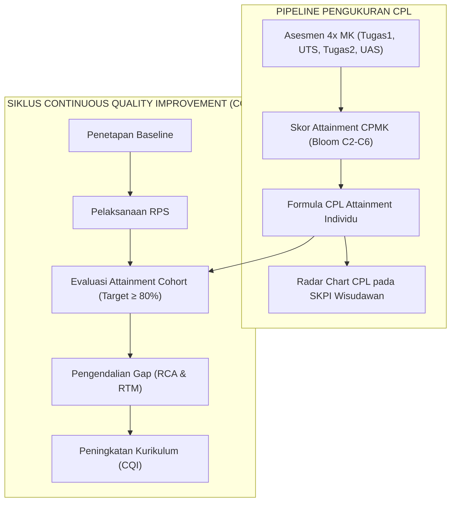

# 008 — SISTEM ASESMEN OBE, SKEMA 4x EVALUASI TERSTRUKTUR, FORMULA CPL, DAN RUBRIK MASTER
## Program Studi Sistem dan Teknologi Informasi (S1) — Fakultas Sains dan Teknologi Informasi (FSTI) Universitas Widyagama Malang

> **Dokumen Revisi Definitif Kurikulum 2026**  
> **Status:** Master Panduan Asesmen OBE Terintegrasi (Kepatuhan IKU 7 & Standar 4 Titik Asesmen)  
> **Standar Rujukan:** Standar LAM INFOKOM Kriteria 6 (Pendidikan) & Kriteria 9 (Luaran CPL), Panduan Kurikulum OBE APTIKOM v2.0, IABEE Criteria for Assessment & CQI.

---

### VISUALISASI ALUR HINGGA ASESMEN OBE & SIKLUS PPEPP



---

## 1. KERANGKA ASESMEN OBE SISTEKIN 2026

Sistem penilaian pada Kurikulum OBE SISTEKIN berorientasi penuh pada pembuktian ketercapaian **14 CPL** secara langsung (*Direct Assessment*) melalui Capaian Pembelajaran Mata Kuliah (CPMK):

```
┌──────────────────────────────────────────────────────────────────────────────────────────┐
│                         SIKLUS ASESMEN BERBASIS LUARAN (OBE)                             │
├──────────────────────────────────────────────────────────────────────────────────────────┤
│ 1. Mata Kuliah merumuskan 3–4 CPMK (Bloom C2–C6) & Sub-CPMK per pekan.                   │
│ 2. Instrumen Asesmen distandarisasi ke dalam 4 Titik Evaluasi Terstruktur.               │
│ 3. Nilai Mahasiswa dihitung per CPMK menggunakan Rubrik Analitik Terstandar.             │
│ 4. Skor Ketercapaian CPL dihitung menggunakan Formula Bobot Matriks MK ↔ CPL.            │
│ 5. Analisis Gap & Tindak Lanjut Perbaikan Berkelanjutan (PPEPP / CQI).                   │
└──────────────────────────────────────────────────────────────────────────────────────────┘
```

> [!IMPORTANT]
> **Kepatuhan IKU 7 (Indikator Kinerja Utama Kemendikbudristek):**  
> Setiap mata kuliah keahlian dan praktikum wajib mengalokasikan **minimal 50% bobot evaluasi** menggunakan metode pembelajaran partisipatif dan kolaboratif: **Case Method (Studi Kasus)** atau **Team-Based Project (PjBL)**.

---

## 2. SKEMA STANDAR 4x TITIK EVALUASI MATA KULIAH

Untuk memastikan kemudahan pengelolaan nilai di Sistem Informasi Akademik (SIAKAD), menjaga keadilan beban belajar mahasiswa, serta memetakan secara langsung 1-to-1 terhadap CPMK mata kuliah, Program Studi SISTEKIN menetapkan **Skema Baku 4x Titik Asesmen**:

| Komponen Asesmen | Jadwal Pekan | Target Evaluasi CPMK | Bobot MK Teori | Bobot MK Praktikum / Proyek (+P) |
|---|:---:|---|:---:|:---:|
| **Tugas 1** | Pekan 4 / 5 | **CPMK-1** (Fondasi Konsep / Kuis / Problem Solving Awal) | **20%** | **20%** *(Milestone Proyek 1 / Modul Lab 1)* |
| **UTS** | Pekan 8 | **CPMK-2** (atau CPMK-1 & 2) (Evaluasi Tengah Semester) | **30%** *(Ujian Teori Terjadwal)* | **25%** *(Ujian Praktik / Evaluasi Proyek 50%)* |
| **Tugas 2** | Pekan 12 / 13 | **CPMK-3** (Penerapan Lanjut / Studi Kasus / Integrasi Sistem) | **20%** *(Paper Analisis / Kasus 2)* | **25%** *(Milestone Proyek 2 / Integrasi Sistem)* |
| **UAS** | Pekan 16 | **CPMK-4** (Evaluasi Akhir Komprehensif & Sintesis CPL) | **30%** *(Ujian Akhir Komprehensif)* | **30%** *(Demo Day, Portofolio & Uji Produk)* |
| **TOTAL BOBOT** | | **Pemenuhan 100% CPMK Mata Kuliah** | **100%** | **100%** |

*Catatan:* Pekan-pekan selain 4 titik di atas difokuskan pada aktivitas pembelajaran aktif (*active learning, hands-on coding, live discussion*) yang bersifat formatif (*non-graded*).

---

## 3. FORMULA MATEMATIS KETERCAPAIAN CPL (CPL ATTAINMENT FORMULATION)

### 3.1 Perhitungan Ketercapaian CPMK pada Mata Kuliah ($Score_{CPMK_j}$)
Skor ketercapaian untuk suatu $CPMK_j$ pada mata kuliah $k$ oleh mahasiswa $i$ dihitung sebagai rata-rata berbobot dari instrumen asesmen terkait:

$$Score_{CPMK_j, k}(i) = \sum_{m=1}^{M} \left( W_{jm} \times Score_{m}(i) \right)$$

*Dimana:*
* $Score_m(i)$ = Nilai instrumen asesmen ke-$m$ (Tugas 1, UTS, Tugas 2, atau UAS, skala 0–100).
* $W_{jm}$ = Bobot instrumen ke-$m$ terhadap $CPMK_j$ ($\sum W_{jm} = 1.0$).

---

### 3.2 Perhitungan Nilai Akhir Mata Kuliah ($NA_k$)
Nilai akhir mata kuliah merupakan agregasi dari seluruh ketercapaian CPMK:

$$NA_k(i) = \sum_{j=1}^{J} \left( W_{CPMK_j, k} \times Score_{CPMK_j, k}(i) \right)$$

---

### 3.3 Perhitungan Ketercapaian CPL Mahasiswa Individu ($Attainment_{CPL_x}(i)$)
Ketercapaian seorang mahasiswa $i$ pada suatu $CPL_x$ dihitung dari seluruh mata kuliah pembina $CPL_x$:

$$Attainment_{CPL_x}(i) = \frac{\sum_{k \in MK(CPL_x)} \left( SKS_k \times Weight_{k, CPL_x} \times NA_k(i) \right)}{\sum_{k \in MK(CPL_x)} \left( SKS_k \times Weight_{k, CPL_x} \right)}$$

*Ambang Batas Kelulusan CPL Minimum:* **65,0 (Kategori B / Memuaskan)**.

---

### 3.4 Perhitungan Ketercapaian CPL Program Studi ($Cohort\_Attainment_{CPL_x}$)
Untuk akreditasi LAM INFOKOM Kriteria 9, persentase ketercapaian kohor lulusan dihitung:

$$\% Cohort\_Attainment_{CPL_x} = \left( \frac{\text{Jumlah Mahasiswa dengan } Attainment_{CPL_x} \ge 65.0}{\text{Total Mahasiswa dalam Angkatan}} \right) \times 100\%$$

*Target Standar Mutu Prodi SISTEKIN:* **Minimal 80% mahasiswa mencapai threshold CPL $\ge 65,0$**.

---

## 4. MASTER RUBRIK PENILAIAN OBE TERSTANDAR

### 4.1 Rubrik 1: Penilaian Proyek Rekayasa Perangkat Lunak & Coding (PjBL)
*Digunakan untuk MK Praktikum, Platform Engineering, AI, dan Capstone Project.*

| Kriteria | Sangat Baik (81 – 100) | Baik (70 – 80) | Cukup (56 – 69) | Kurang (< 56) |
|---|---|---|---|---|
| **1. Arsitektur & Struktur Kode (25%)** | Arsitektur modular, SOLID, clean code, terdokumentasi rapi. | Arsitektur cukup modular, pola desain standar industri. | Arsitektur kurang teratur, terjadi duplikasi kode. | Kode monolitik tanpa pola, sulit dibaca dan dipelihara. |
| **2. Fungsionalitas & Fitur (35%)** | 100% fitur berjalan sempurna sesuai SRS, zero fatal bug. | 80–99% fitur berjalan baik, ada bug minor non-fatal. | 60–79% fitur berjalan, beberapa error fungsional. | Fitur utama gagal berfungsi, crash saat runtime. |
| **3. UI/UX & Responsivitas (20%)** | Antarmuka intuitif, estetik, adaptif di multi-device. | Antarmuka baik dan responsif pada layar desktop/mobile. | Antarmuka standar, kaku, atau cacat visual minor. | Antarmuka buruk, tidak ramah pengguna, tidak responsif. |
| **4. Pengujian & Dokumentasi (20%)** | Pengujian otomatis/manual komprehensif, README & API spec rapi. | Pengujian memadai, dokumentasi instalasi lengkap. | Pengujian minimal, dokumentasi teknis kurang lengkap. | Tidak ada bukti pengujian, tanpa dokumentasi. |

---

### 4.2 Rubrik 2: Penilaian Presentasi Lisan & Komunikasi Ilmiah
*Digunakan untuk Seminar Proposal, Sidang Proyek, dan Capstone Project.*

| Kriteria | Sangat Baik (81 – 100) | Baik (70 – 80) | Cukup (56 – 69) | Kurang (< 56) |
|---|---|---|---|---|
| **1. Penguasaan Materi (40%)** | Menguasai penuh materi & mampu menjawab pertanyaan kritis secara ilmiah. | Memahami materi dengan baik, jawaban tepat dan logis. | Pemahaman cukup, namun ragu-ragu saat tanya jawab. | Tidak menguasai materi, tidak mampu menjawab pertanyaan. |
| **2. Kualitas Media Visual (30%)** | Slide profesional, visual infografis kuat, data terstruktur. | Slide rapi, teks terbaca jelas, visual mendukung. | Slide terlalu padat teks (*text-heavy*), visual minim. | Slide buruk, tidak terstruktur, banyak salah ketik (*typo*). |
| **3. Artikulasi & Waktu (30%)** | Artikulasi lugas, percaya diri, kontak mata baik, tepat waktu. | Komunikasi jelas, intonasi baik, alokasi waktu pas. | Suara monoton, sedikit melebihi batas waktu. | Komunikasi pasif, tidak terkontrol, tidak profesional. |

---

### 4.3 Rubrik 3: Penilaian Karya Tulis & Laporan Rekayasa
*Digunakan untuk Laporan Praktikum, Tugas Analisis Kasus, dan Skripsi.*

| Kriteria | Sangat Baik (81 – 100) | Baik (70 – 80) | Cukup (56 – 69) | Kurang (< 56) |
|---|---|---|---|---|
| **1. Kedalaman Analisis (40%)** | Analisis kritis mendalam, sintesis literatur mutakhir, solusi orisinal. | Analisis baik, argumen terstruktur, rujukan relevan. | Analisis bersifat deskriptif, kurang mendalam. | Analisis dangkal, tanpa landasan teori yang memadai. |
| **2. Metodologi Rekayasa (30%)** | Metodologi ilmiah/rekayasa tepat, tahapan sistematis dan valid. | Metodologi tepat dan dapat dipertanggungjawabkan. | Metodologi kurang lengkap atau ada langkah terlewat. | Metodologi tidak jelas atau keliru. |
| **3. Tata Tulis & Sitasi (30%)** | Format standar IEEE/APA sempurna, sitasi Mendeley, bebas plagiasi (<20%). | Format rapi, sitasi standar, kemiripan rendah. | Format kurang konsisten, ada kesalahan sitasi minor. | Format tidak rapi, banyak salah eja, indikasi plagiasi. |

---

## 5. INTEGRASI CAPAIAN CPL KE DALAM SKPI (SURAT KETERANGAN PENDAMPING IJAZAH)


Hasil ketercapaian 14 CPL mahasiswa selama 8 semester akan dicetak sebagai **Portofolio Capaian OBE (Radar Chart CPL)** pada lampiran resmi SKPI lulusan:

```
                  S1 (Sikap & Etika)
                        [100]
                     /    |    \
             KK6 [85]     |     [90] KU1 (Berpikir Kritis)
            /             |             \
      KK5 [92]            |              [88] KU2 (Komunikasi)
     /                    |                    \
   KK4 [80]               |                     [85] KU3 (Manajemen Mandiri)
   |                      |                      |
   KK3 [88]           SISTEKIN                   | P1 (Sains & Mat) [82]
   |                   ALUMNI                    |
   KK2 [94]           OBE RADAR                  | P2 (Konsep SI) [90]
     \                    |                    /
      KK1 [95]            |              [88] P3 (Infra & Security)
            \             |             /
             [92] P4 (RPL & Data Platform)
```

---

## 6. SIKLUS CONTINUOUS QUALITY IMPROVEMENT (CQI) — PPEPP

Apabila terdapat $CPL_x$ yang belum memenuhi ambang batas target prodi ($\ge 80\%$), Program Studi menjalankan siklus perbaikan PPEPP:
1. **Penetapan (P):** Meninjau ulang target baseline CPL.
2. **Pelaksanaan (P):** Mengajar sesuai RPS terstandar OBE.
3. **Evaluasi (E):** Mengukur CPL pada akhir semester via Rapat Tinjauan Kurikulum.
4. **Pengendalian (P):** Melakukan *Root Cause Analysis* (RCA) pada MK yang mengalami anomali nilai.
5. **Peningkatan (P):** Memperbaiki modul praktikum, memberikan pelatihan dosen, atau memperbarui studi kasus industri pada semester berikutnya.

---
*Disahkan sebagai Dokumen Resmi 008 — Kurikulum OBE Revisi SISTEKIN 2026.*  
**Tim Pengembang Kurikulum FSTI Universitas Widyagama Malang**
