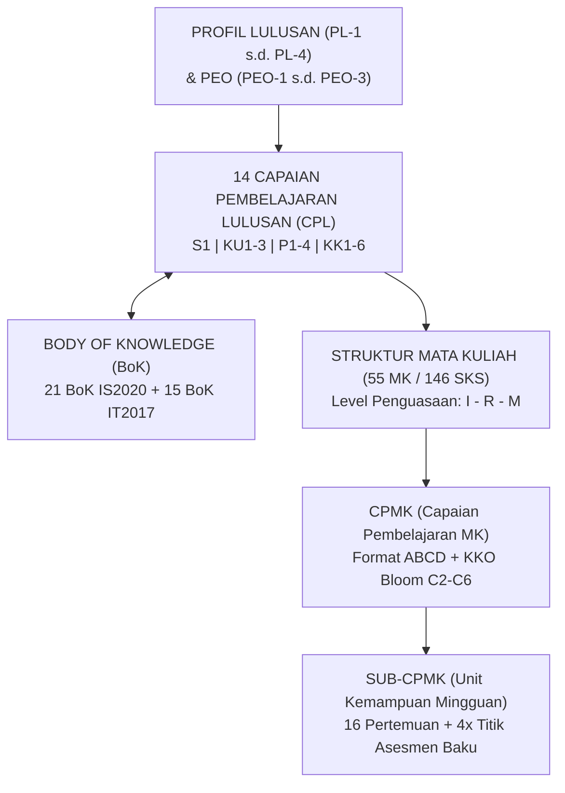

# 009 — LANGKAH 2: CPL FORMAL (14 CPL) & MATRIKS TERINTEGRASI

**Status:** FINAL — 14 CPL sesuai Panduan Kurikulum OBE APTIKOM (IS2020 + IT2017) & SN-Dikti Permendikbudristek No. 53/2023  
**Institusi:** Program Studi S1 Sistem dan Teknologi Informasi (SISTEKIN) — FSTI Universitas Widyagama Malang  
**Dasar:** 4 Profil Lulusan (Dok. 002) + 3 PEO (Dok. 002) + 3 Peminatan @ 18 SKS (Dok. 005 & 006)  
**Target:** 10–15 CPL (Standar Nasional & APTIKOM) → Tepat **14 CPL** (S1 + KU1–3 + P1–4 + KK1–6)  

---

## 1. RINGKASAN 14 CPL FORMAL

| Kode | Nomenklatur CPL | Kategori | Peminatan Terkait | Target Bloom |
|:---:|---|---|:---:|:---:|
| **S1** | Sikap Profesional, Spiritual, Etika Digital, dan Kolaboratif | Sikap (S) | Semua | A3 (*Valuing*) |
| **KU1** | Berpikir Logis, Kritis, Sistematis, dan Inovatif Komputasi | Keterampilan Umum (KU) | Semua | C4 (*Analyze*) |
| **KU2** | Komunikasi Saintifik/Teknis & Networking Profesional | Keterampilan Umum (KU) | Semua | C5 (*Evaluate*) |
| **KU3** | Pengambilan Keputusan Berbasis Data, Supervisi & Lifelong Learning | Keterampilan Umum (KU) | Semua | C5 (*Evaluate*) |
| **P1** | Fondasi Sains Komputasi & Matematika Terapan | Pengetahuan (P) | Semua | C3 (*Apply*) |
| **P2** | Rekayasa Sistem Informasi, Proses Bisnis & SDLC | Pengetahuan (P) | Semua | C4 (*Analyze*) |
| **P3** | Infrastruktur TI, Cloud, Keamanan Siber & Tata Kelola (GRC) | Pengetahuan (P) | Semua | C4 (*Analyze*) |
| **P4** | Rekayasa Perangkat Lunak, Data Enterprise & UI/UX | Pengetahuan (P) | Semua | C4 (*Analyze*) |
| **KK1** | Rekayasa Sistem Informasi Cerdas Terintegrasi AI/ML | Keterampilan Khusus (KK) | P1: Integrated Smart Systems | C6 (*Create*) |
| **KK2** | Rekayasa Data Skala Besar, BI & MLOps Pipeline | Keterampilan Khusus (KK) | P1: Integrated Smart Systems | C6 (*Create*) |
| **KK3** | Integrasi Cloud Infrastructure, Sensor IoT & Cyber Defense | Keterampilan Khusus (KK) | P2: Cloud Infra & Cyber | C6 (*Create*) |
| **KK4** | Tata Kelola TI, Audit Sistem Informasi & Kepatuhan Regulasi | Keterampilan Khusus (KK) | P2: Cloud Infra & Cyber | C5 (*Evaluate*) |
| **KK5** | Riset UI/UX & Rekayasa Platform Digital Skalabel (SaaS/API) | Keterampilan Khusus (KK) | P3: Digital Platform Eng | C6 (*Create*) |
| **KK6** | Digital Technopreneurship, Lean MVP & Manajemen Proyek Agile | Keterampilan Khusus (KK) | P3: Digital Platform Eng | C6 (*Create*) |

---

## 2. DOKUMEN DETAIL PER KATEGORI CPL (SERI 009)

| Kategori CPL | Dokumen Detail | Cakupan & Isi Analisis |
|---|---|---|
| **Sikap (S)** | [009A_CPL_SIKAP_SISTEKIN.md](file:///d:/!!MYDOCUMENTS2026/!!!SISTEKIN2026/!!BRAINSTORMING_KURIKULUM2026/KURIKULUM2026_REVISI/009A_CPL_SIKAP_SISTEKIN.md) | S1 — 5 Komponen, 6 Indikator Kinerja, Pemetaan ke 4 PL & 3 Peminatan, Silsilah SN-Dikti S1–S10. |
| **Keterampilan Umum (KU)** | [009B_CPL_KETERAMPILAN_UMUM_SISTEKIN.md](file:///d:/!!MYDOCUMENTS2026/!!!SISTEKIN2026/!!BRAINSTORMING_KURIKULUM2026/KURIKULUM2026_REVISI/009B_CPL_KETERAMPILAN_UMUM_SISTEKIN.md) | KU1–KU3 — Pemikiran Kritis, Komunikasi, Kemandirian, Indikator Kinerja, Silsilah SN-Dikti KU1–KU9. |
| **Pengetahuan (P)** | [009C_CPL_PENGETAHUAN_SISTEKIN.md](file:///d:/!!MYDOCUMENTS2026/!!!SISTEKIN2026/!!BRAINSTORMING_KURIKULUM2026/KURIKULUM2026_REVISI/009C_CPL_PENGETAHUAN_SISTEKIN.md) | P1–P4 — Sains/Matematika, SI, Infra/GRC, Platform/Data, Silsilah IS2020 (P01–P17) & IT2017 (P1–P2). |
| **Keterampilan Khusus (KK)** | [009D_CPL_KETERAMPILAN_KHUSUS_SISTEKIN.md](file:///d:/!!MYDOCUMENTS2026/!!!SISTEKIN2026/!!BRAINSTORMING_KURIKULUM2026/KURIKULUM2026_REVISI/009D_CPL_KETERAMPILAN_KHUSUS_SISTEKIN.md) | KK1–KK6 — AI, Data, Cloud/IoT, GRC, Platform UI/UX, Startup, Pemetaan 21 BoK IS2020 & 15 BoK IT2017. |
| **Ringkasan & Master BoK** | [009E_RINGKASAN_CPL_LENGKAP_PEMETAAN_BoK.md](file:///d:/!!MYDOCUMENTS2026/!!!SISTEKIN2026/!!BRAINSTORMING_KURIKULUM2026/KURIKULUM2026_REVISI/009E_RINGKASAN_CPL_LENGKAP_PEMETAAN_BoK.md) | Kompilasi Master Matriks 14 CPL ↔ 21 BoK IS ↔ 15 BoK IT ↔ 4 PL ↔ 3 Peminatan ↔ VMTS 2045. |

---

## 3. MATRIKS CPL → PEMINATAN → 4 PROFIL LULUSAN (PL)

| Kode CPL | P1: Integrated Smart Systems | P2: Cloud & Cybersecurity | P3: Digital Platform Engineering | Profil Lulusan Terkait (PL-1 s.d. PL-4) |
|:---:|:---:|:---:|:---:|---|
| **S1** | ✅ | ✅ | ✅ | PL-1, PL-2, PL-3, PL-4 (Seluruh Profil) |
| **KU1** | ✅ | ✅ | ✅ | PL-1, PL-2, PL-3, PL-4 (Seluruh Profil) |
| **KU2** | ✅ | ✅ | ✅ | PL-1, PL-2, PL-3, PL-4 (Seluruh Profil) |
| **KU3** | ✅ | ✅ | ✅ | PL-1, PL-2, PL-3, PL-4 (Seluruh Profil) |
| **P1** | ✅ | ✅ | ✅ | PL-1, PL-2, PL-3, PL-4 (Fondasi Komputasi) |
| **P2** | ✅ | | ✅ | PL-1 (AI Developer), PL-3 (Platform Eng), PL-4 (Technopreneur) |
| **P3** | | ✅ | | PL-2 (Cloud & Cyber Specialist), PL-4 (IT PM) |
| **P4** | ✅ | | ✅ | PL-1 (Data/AI Eng), PL-3 (Platform Eng), PL-4 (Technopreneur) |
| **KK1** | ✅ | | | PL-1 (Intelligent IS Developer & AI Engineer) |
| **KK2** | ✅ | | | PL-1 (Data Scientist & MLOps Specialist) |
| **KK3** | | ✅ | | PL-2 (Cloud Systems Integrator & IoT Architect) |
| **KK4** | | ✅ | | PL-2 (IT Auditor & Cybersecurity GRC Specialist) |
| **KK5** | | | ✅ | PL-3 (UI/UX Designer & Full-Stack Platform Engineer) |
| **KK6** | | | ✅ | PL-4 (Digital Technopreneur & IT Product Innovator) |

---

## 4. VERIFIKASI KEPATUHAN vs STANDAR KURIKULUM OBE APTIKOM & SN-DIKTI

| Komponen Evaluasi | Standar Panduan APTIKOM & SN-Dikti | Capaian SISTEKIN 2026 | Status Verifikasi |
|---|---|---|:---:|
| **Jumlah Total CPL** | Rentang 10 s.d. 15 CPL | Tepat **14 CPL** | ✅ Sempurna |
| **Kategori Sikap (S)** | Standar SN-Dikti (S1–S10) | 1 CPL (**S1**) mencakup 10 butir SN-Dikti | ✅ Terpenuhi |
| **Kategori Keterampilan Umum (KU)** | Standar SN-Dikti (KU1–KU9) | 3 CPL (**KU1, KU2, KU3**) terintegrasi | ✅ Terpenuhi |
| **Kategori Pengetahuan (P)** | Standar Domain IS2020 & IT2017 | 4 CPL (**P1, P2, P3, P4**) | ✅ Terpenuhi |
| **Kategori Keterampilan Khusus (KK)** | 2 CPL per Jalur Peminatan Spesialisasi | 6 CPL (**KK1 s.d. KK6**) @ 2 per peminatan | ✅ Terpenuhi |
| **Keterlacakan Bahan Kajian (BoK)** | Wajib memetakan BoK asosiasi | 21 BoK IS2020 + 15 BoK IT2017 terpetakan penuh, mencakup seluruh BK kompetensi utama wajib | ✅ Terpenuhi |
| **Keterlacakan Profil Lulusan (PL)** | Minimal 3 CPL per PL | Tiap PL ditopang oleh 8 s.d. 10 CPL | ✅ Terpenuhi |
| **Kesesuaian Taksonomi Bloom** | C2 s.d. C6 / A3 | Seluruh CPL memiliki target Bloom yang jelas | ✅ Terpenuhi |

---

## 5. HUBUNGAN STRUKTURAL: CPL vs CPMK vs SUB-CPMK

* **CPL (Level Program Studi):** 14 luaran kompetensi kumulatif sarjana SISTEKIN saat wisuda.
* **CPMK (Level Mata Kuliah):** Diturunkan langsung dari CPL yang dibebankan pada MK tersebut (rata-rata 3–4 CPMK per MK).
* **Sub-CPMK (Level Pembelajaran Mingguan):** Indikator tahapan kemampuan terukur per topik pertemuan (16 pertemuan per semester).

---

## 6. SILSILAH STANDAR RUJUKAN NASIONAL & INTERNASIONAL

| Standar Rujukan | Lembaga / Penerbit | Fokus Rujukan pada Kurikulum SISTEKIN |
|---|---|---|
| **Permendikbudristek No. 53/2023** | Kemendikbudristek RI | Standar Penjaminan Mutu, Fleksibilitas MBKM, Beban Min. 144 SKS, Opsi TA Non-Skripsi. |
| **IS2020** | ACM / AIS / APTIKOM SI v2.0 | Standar Kurikulum Sistem Informasi: 17 CPL-P, 17 CPL-K, dan 19 Bahan Kajian master (11 kompetensi utama wajib diadopsi + 1 umum + 7 pendukung). |
| **IT2017 / CC2020** | ACM / IEEE / APTIKOM TI 2023 | Standar Kurikulum Teknologi Informasi: 27 Bahan Kajian master (14 penciri utama wajib diadopsi + 13 penciri pendukung), Infrastruktur, Cloud, Cybersecurity, IoT, dan Praktek Profesional Global. |
| **KKNI Level 6 & SKKNI** | BNSP / Kemnaker RI | Deskriptor Kualifikasi Sarjana Terapan dan Sertifikasi Profesi Bidang Komputasi. |
| **LAM INFOKOM & IABEE** | Lembaga Akreditasi Mandiri | Kriteria Akreditasi OBE, Keterlacakan Matriks, Ketercapaian CPL (*CQI/PPEPP*). |

---

## 7. PANDUAN NAVIGASI DOKUMEN REVISI KURIKULUM 2026

| Kode Dokumen | Nomenklatur Dokumen | Fokus Isi Dokumen |
|---|---|---|
| [001_ANALISIS_VMTS...md](file:///d:/!!MYDOCUMENTS2026/!!!SISTEKIN2026/!!BRAINSTORMING_KURIKULUM2026/KURIKULUM2026_REVISI/001_ANALISIS_VMTS_DAN_POSITIONING_STRATEGIS_SISTEKIN.md) | Analisis VMTS & Positioning | Visi Keilmuan 2045, Analisis SWOT & Diferensiasi Prodi. |
| [002_FORMULASI_3_PEO...md](file:///d:/!!MYDOCUMENTS2026/!!!SISTEKIN2026/!!BRAINSTORMING_KURIKULUM2026/KURIKULUM2026_REVISI/002_FORMULASI_3_PEO_DAN_4_PROFIL_LULUSAN_SISTEKIN.md) | Formulasi 3 PEO & 4 PL | 3 PEO & 4 Profil Lulusan Role-Based + Indikator Kinerja. |
| [003_STANDAR_14_CPL...md](file:///d:/!!MYDOCUMENTS2026/!!!SISTEKIN2026/!!BRAINSTORMING_KURIKULUM2026/KURIKULUM2026_REVISI/003_STANDAR_14_CPL_DAN_PEMETAAN_BoK_APTIKOM.md) | Standar 14 CPL & BoK | Detail 14 CPL, Genealogi Sumber, 21 BoK IS & 15 BoK IT. |
| [004_MATRIKS_KETERLACAKAN...md](file:///d:/!!MYDOCUMENTS2026/!!!SISTEKIN2026/!!BRAINSTORMING_KURIKULUM2026/KURIKULUM2026_REVISI/004_MATRIKS_KETERLACAKAN_OBE_VMTS_PEO_PL_CPL_MK.md) | Matriks Keterlacakan OBE | Matriks Makro VMTS ↔ PEO ↔ PL ↔ CPL ↔ MK (Level I-R-M). |
| [005_STRUKTUR_KURIKULUM...md](file:///d:/!!MYDOCUMENTS2026/!!!SISTEKIN2026/!!BRAINSTORMING_KURIKULUM2026/KURIKULUM2026_REVISI/005_STRUKTUR_KURIKULUM_8_SEMESTER_DAN_PEMINATAN.md) | Struktur Kurikulum 8 Semester | Paket 55 MK / 146 SKS Ditempuh (Portofolio 67 MK / 182 SKS). |
| [006_DISTRIBUSI_PEMINATAN...md](file:///d:/!!MYDOCUMENTS2026/!!!SISTEKIN2026/!!BRAINSTORMING_KURIKULUM2026/KURIKULUM2026_REVISI/006_DISTRIBUSI_DAN_PANDUAN_MK_PEMINATAN_MBKM.md) | Distribusi Peminatan & MBKM | 3 Peminatan @ 18 SKS & Panduan Ekuivalensi 20 SKS MBKM. |
| [007_FORMULASI_CPMK...md](file:///d:/!!MYDOCUMENTS2026/!!!SISTEKIN2026/!!BRAINSTORMING_KURIKULUM2026/KURIKULUM2026_REVISI/007_FORMULASI_CPMK_DAN_SUB_CPMK_PORTFOLIO_LENGKAP.md) | Silabus Portofolio 67 MK | Formulasi CPMK/Sub-CPMK 67 MK Lengkap dengan 4x Asesmen Baku. |
| [008_SISTEM_ASESMEN_OBE...md](file:///d:/!!MYDOCUMENTS2026/!!!SISTEKIN2026/!!BRAINSTORMING_KURIKULUM2026/KURIKULUM2026_REVISI/008_SISTEM_ASESMEN_OBE_FORMULA_CPL_DAN_RUBRIK_MASTER.md) | Sistem Asesmen OBE & Rubrik | Formula CPL Attainment, 4 Titik Evaluasi, 4 Rubrik Analitik & CQI. |
| [009_LANGKAH2_CPL_FORMAL.md](file:///d:/!!MYDOCUMENTS2026/!!!SISTEKIN2026/!!BRAINSTORMING_KURIKULUM2026/KURIKULUM2026_REVISI/009_LANGKAH2_CPL_FORMAL.md) | Dokumen Ini — CPL Formal | Ringkasan Terpadu Langkah 2 CPL Formal SISTEKIN 2026. |
| [009A s.d. 009E](file:///d:/!!MYDOCUMENTS2026/!!!SISTEKIN2026/!!BRAINSTORMING_KURIKULUM2026/KURIKULUM2026_REVISI/009E_RINGKASAN_CPL_LENGKAP_PEMETAAN_BoK.md) | Seri Detail Matriks CPL | Rincian Kategori S, KU, P, KK, dan Matriks Kompilasi BoK. |
| [011_IMPLEMENTASI_OBE...md](file:///d:/!!MYDOCUMENTS2026/!!!SISTEKIN2026/!!BRAINSTORMING_KURIKULUM2026/KURIKULUM2026_REVISI/011_IMPLEMENTASI_OBE_SISTEKIN2026_TABLES.md) | 14 Sheet Matriks Terpadu | Master Workbook 14 Sheet Exportable ke Excel/Word/PDF. |

---
*Dokumen ini merupakan Dokumen 009 (Langkah 2: CPL Formal) Definitif Kurikulum OBE SISTEKIN 2026.*  
**Tim Pengembang Kurikulum FSTI — Universitas Widyagama Malang**
