# 012 — ANALISIS KRITIS JALUR PONDASI DAN TREE VIEW PRASYARAT
## Program Studi Sistem dan Teknologi Informasi (S1) — Fakultas Sains dan Teknologi Informasi (FSTI) Universitas Widyagama Malang

**Dokumen Analisis Arsitektur Kurikulum & Keterlacakan Prasyarat (Constructive Alignment)**  
**Standar Rujukan:** SN-Dikti Permendikbudristek No. 53 Tahun 2023, Panduan Kurikulum OBE APTIKOM v2.0 (IS2020 & IT2017), Standar IABEE & LAM INFOKOM.

---

## 1. EKSEKUTIF SUMMARY & HASIL AUDIT JALUR PONDASI

Setelah dilakukan audit akademik mendalam terhadap **55 Mata Kuliah Paket Wajib (146 SKS)** dan **18 Mata Kuliah Portofolio Elektif (54 SKS Ditawarkan)**, seluruh mata kuliah tingkat lanjut di Semester 5, 6, dan 7 terbukti **memiliki rantai fondasi (pedigree) yang kokoh, sekuensial, dan bebas dari mata kuliah tanpa fondasi (*zero orphan courses*)**.

Struktur kurikulum SISTEKIN 2026 dibangun di atas **5 Jalur Pilar Keilmuan Utama**:
1. **Pilar 1: AI, Data Science & Intelligent Systems** *(Flagship Track — PL-1 & Peminatan 1)*
2. **Pilar 2: Cloud Infrastructure, Networks & Cybersecurity** *(Volume Track — PL-2 & Peminatan 2)*
3. **Pilar 3: Software, Web/Mobile & Digital Platform Engineering** *(Niche Track — PL-3 & Peminatan 3)*
4. **Pilar 4: IT Governance, Enterprise Architecture & Systems Analysis** *(Enterprise Track — PL-2 & PL-3)*
5. **Pilar 5: Technopreneurship, Metodologi Riset, Capstone & Skripsi Culmination** *(Synthesizing Track — PL-4 & Seluruh Lulusan)*

---

## 2. DIAGRAM ALIR MAKRO KETERLACAKAN 5 PILAR (MERMAID)

```mermaid
graph TD
    subgraph P1 ["PILAR 1: AI, DATA SCIENCE & INTELLIGENT SYSTEMS"]
        S1_Math["Sem 1: Kalkulus & Logika"] --> S2_Math["Sem 2: Aljabar Linear & Matdis"]
        S1_Prog["Sem 1: Algoritma & Pemrograman"] --> S2_DB["Sem 2: Basis Data & Struktur Data"]
        S2_Math --> S3_AI["Sem 3: Sistem Cerdas"]
        S2_DB --> S4_ML["Sem 4: Machine Learning (+P)"]
        S3_AI --> S4_NLP["Sem 4: Pengantar NLP & IR (+P)"]
        S2_DB --> S4_DW["Sem 4: Data Warehouse & BI (+P)"]
        S4_ML --> S5_DL["Sem 5: Deep Learning & Neural Net (+P)"]
        S4_DW --> S5_DM["Sem 5: Data Mining & Visualisasi (+P)"]
        S4_ML --> S5_STA01["Sem 5 (P1): Decision Support Systems (+P)"]
        S5_DL --> S6_AI_Int["Sem 6: Integrasi Layanan Cerdas AI (+P)"]
        S4_NLP --> S6_AI_Int
        S3_AI --> S6_STA03["Sem 6 (P1): Sistem Agen Cerdas (+P)"]
        S2_Math --> S6_STA02["Sem 6 (P1): Komputasi Numerik (+P)"]
        S5_DL --> S7_STA04["Sem 7 (P1): MLOps & AI Pipeline (+P)"]
        S4_NLP --> S7_STA05["Sem 7 (P1): Conversational AI & LLM (+P)"]
        S5_DL --> S7_STA06["Sem 7 (P1): Smart Surveillance & Edge AI (+P)"]
    end

    subgraph P2 ["PILAR 2: CLOUD INFRASTRUCTURE & CYBERSECURITY"]
        S1_STI["Sem 1: Pengantar STI"] --> S2_Etika["Sem 2: Etika & Hukum Siber"]
        S1_Prog --> S2_StrukDat["Sem 2: Struktur Data"]
        S2_StrukDat --> S3_OS["Sem 3: Sistem Operasi"]
        S1_STI --> S3_Net["Sem 3: Jaringan Komputer (+P)"]
        S3_OS --> S4_Cloud["Sem 4: Komputasi Awan (Cloud)"]
        S3_Net --> S4_Cloud
        S3_Net --> S4_Sec["Sem 4: Dasar Keamanan Informasi"]
        S3_Net --> S5_IoT["Sem 5: Internet of Things (IoT) (+P)"]
        S3_OS --> S5_IoT
        S3_Net --> S5_STB01["Sem 5 (P2): Keamanan Jaringan & Forensik (+P)"]
        S4_Sec --> S5_STB01
        S4_Cloud --> S6_STB02["Sem 6 (P2): Cloud Architecture & DevOps (+P)"]
        S4_Sec --> S6_STB03["Sem 6 (P2): Penetrasi Testing & Red Team (+P)"]
        S4_Sec --> S6_SecAdv["Sem 6: Keamanan Informasi Lanjut"]
        S5_IoT --> S6_SmartCity["Sem 6: Smart City & Pem. Digital"]
        S6_SecAdv --> S7_STB05["Sem 7 (P2): Keamanan Cloud & Kripto (+P)"]
        S6_STB02 --> S7_STB06["Sem 7 (P2): Rekayasa Ketahanan SRE (+P)"]
        S3_OS --> S7_STB04["Sem 7 (P2): IT Governance COBIT 2019"]
    end

    subgraph P3 ["PILAR 3: SOFTWARE & DIGITAL PLATFORM ENGINEERING"]
        S1_Prog --> S2_OOP["Sem 2: Pemrograman Berorientasi Objek"]
        S2_OOP --> S3_APSI["Sem 3: Analisis & Perancangan SI"]
        S2_OOP --> S3_RPL["Sem 3: Rekayasa Perangkat Lunak"]
        S1_STI --> S3_UIUX["Sem 3: UI/UX Design & Prototyping (+P)"]
        S2_OOP --> S3_WebFront["Sem 3: Web Front End Development (+P)"]
        S3_WebFront --> S4_WebBack["Sem 4: Web Back End Development (+P)"]
        S2_DB --> S4_WebBack
        S3_UIUX --> S5_STC01["Sem 5 (P3): UX Research & Design System (+P)"]
        S4_WebBack --> S5_Mobile["Sem 5: Pemrograman Mobile (+P)"]
        S3_WebFront --> S5_Mobile
        S4_WebBack --> S6_Platform["Sem 6: Digital Platform Engineering (+P)"]
        S3_APSI --> S6_STC02["Sem 6 (P3): Otomasi Proses Bisnis BPMN (+P)"]
        S4_WebBack --> S6_STC03["Sem 6 (P3): Aplikasi Vertikal Industri (+P)"]
        S3_UIUX --> S7_STC04["Sem 7 (P3): Spatial Computing & XR (+P)"]
        S6_Platform --> S7_STC05["Sem 7 (P3): Arsitektur SaaS Enterprise (+P)"]
    end

    subgraph P5 ["PILAR 5: SINTESIS CAPSTONE, RISET & STARTUP"]
        S2_KWU["Sem 2: Kewirausahaan I"] --> S5_Manpro["Sem 5: Manajemen Proyek TI"]
        S3_APSI --> S5_Manpro
        S5_Manpro --> S7_Capstone["Sem 7: Capstone Project FSTI (+P)"]
        S6_Platform --> S7_Startup["Sem 7: Inovasi & Startup Digital (+P)"]
        S2_KWU --> S7_Startup
        S4_ML --> S6_Metpen["Sem 6: Metodologi Penelitian"]
        S6_Metpen --> S7_Sempro["Sem 7: Pra-Skripsi / Sempro"]
        S7_Sempro --> S8_Skripsi["Sem 8: Skripsi Murni / 4 Opsi Non-Skripsi (6 SKS)"]
        S7_Capstone --> S8_Skripsi
    end
```



---

## 3. POHON SILSILAH PEMBELAJARAN DETAIL PER PILAR (TOP-TO-DOWN TREE)

---

### 🌲 PILAR 1: AI, DATA SCIENCE & INTELLIGENT SYSTEMS (PL-1 & P1)

```text
[SEM 8]  FST-714 Skripsi / Tugas Akhir (Topik AI / Data Science / Intelligent Systems)
   │
[SEM 7]  ├── STA-04 MLOps & AI Model Deployment (+P) ─────────┐
         ├── STA-05 Natural Language Processing & LLM (+P) ────┤
         ├── STA-06 Smart Surveillance & Vision Analytics ─────┤
         │                                                     │
[SEM 6]  ├── STI-601 Integrasi Layanan Cerdas AI (+P) ─────────┤
         ├── STA-03 Sistem Agen Cerdas & Multi-Agent (+P) ─────┤
         ├── STA-02 Metode Komputasi Numerik Terapan (+P) ─────┤
         │                                                     │
[SEM 5]  ├── STI-501 Deep Learning & Neural Networks (+P) ─────┴── STI-401 Machine Learning (+P) [SEM 4]
         │                                                           │
         ├── STI-503 Data Mining & Visualisasi Data (+P) ────────────┼── STI-402 Data Warehouse & BI [SEM 4]
         │                                                           │
         ├── STA-01 Decision Support Systems (+P) ───────────────────┼── STI-403 Pengantar NLP & IR [SEM 4]
         │                                                           │     │
[SEM 4]  └── STI-401 Machine Learning (+P) ──────────────────────────┴─────┼── STI-302 Sistem Cerdas [SEM 3]
               │                                                           │     │
[SEM 3]        └── STI-302 Sistem Cerdas [SEM 3] ──────────────────────────┼─────┴── STI-201 Matdis & STI-202 Aljabar [SEM 2]
                     │                                                     │
[SEM 2]              ├── STI-201 Matematika Diskrit dan Logika ────────────┼── STI-103 Arsitektur & Organisasi STI [SEM 1]
                     ├── STI-202 Aljabar Linear Terapan & Matriks ─────────┼── STI-102 Kalkulus [SEM 1]
                     ├── FST-207 Sistem Basis Data (+P) ───────────────────┼── FST-102 Algoritma & Pemrograman [SEM 1]
                     └── FST-408 Statistika & Probabilitas ────────────────┘
```

#### 🔍 Analisis Kritis & Justifikasi Pedagogis Pilar 1:
1. **Peran Kunci `STI-403 Pengantar NLP & IR` (Sem 4):** Menjadi jembatan esensial untuk `STA-05 Conversational AI` (Sem 7) yang berbasis LLM/RAG. Tanpa fondasi tokenisasi, TF-IDF, vector space model, dan embedding di Sem 4, pemahaman generative AI di Sem 7 akan bersifat superficial.
2. **Keterpaduan Deep Learning & Machine Learning:** `STI-401 Machine Learning` (Sem 4) mengajarkan *classical tabular & loss minimization*, yang menjadi landasan wajib bagi `STI-501 Deep Learning` (Sem 5) yang memperdalam *backpropagation, CNN, RNN/LSTM, dan Attention Mechanism*.
3. **MLOps sebagai Muara Rekayasa:** `STA-04 MLOps` (Sem 7) mensintesis model machine learning dengan containerization dan pipeline deployment (menghubungkan pilar AI dengan pilar Cloud/DevOps).

---

### 🌲 PILAR 2: CLOUD INFRASTRUCTURE & CYBERSECURITY (PL-2 & P2)

```text
[SEM 8]  FST-714 Skripsi / Tugas Akhir (Topik Cloud Native & Cyber Resilience)
   │
[SEM 7]  ├── STB-04 IT Governance & Compliance COBIT 2019 ────┐
         ├── STB-05 Keamanan Cloud & Kriptografi Terapan ──────┤
         ├── STB-06 Rekayasa Ketahanan Sistem & SRE (+P) ──────┤
         │                                                     │
[SEM 6]  ├── STB-02 Cloud Architecture & DevOps (+P) ──────────┼── STI-404 Komputasi Awan (Cloud) [SEM 4]
         ├── STB-03 Penetration Testing & Red Teaming (+P) ────┤     │
         ├── STI-603 Keamanan Informasi Lanjut ────────────────┤     │
         │                                                     │     │
[SEM 5]  ├── STI-504 Internet of Things (IoT) (+P) ────────────┼── STI-307 Jaringan Komputer [SEM 3]
         ├── STB-01 Keamanan Jaringan & Forensik Digital ──────┤     │
         │                                                     │     │
[SEM 4]  ├── STI-404 Komputasi Awan (Cloud Computing) ─────────┴─────┼── STI-305 Sistem Operasi [SEM 3]
         └── STI-405 Dasar Keamanan Informasi ───────────────────────┘     │
               │                                                           │
[SEM 3]        ├── STI-307 Jaringan Komputer (+P) ─────────────────────────┼── STI-103 Arsitektur & Organisasi STI [SEM 1]
               └── STI-305 Sistem Operasi ─────────────────────────────────┴── STI-103 Arsitektur & Organisasi STI [SEM 1]
                     │                                                          │
[SEM 2]              ├── FST-206 Etika Profesi & Hukum Digital ─────────────────┴── FST-101 Dasar Teknologi Digital [SEM 1]
[SEM 1]              └── STI-103 Arsitektur dan Organisasi Sistem Teknologi Informasi
```

#### 🔍 Analisis Kritis & Justifikasi Pedagogis Pilar 2:
1. **Dwi-Fondasi Sem 3 (OS & Jarkom):** `STI-305 Sistem Operasi` (proses, memori, kernel, virtualisasi) dan `STI-307 Jaringan Komputer` (TCP/IP, subnetting, routing) berakar langsung dari `STI-103 Arsitektur dan Organisasi Sistem Teknologi Informasi` di Sem 1, dan menjadi fondasi ganda bagi `STI-404 Cloud` dan `STI-405 Security`.
2. **Kematangan Bertahap Cyber Defense:** 
   * Sem 2: Regulasi & UU ITE (`FST-206`)
   * Sem 4: CIA Triad, Kripto Klasik, Risk (`STI-405`)
   * Sem 5: Wireshark, Packet Inspection, Autopsy (`STB-01`)
   * Sem 6: Ethical Hacking, OWASP Top 10, Kali Linux (`STB-03` & `STI-603`)
   * Sem 7: Zero-Trust Cloud & GRC Enterprise (`STB-04` & `STB-05`).

---

### 🌲 PILAR 3: SOFTWARE, PLATFORM & UI/UX ENGINEERING (PL-3 & P3)

```text
[SEM 8]  FST-714 Skripsi / Tugas Akhir (Topik Enterprise Digital Platform & SaaS)
   │
[SEM 7]  ├── STC-04 Spatial Computing & XR Development (+P) ──┐
         ├── STC-05 Arsitektur SaaS & Multi-Tenancy (+P) ──────┤
         ├── STC-06 Manajemen Produk Digital & Growth ─────────┤
         │                                                     │
[SEM 6]  ├── STI-604 Digital Platform Engineering (+P) ────────┼── STI-407 Web Back End Development [SEM 4]
         ├── STC-02 Rekayasa & Otomasi Proses Bisnis BPMN ─────┤     │
         ├── STC-03 Pengembangan Aplikasi Vertikal Industri ───┤     │
         │                                                     │     │
[SEM 5]  ├── STI-505 Pemrograman Aplikasi Mobile (+P) ─────────┼── STI-306 Web Front End Development [SEM 3]
         ├── STC-01 Advanced UX Research & Design System ──────┤     │
         │                                                     │     │
[SEM 4]  └── STI-407 Web Back End Development (+P) ────────────┴─────┼── STI-304 Rekayasa Perangkat Lunak [SEM 3]
               │                                                     │     │
[SEM 3]        ├── STI-306 Pemrograman Web Front-End (+P) ───────────┼── STI-303 UI/UX Design [SEM 3]
               ├── STI-304 Rekayasa Perangkat Lunak ─────────────────┼── STI-301 Analisis & Desain SI [SEM 3]
               ├── STI-303 UI/UX Design & Prototyping (+P) ──────────┤     │
               └── STI-301 Analisis & Perancangan SI ────────────────┴── FST-207 Sistem Basis Data [SEM 2]
                     │                                                     │
[SEM 2]              ├── STI-202 Pemrograman Berorientasi Objek (+P) ──────┴── STI-201 Struktur Data [SEM 2]
                     └── FST-207 Sistem Basis Data (+P) ────────────────────── STI-101 Algoritma & Pemrograman [SEM 1]
```

#### 🔍 Analisis Kritis & Justifikasi Pedagogis Pilar 3:
1. **Pemisahan Front-End dan Back-End yang Rapi:** 
   * `STI-306 Web Front-End` di Semester 3 (HTML/CSS/JS, React/Vue, Component Lifecycle)
   * `STI-407 Web Back-End` di Semester 4 (NodeJS/FastAPI, RESTful/GraphQL, ORM, Auth JWT)
   * Terintegrasi menjadi `STI-505 Mobile App` di Sem 5 dan `STI-604 Platform Engineering` di Sem 6.
2. **SaaS Architecture sebagai Puncak:** `STC-05 SaaS Architecture` (Sem 7) mengajarkan multi-tenancy database, rate limiting, billing API, dan microservices scaling yang membutuhkan kematangan penuh dari Sem 1 hingga Sem 6.

---

### 🌲 PILAR 4 & 5: SINTESIS CAPSTONE, RISET & TECHNOPRENEURSHIP

```text
[SEM 8]  FST-714 SKRIPSI / TUGAS AKHIR MURNI (6 SKS) ATAU 4 OPSI NON-SKRIPSI
   │
[SEM 7]  ├── FST-613 Pra-Skripsi / Seminar Proposal (2 SKS) ──┐
         ├── FST-610 Capstone Project FSTI (3 SKS) ───────────┼── STI-506 Manajemen Proyek TI [SEM 5]
         ├── FST-612 Praktik Kerja Lapangan / PKL (3 SKS) ────┤     │
         ├── STI-701 Inovasi Teknologi & Startup (3 SKS) ─────┼── FST-611 Metodologi Penelitian [SEM 6]
         │                                                    │     │
[SEM 6]  ├── FST-611 Metodologi Penelitian (2 SKS) ───────────┴── MKU-204 Kewirausahaan I [SEM 2]
         └── STI-602 Smart City & Pemerintahan Digital (2 SKS)
               │
[SEM 5]  ├── MKU-507 Kuliah Pengabdian Masyarakat / KPM (3 SKS)
         └── STI-506 Manajemen Proyek TI (3 SKS)
               │
[SEM 2]  └── MKU-204 Kewirausahaan I (2 SKS)
```

---

## 4. MATRIKS AUDIT VALIDASI KESIAPAN PRASYARAT (SEM 5, 6, 7)

Tabel berikut membuktikan bahwa **100% mata kuliah pilihan dan wajib di Semester 5, 6, dan 7 memiliki mata kuliah fondasi pembina**:

| Smt | Kode MK | Nama Mata Kuliah | SKS | Tipe | Prasyarat Wajib Formal | Mata Kuliah Fondasi Penopang | Status Jalur |
|:---:|:---:|---|:---:|:---:|---|---|:---:|
| **5** | `STI-501` | Deep Learning & Neural Networks | 3 | +P | `STI-401` Machine Learning | `STI-202` Aljabar Linear, `FST-408` Probstat | 🟢 **Sangat Kuat** |
| **5** | `STI-503` | Data Mining & Visualisasi Data | 3 | +P | `STI-401` ML, `STI-402` DW/BI | `FST-207` Basis Data, `STI-201` Matdis | 🟢 **Sangat Kuat** |
| **5** | `STI-504` | Internet of Things (IoT) | 3 | +P | `STI-307` Jarkom, `STI-305` OS | `STI-101` Dasar Koding, `FST-101` Digital | 🟢 **Sangat Kuat** |
| **5** | `STI-505` | Pemrograman Aplikasi Mobile | 3 | +P | `STI-306` Front, `STI-407` Back | `STI-303` UI/UX Design & Prototyping | 🟢 **Sangat Kuat** |
| **5** | `STI-506` | Manajemen Proyek TI | 3 | Teori | `STI-301` APSI, `STI-304` RPL | `MKU-204` Kewirausahaan I | 🟢 **Sangat Kuat** |
| **5** | `STA-01` | Decision Support Systems *(P1)* | 3 | +P | `STI-401` Machine Learning | `FST-207` Basis Data, `STI-302` AI | 🟢 **Sangat Kuat** |
| **5** | `STB-01` | Network Security & Forensics *(P2)*| 3 | +P | `STI-307` Jarkom, `STI-405` Security | `STI-305` Sistem Operasi | 🟢 **Sangat Kuat** |
| **5** | `STC-01` | Advanced UX & Design System *(P3)* | 3 | +P | `STI-303` UI/UX Design | `STI-306` Web Front-End | 🟢 **Sangat Kuat** |
| **6** | `STI-601` | Integrasi Layanan Cerdas Berbasis AI | 3 | +P | `STI-501` DL, `STI-407` Back End | `STI-403` NLP & IR, `STI-401` ML | 🟢 **Sangat Kuat** |
| **6** | `STI-602` | Smart City & Pemerintahan Digital | 2 | Teori | `STI-504` IoT | `STI-301` APSI, `STI-404` Cloud | 🟢 **Sangat Kuat** |
| **6** | `STI-603` | Keamanan Informasi Lanjut | 3 | Teori | `STI-405` Dasar Keamanan | `STI-307` Jarkom, `STB-01` NetSec | 🟢 **Sangat Kuat** |
| **6** | `STI-604` | Digital Platform Engineering | 3 | +P | `STI-407` Web Back End | `STI-404` Cloud, `STI-304` RPL | 🟢 **Sangat Kuat** |
| **6** | `FST-611` | Metodologi Penelitian | 2 | Teori | $\ge 76\text{ SKS}$ Selesai | `FST-408` Probstat, `FST-208` Stat Dasar | 🟢 **Sangat Kuat** |
| **6** | `STA-02` | Computational Numerics *(P1)* | 3 | +P | `STI-202` Aljabar, `STI-102` Kalkulus | `FST-408` Probabilitas & Statistika | 🟢 **Sangat Kuat** |
| **6** | `STA-03` | Intelligent Agent Systems *(P1)* | 3 | +P | `STI-302` AI, `STI-401` ML | `STI-201` Matdis (Graph & Logic) | 🟢 **Sangat Kuat** |
| **6** | `STB-02` | Cloud Architecture & DevOps *(P2)* | 3 | +P | `STI-404` Cloud Computing | `STI-305` OS, `STI-407` Web Back End | 🟢 **Sangat Kuat** |
| **6** | `STB-03` | Penetration Testing *(P2)* | 3 | +P | `STI-405` Dasar Keamanan | `STI-307` Jarkom, `STB-01` NetSec | 🟢 **Sangat Kuat** |
| **6** | `STC-02` | Otomasi Proses Bisnis BPMN *(P3)* | 3 | +P | `STI-301` APSI | `STI-304` Rekayasa Perangkat Lunak | 🟢 **Sangat Kuat** |
| **6** | `STC-03` | Aplikasi Vertikal Industri *(P3)* | 3 | +P | `STI-407` Back End, `STI-306` Front | `STI-505` Pemrograman Mobile | 🟢 **Sangat Kuat** |
| **7** | `STI-701` | Inovasi Teknologi & Startup Digital | 3 | +P | `STI-604` Platform, `MKU-204` KWU | `STI-506` Manajemen Proyek TI | 🟢 **Sangat Kuat** |
| **7** | `FST-610` | Capstone Project FSTI | 3 | Proyek | `STI-506` Manpro, $\ge 100\text{ SKS}$ | Seluruh MK Core STI Sem 1–6 | 🟢 **Sangat Kuat** |
| **7** | `FST-612` | Praktik Kerja Lapangan (PKL) | 3 | Magang | $\ge 100\text{ SKS}$ Selesai | Portofolio Praktikum Sem 1–6 | 🟢 **Sangat Kuat** |
| **7** | `FST-613` | Pra-Skripsi / Seminar Proposal | 2 | Seminar | `FST-611` Metpen, $\ge 100\text{ SKS}$ | Proposal Penelitian & Literatur Ilmiah | 🟢 **Sangat Kuat** |
| **7** | `STA-04` | MLOps & AI Pipeline *(P1)* | 3 | +P | `STI-501` DL, `STI-404` Cloud | `STA-01` DSS, `STI-401` ML | 🟢 **Sangat Kuat** |
| **7** | `STA-05` | Conversational AI & LLM *(P1)* | 3 | +P | `STI-403` NLP & IR, `STI-501` DL | `STI-601` Integrasi Layanan Cerdas AI | 🟢 **Sangat Kuat** |
| **7** | `STA-06` | Smart Surveillance & Edge AI *(P1)*| 3 | +P | `STI-501` DL, `STI-504` IoT | `STI-401` Machine Learning | 🟢 **Sangat Kuat** |
| **7** | `STB-04` | IT Governance COBIT 2019 *(P2)* | 3 | Teori | `STI-301` APSI, `STI-205` Etika | `STI-506` Manajemen Proyek TI | 🟢 **Sangat Kuat** |
| **7** | `STB-05` | Keamanan Cloud & Kripto *(P2)* | 3 | +P | `STI-404` Cloud, `STI-603` Security | `STI-201` Matdis (Number Theory/Kripto) | 🟢 **Sangat Kuat** |
| **7** | `STB-06` | SRE & Ketahanan Sistem *(P2)* | 3 | +P | `STB-02` DevOps, `STI-404` Cloud | `STI-305` Sistem Operasi | 🟢 **Sangat Kuat** |
| **7** | `STC-04` | Spatial Computing & XR *(P3)* | 3 | +P | `STI-303` UI/UX, `STI-306` Front | Aljabar Linear 3D Transformation | 🟢 **Sangat Kuat** |
| **7** | `STC-05` | Arsitektur SaaS Enterprise *(P3)* | 3 | +P | `STI-604` Platform, `STI-404` Cloud | `STI-407` Web Back End Development | 🟢 **Sangat Kuat** |
| **7** | `STC-06` | Manajemen Produk Digital *(P3)* | 3 | Teori | `STI-701` Startup, `STI-303` UI/UX | `MKU-204` Kewirausahaan I | 🟢 **Sangat Kuat** |

---

## 5. KESIMPULAN AUDIT KELAYAKAN AKREDITASI

1. **Constructive Alignment Terpenuhi:** Kenaikan tingkat kognitif Taksonomi Bloom berjalan teratur dari $C_2-C_3$ (Tahun 1) $\rightarrow$ $C_3-C_4$ (Tahun 2) $\rightarrow$ $C_4-C_5$ (Tahun 3) $\rightarrow$ $C_5-C_6$ (Tahun 4 / Skripsi & Capstone).
2. **Kesesuaian dengan Kerangka IABEE / Seoul Accord:** Matriks prasyarat ini menjamin terpenuhinya kriteria *Complex Engineering Problem Solving* di tingkat akhir karena mahasiswa telah menempuh seluruh fondasi matematika, komputasi, dan rekayasa pendukung.
3. **Kesiapan MBKM:** Mahasiswa yang mengambil program MBKM di Semester 6 atau 7 telah memiliki bekal kompetensi minimal 100 SKS yang solid pada ranah koding, basis data, jaringan, dan kecerdasan artifisial.

---
*Disahkan sebagai Dokumen Resmi 012 — Kurikulum OBE Revisi SISTEKIN 2026.*  
**Tim Pengembang Kurikulum FSTI Universitas Widyagama Malang**
