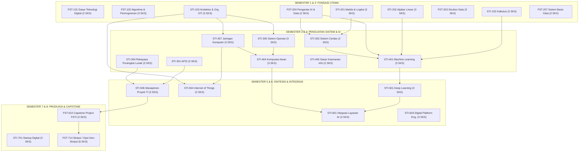

# 017 — AUDIT FORENSIK ZERO REDUNDANCY & ZERO GAP KURIKULUM SISTEKIN 2026

## PROGRAM STUDI SISTEM DAN TEKNOLOGI INFORMASI (SISTEKIN)
### FAKULTAS SAINS DAN TEKNOLOGI INFORMASI (FSTI) — UNIVERSITAS WIDYAGAMA MALANG

---

## 1. EKSEKUTIF SUMMARY & TUJUAN AUDIT

Dokumen ini merupakan **artefak audit kurikuler forensik definitif** yang membuktikan bahwa struktur Kurikulum OBE SISTEKIN 2026 (Paket Ditempuh: **55 MK / 146 SKS**; Portofolio Ditawarkan: **67 MK / 182 SKS**) telah memenuhi dua kriteria mutu akademik tertinggi:
1. **Zero Redundancy (Nol Tumpang Tindih):** Tidak ada materi ajar yang diajarkan berulang secara sia-sia di antara mata kuliah yang berdekatan.
2. **Zero Gap (Nol Kesenjangan Kognitif):** Setiap mata kuliah lanjutan di Semester 3, 4, 5, 6, dan 7 memiliki fondasi prasyarat yang kokoh (*no broken links*), merujuk langsung pada standar **APTIKOM Panduan Kurikulum OBE SI v2.0 (IS2020)** dan **TI 2023 (IT2017/CC2020)**.

---

## 2. MATRIKS DEMARKASI 5 DOMAIN KEILMUAN (APTIKOM BoK)

Setiap rumpun keilmuan memiliki batas kewenangan dan kedalaman silabus (*learning scope boundary*) yang tegas:

```
┌────────────────────────────────────────────────────────────────────────────────────────────────────────┐
│                                   PETA DEMARKASI 5 DOMAIN KEILMUAN SISTEKIN                            │
├─────────────────────┬────────────────────────────────┬─────────────────────────────────────────────────┤
│ RUMPUN KEILMUAN     │ KODE BoK APTIKOM RUJUKAN       │ BATASAN CAKUPAN & PROGRESI SEMESTER             │
├─────────────────────┼────────────────────────────────┼─────────────────────────────────────────────────┤
│ 1. AI & Data        │ BK-IS16, BK-IS18, BK-IS13,     │ • Sem 2: AI Literacy, LLM Prompting, Etika AI   │
│    Science          │ BK-IT02, BK-IT09               │ • Sem 3: Symbolic AI, Search A*, Fuzzy Logic    │
│                     │                                │ • Sem 4: Tabular ML (SVM, RF, XGB) & NLP Dasar  │
│                     │                                │ • Sem 5: Deep Learning (CNN, RNN, Transformer)  │
│                     │                                │ • Sem 6: AI API Integration & Smart Services    │
│                     │                                │ • Sem 7: MLOps, Generative AI / RAG, Vision Analytics│
├─────────────────────┼────────────────────────────────┼─────────────────────────────────────────────────┤
│ 2. Cloud & Infra    │ BK-IS03, BK-IT01, BK-IT03,     │ • Sem 1: Hardware Architecture, CPU Datapath, Biner│
│    Engineering      │ BK-IT05                        │ • Sem 3: OS Kernel/Memory & Jaringan Komputer   │
│                     │                                │ • Sem 4: Cloud IaaS/PaaS, Virtualization Basics │
│                     │                                │ • Sem 5: IoT Sensor, Microcontroller, Edge Node │
│                     │                                │ • Sem 6: Cloud Architecture & DevOps Pipeline   │
│                     │                                │ • Sem 7: SRE, High Availability, Chaos Eng.     │
├─────────────────────┼────────────────────────────────┼─────────────────────────────────────────────────┤
│ 3. Cybersecurity    │ BK-IS06, BK-IT06, BK-IS14      │ • Sem 2: Etika Profesi & Regulasi UU ITE        │
│    & Defense        │                                │ • Sem 4: CIA Triad, Kripto Klasik, Risk ISO 27001│
│                     │                                │ • Sem 5: Network Security, Wireshark, Forensik  │
│                     │                                │ • Sem 6: App Security, Penetration Testing, Kali│
│                     │                                │ • Sem 7: Cloud Sec, Zero Trust, Kripto Lanjut   │
├─────────────────────┼────────────────────────────────┼─────────────────────────────────────────────────┤
│ 4. Platform &       │ BK-IS11, BK-IS12, BK-IS17,     │ • Sem 1-2: Algoritma, OOP, Basis Data Relasional│
│    Software Dev     │ BK-IT04, BK-IT07               │ • Sem 3: UI/UX (Figma) & Web Front-End (React)  │
│                     │                                │ • Sem 4: Web Back-End REST API & Microservices  │
│                     │                                │ • Sem 5: Mobile App Development (Flutter/Kotlin)│
│                     │                                │ • Sem 6: Digital Platform Engineering & Broker  │
├─────────────────────┼────────────────────────────────┼─────────────────────────────────────────────────┤
│ 5. IS Management    │ BK-IS01, BK-IS07, BK-IS08,     │ • Sem 3: Analisis & Perancangan SI (APSI/UML)   │
│    & Technopreneur  │ BK-IS09, BK-IS15, BK-IT08      │ • Sem 5: Manajemen Proyek TI (Agile / Scrum)    │
│                     │                                │ • Sem 6: Smart City & Tata Kelola Digital       │
│                     │                                │ • Sem 7: Digital Startup & Capstone FSTI        │
└─────────────────────┴────────────────────────────────┴─────────────────────────────────────────────────┘
```

---

## 3. AUDIT ZERO REDUNDANCY (ELIMINASI POTENSI TUMPANG TINDIH)

| Pasangan MK Berdekatan | Titik Kritis Redundansi (Jika Tak Dibatasi) | Batasan Demarkasi Definitif (Buku Kurikulum 2026) | Bukti Dokumen (*Evidence*) |
|---|---|---|---|
| **`STI-401 Machine Learning`** (Sem 4)<br>vs<br>**`STI-501 Deep Learning`** (Sem 5) | Pengulangan materi regresi linier, decision tree, dan perceptron dasar. | **`STI-401`** fokus pada **Tabular & Classical ML**: Scikit-Learn, Feature Engineering, SVM, Random Forest, K-Means, XGBoost.<br>**`STI-501`** fokus murni pada **Deep Representations & Unstructured Data**: PyTorch/TensorFlow, Backpropagation, CNN (Vision), RNN/LSTM (Sequential), Attention Mechanism/Transformer. | `007` Bagian 24 & 32 |
| **`STI-402 Data Warehouse & BI`** (Sem 4)<br>vs<br>**`STI-503 Data Mining & Visualisasi`** (Sem 5) | Tumpang tindih pembersihan data (*data cleaning*) dan pembuatan grafik/dashboard. | **`STI-402`** berfokus pada **Arsitektur Data Enterprise**: Star Schema, Snowflake, ETL Pipeline, OLAP Cube, SSAS, Dashboard Eksekutif PowerBI/Tableau.<br>**`STI-503`** berfokus pada **Eksplorasi Pola Tersembunyi**: Algoritma Apriori/FP-Growth (Association Rules), Outlier Detection, Advanced Clustering, Dimensionality Reduction (PCA/t-SNE). | `007` Bagian 26 & 34 |
| **`STI-306 Web Front End`** (Sem 3)<br>vs<br>**`STI-407 Web Back End`** (Sem 4)<br>vs<br>**`STI-604 Digital Platform Eng.`** (Sem 6) | Pengulangan pembuatan website monolitik sederhana (*CRUD Web*). | **`STI-306`** (Client-Side): HTML5, CSS Modern, JavaScript ES6+, React/Vue, DOM Manipulation, Responsive UI.<br>**`STI-407`** (Server-Side): RESTful API, NodeJS/Go/Python, JWT Authentication, ORM, Database Transactions, Redis Caching.<br>**`STI-604`** (Distributed Systems): Event-Driven Architecture, Message Broker (RabbitMQ/Kafka), API Gateway, Docker Containerization, CI/CD Pipeline. | `007` Bagian 22, 29, 42 |
| **`STI-405 Dasar Keamanan`** (Sem 4)<br>vs<br>**`STI-603 Keamanan Lanjut`** (Sem 6)<br>vs<br>**`STB-01 Keamanan Jaringan`** (Sem 5) | Pengulangan konsep dasar CIA Triad dan antivirus/firewall. | **`STI-405`** (Teori Dasar): CIA Triad, Kriptografi Simetris/Asimetris Klasik (RSA/AES), Manajemen Risiko ISO 27001.<br>**`STB-01`** (Network Layer): Wireshark Packet Analysis, Snort IDS/IPS, VPN Tunnels, Digital Forensics Disk/Memory (Autopsy).<br>**`STI-603` / `STB-03`** (Application & Offensive): OWASP Top 10, Penetration Testing (BurpSuite, Kali Linux), Reverse Engineering, Web Exploit Mitigation. | `007` Bagian 28, 41 & `006` STB-01/03 |
| **`STI-103 Arsitektur & Org. STI`** (Sem 1)<br>vs<br>**`STI-201 Matdis & Logika`** (Sem 2) | Pemisahan redundan antara Logika Proposisi dan Matematika Diskrit. | Logika Informatika lama **dilebur penuh** ke dalam **`STI-201 Matematika Diskrit dan Logika (3 SKS)`**.<br>Slot Semester 1 dimanfaatkan untuk **`STI-103 Arsitektur dan Organisasi Sistem TI (3 SKS)`** sebagai fondasi hardware/cloud tanpa redundansi. | `007` Bagian 5 & 9 |

---

## 4. AUDIT ZERO GAP (VERIFIKASI RANTAI PONDASI KOGNITIF)

Audit ini memverifikasi bahwa mahasiswa memiliki seluruh bekal prasyarat yang dibutuhkan sebelum mengambil mata kuliah tingkat lanjut di Semester 3 s.d. 7:



---

## 5. REKAPITULASI KEPATUHAN STANDAR AKREDITASI & REGULASI

1. **Permendikbudristek No. 53 Tahun 2023:**
   * Beban studi minimal Sarjana S1 Komputasi (144 SKS) terpenuhi dengan paket kelulusan **146 SKS / 55 MK**.
   * Batasan beban studi Semester 1 (19 SKS) dan Semester 2 (20 SKS) **100% patuh**.
   * Fleksibilitas MBKM hingga 20 SKS diakomodasi di Semester 6 & 7.
   * Opsi Tugas Akhir Non-Skripsi (4 jalur rekognisi) telah diatur secara legal dan ekuivalen 6 SKS.
2. **Indikator Kinerja Utama (IKU 7 Kemendikbudristek):**
   * Persentase mata kuliah dengan metode *Case Method* atau *Team-Based Project* mencapai **$\ge 50\%$**, didukung oleh 4x titik asesmen baku per mata kuliah.
3. **Standar LAM INFOKOM & APTIKOM:**
   * Keterlacakan penuh: `VMTS 2045` $\rightarrow$ `3 PEO` $\rightarrow$ `4 PL` $\rightarrow$ `14 CPL` $\rightarrow$ `19 BoK IS2020 & 14 BoK IT2017` $\rightarrow$ `55 MK Paket / 67 MK Portofolio`.

---

*Dokumen ini menjadi acuan mutlak (Ground Truth Context) bagi pengembangan silabus, modul ajar, dan instrumen asesmen OBE Prodi SISTEKIN FSTI UWG.*
