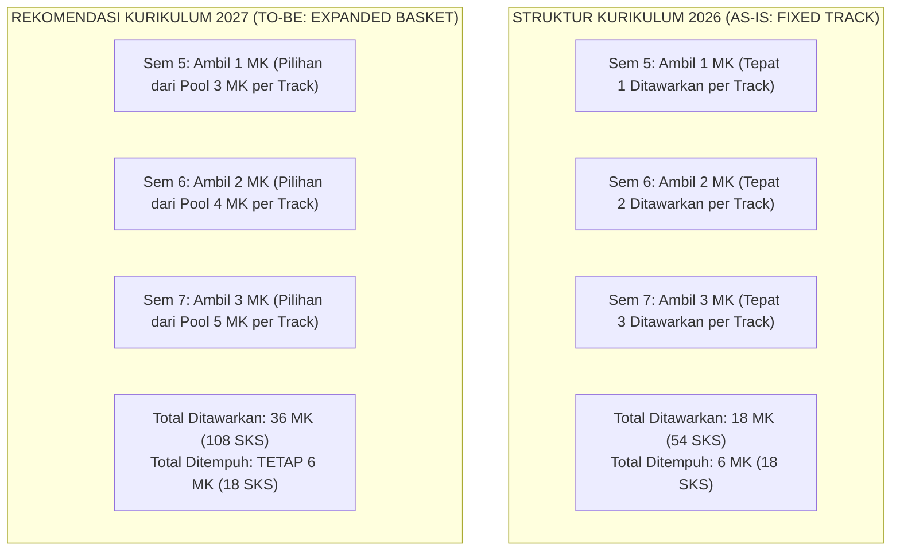

# 025 — REKOMENDASI PENGEMBANGAN POOL MK PEMINATAN & MEKANISME CROSS-TRACK (SIKLUS 2027)
## Program Studi Sistem dan Teknologi Informasi (S1) — Fakultas Sains dan Teknologi Informasi (FSTI) Universitas Widyagama Malang

**Status Dokumen:** Saran dan Rekomendasi Pengembangan Kurikulum Mendatang (Baseline Review 2027)  
**Terkait Dokumen:** [005 — Struktur Kurikulum 8 Semester](005_STRUKTUR_KURIKULUM_8_SEMESTER_DAN_PEMINATAN.md) & [006 — Distribusi & Panduan MK Peminatan & MBKM](006_DISTRIBUSI_DAN_PANDUAN_MK_PEMINATAN_MBKM.md)  
**Standar Rujukan:** Permendikbudristek No. 53 Tahun 2023, Panduan Kurikulum OBE APTIKOM v2.0 (IS2020 & IT2017), Standar IABEE & LAM INFOKOM Kriteria 4.

---

## 1. LATAR BELAKANG DAN RASIONAL AKADEMIK

Pada implementasi **Kurikulum OBE SISTEKIN 2026**, skema peminatan dirancang dengan model **Fixed-Track Cohort** (6 MK / 18 SKS per peminatan, total 18 MK ditawarkan untuk 3 peminatan). Mahasiswa menentukan 1 dari 3 jalur keahlian di awal Semester 5 dan menempuh seluruh paket mata kuliah peminatan tersebut secara terstruktur (1 MK di Sem 5, 2 MK di Sem 6, dan 3 MK di Sem 7).

Seiring dengan perkembangan teknologi kecerdasan artifisial, komputasi awan, dan rekayasa platform digital, serta pemenuhan profil lulusan yang *T-Shaped* (memiliki kedalaman spesialisasi teknis sekaligus kelincahan integrasi interdisipliner), direkomendasikan penyempurnaan skema peminatan untuk **Siklus Peninjauan Kurikulum Tahun 2027**:
1. **Perluasan Keranjang Mata Kuliah Pilihan (*Expanded Elective Basket*):** Menyediakan 2–3 pilihan MK per peminatan di Semester 5, 3–4 pilihan di Semester 6, dan 4–5 pilihan di Semester 7.
2. **Adopsi Mekanisme *Cross-Peminatan* Terkendali (*Minor Cross-Electives*):** Memberikan hak bagi mahasiswa untuk mengambil 1–2 MK pilihan dari peminatan lain guna memperkuat portofolio keahlian spesifik tanpa mereduksi ketercapaian CPL Keterampilan Khusus (KK).

---

## 2. AUDIT PERBANDINGAN STRUKTUR (AS-IS 2026 VS TO-BE 2027)



### TABEL KOMPARASI SKEMA PENAWARAN ELEKTIF

| Parameter Kurikulum | Kurikulum 2026 (Baseline Eksis) | Rekomendasi Kurikulum 2027 (*Target*) |
|---|:---:|:---:|
| **Beban SKS Kelulusan Mahasiswa** | **146 SKS (55 MK)** | **146 SKS (55 MK)** *(Tidak Berubah)* |
| **Beban SKS Peminatan Ditempuh** | **18 SKS (6 MK)** | **18 SKS (6 MK)** *(Tidak Berubah)* |
| **Pilihan MK Semester 5** | 1 MK ditawarkan (Ambil 1) | **3 MK ditawarkan per track** (Ambil 1) |
| **Pilihan MK Semester 6** | 2 MK ditawarkan (Ambil 2) | **4 MK ditawarkan per track** (Ambil 2) |
| **Pilihan MK Semester 7** | 3 MK ditawarkan (Ambil 3) | **5 MK ditawarkan per track** (Ambil 3) |
| **Total Portofolio MK Peminatan Ditawarkan** | **18 MK (54 SKS)** | **36 MK (108 SKS)** (12 MK per Track) |
| **Tingkat Kebebasan Memilih (*Elective Freedom*)** | Di level Jalur Peminatan | **Di level Jalur + Di level Mata Kuliah** |
| **Mekanisme *Cross-Peminatan*** | Tidak Diakomodasi (Fixed Track) | **Diakomodasi Maks. 6 SKS (2 MK)** |

---

## 3. PORTOFOLIO MATA KULIAH PILIHAN SETARA BERBASIS BoK APTIKOM (SI2020 & IT2017)

Seluruh usulan mata kuliah pilihan tambahan dirancang **bebas redundansi** (*Zero Redundancy*) dengan mata kuliah Core STI dan berakar langsung pada Body of Knowledge resmi APTIKOM.

### A. PEMINATAN 1: INTEGRATED SMART SYSTEMS (AI & DATA ENGINEERING)
*Mendukung Profil Lulusan **PL-1 (Intelligent Information Systems & AI Engineer)** dan **CPL P2, KK1, KK2**.*

| Sem | Kode | Nama Mata Kuliah Pilihan | SKS | Tipe | Prasyarat | Rujukan BoK APTIKOM | Status |
|:---:|:---:|---|:---:|:---:|---|---|:---:|
| **5** | `STA-01` | Decision Support Systems | 3 | +P | `STI-413` Machine Learning | BK-IS13 / BK-IT09 | Eksis 2026 |
| **5** | `STA-07` | Computer Vision & Citra Digital | 3 | +P | `STI-413` Machine Learning | BK-IT10 (Perception & CV) | **Usulan 2027** |
| **5** | `STA-08` | Analisis Time Series & Prediktif | 3 | +P | `STI-413` Machine Learning | BK-IS13 (Predictive Analytics) | **Usulan 2027** |
| **6** | `STA-02` | Computational Methods & Numerics | 3 | +P | `STI-205` Aljabar Linear | BK-IS10 (Mathematical Found.) | Eksis 2026 |
| **6** | `STA-03` | Intelligent Agent Systems | 3 | +P | `STI-307` Sistem Cerdas | BK-IS15 / BK-IT10 (AI Systems) | Eksis 2026 |
| **6** | `STA-09` | Big Data Engineering & Stream Analytics | 3 | +P | `STI-415` DW/BI, `STI-520` | BK-IS02 / BK-IT09 (Big Data) | **Usulan 2027** |
| **6** | `STA-10` | Edge AI & Embedded Machine Learning | 3 | +P | `STI-521` IoT, `STI-519` DL | BK-IT06 / BK-IT10 (Edge AI) | **Usulan 2027** |
| **7** | `STA-04` | MLOps and AI Pipeline | 3 | +P | `STI-519` DL, `STI-417` Cloud | BK-IT07 / BK-IT10 (MLOps) | Eksis 2026 |
| **7** | `STA-05` | Conversational AI & Intelligent Assistant | 3 | +P | `STI-414` NLP, `STI-519` DL | BK-IS15 / BK-IT10 (NLP/GenAI) | Eksis 2026 |
| **7** | `STA-06` | Smart Surveillance & IoT Analytics | 3 | +P | `STI-521` IoT, `STA-07` CV | BK-IT06 / BK-IT10 (IoT Vision) | Eksis 2026 |
| **7** | `STA-11` | Generative AI Engineering & LLM App | 3 | +P | `STI-414` NLP, `STI-519` DL | BK-IT10 (GenAI Engineering) | **Usulan 2027** |
| **7** | `STA-12` | Autonomous Systems & Robot Navigation | 3 | +P | `STI-521` IoT, `STA-07` CV | BK-IT06 / BK-IT10 (Robotics) | **Usulan 2027** |

---

### B. PEMINATAN 2: CLOUD INFRASTRUCTURE & CYBERSECURITY
*Mendukung Profil Lulusan **PL-2 (Cloud Infrastructure, Cyber & Smart Systems Integrator)** dan **CPL P3, KK3, KK4**.*

| Sem | Kode | Nama Mata Kuliah Pilihan | SKS | Tipe | Prasyarat | Rujukan BoK APTIKOM | Status |
|:---:|:---:|---|:---:|:---:|---|---|:---:|
| **5** | `STB-01` | Network Security & Digital Forensics | 3 | +P | `STI-418` Keamanan Info | BK-IT08 (Cybersecurity) | Eksis 2026 |
| **5** | `STB-07` | Linux System & Server Administration | 3 | +P | `STI-310` OS, `STI-312` Jarkom | BK-IT05 (Sys Admin) | **Usulan 2027** |
| **5** | `STB-08` | Virtualization & Software-Defined Network | 3 | +P | `STI-312` Jaringan Komputer | BK-IT07 (Platform Tech) | **Usulan 2027** |
| **6** | `STB-02` | Cloud Architecture & DevOps | 3 | +P | `STI-417` Cloud Computing | BK-IT07 (Cloud & DevOps) | Eksis 2026 |
| **6** | `STB-03` | Cybersecurity Risk Management | 3 | Teori | `STI-418` Keamanan Info | BK-IS06 / BK-IT08 (Sec Risk) | Eksis 2026 |
| **6** | `STB-09` | Penetration Testing & Ethical Hacking | 3 | +P | `STB-01` Network Security | BK-IT08 (Offensive Security) | **Usulan 2027** |
| **6** | `STB-10` | Cloud Native Architecture & Kubernetes | 3 | +P | `STI-417` Cloud, `STB-02` | BK-IT07 (Cloud Native) | **Usulan 2027** |
| **7** | `STB-04` | IT Governance & Compliance COBIT 2019 | 3 | Teori | `STI-523` Manajemen Proyek | BK-IS08 (IT Governance) | Eksis 2026 |
| **7** | `STB-05` | IT Service Management ITIL 4 | 3 | Teori | `STI-523` Manajemen Proyek | BK-IS09 (IT Service Mgmt) | Eksis 2026 |
| **7** | `STB-06` | Enterprise Architecture TOGAF | 3 | Teori | `STI-306` APSI | BK-IS03 (Enterprise Arch) | Eksis 2026 |
| **7** | `STB-11` | Security Operations Center (SOC) & SIEM | 3 | +P | `STB-01` NetSec, `STI-626` | BK-IT08 (Defensive Cyber) | **Usulan 2027** |
| **7** | `STB-12` | Cloud Security & Zero Trust Architecture | 3 | +P | `STI-417` Cloud, `STI-418` | BK-IT07 / BK-IT08 (Zero Trust) | **Usulan 2027** |

---

### C. PEMINATAN 3: DIGITAL PLATFORM ENGINEERING
*Mendukung Profil Lulusan **PL-3 (UI/UX & Digital Platform Engineer)**, **PL-4 (Technopreneur)**, dan **CPL P4, KK5, KK6**.*

| Sem | Kode | Nama Mata Kuliah Pilihan | SKS | Tipe | Prasyarat | Rujukan BoK APTIKOM | Status |
|:---:|:---:|---|:---:|:---:|---|---|:---:|
| **5** | `STC-01` | UX Research & Design | 3 | +P | `STI-308` UI/UX Prototyping | BK-IS07 / BK-IT04 | Eksis 2026 |
| **5** | `STC-07` | Design Systems & Micro-Interactions | 3 | +P | `STI-308` UI/UX Prototyping | BK-IT04 (HCI/Frontend) | **Usulan 2027** |
| **5** | `STC-08` | E-Commerce Platform & Payment API | 3 | +P | `STI-311` Web Front, `STI-416` | BK-IS16 (E-Business Tech) | **Usulan 2027** |
| **6** | `STC-02` | Rekayasa & Otomasi Proses Bisnis | 3 | +P | `STI-306` APSI | BK-IS05 (Business Processes) | Eksis 2026 |
| **6** | `STC-03` | Rekayasa Aplikasi Industri Vertikal | 3 | +P | `STI-416` Web Back End | BK-IS04 / BK-IT04 (Domain Apps)| Eksis 2026 |
| **6** | `STC-09` | Microservices Architecture & API Gateway | 3 | +P | `STI-416` Web Back, `STI-627` | BK-IS04 / BK-IT07 (Microservice)| **Usulan 2027** |
| **6** | `STC-10` | Cross-Platform Mobile Engineering | 3 | +P | `STI-522` Mobile Programming | BK-IT04 (Mobile App Eng) | **Usulan 2027** |
| **7** | `STC-04` | Immersive Media & XR Development | 3 | +P | `STI-308` UI/UX, `STI-311` | BK-IT10 (XR/Graphics) | Eksis 2026 |
| **7** | `STC-05` | SaaS Architecture & Multi-Tenancy | 3 | +P | `STI-627` Digital Platform | BK-IS04 / BK-IT07 (SaaS) | Eksis 2026 |
| **7** | `STC-06` | Digital Product Management | 3 | Teori | `STI-523` Manajemen Proyek | BK-IS01 (Product Strategy) | Eksis 2026 |
| **7** | `STC-11` | Enterprise Resource Planning (ERP) Systems | 3 | +P | `STI-306` APSI, `FST-207` | BK-IS05 (Integrated ERP) | **Usulan 2027** |
| **7** | `STC-12` | Web3 & Decentralized Platform Engineering | 3 | +P | `STI-416` Web Back, `STI-418` | BK-IS17 / BK-IT14 (Decentralized)| **Usulan 2027** |

---

## 4. TATA KELOLA CROSS-PEMINATAN TERKENDALI (*CROSS-ELECTIVE POLICY*)

Untuk menjaga agar lulusan tetap memiliki profil spesialisasi utama yang kredibel dan diakui secara formal dalam **Surat Keterangan Pendamping Ijazah (SKPI)**, direkomendasikan pemberlakuan **Aturan Mayor-Minor 12+6 SKS**:

```
TOTAL SKS ELEKTIF DI TEMPUH MAHASISWA = 18 SKS (6 MK)
├── [KOMPONEN MAYOR: MINIMAL 12 SKS / 4 MK]
│   └── Wajib diambil dari Jalur Peminatan Utama yang dipilih.
│       Tujuan: Menggaransi 100% Ketercapaian CPL Keterampilan Khusus (KK) Jalur Terkait.
│
└── [KOMPONEN ELEKTIF BEBAS / CROSS-TRACK: MAKSIMAL 6 SKS / 2 MK]
    └── Dapat diambil dari pool peminatan lain di Semester 6 atau Semester 7.
        Tujuan: Menumbuhkan kompetensi T-Shaped (interdisipliner) sesuai minat proyek/karir.
```

### Matriks Pengakuan SKPI Berdasarkan Komposisi SKS Peminatan:

| Komposisi MK Peminatan yang Ditempuh | Predikat Spesialisasi di SKPI | Status Ketercapaian CPL KK |
|---|---|:---:|
| **18 SKS Penuh dari 1 Track** (6 MK Jalur Sama) | *Specialist Track* Penuh (e.g. *Intelligent Systems Specialist*) | ✅ 100% CPL KK Terkait Tercapai Penuh |
| **12–15 SKS Mayor + 3–6 SKS Cross-Track** | *Major with Cross-Disciplinary Minor* (e.g. *AI Track with Cloud Ops Minor*) | ✅ CPL KK Utama Tercapai + Portofolio Tambahan |
| **< 12 SKS dari 1 Track** | *General Information Technology Systems* | ⚠️ Tidak Direkomendasikan (Risiko CPL KK Tidak Fokus) |

---

## 5. ROADMAP PERSIAPAN MENUJU IMPLEMENTASI 2027

1. **Semester Ganjil 2026/2027:**
   - Menjalankan Kurikulum 2026 (55 MK / 146 SKS) dengan skema *Fixed Track* eksis.
   - Mengumpulkan data minat mahasiswa angkatan 2024 dan 2025 terhadap topik-topik elektif lanjutan.
2. **Semester Genap 2026/2027:**
   - Menyusun RPS / Silabus 3-Tabel dan rubrik asesmen lengkap untuk 18 MK usulan baru (`STA-07..12`, `STB-07..12`, `STC-07..12`).
   - Penyiapan modul praktikum laboratorium dan lisensi *cloud/AI environment*.
3. **Tahun Ajaran Baru 2027/2028:**
   - Pembukaan modul penawaran *Expanded Elective Basket* dan pembatasan prasyarat di sistem informasi akademik (SIAKAD).
   - Pengesahan Dokumen 005 dan 006 Edisi Revisi 2027 oleh Senat FSTI UWG.

---

*Disimpan sebagai Dokumen Arsip Resmi 025 — Saran & Rekomendasi Pengembangan Kurikulum Mendatang (Siklus 2027).*  
**Tim Pengembang Kurikulum FSTI Universitas Widyagama Malang**
