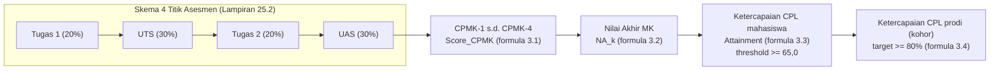
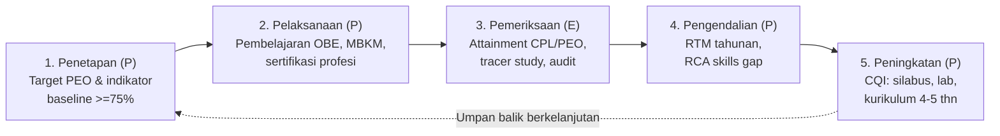
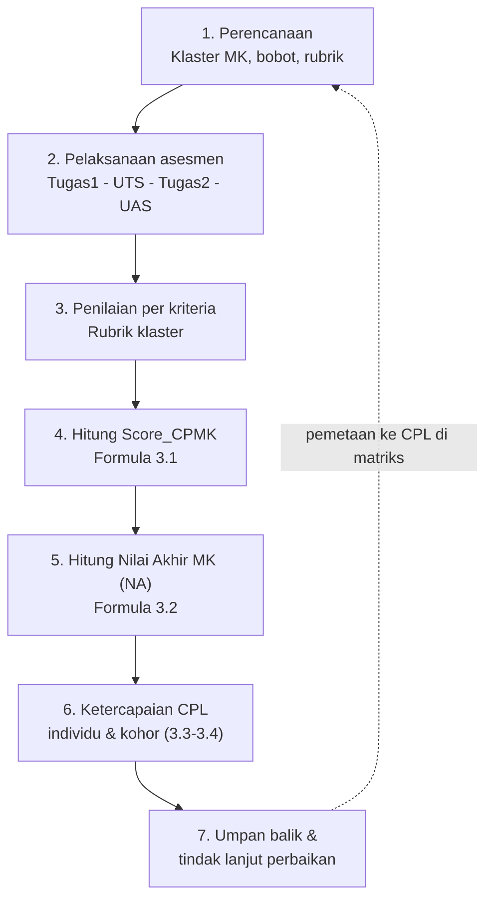
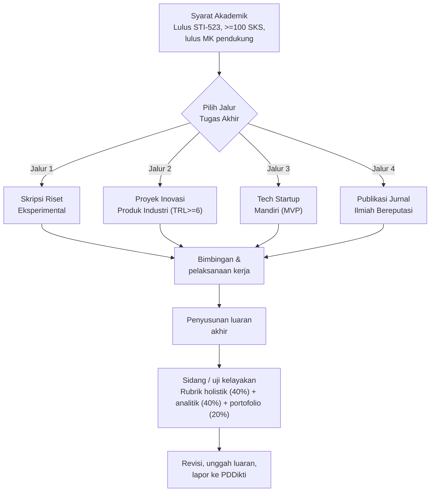

# 040 — LAMPIRAN RAKIT (🟡) BUKU KPT SISTEKIN 2026
## 4 Lampiran Berstatus "RAKIT" — Dirangkai dari Dokumen Existing

**Program Studi Sistem dan Teknologi Informasi (S1) — Fakultas Sains dan Teknologi Informasi (FSTI) Universitas Widyagama Malang**
**Rujukan Struktur:** Lampiran Buku KPT sesuai `Template_KPT_2024.docx` (38 butir lampiran)
**Status:** 🟡 **RAKIT** — konten dirangkai/meringkas dari beberapa dokumen existing (008, 009, 010, 017, 018) menjadi satu lampiran utuh.

## DAFTAR ISI 4 LAMPIRAN RAKIT

| No Lampiran Buku | Butir Lampiran | Sumber Utama yang Dirangkai |
|:--:|---|---|
| 25 | Instrumen Penilaian CPL | Dok 008, Dok 018 |
| 31 | SOP Evaluasi Kurikulum | Dok 010, Dok 017 |
| 32 | SOP Penilaian Pembelajaran | Dok 008, Dok 018 |
| 33 | SOP Tugas Akhir/Skripsi | Dok 009 |

---

# LAMPIRAN 25 — INSTRUMEN PENILAIAN CPL

> Sumber yang dirangkai: Dok 008 (Sistem Asesmen OBE & Formula CPL) dan Dok 018 (Panduan Master Rubrik OBE Dosen).

## 25.1 Prinsip Instrumen Penilaian CPL
SISTEKIN menilai ketercapaian CPL secara **terstruktur melalui 4 titik asesmen baku** yang dipetakan 1-ke-1 terhadap CPMK. Instrumen dibangun dari Matriks CPL–MK (Lampiran 17) sehingga setiap CPL dibebankan dan diases pada mata kuliah pembina (MK yang bertanda `V` pada matriks).

## 25.2 Skema Baku 4 Titik Asesmen

| Komponen Asesmen | Jadwal Pekan | Target Evaluasi | Bobot MK Teori | Bobot MK Praktikum/Proyek |
|---|---|:--:|:--:|:--:|
| Tugas 1 | Pekan 4/5 | CPMK-1 (Fondasi Konsep / Kuis) | 20% | 20% (Milestone Proyek 1) |
| UTS | Pekan 8 | CPMK-2 (Evaluasi Tengah) | 30% | 25% (Ujian Praktik / Proyek 50%) |
| Tugas 2 | Pekan 12/13 | CPMK-3 (Penerapan Lanjut) | 20% | 25% (Milestone Proyek 2) |
| UAS | Pekan 16 | CPMK-4 (Sintesis CPL) | 30% | 30% (Demo Day / Portofolio) |
| **Total** | | 100% CPMK | **100%** | **100%** |

### 💠 Diagram Alur Penilaian & Ketercapaian CPL

> Diagram menunjukkan **alur agregasi penilaian**: 4 titik asesmen → CPMK → Nilai Akhir MK → ketercapaian CPL mahasiswa → ketercapaian CPL kohor (basis akreditasi LAM INFOKOM Kriteria 9). Setiap panah mengikuti formula pada §25.3.

## 25.3 Formula Matematis Ketercapaian CPL (CPL Attainment)

### 3.1 Ketercapaian CPMK pada Mata Kuliah ($Score_{CPMK_j}$)
$$Score_{CPMK_j,k}(i) = \sum_{m=1}^{M} \left( W_{jm} \times Score_m(i) \right)$$
- $Score_m(i)$ = nilai instrumen asesmen ke-$m$ (skala 0–100).
- $W_{jm}$ = bobot instrumen $m$ terhadap $CPMK_j$ (dengan $\sum W_{jm} = 1.0$).

### 3.2 Nilai Akhir Mata Kuliah ($NA_k$)
$$NA_k(i) = \sum_{j=1}^{J} \left( W_{CPMK_j,k} \times Score_{CPMK_j,k}(i) \right)$$

### 3.3 Ketercapaian CPL Mahasiswa Individu ($Attainment_{CPL_x}(i)$)
$$Attainment_{CPL_x}(i) = \frac{\sum_{k \in MK(CPL_x)} \left( SKS_k \times Weight_{k,CPL_x} \times NA_k(i) \right)}{\sum_{k \in MK(CPL_x)} \left( SKS_k \times Weight_{k,CPL_x} \right)}$$
**Ambang batas kelulusan CPL minimum: 65,0** (Kategori B / Memuaskan).

### 3.4 Ketercapaian CPL Program Studi ($Cohort\_Attainment_{CPL_x}$)
$$\% Cohort\_Attainment_{CPL_x} = \frac{\text{Jumlah Mahasiswa dgn } Attainment_{CPL_x} \ge 65.0}{\text{Total Mahasiswa Angkatan}} \times 100\%$$
**Target standar mutu Prodi: minimal 80% mahasiswa mencapai threshold CPL ≥ 65,0.**

## 25.4 Lembar Instrumen (Ringkas)
Instrumen penilaian CPL diwujudkan dalam:
1. **Matriks Pembebanan CPL–MK** (sumber Lampiran 17) sebagai peta asesmen.
2. **Rubrik Analitik per Klaster MK** (Dok 008 §4 & Dok 018 §3) untuk skor per kriteria.
3. **Rekapitulasi Ketercapaian CPL** per mahasiswa & per angkatan (Sheet 13 Dok 011) dengan formula §3.3–§3.4 di atas.
4. **Speed Grading Sheet** (Dok 018 §4) untuk asesmen cepat dosen.

> Rincian lengkap instrumen & lembar kerja tertera pada Dok 008 §2–§4 dan Dok 018 §3–§5.

---

# LAMPIRAN 31 — SOP EVALUASI KURIKULUM

> Sumber yang dirangkai: Dok 010 (Instrumen Tracer Study & Sistem Evaluasi PPEPP), Dok 017 (Audit Forensik Zero Redundancy & Zero Gap).

## 31.1 Tujuan & Ruang Lingkup
SOP ini menetapkan mekanisme **evaluasi kurikulum secara berkala** berbasis siklus penjaminan mutu **PPEPP**. Evaluasi mencakup ketercapaian PEO, CPL, keselarasan kurikulum (zero gap & zero redundancy), serta masukan pemangku kepentingan (DUDI, alumni, pengguna lulusan).

## 31.2 Siklus Penjaminan Mutu PPEPP (Dok 010 §9)

| Tahap | Kegiatan | Sumber Data / Luaran |
|---|---|---|
| **1. Penetapan (P)** | Menetapkan baseline PEO-1, PEO-2, PEO-3 serta target ketercapaian provisional ≥75% berkategori Tinggi/Baik | Dokumen target PEO & indikator |
| **2. Pelaksanaan (P)** | Menyelenggarakan pembelajaran berbasis OBE, memperbarui materi sesuai tren industri, fasilitasi sertifikasi mahasiswa | Data pelaksanaan pembelajaran & MBKM |
| **3. Pemeriksaan (E)** | Analisis (RCA – Root Cause Analysis) & evaluasi ketercapaian CPL/PEO | Rekap ketercapaian CPL, tracer study |
| **4. Pengendalian (P)** | Rapat Tinjauan Manajemen (RTM) tahunan; membedah *skills gap* dari industri | Notulen RTM, laporan audit |
| **5. Peningkatan (P)** | Perbaikan berkelanjutan (CQI) pada silabus, teknologi lab, pemutakhiran kurikulum berkala 4–5 tahunan | Revisi silabus, dokumen pengembangan |

### 💠 Diagram Siklus Penjaminan Mutu PPEPP

> Diagram di atas merepresentasikan **siklus PPEPP berkelanjutan** (Dok 010 §9): *Penetapan → Pelaksanaan → Pemeriksaan → Pengendalian → Peningkatan*, yang berputar kembali (*feedback loop*) sebagai dasar perbaikan mutu. Tabel detail pada §31.2.

## 31.3 Instruksi Kerja (Langkah Operasional)

1. **Penjadwalan evaluasi:** Evaluasi PEO dilakukan pada rentang 3–5 tahun pasca kelulusan; evaluasi CPL dilakukan per akhir semester melalui rekapitulasi attainment.
2. **Pengumpulan data:** melalui tracer study (Dok 010), evaluasi dosen oleh mahasiswa, survei kepuasan pengguna lulusan (rubrik persepsi Dok 033), dan audit keselarasan (Dok 017).
3. **Analisis & RCA:** ketidaksesuaian dianalisis dengan *Root Cause Analysis*; hasil dibedah dalam RTM.
4. **Rencana Tindak Lanjut (RTL):** dirumuskan perbaikan nyata (silabus, media, struktur, kurikulum).
5. **Implementasi & monitoring:** RTL diterapkan pada periode berikutnya dan dipantau sebagai dasar CQI.
> *Catatan: Prodi SISTEKIN baru beroperasi; target numerik PEO bersifat **Provisional Baseline**. Fokus evaluasi saat ini pada kualitas desain kurikulum, keterlacakan VMTS, kesiapan instrumen, dan validasi pemangku kepentingan (Dok 010 §1).*

---

# LAMPIRAN 32 — SOP PENILAIAN PEMBELAJARAN

> Sumber yang dirangkai: Dok 008 (Sistem Asesmen OBE, 4x evaluasi & rubrik) dan Dok 018 (Panduan Master Rubrik & Model Asesmen OBE Dosen).

## 32.1 Tujuan
SOP ini menetapkan prosedur baku penilaian pembelajaran berbasis luaran (OBE) agar objektif, transparan, dan dapat ditelusur (traceable) terhadap CPMK/CPL.

## 32.2 Prinsip Penilaian
- **1-to-1 CPMK mapping:** setiap komponen asesmen memetakan CPMK secara spesifik.
- **Rubrik terstandar:** penilaian per kriteria menggunakan rubrik analitik (Dok 018 §3) dan rubrik holistik untuk hasil integratif (Dok 033).
- **Bobot baku:** mengikuti skema 4 titik asesmen (Lihat Lampiran 25 §25.2).
- **Kejujuran akademik:** menjunjung protokol integritas & penggunaan AI yang etis (Dok 018 §5).

## 32.3 Alur Proses Penilaian (Instruksi Kerja)

| No | Tahap | Uraian Kegiatan | Output |
|:--:|---|---|---|
| 1 | Perencanaan | Dosen menetapkan klaster MK, bobot asesmen, dan rubrik; menuangkan di RPS | RPS & lembar asesmen |
| 2 | Pelaksanaan asesmen | Melaksanakan Tugas 1, UTS, Tugas 2, UAS sesuai jadwal pekan | Nilai tiap instrumen |
| 3 | Penilaian | Dosen menilai per kriteria menggunakan rubrik klaster | Skor rubrik |
| 4 | Konversi hubungan CPMK | Menghitung `Score_CPMK` dengan formula §3.1 | Skor CPMK |
| 5 | Perhitungan NA | Menghitung nilai akhir MK `NA_k` per formula §3.2 | Nilai akhir MK |
| 6 | Ketercapaian CPL | Menghitung attainment CPL per mahasiswa & kohor (formula §3.3–3.4) | Rekap CPL attainment |
| 7 | Umpan balik | Memberikan umpan balik hasil asesmen & tindak lanjut perbaikan | Catatan perbaikan mahasiswa |

### 💠 Diagram Alur Proses Penilaian OBE (7 Langkah)

> Diagram merepresentasikan **alur 7 langkah penilaian OBE** (tabel §32.3) yang bersifat siklus: hasil ketercapaian CPL menjadi masukan perencanaan berikutnya (CQI). Formula per langkah mengacu Lampiran 25.

## 32.4 Rujukan Rubrik
Penerapan kriteria penilaian merujuk **Rubrik Master 4 Klaster MK** (Dok 018 §3) dan **Rubrik Holistik** (Dok 033) sesuai karakteristik mata kuliah (teori, praktikum/proyek, capstone).

---

# LAMPIRAN 33 — SOP TUGAS AKHIR / SKRIPSI

> Sumber yang dirangkai: Dok 009 (Pedoman Capstone Project & Opsi Tugas Akhir Non-Skripsi). Dasar: Permendikbudristek No. 53/2023 Pasal 19.

## 33.1 Tujuan & Dasar
SOP menetapkan mekanisme penyelenggaraan **Tugas Akhir (TA)** yang setara berbobot **6 SKS** (mata kuliah `FST-714` Sem 8) dan **Capstone Project** (`FST-610`, 3 SKS, Sem 7). Prodi menyediakan 4 jalur kelulusan TA yang setara sesuai fleksibilitas tugas akhir.

## 33.2 Empat Jalur Tugas Akhir Setara (6 SKS)

| Opsi | Jalur TA | Luaran Wajib | Target Profil Utama |
|:--:|---|---|---|
| 1 | Skripsi Riset Eksperimental | Naskah Skripsi (Bab 1–5) + repositori kode + uji statistik | PL-1, PEO-3 |
| 2 | Proyek Inovasi Produk Industri | Sistem teruji mitra (TRL ≥ 6) + laporan teknis + bukti HKI/Paten | PL-2, PL-3 |
| 3 | Tech Startup Mandiri (Technopreneur) | Produk MVP tervalidasi + pitch deck + bukti traksi pasar | PL-4, PEO-2 |
| 4 | Publikasi Jurnal Ilmiah Bereputasi | Artikel terbit/accepted di Jurnal SINTA 1/2 atau Scopus/WoS Q1-Q4 | Seluruh PL, PEO-3 |

## 33.3 Syarat Akademik & Tahapan

**Syarat:**
1. Lulus mata kuliah prasyarat (minimal `STI-523` Manajemen Proyek TI) dan telah menempuh ≥ 100 SKS (khusus Capstone, Dok 009 §1.1).
2. Lulus mata kuliah pendukung: `FST-611` Metodologi Penelitian, `FST-612` PKL, `FST-613` Pra-Skripsi.

**Tahapan umum:**
1. **Pendaftaran & pengajuan proposal** oleh mahasiswa (sesuai jalur yang dipilih).
2. **Persetujuan topik & penunjukan pembimbing** oleh Koordinator TA/Prodi.
3. **Bimbingan & pelaksanaan kerja** (riset/proyek/riset pasar/publikasi) sesuai jadwal.
4. **Penyusunan luaran akhir** (naskah, sistem, MVP, atau artikel).
5. **Uji kelayakan / sidang** dengan rubrik holistik (40%) + rubrik analitik (40%) + portofolio (20%) — Dok 033.
6. **Revisi & unggah luaran** serta pelaporan ke PDDikti.

### 💠 Diagram Alur Tugas Akhir & Pilihan 4 Jalur

> Diagram merepresentasikan **alur Tugas Akhir 6 SKS** dengan 4 jalur setara (tabel §33.2) dan tahapan umum (daftar §33.3). Semua jalur bermuara pada sidang/uji kelayakan dan pelaporan ke PDDikti.

## 33.4 Ketentuan Capstone Project (`FST-610`)
- **Tim berkelompok 3–6 orang** (Dok 009 §1.1); pembentukan tim pada Minggu 1–3.
- Proposal layak bila memenuhi **minimal 4 dari 7 atribut** *Complex Computing Problem*, dengan atribut (1) integrasi pengetahuan dan (2) kerja kelompok sebagai **wajib mutlak**.
- Capstone membina CPL: S1, KU1-KU3, KK1-KK6 (rujuk Dok 004) — merupakan MK dengan tahap penguasaan **M (Mastery)** terbanyak.
- Bahan kajian pengampu: BK-IS07, BK-IS08, BK-IS15, BK-IS21, BK-IT07, BK-IT13 (Dok 009).

> Rincian kriteria capstone & tiap jalur TA tertera lengkap pada Dok 009 §1 dan §2.

---

# PENUTUP DOKUMEN 040

Keempat lampiran 🟡 RAKIT di atas (25, 31, 32, 33) dirangkai dari dokumen existing (Dok 008, 009, 010, 017, 018). Sebelum disalinkan ke Buku KPT final, angka dan formulanya diverifikasi terhadap sumber asal (lihat bagian Verifikasi).

---
