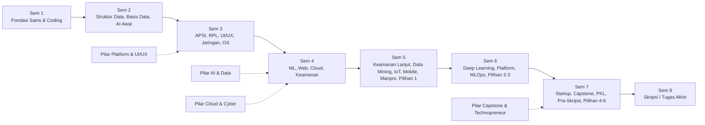

# 041 — LAMPIRAN PENULISAN BARU (🟠) BUKU KPT SISTEKIN 2026
## 4 Lampiran Berstatus "PENULISAN BARU" — Disusun dari Nol atas Sumber yang Kredibel

**Program Studi Sistem dan Teknologi Informasi (S1) — Fakultas Sains dan Teknologi Informasi (FSTI) Universitas Widyagama Malang**
**Rujukan Struktur:** Lampiran Buku KPT sesuai `Template_KPT_2024.docx` (38 butir lampiran)
**Status:** 🟠 **PENULISAN BARU** — konten belum tersedia sebagai dokumen utuh; disusun dari nol dengan sumber yang dapat dipertanggungjawabkan (Dok 005, 007, 012, 018, 032, 034).

## DAFTAR ISI 4 LAMPIRAN PENULISAN BARU

| No Lampiran Buku | Butir Lampiran | Sumber Acuan |
|:--:|---|---|
| 20 | Peta Kurikulum | Dok 005, 011, 012 (5 pilar & struktur) |
| 23 | Rencana Tugas Mahasiswa (RTM) | Dok 007, 008, 018 |
| 27 | SOP Pelaksanaan MBKM | Dok 034, 006 |
| 30 | SOP Penyusunan & Peninjauan RPS | Dok 032, KPT 2024 |

---

# LAMPIRAN 20 — PETA KURIKULUM

> Disusun dari: Dok 005 (struktur 8 semester), Dok 011 (organisasi MK per semester), Dok 012 (5 jalur pilar & tree prasyarat).
> Peta kurikulum menggambarkan alur mata kuliah antar semester beserta prasyarat dan pengelompokan 5 pilar keilmuan.

## 20.1 Lima Jalur Pilar Keilmuan (Dok 012)

| Pilar | Nama Jalur | Profil/Peminatan Terkait |
|:--:|---|---|
| 1 | AI, Data Science & Intelligent Systems | PL-1 & Peminatan 1 (Flagship) |
| 2 | Cloud Infrastructure, Networks & Cybersecurity | PL-2 & Peminatan 2 (Volume) |
| 3 | Software, Web/Mobile & Digital Platform Engineering | PL-3 & Peminatan 3 (Niche) |
| 4 | IT Governance, Enterprise Architecture & Systems Analysis | PL-2 & PL-3 (Enterprise) |
| 5 | Technopreneurship, Metodologi Riset, Capstone & Skripsi Culmination | PL-4 & Seluruh lulusan (Synthesizing) |

## 20.2 Peta Alur Mata Kuliah per Semester (Kode → Nama [SKS]) dengan Prasyarat

| Semester | MK Inti (Kode → Nama [SKS]) | Prasyarat Kunci |
|:---:|---|---|
| **1** | FST-102 Algoritma [3] · STI-102 Kalkulus [3] · STI-103 Ars. & Org. STI [3] · STI-101 Pengantar STI [2] · FST-101 DTD [2] · MKU-101/102/103 [2+2+2] | — (fondasi awal) |
| **2** | FST-203 Struktur Data [3] · FST-207 Basis Data [3] · STI-204 Mat. Diskrit [3] · STI-205 Aljabar Linear [3] · FST-204 Pengantar AI [2] | FST-102; STI-102 |
| **3** | STI-306 APSI [3] · STI-309 RPL [3] · STI-308 UI/UX [3] · STI-310 Sistem Operasi [3] · STI-311 Web Front End [3] · STI-312 Jaringan [3] | FST-203; STI-205 |
| **4** | STI-413 Machine Learning [3] · STI-415 DW & BI [3] · STI-416 Web Back End [3] · STI-417 Cloud [3] · STI-418 Dasar Keamanan [2] | STI-307; STI-311 |
| **5** | STI-519 Keamanan Lanjut [3] · STI-520 Data Mining [3] · STI-521 IoT [3] · STI-522 Mobile [3] · STI-523 Manpro TI [3] · MK Pilihan 1 [3] | STI-418; STI-413 |
| **6** | STI-624 Integrasi AI [3] · STI-625 Smart City [2] · STI-626 Deep Learning [3] · STI-627 Platform Eng [3] · FST-611 Metopel [2] · MK Pilihan 2 & 3 [3+3] | STI-413; STI-416 |
| **7** | STI-728 Inovasi Startup [3] · FST-610 Capstone [3] · FST-612 PKL [3] · FST-613 Pra-Skripsi [2] · MK Pilihan 4-6 [9] | ≥ 100 SKS; STI-523 |
| **8** | FST-714 Skripsi/Tugas Akhir [6] | FST-613; FST-611 |

## 20.3 Diagram Mermaid Peta Kurikulum (Makro)

## 20.4 Aturan Prasyarat (Ringkas, Sumber Dok 005/012)
- MK peminatan Sem 5 (`STA-501`, `STB-501`, `STC-501`) mensyaratkan MK inti terkait (mis. `STA-501` ← `STI-307`; `STB-501` ← `STI-312`, `STI-418`; `STC-501` ← `STI-308`).
- MK peminatan Sem 7 mensyaratkan MK peminatan pendahulu & MK inti lanjut.
- Rincian tree prasyarat detail per pilar merujuk **Dok 012 §3** (5 pohon silsilah pembelajaran).

> Catatan: Peta kurikulum di atas adalah representasi visual/tekstual; diagram vektor final (file gambar) disusun oleh tim saat finalisasi buku. Data MK & prasyarat sudah diverifikasi konsisten dengan Dok 005 & 011.

---

# LAMPIRAN 23 — RENCANA TUGAS MAHASISWA (RTM)

> Disusun dari: Dok 007 (struktur 3 tabel & matriks 16 pertemuan), Dok 008 (skema 4x asesmen), Dok 018 (model asesmen OBE).
> RTM merinci tugas-tugas mahasiswa yang menjadi komponen penilaian per mata kuliah, konsisten dengan skema baku 4 titik asesmen.

## 23.1 Prinsip Penyusunan RTM
- Setiap komponen tugas dipetakan 1-ke-1 ke **CPMK** dan **Sub-CPMK** (Tabel B & C Dok 007).
- Menyesuaikan **skema 4 titik asesmen** (Tugas 1 → UTS → Tugas 2 → UAS) sesuai bobot baku (Dok 008).
- Bentuk tugas disesuaikan **klaster MK** (Dok 018 §3): teori, praktikum/proyek, capstone.

## 23.2 Format Baku Rencana Tugas Mahasiswa

**Identitas MK:** `[Kode] [Nama MK] | SKS: [ ] | Tipe: [Teori/Praktikum] | Semester: [ ] | Dosen: [ ]`

| Komponen | Bentuk Tugas | CPMK Tuju | Estimasi Jam | Bobot | Batas Waktu |
|---|---|---|:--:|:--:|---|
| Tugas 1 | [Kuis / Problem Solving Awal / Milestone Proyek 1] | CPMK-1 | [ ] jam | 20% | Pekan 4-5 |
| UTS | [Ujian Tengah / Ujian Praktik 50%] | CPMK-2 | [ ] jam | 25-30% | Pekan 8 |
| Tugas 2 | [Studi Kasus / Paper Analisis / Milestone Proyek 2] | CPMK-3 | [ ] jam | 20-25% | Pekan 12-13 |
| UAS | [Ujian Komprehensif / Demo Day + Portofolio] | CPMK-4 | [ ] jam | 30% | Pekan 16 |

## 23.3 Contoh Skema RTM untuk MK Praktikum/Proyek (Kelompok, 3 SKS)

| Komponen | Bentuk Tugas | Luaran/Produk | Bobot | Jadwal |
|---|---|---|:--:|---|
| Tugas 1 | Perancangan solusi awal (dokumen desain) | Dokumen desain & milestone proyek 1 | 20% | Pekan 4-5 |
| UTS | Evaluasi prototipe / ujian praktik | Prototipe berjalan | 25% | Pekan 8 |
| Tugas 2 | Integrasi & pengujian (milestone proyek 2) | Sistem terintegrasi & test report | 25% | Pekan 12-13 |
| UAS | Demo Day & portofolio produk | Produk final + repositori git | 30% | Pekan 16 |

## 23.4 Tahapan Penyusunan RTM oleh Dosen
1. Turunkan **CPMK & Sub-CPMK** dari RPS (Tabel B & C Dok 007).
2. Tetapkan **bentuk & bobot tugas** sesuai klaster MK dan skema 4 titik asesmen.
3. Rincikan **luaran, kriteria penilaian, dan batas waktu** tiap tugas.
4. Acuan penilaian menggunakan **rubrik klaster** (Dok 018 §3); masukkan ke RPS & SIAKAD.

> Template RTM di atas diisi per mata kuliah saat finalisasi RPS 67 MK. Struktur konsisten dengan format Rencana Tugas Mahasiswa KPT 2024.

---

# LAMPIRAN 27 — SOP PELAKSANAAN MBKM

> Disusun dari: Dok 034 (Sembilan BKP & Rekognisi), Dok 006 (pemanfaatan 20 SKS). Dasar: Permendikbudristek 53/2023 Pasal 17-18.

## 27.1 Ruang Lingkup
SOP mengatur pelaksanaan kegiatan Merdeka Belajar Kampus Merdeka (MBKM) dari pengajuan proposal sampai rekognisi kredit, mencakup 9 bentuk kegiatan pembelajaran (BKP).

## 27.2 Sembilan Bentuk BKP (Dok 034)
1. Magang / Praktik Kerja
2. Studi / Proyek Independen
3. Kegiatan Wirausaha
4. KKN Tematik (Membangun Desa)
5. Asistensi Mengajar di Satuan Pendidikan
6. Penelitian / Riset
7. Proyek Kemanusiaan
8. Pertukaran Mahasiswa
9. BKP lain sesuai kebijakan (Kampus Mengajar / Praktisi Mengajar)

## 27.3 Instruksi Kerja Pelaksanaan MBKM (6 Langkah)

| No | Tahap | Uraian Kegiatan | Penanggung Jawab | Output |
|:--:|---|---|---|---|
| 1 | Pengajuan | Mahasiswa mengajukan proposal BKP + rancangan luaran | Mahasiswa | Proposal BKP |
| 2 | Penilaian kelayakan | DPA + Tim Kurikulum menilai relevansi CPL/CPMK & kecukupan jam aktivitas | Tim Kurikulum | Keputusan kelayakan |
| 3 | Penyusunan rencana | Dosen Pembimbing MBKM menyusun "Rencana Pembelajaran Kegiatan MBKM" (mengacu SN-Dikti) | Dosen Pembimbing | Rencana pembelajaran |
| 4 | Pengesahan | Disahkan oleh Prodi/Fakultas | Kaprodi/Dekan | Surat pengesahan |
| 5 | Pelaksanaan & penilaian | Luaran dinilai dengan rubrik (Dok 033); nilai dikonversi | Dosen Pembimbing | Nilai konversi |
| 6 | Pelaporan | Prodi melaporkan pengakuan SKS sebagai transfer kredit ke PDDikti | Administrasi Prodi | Laporan PDDikti |

## 27.4 Bentuk Penyelenggaraan
- **Free form (Bebas):** terbuka, mahasiswa mengajukan program di luar kurikulum.
- **Structured form:** 20 SKS disetarakan dengan MK kurikulum yang CPMK-nya sejalan.
- **Hybrid form:** gabungan free + structured.

> Mahasiswa berhak menempuh maksimal 20 SKS per semester di luar prodi, dan paling lama 40 SKS (2 semester) di luar PT. Rekognisi merujuk aturan transkrip & SKPI (Dok 034 §3-§4).

---

# LAMPIRAN 30 — SOP PENYUSUNAN & PENINJAUAN RPS

> Disusun dari: Dok 032 (Modalitas Pembelajaran KPT 2024), Dok 007 (format 3 tabel), Panduan KPT 2024 Bagian IX & X.

## 30.1 Dasar & Tujuan
KPT 2024 menempatkan perencanaan pembelajaran dalam **Modalitas Pembelajaran** (gaya belajar, metode SCL, dan penggunaan teknologi/bauran). SOP ini mengatur penyusunan dan peninjauan RPS agar seluruh mata kuliah konsisten dengan CPL, CPMK, dan penerapan pembelajaran berpusat pada mahasiswa.

## 30.2 Komponen Wajib RPS (Format 3 Tabel Dok 007 & KPT 2024)
1. **Tabel A — Identitas & Pemetaan Makro:** kode, nama, SKS, tipe, jam, semester, rumpun, prasyarat, CPL, PL, PEO.
2. **Tabel B — Formulasi CPMK ABCD & Bloom:** rumusan CPMK (Audience, Behavior, Condition, Degree; level C2–C6), pemetaan CPL.
3. **Tabel C — Matriks 16 Pertemuan:** Sub-CPMK per pekan + skema 4 titik asesmen.
Ditambah: **Modalitas pembelajaran** (gaya belajar, metode SCL, media bauran) sesuai Dok 032.

## 30.3 Metode Pembelajaran Berpusat pada Mahasiswa (SCL, Dok 032)
- **PjBL** (proyek berjangka 2–8 pekan) untuk MK praktikum/Capstone.
- **PBL/CBL** (analisis kasus nyata) untuk MK keamanan/smart city.
- **Collaborative/Cooperative Learning** untuk MK berpraktikum.
- **8 strategi SCL** (PjBL, diskusi kelompok, kooperatif, PBL, inkuiri, peer teaching, flipped, self-paced) dipilih **per Sub-CPMK** sesuai level Bloom.

## 30.4 Alur Penyusunan RPS (Instruksi Kerja)

| No | Tahap | Uraian Kegiatan | PJ | Output |
|:--:|---|---|---|---|
| 1 | Kurasi | Tim Kurikulum menetapkan CPL/CPMK & BK yang dibina MK | Tim Kurikulum | Peta CPL-MK |
| 2 | Penyusunan | Dosen menyusun RPS 3 table + modalitas + asesmen | Dosen | Draf RPS |
| 3 | Telaah | Telaah keselarasan (CPL-CPMK-SubCPMK-asesmen) oleh gugus mutu | Gugus Mutu | RPS tervalidasi |
| 4 | Pengesahan | Pengesahan oleh Kaprodi | Kaprodi | RPS berlaku |
| 5 | Sosialisasi | Penyampaian RPS ke mahasiswa (Minggu 1) | Dosen | RPS terbagi |

## 30.5 Peninjauan RPS
- **Rutin:** review awal semester atas umpan balik mahasiswa & hasil capaian.
- **Berkala:** peninjauan substantif tiap 1–2 tahun, sinkron dengan evaluasi kurikulum PPEPP (Lampiran 31) dan tren industri.
- Perubahan material (bobot, CPMK) ditetapkan melalui Rapat Program Studi.

> Rincian metode & strategi SCL lengkap serta integrasi teknologi bauran merujuk **Dok 032 §2-§3**.

---

# PENUTUP DOKUMEN 041

Empat lampiran 🟠 PENULISAN BARU (20, 23, 27, 30) disusun dari nol atas dasar sumber kredibel (Dok 005, 007, 012, 018, 032, 034). Sebelum finalisasi, perlu dirapikan ulang: (a) diagram vektor Peta Kurikulum (Lampiran 20), (b) pengisian template RTM per 67 MK (Lampiran 23), sesuai kesiapan tim.

---
