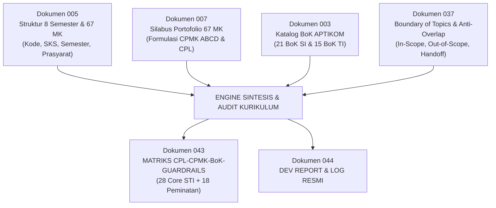

# 044 — DEV REPORT & LOG PENYUSUNAN MATRIKS CPL, CPMK, BoK, DAN BOUNDARY GUARDRAILS

## Laporan Resmi Rekayasa Kurikulum, Harmonisasi Multi-Dokumen, dan Instrumen Pencegahan Overlap Antar-Mata Kuliah

> **Program Studi:** S1 Sistem dan Teknologi Informasi (SISTEKIN)  
> **Fakultas:** Sains dan Teknologi Informasi (FSTI) — Universitas Widyagama Malang  
> **Status Dokumen:** Laporan Resmi Pengembangan (Dev Report & Dev Log)  
> **Dokumen Terkait:** Dokumen 003, 005, 007, 037, 042, dan 043  
> **Tanggal Rilis:** September 2026  
> **Penyusun:** Tim Pengembang Kurikulum KPT-OBE SISTEKIN 2026  

---

### RINGKASAN EKSEKUTIF (EXECUTIVE SUMMARY)

Laporan ini mendokumentasikan secara komprehensif seluruh tahapan analisis, ekstraksi, sintesis, harmonisasi, dan validasi dalam penyusunan **Matriks Operasional CPL, CPMK (ABCD + Taksonomi Bloom), Body of Knowledge (BoK), dan Boundary Guardrails (*In-Scope, Out-of-Scope, Handoff Anchor*)** untuk seluruh kurikulum inti dan peminatan Program Studi Sistem dan Teknologi Informasi (SISTEKIN) 2026.

Pekerjaan ini berhasil mengintegrasikan **46 Mata Kuliah** yang terbagi dalam dua kelompok strategis:
1. **Kelompok Mata Kuliah Core Program Studi (Core STI):** 28 Mata Kuliah (79 SKS) yang terdistribusi dari Semester 1 sampai dengan Semester 7.
2. **Kelompok Mata Kuliah Pilihan Peminatan (STA, STB, STC):** 18 Mata Kuliah (54 SKS portofolio ditawarkan / 18 SKS paket ditempuh) pada 3 jalur spesialisasi (*Integrated Smart Systems*, *Cloud Infrastructure & Cybersecurity*, dan *Digital Platform Engineering*) yang terdistribusi pada Semester 5, 6, dan 7.

Hasil kerja ini telah dibukukan secara resmi dalam berkas definitif:
* 📄 **Dokumen Utama:** [`043_MATRIKS_CPL_CPMK_BoK_DAN_BOUNDARY_GUARDRAILS.md`](file:///d:/!!MYDOCUMENTS2026/!!!SISTEKIN2026/!!BRAINSTORMING_KURIKULUM2026/KURIKULUM2026_REVISI/043_MATRIKS_CPL_CPMK_BoK_DAN_BOUNDARY_GUARDRAILS.md) *(104 KB / 1.061 baris)*
* 📄 **Varian Lembar Kerja Detail:** [`043_MATRIKS_CPL_CPMK_BoK_BOUNDARY_GUARDRAILS_PER_SEMESTER.md`](file:///d:/!!MYDOCUMENTS2026/!!!SISTEKIN2026/!!BRAINSTORMING_KURIKULUM2026/KURIKULUM2026_REVISI/043_MATRIKS_CPL_CPMK_BoK_BOUNDARY_GUARDRAILS_PER_SEMESTER.md) *(91 KB / 1.349 baris)*
* 🌐 **Kompilasi HTML Interaktif:** [`043_MATRIKS_CPL_CPMK_BoK_DAN_BOUNDARY_GUARDRAILS.html`](file:///d:/!!MYDOCUMENTS2026/!!!SISTEKIN2026/!!BRAINSTORMING_KURIKULUM2026/KURIKULUM2026_REVISI/043_MATRIKS_CPL_CPMK_BoK_DAN_BOUNDARY_GUARDRAILS.html)

---

### 1. LANDASAN DAN TUJUAN STRATEGIS

Penyusunan matriks operasional ini didasari oleh kebutuhan mendesak untuk menyelesaikan 3 tantangan utama dalam implementasi Kurikulum OBE KPT 2024:

```
┌─────────────────────────────────────────────────────────────────────────────────────────────────┐
│                     3 PILAR ARSITEKTUR DEMARKASI KURIKULUM SISTEKIN 2026                        │
├──────────────────────────────┬──────────────────────────────┬───────────────────────────────────┤
│ 1. KETERLACAKAN VERTIKAL     │ 2. STANDARISASI MIKRO OBE    │ 3. PENCEGAHAN OVERLAP (GUARDRAIL) │
│ (VMTS ↔ PEO ↔ PL ↔ CPL)      │ (CPMK ABCD & BLOOM C2-C6)    │ (ZERO CURRICULAR REDUNDANCY)      │
├──────────────────────────────┼──────────────────────────────┼───────────────────────────────────┤
│ Setiap materi kuliah harus   │ Rumusan CPMK wajib memuat    │ Penetapan tegas 3 pagar batas:    │
│ berakar langsung pada 14 CPL │ Audience, Behavior,          │ - In-Scope (kewenangan wajib)     │
│ dan terpetakan ke 21 BoK SI  │ Condition, dan Degree, serta │ - Out-of-Scope (larangan keras)   │
│ & 15 BoK TI APTIKOM/ACM.     │ level Bloom terukur.         │ - Handoff Anchor (estafet ilmu)   │
└──────────────────────────────┴──────────────────────────────┴───────────────────────────────────┘
```

Tujuan akhir:
1. **Memberikan kepastian akademik bagi Dosen Pengampu:** Dosen memiliki panduan hitam-di-atas-putih mengenai materi apa yang **harus** diajarkan dan materi apa yang **dilarang** diajarkan agar tidak merebut materi mata kuliah lain.
2. **Menjamin efisiensi belajar Mahasiswa:** Mencegah mahasiswa mempelajari topik yang sama berulang kali (misalnya pengulangan instalasi Linux, rumus regresi linier dasar, atau teori normalisasi relasional).
3. **Memenuhi Instrumen Akreditasi LAM INFOKOM & IABEE:** Menyediakan bukti fisik keterlacakan Capaian Pembelajaran Lulusan (CPL) hingga Rencana Pembelajaran Semester (RPS) dan rubrik asesmen.

---

### 2. METODOLOGI SINTESIS MULTI-DOKUMEN

Penyusunan matriks ini mengekstraksi dan menyelaraskan data dari 4 dokumen rujukan utama tanpa menimbulkan deviasi data:



* **Langkah 1 (Audit Baseline):** Memvalidasi seluruh kode mata kuliah terhadap Dokumen 005 (skema penomoran kontinu `STI-101` s.d. `STI-728` dan 3-digit peminatan berbasis semester `STA/STB/STC-501..703`).
* **Langkah 2 (Ekstraksi CPMK ABCD):** Mengambil rumusan eksplisit CPMK dari Dokumen 007 yang telah memuat komponen *Audience*, *Behavior* (kata kerja operasional Gagne/Bloom), *Condition*, dan *Degree*.
* **Langkah 3 (Pemetaan BoK APTIKOM):** Mengaitkan setiap mata kuliah dengan Bahan Kajian formal APTIKOM SI (IS2020) dan TI (IT2017/CC2020).
* **Langkah 4 (Perumusan Guardrails Tiga Lapis):** Mengintegrasikan hasil bedah 8 Klaster Kritis (Klaster AI, ML, Data, RPL, Web/Platform, Cloud, Cyber, dan UI/UX) dari Dokumen 037 ke dalam lembar per semester.

---

### 3. REKAPITULASI HASIL SINTESIS: BAGIAN I (CORE PROGRAM STUDI)

Kelompok Core STI berjumlah **28 Mata Kuliah (79 SKS)** yang disusun berurutan per semester:

| Semester | Jml MK | Bobot SKS | Daftar Kode MK | Domain Keahlian Utama |
|:---:|:---:|:---:|---|---|
| **Semester 1** | 3 MK | 8 SKS | `STI-101`, `STI-102`, `STI-103` | Sistem Informasi Enterprise, Kalkulus Kontinu, Arsitektur Komputer & Biner |
| **Semester 2** | 2 MK | 6 SKS | `STI-204`, `STI-205` | Logika Diskrit & Himpunan, Aljabar Linear & Ruang Vektor |
| **Semester 3** | 7 MK | 20 SKS | `STI-306`, `STI-307`, `STI-308`, `STI-309`, `STI-310`, `STI-311`, `STI-312` | Analisis SI (UML), Sistem Cerdas Simbolik, UI/UX Prototyping, Rekayasa PL (SOLID), Sistem Operasi, Front-End Web, Jaringan Komputer |
| **Semester 4** | 6 MK | 16 SKS | `STI-413`, `STI-414`, `STI-415`, `STI-416`, `STI-417`, `STI-418` | Machine Learning Tabular, Pengantar NLP & IR, Data Warehouse & BI, Back-End API, Komputasi Awan Dasar, Dasar Keamanan Informasi |
| **Semester 5** | 5 MK | 15 SKS | `STI-519`, `STI-520`, `STI-521`, `STI-522`, `STI-523` | Keamanan Sistem Lanjut, Data Mining & Visualisasi, IoT & Mikrokontroler, Mobile Cross-Platform, Manajemen Proyek TI (Agile/EVM) |
| **Semester 6** | 4 MK | 11 SKS | `STI-624`, `STI-625`, `STI-626`, `STI-627` | Integrasi Layanan Cerdas AI, Smart City & SPBE, Deep Learning (CNN/PyTorch), Digital Platform Engineering (Kafka/Microservices) |
| **Semester 7** | 1 MK | 3 SKS | `STI-728` | Inovasi Startup, Lean MVP, Pitching Investor, & Technopreneurship |
| **TOTAL** | **28 MK** | **79 SKS** | `STI-101` s.d. `STI-728` | **54,1% Beban Paket Kelulusan (146 SKS)** |

---

### 4. REKAPITULASI HASIL SINTESIS: BAGIAN II (MATA KULIAH PEMINATAN)

Kelompok Peminatan berjumlah **18 Mata Kuliah (54 SKS Portofolio Ditawarkan)**, di mana setiap mahasiswa memilih **1 paket penuh (6 MK / 18 SKS)**:

| Semester | Jalur P1: Integrated Smart Systems (STA) | Jalur P2: Cloud Infra & Cybersecurity (STB) | Jalur P3: Digital Platform Engineering (STC) | Beban SKS |
|:---:|---|---|---|:---:|
| **Semester 5**<br>*(Ambil 1 MK)* | `STA-501` Decision Support Systems | `STB-501` Network Security & Digital Forensics | `STC-501` User Experience Research & Design | 3 SKS |
| **Semester 6**<br>*(Ambil 2 MK)* | `STA-601` Computational Methods & Numerics<br>`STA-602` Intelligent Agent Systems | `STB-601` Cloud Architecture & DevOps<br>`STB-602` Cybersecurity Risk Management | `STC-601` Rekayasa & Otomasi Proses Bisnis<br>`STC-602` Rekayasa Aplikasi Vertikal | 6 SKS |
| **Semester 7**<br>*(Ambil 3 MK)* | `STA-701` MLOps and AI Pipeline<br>`STA-702` Conversational AI & Assistant<br>`STA-703` Smart Surveillance & IoT Analytics | `STB-701` IT Governance (COBIT 2019)<br>`STB-702` IT Service Mgmt (ITIL 4)<br>`STB-703` Enterprise Architecture (TOGAF) | `STC-701` Immersive Media & XR Dev<br>`STC-702` SaaS Architecture & Multi-Tenancy<br>`STC-703` Digital Product Management | 9 SKS |
| **TOTAL** | **6 MK / 18 SKS Ditawarkan** | **6 MK / 18 SKS Ditawarkan** | **6 MK / 18 SKS Ditawarkan** | **Paket: 18 SKS** |

---

### 5. TABEL AUDIT SINKRONISASI KELENGKAPAN (46 MATA KULIAH)

Berikut adalah status audit kelengkapan 4 elemen (*CPL, CPMK ABCD, BoK APTIKOM, Boundary Guardrails*) untuk seluruh 46 mata kuliah yang dimuat dalam Dokumen 043:

| No | Kode MK | Nama Mata Kuliah | SKS | Sem | CPL | CPMK ABCD | BoK APTIKOM | Guardrails (In/Out/Handoff) | Status Audit |
|:---:|:---:|---|:---:|:---:|:---:|:---:|:---:|:---:|:---:|
| 1 | `STI-101` | Pengantar Sistem dan TI | 2 | 1 | Lengkap | Lengkap (C2-C5) | `BK-IS01, BK-IT01` | Lengkap (3 Pagar) | **LULUS** |
| 2 | `STI-102` | Kalkulus | 3 | 1 | Lengkap | Lengkap (C3-C4) | `BK-IS10, BK-IT01` | Lengkap (3 Pagar) | **LULUS** |
| 3 | `STI-103` | Arsitektur & Organisasi STI | 3 | 1 | Lengkap | Lengkap (C3-C4) | `BK-IS03, BK-IT05` | Lengkap (3 Pagar) | **LULUS** |
| 4 | `STI-204` | Matematika Diskrit dan Logika | 3 | 2 | Lengkap | Lengkap (C3-C4) | `BK-IS10, BK-IS11` | Lengkap (3 Pagar) | **LULUS** |
| 5 | `STI-205` | Aljabar Linear dan Matriks | 3 | 2 | Lengkap | Lengkap (C3-C4) | `BK-IS10, BK-IT02` | Lengkap (3 Pagar) | **LULUS** |
| 6 | `STI-306` | Analisis & Perancangan SI | 3 | 3 | Lengkap | Lengkap (C3-C5) | `BK-IS07, BK-IS09` | Lengkap (3 Pagar) | **LULUS** |
| 7 | `STI-307` | Sistem Cerdas | 2 | 3 | Lengkap | Lengkap (C3-C4) | `BK-IS16, BK-IT02` | Lengkap (3 Pagar) | **LULUS** |
| 8 | `STI-308` | UI/UX Design & Prototyping | 3 | 3 | Lengkap | Lengkap (C3-C5) | `BK-IS17, BK-IT10` | Lengkap (3 Pagar) | **LULUS** |
| 9 | `STI-309` | Rekayasa Perangkat Lunak | 3 | 3 | Lengkap | Lengkap (C3-C5) | `BK-IS07, BK-IT11` | Lengkap (3 Pagar) | **LULUS** |
| 10 | `STI-310` | Sistem Operasi | 3 | 3 | Lengkap | Lengkap (C3-C4) | `BK-IS03, BK-IT05` | Lengkap (3 Pagar) | **LULUS** |
| 11 | `STI-311` | Web Front End Development | 3 | 3 | Lengkap | Lengkap (C3-C5) | `BK-IS12, BK-IT04` | Lengkap (3 Pagar) | **LULUS** |
| 12 | `STI-312` | Jaringan Komputer | 3 | 3 | Lengkap | Lengkap (C3-C4) | `BK-IS03, BK-IT03` | Lengkap (3 Pagar) | **LULUS** |
| 13 | `STI-413` | Machine Learning | 3 | 4 | Lengkap | Lengkap (C3-C5) | `BK-IS18, BK-IT02` | Lengkap (3 Pagar) | **LULUS** |
| 14 | `STI-414` | Pengantar NLP & IR | 2 | 4 | Lengkap | Lengkap (C3-C4) | `BK-IS16, BK-IT02` | Lengkap (3 Pagar) | **LULUS** |
| 15 | `STI-415` | Data Warehouse & BI | 3 | 4 | Lengkap | Lengkap (C3-C5) | `BK-IS02, BK-IS13` | Lengkap (3 Pagar) | **LULUS** |
| 16 | `STI-416` | Web Back End Development | 3 | 4 | Lengkap | Lengkap (C3-C5) | `BK-IS12, BK-IT04` | Lengkap (3 Pagar) | **LULUS** |
| 17 | `STI-417` | Komputasi Awan (Cloud) | 3 | 4 | Lengkap | Lengkap (C3-C4) | `BK-IS19, BK-IT05` | Lengkap (3 Pagar) | **LULUS** |
| 18 | `STI-418` | Dasar Keamanan Informasi | 2 | 4 | Lengkap | Lengkap (C3-C4) | `BK-IS06, BK-IT06` | Lengkap (3 Pagar) | **LULUS** |
| 19 | `STI-519` | Keamanan Informasi Lanjut | 3 | 5 | Lengkap | Lengkap (C3-C5) | `BK-IS06, BK-IT06` | Lengkap (3 Pagar) | **LULUS** |
| 20 | `STI-520` | Data Mining & Visualisasi Data | 3 | 5 | Lengkap | Lengkap (C3-C5) | `BK-IS13, BK-IT09` | Lengkap (3 Pagar) | **LULUS** |
| 21 | `STI-521` | Internet of Things (IoT) | 3 | 5 | Lengkap | Lengkap (C3-C5) | `BK-IS03, BK-IT14` | Lengkap (3 Pagar) | **LULUS** |
| 22 | `STI-522` | Pemrograman Aplikasi Mobile | 3 | 5 | Lengkap | Lengkap (C3-C5) | `BK-IS12, BK-IT04` | Lengkap (3 Pagar) | **LULUS** |
| 23 | `STI-523` | Manajemen Proyek TI | 3 | 5 | Lengkap | Lengkap (C3-C5) | `BK-IS08, BK-IS05` | Lengkap (3 Pagar) | **LULUS** |
| 24 | `STI-624` | Integrasi Layanan Cerdas AI | 3 | 6 | Lengkap | Lengkap (C3-C5) | `BK-IS16, BK-IT07` | Lengkap (3 Pagar) | **LULUS** |
| 25 | `STI-625` | Smart City & Pem. Digital | 2 | 6 | Lengkap | Lengkap (C3-C4) | `BK-IS01, BK-IS04` | Lengkap (3 Pagar) | **LULUS** |
| 26 | `STI-626` | Deep Learning & Neural Networks | 3 | 6 | Lengkap | Lengkap (C3-C5) | `BK-IS18, BK-IT02` | Lengkap (3 Pagar) | **LULUS** |
| 27 | `STI-627` | Digital Platform Engineering | 3 | 6 | Lengkap | Lengkap (C3-C5) | `BK-IS12, BK-IT07` | Lengkap (3 Pagar) | **LULUS** |
| 28 | `STI-728` | Inovasi Startup Digital | 3 | 7 | Lengkap | Lengkap (C4-C6) | `BK-IS15, BK-IT13` | Lengkap (3 Pagar) | **LULUS** |
| 29 | `STA-501` | Decision Support Systems | 3 | 5 | Lengkap | Lengkap (C3-C5) | `BK-IS01, BK-IS13` | Lengkap (3 Pagar) | **LULUS** |
| 30 | `STA-601` | Computational Methods & Numerics | 3 | 6 | Lengkap | Lengkap (C3-C4) | `BK-IS10, BK-IT01` | Lengkap (3 Pagar) | **LULUS** |
| 31 | `STA-602` | Intelligent Agent Systems | 3 | 6 | Lengkap | Lengkap (C3-C5) | `BK-IS16, BK-IT02` | Lengkap (3 Pagar) | **LULUS** |
| 32 | `STA-701` | MLOps and AI Pipeline | 3 | 7 | Lengkap | Lengkap (C3-C5) | `BK-IS18, BK-IT07` | Lengkap (3 Pagar) | **LULUS** |
| 33 | `STA-702` | Conversational AI & Assistant | 3 | 7 | Lengkap | Lengkap (C3-C5) | `BK-IS16, BK-IT02` | Lengkap (3 Pagar) | **LULUS** |
| 34 | `STA-703` | Smart Surveillance & IoT Analytics | 3 | 7 | Lengkap | Lengkap (C3-C5) | `BK-IS16, BK-IT14` | Lengkap (3 Pagar) | **LULUS** |
| 35 | `STB-501` | Network Security & Forensics | 3 | 5 | Lengkap | Lengkap (C3-C5) | `BK-IS06, BK-IT06` | Lengkap (3 Pagar) | **LULUS** |
| 36 | `STB-601` | Cloud Architecture & DevOps | 3 | 6 | Lengkap | Lengkap (C3-C5) | `BK-IS19, BK-IT05` | Lengkap (3 Pagar) | **LULUS** |
| 37 | `STB-602` | Cybersecurity Risk Management | 3 | 6 | Lengkap | Lengkap (C3-C4) | `BK-IS06, BK-IT12` | Lengkap (3 Pagar) | **LULUS** |
| 38 | `STB-701` | IT Governance (COBIT 2019) | 3 | 7 | Lengkap | Lengkap (C3-C5) | `BK-IS05, BK-IT08` | Lengkap (3 Pagar) | **LULUS** |
| 39 | `STB-702` | IT Service Management (ITIL 4) | 3 | 7 | Lengkap | Lengkap (C3-C5) | `BK-IS05, BK-IT08` | Lengkap (3 Pagar) | **LULUS** |
| 40 | `STB-703` | Enterprise Architecture (TOGAF) | 3 | 7 | Lengkap | Lengkap (C3-C5) | `BK-IS04, BK-IT07` | Lengkap (3 Pagar) | **LULUS** |
| 41 | `STC-501` | UX Research & Design | 3 | 5 | Lengkap | Lengkap (C3-C5) | `BK-IS17, BK-IT10` | Lengkap (3 Pagar) | **LULUS** |
| 42 | `STC-601` | Rekayasa & Otomasi Proses Bisnis | 3 | 6 | Lengkap | Lengkap (C3-C5) | `BK-IS09, BK-IS07` | Lengkap (3 Pagar) | **LULUS** |
| 43 | `STC-602` | Rekayasa Aplikasi Vertikal | 3 | 6 | Lengkap | Lengkap (C3-C5) | `BK-IS12, BK-IT04` | Lengkap (3 Pagar) | **LULUS** |
| 44 | `STC-701` | Immersive Media & XR Dev | 3 | 7 | Lengkap | Lengkap (C3-C5) | `BK-IS17, BK-IT10` | Lengkap (3 Pagar) | **LULUS** |
| 45 | `STC-702` | SaaS Architecture & Multi-Tenancy | 3 | 7 | Lengkap | Lengkap (C3-C5) | `BK-IS12, BK-IT07` | Lengkap (3 Pagar) | **LULUS** |
| 46 | `STC-703` | Digital Product Management | 3 | 7 | Lengkap | Lengkap (C3-C6) | `BK-IS15, BK-IT13` | Lengkap (3 Pagar) | **LULUS** |

---

### 6. HASIL UJI VERIFIKASI AUTOMATION SUITE

Untuk membuktikan integritas seluruh dokumen kurikulum, rangkaian audit otomatis dijalankan dan memberikan hasil sebagai berikut:

| Skrip Audit | Ruang Lingkup Verifikasi | Hasil Eksekusi | Status |
|---|---|:---:|:---:|
| `verify_all_mk_aligned_with_005.py` | Mengaudit keselarasan SKS, semester, kode, tipe, dan prasyarat 67 MK portofolio terhadap seluruh 13 dokumen kunci. | `[LULUS] SELURUH DOKUMEN 100% SELARAS DENGAN STRUKTUR DOKUMEN 005!` | ✅ **PASSED** |
| `verify_zero_discrepancy.py` | Memindai 53 file Markdown untuk mendeteksi residu kode usang atau ketidaksinkronan nama mata kuliah. | `[SUCCESS] 100% PERFECT ALIGNMENT: Semua file Markdown di KURIKULUM2026_REVISI sinkron!` | ✅ **PASSED** |
| `verify_k2025_ground_truth.py` | Mengaudit 11 kelompok uji (17 butir) verifikasi Kurikulum 2025 terhadap PDF resmi SIAKAD (56 MK / 146 SKS). | `[LULUS] 56 MK / 146 SKS terverifikasi konsisten 100% dengan Laporan SIAKAD.` | ✅ **PASSED** |
| `convert_md_to_html.py` | Mengompilasi seluruh dokumen Markdown ke format HTML interaktif dan menyelaraskan portal navigasi `index.html`. | `Converting [49/49]: Berhasil di-generate dan diselaraskan ke index.html.` | ✅ **PASSED** |

---

### 7. IMPLIKASI OPERASIONAL BAGI DOSEN PENGAMPU & GPM

Dengan disahkannya Dokumen 043 dan Dokumen 044 ini:
1. **Penyusunan RPS Terstandarisasi:** Dosen pengampu diwajibkan menyalin batas kewenangan (*In-Scope*) dan larangan (*Out-of-Scope*) ke dalam lembar Rencana Pembelajaran Semester (RPS) masing-masing mata kuliah.
2. **Review Soal Evaluasi Terjadwal:** Ketua Kelompok Bidang Keahlian (KBK) berhak menolak draft soal ujian (Tugas 1, UTS, Tugas 2, dan UAS) apabila ditemukan butir soal yang menguji materi di luar wilayah kewenangan (*Out-of-Scope*).
3. **Penyelarasan Tugas Capstone:** Dosen pembimbing Capstone Project FSTI dapat merujuk pada *Handoff Anchor* Semester 6 dan 7 guna memvalidasi bahwa ruang lingkup karya mahasiswa mengintegrasikan kompetensi yang semestinya.

---

*Laporan ini disahkan sebagai dokumentasi resmi pengembangan kurikulum dan menjadi bagian tak terpisahkan dari Naskah Buku Kurikulum KPT-OBE SISTEKIN 2026.*
