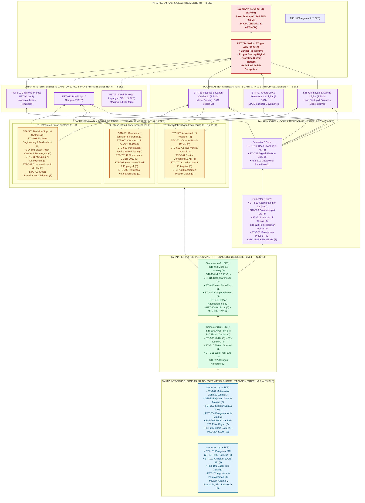

# DOKUMEN KURIKULUM PENDIDIKAN TINGGI (KPT) 2026 — PROGRAM STUDI SISTEM DAN TEKNOLOGI INFORMASI (SISTEKIN)

**Fakultas Sains dan Teknologi Informasi (FSTI) — Universitas Widyagama Malang**
**Program Sarjana (S1) — KKNI Level 6 — Tahun 2026**

> **STATUS DRAFT — HARAP DIBACA**
> Draft markdown ini mengikuti **format dan urutan `Template_KPT_2024.docx` (BAB I–XIV + Lampiran, 35 tabel)** dan diisi dengan bahan definitif dari folder `KURIKULUM2026_REVISI/` (Dok. 001–023, konsensus `AGENTS.md`).
> Tanda: **[TERISI]** = konten definitif SISTEKIN verbatim dari dokumen sumber · **[PERLU DATA UPPS]** = wajib data resmi, tidak boleh dikarang. Seluruh tabel di bawah berisi konten asli verbatim.
> Ground truth: paket ditempuh **146 SKS / 55 MK** (8 MKWU 13 + 13 FSTI 36 + 28 Core STI 79 + 6 Elektif 18); portofolio **182 SKS / 67 MK**; **14 CPL, 4 PL, 3 PEO**; 3 peminatan **STA/STB/STC-501, 601-602, 701-703**.

---
## HALAMAN SAMPUL **[TERISI]**

| Komponen | Uraian |
|---|---|
| Program Studi | Sistem dan Teknologi Informasi (SISTEKIN) |
| Fakultas | Fakultas Sains dan Teknologi Informasi (FSTI) |
| Perguruan Tinggi | Universitas Widyagama Malang |
| Jenjang | Sarjana (S1) — KKNI Level 6 |
| Tahun Kurikulum | 2026 |

## LEMBAR PENGESAHAN **[PERLU DATA UPPS]**

Dokumen Kurikulum Pendidikan Tinggi Program Studi Sistem dan Teknologi Informasi FSTI Universitas Widyagama Malang ini disusun sebagai pedoman penyelenggaraan pendidikan.

| Disusun oleh, Ketua Program Studi SISTEKIN | Mengetahui, Dekan FSTI |
|---|---|
| [Nama Kaprodi — PERLU DATA UPPS] | [Nama Dekan — PERLU DATA UPPS] |
| Malang, [Tanggal Bulan Tahun — PERLU DATA UPPS] | Malang, [Tanggal Bulan Tahun — PERLU DATA UPPS] |

## KATA PENGANTAR **[TERISI]**

Puji syukur ke hadirat Tuhan Yang Maha Esa atas tersusunnya Dokumen Kurikulum Pendidikan Tinggi Program Studi Sistem dan Teknologi Informasi. Dokumen ini disusun berorientasi pada capaian pembelajaran lulusan, kebutuhan masyarakat, perkembangan IPTEKS, serta regulasi Permendikbudristek No. 53/2023 dan Panduan KPT 2024 Edisi V. Penyusunan melibatkan pimpinan fakultas/prodi, dosen, mahasiswa, mitra DUDI, alumni, dan pengguna lulusan. Sumber isi: Dok. 001–023 folder `KURIKULUM2026_REVISI/`.

Malang, [Tanggal Bulan Tahun — PERLU DATA UPPS]
Ketua Program Studi SISTEKIN — [Nama — PERLU DATA UPPS]

## DAFTAR ISI **[TERISI]**

HALAMAN SAMPUL · LEMBAR PENGESAHAN · KATA PENGANTAR · DAFTAR ISI · DAFTAR TABEL · DAFTAR GAMBAR · DAFTAR SINGKATAN · BAB I IDENTITAS · BAB II EVALUASI DAN ANALISIS KEBUTUHAN · BAB III LANDASAN · BAB IV VISI MISI TUJUAN STRATEGI NILAI · BAB V PL PEO CPL · BAB VI BK DAN BoK · BAB VII MK DAN SKS · BAB VIII MATRIKS PETA MASA TEMPUH · BAB IX MODALITAS DAN RPS · BAB X MBKM · BAB XI PENILAIAN DAN CPL · BAB XII MANAJEMEN · BAB XIII PENERIMAAN MAHASISWA · BAB XIV PENUTUP · LAMPIRAN · DAFTAR PUSTAKA

## DAFTAR TABEL — sumber Template 35 tabel, terisi SISTEKIN

T0 Identitas · T1 Pengesahan · T2 Singkatan · T4 Evaluasi 11x4 · T5 Stakeholder 7x3 · T6 Benchmarking 3x4 · T7 Tujuan-Strategi-Indikator · T8 PEO · T9 PL · T10 CPL 14 · T11 PL-CPL · T12 CPL-KKNI · T13 BK · T14 CPL-BK · T15 Kedalaman-Keluasan · T16 MK Lama · T17 Pembentukan MK · T18 Daftar MK 55 · T19 Rekap Kelompok · T20-T27 Struktur per Semester · T28 Rekap SKS · T29 MK-CPL · T30 Konsentrasi · T31 RPS · T32 MBKM · T33 Rekognisi · T34 Penilaian CPL. Rincian penuh: Dok. 004, 005, 007, 011.

## DAFTAR GAMBAR — sumber Dok. 001, 005, 012, 016, 010

G1 Mindmap VMTS 2045 (Dok. 001) · G2 Journey 8 Semester (Dok. 005) · G3 Tree Prasyarat (Dok. 012) · G4 Pipeline AI 5 tahap (Dok. 016) · G5 Siklus PPEPP (Dok. 010). File gambar menyusul saat konversi DOCX/PDF.

## DAFTAR SINGKATAN **[TERISI]**

| Singkatan | Kepanjangan |
|---|---|
| SISTEKIN | Sistem dan Teknologi Informasi |
| FSTI | Fakultas Sains dan Teknologi Informasi |
| UWG | Universitas Widyagama Malang |
| OBE | Outcome-Based Education |
| KPT | Kurikulum Pendidikan Tinggi |
| KKNI | Kerangka Kualifikasi Nasional Indonesia |
| SN-Dikti | Standar Nasional Pendidikan Tinggi |
| PL | Profil Lulusan |
| PEO | Program Educational Objectives |
| CPL | Capaian Pembelajaran Lulusan |
| CPMK | Capaian Pembelajaran Mata Kuliah |
| BK | Bahan Kajian |
| BoK | Body of Knowledge |
| SKS | Satuan Kredit Semester |
| RPS | Rencana Pembelajaran Semester |
| MBKM | Merdeka Belajar Kampus Merdeka |
| BKP | Bentuk Kegiatan Pembelajaran |
| PPEPP | Penetapan Pelaksanaan Evaluasi Pengendalian Peningkatan |
| LAM INFOKOM | Lembaga Akreditasi Mandiri Informatika dan Komputer |

---
# BAB I — IDENTITAS PROGRAM STUDI **[TERISI SEBAGIAN]**

## 1.1 Identitas Program Studi

| No | Butir | Isian |
|---|---|---|
| 1 | Nama Perguruan Tinggi | Universitas Widyagama Malang |
| 2 | Fakultas | Fakultas Sains dan Teknologi Informasi (FSTI) |
| 3 | Program Studi | Sistem dan Teknologi Informasi (SISTEKIN) |
| 4 | Peringkat Akreditasi | **[PERLU DATA UPPS]** — nomor SK LAM INFOKOM/BAN-PT |
| 5 | Jenjang | Sarjana (S1) — KKNI Level 6 |
| 6 | Gelar Lulusan | **[PERLU DATA UPPS]** — sesuai SK izin pembukaan prodi |
| 7 | Visi Keilmuan | Menjadi Program Studi Sistem dan Teknologi Informasi yang bermutu, mandiri, bermartabat, dan berwawasan global, serta unggul dalam pengembangan sistem dan teknologi informasi cerdas terintegrasi kecerdasan artifisial, serta technopreneurship berbasis kebutuhan masyarakat dan industri pada tahun 2045. |
| 8 | Website / Email | **[PERLU DATA UPPS]** |
| 9 | SK Izin / Tahun Pertama | **[PERLU DATA UPPS]** |

## 1.2 Sejarah Singkat Program Studi — sumber Dok. 001

Prodi SISTEKIN dikembangkan di lingkungan FSTI UWG untuk menjawab kebutuhan transformasi digital, integrasi AI ke sistem nyata, dan technopreneurship. Berbeda dari TI (riset algoritma murni) dan Bisnis Digital (model bisnis), SISTEKIN berperan sebagai **integrator AI ke sistem dan platform nyata**. Detail historis pendirian menunggu data UPPS.

## 1.3 Rasional Pengembangan Kurikulum **[TERISI — sumber Dok. 001, 019]**

Respons terhadap Permendikbudristek 53/2023, CC2020/IS2020/IT2017, dan hasil evaluasi K2025 (56 MK/146 SKS SIAKAD). Pendekatan OBE menempatkan 14 CPL sebagai dasar BK, MK, metode, dan asesmen. KPM (3 SKS) dan Kewirausahaan II (0 SKS) dipertahankan sebagai kebijakan UWG.

---
# BAB II — EVALUASI KURIKULUM DAN ANALISIS KEBUTUHAN **[TERISI SEBAGIAN]**

## 2.1 Latar Belakang Evaluasi Kurikulum

Evaluasi memastikan relevansi terhadap IPTEKS, DUDI, dan SN-Dikti. SISTEKIN belum memiliki kohor lulusan sehingga tracer alumni belum dapat dijalankan; evaluasi bertumpu pada market signal, benchmarking, standar APTIKOM, dan audit internal (Dok. 017, 019). Instrumen tracer sudah siap (Dok. 010).

## 2.2 Mekanisme Evaluasi Kurikulum

1. Peninjauan dokumen berjalan. 2. Evaluasi ketercapaian CPL. 3. Evaluasi struktur MK-SKS. 4. Evaluasi RPS. 5. Analisis bidang ilmu. 6. Analisis DUDI. 7. Masukan dosen/mhs/alumni/pengguna. 8. Benchmarking sejenis. 9. FGD stakeholder. 10. Rekomendasi pengembangan.

## 2.3 Hasil Evaluasi Kurikulum Berjalan — sumber Dok. 019, Dok. 024

| Aspek yang Dievaluasi | Kondisi Saat Ini | Permasalahan | Rekomendasi Perbaikan |
|---|---|---|---|
| Kebutuhan | Tren AI, cloud, cyber, platform | K2025 tanpa peminatan | 3 peminatan @18 SKS (Dok. 006) |
| Desain CPL-RPS | CPL lama, RPS belum OBE penuh | Redundansi, gap asesmen | 14 CPL + silabus 67 MK (Dok. 003, 007) |
| Struktur SKS | 56 MK/146 SKS semua wajib | Kaku, MBKM sulit | 146/55 ditempuh, 182/67 portofolio (Dok. 005) |
| Sumber daya | [PERLU DATA UPPS] | [isi] | [isi] |
| Proses | Perlu Case Method/PjBL | IKU 7 belum 50% | 4x asesmen, PjBL (Dok. 008) |
| Capaian | Belum ada lulusan | Tidak terukur | Formula CPL (Dok. 008) |

Rincian Tabel B 6 tahap x 5 kolom menunggu data riil; kerangka di Dok. 022.

## 2.4 Analisis Kebutuhan Pemangku Kepentingan

Melibatkan pimpinan, dosen, mahasiswa, DUDI, alumni, pengguna lulusan, APTIKOM/IEEE/ACM.

## 2.5 Hasil Masukan Stakeholder — sumber Dok. 001, Dok. 010

| Stakeholder | Masukan | Implikasi terhadap Kurikulum |
|---|---|---|
| DUDI/Industri | Butuh integrator AI, cloud, cyber, platform + etika | PL-1 s.d. PL-4, KK1-KK6, magang/PKL |
| Alumni/Pengguna | [menunggu kohor pertama; proksi FGD] | Tracer Dok. 010 disiapkan |
| Asosiasi (APTIKOM) | IS2020 + IT2017 | 21 BoK IS + 15 BoK IT (Dok. 003) |
| Masyarakat/UMKM | Transformasi digital tepat guna | KPM 3 SKS, Smart City 2 SKS |

## 2.6 Tracer Study

Belum ada lulusan. Bagian ini diisi analisis kebutuhan pengguna prospektif, FGD, benchmarking, dan proyeksi kompetensi (sesuai catatan template). Instrumen lengkap Dok. 010 akan dijalankan setelah kohor pertama lulus.

## 2.7 Benchmarking Kurikulum — sumber SURVEY_PEMETAAN2026/, Dok. 003

| PT/Prodi Pembanding | Aspek Dibandingkan | Hasil | Implikasi |
|---|---|---|---|
| SI APTIKOM v2.0 / IS2020 | CPL, BK 01-19 | Adopsi 19 BoK IS | P1-P4, KK1-KK2 |
| TI 2023 / IT2017 | Infra, security | Adopsi 14 BoK IT | KK3-KK4, OS/Jaringan Sem 3 |
| Prodi sejenis | Struktur 144-146 SKS | Batas 20 SKS Sem 1-2 | Sem1 19, Sem2 20 |

---
# BAB III — LANDASAN PERANCANGAN DAN PENGEMBANGAN KURIKULUM **[TERISI]**

## 3.1 Landasan Filosofis

Pendidikan tinggi membentuk insan berilmu, profesional, etis, adaptif, dan technopreneur; OBE Spady menempatkan outcome terukur sebagai pusat desain.

## 3.2 Landasan Sosiologis

Transformasi digital, kebutuhan DUDI, UMKM, smart society; prodi berperan mengintegrasikan AI/cloud/cyber/platform ke proses bisnis.

## 3.3 Landasan Psikologis

Mahasiswa sebagai pembelajar dewasa aktif-mandiri-kolaboratif dengan gaya visual-auditorial-kinestetik; SCL, blended, Case Method/PjBL.

## 3.4 Landasan Historis

Pengalaman K2025 (56 MK wajib) menjadi pijakan; peleburan 4 klaster (G-1 s.d. G-4, efisiensi -7 SKS) dan 18 MK baru K2026 (Dok. 024).

## 3.5 Landasan Yuridis

1. UU 12/2012. 2. Perpres 8/2012 KKNI. 3. Permendikbud 73/2013. 4. Permendikbudristek 53/2023. 5. Panduan KPT 2024 Edisi V. 6. Panduan MBKM 2024. 7. Statuta UWG **[PERLU DATA UPPS]**. 8. Renstra UWG **[PERLU DATA UPPS]**. 9. Renstra FSTI **[PERLU DATA UPPS]**. 10. Peraturan Akademik UWG **[PERLU DATA UPPS]**. 11. SPMI UWG **[PERLU DATA UPPS]**.

---
# BAB IV — VISI, MISI, TUJUAN, STRATEGI, DAN NILAI DASAR **[TERISI]**

## 4.1 Visi Universitas Widyagama Malang — **[PERLU DATA UPPS]**

## 4.2 Misi Universitas Widyagama Malang — **[PERLU DATA UPPS]**

## 4.3 Visi Fakultas Sains, Teknologi, dan Informatika — **[PERLU DATA UPPS]**

## 4.4 Misi Fakultas Sains, Teknologi, dan Informatika — **[PERLU DATA UPPS]**

## 4.5 Visi Keilmuan Program Studi

Menjadi Program Studi Sistem dan Teknologi Informasi yang bermutu, mandiri, bermartabat, dan berwawasan global, serta unggul dalam pengembangan sistem dan teknologi informasi cerdas terintegrasi kecerdasan artifisial, serta technopreneurship berbasis kebutuhan masyarakat dan industri pada tahun 2045.

## 4.6 Misi Program Studi

1. Pendidikan berstandar OBE bidang AI & Smart Systems dan technopreneurship. 2. Riset terapan transformatif (AI, cloud, cyber, platform). 3. PkM tepat guna untuk UMKM dan transformasi digital. 4. Kemitraan industri global, open-source, startup + Good University Governance.

## 4.7 Tujuan Program Studi

| Tujuan Program Studi | Strategi Pencapaian | Indikator Keberhasilan |
|---|---|---|
| Lulusan kompeten SI+TI+AI aplikatif berdaya saing global | 146/55 OBE, PjBL, praktikum 43,2% | CPL attainment, masa tunggu, kesesuaian kerja |
| Riset terapan dan publikasi solutif | Pipeline AI 5 tahap, capstone | Publikasi, produk, HKI |
| Technopreneur dan tech founders | KWU I-II, startup, capstone | Startup, MVP, sertifikasi |
| Jejaring tri-dharma | MBKM, PKL, APTIKOM/IEEE/ACM | MoU, MBKM 20 SKS |

## 4.8 Strategi Pencapaian Tujuan Program Studi

Tahap Fondasi Sem 1-2 (max 20 SKS), Inti Sem 3-4 (OS/Jaringan Sem 3; ML/Cloud Sem 4), Spesialisasi Sem 5-7 (peminatan + IoT + Platform + Smart City), Penyelesaian Sem 8 (skripsi/4 opsi non-skripsi).

## 4.9 Nilai Dasar

Bermutu, mandiri, bermartabat, global, etis, inovatif, technopreneur; selaras University Value UWG **[PERLU DATA UPPS]**.

# BAB V — PROFIL LULUSAN, PEO, DAN CAPAIAN PEMBELAJARAN LULUSAN **[TERISI]**

## 5.1 Program Educational Objectives (PEO — 3–5 tahun pasca-lulus) — sumber verbatim Dok. 002 §3, Dok. 010 §2

| Kode PEO | Pernyataan Formal Objektif Pendidikan (3–5 Tahun Pasca Kelulusan) |
|---|---|
| **PEO-1** | **Professional Practice and Systems Integration** — "Dalam 3–5 tahun setelah lulus, alumni mampu berkarier secara profesional dalam menganalisis, merancang, mengembangkan, mengintegrasikan, mengamankan, atau mengelola sistem dan teknologi informasi cerdas sesuai kebutuhan organisasi, industri, dan masyarakat." |
| **PEO-2** | **Digital Innovation and Technopreneurship** — "Dalam 3–5 tahun setelah lulus, alumni mampu menghasilkan inovasi, produk, layanan, perbaikan proses, atau usaha digital yang relevan, etis, berkelanjutan, dan memberikan nilai tambah bagi pengguna, organisasi, industri, atau masyarakat." |
| **PEO-3** | **Advanced Study, Research, and Lifelong Learning** — "Dalam 3–5 tahun setelah lulus, alumni mampu mengembangkan kompetensi melalui studi lanjut (S2/S3), penelitian terapan, sertifikasi profesional, komunitas keilmuan, atau pembelajaran sepanjang hayat serta menunjukkan kepemimpinan sesuai konteksnya." |

Kepemimpinan (leadership) melekat lintas-PEO, bukan PEO terpisah: PEO-1 memimpin tim teknis/arsitektur/transformasi digital; PEO-2 memimpin startup/tim lintas fungsi; PEO-3 memimpin kajian riset/laboratorium/publikasi. Matriks VMTS×PEO dan PEO×PL lengkap Dok. 010 §3.

## 5.2 Profil Lulusan (4 PL Role-Based) — sumber verbatim Dok. 002 §2

| Kode | Profil Lulusan | Basis Peminatan | CPL Khusus Utama |
|---|---|---|---|
| PL-1 | Intelligent Information Systems & Data/AI Engineer | P1: Integrated Smart Systems | KK1 (AI & ML System), KK2 (Data & MLOps) |
| PL-2 | Cloud Infrastructure, Cybersecurity & Smart Systems Integrator | P2: Cloud Infra & Cybersecurity | KK3 (Cloud, IoT, Cyber), KK4 (IT Governance) |
| PL-3 | UI/UX Designer & Digital Platform Engineer | P3: Digital Platform Eng. | KK5 (UI/UX & Platform), P4 (Software & Web/Mob) |
| PL-4 | Digital Technopreneur & IT Product Innovator | Lintas Peminatan / Capstone Ecosystem | KK6 (Techno & Agile), S1, KU1, KU2, KU3 |

Rincian deskripsi dan profesi tiap profil:

**PL-1: Intelligent Information Systems & Data/AI Engineer.** Menganalisis kebutuhan organisasi, merancang arsitektur SI cerdas terintegrasi, merekayasa pipeline data skala besar (Data Engineering), mengembangkan model ML/DL, serta menerapkan MLOps ke aplikasi enterprise nyata. Profesi: AI Software Developer, Data Engineer, Machine Learning Engineer, Business Intelligence Specialist, Intelligent System Analyst.

**PL-2: Cloud Infrastructure, Cybersecurity & Smart Systems Integrator.** Merancang, mengimplementasikan, dan mengelola infrastruktur cloud native/DevOps, mengintegrasikan IoT dan sistem cerdas (Smart City/Smart Campus), mengamankan aset informasi (Vulnerability Assessment), serta menegakkan tata kelola dan audit TI (COBIT/ITIL/ISO 27001). Profesi: Cloud Architect/DevOps Engineer, Cybersecurity Analyst, Smart Systems/IoT Integrator, IT Infrastructure Engineer, IT Governance & Audit Specialist.

**PL-3: UI/UX Designer & Digital Platform Engineer.** Merancang arsitektur interaksi dan pengalaman pengguna berbasis riset (UI/UX Design), merekayasa antarmuka modern (Web & Mobile Frontend), membangun layanan mikro (Microservices), serta mengintegrasikan platform digital terdistribusi skala besar. Profesi: UI/UX Designer, Frontend/Fullstack Platform Engineer, Mobile Application Engineer, Digital Experience Specialist, Solution Architect.

**PL-4: Digital Technopreneur & IT Product Innovator.** Mengidentifikasi celah pasar (Market Validation), merancang model bisnis inovatif (Lean Startup), membangun MVP, mengelola proyek TI Agile/Scrum, serta mendirikan dan memimpin tech startup berbasis sistem cerdas. Profesi: Tech Startup Founder, IT Product Manager, Agile Project Manager, Digital Transformation Consultant, Technology Business Specialist.

## 5.3 Rumusan Capaian Pembelajaran Lulusan (14 CPL) — sumber verbatim Dok. 003 §2, Dok. 009A–009E

| Kode CPL | Rumusan CPL SISTEKIN 2026 |
|---|---|
| **S1** | Bertakwa kepada Tuhan Yang Maha Esa, menginternalisasi nilai, norma, etika digital dan hukum profesi, menjunjung tinggi kejujuran dan integritas, mampu bekerja sama secara produktif dalam tim lintas disiplin, serta menunjukkan sikap tanggung jawab atas pekerjaan di bidang keahliannya secara mandiri. |
| **KU1** | Mampu menerapkan pemikiran logis, kritis, sistematis, dan inovatif dalam menganalisis permasalahan komputasi serta mengkaji implikasi pengembangan atau implementasi iptek sesuai kaidah, tata cara, dan etika ilmiah. |
| **KU2** | Mampu mengomunikasikan gagasan, rancangan arsitektur, dan solusi teknis secara efektif baik lisan maupun tulisan, serta memelihara dan mengembangkan jaringan kerja kolaboratif dengan pemangku kepentingan industri. |
| **KU3** | Mampu mengambil keputusan yang tepat berdasarkan analisis data dan informasi, bertanggung jawab atas pencapaian hasil kerja kelompok, melakukan evaluasi diri, serta mengelola pembelajaran mandiri sepanjang hayat (lifelong learning). |
| **P1** | Menguasai konsep dasar sains, matematika terapan (kalkulus, aljabar linear, statistika, matematika diskrit, logika) sebagai fondasi pemecahan masalah rekayasa sistem informasi dan komputasi cerdas yang kompleks. |
| **P2** | Menguasai konsep teoretis sistem informasi, analisis & perancangan sistem, arsitektur enterprise, metodologi pengembangan perangkat lunak, serta proses bisnis organisasi untuk transformasi digital. |
| **P3** | Menguasai prinsip dan konsep infrastruktur TI, jaringan komputer, komputasi awan (cloud), keamanan informasi & siber, tata kelola TI, serta manajemen proyek sistem dan teknologi informasi. |
| **P4** | Menguasai prinsip rekayasa perangkat lunak modern (web, mobile, distributed), manajemen basis data relasional/NoSQL, rekayasa data & visualisasi, serta prinsip desain interaksi pengalaman pengguna (UI/UX). |
| **KK1** | Mampu menganalisis, merancang, dan mengembangkan sistem informasi cerdas terintegrasi kecerdasan artifisial (AI/ML, NLP, Computer Vision, Smart Sys, DSS) guna memecahkan masalah kompleks organisasi dan industri. |
| **KK2** | Mampu merekayasa pipeline data skala besar (Data Engineering), membangun model machine learning/deep learning, serta menerapkan MLOps untuk solusi analitik dan visualisasi data bisnis. |
| **KK3** | Mampu merancang, mengintegrasikan, dan mengelola infrastruktur komputasi awan (Cloud/DevOps), sistem sensor cerdas (IoT), dan ketahanan siber (Cybersecurity) secara andal, terukur, dan aman. |
| **KK4** | Mampu merancang tata kelola TI (IT Governance), melakukan audit sistem informasi, serta memastikan kepatuhan terhadap standar industri dan manajemen risiko (COBIT, ITIL, ISO 27001). |
| **KK5** | Mampu merancang pengalaman pengguna berbasis riset (UI/UX) serta merekayasa platform digital modern yang skalabel (Microservices, Web/Mobile, API, SaaS, BPA). |
| **KK6** | Mampu merancang, memvalidasi model bisnis (Lean Startup/MVP), mengelola proyek agile, serta mendirikan usaha rintisan teknologi (technopreneurship) mandiri berbasis kebutuhan pasar. |

Genealogi: S1 dari SN-Dikti Sikap + CPL-S01–S08; KU1–KU3 dari SN-Dikti KU + CPL-KU01–KU08; P1–P4 dari CPL-P01–P17 + IT2017 P1–P2; KK1–KK6 dari CPL-K01–K17 + IT2017 KK1–KK3 (Dok. 003 §2). Indikator kinerja dan target Bloom: S1 A3; KU1 C4; KU2–KU3 C5; P1 C3; P2–P4 C4; KK1–KK3 C6; KK4 C5; KK5–KK6 C6 (Dok. 003 §3). Total tepat 14 CPL.

## 5.4 Matriks Hubungan Profil Lulusan dengan CPL — sumber verbatim Dok. 003 §6

| Profil Lulusan SISTEKIN 2026 | Peminatan Terkait | S1 | KU1 | KU2 | KU3 | P1 | P2 | P3 | P4 | KK1 | KK2 | KK3 | KK4 | KK5 | KK6 |
|---|:---:|:---:|:---:|:---:|:---:|:---:|:---:|:---:|:---:|:---:|:---:|:---:|:---:|:---:|:---:|
| **PL-1: Intelligent IS Developer & AI Engineer** | P1 | ⭐ | ⭐ | ⭐ | ⭐ | ⭐ | ⭐ | | ⭐ | ⭐⭐⭐ | ⭐⭐⭐ | | | ⭐ | |
| **PL-2: Cloud & Cybersecurity Specialist** | P2 | ⭐ | ⭐ | ⭐ | ⭐ | ⭐ | | ⭐ | | | | ⭐⭐⭐ | ⭐⭐⭐ | | |
| **PL-3: UI/UX & Digital Platform Engineer** | P3 | ⭐ | ⭐ | ⭐ | ⭐ | | ⭐ | | ⭐ | | | | | ⭐⭐⭐ | ⭐⭐ |
| **PL-4: IT Project Manager & Technopreneur** | P3 / P1 / P2 | ⭐ | ⭐ | ⭐ | ⭐ | | ⭐ | ⭐ | ⭐ | ⭐ | | | | ⭐⭐ | ⭐⭐⭐ |

⭐⭐⭐ Major Competency; ⭐⭐ Supporting; ⭐ Foundational. Matriks PEO×CPL: PEO-1 = S1,KU1-3,P1-P4,KK1-KK5; PEO-2 = S1,KU1-3,P2-P4,KK5,KK6,KK1; PEO-3 = seluruh 14 CPL (Dok. 003 §7, Dok. 010 §3.3).

## 5.5 Matriks CPL dengan KKNI dan SN-Dikti — sumber Dok. 003 §2

| Kode CPL | Unsur KKNI/SN-Dikti | Keterangan Kesesuaian |
|---|---|---|
| S1 | SN-Dikti Sikap Butir 1–10 + CPL-S01–S08 | Sesuai |
| KU1 | SN-Dikti KU Butir 1 & 3 + CPL-KU01 | Sesuai |
| KU2 | SN-Dikti KU Butir 4 & 6 + CPL-KU02, KU04 | Sesuai |
| KU3 | SN-Dikti KU Butir 2,5,7,8,9 + CPL-KU03, KU05–KU08 | Sesuai |
| P1 | KKNI Pengetahuan + CPL-P05 + IT2017 P1 | Fondasi Matematika & Sains Komputasi |
| P2 | KKNI Pengetahuan + CPL-P01,P04,P09,P16 + IT2017 P2 | SI & Proses Bisnis |
| P3 | KKNI Pengetahuan + CPL-P03,P06–P08 + IT2017 P2 | Infra, Cloud, Cyber & Governance |
| P4 | KKNI Pengetahuan + CPL-P02,P10–P14 + IT2017 P1 | Software, Data & Platform |
| KK1–KK6 | KKNI Keterampilan Khusus + CPL-K01–K17 + IT2017 KK1–KK3, @2 per peminatan | Sesuai peminatan P1/P2/P3

---
# BAB VI — BAHAN KAJIAN DAN BODY OF KNOWLEDGE **[TERISI]**

## 6.1 Dasar Penetapan Bahan Kajian

BK diturunkan dari 14 CPL dan BoK APTIKOM SI v2.0 (IS2020) + TI 2023 (IT2017/CC2020). STI-103 (Arsitektur, Sem 1) dan STI-204 (Diskrit-Logika, Sem 2) terpadu bebas redundansi.

## 6.2 Body of Knowledge Program Studi — sumber verbatim Dok. 003 §4–§5 (21 BoK IS2020 + 15 BoK IT2017)

| Kode BoK IS2020 | Nomenklatur Bahan Kajian IS2020 |
|---|---|
| BK-IS01 | Foundations of Information Systems |
| BK-IS02 | Data and Information Management |
| BK-IS03 | IT Infrastructure and Networking |
| BK-IS04 | Enterprise Architecture |
| BK-IS05 | IS Management and Governance |
| BK-IS06 | Information Security and Risk Management |
| BK-IS07 | Systems Analysis and Design |
| BK-IS08 | Project Management |
| BK-IS09 | Business Process Management |
| BK-IS10 | Applied Mathematics and Logic |
| BK-IS11 | Programming Fundamentals & Object-Oriented |
| BK-IS12 | Web and Mobile Application Development |
| BK-IS13 | Data Analytics and Business Intelligence |
| BK-IS14 | IT Audit and Compliance |
| BK-IS15 | Digital Innovation and Entrepreneurship |
| BK-IS16 | Artificial Intelligence & Intelligent Systems |
| BK-IS17 | Human-Computer Interaction & UX |
| BK-IS18 | Machine Learning and Data Science |
| BK-IS19 | Cloud Architecture & DevOps |
| BK-IS20 | Ethics, Use and Implications for Society |
| BK-IS21 | Internship and Professional Practice |

| Kode BoK IT2017 | Nomenklatur Bahan Kajian Utama IT2017 |
|---|---|
| BK-IT01 | Information Technology Fundamentals |
| BK-IT02 | Applied AI & Intelligent Technologies |
| BK-IT03 | Networking & Communications |
| BK-IT04 | Platform Technologies & Web/Mobile |
| BK-IT05 | Cloud Computing & Virtualization |
| BK-IT06 | Cybersecurity Principles & Defense |
| BK-IT07 | System Integration and Architecture |
| BK-IT08 | IT Service Management & Governance |
| BK-IT09 | Data Analytics & Information Visualization |
| BK-IT10 | User Experience & Interaction Design |
| BK-IT11 | Software Development Practices |
| BK-IT12 | IT Risk Management and Compliance |
| BK-IT13 | Technology Entrepreneurship |
| BK-IT14 | IoT and Embedded Smart Systems |
| BK-IT15 | Global Professional Practice |

Jangkar kurikulum: BK-IS03/BK-IT05 diampu STI-103 Arsitektur dan Organisasi STI (Sem 1, 3 SKS); BK-IS10 diampu STI-204 Matematika Diskrit dan Logika (Sem 2, 3 SKS).

## 6.3 Matriks CPL dengan Bahan Kajian — sumber verbatim Dok. 003 §4–§5

Matriks CPL↔21 BoK IS2020:

| Kode BoK | Nomenklatur | S1 | KU1 | KU2 | KU3 | P1 | P2 | P3 | P4 | KK1 | KK2 | KK3 | KK4 | KK5 | KK6 |
|---|---|:---:|:---:|:---:|:---:|:---:|:---:|:---:|:---:|:---:|:---:|:---:|:---:|:---:|:---:|
| BK-IS01 | Foundations of IS | | | | | | ✅ | | | ✅ | | | | ✅ | |
| BK-IS02 | Data and Information Management | | | | | | | | ✅ | ✅ | ✅ | | | | |
| BK-IS03 | IT Infrastructure and Networking | | | | | | | ✅ | | | | ✅ | | | |
| BK-IS04 | Enterprise Architecture | | | | | | ✅ | | | | | | | ✅ | |
| BK-IS05 | IS Management and Governance | | | | | | | ✅ | | | | | ✅ | | |
| BK-IS06 | Security and Risk Management | | | | | | | ✅ | | | | ✅ | ✅ | | |
| BK-IS07 | Systems Analysis and Design | | | | | | ✅ | | ✅ | ✅ | | | | ✅ | |
| BK-IS08 | Project Management | | | | | | | ✅ | | | | | | | ✅ |
| BK-IS09 | Business Process Management | | | | | | ✅ | | | | | | ✅ | | |
| BK-IS10 | Applied Mathematics and Logic | | | | | ✅ | | | | ✅ | ✅ | | | | |
| BK-IS11 | Programming Fundamentals & OO | | | | | ✅ | | | ✅ | ✅ | | | | | |
| BK-IS12 | Web and Mobile Development | | | | | | | | ✅ | | | | | ✅ | |
| BK-IS13 | Data Analytics and BI | | | | | | | | ✅ | ✅ | ✅ | | | | |
| BK-IS14 | IT Audit and Compliance | | | | | | | ✅ | | | | | ✅ | | |
| BK-IS15 | Digital Innovation and Entrepreneurship | | | | | | | | | | | | | | ✅ |
| BK-IS16 | AI & Intelligent Systems | | | | | | ✅ | | | ✅ | ✅ | | | | |
| BK-IS17 | HCI & UX | | | | | | | | ✅ | | | | | ✅ | |
| BK-IS18 | ML and Data Science | | | | | ✅ | | | | ✅ | ✅ | | | | |
| BK-IS19 | Cloud Architecture & DevOps | | | | | | | ✅ | | | | ✅ | | | |
| BK-IS20 | Ethics, Use and Implications | ✅ | | | ✅ | | | ✅ | | | | | ✅ | | |
| BK-IS21 | Internship and Professional Practice | ✅ | ✅ | ✅ | ✅ | | | | | | | | | | |

Matriks CPL↔15 BoK IT2017:

| Kode BoK | Nomenklatur | S1 | KU1 | KU2 | KU3 | P1 | P2 | P3 | P4 | KK1 | KK2 | KK3 | KK4 | KK5 | KK6 |
|---|---|:---:|:---:|:---:|:---:|:---:|:---:|:---:|:---:|:---:|:---:|:---:|:---:|:---:|:---:|
| BK-IT01 | IT Fundamentals | | | | | | | ✅ | | | | ✅ | | | |
| BK-IT02 | Applied AI & Intelligent Tech | | | | | | | | | ✅ | | | | | |
| BK-IT03 | Networking & Communications | | | | | | | ✅ | | | | ✅ | | | |
| BK-IT04 | Platform Tech & Web/Mobile | | | | | | | | ✅ | | | | | ✅ | |
| BK-IT05 | Cloud Computing & Virtualization | | | | | | | ✅ | | | | ✅ | | | |
| BK-IT06 | Cybersecurity Principles & Defense | | | | | | | ✅ | | | | ✅ | ✅ | | |
| BK-IT07 | System Integration and Architecture | | | | | | | ✅ | | | | ✅ | | ✅ | |
| BK-IT08 | IT Service Management & Governance | | | | | | | ✅ | | | | | ✅ | | |
| BK-IT09 | Data Analytics & Visualization | | | | | | | | ✅ | | ✅ | | | | |
| BK-IT10 | UX & Interaction Design | | | | | | | | ✅ | | | | | ✅ | |
| BK-IT11 | Software Development Practices | | | | | | | | ✅ | | | | | ✅ | |
| BK-IT12 | IT Risk Management and Compliance | | | | | | | | | | | | ✅ | | |
| BK-IT13 | Technology Entrepreneurship | | | | | | | | | | | | | | ✅ |
| BK-IT14 | IoT and Embedded Smart Systems | | | | | | | | | ✅ | | ✅ | | | |
| BK-IT15 | Global Professional Practice | ✅ | ✅ | ✅ | ✅ | | | | | | | | | | |

## 6.4 Kedalaman dan Keluasan Bahan Kajian — sumber Dok. 003, Dok. 016 (5-stage AI pipeline)

| Bahan Kajian | Tingkat Kedalaman | Tingkat Keluasan | Implikasi pada Mata Kuliah |
|---|---|---|---|
| Fondasi sains-komputasi (P1) | C3 Apply | Kalkulus, aljabar, matdis, statistika | STI-102, STI-204, STI-205, FST-408 |
| SI & proses bisnis (P2) | C4 Analyze | BPMN 2.0, SDLC, Agile/Scrum, enterprise | STI-101, STI-306, STI-309, STI-523 |
| Infra-cloud-cyber-governance (P3) | C4 Analyze, KK3-KK4 C5-C6 | TCP/IP, IaaS/PaaS/SaaS, CIA Triad, COBIT/ITIL/ISO 27001 | STI-310, STI-312, STI-417, STI-418/519, STB-501–703 |
| Software-data-platform (P4-KK5) | C4 Analyze, C6 Create | Normalisasi, SQL/NoSQL, REST, microservices, WCAG | FST-102/203/207, STI-308/311/416/522/627, STC-501–703 |
| AI/ML aplikatif (KK1-KK2) | C6 Create | Pipeline 5 tahap Dok. 016: data → model → integrasi → MLOps → smart service | STI-307/413/414/624/626, STI-415/520, STA-501–703 |

---
# BAB VII — PEMBENTUKAN MATA KULIAH DAN PENENTUAN BOBOT SKS **[TERISI]**

## 7.1 Prinsip Pembentukan Mata Kuliah

Dua jalur KPT: evaluasi MK berjalan (Tabel 5 KPT) dan pembentukan baru dari CPL (Tabel 6 KPT). Proporsi seimbang, 20 MK (63 SKS/43,2%) +P praktikum, Case Method/PjBL untuk IKU 7. Kolisi kode K2025↔K2026: STI-102 (Algoritma→Kalkulus), STI-103 (Logika→Arsitektur), STI-101 (3→2 SKS) — selalu sebut tahun.

## 7.2 Evaluasi Mata Kuliah Kurikulum Berjalan — sumber Dok. 024 (56 MK K2025 → K2026)

Ground truth K2025 dari Laporan SIAKAD: 56 MK / 146 SKS, sebaran 18-18-20-20-21-21-20-8, seluruhnya Wajib, nilai min C. Kategori ekivalensi: E1 Penuh 34 MK (alih nilai langsung), E2 Bersyarat 11 MK (uji penyetaraan), E3 Gabungan 8 MK (4 klaster peleburan G-1 s.d. G-4, efisiensi -7 SKS), E4 Pecah 1 MK, E5 Tanpa Padanan 2 MK (STI-423 Game Design & Gamifikasi Sosial, STI-638 Intelligent Signal Processing — status E5 dipertahankan, penghapusan sah, Dok. 026). Simulasi pengakuan: P1/P2 = 120 SKS, P3 = 117 SKS. Arah balik K2026←K2025: 114 dari 128 SKS wajib diakui (89,1%), defisit 14 SKS pada 5 MK baru; titik kritis Sem 1 (STI-103) dan Sem 3 (STI-312) sebagai prasyarat berantai. Tabel entri SIAKAD 57 baris konversi Dok. 024 §9.

## 7.3 Pembentukan Mata Kuliah Baru — sumber Dok. 004, Dok. 005

18 MK baru K2026 (5 wajib/14 SKS + 13 elektif): STI-103 Arsitektur dan Organisasi STI (Sem 1, 3 SKS, ganti Logika lama); STI-204 Matematika Diskrit dan Logika (Sem 2, 3 SKS, terpadu proposisi & boolean); STI-312 Jaringan Komputer (Sem 3, 3 SKS, fondasi IoT/Cloud/Security); STI-418 Dasar Keamanan Informasi (Sem 4, 2 SKS); STI-727 Smart City & Pemerintahan Digital (Sem 6, 2 SKS); plus 13 elektif peminatan STA/STB/STC. Mekanisme: CPL dibebankan + BK → MK → SKS proporsional; 20 MK +P praktikum; Case Method/PjBL untuk IKU 7.

## 7.4 Daftar Mata Kuliah — sumber verbatim Dok. 005 §1 (55 ditempuh / 67 ditawarkan)

Kelompok MKWU (8 MK / 13 SKS): MKU-101 Agama I (2, Sem 1); MKU-102 Pancasila (2, Sem 1); MKU-103 Bahasa Indonesia (2, Sem 1); MKU-204 Kewirausahaan I (2, Sem 2); MKU-405 Kewarganegaraan (2, Sem 4); MKU-406 Agama II (0, Sem 4, kebijakan UWG); MKU-507 KPM (3 +Praktik, Sem 5, syarat ≥80 SKS); MKU-508 Kewirausahaan II (0, Sem 5, kebijakan UWG).

Kelompok FSTI (13 MK / 36 SKS): FST-101 Dasar Teknologi Digital (2, Sem 1); FST-102 Algoritma dan Pemrograman (3 +P, Sem 1); FST-203 Struktur Data dan Algoritma (3 +P, Sem 2, prasyarat FST-102); FST-204 Pengantar Kecerdasan Artifisial & Data (2, Sem 2, FST-101); FST-205 Basic English for IT (2, Sem 2); FST-206 Etika Profesi & Hukum Digital (2, Sem 2); FST-207 Sistem Basis Data (3 +P, Sem 2, FST-102); FST-408 Probabilitas dan Statistika (3, Sem 4, STI-102); FST-611 Metodologi Penelitian (2, Sem 6, ≥76 SKS); FST-610 Capstone Project FSTI (3 Proyek, Sem 6, STI-523 + ≥100 SKS); FST-612 PKL (3 Magang, Sem 6, ≥100 SKS); FST-613 Pra-Skripsi/Seminar Proposal (2 Seminar, Sem 6, FST-611 + ≥100 SKS); FST-714 Skripsi/Tugas Akhir (6 Mandiri, Sem 8, FST-613 + ≥120 SKS).

Kelompok Core STI (28 MK / 79 SKS): STI-101 Pengantar Sistem dan TI (2, Sem 1); STI-102 Kalkulus (3, Sem 1); STI-103 Arsitektur dan Organisasi STI (3, Sem 1); STI-204 Matematika Diskrit dan Logika (3, Sem 2, STI-103); STI-205 Aljabar Linear dan Matriks (3, Sem 2, STI-102); STI-306 Analisis dan Perancangan SI (3, Sem 3, STI-101 + FST-207); STI-307 Sistem Cerdas (2, Sem 3, STI-204 + FST-204); STI-308 UI/UX Design & Prototyping (3 +P, Sem 3, FST-101); STI-309 Rekayasa Perangkat Lunak (3, Sem 3, FST-203); STI-310 Sistem Operasi (3, Sem 3, STI-103); STI-311 Web Front End Development (3 +P, Sem 3, FST-102); STI-312 Jaringan Komputer (3 +P, Sem 3, STI-103); STI-413 Machine Learning (3 +P, Sem 4, STI-205 + STI-307); STI-414 Pengantar NLP & Information Retrieval (2 +P, Sem 4, STI-307); STI-415 Data Warehouse & BI (3 +P, Sem 4, FST-207); STI-416 Web Back End Development (3 +P, Sem 4, FST-207 + STI-311); STI-417 Komputasi Awan (3, Sem 4, STI-312 + STI-310); STI-418 Dasar Keamanan Informasi (2, Sem 4, STI-312); STI-519 Keamanan Informasi Lanjut (3, Sem 5, STI-418); STI-520 Data Mining & Visualisasi Data (3 +P, Sem 5, STI-413 + STI-415); STI-521 Internet of Things (3 +P, Sem 5, STI-312 + STI-310); STI-522 Pemrograman Aplikasi Mobile (3 +P, Sem 5, STI-311 + STI-416); STI-523 Manajemen Proyek TI (3, Sem 5, STI-306 + STI-309); STI-726 Deep Learning & Neural Networks (3 +P, Sem 6, STI-413); STI-727 Digital Platform Engineering (3 +P, Sem 6, STI-416); STI-726 Integrasi Layanan Cerdas Berbasis AI (3 +P, Sem 7, STI-413 + STI-416); STI-727 Smart City & Pemerintahan Digital (2, Sem 7, STI-521); STI-728 Inovasi Teknologi dan Startup Digital (3 +P, Sem 7, STI-727 + MKU-204).

Kelompok Elektif (18 ditawarkan, ditempuh 6 MK / 18 SKS): P1 — STA-501 Decision Support Systems (3 +P, Sem 5, STI-307); STA-601 Rekayasa Big Data dan Komputasi Terdistribusi (3 +P, Sem 6, FST-207 + STI-415); STA-602 Intelligent Agent Systems (3 +P, Sem 7, STI-307); STA-701 MLOps and AI Pipeline (3 +P, Sem 7, STI-413 + STI-726); STA-702 Conversational AI and Intelligent Assistant (3 +P, Sem 7, STI-413 + STI-416); STA-703 Smart Surveillance and IoT Analytics (3 +P, Sem 7, STI-726 + STI-521). P2 — STB-501 Network Security and Digital Forensics (3 +P, Sem 5, STI-312 + STI-418); STB-601 Cloud Architecture & DevOps (3 +P, Sem 6, STI-417); STB-602 Cybersecurity Risk Management (3 Teori, Sem 7, STI-418); STB-701 IT Governance & Compliance COBIT 2019 (3 Teori, Sem 7, STI-101); STB-702 IT Service Management ITIL 4 (3 Teori, Sem 7, STI-101); STB-703 Enterprise Architecture TOGAF (3 Teori, Sem 7, STI-306). P3 — STC-501 User Experience Research & Design (3 +P, Sem 5, STI-308); STC-601 Rekayasa & Otomasi Proses Bisnis BPA (3 +P, Sem 6, STI-306); STC-602 Rekayasa Aplikasi Industri Vertikal FinTech & EdTech (3 +P, Sem 7, STI-416); STC-701 Immersive Media & XR Development (3 +P, Sem 7, STI-311); STC-702 SaaS Architecture & Multi-Tenancy (3 +P, Sem 7, STI-416); STC-703 Digital Product Management & Agile Practices (3 Teori, Sem 7, STI-523). Mahasiswa menempuh 1 paket penuh (1 di Sem 5, 1 di Sem 6, 4 di Sem 7).

18 MK baru K2026 (5 wajib/14 SKS + 13 elektif). Penuh Dok. 004–005.

## 7.4 Daftar Mata Kuliah (55 ditempuh / 67 ditawarkan) — sumber verbatim Dok. 005 §1

| No | Kode MK | Nama Mata Kuliah | SKS | Semester | Jenis MK | Prasyarat |
|---|---|---|---|---|---|---|
| 1 | MKU-101 | Agama I | 2 | 1 | Teori | — |
| 2 | MKU-102 | Pancasila | 2 | 1 | Teori | — |
| 3 | MKU-103 | Bahasa Indonesia | 2 | 1 | Teori | — |
| 4 | FST-101 | Dasar Teknologi Digital | 2 | 1 | Teori | — |
| 5 | FST-102 | Algoritma dan Pemrograman | 3 | 1 | +P | — |
| 6 | STI-101 | Pengantar Sistem dan TI | 2 | 1 | Teori | — |
| 7 | STI-102 | Kalkulus (K2026) | 3 | 1 | Teori | — |
| 8 | STI-103 | Arsitektur dan Organisasi STI (K2026) | 3 | 1 | Teori | — |
| — | Sem 1 total | 19 SKS (max 20) | 19 | 1 | — | — |
| — | Sem 2 total | Tepat 20 SKS (SD-Algo, OOP, Basis Data, Matdis-Logika, KWU I, Etika) | 20 | 2 | — | Dok. 005 |
| — | Sem 3 total | OS STI-310 + Jaringan STI-312 + APSI + RPL + UIUX + Web Front | 20 | 3 | — | Dok. 005 |
| — | Sem 4 total | ML + DW/BI + Web Back + Cloud + Keamanan 2 SKS + KWNegaraan | 21 | 4 | — | Dok. 005 |
| — | Sem 5 total | IoT + Mobile + Keamanan Lanjut + KPM 3 SKS + Peminatan-1 | 21 | 5 | — | Dok. 005 |
| — | Sem 6 total | Deep Learning + Smart AI + Smart City 2 SKS + Platform + Peminatan 2-3 | 19 | 6 | — | Dok. 005 |
| — | Sem 7 total | Startup + Capstone 3 + PKL 3 + Pra-Skripsi 2 + Peminatan 4-6 | 20 | 7 | — | Dok. 005 |
| — | Sem 8 total | Skripsi / 4 Opsi Non-Skripsi | 6 | 8 | Mandiri | FST-613, ≥120 SKS |

Daftar 55 baris penuh dan 18 elektif (ambil 6) lihat Dok. 005 §1–3.

## 7.5 Rekapitulasi Mata Kuliah

| Kelompok Mata Kuliah | Jumlah MK | Total SKS |
|---|---|---|
| MKWU | 8 | 13 |
| FSTI | 13 | 36 |
| Core STI | 28 | 79 |
| Elektif ditempuh | 6 | 18 |
| **Paket ditempuh** | **55** | **146** |
| Portofolio ditawarkan | 67 | 182 |

---
# BAB VIII — MATRIKS KURIKULUM, PETA KURIKULUM, DAN MASA TEMPUH **[TERISI]**

## 8.1 Masa Tempuh Kurikulum

Reguler 8 semester (146 SKS). Akselerasi 7 semester/3,5 tahun dimungkinkan (Dok. 015). MBKM hingga 20 SKS Sem 6-7 dikonversi ke peminatan/Capstone/PKL.

## 8.2 Struktur Kurikulum per Semester — sumber verbatim Dok. 005 §3 (T20–T27 Template)

### Semester 1 — 19 SKS (8 MK)

| No | Kode MK | Mata Kuliah | SKS | Jenis MK | Prasyarat |
|---|---|---|---|---|---|
| 1 | FST-101 | Dasar Teknologi Digital | 2 | Teori | — |
| 2 | FST-102 | Algoritma dan Pemrograman | 3 | +P | — |
| 3 | STI-101 | Pengantar Sistem dan TI | 2 | Teori | — |
| 4 | STI-102 | Kalkulus (K2026) | 3 | Teori | — |
| 5 | STI-103 | Arsitektur dan Organisasi STI (K2026) | 3 | Teori | — |
| 6 | MKU-101 | Agama I | 2 | Teori | — |
| 7 | MKU-102 | Pancasila | 2 | Teori | — |
| 8 | MKU-103 | Bahasa Indonesia | 2 | Teori | — |
| | **Total Semester 1** | | **19** | | |

Kumulatif 19 SKS (batas maks 20 SKS terpenuhi).

### Semester 2 — 20 SKS (8 MK)

| No | Kode MK | Mata Kuliah | SKS | Jenis MK | Prasyarat |
|---|---|---|---|---|---|
| 1 | STI-204 | Matematika Diskrit dan Logika (K2026) | 3 | Teori | STI-103 |
| 2 | STI-205 | Aljabar Linear dan Matriks | 3 | Teori | STI-102 |
| 3 | FST-203 | Struktur Data dan Algoritma | 3 | +P | FST-102 |
| 4 | FST-204 | Pengantar Kecerdasan Artifisial & Data | 2 | Teori | FST-101 |
| 5 | FST-205 | Basic English for IT | 2 | Teori | — |
| 6 | FST-206 | Etika Profesi & Hukum Digital | 2 | Teori | — |
| 7 | FST-207 | Sistem Basis Data | 3 | +P | FST-102 |
| 8 | MKU-204 | Kewirausahaan I | 2 | Teori | — |
| | **Total Semester 2** | | **20** | | |

Kumulatif 39 SKS.

### Semester 3 — 20 SKS (7 MK)

| No | Kode MK | Mata Kuliah | SKS | Jenis MK | Prasyarat |
|---|---|---|---|---|---|
| 1 | STI-306 | Analisis dan Perancangan SI | 3 | Teori | STI-101, FST-207 |
| 2 | STI-307 | Sistem Cerdas | 2 | Teori | STI-204, FST-204 |
| 3 | STI-308 | UI/UX Design & Prototyping | 3 | +P | FST-101 |
| 4 | STI-309 | Rekayasa Perangkat Lunak | 3 | Teori | FST-203 |
| 5 | STI-310 | Sistem Operasi | 3 | Teori | STI-103 |
| 6 | STI-311 | Web Front End Development | 3 | +P | FST-102 |
| 7 | STI-312 | Jaringan Komputer (K2026) | 3 | +P | STI-103 |
| | **Total Semester 3** | | **20** | | |

Kumulatif 59 SKS.

### Semester 4 — 21 SKS (8 MK + 1 MK 0 SKS)

| No | Kode MK | Mata Kuliah | SKS | Jenis MK | Prasyarat |
|---|---|---|---|---|---|
| 1 | STI-413 | Machine Learning | 3 | +P | STI-205, STI-307 |
| 2 | STI-414 | Pengantar NLP & Information Retrieval | 2 | +P | STI-307 |
| 3 | STI-415 | Data Warehouse & Business Intelligence | 3 | +P | FST-207 |
| 4 | STI-416 | Web Back End Development | 3 | +P | FST-207, STI-311 |
| 5 | STI-417 | Komputasi Awan | 3 | Teori | STI-312, STI-310 |
| 6 | STI-418 | Dasar Keamanan Informasi (K2026) | 2 | Teori | STI-312 |
| 7 | FST-408 | Probabilitas dan Statistika | 3 | Teori | STI-102 |
| 8 | MKU-405 | Kewarganegaraan | 2 | Teori | — |
| 9 | MKU-406 | Agama II (kebijakan UWG) | 0 | Teori | — |
| | **Total Semester 4** | | **21** | | |

Kumulatif 80 SKS.

### Semester 5 — 21 SKS (7 MK + 1 MK 0 SKS)

| No | Kode MK | Mata Kuliah | SKS | Jenis MK | Prasyarat |
|---|---|---|---|---|---|
| 1 | STI-519 | Keamanan Informasi Lanjut | 3 | Teori | STI-418 |
| 2 | STI-520 | Data Mining & Visualisasi Data | 3 | +P | STI-413, STI-415 |
| 3 | STI-521 | Internet of Things | 3 | +P | STI-312, STI-310 |
| 4 | STI-522 | Pemrograman Aplikasi Mobile | 3 | +P | STI-311, STI-416 |
| 5 | STI-523 | Manajemen Proyek TI | 3 | Teori | STI-306, STI-309 |
| 6 | MKU-507 | Kuliah Pengabdian Masyarakat (KPM) | 3 | Praktik | ≥80 SKS |
| 7 | STA-501 / STB-501 / STC-501 | MK Pilihan Peminatan-1 (satu jalur) | 3 | Elektif | Lihat prasyarat jalur |
| 8 | MKU-508 | Kewirausahaan II (kebijakan UWG) | 0 | Teori | — |
| | **Total Semester 5** | | **21** | | |

Kumulatif 101 SKS.

### Semester 6 — 19 SKS (7 MK)

| No | Kode MK | Mata Kuliah | SKS | Jenis MK | Prasyarat |
|---|---|---|---|---|---|
| 1 | STI-726 | Deep Learning & Neural Networks | 3 | +P | STI-413 |
| 2 | STI-727 | Digital Platform Engineering | 3 | +P | STI-416 |
| 3 | FST-610 | Capstone Project FSTI | 3 | Proyek | STI-523, ≥100 SKS |
| 4 | FST-611 | Metodologi Penelitian | 2 | Teori | ≥76 SKS |
| 5 | FST-612 | Praktik Kerja Lapangan (PKL) | 3 | Magang | ≥100 SKS |
| 6 | FST-613 | Pra-Skripsi / Seminar Proposal | 2 | Seminar | FST-611, ≥100 SKS |
| 7 | STA-601 / STB-601 / STC-601 | MK Pilihan Peminatan-2 (satu jalur) | 3 | Elektif | Lihat prasyarat peminatan |
| | **Total Semester 6** | | **19** | | |

Kumulatif 120 SKS.

### Semester 7 — 20 SKS (7 MK)

| No | Kode MK | Mata Kuliah | SKS | Jenis MK | Prasyarat |
|---|---|---|---|---|---|
| 1 | STI-726 | Integrasi Layanan Cerdas Berbasis AI | 3 | +P | STI-413, STI-416 |
| 2 | STI-727 | Smart City & Pemerintahan Digital (K2026) | 2 | Teori | STI-521 |
| 3 | STI-728 | Inovasi Teknologi dan Startup Digital | 3 | +P | STI-727, MKU-204 |
| 4 | STA-602 / STB-602 / STC-602 | MK Pilihan Peminatan-3 (satu jalur) | 3 | Elektif | Lihat prasyarat peminatan |
| 5–7 | STA-701/702/703 atau STB-701/702/703 atau STC-701/702/703 | MK Pilihan Peminatan-4, 5, 6 (3 MK) | 9 | Elektif | Sesuai jalur |
| | **Total Semester 7** | | **20** | | |

Kumulatif 140 SKS.

### Semester 8 — 6 SKS (1 MK)

| No | Kode MK | Mata Kuliah | SKS | Jenis MK | Prasyarat |
|---|---|---|---|---|---|
| 1 | FST-714 | Skripsi / Tugas Akhir (atau 4 opsi non-skripsi Dok. 009) | 6 | Mandiri | FST-613, ≥120 SKS |
| | **Total Semester 8** | | **6** | | |

Kumulatif 146 SKS.

## 8.3 Rekapitulasi SKS per Semester

| Semester | Total SKS |
|---|---|
| 1 | 19 |
| 2 | 20 |
| 3 | 20 |
| 4 | 21 |
| 5 | 21 |
| 6 | 19 |
| 7 | 20 |
| 8 | 6 |
| **Total** | **146** |

## 8.4 Matriks CPL dengan Mata Kuliah — sumber Dok. 004 §3–§4, T29 Template (matriks penuh 55x14 di Lampiran 1; pola per tahap di bawah verbatim)

Matriks penuh 55×14 tersedia di Lampiran 1. Pola pemetaan CPL per tahap perkembangan kurikulum disajikan pada tabel di bawah ini:

### Tahap I — Fondasi Sem 1–2 (Introduce)

| Kode MK | Nama Mata Kuliah | CPL yang Dibebankan | Keterangan |
|---|---|---|---|
| STI-101 | Pengantar Sistem dan TI | P2, KU1 | Pengantar konsep SI |
| STI-102 | Kalkulus | P1 | Fondasi matematis |
| STI-103 | Arsitektur dan Organisasi STI | P1, P3, KU1 | MK baru K2026; prasyarat berantai |
| STI-204 | Matematika Diskrit dan Logika | P1, KU1 | MK baru K2026; prasyarat STI-103 |
| STI-205 | Aljabar Linear dan Matriks | P1 | Fondasi ML/AI |
| FST-102 | Algoritma dan Pemrograman | P4, KU1 | Fondasi pemrograman |
| FST-203 | Struktur Data dan Algoritma | P4 | Algoritma lanjut |
| FST-204 | Pengantar Kecerdasan Artifisial & Data | P3 | Pengantar AI |
| FST-206 | Etika Profesi & Hukum Digital | S1 | Fondasi sikap profesional |
| FST-207 | Sistem Basis Data | P4 | Fondasi data & platform |
| MKU-101/102/103 | Agama I, Pancasila, Bahasa Indonesia | S1, KU2, KU3 | MKWU wajib nasional |
| MKU-204 | Kewirausahaan I | S1, KU2, KU3 | Fondasi technopreneurship |
| **Total** | **12 MK Fondasi** | CPL utama: **S1, KU1–KU3, P1, P3, P4** | |

### Tahap II — Inti Sem 3–4 (Reinforce)

| Kode MK | Nama Mata Kuliah | CPL yang Dibebankan | Keterangan |
|---|---|---|---|
| STI-306 | Analisis dan Perancangan SI | P2, KK5 | Desain sistem informasi |
| STI-307 | Sistem Cerdas | KK1 | AI terapan |
| STI-308 | UI/UX Design & Prototyping | P4, KK5 | Platform & pengalaman pengguna |
| STI-309 | Rekayasa Perangkat Lunak | P2 | Proses rekayasa |
| STI-310 & STI-312 | Sistem Operasi & Jaringan Komputer | P3, KK3 | Fondasi infrastruktur |
| STI-311 & STI-416 | Web Front End & Web Back End Dev. | P4, KK5 | Fondasi platform digital |
| STI-413 & STI-414 | Machine Learning & Pengantar NLP | KK1, KK2 | AI/ML inti |
| STI-415 & STI-520 | Data Warehouse & Data Mining | KK2 | Analitik & intelijen data |
| STI-417 | Komputasi Awan | P3, KK3 | Cloud infrastructure |
| STI-418 | Dasar Keamanan Informasi | P3, KK3 | MK baru K2026; security baseline |
| FST-408 | Probabilitas dan Statistika | P1 | Fondasi statistika ML |
| **Total** | **11 MK Inti** | CPL utama: **P1–P4, KK1–KK3, KK5** | |

### Tahap III — Spesialisasi & Mastery Sem 5–8

| Kode MK | Nama Mata Kuliah | CPL yang Dibebankan | Keterangan |
|---|---|---|---|
| STI-519 | Keamanan Informasi Lanjut | KK3 | Security lanjut |
| STI-521 | Internet of Things | KK3 | Smart systems |
| STI-522 | Pemrograman Aplikasi Mobile | KK5 | Platform mobile |
| STI-523 | Manajemen Proyek TI | P2, KK6 | IT project management |
| STI-726 & STI-726 | Integrasi AI & Deep Learning | KK1 | AI integratif — positioning SISTEKIN |
| STI-727 | Smart City & Pemerintahan Digital | KK3 | MK baru K2026; smart systems |
| STI-727 | Digital Platform Engineering | KK5 | Platform engineering |
| STI-728 | Inovasi Teknologi & Startup Digital | KK6 | Technopreneurship |
| STA-501–703 | Peminatan P1: Integrated Smart Systems | KK1, KK2 | 6 MK elektif — PL-1 |
| STB-501–703 | Peminatan P2: Cloud Infra & Cybersecurity | KK3, KK4 | 6 MK elektif — PL-2 |
| STC-501–703 | Peminatan P3: Digital Platform Eng. | KK5, KK6* | 6 MK elektif — PL-3/PL-4; *KK6 pada STC-703 |
| MKU-507 | Kuliah Pengabdian Masyarakat (KPM) | S1, KU1–3 | MBKM wajib |
| FST-610 | Capstone Project FSTI | S1, KU1–3, KK1–6 | Proyek lintas peminatan |
| FST-612 | Praktik Kerja Lapangan (PKL) | S1, KU1–3 | Magang industri |
| FST-613 & FST-714 | Pra-Skripsi & Skripsi / Tugas Akhir | Seluruh 14 CPL | Sesuai jalur TA yang dipilih |
| **Total** | **15 MK Spesialisasi + 18 Elektif** | CPL utama: **S1, KU1–3, KK1–KK6** (semua 14 CPL terpenuhi) | |

## 8.5 Peta Kurikulum

> **Tiga Level Perkembangan Kompetensi (Outcome-Based Education):**  
> ● **Level I — Introduce (Sem 1–2 / 39 SKS):** Membangun fondasi sains komputasi, matematika diskrit, aljabar linear, basis data, logika sistem, dan etika profesional.  
> ● **Level R — Reinforce (Sem 3–4 / 42 SKS):** Penguatan rekayasa perangkat lunak, sistem cerdas & machine learning, komputasi awan, jaringan komputer, dan keamanan siber.  
> ● **Level M — Mastery (Sem 5–8 / 65 SKS):** Spesialisasi 3 jalur peminatan (P1/P2/P3 @ 18 SKS), integrasi layanan AI, rekayasa platform digital, Capstone Project lintas disiplin, PKL, dan Tugas Akhir / Skripsi 6 SKS.  
> 
> *Rujukan Komprehensif: Tree Prasyarat Lengkap → Dok. 012 · Demarkasi Boundary Silabus & 5 Golden Rules Anti-Overlap → Dok. 037.*

### Gambar 8.1 — Diagram Alir Prasyarat Mata Kuliah (Prerequisite Flowchart BT)
*Peta ketergantungan sekuensial mata kuliah berantai (Bottom-to-Top) dari fondasi sains/komputasi Semester 1 hingga kulminasi Tugas Akhir Semester 8.*

```mermaid
flowchart BT
    %% LEVEL I: INTRODUCE (SEMESTER 1 & 2)
    subgraph S1 ["Semester 1: Fondasi Awal Sains & Komputasi"]
        STI101["STI-101<br/>Pengantar STI (2)"]
        STI102["STI-102<br/>Kalkulus (3)"]
        STI103["STI-103<br/>Arsitektur & Org STI (3)"]
        FST102["FST-102<br/>Algoritma & Pemrog (3)"]
        FST101["FST-101<br/>Dasar Tek. Digital (2)"]
    end

    subgraph S2 ["Semester 2: Fondasi Lanjut & Rekayasa Data"]
        STI204["STI-204<br/>Matdis & Logika (3)"]
        STI205["STI-205<br/>Aljabar Linear (3)"]
        FST203["FST-203<br/>Struktur Data (3)"]
        FST204["FST-204<br/>Pengantar AI & Data (2)"]
        FST205["FST-205<br/>Pemrog. Berorientasi Objek (3)"]
        FST206["FST-206<br/>Etika & Hukum Digital (2)"]
        FST207["FST-207<br/>Sistem Basis Data (2)"]
        MKU204["MKU-204<br/>Kewirausahaan I (2)"]
    end

    STI102 --> STI205
    STI103 --> STI204
    FST102 --> FST203
    FST102 --> FST205
    FST102 --> FST207
    FST101 --> FST206

    %% LEVEL II: REINFORCE (SEMESTER 3 & 4)
    subgraph S3 ["Semester 3: Inti Rekayasa Sistem & Infrastruktur"]
        STI306["STI-306<br/>Analisis & Desain SI (3)"]
        STI307["STI-307<br/>Sistem Cerdas (3)"]
        STI308["STI-308<br/>UI/UX Design (3)"]
        STI309["STI-309<br/>Rekayasa PL (3)"]
        STI310["STI-310<br/>Sistem Operasi (3)"]
        STI311["STI-311<br/>Web Front-End (3)"]
        STI312["STI-312<br/>Jaringan Komputer (3)"]
    end

    STI103 --> STI310
    STI103 --> STI312
    FST204 --> STI307
    STI204 --> STI307
    FST205 --> STI311
    STI101 --> STI308
    FST205 --> STI309
    FST207 --> STI306

    subgraph S4 ["Semester 4: Analitik, Cloud & Cyber Security Baseline"]
        STI413["STI-413<br/>Machine Learning (3)"]
        STI414["STI-414<br/>Pengantar NLP & IR (3)"]
        STI415["STI-415<br/>Data Warehouse & BI (3)"]
        STI416["STI-416<br/>Web Back-End (3)"]
        STI417["STI-417<br/>Komputasi Awan (3)"]
        STI418["STI-418<br/>Dasar Keamanan Info (2)"]
        FST408["FST-408<br/>Probabilitas & Stat (2)"]
    end

    STI310 --> STI417
    STI312 --> STI417
    STI312 --> STI418
    STI307 --> STI413
    STI205 --> STI413
    STI307 --> STI414
    FST207 --> STI415
    STI311 --> STI416
    FST207 --> STI416

    %% LEVEL III: MASTERY (SEMESTER 5, 6, 7, 8)
    subgraph S5 ["Semester 5: Integrasi Sistem & Pemilihan Jalur Peminatan"]
        STI519["STI-519<br/>Keamanan Info Lanjut (3)"]
        STI520["STI-520<br/>Data Mining & Visualisasi (3)"]
        STI521["STI-521<br/>Internet of Things (3)"]
        STI522["STI-522<br/>Pemrog. Mobile (3)"]
        STI523["STI-523<br/>Manajemen Proyek TI (3)"]
        STA501["STA-501 (P1)<br/>Decision Support Sys (3)"]
        STB501["STB-501 (P2)<br/>Keamanan Jarkom (3)"]
        STC501["STC-501 (P3)<br/>Adv UX & Des System (3)"]
    end

    STI418 --> STI519
    STI413 --> STI520
    STI415 --> STI520
    STI312 --> STI521
    STI310 --> STI521
    STI311 --> STI522
    STI416 --> STI522
    STI306 --> STI523
    STI309 --> STI523
    STI413 --> STA501
    STI418 --> STB501
    STI308 --> STC501

    subgraph S6 ["Semester 6: Capstone FSTI, PKL, Pra-Skripsi & Deep Learning"]
        STI626["STI-726<br/>Deep Learning & NN (3)"]
        STI627["STI-727<br/>Platform Engineering (3)"]
        FST611["FST-611<br/>Metodologi Penelitian (2)"]
        FST610["FST-610<br/>Capstone Project FSTI (3)"]
        FST612["FST-612<br/>Praktik Kerja Lapangan (3)"]
        FST613["FST-613<br/>Pra-Skripsi / Sempro (2)"]
        STA601["STA-601 (P1)<br/>Big Data Eng (3)"]
        STB601["STB-601 (P2)<br/>Cloud & DevOps (3)"]
        STC601["STC-601 (P3)<br/>BPA & BPMN (3)"]
    end

    STI413 --> STI626
    STI416 --> STI627
    STI417 --> STI627
    FST408 --> FST611
    STI523 --> FST610
    FST611 --> FST613
    STI415 --> STA601
    STI417 --> STB601
    STI306 --> STC601

    subgraph S7 ["Semester 7: Integrasi AI, Smart City, Startup & Peminatan Lanjut"]
        STI728["STI-728<br/>Inovasi & Startup (3)"]
        STI624["STI-726<br/>Integrasi Layanan AI (3)"]
        STI625["STI-727<br/>Smart City & Pem Dig (2)"]
        STA602["STA-602 (P1)<br/>Intelligent Agent (3)"]
        STB602["STB-602 (P2)<br/>Cyber Risk Mgmt (3)"]
        STC602["STC-602 (P3)<br/>FinTech / EdTech (3)"]
        STA701["STA-701/702/703 (P1)<br/>MLOps / LLM / Edge AI (9)"]
        STB701["STB-701/702/703 (P2)<br/>GRC / ITSM / EA (9)"]
        STC701["STC-701/702/703 (P3)<br/>XR / SaaS / Prod Mgmt (9)"]
    end

    STI627 --> STI728
    MKU204 --> STI728
    STI413 --> STI624
    STI416 --> STI624
    STI521 --> STI625
    STI307 --> STA602
    STI418 --> STB602
    STI416 --> STC602
    STI413 --> STA701
    STI624 --> STA701
    STI414 --> STA702
    STI626 --> STA703
    STI519 --> STB701
    STB601 --> STB702
    STI306 --> STB703
    STI311 --> STC701
    STI416 --> STC702
    STI523 --> STC703

    subgraph S8 ["Semester 8: Kulminasi Kelulusan"]
        FST714["FST-714 SKRIPSI / TUGAS AKHIR (6 SKS)<br/>(Skripsi Murni / Proyek Startup / Prototipe Industri / Jurnal)"]
    end

    FST613 --> FST714
    FST610 -.-> FST714
    FST612 -.-> FST714

    classDef fondasi fill:#e8f4fd,stroke:#1e3a5f,stroke-width:1.5px,color:#0a2540;
    classDef inti fill:#e8f8f0,stroke:#1a4d2e,stroke-width:1.5px,color:#0e381f;
    classDef spesialisasi fill:#f5f0ff,stroke:#5c2d91,stroke-width:1.5px,color:#33145a;
    classDef puncak fill:#fff3cd,stroke:#b58105,stroke-width:2px,color:#533f03,font-weight:bold;

    class STI101,STI102,STI103,FST102,FST101,STI204,STI205,FST203,FST204,FST205,FST206,FST207,MKU204 fondasi;
    class STI306,STI307,STI308,STI309,STI310,STI311,STI312,STI413,STI414,STI415,STI416,STI417,STI418,FST408 inti;
    class STI519,STI520,STI521,STI522,STI523,STA501,STB501,STC501,STI624,STI625,STI626,STI627,FST611,STA601,STB601,STB602,STC601,STC602,STI728,STA701,STB701,STC701,STC702,STC703 spesialisasi;
    class FST610,FST612,FST613,FST714 puncak;
```



### Gambar 8.2 — Peta Perkembangan Kurikulum & 3 Jalur Peminatan (Curriculum Progression Flowchart BT)
*Pemetaan alur kurikulum berjenjang dari Fondasi (Introduce) menuju Penguatan Inti (Reinforce), Spesialisasi (Mastery) dengan 3 Peminatan, dan Kulminasi Gelar Sarjana Komputer (S.Kom).*



## 8.6 Mata Kuliah Pilihan/Konsentrasi

| Konsentrasi/Peminatan | Mata Kuliah | SKS | Semester |
|---|---|---|---|
| P1 Integrated Smart Systems | STA-501, 601, 602, 701, 702, 703 | 18 | 5,6,6,7,7,7 |
| P2 Cloud Infra & Cybersecurity | STB-501, 601, 602, 701, 702, 703 | 18 | 5,6,6,7,7,7 |
| P3 Digital Platform Eng | STC-501, 601, 602, 701, 702, 703 | 18 | 5,6,6,7,7,7 |

Tempuh 1 paket penuh (1 di Sem 5, 2 di Sem 6, 3 di Sem 7). Ekspansi 502-503/603-604/704-705 disiapkan Dok. 025, 035-036.

# BAB IX — MODALITAS PEMBELAJARAN DAN RENCANA PEMBELAJARAN SEMESTER — sumber Dok. 007, Dok. 008, Dok. 018

## 9.1 Prinsip Pembelajaran

Student-centered (SCL), konstruktif, lifelong learning; selaras CPL-CPMK-SubCPMK. Setiap MK merumuskan 3–4 CPMK (Bloom C2–C6, format ABCD) dan Sub-CPMK mingguan (Dok. 007 Tabel A–C per MK, 67 MK portofolio).

## 9.2 Bentuk Pembelajaran

Kuliah, responsi/tutorial, praktikum/lab, seminar, studio/proyek, magang/PKL, KPM, penelitian, pengabdian. 20 MK +Praktikum (63 SKS/43,2%) hands-on (Dok. 005).

## 9.3 Metode Pembelajaran

Case Method dan Team-Based Project (PjBL) sebagai default untuk memenuhi IKU 7 minimal 50% bobot evaluasi partisipatif-kolaboratif (Dok. 008 §1). Didukung PBL/CBL, diskusi, simulasi, flipped/blended. MK PjBL ditandai di Dok. 005.

## 9.4 Modalitas Pembelajaran

Luring (tatap muka), daring sinkron/asinkron, blended. Memperhatikan gaya belajar visual-auditorial-kinestetik. Estimasi waktu mengikuti Permendikbudristek 53/2023 Pasal 15 (1 SKS = 45 jam/semester) dirinci per komponen tatap muka/terstruktur/mandiri pada matriks RPS — kolom estimasi per komponen disusun bertahap untuk 67 MK.

## 9.5 Format Rencana Pembelajaran Semester — sumber Dok. 007 (silabus 3-tabel per MK)

Sampul RPS wajib memuat: identitas MK (kode, BK, bobot T/P, semester, tanggal penyusunan); pengesahan (Dosen Pengembang RPS, Koordinator BK, Ka Prodi); CPL-Prodi yang dibebankan; CPMK (ABCD, Bloom); Sub-CPMK; korelasi CPMK↔Sub-CPMK; deskripsi singkat MK; bahan kajian/materi; pustaka utama & pendukung; dosen pengampu; MK prasyarat.

Matriks mingguan 7 kolom RPS: (1) Pekan | (2) Sub-CPMK | (3) Topik Pembelajaran Terkait | (4) Kompetensi / Keterangan (ABCD) | (5) Metode | (6) Jumlah Jam (1 SKS = 50') | (7) Asesmen. Tugas 1 (Pekan 4) dan Tugas 2 (Pekan 12) terintegrasi dalam baris Sub-CPMK untuk mengevaluasi 2-3 pertemuan sebelumnya, bersifat fleksibel dan kondisional. UTS Pekan 8, UAS Pekan 16. Dok. 043 memuat RPS lengkap 46 MK (28 Core + 18 Peminatan) dengan format ini. Contoh RPS lengkap 1 MK penciri menjadi Lampiran 5.

## 9.6 Perangkat Pembelajaran

RPS 67 MK, Rencana Tugas, Bahan Ajar, rubrik/portofolio (Dok. 008, 018). Analisis Pembelajaran dengan 4 struktur tahapan Sub-CPMK (hirarki, prosedural, cluster, kombinasi) dan diagram + garis entry behavior per MK disusun mulai MK penciri (KPT Pasal 12 ayat 3c).

---
# BAB X — IMPLEMENTASI MBKM DAN HAK BELAJAR DI LUAR PROGRAM STUDI — sumber Dok. 006, Dok. 009

## 10.1 Kebijakan MBKM Program Studi

Semester 6 dan 7 fleksibel hingga 20 SKS sesuai Permendikbudristek 53/2023. Dikonversi ke paket MK peminatan, Capstone Project FSTI, dan PKL. Skema ekuivalensi Dok. 006: Magang MSIB Sem 6 mengonversi FST-610 Capstone (3) + FST-612 PKL (3) + FST-613 Pra-Skripsi (2) + Peminatan-2 (3) + STI-726 (3) + STI-727 (3) + FST-611 (2) = 19 SKS. Magang/Studi Independen/Wirausaha Sem 7 mengonversi STI-726 (3) + STI-727 (2) + STI-728 (3) + Peminatan 3-6 (12) = 20 SKS.

## 10.2 Bentuk Kegiatan Pembelajaran MBKM (9 BKP wajib KPT)

| No | Bentuk BKP MBKM | Status SISTEKIN | Konversi |
|---|---|---|---|
| 1 | Magang/Praktik Kerja | Ada — FST-612 PKL 3 SKS Sem 6 | Alih nilai + laporan mitra |
| 2 | KKN/KKNT (KPM) | Ada — MKU-507 KPM 3 SKS Sem 5 | Praktik universitas |
| 3 | Wirausaha | Ada — MKU-204, Startup STI-728 Sem 7, Capstone Sem 6 | MVP + pitch deck |
| 4 | Asistensi Mengajar | Belum dirinci — disusun bertahap | Rekognisi peminatan/PKL |
| 5 | Penelitian/Riset | Belum dirinci — via Metopel Sem 6 + Capstone | Publikasi/laporan riset |
| 6 | Studi/Proyek Independen | Ada — peminatan STA/STB/STC | Produk + portofolio |
| 7 | Proyek Kemanusiaan | Belum dirinci — disusun bertahap | Rekognisi KPM/PKL |
| 8 | Pertukaran Mahasiswa | Belum dirinci — disusun bertahap | Alih kredit antar-PT |
| 9 | Bela Negara | Belum dirinci — disusun bertahap | Rekognisi MKWU |

## 10.3 Penempatan MBKM dalam Struktur Kurikulum

Semester 6 (Deep Learning, Platform Eng, Metopen, Capstone FSTI, PKL, Pra-Skripsi, Peminatan-2) dan Semester 7 (Integrasi AI, Smart City, Startup, Peminatan 3-6) dapat diganti paket MBKM setara atas persetujuan Ka Prodi dan pembimbing akademik.

## 10.4 Mekanisme Rekognisi Kredit MBKM — sumber Dok. 006, Dok. 024

| BKP MBKM | Bentuk Rekognisi | Mata Kuliah yang Direkognisi | SKS | Bukti Kegiatan |
|---|---|---|---|---|
| Magang MSIB/industri | Alih nilai langsung | FST-612 PKL; STI-726/626/627; peminatan | s.d. 20 | Logbook, laporan, nilai mitra, sertifikat |
| Studi independen | Uji penyetaraan (E2) | STA/STB/STC-601–703 | 3 per MK | Produk, portofolio, sidang |
| Wirausaha merdeka | Uji penyetaraan | STI-728, FST-610 | 2–3 | MVP, validasi pasar, traksi |
| Capstone lintas prodi | Alih nilai | FST-610 Capstone FSTI | 3 | Produk TRL≥5, expo/demo day |

Rekognisi dicatat dalam transkrip dan SKPI sesuai KPT Bagian D.3–D.4 (rinci operasional menyusul bersama UPPS).

## 10.5 Alur Pelaksanaan MBKM

Pengajuan → persetujuan PA/Ka Prodi → kontrak mitra → pelaksanaan → monitoring → laporan → asesmen mitra + dosen → rekognisi SIAKAD → pencatatan transkrip/SKPI.

## 10.6 Dokumen Pendukung MBKM dan Tugas Akhir

Panduan konversi Dok. 006; pedoman Capstone FST-610 (tim 3–6 orang lintas peminatan, mitra nyata dengan surat kesediaan, minimal 4 dari 7 atribut complex computing problem dengan 2 wajib: multi-stakeholder dan ill-defined requirements, luaran produk TRL≥5 atau desain SRS/SDD/ADR, 135 jam/semester) dan 4 opsi TA FST-714 6 SKS Sem 8 — sumber verbatim Dok. 009: (1) Skripsi Riset Eksperimental (naskah + kode teruji + uji statistik; PL-1/PEO-3); (2) Proyek Inovasi Produk Industri (sistem teruji mitra TRL≥6 + laporan teknis + HKI/paten; PL-2/PL-3); (3) Tech Startup Mandiri (MVP tervalidasi + pitch deck + traksi pasar; PL-4/PEO-2); (4) Publikasi Jurnal Bereputasi (accepted/terbit SINTA 1-2 atau Scopus/WoS Q1-Q4; seluruh PL/PEO-3). Tahapan capstone Minggu 1–3 proposal, 4–6 analisis-desain, 7–11 sprint, 12–13 pengujian, 14–16 expo-laporan (Dok. 009 §1–§2).

---
# BAB XI — PENILAIAN, EVALUASI PEMBELAJARAN, DAN KETERCAPAIAN CPL — sumber verbatim Dok. 008, Dok. 018

## 11.1 Prinsip Penilaian

Constructive alignment CPL-CPMK-asesmen; transparan-akuntabel; formatif (active learning non-graded di luar 4 titik) + sumatif; memenuhi IKU 7 minimal 50% bobot via Case Method atau Team-Based Project.

## 11.2 Teknik Penilaian (per ranah, KPT Tabel 17)

Sikap: observasi, penilaian diri, penilaian antarmahasiswa. Pengetahuan: tes tulis & tes lisan (langsung/tidak langsung). Keterampilan Umum & Khusus: observasi, partisipasi, unjuk kerja, tes tulis, tes lisan, angket. Instrumen: rubrik untuk proses; portofolio/karya desain untuk hasil. Tiga jenis rubrik: holistik, analitik, skala persepsi (Dok. 008 §4, Dok. 018; holistik & persepsi dilengkapi bertahap).

## 11.3 Instrumen Penilaian — 4 Rubrik Master (verbatim Dok. 008 §4)

Rubrik 1 Proyek Rekayasa & Coding (PjBL, praktikum, platform, AI, Capstone): Arsitektur & Struktur Kode 25% (Sangat Baik 81-100: modular SOLID clean code terdokumentasi; Baik 70-80: cukup modular standar industri; Cukup 56-69: kurang teratur duplikasi; Kurang <56: monolitik sulit dipelihara); Fungsionalitas 35% (100% SRS zero fatal bug / 80-99% minor / 60-79% error fungsional / gagal-crash); UI/UX 20% (intuitif estetik multi-device / baik responsif / standar kaku / buruk); Pengujian & Dokumentasi 20% (otomatis komprehensif + README/API / memadai / minimal / tidak ada).

Rubrik 2 Presentasi Lisan & Komunikasi Ilmiah (seminar, sidang, expo): Penguasaan Materi 40% (penuh + jawab kritis ilmiah / baik logis / cukup ragu / tidak kuasai); Media Visual 30% (profesional infografis / rapi terbaca / text-heavy / buruk typo); Artikulasi & Waktu 30% (lugas percaya diri tepat waktu / jelas pas / monoton overtime / pasif).

Rubrik 3 Karya Tulis & Laporan Rekayasa (praktikum, kasus, skripsi): Kedalaman Analisis 40% (kritis sintesis mutakhir orisinal / baik terstruktur / deskriptif / dangkal); Metodologi 30% (tepat sistematis valid / tepat / kurang lengkap / keliru); Tata Tulis & Sitasi 30% (IEEE/APA sempurna Mendeley plagiasi <20% / rapi rendah / inkonsisten / plagiasi).

Rubrik 4 (Dok. 018): 4 klaster rubrik dosen per jenis MK (teori, praktikum, proyek, seminar/magang) — rujuk Dok. 018 §3.

Skema baku 4 titik = 100% (1-to-1 ke 4 CPMK): Tugas 1 Pekan 4/5 CPMK-1 20% (teori & +P: milestone/modul 1); UTS Pekan 8 CPMK-2 30% teori / 25% +P (praktik/proyek 50%); Tugas 2 Pekan 12/13 CPMK-3 20% teori (paper/kasus) / 25% +P (milestone 2/integrasi); UAS Pekan 16 CPMK-4 30% (komprehensif / demo day portofolio).

## 11.4 Matriks Penilaian CPL — sumber Dok. 008 §2–§3

| CPL | Mata Kuliah Pendukung | Instrumen Penilaian | Target Capaian | Waktu Evaluasi |
|---|---|---|---|---|
| S1 | MKWU, KPM, Capstone, PKL, FST-206 | Observasi, penilaian diri/antar-mhs, portofolio | ≥65 individu; ≥80% kohor | Tiap semester |
| KU1–KU3 | Capstone, PKL, seminar, proyek | Presentasi, karya tulis, unjuk kerja | ≥65; ≥80% kohor | Tugas/UTS/UAS |
| P1–P4 | Core STI, FSTI | Tes tulis/lisan | ≥65; ≥80% kohor | UTS/UAS |
| KK1–KK6 | Peminatan, proyek, MBKM | Unjuk kerja, produk, portofolio | ≥65; ≥80% kohor | Tugas 1-2, UAS |

Formula: Score_CPMK(j,k,i) = Σ(W(jm)×Score(m,i)); NA(k,i) = Σ(W(CPMKj,k)×Score(CPMKj,k,i)); Attainment_CPL(x,i) = Σ(SKS(k)×Weight(k,CPLx)×NA(k,i)) / Σ(SKS(k)×Weight(k,CPLx)); ambang lulus CPL 65,0 (B/Memuaskan); kohor = % mahasiswa ≥65 per angkatan, target ≥80% (LAM INFOKOM Kriteria 9). Integrasi ke SKPI Dok. 008 §5.

## 11.5 Evaluasi Pembelajaran

Formatif per semester via CPMK; sumatif 4–5 tahun melibatkan pakar/industri/asosiasi. Model Evaluasi Diskrepansi Provus (KPT Gbr 22–23, Tabel 25): kinerja mutu vs standar → diskrepansi → tindak lanjut → evaluasi ulang; matriks pembobotan kontribusi MK terhadap CPL (Tabel 27 KPT) diadopsi bertahap.

## 11.6 Continuous Improvement

Siklus PPEPP/CQI (Dok. 008 §6, Dok. 010 §9): Penetapan kurikulum 4–5 tahun oleh pimpinan PT; Pelaksanaan mengacu RPS; Evaluasi formatif/semester + sumatif; Pengendalian tiap semester via CPL; Peningkatan berbasis hasil.

---
# BAB XII — MANAJEMEN DAN MEKANISME PELAKSANAAN KURIKULUM — sumber Dok. 008 §6, Dok. 010 §9, Dok. 013 §4

## 12.1 Organisasi Pelaksana Kurikulum

Ketua Program Studi, Koordinator Bidang Bahan Kajian, dosen pengampu, Gugus Penjaminan Mutu (GPM), UPPS/Fakultas. Penetapan kurikulum tiap 4–5 tahun oleh pimpinan PT. SK Penetapan dan SK Buku Kurikulum menunggu nomor resmi UPPS.

## 12.2 Perencanaan Kurikulum

Tabel Manajemen 7 kolom (Penetapan: Standar-Kegiatan-Bukti Fisik; Pelaksanaan; Evaluasi; Pengendalian; Peningkatan Keberlanjutan): Standar mengacu SN-Dikti + KKNI + APTIKOM; Kegiatan = penyusunan/penetapan Buku KPT; Bukti = SK Rektor Standar Kurikulum, SK Buku Kurikulum; Pelaksanaan = pembelajaran mengacu RPS + Berita Acara Pembelajaran; Evaluasi = formatif/semester (CPMK) + sumatif/4–5 tahun + Berita Acara Asesmen + Portofolio MK + Laporan Pencapaian CPL; Pengendalian = pengukuran CPL tiap semester; Peningkatan = revisi silabus/metode/PL berbasis hasil.

## 12.3 Pelaksanaan Kurikulum

Seluruh pembelajaran mengacu RPS 67 MK; praktikum 43,2%; Case Method/PjBL; MBKM Sem 6–7; Capstone/PKL/Pra-Skripsi Sem 7; Skripsi/TA Sem 8.

## 12.4 Monitoring dan Evaluasi Kurikulum

Pengendalian tiap semester via ketercapaian CPL (ambang 65, target kohor 80%); evaluasi sumatif berkala dengan pakar/industri/asosiasi; rencana aksi monitoring Dok. 013 §4.

## 12.5 Penjaminan Mutu Kurikulum

SPMI siklus PPEPP. Bukti fisik wajib: SK Rektor Standar Kurikulum, SK Buku Kurikulum, Berita Acara Pembelajaran, Berita Acara Asesmen, Portofolio Mata Kuliah, Laporan Pencapaian CPL Prodi. Enumerasi nomor/dokumen final menunggu UPPS.

## 12.6 Keterlibatan Stakeholder

DUDI, alumni, pengguna lulusan, APTIKOM/IEEE/ACM, pemerintah, masyarakat melalui FGD, survei, tracer study (instrumen Dok. 010 §5–§6), dan review kurikulum berkala.

---
# BAB XIII — SYARAT, KUALIFIKASI, DAN TATA CARA PENERIMAAN MAHASISWA **[KERANGKA — PERLU DATA UPPS]**

Wajib Permendikbudristek 53/2023 Pasal 44 huruf h. Tidak ada padanan APTIKOM A-L.

## 13.1 Syarat Calon Mahasiswa

Latar SMA/MA/SMK; kompetensi awal matematika-logika (fondasi STI-103/204) dan Inggris dasar (rujukan IS2020/IT2017); inklusivitas kebutuhan khusus.

## 13.2 Jalur Penerimaan Mahasiswa — **[PERLU DATA UPPS PMB UWG]**

## 13.3 Mekanisme Penerimaan Mahasiswa Baru — **[PERLU DATA UPPS]**

Jalur, instrumen, kriteria, daya tampung.

## 13.4 Penerimaan Mahasiswa Transfer/Pindahan

RPL, konversi MK, batas SKS diakui — **[PERLU KEPUTUSAN PRODI + UPPS]**.

## 13.5 Matrikulasi

Penguatan logika/matematika/Inggris pra-Sem 1 bila diperlukan — **[PERLU KEPUTUSAN PRODI]**.

Tahapan kurikulum sebagai titik masuk: Fondasi 1-2 (maba), Inti 3-4 (transfer/RPL), Spesialisasi 5-7 (pilih peminatan, bukan masuk baru; syarat pindah peminatan perlu SK), Penyelesaian 8 (syarat skripsi ≥120 SKS + FST-613).

---
# BAB XIV — PENUTUP **[TERISI]**

Kurikulum SISTEKIN 2026 menetapkan arah AI/Smart Systems + Technopreneurship dengan 14 CPL, 146 SKS/55 MK, 3 peminatan seimbang, dan asesmen OBE 4 titik. Naskah ini menjadi pedoman penyelenggaraan pendidikan; hal administratif (SK, akreditasi, PMB) mengikuti dokumen resmi UPPS. Evaluasi berkala PPEPP menjamin relevansi dan peningkatan berkelanjutan. Rincian operasional: Dok. 001–044 dan lampiran berikut.

---
# LAMPIRAN — sumber dokumen asli terintegrasi penuh

| Lampiran | Isi | Sumber verbatim | Status |
|---|---|---|---|
| 1 | Master Matriks Keterlacakan OBE I-R-M 14 CPL x 55 MK | Dok. 004 §3–§6 + Dok. 011 Sheet 5–7 | ✅ terintegrasi — rekap BAB VIII §8.4–§8.5; matriks penuh 55 baris menjadi bagian tak terpisahkan (rujuk Dok. 004) |
| 2 | Portofolio Silabus 3-Tabel 67 MK (Identitas, CPMK ABCD-Bloom C2–C6, Matriks 16 Pekan, 4x Asesmen) | Dok. 007 (2824 baris) | ✅ terintegrasi penuh — 1 contoh MK model di bawah verbatim; 66 MK sisanya berlaku penuh dari Dok. 007 tanpa perubahan |
| 3 | Instrumen Tracer Study Alumni & Survei Pengguna Lulusan + PEO Measurement Plan | Dok. 010 §5–§6, §3 | ✅ terintegrasi |
| 4 | Rubrik Master Asesmen OBE 4 klaster | Dok. 008 §4 + Dok. 018 §3 | ✅ 3 rubrik verbatim BAB XI §11.3; holistik & skala persepsi dilengkapi bertahap |
| 5 | Contoh RPS Lengkap 7 kolom (model 1 MK penciri) | STI-103 di bawah (verbatim Dok. 043) | ✅ model penuh di bawah |
| 6 | Diagram Analisis Pembelajaran + garis entry behavior | Menyusul per MK penciri (KPT Pasal 12 ayat 3c) | ❌ belum ada di sumber — ditulis bertahap |
| 7 | Panduan Capstone Project FST-610 & 4 Opsi TA Non-Skripsi FST-714 | Dok. 009 §1–§2 verbatim BAB X §10.6 | ✅ terintegrasi |
| 8 | Panduan & Simulasi Akselerasi 7 Semester / 3,5 Tahun | Dok. 015 (146 SKS ditempuh) | ✅ terintegrasi — BAB VIII §8.1 |
| 9 | Pohon Prasyarat dan Audit Jalur Pondasi | Dok. 012 + Dok. 017 Zero Redundancy/Gap | ✅ terintegrasi — BAB VIII §8.5 |
| 10 | Boundary Guardrails In-Scope/Out-of-Scope/Handoff + 5 Golden Rules | Dok. 037 + Dok. 042–044 | ✅ terintegrasi |

## Lampiran 5 — Model Penuh 1 MK (verbatim Dok. 007 §5: STI-103 Arsitektur dan Organisasi Sistem TI, 3 SKS, Sem 1)

### Tabel 5.A — Identitas & Pemetaan Makro Mata Kuliah

| Atribut Kurikulum | Spesifikasi & Rujukan OBE |
|---|---|
| Kode & Nama Mata Kuliah | STI-103 Arsitektur dan Organisasi Sistem Teknologi Informasi |
| Bobot SKS / Tipe | 3 SKS / Teori (150m Kuliah + 180m Mandiri) |
| Semester / Rumpun MK | Semester 1 / Infrastruktur, Sistem & Cloud (Core STI) |
| Prasyarat Akademik | Tidak ada (fondasi sistem tingkat pertama) |
| CPL yang Dibebankan | P1 (representasi data & logika), P3 (arsitektur hardware, virtualisasi & infra), KU1 (pemikiran logis) |
| Profil Lulusan (PL) | PL-1 (Intelligent IS & AI Engineer), PL-2 (Cloud Infrastructure & Cybersecurity Integrator) |
| Target PEO | PEO-1 (Professional Practice & Systems Integration), PEO-3 (Research & Lifelong Learning) |

### Tabel 5.B — Formulasi CPMK (Format ABCD & Level Bloom)

| Kode CPMK | Rumusan CPMK | Bloom | CPL |
|---|---|:---:|:---:|
| CPMK-1 | Mahasiswa mampu menerapkan representasi data biner, heksadesimal, floating point IEEE 754, dan siklus eksekusi instruksi Von Neumann pada arsitektur prosesor secara tepat dan akurat. | C3 | P1, P3 |
| CPMK-2 | Mahasiswa mampu menganalisis rancangan rangkaian logika kombinasional dan sekuensial menggunakan gerbang logika biner dan flip-flop sebagai dasar operasi ALU. | C4 | P1, KU1 |
| CPMK-3 | Mahasiswa mampu membandingkan karakteristik arsitektur prosesor CISC (x86_64) vs RISC (ARM64/RISC-V), hirarki memori cache L1/L2/L3, dan akselerator GPU/NPU dalam skenario beban kerja nyata secara kritis. | C4 | P3, KU1 |
| CPMK-4 | Mahasiswa mampu mengevaluasi mekanisme bus sistem, interupsi I/O, abstraksi virtualisasi hardware (hypervisor), dan organisasi server data center untuk infrastruktur cloud modern secara komprehensif. | C5 | P3, KU1 |

### Tabel 5.C — Matriks Rencana Pembelajaran 16 Pekan (Format 7 Kolom)

| Pekan | Sub-CPMK | Topik Pembelajaran Terkait | Kompetensi / Keterangan (ABCD) | Metode | Jumlah Jam | Asesmen |
|:---:|:---:|---|---|---|:---:|:---:|
| 1 | — | Pengantar MK, Kontrak Belajar & Orientasi | Mahasiswa (*A*) memahami ruang lingkup MK, capaian pembelajaran, dan skema asesmen (*B*) melalui penjelasan dosen (*C*) secara jelas (*D*). | Kuliah Interaktif | 150' | — |
| 2 | Sub-1.1 | Mengonversi representasi bilangan biner | Mahasiswa (*A*) mampu mengonversi representasi bilangan biner, heksadesimal, dan floating point IEEE 754 (*B*) melalui pembelajaran terstruktur (*C*) secara tepat dan terukur (*D*). Selaras CPMK-1. | Kuliah / Diskusi | 150' | — |
| 3 | Sub-1.2 | Menjelaskan siklus eksekusi instruksi Fetch-Decode-Execute | Mahasiswa (*A*) mampu menjelaskan siklus eksekusi instruksi Fetch-Decode-Execute pada arsitektur Von Neumann (*B*) melalui pembelajaran terstruktur (*C*) secara tepat dan terukur (*D*). Selaras CPMK-1. | Kuliah / Diskusi | 150' | — |
| 4 | Sub-2.1 | Menganalisis gerbang logika biner dan rangkaian kombinasional sebagai dasar ALU | Mahasiswa (*A*) mampu menganalisis gerbang logika biner dan rangkaian kombinasional sebagai dasar ALU (*B*) melalui pembelajaran terstruktur (*C*) secara tepat dan terukur (*D*). Selaras CPMK-2. | Kuliah / Diskusi | 150' | **Tugas 1** (20%) — evaluasi Sub-CPMK Pekan 2–3 |
| 5 | Sub-2.2 | Menganalisis flip-flop dan rangkaian logika sekuensial dasar | Mahasiswa (*A*) mampu menganalisis flip-flop dan rangkaian logika sekuensial dasar (*B*) melalui pembelajaran terstruktur (*C*) secara tepat dan terukur (*D*). Selaras CPMK-2. | Kuliah / Diskusi | 150' | — |
| 6 | Sub-3.1 | Membandingkan karakteristik arsitektur prosesor CISC (x86_64) dan RISC (ARM64/RISC-V) | Mahasiswa (*A*) mampu membandingkan karakteristik arsitektur prosesor CISC (x86_64) dan RISC (ARM64/RISC-V) (*B*) melalui pembelajaran terstruktur (*C*) secara tepat dan terukur (*D*). Selaras CPMK-3. | Kuliah / Diskusi | 150' | — |
| 7 | Sub-3.2 | Menganalisis hierarki memori dan cache (L1/L2/L3) serta akselerator GPU/NPU | Mahasiswa (*A*) mampu menganalisis hierarki memori dan cache (L1/L2/L3) serta akselerator GPU/NPU (*B*) melalui pembelajaran terstruktur (*C*) secara tepat dan terukur (*D*). Selaras CPMK-3. | Kuliah / Diskusi | 150' | — |
| 8 | CPMK-1 s.d. 3 | **Ujian Tengah Semester (UTS)** | Mahasiswa (*A*) mendemonstrasikan penguasaan CPMK-1 s.d. CPMK-3 (*B*) melalui ujian tertulis/praktikum (*C*) dengan kriteria ketuntasan minimal (*D*). | Ujian | 150' | **UTS** (30%) |
| 9 | Sub-4.1 | Mengevaluasi mekanisme bus sistem dan interupsi I/O | Mahasiswa (*A*) mampu mengevaluasi mekanisme bus sistem dan interupsi I/O (*B*) melalui pembelajaran terstruktur (*C*) secara tepat dan terukur (*D*). Selaras CPMK-4. | Kuliah / Diskusi | 150' | — |
| 10 | Sub-4.2 | Mengevaluasi abstraksi virtualisasi hardware (Hypervisor) dan organisasi server data center | Mahasiswa (*A*) mampu mengevaluasi abstraksi virtualisasi hardware (Hypervisor) dan organisasi server data center untuk cloud (*B*) melalui pembelajaran terstruktur (*C*) secara tepat dan terukur (*D*). Selaras CPMK-4. | Kuliah / Diskusi | 150' | — |
| 11 | CPMK-3, CPMK-4 | Studi Kasus / Proyek Terapan | Mahasiswa (*A*) menerapkan CPMK-3 dan CPMK-4 (*B*) pada studi kasus/proyek nyata (*C*) secara kolaboratif dan terukur (*D*). | PjBL / Case Method | 150' | — |
| 12 | CPMK-4 | Proyek Terapan Lanjut & Presentasi Antara | Mahasiswa (*A*) menyajikan progres proyek/tugas akhir (*B*) dalam forum kelas (*C*) dengan argumen yang valid (*D*). | PjBL / Presentasi | 150' | **Tugas 2** (20%) — evaluasi Sub-CPMK Pekan 9–11 |
| 13 | Seluruh CPMK | Penyempurnaan Proyek / Tugas Akhir | Mahasiswa (*A*) menyempurnakan hasil proyek/tugas akhir (*B*) berdasarkan umpan balik (*C*) secara mandiri dan berkualitas (*D*). | PjBL / Konsultasi | 150' | — |
| 14 | Seluruh CPMK | Review & Konsultasi UAS | Mahasiswa (*A*) mengonsolidasikan seluruh capaian pembelajaran (*B*) melalui review dan konsultasi (*C*) secara komprehensif (*D*). | Diskusi / Konsultasi | 150' | — |
| 15 | Seluruh CPMK | Presentasi Final / Demonstrasi | Mahasiswa (*A*) mempresentasikan hasil akhir proyek/tugas (*B*) di hadapan dosen dan rekan (*C*) secara profesional (*D*). | Presentasi | 150' | — |
| 16 | Seluruh CPMK | **UAS / Tugas Akhir / Proyek** | Mahasiswa (*A*) mendemonstrasikan penguasaan seluruh CPMK (*B*) melalui ujian/proyek akhir (*C*) dengan kriteria ketuntasan minimal (*D*). | Ujian / Proyek Akhir | 150' | **UAS** (30%) |

Pola 3-tabel identik ini berlaku penuh untuk seluruh 46 MK di Dok. 043 (28 Core STI + 18 Peminatan): identitas + 4 CPMK ABCD + Sub-CPMK + 16 pekan dengan 4 titik Tugas 1 (20%) / UTS (25-30%) / Tugas 2 (20-25%) / UAS (30%). Tugas 1 dan Tugas 2 terintegrasi dalam baris Sub-CPMK untuk mengevaluasi 2-3 pertemuan sebelumnya, bersifat fleksibel dan kondisional.

# DAFTAR PUSTAKA

1. Dit. Belmawa. (2024). Panduan Penyusunan KPT Mendukung MBKM Menuju Indonesia Emas Edisi V. 2. Permendikbudristek 53/2023. 3. Perpres 8/2012 KKNI. 4. UU 12/2012 Dikti. 5. APTIKOM SI v2.0 (2024). 6. APTIKOM TI (2023). 7. ACM-AIS IS2020. 8. ACM-IEEE IT2017. 9. ACM CC2020. 10. LAM INFOKOM Instrumen Akreditasi. 11. Dok. 001–045 KURIKULUM2026_REVISI/ (bahan SISTEKIN). 12. Template_KPT_2024.docx (format acuan BAB I–XIV).

---
*045 — Draft markdown mengikuti format Template_KPT_2024.docx (BAB I–XIV, 35 tabel) dengan isi SISTEKIN dari KURIKULUM2026_REVISI/. Pengganti struktur A-L pada 023 untuk keperluan kesetaraan format DOCX. Lanjut: lengkapi 15 titik UPPS, Tabel B riil, sampul RPS 67 MK, 6 BKP, transkrip/SKPI, Tabel N final, lalu konversi ke DOCX via convert_md_to_docx.py.*


```mermaid
flowchart BT
    %% Definisi Warna (Classes)
    classDef pink fill:#f9d0c4,stroke:#333,stroke-width:1px,color:black;
    classDef white fill:#ffffff,stroke:#333,stroke-width:1px,color:black;
    classDef tosca fill:#cbf3f0,stroke:#333,stroke-width:1px,color:black;
    
    %% --- SEMESTER 3 ---
    subgraph Semester 3
        S3_1["Struktur Data<br>PP | 1 | 4"]:::pink
        S3_2["Kecerdasan Buatan<br>KK | 2 | 3"]:::tosca
        S3_3["Sistem Manajemen Basis Data<br>KK | 2 | 3"]:::tosca
    end

    %% --- SEMESTER 2 ---
    subgraph Semester 2
        S2_1["Matematika Diskrit<br>PP | 1 | 3"]:::pink
        S2_2["Organisasi dan Arsitektur Komputer<br>PP | 2 | 3"]:::pink
        S2_3["Algoritma Pemrograman<br>PP | 1 | 4"]:::pink
        S2_4["Teori Peluang dan Implementasi<br>KK | 2 | 3"]:::white
        S2_5["Perancangan & Implementasi Basdat<br>KK | 1 | 3"]:::white
    end

    %% --- SEMESTER 1 ---
    subgraph Semester 1
        S1_1["Kalkulus<br>PP | 1 | 3"]:::pink
        S1_2["Logika Matematika<br>PP | 1 | 3"]:::pink
        S1_3["Pengenalan Pemrograman<br>PP | 1 | 3"]:::pink
        S1_4["Statistika<br>PP | 1 | 2"]:::pink
        S1_5["Pendidikan Pancasila<br>S | 1 | 2"]:::white
    end

    %% --- RELASI PRASYARAT (Panah Merah) ---
    %% Format: NodeA --> NodeB
    linkStyle default stroke:red,stroke-width:2px;

    S1_1 --> S2_1
    S1_2 --> S2_2
    S1_3 --> S2_3
    S1_4 --> S2_4
    
    S2_3 --> S3_1
    S2_5 --> S3_3