# 016 — KETENTUAN EKUIVALENSI MBKM 20 SKS & MATRIKS PRASYARAT KURIKULUM SISTEKIN 2026

**Tanggal:** 18 Agustus 2026  
**Status:** FINAL — Terverifikasi Penuh Sesuai Dokumen [011], [020], [021], dan [022]  
**Dasar Hukum:** Permendikbudristek No. 53 Tahun 2023 & Buku Panduan Kurikulum OBE APTIKOM 2024  
**Fungsi Dokumen:** Panduan konversi SKS Program MBKM (Magang Industri / Studi Independen) dan Matriks Prasyarat (*Prerequisite Chain*).

---

## 1. KETENTUAN EKUIVALENSI MBKM (MAKSIMAL 20 SKS)

### 1.1 Skema Magang Kerja Industri Penuh Waktu (Full-Time Internship)
* **Durasi Program:** Minimal 1 Semester (4–6 bulan / 16–24 minggu).
* **Beban Pengakuan:** **Tepat hingga 20 SKS**.
* **Periode Ideal:** **Semester 6 atau Semester 7**.
* **Persyaratan Akademik:** Telah menempuh minimal **>100 SKS** dengan IPK $\ge 2.75$.
* **Struktur Pembimbingan & Evaluasi:** 1 Dosen Pembimbing Lapangan (DPL) + 1 Mentor Industri dari mitra bersertifikasi/DUDI.

### 1.2 Model Konversi Mata Kuliah (Semester 6 & Semester 7)

#### Skenario A: Konversi MBKM di Semester 6 (20 SKS)
| No | Mata Kuliah yang Dikonversikan | SKS | Kategori | Bentuk Penilaian Ekuivalensi |
|:---:|---|:---:|---|---|
| 1 | STI-601 Integrasi Layanan Cerdas AI | 3 | Core STI | Tugas Rekayasa API & Integrasi Sistem Industri |
| 2 | STI-602 Smart City / Solusi Digital | 2 | Core STI | Solusi Transformasi Digital pada Industri/Mitra |
| 3 | STI-603 Keamanan Informasi Lanjut | 3 | Core STI | Implementasi Kebijakan & Keamanan Data Magang |
| 4 | STI-604 Digital Platform Engineering | 3 | Core STI | Pengembangan Backend / Platform Skalabel Industri |
| 5 | FST-611 Metodologi Penelitian | 2 | FSTI | Perumusan Masalah & Metodologi Proyek Magang |
| 6 | MK Pilihan Peminatan 2 | 3 | Peminatan | Capaian Proyek Spesifik di Tempat Magang |
| 7 | MK Pilihan Peminatan 3 | 3 | Peminatan | Capaian Proyek Spesifik di Tempat Magang |
| | **TOTAL EKUIVALENSI SEMESTER 6** | **20** | | **Nilai Akhir Dikeluarkan Mitra + DPL** |

#### Skenario B: Konversi MBKM di Semester 7 (20 SKS)
| No | Mata Kuliah yang Dikonversikan | SKS | Kategori | Bentuk Penilaian Ekuivalensi |
|:---:|---|:---:|---|---|
| 1 | STI-701 Inovasi & Startup Digital | 3 | Core STI | Validasi Produk / Feature Delivery di Perusahaan |
| 2 | FST-610 Capstone Project FSTI | 3 | FSTI | Proyek Nyata Multidisiplin di Tempat Magang |
| 3 | FST-612 Praktik Kerja Lapangan (PKL)| 3 | FSTI | Laporan Resmi Magang Industri |
| 4 | FST-613 Pra-Skripsi / Seminars | 2 | FSTI | Proposal Penelitian Berbasis Kasus Magang |
| 5 | MK Pilihan Peminatan 4 | 3 | Peminatan | Portofolio Keahlian Peminatan |
| 6 | MK Pilihan Peminatan 5 | 3 | Peminatan | Portofolio Keahlian Peminatan |
| 7 | MK Pilihan Peminatan 6 | 3 | Peminatan | Portofolio Keahlian Peminatan |
| | **TOTAL EKUIVALENSI SEMESTER 7** | **20** | | **Paket Lengkap MBKM Semester 7** |

---

## 2. KETENTUAN SKS AMBANG BATAS (*PREREQUISITE MILESTONES*)

```
┌─────────────────────────────────────────────────────────────────────────────┐
│ SMT 4 AKHIR: 81 SKS ──→ LULUS SYARAT METPEN FST-611 (>76 SKS Lulus)        │
│ SMT 5 AKHIR: 102 SKS ─→ MEMASUKI SYARAT PKL FST-612 & PRA-SKRIPSI (>100 SKS)│
│ SMT 6 AKHIR: 122 SKS ─→ MEMASUKI SYARAT SKRIPSI / TA FST-714 (>120 SKS)     │
│ SMT 8 AKHIR: 146 SKS ─→ PAKET LULUS SARJANA SISTEKIN (MINIMAL 144 SKS)      │
└─────────────────────────────────────────────────────────────────────────────┘
```

| Mata Kuliah Tingkat Akhir | Kode MK | SKS | Syarat Ambang Batas Minimal | Keterangan Akademik |
|---|---|:---:|---|---|
| **Metodologi Penelitian** | `FST-611` | 2 | **Lulus $\ge 76$ SKS** | Diambil di Semester 6 |
| **Capstone Project FSTI** | `FST-610` | 3 | **Lulus $\ge 100$ SKS** & Lulus Manpro | Diambil di Semester 7 |
| **Praktik Kerja Lapangan** | `FST-612` | 3 | **Lulus $\ge 100$ SKS** | Diambil di Semester 7 |
| **Pra-Skripsi / Seminars** | `FST-613` | 2 | **Lulus $\ge 100$ SKS** & Lulus Metpen | Diambil di Semester 7 |
| **Skripsi / Tugas Akhir** | `FST-714` | 6 | **Lulus $\ge 120$ SKS** & Lulus Sempro | Diambil di Semester 8 (Single Track) |

---

## 3. MATRIKS RANTAI PRASYARAT (*PREREQUISITE CHAIN*)

```mermaid
graph TD
    %% Sem 1 to 2
    FST102["FST-102 Algoritma (Sem 1)"] --> FST203["FST-203 Struktur Data (Sem 2)"]
    FST102 --> STI306["STI-306 Web FE (Sem 3)"]
    STI103["STI-103 Logika (Sem 1)"] --> STI201["STI-201 Mat Diskrit (Sem 2)"]
    STI102["STI-102 Kalkulus (Sem 1)"] --> STI202["STI-202 Aljabar Linear (Sem 2)"]
    
    %% Sem 2 to 3 & 4
    FST207["FST-207 Basis Data (Sem 2)"] --> STI402["STI-402 Data Warehouse & BI (Sem 4)"]
    FST207 --> STI407["STI-407 Web Back End (Sem 4)"]
    FST207 --> STI401["STI-401 Machine Learning (Sem 4)"]
    FST408["FST-408 Probstat (Sem 4)"] --> STI401
    
    %% Sem 3 to 4 & 5
    STI307["STI-307 Jarkom (Sem 3)"] --> STI404["STI-404 Cloud (Sem 4)"]
    STI307 --> STI405["STI-405 Keamanan Dasar (Sem 4)"]
    STI307 --> STI504["STI-504 IoT (Sem 5)"]
    STI305["STI-305 Sistem Operasi (Sem 3)"] --> STI504
    STI301["STI-301 APSI (Sem 3)"] --> STI506["STI-506 Manpro TI (Sem 5)"]
    STI304["STI-304 RPL (Sem 3)"] --> STI506
    
    %% Sem 4 to 5 & 6
    STI401 --> STI501["STI-501 Deep Learning (Sem 5)"]
    STI401 --> STI503["STI-503 Data Mining (Sem 5)"]
    STI402 --> STI503
    STI407 --> STI505["STI-505 Mobile Dev (Sem 5)"]
    STI306 --> STI505
    STI407 --> STI604["STI-604 Platform Eng (Sem 6)"]
    
    %% Sem 5 to 6 & 7
    STI501 --> STI601["STI-601 Integrasi AI (Sem 6)"]
    STI407 --> STI601
    STI504 --> STI602["STI-602 Smart City (Sem 6)"]
    STI506 --> FST610["FST-610 Capstone Project (Sem 7)"]
    STI604 --> STI701["STI-701 Startup Digital (Sem 7)"]
```



---

*Dokumen ini merupakan acuan resmi pelaksanaan konversi MBKM dan pengendalian prasyarat akademik Program Studi SISTEKIN UWG 2026.*
