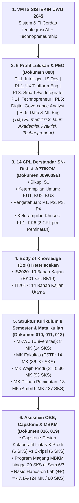

# 020 — ANALISIS KOMPREHENSIF KESELARASAN KURIKULUM OBE SISTEKIN 2026

**Tanggal:** 17 Agustus 2026  
**Status:** DOKUMEN RUJUKAN KESELARASAN & GROUND TRUTH AGENTIC AI  
**Dasar Analisis:** Penelusuran Dokumen 006 s.d. 019 + Standar Kurikulum OBE APTIKOM (SI v2.0 & TI 2023) + Permendikbudristek No. 53 Tahun 2023 + Visi Keilmuan FSTI UWG 2045  
**Tujuan:** Membangun memori kerja dan basis pemahaman yang sadar konteks (*context-aware alignment*) bagi seluruh agen AI dan pengembang kurikulum multi-peran.

---

## 1. PETA ARSITEKTUR KESELARASAN VERTIKAL & HORISONTAL (*CONSTRUCTIVE ALIGNMENT*)

---

## 2. MATRIKS KESELARASAN BERJENJANG (TIER 1 s.d. TIER 6)

### Tier 1: VMTS 2045 ↔ Profil Lulusan & PEO (Dokumen 006 & 008)
* **Visi 2045:** *"Menjadi Program Studi Sistem dan Teknologi Informasi yang bermutu, mandiri, bermartabat, dan berwawasan global, serta unggul dalam pengembangan sistem dan teknologi informasi cerdas terintegrasi kecerdasan artifisial, serta technopreneurship berbasis kebutuhan masyarakat dan industri pada tahun 2045."*
* **Distinctive Positioning vs Sister Prodi di FSTI UWG:**
  * **Teknik Informatika:** Riset algoritma dan fondasi komputasi AI murni (NLP core, Computer Vision deep research, neural network math).
  * **SISTEKIN:** **Integrasi AI ke Sistem Informasi dan Platform Nyata** (*AI Integration Specialist, System Architecture, IoT & Cloud-native Smart Services*).
  * **Bisnis Digital:** Pemasaran digital, tata kelola model bisnis, dan customer acquisition.

* **6 Profil Lulusan (PL) dan 3 Jalur Capaian Karier 3–5 Tahun (PEO):**
  1. **PL-01 (Intelligent IS Developer):** Pengembang sistem informasi cerdas berbasis AI/ML.
  2. **PL-02 (UI/UX Designer & Digital Platform Engineer):** Perancang pengalaman pengguna dan perekayasa platform digital skalabel.
  3. **PL-03 (Smart System & Technology Integrator):** Arsitek integrasi sistem cloud, IoT, dan otomasi cerdas.
  4. **PL-04 (Technopreneur in Smart Information Services):** Pendiri/pengembang produk startup teknologi informasi cerdas.
  5. **PL-05 (Digital System & Technology Governance Analyst):** Analis tata kelola, audit kepatuhan, dan manajemen risiko siber/TI.
  6. **PL-06 (Data Analyst & Machine Learning Engineer):** Praktisi pengolahan data analitik, pipeline MLOps, dan business intelligence.

---

### Tier 2: Profil Lulusan ↔ 14 Capaian Pembelajaran Lulusan (CPL)

| Kategori | Kode | Rumusan Ringkas CPL | Pemetaan PL Utama |
|---|---|---|---|
| **Sikap (S)** | **S1** | Integritas, norma etika digital, kerja sama tim multidisiplin, dan tanggung jawab profesional mandiri. | Semua PL (PL01–PL06) |
| **Keterampilan Umum (KU)** | **KU1** | Pemikiran logis, kritis, sistematis, dan inovatif dalam analisis komputasi kompleks. | Semua PL (PL01–PL06) |
| | **KU2** | Komunikasi efektif lisan/tulisan teknis serta jejaring profesional global. | Semua PL (PL01–PL06) |
| | **KU3** | Pengambilan keputusan berbasis data, evaluasi diri, dan pembelajaran mandiri sepanjang hayat (*lifelong learning*). | Semua PL (PL01–PL06) |
| **Pengetahuan (P)** | **P1** | Sains dasar & matematika komputasi (Kalkulus, Probstat, Aljabar Linear, Matematika Diskrit, Logika). | Fondasi Seluruh PL |
| | **P2** | Konsep, metodologi pemodelan, perancangan, dan arsitektur Sistem Informasi cerdas. | PL01, PL02, PL04, PL06 |
| | **P3** | Infrastruktur jaringan, cloud computing, keamanan siber, dan tata kelola TI (GRC/ITIL). | PL03, PL05 |
| | **P4** | Rekayasa data, pemrograman web modern, aplikasi mobile, dan prinsip UI/UX design. | PL01, PL02, PL04, PL06 |
| **Keterampilan Khusus (KK)** | **KK1** | Menganalisis, merancang, dan mengintegrasikan model AI/ML, NLP RAG, & Intelligent Agents ke dalam sistem bisnis (*Peminatan P1*). | PL01, PL06 |
| | **KK2** | Mengelola pipeline data, MLOps, Business Intelligence, dan visualisasi data analitik (*Peminatan P1*). | PL01, PL06 |
| | **KK3** | Mengonfigurasi dan mengamankan infrastruktur cloud, DevOps CI/CD, dan mitigasi ancaman siber (*Peminatan P2*). | PL03, PL05 |
| | **KK4** | Menerapkan tata kelola TI berbasis COBIT/ITIL, audit sistem informasi, dan manajemen risiko teknologi (*Peminatan P2*). | PL03, PL05 |
| | **KK5** | Merancang UI/UX interaktif berbasis data dan membangun platform digital skalabel microservices/SaaS (*Peminatan P3*). | PL02, PL04 |
| | **KK6** | Mengembangkan dan memvalidasi model produk startup digital (MVP, Lean Startup, Business Model) (*Peminatan P3*). | PL02, PL04 |

---

### Tier 3: Pemetaan CPL ↔ Body of Knowledge (BoK)
* **BoK IS2020 (APTIKOM SI v2.0):** 19 Bahan Kajian (BK01 Foundation, BK02 Data/Info, BK03 IT Infra, BK04 IS Mgmt, BK05 Systems Dev, BK06 Business, BK07 Security, BK08 Smart Systems, BK09 E-Commerce, BK10 Math/Stats, BK11 Emerging Tech, BK12 Security & Privacy, BK13 Intelligent Systems, BK14 UX, BK15 Project Mgmt, BK16 Enterprise Arch, BK17 Digital Innovation, BK18 Data Analytics, BK19 Ethics).
* **BoK IT2017 (APTIKOM TI 2023):** 14 Bahan Kajian (Information Management, Integrated Systems Technology, Networking, Platform Technologies, Security, Software Fundamentals, Cloud Architecture, dll).

---

### Tier 4: Struktur Kurikulum, Distribusi Semester & Pembagian SKS

#### A. Rekonsiliasi Beban SKS: Kelulusan vs Penawaran Portofolio
* **Standar Beban Kelulusan Mahasiswa (Graduation Requirement):** **Tepat 144 SKS** (Permendikbudristek No. 53 Tahun 2023 & APTIKOM SI/TI).
* **Total Portofolio Kurikulum yang Disediakan Program Studi:** **170 SKS (61 MK)**
  * MKWU (Universitas): 8 MK (14 SKS)
  * MK Fakultas (FSTI): 14 MK (36–37 SKS)
  * MK Wajib Prodi (STI): 30 MK (93 SKS)
  * MK Pilihan Peminatan: 18 MK (55 SKS disediakan — mahasiswa mengambil 9 MK / 27 SKS).

#### B. 3 Peminatan Unggulan (Mulai Semester 5)
1. **P1: Integrated Smart Systems (Flagship — 5 MK / 15 SKS):** DSS, Computational Methods, Intelligent Agents, MLOps & AI Pipeline, Knowledge Graph.
2. **P2: Cloud Infrastructure & Cybersecurity (Volume — 6 MK / 19 SKS):** Network Security & Forensics, Cloud Architecture & DevOps, Cybersecurity Risk, IT Governance (COBIT 2019), IT Service Management (ITIL 4), Enterprise Architecture (TOGAF).
3. **P3: Digital Platform Engineering (Niche — 7 MK / 21 SKS):** Advanced UX Research, EdTech Platform, FinTech Platform, Immersive XR/VR, SaaS Engineering, Agile Scrum Product, Technology Leadership/CTO Simulation.

#### C. Keseimbangan Teori vs Praktikum (+P)
* **MK Praktikum / Hands-on Lab (+P):** 24 MK (80 SKS = **47.1%**).
* **MK Teori / Konseptual:** 37 MK (90 SKS = **52.9%**).

---

### Tier 5: Logika Prasyarat Kritis & Perbaikan Alur (*Flow Prerequisites*)
1. **Jaringan Komputer (`STI-307`, Sem 3, +P):** Wajib lulus sebelum mengambil *Internet of Things (`STI-504`)*, *SI Berbasis Cloud (`STI-404`)*, dan *Keamanan Informasi Dasar (`STI-405`)*.
2. **Pemrograman Web Berjenjang:** *Web Front End (`STI-306`, Sem 3)* → *Web Back End (`STI-407`, Sem 4)* → *Pemrograman Mobile (`STI-505`, Sem 5)* & *Integrasi Layanan Cerdas AI (`STI-601`, Sem 6)*.
3. **Penyelarasan AI:** *Pengantar AI & Data (`FST-204`, Sem 2)* → *Sistem Cerdas (`STI-302`, Sem 3)* → *Machine Learning (`STI-401`, Sem 4)* → *Deep Learning (`STI-501`, Sem 5)* → *Conversational AI (`STI-701`, Sem 7)*.

---

### Tier 6: Tugas Akhir, Capstone Design & Fleksibilitas MBKM (Permendikbud 53/2023)
1. **Pilihan Jalur Penyelesaian Akhir Single-Track:**
   * **Jalur Default (Utama):** *Capstone Design Project lintas-3-prodi FSTI* (6 SKS) — fokus produk kolaboratif nyata.
   * **Jalur Alternatif:** *Skripsi / Riset Terapan* (6 SKS) — bagi mahasiswa yang berorientasi studi lanjut (S2/S3).
2. **Program MBKM (Semester 6 & 7):**
   * Diakui ekuivalensi hingga **20 SKS** yang dikonversikan ke paket MK Peminatan dan PKL.

---

## 3. CHECKLIST KESIAPAN DOKUMEN DILANJUTKAN KE TAHAP ASESMEN OBE

| No | Komponen Kurikulum OBE | Status Kesiapan | Langkah Tindak Lanjut |
|---|---|---|---|
| 1 | VMTS & Profil Lulusan (006, 008) | ✅ **Selesai & Final** | Siap untuk Buku Kurikulum Bab 1 & 2 |
| 2 | Rumusan 14 CPL & BoK (009E) | ✅ **Selesai & Final** | Siap untuk Buku Kurikulum Bab 3 |
| 3 | Struktur Matriks CPL ↔ MK (011, 012) | ✅ **Selesai & Final** | Siap untuk Buku Kurikulum Bab 4 |
| 4 | Matriks Bahan Kajian (BoK) ↔ MK (Tabel 6 APTIKOM) | ⚠️ *Drafting Diperlukan* | Disusun pada fase berikutnya |
| 5 | Rumusan CPMK & Sub-CPMK per MK (Bloom/ABCD) | ⚠️ *Fase Kerja Berikutnya* | Produksi RPS 44 MK Wajib |
| 6 | Rubrik Asesmen (Holistik/Analitik/Portofolio) | ⚠️ *Fase Kerja Berikutnya* | Penyusunan rubrik evaluasi Capstone & PjBL |

---

*Dokumen ini menjadi rujukan resmi bagi seluruh Agentic AI yang mengevaluasi, memvalidasi, atau merancang instrumen kurikulum Program Studi SISTEKIN UWG 2026.*
