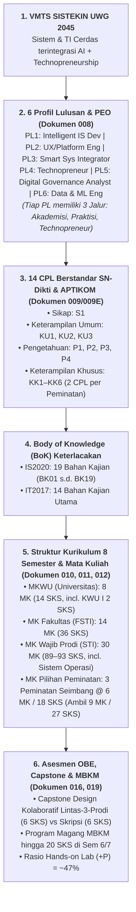

# 020 — ANALISIS KOMPREHENSIF KESELARASAN KURIKULUM OBE SISTEKIN 2026

**Tanggal:** 17 Agustus 2026 (Updated: Keputusan Penyeimbangan 3 Peminatan & Batas 20 SKS Sem 2)  
**Status:** DOKUMEN RUJUKAN KESELARASAN AKTIF & GROUND TRUTH AGENTIC AI (VERSI TERKINI)  
**Dasar Analisis:** Penelusuran Dokumen 006 s.d. 019 + Standar Kurikulum OBE APTIKOM (SI v2.0 & TI 2023) + Permendikbudristek No. 53 Tahun 2023 + Visi Keilmuan FSTI UWG 2045  
**Tujuan:** Membangun memori kerja dan basis pemahaman yang sadar konteks (*context-aware alignment*) bagi seluruh agen AI dan pengembang kurikulum multi-peran.

---

## 1. PETA ARSITEKTUR KESELARASAN VERTIKAL & HORISONTAL (*CONSTRUCTIVE ALIGNMENT*)



---

## 2. KEPUTUSAN KUNCI REVISI STRUKTUR KURIKULUM (17 AGUSTUS 2026)

| No | Keputusan Kunci | Rationale & Landasan Regulasi/OBE | Dampak Perubahan Struktur |
|---|---|---|---|
| 1 | **Semester 2 Tepat 20 SKS** | **Permendikbudristek No. 53/2023 Pasal 18** membatasi beban Sem 1 & 2 maksimal 20 SKS/semester. | `MKU-401 Kewarganegaraan` (2 SKS) dipindahkan dari Sem 2 ke **Semester 4 (Genap)**; `FST-206 Etika dan Hukum Digital` (2 SKS) tetap di **Semester 2** bersamaan dengan Basis Data & AI. |
| 2 | **Penambahan Kembali MK Sistem Operasi** | **BoK IT2017 & IS2020 (BK03 IT Infrastructure)** mewajibkan pemahaman manajemen memori/proses & virtualisasi sebelum Cloud/DevOps. | `STI-305 Sistem Operasi` (3 SKS) ditempatkan di **Semester 3 (Ganjil)** bersama Jaringan Komputer. |
| 3 | **Conversational AI & Smart Surveillance Menjadi MK Pilihan P1** | Menghindari beban spesialisasi AI terlalu tinggi bagi mahasiswa jalur Cloud/Platform; memperkuat daya tarik peminatan AI. | `Conversational AI & Intelligent Assistant` (3 SKS, +P) dan `Smart Surveillance & IoT Analytics` (3 SKS, +P) menjadi **MK Pilihan Peminatan P1**. |
| 4 | **3 Peminatan Seimbang (@ 6 MK / 18 SKS)** | Menciptakan keadilan beban akademik antar-jalur dan kemudahan penjadwalan administrasi FSTI. | P1, P2, P3 masing-masing memiliki portofolio **6 MK Pilihan (18 SKS)**. Mahasiswa mengambil 9 MK (27 SKS) di Sem 5–7. |
| 5 | **Kewirausahaan I Tetap 2 SKS** | Memperkuat pilar VMTS *Technopreneurship* sejak tingkat awal (Sem 2). | `MKU-202 Kewirausahaan I` (2 SKS, Sem 2) + `MKU-402 Kewirausahaan II` (0 SKS, Sem 4). |

---

## 3. KOMPOSISI 3 PEMINATAN SEIMBANG (MASING-MASING 6 MK / 18 SKS)

```
┌────────────────────────────────────────────────────────────────────────────────────────┐
│                   3 PEMINATAN SISTEKIN 2026 (SEIMBANG: @ 6 MK / 18 SKS)                │
├────────────────────────────┬────────────────────────────┬──────────────────────────────┤
│  P1: INTEGRATED SMART      │  P2: CLOUD INFRASTRUCTURE  │  P3: DIGITAL PLATFORM        │
│      SYSTEMS (Flagship)    │      & CYBERSECURITY       │      ENGINEERING (Niche)     │
├────────────────────────────┼────────────────────────────┼──────────────────────────────┤
│ 1. Decision Support Sys    │ 1. Network Security &      │ 1. Advanced UX Research      │
│    (STA-01, 3 SKS, +P)     │    Digital Forensics       │    & Design (STC-01, 3 SKS)  │
│ 2. Computational Methods   │    (STB-01, 3 SKS, +P)     │ 2. FinTech Platform          │
│    & Numerics (STA-02, 3)  │ 2. Cloud Architecture &    │    Development (STC-02, 3)   │
│ 3. Intelligent Agent Sys   │    DevOps (STB-02, 3, +P)  │ 3. EdTech Platform           │
│    (STA-03, 3 SKS, +P)     │ 3. Cybersecurity Risk      │    Development (STC-03, 3)   │
│ 4. MLOps & AI Pipeline     │    Management (STB-03, 3)  │ 4. Immersive XR/AR/VR        │
│    (STA-04, 3 SKS, +P)     │ 4. IT Governance & COBIT   │    Development (STC-04, 3)   │
│ 5. Conversational AI &     │    2019 (STB-04, 3 SKS)    │ 5. SaaS Architecture &       │
│    Intelligent Assistant   │ 5. IT Service Management   │    Cloud Native (STC-05, 3)  │
│    (STA-05, 3 SKS, +P) ★   │    (ITIL 4) (STB-05, 3 SKS)│ 6. Agile Scrum Product       │
│ 6. Smart Surveillance &    │ 6. Enterprise Architecture │    Management & CTO Sim      │
│    IoT Analytics           │    (TOGAF) (STB-06, 3 SKS) │    (STC-06, 3 SKS)           │
│    (STA-06, 3 SKS, +P) ★   │                            │                              │
```

### 3.1 Boundary Keilmuan & Fokus Silabus MK Peminatan P3 (EdTech & FinTech Platform)

Untuk menjaga *distinctive positioning* SISTEKIN (FSTI) vs Bisnis Digital (FEB), ditetapkan batasan teknis yang tegas:
* **`STC-02: EdTech Platform Development` (3 SKS, +P):**
  * **Bukan:** Model bisnis bimbingan belajar/kursus digital.
  * **Fokus Keilmuan SISTEKIN:** Rekayasa arsitektur *Learning Management System (LMS)*, standar interoperabilitas konten (*SCORM, LTI, xAPI*), *gamification engine*, sistem kuis adaptif berbasis data, dan integrasi *Learning Analytics API*.
* **`STC-03: FinTech Platform Development` (3 SKS, +P):**
  * **Bukan:** Pemasaran produk perbankan atau analisis pasar modal.
  * **Fokus Keilmuan SISTEKIN:** Arsitektur integrasi *Payment Gateway* (Midtrans/Xendit/Stripe), *double-entry transaction ledger & idempotency*, keamanan transaksi (*PCI-DSS, tokenization, JWT, webhook security*), serta pengantar *Decentralized Finance & Smart Contract Ledger*.
* **Keterlacakan CPL & BoK:** Mendukung **CPL KK5** (Platform Skalabel) & **KK6** (Inovasi Startup) serta BoK IS2020 (BK07, BK09, BK17) dan BoK IT2017 (*Platform Technologies*).
* **Prasyarat Wajib:** `STI-306 Web Front End` (Sem 3) + `STI-407 Web Back End` (Sem 4) + `FST-207 Basis Data` (Sem 2).

### 3.2 [OPEN ISSUE] Portofolio Peminatan P3 — Audit Redundansi Sedang Dikaji

> ⚠️ **PENDING DECISION — Jangan kunci perubahan 011 terkait P3 sebelum ada keputusan.**
> Detail analisis dan 3 skenario keputusan tersimpan di **[018] Section 7.11**.

Temuan: `STC-02 EdTech` dan `STC-03 FinTech` memiliki ~70% tumpang tindih substansi teknis satu sama lain dan dengan `STI-701 Digital Platform Engineering` (MK Wajib Sem 7). Seluruh slot P3 sedang dievaluasi untuk memastikan diversifikasi BoK IS2020 yang optimal, khususnya penutupan **gap BK15 Business Process Management** yang masih kosong di seluruh kurikulum.

---

## 4. DISTRIBUSI SEMESTER TERVALIDASI (BEBAN KELULUSAN 144 SKS)

| Semester | MK Wajib (FSTI & STI) | MKWU (Universitas) | MK Pilihan Peminatan | Total SKS | Kepatuhan Regulasi & Pedagogi |
|---|---|---|---|:---:|---|
| **Sem 1** | Algoritma (+P, 3), Kalkulus (3), Logika (3), Pengantar STI (2), Dasar Digital (2) | Agama I (2), Pancasila (2), B. Indonesia (2) | — | **19 SKS** | ✅ Patuh Permendikbud 53 ($\le 20$ SKS) |
| **Sem 2** | Diskrit (3), Aljabar Linear (3), Struktur Data (+P, 3), Pengantar AI (2), Basis Data (+P, 3), Basic English (2), **Etika & Hukum Digital (2)** | Kewirausahaan I (2) | — | **20 SKS** | ✅ **Tepat 20 SKS** (Kewarganegaraan pindah Sem 4) |
| **Sem 3** | APSI (3), Sistem Cerdas (2), UI/UX (+P, 3), RPL (3), Jaringan (+P, 3), Web Front End (+P, 3), **Sistem Operasi (3)** | — | — | **20 SKS** | ✅ Fondasi Sistem & Jaringan Lengkap |
| **Sem 4** | Machine Learning (+P, 3), Web Back End (+P, 3), Cloud (3), Keamanan Dasar (3), Manpro TI (3), Probstat (3), English for IT (2) | **Kewarganegaraan (2)**, Agama II (0), Kewirausahaan II (0) | — | **19 SKS** | ✅ Core Data/AI & Cloud + MK Karakter |
| **Sem 5** | Deep Learning (+P, 3), DW-BI (+P, 3), Data Mining (+P, 3), IoT (+P, 3), Mobile (+P, 3) | — | 2 MK Pilihan Peminatan (6 SKS) | **21 SKS** | ✅ Advanced Core + Spesialisasi Awal |
| **Sem 6** | Integrasi AI (+P, 3), Smart City (+P, 3), Capstone Project FSTI (+P, 3), Keamanan Lanjut (3), Metpen (2) | — | 2 MK Pilihan Peminatan (6 SKS) / MBKM | **20 SKS** | ✅ Integrasi Sistem, Capstone & MBKM |
| **Sem 7** | Digital Platform Eng (+P, 3), Startup Digital (+P, 3), PKL (+P, 3) | — | 4 MK Pilihan Peminatan (12 SKS) / MBKM | **21 SKS** | ✅ Profesionalisasi & Inkubasi Produk |
| **Sem 8** | Pra-Skripsi / Seminar (2), Skripsi / Capstone TA (6) | KPM / KKN (3) | — | **11 SKS** | ✅ Single Track Penyelesaian Akhir |

---

## 5. CHECKLIST KESIAPAN DOKUMEN UNTUK AGENTIC AI BERIKUTNYA

* [x] Keselarasan VMTS 2045 $\leftrightarrow$ 6 Profil Lulusan (PEO 3 Jalur)
* [x] Keselarasan 14 CPL $\leftrightarrow$ 19 BoK IS2020 & 14 BoK IT2017
* [x] Penyeimbangan 3 Peminatan (@ 6 MK / 18 SKS)
* [x] Kepatuhan Beban Semester 1 & 2 ($\le 20$ SKS)
* [ ] **[OPEN] Restrukturisasi Portofolio P3** — 3 skenario dikaji (lihat [018] §7.11). Keputusan menentukan apakah BK15 ditutup dengan MK baru.
* [ ] **Langkah Kerja Berikutnya:** Penyusunan Matriks BoK $\leftrightarrow$ MK (Tabel 6 Standar APTIKOM) & Penyusunan CPMK RPS 44 MK Wajib.

---

*Dokumen ini menjadi rujukan resmi aktif (Single Source of Truth) bagi seluruh agen AI pengembang kurikulum SISTEKIN UWG 2026.*
