# 020 — ANALISIS KOMPREHENSIF KESELARASAN KURIKULUM OBE SISTEKIN 2026

**Tanggal:** 17 Agustus 2026 (Updated: Keputusan Penyeimbangan 3 Peminatan & Batas 20 SKS Sem 2)  
**Status:** DOKUMEN RUJUKAN KESELARASAN AKTIF & GROUND TRUTH AGENTIC AI (VERSI TERKINI)  
**Dasar Analisis:** Penelusuran Dokumen 006 s.d. 019 + Standar Kurikulum OBE APTIKOM (SI v2.0 & TI 2023) + Permendikbudristek No. 53 Tahun 2023 + Visi Keilmuan FSTI UWG 2045  
**Tujuan:** Membangun memori kerja dan basis pemahaman yang sadar konteks (*context-aware alignment*) bagi seluruh agen AI dan pengembang kurikulum multi-peran.

---

## 1. PETA ARSITEKTUR KESELARASAN VERTIKAL & HORISONTAL (*CONSTRUCTIVE ALIGNMENT*)

```mermaid
graph TD
    VMTS["<b>1. VMTS SISTEKIN UWG 2045</b><br/>Sistem & TI Cerdas terintegrasi AI + Technopreneurship"]
    --> PL["<b>2. 6 Profil Lulusan & PEO (Dokumen 008)</b><br/>PL1: Intelligent IS Dev | PL2: UX/Platform Eng | PL3: Smart Sys Integrator<br/>PL4: Technopreneur | PL5: Digital Governance Analyst | PL6: Data & ML Eng<br/><i>(Tiap PL memiliki 3 Jalur: Akademisi, Praktisi, Technopreneur)</i>"]
    
    PL --> CPL["<b>3. 14 CPL Berstandar SN-Dikti & APTIKOM (Dokumen 009/009E)</b><br/>• Sikap: S1<br/>• Keterampilan Umum: KU1, KU2, KU3<br/>• Pengetahuan: P1, P2, P3, P4<br/>• Keterampilan Khusus: KK1–KK6 (2 CPL per Peminatan)"]
    
    CPL --> BOK["<b>4. Body of Knowledge (BoK) Keterlacakan</b><br/>• IS2020: 19 Bahan Kajian (BK01 s.d. BK19)<br/>• IT2017: 14 Bahan Kajian Utama"]
    
    BOK --> STRUKTUR["<b>5. Struktur Kurikulum 8 Semester & Mata Kuliah (Dokumen 010, 011, 012, 031)</b><br/>• MKWU (Universitas): 8 MK (13 SKS, incl. KPM di Sem 5)<br/>• MK Fakultas (FSTI): 14 MK (38 SKS, incl. Capstone di Sem 7)<br/>• MK Wajib Prodi (STI): 27 MK (79 SKS, incl. Platform Eng di Sem 6)<br/>• MK Pilihan Peminatan: 3 Peminatan Seimbang @ 6 MK / 18 SKS (Ambil 6 MK / 18 SKS)<br/>• Grand Total Portofolio: 67 MK / 184 SKS | Beban Paket Ditempuh: 55 MK / 148 SKS (Syarat Lulus ≥144 SKS)"]
    
    STRUKTUR --> ASSESS["<b>6. Asesmen OBE, Capstone & MBKM (Dokumen 016, 019)</b><br/>• Capstone Design Kolaboratif Lintas-3-Prodi (6 SKS) vs Skripsi (6 SKS)<br/>• Program Magang MBKM hingga 20 SKS di Sem 6/7<br/>• Rasio Hands-on Lab (+P) Wajib = 42,9% (66 dari 154 SKS; ditambah 9–24 SKS MK pilihan +P)"]
```



---

## 2. KEPUTUSAN KUNCI REVISI STRUKTUR KURIKULUM (17 AGUSTUS 2026)

| No | Keputusan Kunci | Rationale & Landasan Regulasi/OBE | Dampak Perubahan Struktur |
|---|---|---|---|
| 1 | **Semester 2 Tepat 20 SKS** | **Permendikbudristek No. 53/2023 Pasal 18** membatasi beban Sem 1 & 2 maksimal 20 SKS/semester. | `MKU-401 Kewarganegaraan` (2 SKS) dipindahkan dari Sem 2 ke **Semester 4 (Genap)**; `FST-206 Etika dan Hukum Digital` (2 SKS) tetap di **Semester 2** bersamaan dengan Basis Data & AI. |
| 2 | **Penambahan Kembali MK Sistem Operasi** | **BoK IT2017 & IS2020 (BK03 IT Infrastructure)** mewajibkan pemahaman manajemen memori/proses & virtualisasi sebelum Cloud/DevOps. | `STI-305 Sistem Operasi` (3 SKS) ditempatkan di **Semester 3 (Ganjil)** bersama Jaringan Komputer. |
| 3 | **Conversational AI & Smart Surveillance Menjadi MK Pilihan P1** | Menghindari beban spesialisasi AI terlalu tinggi bagi mahasiswa jalur Cloud/Platform; memperkuat daya tarik peminatan AI. | `Conversational AI & Intelligent Assistant` (3 SKS, +P) dan `Smart Surveillance & IoT Analytics` (3 SKS, +P) menjadi **MK Pilihan Peminatan P1**. |
| 4 | **3 Peminatan Seimbang (@ 6 MK / 18 SKS)** | Menciptakan keadilan beban akademik antar-jalur dan kemudahan penjadwalan administrasi FSTI. | P1, P2, P3 masing-masing memiliki portofolio **6 MK Pilihan (18 SKS)**. Mahasiswa mengambil **8 MK (24 SKS)** di Sem 5–7 (Rekonsiliasi 19/08/2026: 2 slot Sem 5 + 2 slot Sem 6 + 4 slot Sem 7). |
| 5 | **Kewirausahaan I Tetap 2 SKS** | Memperkuat pilar VMTS *Technopreneurship* sejak tingkat awal (Sem 2). | `MKU-202 Kewirausahaan I` (2 SKS, Sem 2) + `MKU-402 Kewirausahaan II` (0 SKS, Sem 4). |

---

## 3. KOMPOSISI 3 PEMINATAN SEIMBANG (MASING-MASING 6 MK / 18 SKS)

```
┌────────────────────────────────────────────────────────────────────────────────────────┐
│                   3 PEMINATAN SISTEKIN 2026 (SEIMBANG: @ 6 MK / 18 SKS)                │
├────────────────────────────┬────────────────────────────┬──────────────────────────────┤
│  P1: INTEGRATED SMART      │  P2: CLOUD INFRASTRUCTURE  │  P3: DIGITAL PLATFORM        │
│      SYSTEMS (Flagship)    │      & CYBERSECURITY       │      ENGINEERING (Niche)     │
├────────────────────────────┼────────────────────────────┼──────────────────────────────┤
│ 1. Decision Support Sys    │ 1. Network Security &      │ 1. Advanced UX Research      │
│    (STA-01, 3 SKS, +P)     │    Digital Forensics       │    & Design (STC-01, 3 SKS)  │
│ 2. Computational Methods   │    (STB-01, 3 SKS, +P)     │ 2. FinTech Platform          │
│    & Numerics (STA-02, 3)  │ 2. Cloud Architecture &    │    Development (STC-02, 3)   │
│ 3. Intelligent Agent Sys   │    DevOps (STB-02, 3, +P)  │ 3. EdTech Platform           │
│    (STA-03, 3 SKS, +P)     │ 3. Cybersecurity Risk      │    Development (STC-03, 3)   │
│ 4. MLOps & AI Pipeline     │    Management (STB-03, 3)  │ 4. Immersive XR/AR/VR        │
│    (STA-04, 3 SKS, +P)     │ 4. IT Governance & COBIT   │    Development (STC-04, 3)   │
│ 5. Conversational AI &     │    2019 (STB-04, 3 SKS)    │ 5. SaaS Architecture &       │
│    Intelligent Assistant   │ 5. IT Service Management   │    Cloud Native (STC-05, 3)  │
│    (STA-05, 3 SKS, +P) ★   │    (ITIL 4) (STB-05, 3 SKS)│ 6. Agile Scrum Product       │
```
┌────────────────────────────┬────────────────────────────┬────────────────────────────┐
│ P1: Integrated Smart Sys   │ P2: Cloud Infra & Security │ P3: Digital Platform Eng   │
│ (STA-, 6 MK / 18 SKS)      │ (STB-, 6 MK / 18 SKS)      │ (STC-, 6 MK / 18 SKS)      │
├────────────────────────────┼────────────────────────────┼────────────────────────────┤
│ 1. Decision Support Sys    │ 1. Network Sec & Forensics │ 1. UX Research & Design    │
│    (STA-01, 3 SKS)         │    (STB-01, 3 SKS, +P)     │    (STC-01, 3 SKS, +P)     │
│ 2. Computational Methods   │ 2. Cloud Arch & DevOps     │ 2. Rekayasa & Otomasi      │
│    (STA-02, 3 SKS)         │    (STB-02, 3 SKS, +P)     │    Proses Bisnis (STC-02)★ │
│ 3. Intelligent Agent Sys   │ 3. Cyber Risk Management   │ 3. Rekayasa Aplikasi       │
│    (STA-03, 3 SKS)         │    (STB-03, 3 SKS)         │    Vertikal (STC-03, +P)   │
│ 4. MLOps & AI Pipeline     │ 4. IT Governance (COBIT)   │ 4. Immersive Media & XR    │
│    (STA-04, 3 SKS, +P)     │    (STB-04, 3 SKS)         │    (STC-04, 3 SKS, +P)     │
│ 5. Conversational AI ★     │ 5. IT Service Mgmt (ITIL)  │ 5. SaaS Architecture &     │
│    (STA-05, 3 SKS, +P)     │    (STB-05, 3 SKS)         │    Multi-Tenancy (STC-05)  │
│ 6. Smart Surveillance &    │ 6. Enterprise Architecture │ 6. Digital Product Mgmt &  │
│    IoT Analytics           │    (TOGAF) (STB-06, 3 SKS) │    Agile (STC-06, 3 SKS)   │
│    (STA-06, 3 SKS, +P) ★   │                            │                            │
└────────────────────────────┴────────────────────────────┴────────────────────────────┘
```

### 3.1 Struktur Portofolio Peminatan P3 (Digital Platform Engineering) — FINAL

Telah ditetapkan restrukturisasi Peminatan P3 untuk memastikan keunggulan level S1 Akademik-Rekayasa (KKNI Level 6) serta menutup gap BoK nasional:
* **`STC-02: Rekayasa & Otomasi Proses Bisnis` (3 SKS, +P):**
  * **Fokus Level S1:** Pemodelan formal alur proses bisnis enterprise (*BPMN 2.0 / Petri Nets*), *Process Mining*, optimasi metrik *throughput*, dan rekayasa orkestrasi alur kerja terdistribusi (*workflow orchestration engine* & integrasi API).
  * **Cakupan BoK:** **Menutup 100% Gap Kritis `SI-BK15` (Business Process Management)** dan `TI-BK04` (Sistem Terintegrasi).
* **`STC-03: Rekayasa Aplikasi Industri Vertikal` (3 SKS, +P):**
  * **Konsolidasi FinTech & EdTech:** Menggabungkan studi kasus rekayasa *payment gateway, SCORM LMS, ledger idempotency* ke dalam 1 MK terpadu untuk mengeliminasi redundansi coding.
* **`STC-05: SaaS Architecture & Multi-Tenancy` (3 SKS, +P):**
  * **Fokus Khusus Produk SaaS:** *Multi-tenant database isolation, subscription billing engine, micro-frontend*.

---

## 4. DISTRIBUSI SEMESTER TERVALIDASI (PAKET DITEMPUH 148 SKS — SYARAT LULUS MINIMAL 144 SKS PERMENDIKBUDRISTEK 53/2023)

| Semester | MK Wajib (FSTI & STI) | MKWU (Universitas) | MK Pilihan Peminatan | Total SKS | Kepatuhan Regulasi & Pedagogi |
|---|---|---|---|:---:|---|
| **Sem 1** | Algoritma (+P, 3), Kalkulus (3), Logika (3), Pengantar STI (2), Dasar Digital (2) | Agama I (2), Pancasila (2), B. Indonesia (2) | — | **19 SKS** | ✅ Patuh Permendikbud 53 ($\le 20$ SKS) |
| **Sem 2** | Diskrit (3), Aljabar Linear (3), Struktur Data (+P, 3), Pengantar AI (2), Basis Data (+P, 3), Basic English (2), **Etika & Hukum Digital (2)** | Kewirausahaan I (2) | — | **20 SKS** | ✅ **Tepat 20 SKS** (Kewarganegaraan pindah Sem 4) |
| **Sem 3** | APSI (3), Sistem Cerdas (2), UI/UX (+P, 3), RPL (3), Jaringan (+P, 3), Web Front End (+P, 3), **Sistem Operasi (3)** | — | — | **20 SKS** | ✅ Fondasi Sistem & Jaringan Lengkap |
| **Sem 4** | Machine Learning (+P, 3), **Data Warehouse & BI (+P, 3)**, Web Back End (+P, 3), Cloud (3), Keamanan Dasar (3), Probstat (3), English for IT (2) | **Kewarganegaraan (2)**, Agama II (0), Kewirausahaan II (0) | — | **22 SKS** | ✅ Core Data & Cloud (3 MK Lab Seimbang, 8 MK ber-SKS + 2 MK @ 0 SKS) |
| **Sem 5** | Deep Learning (+P, 3), Data Mining (+P, 3), IoT (+P, 3), Mobile (+P, 3), **Manajemen Proyek TI (3)** | **KPM / KKN Digital (3)** | 1 MK Pilihan Peminatan (3 SKS) | **21 SKS** | ✅ **KPM di Sem 5** (6 MK Wajib 18 SKS + 1 MK Pilihan 3 SKS) |
| **Sem 6** | Integrasi AI (+P, 3), Smart City (+P, 3), Keamanan Lanjut (3), **Digital Platform Eng (+P, 3)**, Metpen (2) | — | 2 MK Pilihan Peminatan (6 SKS) / MBKM | **20 SKS** | ✅ **Platform Eng di Sem 6** (5 MK Wajib 14 SKS + 2 MK Pilihan 6 SKS) |
| **Sem 7** | **Inovasi Startup (+P, 3)**, **Capstone Project FSTI (+P, 3)**, **PKL (+P, 3)**, **Pra-Skripsi (2)** | — | 3 MK Pilihan Peminatan (9 SKS) / MBKM | **20 SKS** | ✅ **Puncak Rekayasa & Sempro** (4 MK Wajib 11 SKS + 3 MK Pilihan 9 SKS) |
| **Sem 8** | **Skripsi / Tugas Akhir (6 SKS)** | — | — | **6 SKS** | ✅ **Single Track Skripsi Murni** (Fokus Penuh Kelulusan Tepat Waktu) |

---

## 5. CHECKLIST KESIAPAN DOKUMEN UNTUK AGENTIC AI BERIKUTNYA

* [x] Keselarasan VMTS 2045 $\leftrightarrow$ 6 Profil Lulusan (PEO 3 Jalur)
* [x] Keselarasan 14 CPL $\leftrightarrow$ 19 BoK IS2020 & 27 BoK IT2017 (Cakupan 100% — Gap `SI-BK15` Terisi)
* [x] Penyeimbangan 3 Peminatan (@ 6 MK / 18 SKS) — P1, P2, P3 Terstruktur Final
* [x] Kepatuhan Beban Semester 1 & 2 ($\le 20$ SKS)
* [x] **Restrukturisasi Portofolio P3 FINAL & TERKUNCI** — `STC-02 Rekayasa & Otomasi Proses Bisnis` resmi ditetapkan.
* [ ] **Langkah Kerja Berikutnya:** Penyusunan Matriks Detail BoK $\leftrightarrow$ MK (Tabel 6 Standar APTIKOM) & Penyusunan CPMK RPS 49 MK Wajib.

---

*Dokumen ini menjadi rujukan resmi aktif (Single Source of Truth) bagi seluruh agen AI pengembang kurikulum SISTEKIN UWG 2026, dengan rincian 55 MK master definitif terdokumentasi di Dokumen [032].*
