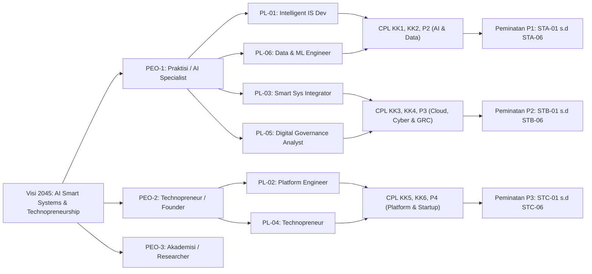

# 023 — FORMULASI MATRIKS OBE LENGKAP: LEVEL TAKSONOMI, BOK 2-DIMENSI, TRACEABILITY & ASESMEN CPL

**Tanggal:** 18 Agustus 2026  
**Peran:** Arsitek Kurikulum & Asesor LAM INFOKOM / IABEE  
**Sumber Rujukan:** Dokumen 006 s.d. 022 `KURIKULUM2026_ZCODE`  
**Fungsi Dokumen:** Dokumen master formulasi 4 Matriks OBE Tingkat Lanjut (*Advanced OBE Matrices*) yang menjadi syarat mutlak instrumen Akreditasi LAM INFOKOM (Kriteria 9) dan Standar Internasional IABEE/ABET.

---

## DAFTAR MATRIKS YANG DIFORMULASIKAN

1. **MATRIKS 1:** Matriks CPL $\leftrightarrow$ Mata Kuliah Berbasis Level Penguasaan (**I - R - M / Bloom Taxonomy Level C2–C6**)
2. **MATRIKS 2:** Matriks 2-Dimensi Bahan Kajian APTIKOM (**19 SI-BK & 27 TI-BK**) $\leftrightarrow$ Mata Kuliah (Tabel 6 Standar APTIKOM)
3. **MATRIKS 3:** Matriks Keterlacakan Komprehensif (*End-to-End Traceability Matrix*: **VMTS $\leftrightarrow$ PEO $\leftrightarrow$ PL $\leftrightarrow$ CPL $\leftrightarrow$ MK**)
4. **MATRIKS 4:** Matriks Rencana Asesmen Langsung CPL (*CPL Direct Assessment & Benchmark Mapping Matrix*)

---

# MATRIKS 1: MATRIKS CPL $\leftrightarrow$ MATA KULIAH BERBASIS LEVEL PENGUASAAN (I - R - M)

### Legenda Level Penguasaan (*Mastery Levels*):
* **I (Introduce / C2–C3):** Memperkenalkan konsep dasar, teori, dan pemahaman komputasi fundamental.
* **R (Reinforce / C3–C4):** Memperkuat, mengaplikasikan, dan menganalisis dalam bentuk praktikum, coding, atau studi kasus terarah.
* **M (Master / C5–C6):** Penguasaan mahir, sintesis, evaluasi kritis, perancangan arsitektur kompleks, dan proyek riil (*Capstone/Skripsi/PjBL*).

---

### 1.1 Semester 1 s.d. Semester 4 (Tahap Fondasi & Penguatan)

| Kode MK | Nama Mata Kuliah | SKS | +P | S1 | KU1 | KU2 | KU3 | P1 | P2 | P3 | P4 | KK1 | KK2 | KK3 | KK4 | KK5 | KK6 |
|---|---|:---:|:---:|:---:|:---:|:---:|:---:|:---:|:---:|:---:|:---:|:---:|:---:|:---:|:---:|:---:|:---:|
| **SEMESTER 1** | | | | | | | | | | | | | | | | | |
| FST-101 | Dasar Teknologi Digital | 2 | — | | | | | | I | | | | | | | | |
| FST-102 | Algoritma dan Pemrograman | 3 | ✅ | | I | | | | | | I | | | | | | |
| STI-101 | Pengantar Sistem & Teknologi Informasi | 2 | — | | | | | | I | | | | | | | | |
| STI-102 | Kalkulus | 3 | — | | | | | I | | | | | | | | | |
| STI-103 | Logika Informatika | 3 | — | | I | | | I | | | | | | | | | |
| MKU-101 | Agama I | 2 | — | I | | | | | | | | | | | | | |
| MKU-102 | Pancasila | 2 | — | I | | | | | | | | | | | | | |
| MKU-103 | Bahasa Indonesia | 2 | — | | | I | | | | | | | | | | | |
| **SEMESTER 2** | | | | | | | | | | | | | | | | | |
| STI-201 | Matematika Diskrit | 3 | — | | R | | | R | | | | | | | | | |
| STI-202 | Aljabar Linear | 3 | — | | | | | R | | | | | | | | | |
| FST-203 | Struktur Data & Algoritma | 3 | ✅ | | R | | | | | | R | | | | | | |
| FST-204 | Pengantar AI & Data | 2 | — | | | | | | | | | I | | | | | |
| FST-205 | Basic English | 2 | — | | | I | | | | | | | | | | | |
| FST-206 | Etika dan Hukum Digital | 2 | — | R | | R | | | | | | | | | | | |
| FST-207 | Basis Data | 3 | ✅ | | | | | | R | | R | | | | | | |
| MKU-202 | Kewirausahaan I | 2 | — | | | | | | | | | | | | | | I |
| **SEMESTER 3** | | | | | | | | | | | | | | | | | |
| STI-301 | Analisis & Perancangan SI (APSI) | 3 | — | | R | | | | R | | | | | | | R | |
| STI-302 | Sistem Cerdas | 2 | — | | | | | | R | | | R | | | | | |
| STI-303 | UI/UX Design & Prototyping | 3 | ✅ | | | | | | | | | | | | | R | |
| STI-304 | Rekayasa Perangkat Lunak (RPL) | 3 | — | | | | | | | | R | | | | | R | R |
| STI-305 | Sistem Operasi | 3 | — | | | | | | | R | | | | R | | | |
| STI-306 | Web Front End Development | 3 | ✅ | | | | | | | | R | | | | | R | |
| STI-307 | Jaringan Komputer | 3 | ✅ | | | | | | | R | | | | R | | | |
| **SEMESTER 4** | | | | | | | | | | | | | | | | | |
| STI-401 | Machine Learning | 3 | ✅ | | | | | | R | | | R | R | | | | |
| STI-402 | Data Warehouse & Business Intelligence | 3 | ✅ | | | | | | R | | | | R | | | | |
| STI-407 | Web Back End Development | 3 | ✅ | | R | | | | | | R | | | | | | |
| STI-404 | SI Berbasis Cloud | 3 | — | | | | | | | R | | | | R | | | |
| STI-405 | Keamanan Informasi Dasar | 2 | — | | | | | | | R | | | | R | | | |
| FST-408 | Statistika & Probabilitas | 3 | — | | | | | R | | | R | | | | | | |
| FST-409 | English for IT Professionals | 2 | — | | | R | | | | | | | | | | | |
| MKU-401 | Kewarganegaraan | 2 | — | R | | | | | | | | | | | | | |
| MKU-401A| Agama II *(0 SKS)* | 0 | — | R | | | | | | | | | | | | | |
| MKU-402 | Kewirausahaan II *(0 SKS)* | 0 | — | | | | | | | | | | | | | | R |

---

### 1.2 Semester 5 s.d. Semester 8 (Tahap Penguasaan Mahir, Sintesis & Capstone)

| Kode MK | Nama Mata Kuliah | SKS | +P | S1 | KU1 | KU2 | KU3 | P1 | P2 | P3 | P4 | KK1 | KK2 | KK3 | KK4 | KK5 | KK6 |
|---|---|:---:|:---:|:---:|:---:|:---:|:---:|:---:|:---:|:---:|:---:|:---:|:---:|:---:|:---:|:---:|:---:|
| **SEMESTER 5** | | | | | | | | | | | | | | | | | |
| STI-501 | Deep Learning & Neural Networks | 3 | ✅ | | | | | | | | | M | M | | | | |
| STI-503 | Data Mining & Visualization | 3 | ✅ | | | | | | M | | | | M | | | | |
| STI-504 | Internet of Things (IoT) | 3 | ✅ | | | | | | | M | | | | M | | | |
| STI-505 | Pemrograman Aplikasi Mobile | 3 | ✅ | | | | | | | | M | | | | | M | |
| STI-506 | Manajemen Proyek TI | 3 | — | | | | | | | | | | | | | | M |
| MKU-203 | KPM (KKN Digital) | 3 | ✅ | M | | M | | | | | | | | | | | |
| STA/B/C | MK Pilihan Peminatan 1 | 3 | 🔄 | | R | R | | | | | | R/M | R/M | R/M | R/M | R/M | R/M |
| **SEMESTER 6** | | | | | | | | | | | | | | | | | |
| STI-601 | Integrasi Layanan Cerdas Berbasis AI | 3 | ✅ | | | | | | M | | | M | | | | | |
| STI-602 | Smart City & Pemerintahan Digital | 2 | ✅ | | | | | | | M | | | | M | | | |
| STI-603 | Keamanan Informasi Lanjut | 3 | — | | | | | | | M | | | | M | M | | |
| STI-604 | Digital Platform Engineering | 3 | ✅ | | | | | | | | M | | | | | M | |
| FST-611 | Metodologi Penelitian | 2 | — | | M | M | M | | | | | | | | | | |
| STA/B/C | MK Pilihan Peminatan 2 / MBKM | 3 | 🔄 | | M | M | M | | | | | M | M | M | M | M | M |
| STA/B/C | MK Pilihan Peminatan 3 / MBKM | 3 | 🔄 | | M | M | M | | | | | M | M | M | M | M | M |
| **SEMESTER 7** | | | | | | | | | | | | | | | | | |
| STI-701 | Inovasi Teknologi & Startup Digital | 3 | ✅ | | | | | | | | | | | | | | M |
| FST-610 | Capstone Project FSTI | 3 | ✅ | M | M | M | M | | | | | M | M | M | M | M | M |
| FST-612 | Praktik Kerja Lapangan (PKL) | 3 | ✅ | M | M | M | M | | | | | | | | M | M | |
| FST-613 | Pra-Skripsi / Seminars | 2 | — | | M | M | M | | | | | | | | | | |
| STA/B/C | MK Pilihan Peminatan 4 / MBKM | 3 | 🔄 | | M | M | M | | | | | M | M | M | M | M | M |
| STA/B/C | MK Pilihan Peminatan 5 / MBKM | 3 | 🔄 | | M | M | M | | | | | M | M | M | M | M | M |
| STA/B/C | MK Pilihan Peminatan 6 / MBKM | 3 | 🔄 | | M | M | M | | | | | M | M | M | M | M | M |
| **SEMESTER 8** | | | | | | | | | | | | | | | | | |
| FST-714 | Skripsi / Tugas Akhir Murni | 6 | ✅ | M | M | M | M | M | M | M | M | M | M | M | M | M | M |

---

# MATRIKS 2: MATRIKS 2-DIMENSI BAHAN KAJIAN APTIKOM $\leftrightarrow$ MATA KULIAH

### 2.1 Pemetaan 19 Bahan Kajian IS2020 (`SI-BK01` s.d. `SI-BK19`) $\leftrightarrow$ MK Wajib & Peminatan

| Kode BoK | Nama Bahan Kajian IS2020 | Mata Kuliah Utama Pengampu (Kode & Nama MK) | Status |
|---|---|---|:---:|
| **SI-BK01** | Foundations of Information Systems | `STI-101` Pengantar SISTEKIN (Sem 1) | ✅ 100% |
| **SI-BK02** | Data Management, Governance & Analytics | `FST-207` Basis Data (Sem 2), `STI-402` Data Warehouse & BI (Sem 4), `STI-503` Data Mining (Sem 5) | ✅ 100% |
| **SI-BK03** | IT Infrastructure, Cloud, OS & Networks | `STI-305` OS (Sem 3), `STI-307` Jarkom (Sem 3), `STI-404` Cloud (Sem 4), `STI-504` IoT (Sem 5) | ✅ 100% |
| **SI-BK04** | Project Management & Agile | `STI-506` Manajemen Proyek TI (Sem 5), `STC-06` Agile Practices (Sem 5-7) | ✅ 100% |
| **SI-BK05** | Information Systems Practicum & Capstone | `FST-610` Capstone Project (Sem 7), `FST-612` PKL (Sem 7), `FST-714` Skripsi (Sem 8) | ✅ 100% |
| **SI-BK06** | IT Governance, Strategy, Sourcing & EA | `STB-04` COBIT (Sem 5-7), `STB-05` ITIL (Sem 5-7), `STB-06` TOGAF (Sem 5-7) | ✅ 100% |
| **SI-BK07** | Systems Analysis & Application Development | `FST-102` Algo (Sem 1), `FST-203` Struktur Data (Sem 2), `STI-306` Web FE (Sem 3), `STI-407` Web BE (Sem 4), `STI-505` Mobile (Sem 5), `STI-604` Platform Eng (Sem 6), `STC-03` Vertikal App | ✅ 100% |
| **SI-BK08** | Secure Computing, Cybersecurity & Risk | `FST-206` Etika Digital (Sem 2), `STI-405` Keamanan Dasar (Sem 4), `STI-603` Keamanan Lanjut (Sem 6), `STB-01` Forensik, `STB-03` Cyber Risk | ✅ 100% |
| **SI-BK09** | Digital Innovation, Platform & Architecture | `STI-604` Digital Platform Engineering (Sem 6), `STC-05` SaaS Architecture (Sem 5-7) | ✅ 100% |
| **SI-BK10** | Object-Oriented Paradigms & Data Structures| `FST-102` Algo (Sem 1), `FST-203` Struktur Data & Strategi Algoritma (Sem 2) | ✅ 100% |
| **SI-BK11** | Applied Mathematics, Logic & Statistics | `STI-102` Kalkulus (Sem 1), `STI-103` Logika (Sem 1), `STI-201` Diskrit (Sem 2), `STI-202` Aljabar (Sem 2), `FST-408` Probstat (Sem 4), `STA-02` KomNum | ✅ 100% |
| **SI-BK12** | Social, Ethical & Professional Issues | `MKU-101` Agama, `MKU-102` Pancasila, `FST-206` Etika & Hukum Digital (Sem 2), `MKU-401` KWN | ✅ 100% |
| **SI-BK13** | AI Concepts, Machine Learning & Deep Learning| `FST-204` Pengantar AI (Sem 2), `STI-302` Sistem Cerdas (Sem 3), `STI-401` ML (Sem 4), `STI-501` Deep Learning (Sem 5), `STI-601` Integrasi AI (Sem 6) | ✅ 100% |
| **SI-BK14** | Systems Analysis, Design & Architecture | `STI-301` APSI (Sem 3), `STI-304` RPL (Sem 3) | ✅ 100% |
| **SI-BK15** | Business Process Engineering & Management | **`STC-02` Rekayasa & Otomasi Proses Bisnis (Sem 5-7)** ⭐ *(Menutup Gap 100%)* | ✅ 100% |
| **SI-BK16** | User Experience Research, UI & Design Thinking| `STI-303` UI/UX Design (Sem 3), `STC-01` UX Research & Design (Sem 5-7) | ✅ 100% |
| **SI-BK17** | Data Mining, Visual Analytics & BI | `STI-402` Data Warehouse & BI (Sem 4), `STI-503` Data Mining & Visualization (Sem 5) | ✅ 100% |
| **SI-BK18** | Emerging Technologies, Spatial XR & Agent | `STI-504` IoT (Sem 5), `STA-03` Agent, `STA-05` Conv AI, `STA-06` Smart Surv, `STC-04` XR | ✅ 100% |
| **SI-BK19** | Digital Technopreneurship & Product Mgmt | `MKU-202` KWU I (Sem 2), `STI-701` Inovasi Startup (Sem 7), `STC-06` Digital Product Mgmt | ✅ 100% |

---

# MATRIKS 3: END-TO-END TRACEABILITY MATRIX (VMTS $\leftrightarrow$ PEO $\leftrightarrow$ PL $\leftrightarrow$ CPL $\leftrightarrow$ MK)

| Profil Lulusan (PL) | PEO 3–5 Tahun Terkait | CPL Utama yang Dibangun | Klaster MK Pengampu Kunci | Target Karier Industri |
|---|---|---|---|---|
| **PL-01: Intelligent IS Developer** | PEO-1 (Praktisi) & PEO-3 (Riset) | **P2, P4, KK1, KU1** | Pengantar AI, Sistem Cerdas, Machine Learning, Integrasi Layanan Cerdas AI, Intelligent Agent | AI Solution Architect, Intelligent Enterprise Developer |
| **PL-02: UI/UX & Digital Platform Engineer** | PEO-1 (Praktisi) & PEO-2 (Technopreneur) | **P4, KK5, KK6, KU2** | UI/UX Design, Web FE, Web BE, Mobile Dev, Digital Platform Eng, Rekayasa Proses Bisnis, UX Research | Full-Stack Platform Engineer, Mobile Lead, UX Engineer |
| **PL-03: Smart System & Technology Integrator** | PEO-1 (Praktisi) & PEO-3 (Riset) | **P3, KK3, KU1** | Jarkom, Sistem Operasi, SI Cloud, Internet of Things, Smart City, Smart Surveillance, Cloud DevOps | IoT Solutions Architect, Cloud Systems Integrator |
| **PL-04: Technopreneur** | PEO-2 (Technopreneur) | **KK6, KK5, S1, KU3** | Kewirausahaan I-II, RPL, Manpro TI, Inovasi & Startup Digital, SaaS Architecture, Digital Product Mgmt | Tech Startup Founder, SaaS Product Owner, CTO |
| **PL-05: Digital System Governance Analyst** | PEO-1 (Praktisi) & PEO-3 (Riset) | **P3, KK4, S1, KU2** | Etika Digital, Keamanan Dasar, Keamanan Lanjut, Cyber Risk Mgmt, COBIT 2019, ITIL 4, TOGAF | IT Auditor, Cybersecurity GRC Specialist, Enterprise Architect |
| **PL-06: Data & Machine Learning Engineer** | PEO-1 (Praktisi) & PEO-3 (Riset) | **P1, P2, KK1, KK2** | Basis Data, Aljabar Linear, Machine Learning, Data Warehouse & BI, Data Mining, Deep Learning, MLOps | Data Scientist, Machine Learning Engineer, MLOps Specialist |

---

# MATRIKS 4: MATRIKS RENCANA ASESMEN LANGSUNG CPL (*CPL DIRECT ASSESSMENT PLAN*)

Matriks ini menentukan mata kuliah tolok ukur (*benchmark courses*) dan metode penilaian langsung (*direct assessment*) yang digunakan Program Studi SISTEKIN untuk mengevaluasi pemenuhan target ketercapaian lulusan (siklus PPEPP):

| Kategori CPL | Kode CPL | Mata Kuliah Tolok Ukur (*Benchmark Assessment Courses*) | Metode & Instrumen Asesmen OBE | Target Ketercapaian Minimal |
|:---:|:---:|---|---|:---:|
| **Sikap** | **S1** | `FST-206` Etika Digital, `FST-610` Capstone Project, `FST-612` PKL | Rubrik Penilaian Sikap & Integritas Profesional (Observasi & Peer Review) | $\ge 75\%$ Mahasiswa Skor $\ge 70$ (B) |
| **Keterampilan Umum** | **KU1** | `STI-103` Logika, `STI-301` APSI, `STI-407` Web Back End, `FST-714` Skripsi | Rubrik Problem Solving, Desain Arsitektur & Analisis Logis | $\ge 70\%$ Mahasiswa Skor $\ge 70$ (B) |
| | **KU2** | `MKU-103` B.Indo, `FST-409` English IT, `FST-611` Metpen, `FST-613` Seminars | Rubrik Presentasi Lisan, Technical Report Writing & Kemahiran Bahasa Inggris | $\ge 70\%$ Mahasiswa Skor $\ge 70$ (B) |
| | **KU3** | `STI-506` Manpro TI, `FST-610` Capstone Project, `FST-612` PKL | Rubrik Kinerja Tim Multidisiplin, Manajemen Waktu & Akuntabilitas Proyek | $\ge 75\%$ Mahasiswa Skor $\ge 70$ (B) |
| **Pengetahuan** | **P1** | `STI-102` Kalkulus, `STI-201` Diskrit, `STI-202` Aljabar, `FST-408` Probstat | Ujian Evaluasi Pemodelan Matematis & Komputasi Numerik | $\ge 65\%$ Mahasiswa Skor $\ge 65$ (C+) |
| | **P2** | `STI-101` Pengantar STI, `FST-207` Basis Data, `STI-401` ML, `STI-402` DW-BI | Ujian Teori Komprehensif & Studi Kasus Perancangan Basis Data/Analitik | $\ge 70\%$ Mahasiswa Skor $\ge 70$ (B) |
| | **P3** | `STI-305` OS, `STI-307` Jarkom, `STI-404` Cloud, `STI-405` Keamanan, `STI-504` IoT | Studi Kasus Arsitektur Infrastruktur, Jaringan & Keamanan Sistem | $\ge 70\%$ Mahasiswa Skor $\ge 70$ (B) |
| | **P4** | `FST-102` Algo, `FST-203` Struktur Data, `STI-304` RPL, `STI-306` Web FE | Evaluasi Kode Pemrograman & Analisis Kompleksitas Algoritma | $\ge 70\%$ Mahasiswa Skor $\ge 70$ (B) |
| **Keterampilan Khusus** | **KK1** | `STI-401` ML, `STI-501` Deep Learning, `STI-601` Integrasi AI, `STA-04` MLOps | Portofolio Model AI, Akurasi Model & Demonstrasi Deployment API Serving | $\ge 75\%$ Mahasiswa Skor $\ge 70$ (B) |
| | **KK2** | `STI-402` DW-BI, `STI-503` Data Mining, `STA-01` DSS | Laporan ETL Pipeline, Data Warehouse Schema & Dashboard Analitik Bisnis | $\ge 75\%$ Mahasiswa Skor $\ge 70$ (B) |
| | **KK3** | `STI-307` Jarkom, `STI-504` IoT, `STI-602` Smart City, `STB-02` DevOps | Prototyping Hardware IoT Sensor, Konfigurasi Cloud & Pipeline CI/CD | $\ge 75\%$ Mahasiswa Skor $\ge 70$ (B) |
| | **KK4** | `STI-603` Keamanan Lanjut, `STB-03` Risk Mgmt, `STB-04` COBIT, `STB-06` TOGAF | Dokumen Audit Keamanan, Penilaian Risiko (ISO 27001) & Matriks Tata Kelola | $\ge 70\%$ Mahasiswa Skor $\ge 70$ (B) |
| | **KK5** | `STI-303` UI/UX, `STI-505` Mobile, `STI-604` Platform Eng, `STC-02` Otomasi BPMN | Produk Aplikasi Mobile/Web Terintegrasi, Desain Figma & Engine Alur Kerja | $\ge 75\%$ Mahasiswa Skor $\ge 70$ (B) |
| | **KK6** | `STI-506` Manpro TI, `STI-701` Startup Digital, `STC-06` Digital Product Mgmt | Produk Minimum Layak (MVP), Pitch Deck Bisnis & Artefak Manajemen Agile | $\ge 75\%$ Mahasiswa Skor $\ge 70$ (B) |

---

*Dokumen ini merupakan Formulasi Matriks OBE Lengkap Kurikulum Program Studi Sistem dan Teknologi Informasi (SISTEKIN) FSTI Universitas Widyagama Malang.*
