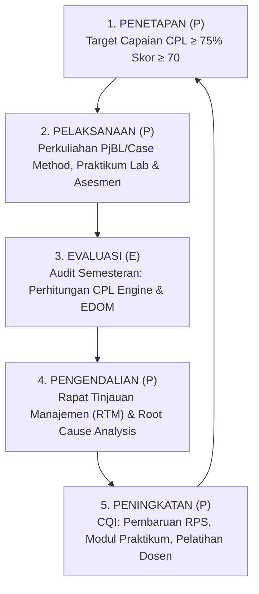

# 029 — PANDUAN SISTEM ASESMEN, EVALUASI & PENJAMINAN MUTU BERBASIS OBE (OUTCOME-BASED EDUCATION)

**Tanggal:** 18 Agustus 2026  
**Peran:** Asesor LAM INFOKOM & Arsitek Penjaminan Mutu Kurikulum  
**Standar Kepatuhan:** LAM INFOKOM (Kriteria 9), Standar Internasional IABEE/ABET, SN-Dikti Permendikbudristek No. 53/2023, dan IKU 7 (Metode Kasus & PjBL $\ge 50\%$).  
**Fungsi Dokumen:** Panduan operasional sistem asesmen, instrumen rubrik analitik, formula perhitungan ketercapaian CPL (*CPL Attainment Calculation*), dan siklus perbaikan mutu berkelanjutan (*Continuous Quality Improvement / CQI via PPEPP*).

---

## 🏛️ 1. PRINSIP DASAR & ARSITEKTUR ASESMEN OBE

Sistem penilaian Program Studi Sistem dan Teknologi Informasi (SISTEKIN) FSTI Universitas Widyagama Malang beralih secara fundamental dari **penilaian berbasis konten/ujian tradisional (*Content-Based Grading*)** menuju **penilaian berbasis ketercapaian luaran (*Outcome-Based Assessment*)**.

```
┌───────────────────────────────────────────────────────────────────────────────────────────┐
│                                ARSITEKTUR ASESMEN OBE SISTEKIN                            │
│                                                                                           │
│  [1] Profil Lulusan (PL) & PEO (3-5 Th)  ──→ Diukur via Tracer Study & Employer Survey    │
│            │                                                                              │
│  [2] 14 Capaian Pembelajaran Lulusan (CPL) ──→ Diukur via Akumulasi Portofolio CPL       │
│            │                                                                              │
│  [3] Capaian Pembelajaran MK (CPMK)      ──→ Diukur via Komposisi Asesmen MK (Σ=100%)    │
│            │                                                                              │
│  [4] Sub-CPMK (Tahapan Belajar)          ──→ Diukur via Soal Ujian, Tugas Lab, PjBL, Case │
│            │                                                                              │
│  [5] Rubrik Analitik & Skor Kinerja      ──→ Standar Deskriptor Mutu (A, B, C, D, E)     │
└───────────────────────────────────────────────────────────────────────────────────────────┘
```

### 1.1 Tiga Pilar Penilaian OBE
1. **Validitas (*Construct Validity*):** Bentuk asesmen harus secara langsung menguji kompetensi yang dirumuskan pada kata kerja Bloom Sub-CPMK (contoh: jika Sub-CPMK adalah *C6 Mengonstruksi*, asesmen wajib berbentuk produk koding/PjBL, bukan pilihan ganda).
2. **Transparansi (*Criteria-Referenced Assessment*):** Mahasiswa mengetahui kriteria penilaian sejak awal perkuliahan melalui rubrik analitik deskriptif yang tercantum pada RPS.
3. **Ketertelusuran (*Full Traceability*):** Setiap perolehan nilai mahasiswa pada tugas/ujian dapat ditelusuri kontribusinya terhadap pemenuhan CPL tertentu.

---

## 📊 2. ARSITEKTUR ASESMEN LANGSUNG (*DIRECT*) & TAK LANGSUNG (*INDIRECT*)

| Kategori Asesmen | Komponen Instrumen | Periode Pengukuran | Kontribusi Bobot Evaluasi |
|---|---|---|:---:|
| **Direct Assessment (Penilaian Langsung)** | • Nilai Tugas Lab Hands-on & Studi Kasus (*Case Method*)<br>• Nilai Proyek Terpadu Tim (*PjBL Artifact & Demo*)<br>• Nilai Soal Ujian Tengah Semester (UTS)<br>• Nilai Portofolio Proyek Akhir Semester (UAS)<br>• Nilai Capstone Project FSTI (`FST-610`)<br>• Nilai Sidang Skripsi/Tugas Akhir (`FST-714`) | Setiap Semester (Minggu 1–16) | **85%** |
| **Indirect Assessment (Penilaian Tak Langsung)** | • Kuesioner Evaluasi Dosen & MK oleh Mahasiswa (EDOM)<br>• Kuesioner Exit Survey Lulusan (Saat Yudisium)<br>• Kuesioner Tracer Study Alumni (1–3 Tahun Lulus)<br>• Kuesioner Kepuasan Pengguna Lulusan (*Employer Survey*) | Semesteran & Tahunan | **15%** |

---

## ⚖️ 3. STANDARISASI BOBOT KOMPOSISI EVALUASI MATA KULIAH (KEPATUHAN IKU 7)

Setiap mata kuliah diwajibkan menyusun komponen evaluasi yang mematuhi **Indikator Kinerja Utama (IKU 7)**, di mana bobot evaluasi berbasis **Metode Kasus (*Case Method*)** dan/atau **Pembelajaran Berbasis Proyek (*Project-Based Learning / PjBL*)** bernilai **minimal 50%**:

```
┌───────────────────────────────────────────────────────────────────────────────────────────┐
│              DISTRIBUSI BOBOT EVALUASI MATA KULIAH TEORI + PRAKTIKUM (+P)                 │
│                                                                                           │
│   1. Aktivitas Partisipatif & Case Method (Tugas/Lab Mingguan)  : 25% ──┐                  │
│   2. Proyek Terpadu Berbasis Tim (PjBL Final Project & Demo)    : 35% ──┴─→ TOTAL = 60% ✅ │
│   3. Ujian Tengah Semester (UTS - Teori & Coding Ujian)         : 20%     (IKU 7 ≥ 50%)   │
│   4. Ujian Akhir Semester (UAS - Portofolio & Ujian Akhir)      : 20%                      │
│   ─────────────────────────────────────────────────────────────────────────               │
│   TOTAL NILAI AKHIR MATA KULIAH                                 : 100%                    │
└───────────────────────────────────────────────────────────────────────────────────────────┘
```

---

## 🧮 4. FORMULA MATEMATIS PERHITUNGAN KETERCAIPAIAN CPL (*CPL ATTAINMENT*)

Sistem Informasi Akademik (SIAKAD OBE) menggunakan formula terstandar untuk menghitung nilai ketercapaian setiap CPMK dan CPL bagi setiap mahasiswa secara otomatis:

### 4.1 Perhitungan Ketercapaian CPMK Mahasiswa ($N_{\text{CPMK}_j}$)
Nilai ketercapaian CPMK ke-$j$ oleh mahasiswa dihitung berdasarkan akumulasi nilai asesmen $A_i$ yang menguji Sub-CPMK turunan dari CPMK tersebut:
$$N_{\text{CPMK}_j} = \sum_{i=1}^{m} \left( \frac{\text{Bobot } A_i}{\text{Total Bobot Asesmen CPMK}_j} \times \text{Skor } A_i \right)$$

### 4.2 Perhitungan Ketercapaian CPL Mahasiswa dari Suatu Mata Kuliah ($N_{\text{CPL}_k}^{\text{MK}}$)
Jika suatu mata kuliah membebankan beberapa CPMK untuk mendukung $\text{CPL}_k$:
$$N_{\text{CPL}_k}^{\text{MK}} = \sum_{j=1}^{p} \left( w_{jk} \times N_{\text{CPMK}_j} \right)$$
*di mana $w_{jk}$ adalah bobot kontribusi $\text{CPMK}_j$ terhadap $\text{CPL}_k$ dengan $\sum w_{jk} = 1.0$.*

### 4.3 Perhitungan Ketercapaian CPL Kumulatif Program Studi ($N_{\text{CPL}_k}^{\text{Total}}$)
Akumulasi ketercapaian $\text{CPL}_k$ seorang mahasiswa sepanjang masa studinya dihitung dari seluruh mata kuliah pengampu ($MK_1, MK_2, \dots, MK_n$) yang memetakan $\text{CPL}_k$:
$$N_{\text{CPL}_k}^{\text{Total}} = \frac{\sum_{r=1}^{n} \left( \text{SKS}_r \times N_{\text{CPL}_k}^{\text{MK}_r} \right)}{\sum_{r=1}^{n} \text{SKS}_r}$$

---

## 🎯 5. TARGET AMBANG BATAS (*THRESHOLD*) & KRITERIA KELULUSAN CPL

Program Studi menetapkan standar mutu ketercapaian (*Performance Threshold*) yang dievaluasi pada setiap akhir semester:

| Parameter Evaluasi Mutu | Ambang Batas Target Ketercapaian Minimal | Keterangan Tindakan PPEPP |
|---|:---:|---|
| **Ketercapaian CPL Individual** | Nilai Akhir CPL $\ge 70.0$ (Grade B / Skala 100) | Mahasiswa dinyatakan *Competent* pada CPL bersangkutan. |
| **Ketercapaian CPL Kohort / Angkatan** | $\ge \mathbf{75\%}$ dari total mahasiswa angkatan meraih nilai $\ge 70.0$ | Memenuhi Standar Mutu Akreditasi Unggul LAM INFOKOM. |
| **Kondisi Anomali / Warning** | Jika $< 70\%$ mahasiswa mencapai nilai $\ge 70.0$ pada suatu CPL | Wajib dilakukan *Root Cause Analysis* dan tindakan perbaikan (CQI) pada RPS semester berikutnya. |

---

## 📑 6. STANDAR INSTRUMEN RUBRIK ANALITIK OBE

Program Studi menyediakan 4 Rubrik Analitik Master yang wajib diadopsi dosen:

---

### RUBRIK 1: PENILAIAN PROYEK TERPADU TIM (PjBL / CAPSTONE)
*Digunakan untuk evaluasi Capstone Project (`FST-610`), Tugas Besar PjBL (`STI-401`, `STI-501`, `STI-504`, `STI-601`, `STI-701`).*

| Kriteria Penilaian | Bobot | Sangat Memuaskan (85–100 / A) | Memuaskan (70–84 / B) | Cukup (55–69 / C) | Kurang (<55 / D-E) |
|---|:---:|---|---|---|---|
| **1. Analisis Kebutuhan & Desain Arsitektur** | 20% | Dokumen arsitektur (UML/SAD) sangat komprehensif, modular, scalable, dan mematuhi standar industri. | Dokumen arsitektur lengkap dan terstruktur baik dengan sedikit kekurangan minor. | Dokumen arsitektur kurang lengkap, ada inkonsistensi diagram sistem. | Arsitektur tidak jelas, tidak ada perancangan formal. |
| **2. Kualitas Kode & Implementasi Fitur** | 30% | Kode bersih (*Clean Code*), modular, menerapkan prinsip SOLID/Design Pattern, bebas bug fatal, repositori Git rapi. | Kode berjalan dengan baik, sebagian besar fitur berfungsi, dokumentasi commit cukup. | Sebagian fitur belum selesai, penataan kode kurang rapi, ada bug minor. | Kode error/tidak bisa dijalankan, tidak menerapkan kaidah software engineering. |
| **3. Pengujian & Evaluasi Kinerja** | 20% | Melakukan unit test, integration test, stress test dengan metrik performa terukur dan analisis mendalam. | Melakukan pengujian fungsional dasar dengan dokumentasi hasil uji yang baik. | Pengujian hanya dilakukan sepintas tanpa pencatatan kasus uji terstandar. | Tidak ada pengujian formal (*untested system*). |
| **4. Inovasi & Nilai Kemanfaatan Produk** | 15% | Solusi sangat inovatif, mengintegrasikan AI/Cloud/IoT nyata, dan siap diadopsi pengguna/mitra. | Solusi fungsional dan relevan memecahkan masalah mitra dengan baik. | Solusi standar, fitur serupa banyak di pasaran tanpa nilai tambah. | Solusi tidak menjawab masalah, tidak aplikatif. |
| **5. Kerjasama Tim & Presentasi Produk** | 15% | Pembagian peran sangat seimbang, presentasi sangat memukau, demonstrasi live lancar dan responsif. | Kerjasama tim baik, presentasi jelas, demonstrasi produk berjalan lancar. | Dominasi individu dalam tim, presentasi kaku, demo produk ada kendala. | Tim tidak kompak, tidak siap presentasi dan demo. |

---

### RUBRIK 2: PENILAIAN STUDI KASUS (CASE METHOD)
*Digunakan untuk asesmen pemecahan masalah bisnis, etika digital, dan tata kelola TI (`FST-206`, `STI-301`, `STI-506`, `STB-03`, `STB-04`).*

| Kriteria Penilaian | Bobot | Sangat Baik (85–100 / A) | Baik (70–84 / B) | Cukup (55–69 / C) | Kurang (<55 / D-E) |
|---|:---:|---|---|---|---|
| **Identifikasi Masalah** | 25% | Mengidentifikasi akar masalah (*Root Cause*) secara holistik dan kritis. | Mengidentifikasi masalah utama dengan data pendukung yang memadai. | Identifikasi masalah hanya pada gejala permukaan (*symptoms*). | Gagal mengidentifikasi masalah esensial. |
| **Analisis Alternatif Solusi** | 35% | Membandingkan $\ge 3$ alternatif solusi dengan analisis trade-off (biaya, risiko, kelayakan teknis). | Menganalisis 2 alternatif solusi secara logis. | Hanya mengemukakan 1 alternatif tanpa komparasi kritis. | Solusi tidak didasarkan pada landasan analisis data. |
| **Rekomendasi Keputusan** | 25% | Rekomendasi aksi taktis & strategis sangat jelas, aplikatif, dan terstruktur *timeline*-nya. | Rekomendasi keputusan logis dan dapat diimplementasikan. | Rekomendasi terlalu normatif dan kurang operasional. | Rekomendasi tidak realistis atau tidak relevan. |
| **Artikulasi Argumentasi** | 15% | Argumentasi lisan/tulisan sangat sistematis, persuasif, dan berbasis data empiris. | Argumentasi terstruktur dengan baik dan mudah dipahami. | Argumentasi kurang runtut, minim rujukan data. | Argumentasi tidak logis dan membingungkan. |

---

### RUBRIK 3: PENILAIAN SIDANG SKRIPSI / TUGAS AKHIR (`FST-714`)
*Digunakan oleh Dewan Penguji Sidang Pendadaran Sarjana SISTEKIN.*

| Komponen Penilaian | Bobot | Indikator Mutu |
|---|:---:|---|
| **1. Kualitas Naskah Skripsi** | 30% | Orisinalitas riset, ketajaman state-of-the-art, ketepatan metodologi, analisis hasil empiris, dan kepatuhan tata tulis baku IEEE/APA. |
| **2. Kualitas Artefak Produk / Sistem** | 35% | Kompleksitas rekayasa, fungsionalitas sistem terintegrasi (AI/Cloud/Platform), keandalan uji coba, dan kontribusi nyata solusi. |
| **3. Penguasaan Materi & Teori** | 20% | Kemampuan menjawab pertanyaan saintifik penguji, pemahaman mendalam algoritma/arsitektur terkait, dan penalaran logis. |
| **4. Presentasi & Sikap Akademik** | 15% | Efektivitas media presentasi, kejelasan tutur lisan, ketepatan alokasi waktu (15 menit), serta etika dan integritas profesional. |

---

## 🔄 7. SIKLUS PENJAMINAN MUTU BERKELANJUTAN (PPEPP / CQI)



1. **Penetapan (*P*):** Program Studi bersama Tim Kurikulum menetapkan rumusan 14 CPL, pemetaan MK, dan target ketercapaian minimal ($\ge 75\%$ mahasiswa meraih nilai $\ge 70$).
2. **Pelaksanaan (*P*):** Dosen menyelenggarakan pembelajaran berbasis RPS (Case Method & PjBL $\ge 50\%$) dan menginput nilai rincian Sub-CPMK ke SIAKAD OBE.
3. **Evaluasi (*E*):** Unit Penjaminan Mutu Prodi (UPMP) dan Gugus Kendali Mutu (GKM) merekap matriks ketercapaian CPL per mata kuliah dan per kohort angkatan pada setiap akhir semester.
4. **Pengendalian (*P*):** Jika ditemukan ada CPL atau mata kuliah dengan tingkat kelulusan CPL $< 70\%$, dilakukan **Rapat Tinjauan Manajemen (RTM)** untuk mencari akar permasalahan (*metode ajar, sarana lab, prasyarat, atau tingkat kesulitan asesmen*).
5. **Peningkatan (*P*):** Program studi menerbitkan **Rencana Tindak Lanjut CQI** (*Continuous Quality Improvement*) berupa revisi modul ajar, penambahan tutorial asisten laboratorium, pembaharuan studi kasus pada RPS, atau penyesuaian strategi pembelajaran di semester berikutnya.

---

## 📄 8. OUTPUT PORTOFOLIO MAHASISWA: TRANSKRIP CAPAIAN CPL (SKPI)

Sebagai bukti autentik implementasi OBE kepada mahasiswa, orang tua, dan calon pengguna lulusan (*employers*), setiap lulusan Program Studi SISTEKIN akan menerima **Transkrip Capaian CPL (Radar Chart Portofolio OBE)** yang dilampirkan bersama **Surat Keterangan Pendamping Ijazah (SKPI)**:

```
                  CONTOH PROFIL RADAR KETERCAPAIAN CPL LULUSAN
                                    
                                     S1 (Etika)
                                       [90%]
                 KK6 (Startup) ─── 100 ─── KU1 (Problem Solving)
                    [85%]        /     \        [88%]
                               /         \
            KK5 (Platform) ── 80          80 ── KU2 (Komunikasi/English)
                [82%]        /             \        [78%]
                            /               \
         KK4 (Security) ── 60               60 ── KU3 (Manajemen Tim)
             [75%]          \               /         [85%]
                             \             /
           KK3 (Cloud/IoT) ── 40          40 ── P1 (Matematika Komputasi)
               [86%]         \         /        [76%]
                               \     /
                 KK2 (Data/BI) ─── 20 ─── P2 (Sistem Informasi & AI)
                    [84%]          |          [88%]
                                   |
                             KK1 (Model AI)
                                 [92%]
```

---

*Panduan Asesmen dan Evaluasi OBE ini merupakan instrumen resmi penjaminan mutu akademik Program Studi SISTEKIN FSTI Universitas Widyagama Malang dan menjadi acuan operasional seluruh sivitas akademika.*
