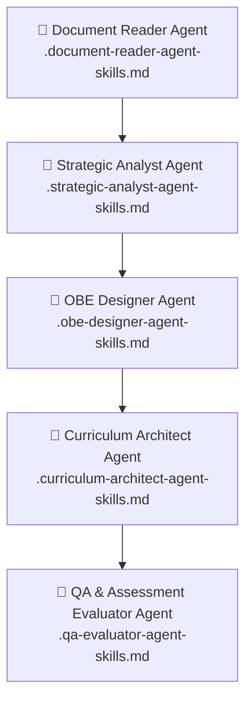

# KURIKULUM2026_ZCODE — MEMORY & MASTER INDEX AGENTIC AI

**Project:** Penyusunan Buku Kurikulum OBE Program Studi **Sistem dan Teknologi Informasi (SISTEKIN)**  
**Institusi:** FSTI — Universitas Widyagama Malang  
**Tanggal Update Index:** 12 Agustus 2026  
**Status:** DALAM PENGEMBANGAN — Fase Analisis, Revisi Struktur & Perancangan OBE Devices  
**Fungsi Dokumen:** Master Index, Konteks Workspace, Memory System & Navigasi Agentic AI  

---

> [!IMPORTANT]
> **PANDUAN UTAMA MEMORI AGENTIC AI**  
> Setiap AI Agent (Main Agent maupun Sub-Agent) yang bekerja pada workspace ini **WAJIB** membaca dokumen `README.md` dan [AGENTS.md](file:///d:/!!MYDOCUMENTS2026/!!!SISTEKIN2026/!!BRAINSTORMING_KURIKULUM2026/AGENTS.md) terlebih dahulu sebelum mengakses atau memodifikasi file lainnya. Dokumen ini bertindak sebagai *single source of truth for workspace layout and project state*.

---

## 1. VISUAL POHON STRUKTUR WORKSPACE (WORKSPACE TREE INDEX)

Berikut adalah struktur lengkap folder dan file dalam workspace `!!BRAINSTORMING_KURIKULUM2026`:

```
!!BRAINSTORMING_KURIKULUM2026/
├── README.md                                         ← [FILE INI] Master Index & Memory System
├── AGENTS.md                                         ← Rules, Handoff & Persona Agentic AI
├── .strategic-analyst-agent-skills.md                ← 🤖 Sub-Agent 1: Strategic Analyst
├── .obe-designer-agent-skills.md                     ← 🤖 Sub-Agent 2: OBE Designer
├── .curriculum-architect-agent-skills.md             ← 🤖 Sub-Agent 3: Curriculum Architect
├── .qa-evaluator-agent-skills.md                     ← 🤖 Sub-Agent 4: QA & Assessment Evaluator
├── .document-reader-agent-skills.md                  ← 🤖 Sub-Agent 5: Document Reader
├── 019_SURVEY_PEMETAAN_DAN_ANALISIS_REKOMENDASI...md ← Rekomendasi Improvement & Asesmen
│
├── KURIKULUM2026_ZCODE/                              ← 📂 DIREKTORI UTAMA DOKUMEN KURIKULUM 2026
│   ├── 001_LAPORAN_GAP_ANALYSIS_KURIKULUM2025_SISTEKIN.md
│   ├── 002_INSIGHT_KELEMAHAN_KURIKULUM2025_vs_BUKU_OBE.md
│   ├── 003_STRUKTUR_KURIKULUM2025_SISTEKIN_SAAT_INI.md
│   ├── 004_REKOMENDASI_REVISI_STRUKTUR_KURIKULUM2025_SISTEKIN.md
│   ├── 005_STRUKTUR_REVISI_KURIKULUM_SISTEKIN_8_SEMESTER.md
│   ├── 006_KEPUTUSAN_FINAL_ARAH_KURIKULUM_SISTEKIN.md  ← 🔑 DOKUMEN KUNCI VMTS & 5 PL
│   ├── 007_BEDAH_STRUKTUR_KURIKULUM_SISTEKIN.md
│   ├── 008_LANGKAH1_PROFIL_LULUSAN_PEO.md
│   ├── 009A_CPL_SIKAP_SISTEKIN.md
│   ├── 009B_CPL_KETERAMPILAN_UMUM_SISTEKIN.md
│   ├── 009C_CPL_PENGETAHUAN_SISTEKIN.md
│   ├── 009D_CPL_KETERAMPILAN_KHUSUS_SISTEKIN.md
│   ├── 009E_RINGKASAN_CPL_LENGKAP_PEMETAAN_BoK.md
│   ├── 009_LANGKAH2_CPL_FORMAL.md
│   ├── 010_KOMPILASI_CPL_KE_STRUKTUR_KURIKULUM.md
│   ├── 011_STRUKTUR_KURIKULUM_TABEL.md               ← 🔑 DOKUMEN KUNCI Tabel 8 Sem & SKS
│   ├── 012_MATRIKS_CPL_vs_MK.md                      ← Matriks CPL x MK
│   ├── 013_KURIKULUM_SEMESTER_GANJIL_PRAKTIKUM.md    ← Daftar MK Praktikum Ganjil (.md & .docx)
│   ├── 014_ANALISIS_IOT_POSISI_KURIKULUM.md          ← Integrasi IoT dalam Kurikulum
│   ├── 015_PERBANDINGAN_KURIKULUM_2025_vs_2026.md    ← Perbandingan Komprehensif
│   ├── 016_KETENTUAN_MPKM_20SKS_DAN_PRASYARAT.md      ← Skema MBKM & Prasyarat
│   ├── 017_VERIFIKASI_GROUND_TRUTH_KURIKULUM2025.md  ← Verifikasi Data SIAKAD
│   ├── 018_AUDIT_TRAIL_PERBAIKAN_DOKUMEN.md          ← Log Perubahan Dokumen
│   └── 019_SURVEY_PEMETAAN_DAN_ANALISIS_REKOMENDASI...md
│
├── KURIKULUM2025/                                    ← 📂 GROUND TRUTH DOKUMEN RESMI (SIAKAD & UPPS)
│   ├── Laporan Daftar Kurikulum Prodi Sistekin.pdf   ← 🔑 GROUND TRUTH (56 MK, 146 SKS SIAKAD)
│   ├── Implementasi_MODUL_OBE_SISTEKIN2025.pdf
│   ├── Notulensi Rapat VMTS & Kurikulum Program Studi SIST 090626.pdf ← Notulensi VMTS 09-06-2026
│   └── [IA - UPPS] 05 Juni 2025 (Kompilasi) INSTRUMEN PEMENUHAN SYARAT...pdf
│
├── BUKU_OBE/                                         ← 📂 PANDUAN PENGEMBANGAN KURIKULUM RESMI (APTIKOM)
│   ├── OBE_SISTEM_INFORMASI_2.0_APTIKOM_...pdf       ← 🔑 ACUAN UTAMA (SI v2.0 / IS2020)
│   ├── 716903001-PANDUAN-KURIKULUM-OBE-PRODI-S1-TI-2023.pdf ← Acuan TI 2023 (IT2017)
│   ├── 839193049-Buku-Kurikulum-Prodi-S1-Informatika-...pdf
│   ├── 900015055-Buku-Kurikulum-Prodi-S1-Perangkat-Lunak-...pdf
│   └── Buku Kurikulum Prodi S1 Sains Data Versi 1.0.pdf
│
├── SURVEY_PEMETAAN2026/                              ← 📂 DOKUMEN RISET, SURVEY & SILABUS
│   ├── cek struktur kurikulum PRODI STI_SISTEKIN dari sem.md
│   ├── Lakukan pemetaan mendalam terhadap profil lulusan SISTEKIN.md
│   ├── lakukan survey dan pemetaan mendalam, analisis Ext INt SISTEKIM.md
│   ├── lakukan survey dan pemetaan mendalam, analisis eva.pdf & .md (TELOS & PIECES)
│   ├── lakukan survey dan pemetaan mendalam,analisis mend SISTEKIN.pdf & Profil Lulusan.md
│   ├── laporan-komparatif-sistekin-hibrida-si-ti-aptikom SISTEKIN.md & .pdf
│   ├── laporan-riset-pemetaan-profil-lulusan-sistekin-hibrida-si-ti-... (.docx, .pdf, .md)
│   └── silabus MK semua prodi STI_SISTEKIN termasuk CPL O.md ( & (1).md)
│
├── workspace-019fd6ce-5d91-7232-8f6f-8cbe0a0b9b2b (1)/  ← 📂 WORKSPACE ANALISIS TAMBAHAN
│   ├── AWAL/                                         ← Draft awal pemetaan APTIKOM & SIAKAD
│   │   ├── 001_Summary_Pemetaan_Prodi_STI_APTIKOM_01082026.md
│   │   ├── 002_Detail_Pemetaan_CPL_dan_Profil_Lulusan_APTIKOM_01082026.md
│   │   ├── 003_Rekomendasi_Konsentrasi_STI_APTIKOM_01082026.md
│   │   ├── 004_Kurikulum_Lengkap_STI_144SKS_dan_150SKS_01082026.md
│   │   ├── 005_Komprehensif_Kurikulum_STI_dan_Konsentrasi_01082026.md
│   │   ├── 006_Master_Detail_Seluruh_Respon_Diskusi_STI_APTIKOM_01082026.md
│   │   ├── Laporan Daftar Kurikulum Prodi Sistekin.pdf
│   │   ├── Notulensi Rapat VMTS & Kurikulum Program Studi SIST 090626.pdf
│   │   ├── kurikulum_sistekin_text.txt
│   │   └── vmts_full_text.txt & vmts_text.txt
│   ├── analisis_mk_sistekin.md                       ← ⚠️ CACAT METODOLOGI (Lihat Bab 6)
│   ├── analisis_vmts_sistekin.md                     ← ⚠️ CACAT METODOLOGI (Lihat Bab 6)
│   ├── 17_cpl_tidak_terlalu_banyak.md
│   ├── asesmen_obe_4_komponen.md
│   ├── bahasa_marketable_malang_raya.md
│   ├── dt_lead_dt_strategy.md
│   ├── ebook_sti_analysis.md (.pdf, .tex)
│   ├── generate_pdf.py
│   ├── obc_abc_cpl_cpmk.md
│   └── smart_information_system_dan_smart_city.md
│
└── workspace-019fd9ef-e1bb-789c-9830-d09f55b00335/  ← 📂 EKSTRAKSI TEKS BUKU OBE APTIKOM
    ├── 642302046-13-jan-2023-BUKU-KURIKULUM-Sistem-Informasi-BERBASIS-OBE.txt
    ├── 716903001-PANDUAN-KURIKULUM-OBE-PRODI-S1-TEKNOLOGI-INFORMASI-2023.txt
    ├── OBE_SISTEM_INFORMASI_2.0_APTIKOM_837172072-S1-SI-APTIKOM.txt
    ├── vmts_sist.txt
    └── uploads/                                     ← Copy file PDF acuan
```

---

## 2. DETAIL INDEX DOKUMEN UTAMA (`KURIKULUM2026_ZCODE/`)

Direktori `KURIKULUM2026_ZCODE/` menyimpan seluruh dokumen perancangan kurikulum 2026 yang terstruktur per fase pengembangan OBE:

### Fase 0 — Evaluasi Kurikulum 2025 & Gap Analysis

| File | Deskripsi & Peran Memory AI |
|------|-----------------------------|
| [001_LAPORAN_GAP_ANALYSIS_KURIKULUM2025_SISTEKIN.md](file:///d:/!!MYDOCUMENTS2026/!!!SISTEKIN2026/!!BRAINSTORMING_KURIKULUM2026/KURIKULUM2026_ZCODE/001_LAPORAN_GAP_ANALYSIS_KURIKULUM2025_SISTEKIN.md) | Gap analysis Kurikulum 2025 vs 12 elemen Buku OBE APTIKOM. *(Catatan: Abaikan skor kuantitatif 47.5%)*. |
| [002_INSIGHT_KELEMAHAN_KURIKULUM2025_vs_BUKU_OBE.md](file:///d:/!!MYDOCUMENTS2026/!!!SISTEKIN2026/!!BRAINSTORMING_KURIKULUM2026/KURIKULUM2026_ZCODE/002_INSIGHT_KELEMAHAN_KURIKULUM2025_vs_BUKU_OBE.md) | Identifikasi 10 kelemahan utama Kurikulum 2025 berdasar bukti empiris & standar APTIKOM. |
| [003_STRUKTUR_KURIKULUM2025_SISTEKIN_SAAT_INI.md](file:///d:/!!MYDOCUMENTS2026/!!!SISTEKIN2026/!!BRAINSTORMING_KURIKULUM2026/KURIKULUM2026_ZCODE/003_STRUKTUR_KURIKULUM2025_SISTEKIN_SAAT_INI.md) | Potret struktur Kurikulum 2025 (56 MK, 146 SKS) sesuai SIAKAD berjalan. |
| [004_REKOMENDASI_REVISI_STRUKTUR_KURIKULUM2025_SISTEKIN.md](file:///d:/!!MYDOCUMENTS2026/!!!SISTEKIN2026/!!BRAINSTORMING_KURIKULUM2026/KURIKULUM2026_ZCODE/004_REKOMENDASI_REVISI_STRUKTUR_KURIKULUM2025_SISTEKIN.md) | 8 rekomendasi strategis revisi struktur (SKS rebalancing, reposisi MK, peminatan). |
| [005_STRUKTUR_REVISI_KURIKULUM_SISTEKIN_8_SEMESTER.md](file:///d:/!!MYDOCUMENTS2026/!!!SISTEKIN2026/!!BRAINSTORMING_KURIKULUM2026/KURIKULUM2026_ZCODE/005_STRUKTUR_REVISI_KURIKULUM_SISTEKIN_8_SEMESTER.md) | Draft awal struktur revisi 8 semester pasca rebalancing SKS. |

### Fase 1 & 2 — VMTS, Profil Lulusan, PEO & CPL Formal

| File | Deskripsi & Peran Memory AI |
|------|-----------------------------|
| [006_KEPUTUSAN_FINAL_ARAH_KURIKULUM_SISTEKIN.md](file:///d:/!!MYDOCUMENTS2026/!!!SISTEKIN2026/!!BRAINSTORMING_KURIKULUM2026/KURIKULUM2026_ZCODE/006_KEPUTUSAN_FINAL_ARAH_KURIKULUM_SISTEKIN.md) | **DOKUMEN KUNCI UTAMA** — Memuat Visi 2045 (AI/Smart Systems + Technopreneurship), 5 Profil Lulusan, 14 CPL, 3 Peminatan, dan aturan SKS. |
| [007_BEDAH_STRUKTUR_KURIKULUM_SISTEKIN.md](file:///d:/!!MYDOCUMENTS2026/!!!SISTEKIN2026/!!BRAINSTORMING_KURIKULUM2026/KURIKULUM2026_ZCODE/007_BEDAH_STRUKTUR_KURIKULUM_SISTEKIN.md) | Bedah rasio MKU (6 MK/14 SKS), MK FST (11 MK/32 SKS), MK STI (33 MK/101 SKS), dan MK Pilihan (18 MK/54 SKS). |
| [008_LANGKAH1_PROFIL_LULUSAN_PEO.md](file:///d:/!!MYDOCUMENTS2026/!!!SISTEKIN2026/!!BRAINSTORMING_KURIKULUM2026/KURIKULUM2026_ZCODE/008_LANGKAH1_PROFIL_LULUSAN_PEO.md) | Rincian 5 Profil Lulusan & PEO terukur 3-5 tahun pasca kelulusan. |
| [009A_CPL_SIKAP_SISTEKIN.md](file:///d:/!!MYDOCUMENTS2026/!!!SISTEKIN2026/!!BRAINSTORMING_KURIKULUM2026/KURIKULUM2026_ZCODE/009A_CPL_SIKAP_SISTEKIN.md) | Rumusan CPL Kategori Sikap (S1) berdasar Permendikbudristek 53/2023. |
| [009B_CPL_KETERAMPILAN_UMUM_SISTEKIN.md](file:///d:/!!MYDOCUMENTS2026/!!!SISTEKIN2026/!!BRAINSTORMING_KURIKULUM2026/KURIKULUM2026_ZCODE/009B_CPL_KETERAMPILAN_UMUM_SISTEKIN.md) | Rumusan CPL Kategori Keterampilan Umum (KU1, KU2, KU3). |
| [009C_CPL_PENGETAHUAN_SISTEKIN.md](file:///d:/!!MYDOCUMENTS2026/!!!SISTEKIN2026/!!BRAINSTORMING_KURIKULUM2026/KURIKULUM2026_ZCODE/009C_CPL_PENGETAHUAN_SISTEKIN.md) | Rumusan CPL Kategori Pengetahuan (P1, P2, P3, P4) merujuk BoK APTIKOM IS2020/IT2017. |
| [009D_CPL_KETERAMPILAN_KHUSUS_SISTEKIN.md](file:///d:/!!MYDOCUMENTS2026/!!!SISTEKIN2026/!!BRAINSTORMING_KURIKULUM2026/KURIKULUM2026_ZCODE/009D_CPL_KETERAMPILAN_KHUSUS_SISTEKIN.md) | Rumusan CPL Kategori Keterampilan Khusus (KK1 s/d KK6) berbasis smart technology. |
| [009E_RINGKASAN_CPL_LENGKAP_PEMETAAN_BoK.md](file:///d:/!!MYDOCUMENTS2026/!!!SISTEKIN2026/!!BRAINSTORMING_KURIKULUM2026/KURIKULUM2026_ZCODE/009E_RINGKASAN_CPL_LENGKAP_PEMETAAN_BoK.md) | Pemetaan komprehensif 14 CPL ke Body of Knowledge APTIKOM (BK01-BK19). |
| [009_LANGKAH2_CPL_FORMAL.md](file:///d:/!!MYDOCUMENTS2026/!!!SISTEKIN2026/!!BRAINSTORMING_KURIKULUM2026/KURIKULUM2026_ZCODE/009_LANGKAH2_CPL_FORMAL.md) | Sintesis CPL formal 4 kategori dengan standar taksonomi Bloom. |

### Fase 3 s/d 5 — Pemetaan Matriks, Struktur 8 Sem, MBKM & Audit

| File | Deskripsi & Peran Memory AI |
|------|-----------------------------|
| [010_KOMPILASI_CPL_KE_STRUKTUR_KURIKULUM.md](file:///d:/!!MYDOCUMENTS2026/!!!SISTEKIN2026/!!BRAINSTORMING_KURIKULUM2026/KURIKULUM2026_ZCODE/010_KOMPILASI_CPL_KE_STRUKTUR_KURIKULUM.md) | Pemetaan distribusi CPL ke mata kuliah per semester. |
| [011_STRUKTUR_KURIKULUM_TABEL.md](file:///d:/!!MYDOCUMENTS2026/!!!SISTEKIN2026/!!BRAINSTORMING_KURIKULUM2026/KURIKULUM2026_ZCODE/011_STRUKTUR_KURIKULUM_TABEL.md) | **DOKUMEN KUNCI UTAMA** — Tabel operasional 8 semester lengkap (Kode, MK, SKS, Teori/Praktik, Prasyarat, CPL). |
| [012_MATRIKS_CPL_vs_MK.md](file:///d:/!!MYDOCUMENTS2026/!!!SISTEKIN2026/!!BRAINSTORMING_KURIKULUM2026/KURIKULUM2026_ZCODE/012_MATRIKS_CPL_vs_MK.md) | Matriks cross-reference CPL (14 CPL) × Seluruh Mata Kuliah. |
| [013_KURIKULUM_SEMESTER_GANJIL_PRAKTIKUM.md](file:///d:/!!MYDOCUMENTS2026/!!!SISTEKIN2026/!!BRAINSTORMING_KURIKULUM2026/KURIKULUM2026_ZCODE/013_KURIKULUM_SEMESTER_GANJIL_PRAKTIKUM.md) | Rincian MK praktikum & beban laboratorium semester ganjil (tersedia versi `.md` dan `.docx`). |
| [014_ANALISIS_IOT_POSISI_KURIKULUM.md](file:///d:/!!MYDOCUMENTS2026/!!!SISTEKIN2026/!!BRAINSTORMING_KURIKULUM2026/KURIKULUM2026_ZCODE/014_ANALISIS_IOT_POSISI_KURIKULUM.md) | Analisis penempatan Internet of Things (IoT) & Smart Technology pada Peminatan P2. |
| [015_PERBANDINGAN_KURIKULUM_2025_vs_2026.md](file:///d:/!!MYDOCUMENTS2026/!!!SISTEKIN2026/!!BRAINSTORMING_KURIKULUM2026/KURIKULUM2026_ZCODE/015_PERBANDINGAN_KURIKULUM_2025_vs_2026.md) | Analisis komparatif delta perubahan Kurikulum 2025 vs Kurikulum 2026. |
| [016_KETENTUAN_MPKM_20SKS_DAN_PRASYARAT.md](file:///d:/!!MYDOCUMENTS2026/!!!SISTEKIN2026/!!BRAINSTORMING_KURIKULUM2026/KURIKULUM2026_ZCODE/016_KETENTUAN_MPKM_20SKS_DAN_PRASYARAT.md) | Aturan ekuivalensi MBKM maks 20 SKS di Sem 6-7 & peta jaringan prasyarat MK. |
| [017_VERIFIKASI_GROUND_TRUTH_KURIKULUM2025.md](file:///d:/!!MYDOCUMENTS2026/!!!SISTEKIN2026/!!BRAINSTORMING_KURIKULUM2026/KURIKULUM2026_ZCODE/017_VERIFIKASI_GROUND_TRUTH_KURIKULUM2025.md) | Verifikasi kesesuaian dokumen draft dengan data resmi SIAKAD 2025. |
| [018_AUDIT_TRAIL_PERBAIKAN_DOKUMEN.md](file:///d:/!!MYDOCUMENTS2026/!!!SISTEKIN2026/!!BRAINSTORMING_KURIKULUM2026/KURIKULUM2026_ZCODE/018_AUDIT_TRAIL_PERBAIKAN_DOKUMEN.md) | Chronological audit trail perbaikan nama MK, reposisi SKS, & penambahan MK Jaringan Komputer/ISIM. |
| [019_SURVEY_PEMETAAN_DAN_ANALISIS_REKOMENDASI_IMPROVEMENT_KURIKULUM2026.md](file:///d:/!!MYDOCUMENTS2026/!!!SISTEKIN2026/!!BRAINSTORMING_KURIKULUM2026/KURIKULUM2026_ZCODE/019_SURVEY_PEMETAAN_DAN_ANALISIS_REKOMENDASI_IMPROVEMENT_KURIKULUM2026.md) | Rekomendasi perbaikan struktur dari asesmen eksternal & redistribusi SKS Sem 1-2. |

---

## 3. PANDUAN SUB-AGENT SKILLS SYSTEM (HANDOFF ARCHITECTURE)

Workspace ini memiliki 5 definisi Sub-Agent Skills (terletak di root folder) untuk eksekusi tugas khusus secara terpisah dan efisien:



### Rincian Sub-Agent Skills

| # | File Skill | Agent Name | Peran & Tugas Utama | Pemicu Workflow |
|---|------------|------------|---------------------|-----------------|
| 1 | [.strategic-analyst-agent-skills.md](file:///d:/!!MYDOCUMENTS2026/!!!SISTEKIN2026/!!BRAINSTORMING_KURIKULUM2026/.strategic-analyst-agent-skills.md) | **Strategic Analyst** | Environmental Scanning, SWOT, Penyelarasan VMTS Universitas/Fakultas ke Prodi. | Langkah 0.1, 0.2 |
| 2 | [.obe-designer-agent-skills.md](file:///d:/!!MYDOCUMENTS2026/!!!SISTEKIN2026/!!BRAINSTORMING_KURIKULUM2026/.obe-designer-agent-skills.md) | **OBE Designer** | Perancangan Profil Lulusan, PEO terukur 3-5 tahun, Rumusan CPL 4 Kategori (S, KU, P, KK) & Taksonomi Bloom/ABCD. | Langkah 1, 2 |
| 3 | [.curriculum-architect-agent-skills.md](file:///d:/!!MYDOCUMENTS2026/!!!SISTEKIN2026/!!BRAINSTORMING_KURIKULUM2026/.curriculum-architect-agent-skills.md) | **Curriculum Architect** | Matriks BoK APTIKOM (BK01-BK19), Struktur MK 8 Semester, Distribusi SKS (≤20/sem), Peminatan, & Skema MBKM. | Langkah 3, 4 |
| 4 | [.qa-evaluator-agent-skills.md](file:///d:/!!MYDOCUMENTS2026/!!!SISTEKIN2026/!!BRAINSTORMING_KURIKULUM2026/.qa-evaluator-agent-skills.md) | **QA & Assessment Evaluator** | Perancangan Rubrik Asesmen OBE, Portofolio CPL, Opsi TA Non-Skripsi (Capstone Design), & Siklus PPEPP. | Langkah 5 |
| 5 | [.document-reader-agent-skills.md](file:///d:/!!MYDOCUMENTS2026/!!!SISTEKIN2026/!!BRAINSTORMING_KURIKULUM2026/.document-reader-agent-skills.md) | **Document Reader** | Ekstraksi teks, sintesis, & verifikasi fakta dari dokumen PDF, Word, MD, dan SIAKAD. | Semua Langkah (Support) |

---

## 4. GROUND TRUTH & DOKUMEN ACUAN RESMI

### 4.1 Ground Truth Kurikulum Berjalan (`KURIKULUM2025/`)
* **`Laporan Daftar Kurikulum Prodi Sistekin.pdf`**: Ground Truth Resmi dari SIAKAD (56 Mata Kuliah, Total 146 SKS). Didownload pada 05 Agustus 2026.
* **`Implementasi_MODUL_OBE_SISTEKIN2025.pdf`**: Modul implementasi kurikulum OBE 2025.
* **`Notulensi Rapat VMTS & Kurikulum Program Studi SIST 090626.pdf`**: Berita Acara & Notulensi Rapat Penetapan VMTS dan 5 Profil Lulusan tanggal 09 Juni 2026.
* **`[IA - UPPS] 05 Juni 2025 (Kompilasi) INSTRUMEN PEMENUHAN SYARAT...pdf`**: Dokumen akreditasi UPPS.

### 4.2 Panduan Standar Kurikulum APTIKOM (`BUKU_OBE/`)
* **`OBE_SISTEM_INFORMASI_2.0_APTIKOM_...pdf`**: **ACUAN UTAMA** — Buku Panduan OBE Prodi S1 Sistem Informasi v2.0 (2024) berbasis ACM/IEEE IS2020.
* **`716903001-PANDUAN-KURIKULUM-OBE-PRODI-S1-TEKNOLOGI-INFORMASI-2023.pdf`**: Acuan Pendukung — Panduan Kurikulum OBE Prodi S1 Teknologi Informasi (2023) berbasis IT2017/CC2020.
* **`839193049-Buku-Kurikulum-Prodi-S1-Informatika-atau-Ilmu-Komputer-Versi-2-0-aptikom.pdf`**: Referensi Silabus Ilmu Komputer/Informatika v2.0.
* **`900015055-Buku-Kurikulum-Prodi-S1-Perangkat-Lunak-Versi-1-0.pdf`**: Referensi Rekayasa Perangkat Lunak v1.0.
* **`Buku Kurikulum Prodi S1 Sains Data Versi 1.0.pdf`**: Referensi Kurikulum Sains Data v1.0.

---

## 5. REKAPITULASI MEMORI KEPUTUSAN KUNCI PRODI SISTEKIN

Setiap Agent wajib mematuhi keputusan yang telah ditetapkan bersama tim kurikulum pada rapat 09 Juni 2026:

### 5.1 Visi Prodi (VMTS 2045)
> *"Menjadi Program Studi Sistem dan Teknologi Informasi yang unggul dalam pengembangan sistem dan teknologi informasi cerdas terintegrasi kecerdasan artifisial, serta technopreneurship berbasis kebutuhan masyarakat dan industri pada tahun 2045."*

### 5.2 5 Profil Lulusan Ditetapkan (PL1 – PL5)
1. **PL1: Intelligent Information System Developer** (Pengembang Sistem Informasi Cerdas)
2. **PL2: UX & Digital Service Designer** (Perancang Antarmuka & Layanan Digital)
3. **PL3: Smart Technology Integrator** (Integrator Teknologi Cerdas & Infrastruktur Digital)
4. **PL4: Technopreneur in Smart Information Services** (Wirausahawan Teknologi Informasi Cerdas)
5. **PL5: Digital Governance & System Analyst** (Analis Sistem & Tata Kelola Teknologi Informasi)

### 5.3 3 Peminatan Berbasis BoK APTIKOM
* **Peminatan 1 (P1):** *Smart Information Systems & Data Analytics* (Sistem Cerdas & Analitik Data)
* **Peminatan 2 (P2):** *Cloud Infrastructure & Cybersecurity* (Infrastruktur Cloud & Keamanan Digital)
* **Peminatan 3 (P3):** *Digital Service & Technopreneurship* (Layanan Digital & Technopreneurship)

### 5.4 Struktur Beban SKS & Aturan Matrikulasi

```
MKU (Wajib Universitas):         14 SKS ( 6 MK)
FST (Wajib Fakultas):            32 SKS (11 MK)
STI (Wajib Prodi):              101 SKS (33 MK, incl ISIM)
-----------------------------------------------
TOTAL WAJIB:                    147 SKS (50 MK)

Pilihan Peminatan (diambil 9):   27 SKS ( 9 MK @ 3 SKS)
===============================================
TOTAL SYARAT GRADUASI:         174 SKS (59 MK)
```

> [!NOTE]
> * Mahasiswa menempuh **147 SKS Wajib** + **27 SKS Pilihan Peminatan** = **174 SKS Total**.
> * MK 0 SKS (`Agama II`, `Kewirausahaan II`) adalah kebijakan Universitas UWG dan **wajib dipertahankan** tanpa merubah bobot SKS.
> * Capstone Design Lintas Prodi (SISTEKIN + Bisnis Digital + Teknik Informatika) ditetapkan sebagai default Tugas Akhir menggantikan skripsi konvensional.

---

## 6. PRINSIP ANTI-HALUSINASI & KOREKSI METODOLOGIS

> [!WARNING]
> **KOREKSI PENTING DOKUMEN INTERNAL `analisis_*`**
> 
> Dokumen `workspace-.../analisis_vmts_sistekin.md` dan `analisis_mk_sistekin.md` menyimpulkan bahwa VMTS Kurikulum 2025 "TIDAK LAYAK (47.5%)" dan mencoba membelokkan arah prodi ke Enterprise Architecture (EA). 
> 
> Kesimpulan tersebut **SALAH SECARA METODOLOGIS** karena:
> 1. Mengukur kesesuaian VMTS dengan standar buatan sendiri yang mengharuskan Enterprise Architecture sebagai core.
> 2. Buku Kurikulum OBE APTIKOM SI v2.0 **tidak mewajibkan** Enterprise Architecture sebagai standar tunggal (EA hanya bagian dari BK16/Pendukung).
> 3. Bidang *AI / Smart Systems / Data Analytics* adalah Body of Knowledge yang sah (BK13, BK18, dan Intelligent Systems) sesuai standar IEEE/ACM CC2020 & APTIKOM.
> 
> **ATURAN:** AI Agent **DILARANG** mengutip atau menggunakan skor `47.5%`, `57.1%`, atau `100%` dari kedua dokumen tersebut. Arah prodi **AI/Smart Systems + Technopreneurship** adalah KEPUTUSAN FINAL REAKSIF RAPAT 09 JUNI 2026.

---

## 7. URUTAN EKSEKUSI WORKFLOW BERTAHAP (MASTER WORKFLOW)

Agentic AI **DILARANG** mengerjakan seluruh dokumen sekaligus dalam satu siklus. Setiap langkah harus dikonfirmasikan kepada user:

```
[Langkah 0.1] Environmental Scanning (Tren Industri IT & Posisi Strategis)
      │
[Langkah 0.2] Analisis SWOT & Turunan VMTS Universitas/Fakultas
      │
[Langkah 1]   Profil Lulusan & PEO (Program Educational Objectives)
      │
[Langkah 2]   CPL Formal 4 Kategori (S, KU, P, KK) + Taksonomi Bloom
      │
[Langkah 3]   Matriks Body of Knowledge (BoK APTIKOM BK01-BK19) ↔ CPL ↔ MK
      │
[Langkah 4]   Struktur Kurikulum 8 Semester (Beban ≤20 SKS/sem) & Skema MBKM 20 SKS
      │
[Langkah 5]   Opsi Tugas Akhir Non-Skripsi (Capstone Design) & Asesmen OBE (PPEPP)
```

---

*Dokumen README.md ini telah direvisi dan diselaraskan untuk menjadi memori kerja utama bagi Agentic AI dalam menyusun Buku Kurikulum OBE SISTEKIN UWG Malang.*
